# 新七工具 - 统计抽样与检查 - P1 - 慧翔天地软考 - BV17k4y1E7FD

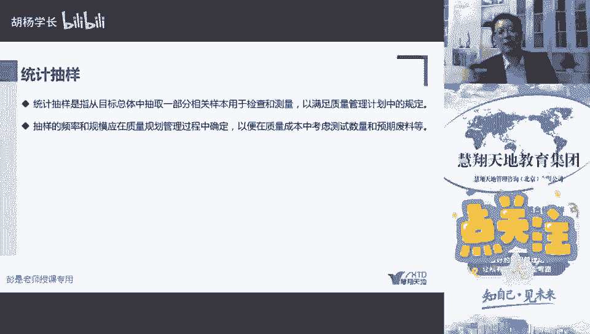

统计抽样就书上关于就这么。

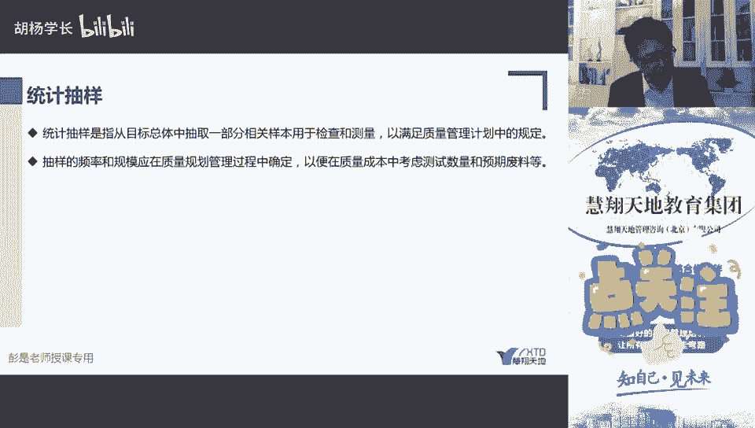

就这么两两段两小段，大，同理说，压是从走目标总体中抽取一部分相关样品，用来检查，然后抽样的频率和规模，应该在规划质量规划管理过程中确定，刚才讲的那个小小的知识点对吧，它虽然属于控制质量的工具。

但实际上我们在规划质量的时候，就应该用考虑我们的样本，考虑我们的产品规模，考虑测试是否会对我们的产品造成破坏，考虑到各种各样的因素，来对统计抽样这种这种方法做规划做设计。

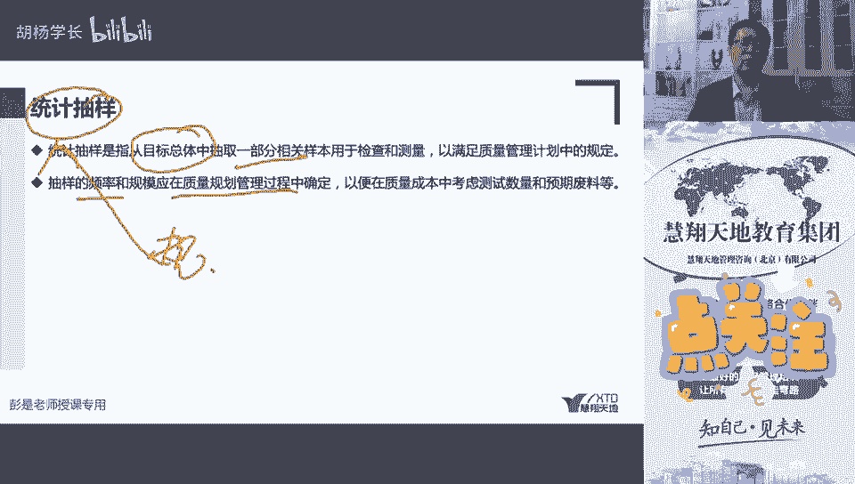

所以抽样的频率和规模，根据我们多少样本抽多少样。

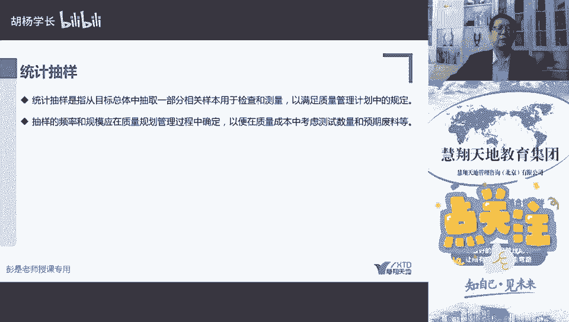

所以这块知道这么多可以了，以便在质量成本中考虑，测试数量和预期废料等等等等等，这是统计抽样，看到那个预期废料就能想到吧对吧。

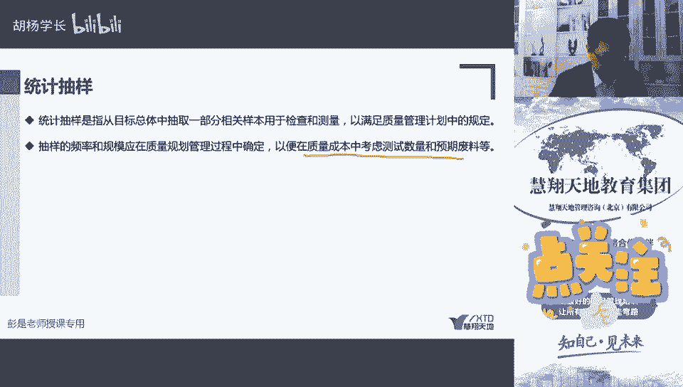

你说测试软件不会把软件测试到坏了对吧，就很少啊，就把服务器测崩了对吧，什么数据库清空了就很少凤毛利，小概率事件极低的。

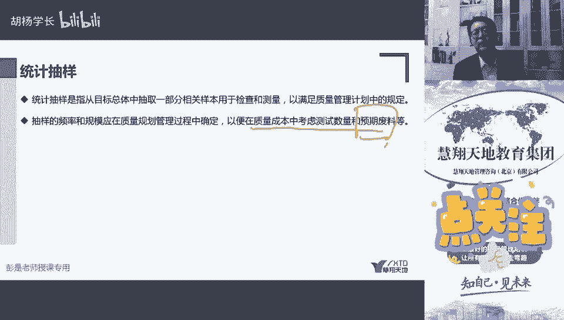

最多最多发现这个东西报错了对吧，重新维护一下就好了，但是测瓶装水就会有废料了，这瓶水我喝过了就不能再用了对吧，公司生产出来那是什么手手榴弹手雷对吧，测一测能不能炸，测完了这个东西就废了。

这个废了就会产生失败成本啊，这也是废料啊，那我们应该考虑了我们的测试，第一个第一个是样本多考虑采用统一抽氧，第二个是破坏性测试。

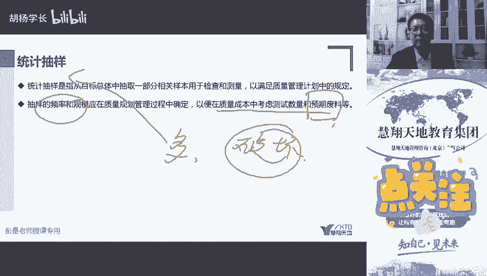

破坏性测试。

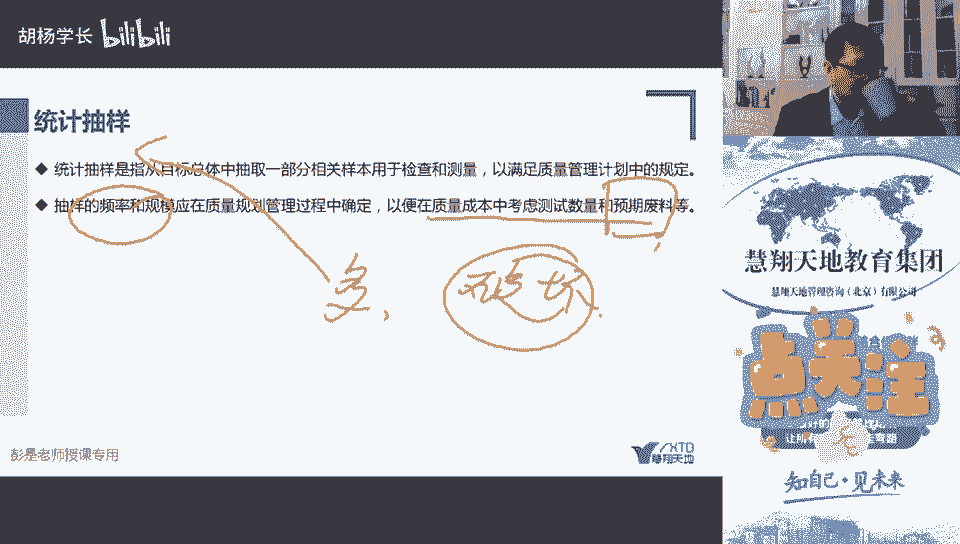

对吧，比如说有些管理系统可能会提供这样的功能啊。

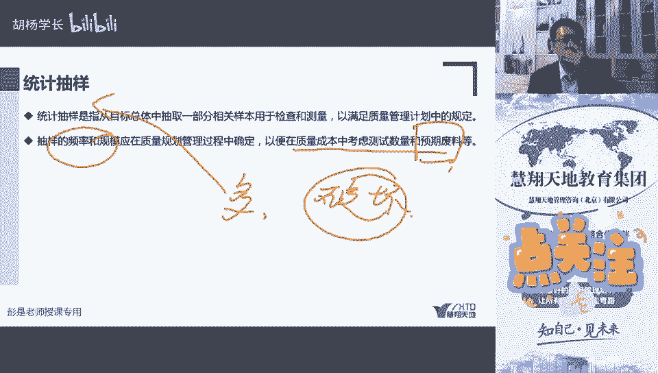

一键还原这手机有没有啊，恢复出厂设置对吧，笔记本电脑什么一键清空，然后服务器一键清空服务器，这样的功能要慎重啊对吧，要慎重，这意思不要每天都测，不要每天都玩儿啊，不然我们这个成本太高了。

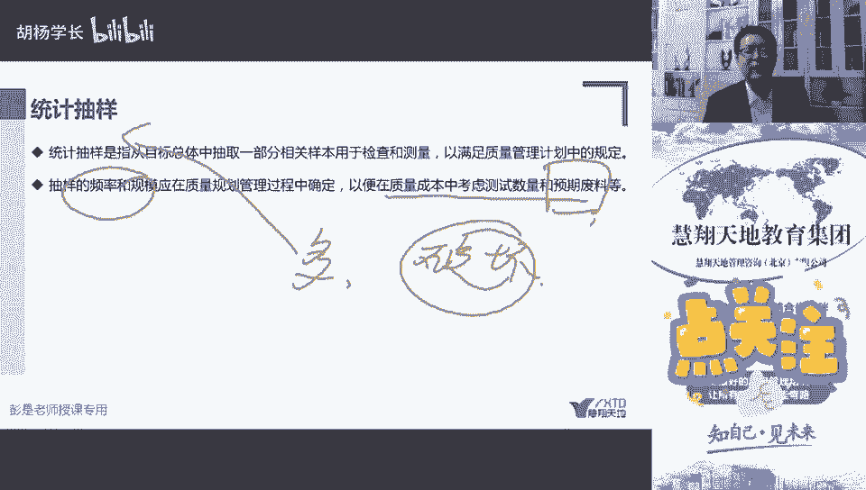

然后最后一个工具就讲完了，咱就下课了。

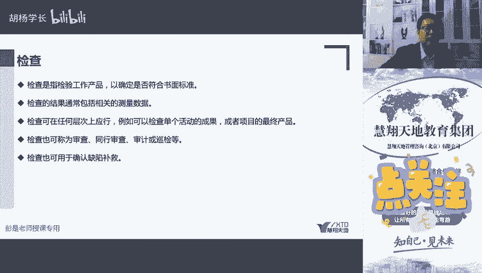

资源那一章讲不到了，明天下节课再说了，最后一个工具在328页。

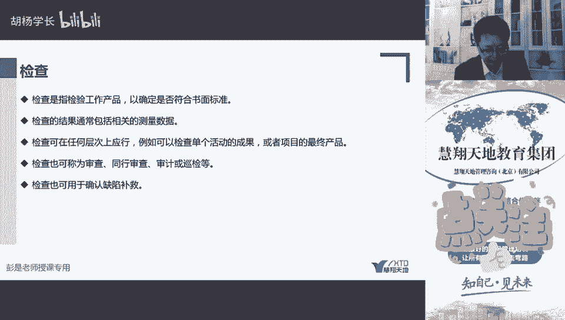

检查检查也没啥可解释的了。

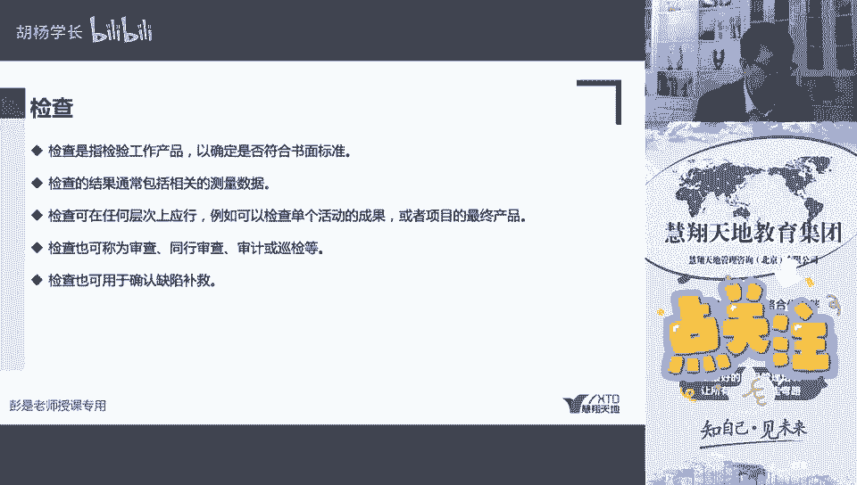

检查支持检查我们的工作产品是否符合标准，检查的结果，包括相关的测量数据，可以在任何层面上，比如检查单个活动的成果，或者是项目的最终产品，检查单个活动的成果或者最终产品，就想啊做就做饭最好理解了哈。

看看你一个菜洗干净了没有。

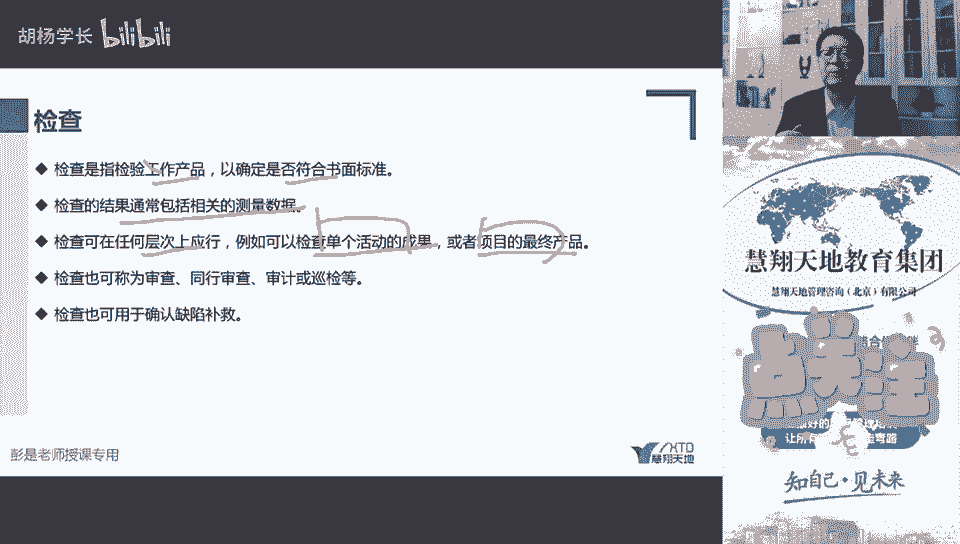

看看你这个菜切干净了没有对吧，你的油盐酱醋配料干净不干净，整洁不整洁，有没有什么坏的长毛了啊，这是单个最终的产品，就是炒好的那个菜，炒好的那个菜，然后检查也可以称为什么什么审查同行审查，审计都不念了。

也可以用于确认缺陷补救，用于确确认缺陷补救，就是说我们，八个发现了bug，然后程序员解决了bug，我们来看看这个bug是不是真的解决了。

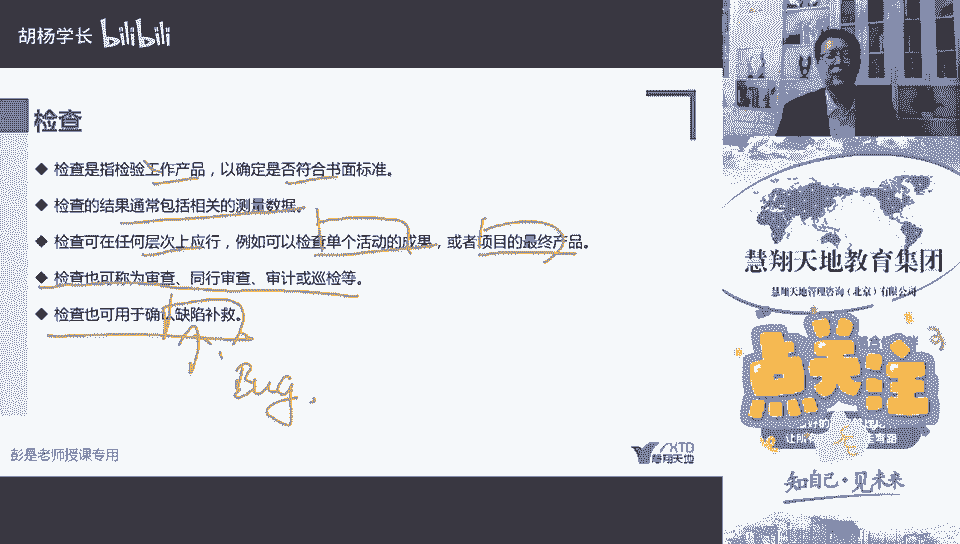

是不是真的解决了。

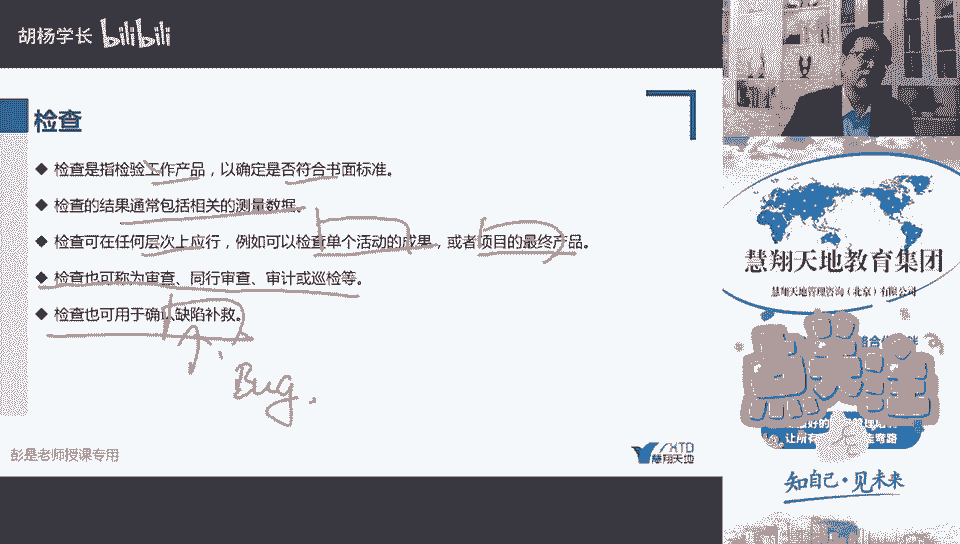