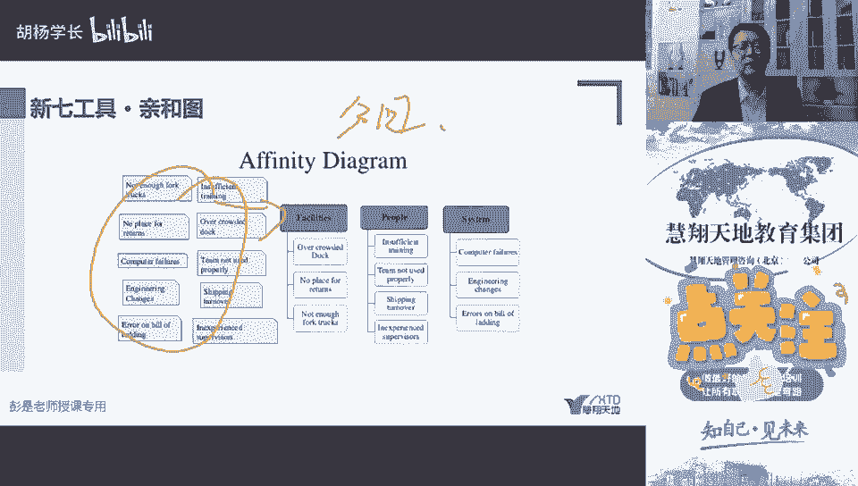
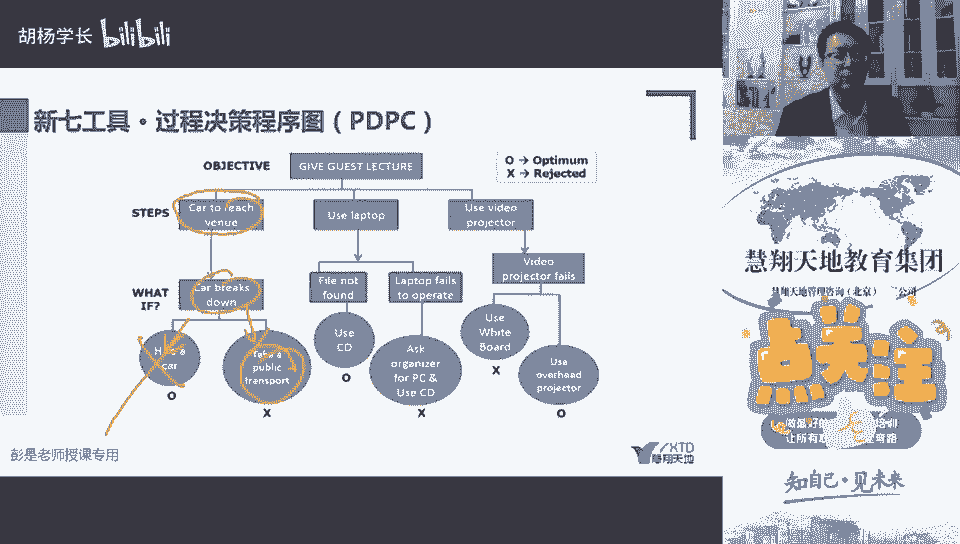
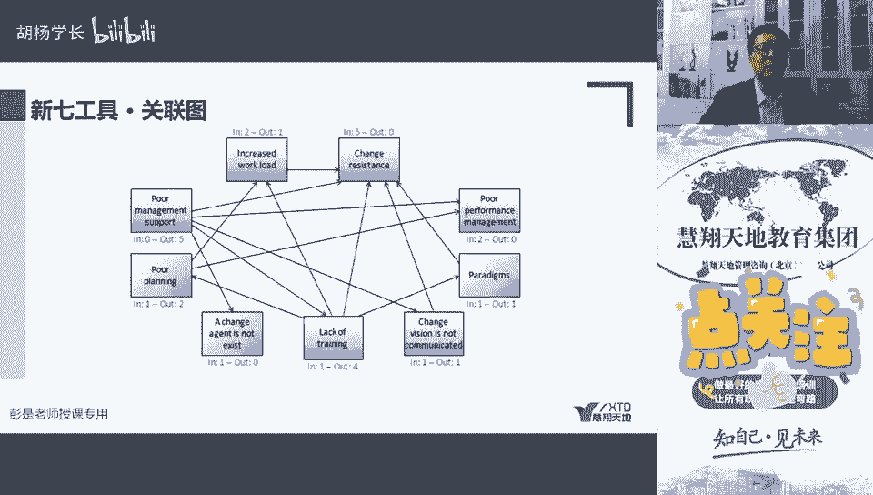

# 新七工具 - 亲和图与过程决策程序图 - P1 - 慧翔天地软考 - BV14L411Y7Gz

新的七个工具，新的七个工具，第一个亲河图不用讲了吧，326页那个什么，看到它就想到分组分组分组，对吧，左边是一大堆零散的需求，咱收集需求过程中，我们的人就是在聊天的时候啊，如果这是大家自己去收集需求。

就会烦，发现我们这些人呐就喜欢东说一句，西说一句，想起一出是一出对吧，那我们在收集需求过程中，收集到的都是零散的，乱七八糟的，所以我们才需要整理分类清河图。

看到他就想着分组，然后再往再往下，第二个叫过程决策程序图，这个有印象就可以了，过程决策过程决策就是评估啊，这个过程我们怎么做比较，怎么做比较好，说白了就是，明天如果去上班，21000车坏了怎么办。

我们提前把这个事情想清楚，是不是可以帮助我们事前做好规划，做好设计，让我们能够做到临危不乱，临危不惧对吧，提高效率，提高质量，所以它其实基于这个角度去考虑诶，万一我们工作中出现了一些问题。

有些过程可不下去了，我们怎么办，用哪一些方案比做做比较好，是帮助我们来决策过程，决策过程就这么事儿了，所以看书上那个概念，用于理解一个目标和达成此目标不整，什么步骤之间的关系对吧，明天去上班。

万一个车坏了怎么办，租一辆车还是乘坐公共交通工具对吧，在北京的话可能不考虑租车了，打出租对吧，那我们公共交通吧，地铁不堵车呀，地铁不堵车，以此类推啊。

我们去评估，所以它可以帮助我们制定应急计划，这四个字印在脑子里面，p d p c p d b c过程决策模型，程序图，帮咱制定应急计划，是不是就记住这四个字就够了，应急计划就想明天早上路上堵车吧。

我去打车，我去打车，这是应急计划，所以你看看明天玩你手机没电了，你们看那个做公共交通是不是付款都付不了了，所以兜里面钱包里面偷偷塞100块钱现金对吧，万一手机没电了，还有现金可以用啊，这也是应急计划。

