# 新七工具 - 关联图 - P1 - 慧翔天地软考 - BV1g24y1F7uz

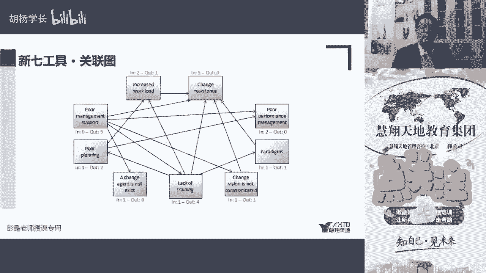

然后再往下关联图，关联图实际上是要考啊。

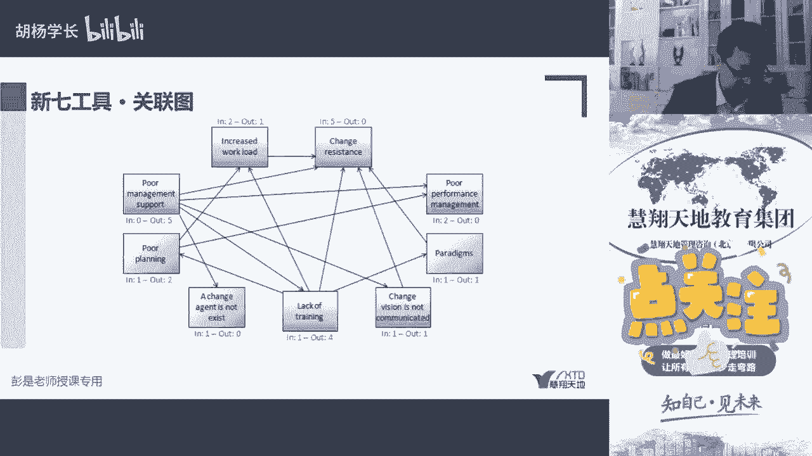

就看咱们现在这个这个这个课这样的一个例子，听一听，有印象就可以了，他就来分析啊，我们可能项目中出现各种各样的情况了。

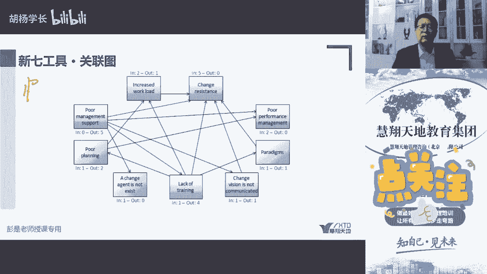

咱给他总结出来各种各样的情况去考虑啊。

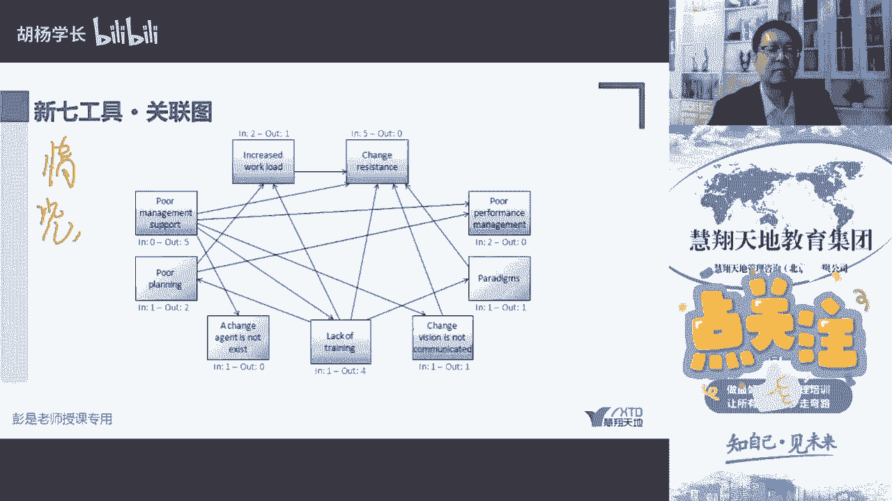

他们之间那种千丝万缕的联系，谁会影响谁。

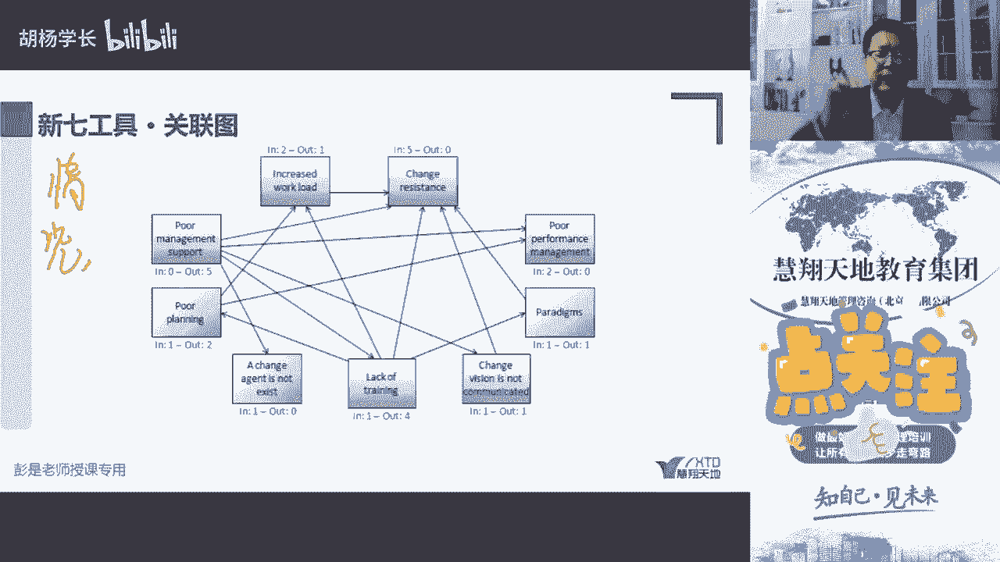

谁会影响谁，比如说，高级管理层支持力度不足。

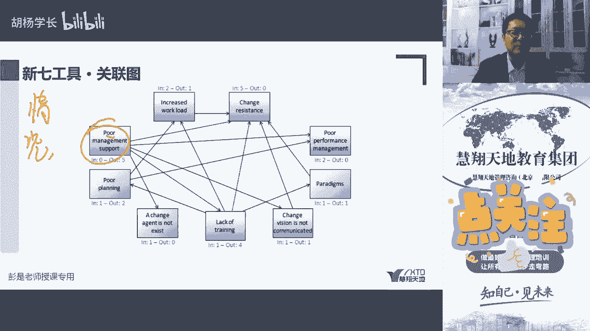

可能会影响到我们什么变更啊。

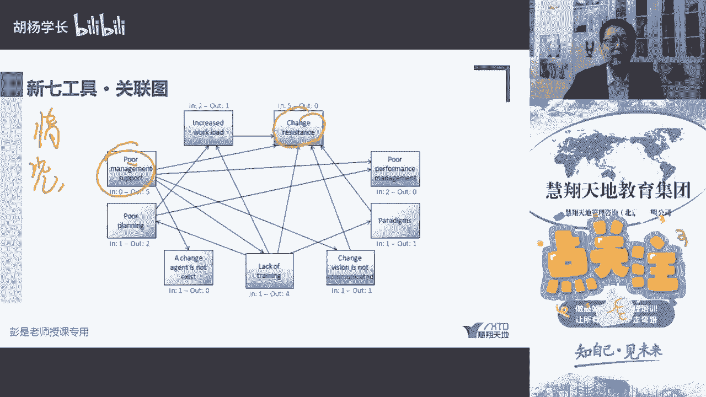

什么什么什么什么去培训啊，程序啊，诶他是五个输出。

它会对我们的各种工作产生影响。

然后看看谁最容易受到别人影响，比如说比如说变更变更的阻力吧。

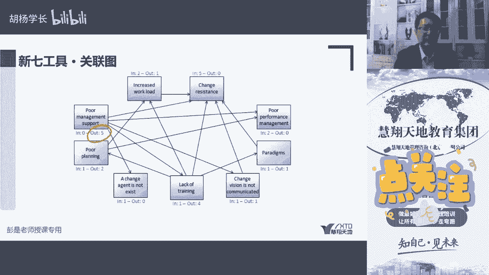

它会受到什么什么高级管理层了。

巴拉巴拉不念了啊，就是做这样的分析，看看这些事物谁会影响到谁。

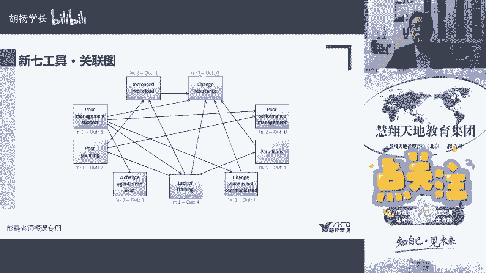

在评估影响力，谁最容易影响别人。

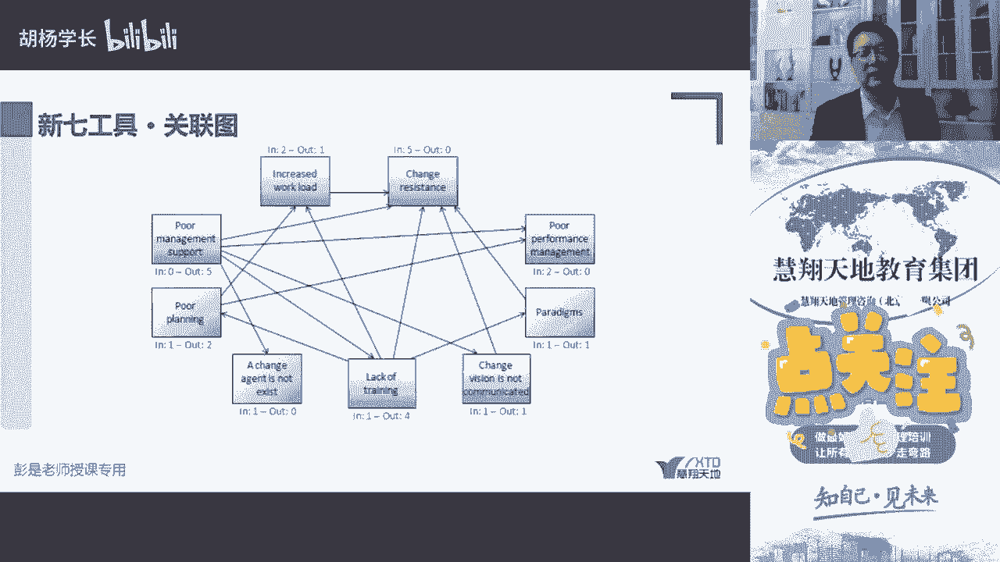

谁最容易受到别人的影响，简单粗暴你就可以分析了。

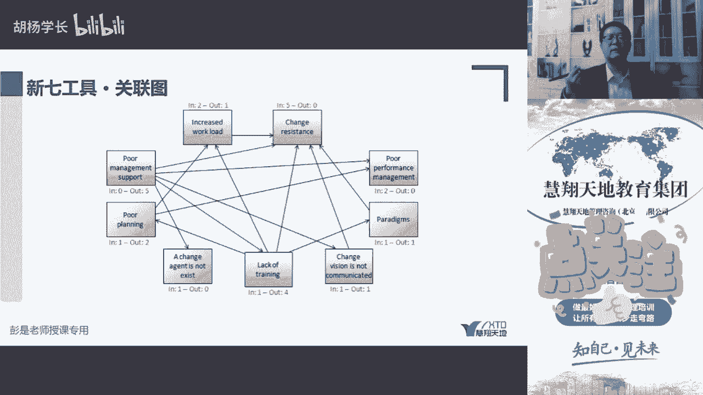

比如说在当前我这个团队里面，张三李四王五赵六。

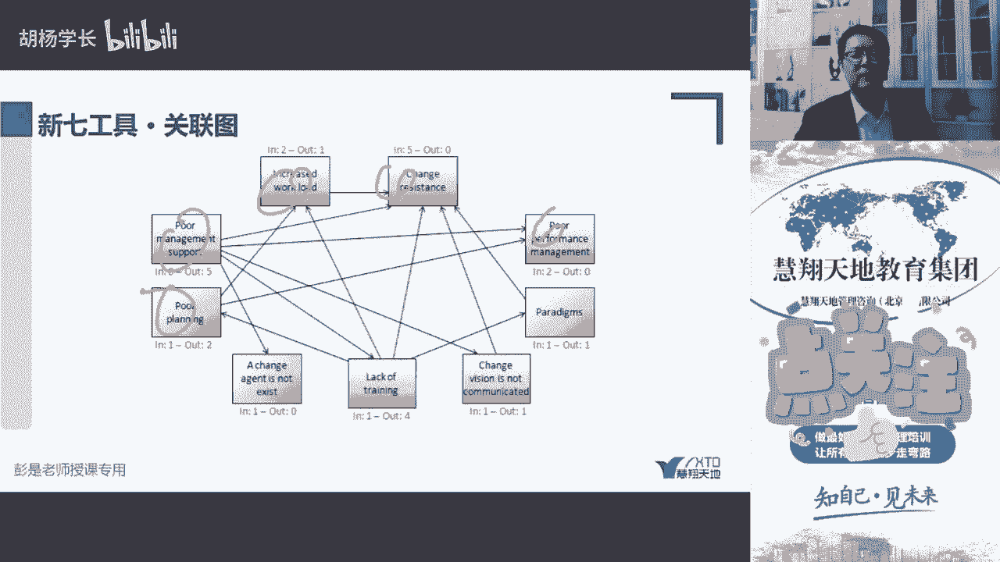

你通过一些简单的事物可以去分析，谁最容易影响对吧，张三一说这事，我觉得比如说中午吃饭，你就想这个场景，中午吃饭对吧，我们通常有q l意见意见意见领袖对吧，某个人一说中午我们吃肯德基，啪五个人跟着去了。

诶，他的影响力都比较大对吧，你自己在那说，我们中午吃麦当劳，没人去，没人响应，你的影响力都小，那对工作，对事物对吧，无论是对人还是对事。

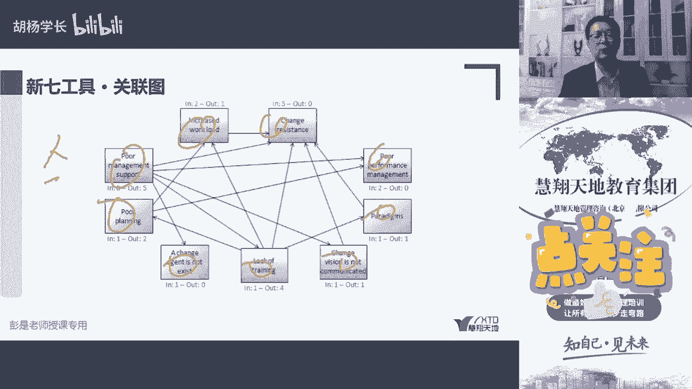

都可以通过这样的方法评估，一个是谁影响力大，一个是谁最容易受到别人的影响。

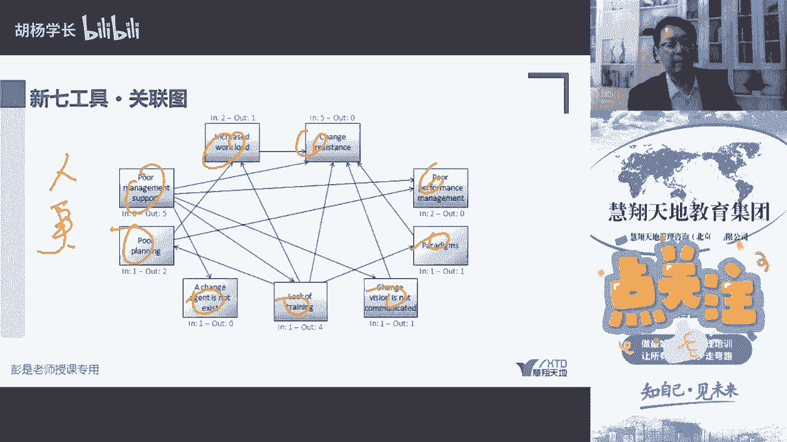