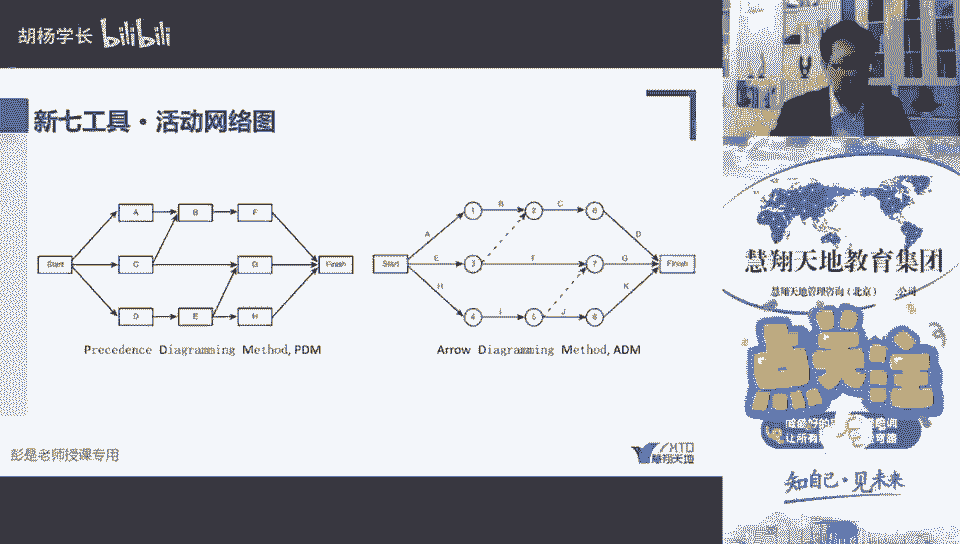
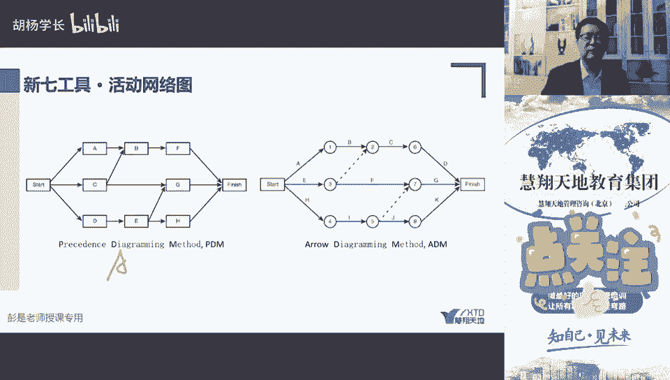
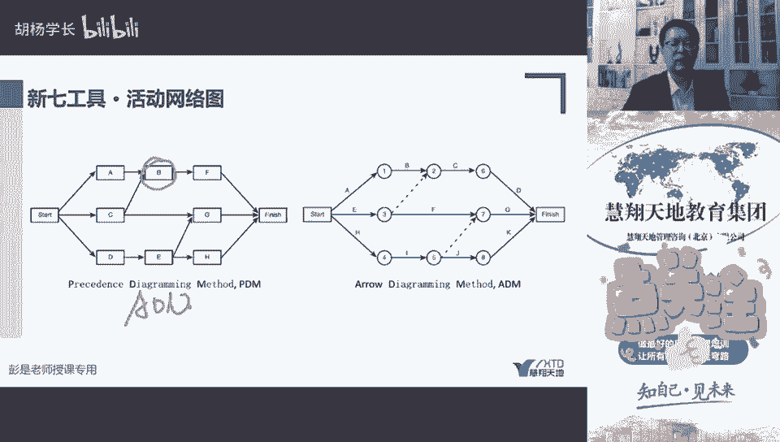
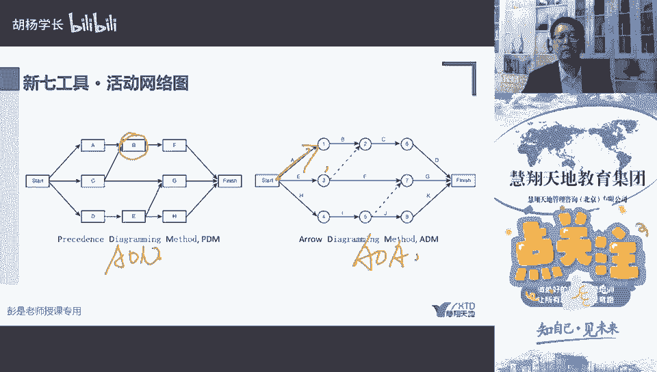
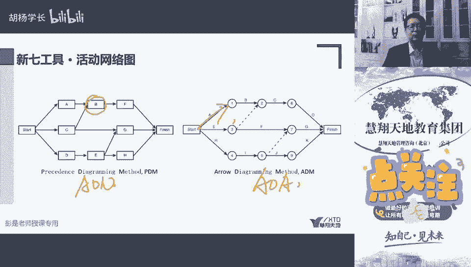

# 新七工具 - 活动网络图与矩阵图 - P1 - 慧翔天地软考 - BV1514y1Z71g

活动网络图对吧。

活动网络图我们p d m p d m a o n。

active on load，用节点来表示活动。

aoa error，用箭头来表示活动排列。

活动顺序，一个重要的工具。

这个没啥解释的，最后一个矩阵图，矩阵图，看到它和散点图一对儿来记，散点图是说两个因素是否还要做做实验，做分析啊，去试去试一试这两个东西有没有关系，那试一试这两个东西有没有关系。

矩阵图呢是把这个结论写下来，写下来，这个例子我也不念了啊，比如说我们来评估就是散热，散热有铜铁铝钢芯乱七八糟的，谁会影响到散热，手机外壳的材质，木头打塑料的，铜的什么我们都知道了。

哎塑料和这个散热有没有关系，木头有没有关系，不知道啊，不知道有没有相关性，那我们要去做实验，做实验，用散点图看一看，看一看它的厚度会不会影响到散热，就以此类推啊，就干这个事儿。

所以矩阵图把两组元素有没有相关性写下来，比如说什么强相关，弱相关呀，正相关呀，逆相关的不相关啊，和确定，如果发现两个因素不知道有没有相关性，接下来用三点图去做实验去试一试，就可以了。

这个评分项到底评多少，完全不重要，现在给他的事例从来展现两组两组因素，我们的什么关系啊，原因啊，和目标之间的关系，强弱强相关，正相关，弱相关，不相关，不确定，如果发现不确定。

