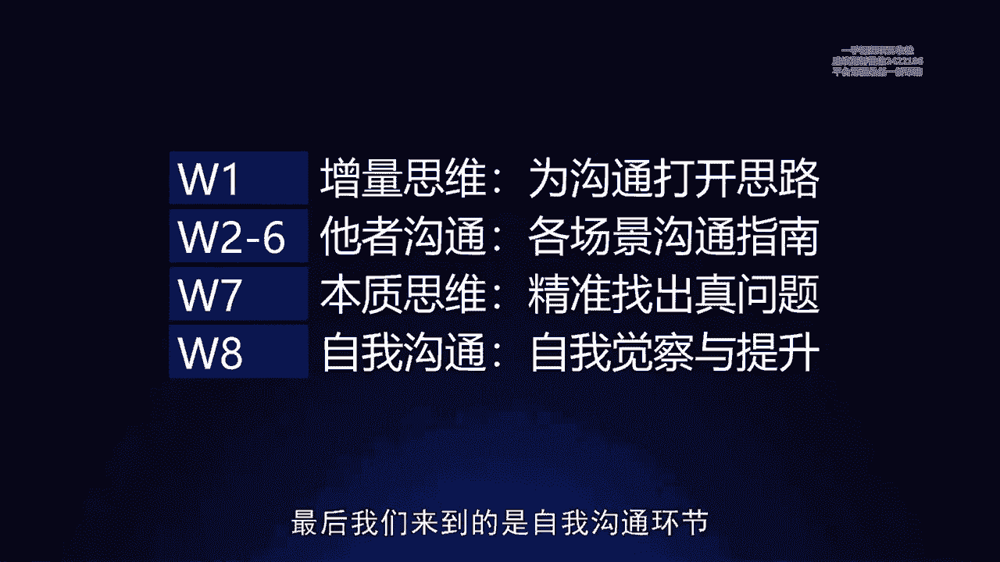
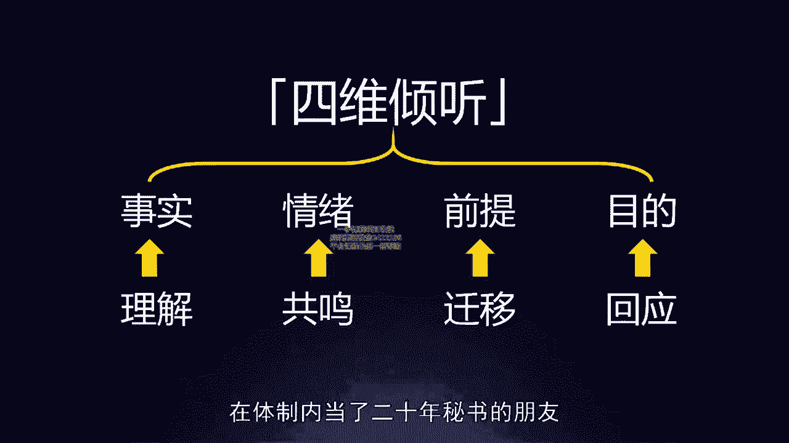
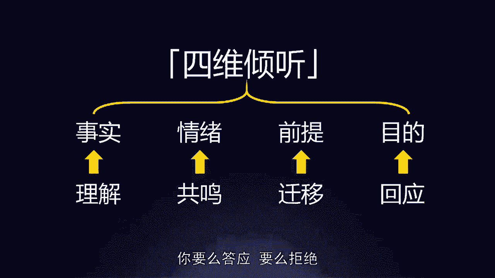
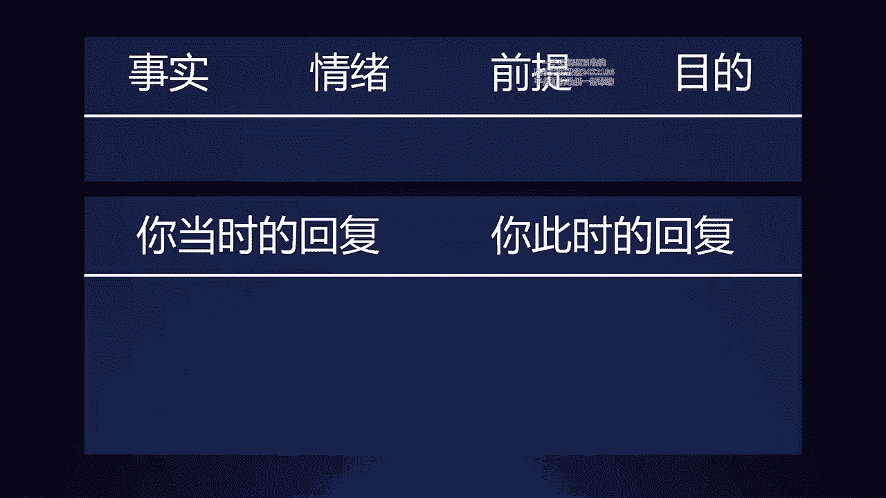

# 梁秋阳--超级沟通力 - P1：001-01.倾听：四维倾听法让你听到更多信息 - 清晖Amy - BV1xFtWeuEao

Hello，你好，我是秋阳，欢迎来到咱们超级沟通力训练营的第一课，那今天是我们第一天的课程，正如同之前开营仪式上我讲过的，我们的所有的沟通，本质上是在优化人与人之间的关系，我和我的老板为什么要沟通。

因为他要当好他的老板，我要当好我的下属，我们两个作为工作的伙伴，这段关系能够不断地加强，能够不断地通过信息的交换产生更深的羁绊，能够让我们的合作更加的润滑，减少工作当中的困扰，都需要靠沟通来完成。

所以我非常喜欢的一句话是沃尔玛的创始人啊，山姆威尔士说的，他说管理的本质其实就是沟通，事实上不仅是管理我们在生活当中，所有需要影响他人，所有借由需要人与人之间的关系完成的事情。

不管是工作还是生活都需要沟通，而这就是未来几周，我们将要共同学习和练习的部分，我们的课程的内容的顺序排列，完全是按照适合大家理解和吸收的顺序，在第一部分我们会来了解什么叫做增量思维。

因为相信在过往的生活当中，大家都积累了很多沟通中出现的问题，比如说我要怎么跟我的老板谈加薪，比如说遇到特别不配合的同事，我要怎么跟他聊天，那凡此种种，我们需要先帮大家打开一个突破口。

所以我们会先聊关于增量思维的部分，为我们所有人的沟通打开思路，在这之后，我们会进入广泛丰富的职场沟通当中，的各个不同的场景，也就是所谓的他者沟通，根据不同的关系类型，例如说向上的沟通。

平行的和客户同事伙伴的沟通，以及向下的能体现你的领导力的沟通等等等等，这些课程会为大家提供完备详细的沟通指南，在了解了这些数的部分之后，我们会进入第三部分，也就是更加深入的来了解沟通的本质。

从此之后我们可以跨越打通不同的场景，把之前我们学到的技巧融会贯通，也就是所谓的本质思维，帮助大家能够精准地找出，每一个沟通场景中的真问题，哪怕以后你离开了这套课程，你遇到了全新的问题。

你也能够自己找到方案，最后我们来到的是自我沟通环节。

也就是除了我们有一些可以跟别人聊的东西，我们怎么样通过自我觉察，找到最适合自己的沟通策略和风格，与此同时完成长期的自我提升，以上四个部分是我们的课程内容，而今天我们就要来聊关于增量思维的第一课。

首先什么叫增量思维，给大家介绍一个简单的观念，很多时候如果我们觉得沟通很困难，本质上都是因为我们听到的不够，我们聊出来的不够，以及我们手上拥有的选项不够，当客户告诉我们说我们的产品太贵的时候。

我们面对一个很难的选择，叫做我要么降价，要么忍痛放弃这个客户，可是增量思维会告诉你，当客户这么说的时候，你其实还能听出更多的信息，当客户这么跟你聊的时候，你还有更多的疗法，以及你手上的选项。

绝对不仅仅那两个，而今天的第一课我们就来聊怎么样听到更多，也就是所谓的四维倾听的技巧，让你掌握职场读心术，什么叫四维倾听呢，特别简单，就是当我们听到一个人说话的时候，我们能听到哪些信息。

很多朋友的第一反应是，那不就是他话里说到的信息吗，他让你请他吃顿饭，就是他想要让你请他吃顿饭，他把一个任务交给你，就是让你去做好这个任务，还有哪些信息呢，其实并不是一个人说一句话，明面上的信息只有一种。

也就是我们最容易听出来的叫做事实，但其实它还包括了另外三重信息，也就是情绪前提和目的，什么叫做事实，就是这段话里面包含哪些他提到的客观事实，比如说明天要开会，这就是一个客观事实，什么叫做情绪。

就是他在描述这个客观事实的时候，背后其实可能带有自身的情绪，一个领导跟你说，明天要开会，他可能是着急的，也可能是不带情绪的，还有可能是清代和有兴奋的，什么叫前提，就是每一句话的背后，其实都可能隐藏了。

这个人对于某些事物的天然想法，只是他没有明确的说出来，而什么叫做目的，就是他说这段话，不仅表示了他说这段话的意思本身，还含有某些想要通过这句话实现的目的，我来举个例子给你听，例如说你的老板有一天告诉你。

这个项目怎么拖了这么久，明天周六我们一起来公司对一下。

给你发了这么一条微信，我问你，你会怎么回，大多数的朋友通常情况下，虽然周六不太想加班，可能就是回一个啊，没问题，好的，周六我们什么时候见，大概如此，这叫做什么，这叫做我们只听到了这句话当中的事实部分。

就是字面意思，老板说这个项目拖了太久了，明天周六我们来公司对一下，但是我问你，现在在我们了解了四维倾听的框架之后，你能不能意识到这里面的情绪部分，是什么样子的呢，很容易对不对，你看微信上有两个感叹号。

而且呢语气非常的急促，所以显然意味着你的老板，这个时候是有点着急的，他可能是刚发现这个项目的进度，超出了自己的掌控，所以才着急忙慌地向你提出了这个要求，接着我们来想一想它里面有没有隐藏的前提呢。

其实是有的，所有的项目都有可能拖，但是未必每一个项目都会让他这么着急，所以当他发现这个项目的进度不对劲，就要求你明天马上来公司对一下的时候，它的潜台词是这个项目的优先级要往上调。

所以我们应该放更多的注意力，放更多的工作精力在这上面，了解了这件事情，你就明白，你需要反映的不仅仅是他的这一个要求，而是应该对这个项目有重新的认识，最后他的目的是什么，其实你仔细想一想。

这个项目就算他跟你对完之后，是不是还得你来做，否则他不会这么跟你着急忙慌的对，可是他为什么一定要着急跟你对一下进度，说明他的目的不仅仅是跟你对进度，而是借由和你对进度这件事情。

重新获得对这个项目的掌控感，以及对于这个项目的控制，所以你需要做到的不仅仅是真的跟他，只是对一下，你要想一想，你还有没有什么别的方法，能够让他重新获得对这个项目的掌控，或者是你对此事有异议。

那你也应该告诉他，你有什么别的解决方案，你会发现这短短的一句话，其实我们能够听出来的东西，远不止它字面意思上的本身，而当我们能够从四个不同的维度来听出，一句话的综合含义的时候。

我们才能够给出一个真正有效的回应，叫做好的，现在确实很急了，如果这个项目的优先级，咱们需要往上调的话，那需不需要我安排人，今晚就出一份明天要对的进度清单。

先给您过目，明天我们再见，为什么我们可以给出这样一套回应，是因为我们不仅理解了这段话中的事实，我们懂得了和老板的情绪去共鸣，我们意识到了他说这段话的前提是，他认为这个项目很重要，最后我们知道。

其实他对这个项目的主要目的是重新掌控，这个项目，是获得安全感，所以我们在回应当中就不仅应该回应好的，我们还应该回应的是，我们为此还想到了可以做什么，否则你想一想，你单回一个好的，明天咱们时候见。

保不齐有50%的可能，你老板今晚还要再给你追一条微信，内容，就是刚才那段回复里面，本来可以你主动提出，但是他因为你没有提出，而忍不住在叮嘱你的事情，所以一段话，如果我们只听到了最简单的事实层面。

我们最多只能做什么呢，只能做一个合格的工具人，但是如果我们能听到不同的层面，一段话，多层次的含义，并且针对性地做出回应，我们就能怎么样，就能成为一个真正能够听明白话的，懂道理的职场人。

而事实上在不同的职场沟通场景，这四个要素很多时候都会发挥不同的作用，比如说在一些冲突的场合，我们就需要尤其注意倾听我们的同事，我们的工作伙伴，甚至我们的客户，他话语当中的情绪价值。

比如说当客户在抱怨的时候，他要的可能未必是一个马上的解决方案，他需要的是你先理解并承认他的情绪是正当的，他要感觉到你也意识到了这件事情的严重性，再比如你老板在跟你说话的时候，很多时候他的情绪是不存在的。

因为老板总是很冷静，他的事实说的清清楚楚，他的前提你早已明白，这个时候你需要关注的是什么呢，很多时候是目的，我的一位在体制内当了20年秘书的朋友。

告诉我一个很有意思的话，他说新的下属年轻人，他们在传达领导的旨意的时候，特别喜欢讲，这是领导的原话，可是真正有经验的人在进行沟通，在上传下达的时候会强调这是领导的目的，所以同样听一段话。

有的人只听到了原话，有的人能听到目的，还有的人四个维度都能听到，你说谁的沟通效率比较高，你说如果你是领导，你会比较愿意让谁来跟你讨论事情，在了解了四维倾听这个最基础的模型之后，我们来看两个简单的案例。

看看你能不能从中分析出，这两段话里面包含的四个维度的信息，分别是什么，首先来看第一个老板，咱们明天的会议能否推迟几天，我感觉项目还没到，可以讨论下一阶段的节点，这里面如果你是他的老板，你能听出哪些信息。

首先事实特别简单，他还没有做好准备，所以希望你能把明天的会议推迟几天，情绪呢他显然有一些紧张和担忧，担心这个项目现在的准备程度，明天开会可能还不是时候，可能会浪费大家的时间，可能他本人会表现不好。

那前提呢他感觉项目还没到，可以讨论下一阶段的节点，虽然他只说是自己的感觉，但是他心中显然有一个判断标准，可以用来判断项目，什么时候就应该讨论下一阶段了，而现在还没有符合那个标准，最后他的目的是什么。

当然一部分是为了自己在会议上的表现，能够给出一个更有说服力的报告，另外一部分，也是为了项目整体上是顺利的推进的，所以希望能够把会议安排在一个，更加合适的节点，了解到了这四重信息。

你就可以依据更全面的信息来做出判断，否则的话你想一想，假如你决定了不要推迟，可是你没有听出他的情绪信息，最后只会使得人心惶惶，假如你认为这件事情还没有定论，但是没有听出他背后可能有潜在的判断标准。

没有对这个东西进行充分的讨论，可能给出的就未必是一个大家都认可，大家都充分认同的答案和决策，这是第一个案例，而第二个案例，你的这个需求真的很难按时做完诶。

要不要考虑改一下这部分的方案啊，啊这是常见的研发部门和产品经理，或者是呃内容部门和项目部门会产生的分歧，提需求的那一方，和满足需求的那一方产生了矛盾，那满足需求的那一方说。

你的这个需求真的很难按时做完啊，这个的事实是什么呢，事实当然是他的能力，对于某一个目标的实现是有困难的，而他的情绪是什么呢，他的情绪是感受到了压力啊，希望这件事情能够重新得到考虑，它的前提是什么。

这是最有意思的部分，你的这个需求真的很难按时做完，它的前提恐怕是第一，这个需求可能未必那么重要，所以我会希望你能改一下这部分的方案，第二他对你提出的需求有一个自己的理解，这个理解跟你的理解未必是一样的。

但是基于这个理解，他判断很难做完，最后他的目的是什么，在公司当中都很简单，大家的目的往往是为了项目都能够做好，能够按时完成需求，能够项目的进度和项目的目标是匹配的，听完了这四点之后，你就意识到。

这里面往往最容易出现问题的，是彼此的前提部分，首先他之所以会提出这个要求，是因为他认为这个方案可能是可以变动的，而这个是需要你来做决定的，其次他满足的需求，到底是不是你想告诉他的那个需求呢。

这件事情也是需要你们进行统一，才能避免误解，当你发现一个信息，背后可能有这四重维度的时候，你就会意识到生活当中的每一种沟通，其实都需要我们做出更加完善的理解，做出更加全面的倾听，才能避免误会。

否则你想一想，你单纯生硬的拒绝他似乎也不对劲，可是如果你答应他，你也不满足，很多时候所谓的沟通和死局，都是因为我们大家都没有听出彼此的话中，还有更多的维度才会造成误会，当我们能听到一句话。

里面有四个不同维度的时候，我们就知道我们优先应该回应哪一个好，那问题来了，你会说一句话，这么麻烦，又不都是在微信当中聊天，又不都是像写作文一样，我还难道听一句话，听出四个维度，在四个维度都回应一下吗。

当然不一定，那具体的做法怎么样呢，特别简单，从你在这句话里面听出最重要的维度开始沟通，甚至有些时候可以省略其他部分，只要能做到这点，你就是职场中那个善解人意的人，比如说我举个例子。

客户说哎你说你们的产品有两周的套餐，也有半年的套餐，有什么差别啊，我问你客户的这个问题里面，事实情绪前提目的哪一个最重要，哪一个最重要，很多朋友单纯从事实上去回应，就是告诉他们有什么差别，有什么差别。

情绪上呢，这里面好像也没有什么情绪目的上呢，哎客户不都是希望能够买到一个好的商品吗，我就努力去介绍去了，可是如果你熟用了四维倾听的方法，你就会意识到这里面最重要的其实是前提。

为什么你在介绍产品的时候介绍了这么多东西，可是客户专门问你，两周的套餐和半年的套餐之间的差别，说明在他的潜意识里面，它有一个前提叫做产品，花他的时间这件事情是最重要的，所以你优先需要问的是诶。

您为什么会关心这个东西，我能不能问一问，花您两周时间和花您半年时间的差别，您对于时间上是不是特别的敏感，是不是您在工作当中，对于产品的时间配套有些特殊的要求，你看你听出了这一点。

就可以不仅仅是简单地回答客户的话，而是可以回应他这句话，真正想传达的那一部分信息，我们再来看另一个案例，假如有一天你团队的成员跟你说，老板我想了很久啊，却还是决定离开咱们的团队，今天先跟您说一声啊。

您没有意见的话，我就去走人事的流程，你看这句话听起来非常非常的冷静，如果我问你事实情绪前提和目的，哪个是这句话的关键，你会怎么说呢，啊很多人会优先关注事实说啊，你为什么决定这些这样做啊，那你走了之后。

我们公司怎么办，你的新offer他到底待遇怎么样啊，你有没有想清楚啊，还有的人呢会关心啊，你之所以现在来告诉我，你不就是想快点走呗，你说的这么着急啊，还说跟我说完一声，我没意见就要去走流程了。

你的目的不就是想快点走，所以我应该要么满足你，让你快点走，要么拒绝你啊，我就给你拖着，其实你想一想，真正我们在看这些东西的时候，什么最核心，一个人要离开一个团队，他又想了很久。

他内心一定有非常多没有说出来的情绪，所以如果你能够听出这句话本身，虽然看上去说的很冷静，但是他背后还是有情绪的维度，在你就会知道他想了多久，你就需要花多久的时间来跟他共情，而只有当情绪的理解到位了之后。

你才有可能去了解到更加深入，更加全面的事实，你才有可能了解到他做出决策的前提，你也才能够更好地完成，你们彼此这次沟通的目的，所以信息的这四个维度，我们需要做出的反馈是不一样的。

对于事实我们要尽可能细致深入的理解，对于情绪，我们要诚恳地表达出共情，尽可能地与他共鸣，去承担和接纳他的情绪，对于前提，我们要懂得做出迁移，如果他在这个地方的前提是这样的。

那说明他在别的地方的前提可能也是那样，就好像前面的案例里面啊，老板如果他的前提是这个项目很重要，所以我要让你明天来跟我马上对一遍，那就说明我们要懂得迁移，像这一类的项目以后都应该这么做。

以及这个项目的其他事项，也要有足够的主动性和积极性，又比如之前的客户提到了，他对某一个决策要素特别敏感，我们就要懂得迁移以后产品跟这个相关的，比如说跟时间相关的，跟价格相关的。

跟他感兴趣在意的元素相关的部分，要着重地进行介绍，而最后目的我们要懂得回应，你要么答应。

要么拒绝，要么提出替代方案，所以对于不同的人，对于不同的沟通场合，对于对方提出的不同的话，我们要懂得根据哪个最核心，哪个最重要，从那个维度开始沟通，很多人在聊天的时候特别容易被人说，为什么我说了这么久。

你就是不能理解我呢，其实他并不是在说我们没有理解他的意思，因为事实总是最容易理解的，其实他在说的是，我这段话里面明明有一个维度的信息是关键，但你为什么从别的维度开始回应，这就好像当客户发脾气的时候。

你给他提解决方案是没有用的，因为他首先需要你承认和接纳，他的情绪是正当合理的，你已经跟他感同身受了，他才会愿意听一听你的解决方案，否则他根本就不会相信一个不跟他共情的人，能够提出让他满意的解决方案。

再比如，当老板的目的是，努力让你的这个项目重新回到掌控，让他对这个项目重新有认知和掌控感的时候，你就算在情绪上回应再多，你在事实上响应再及时，也不能让他满意，因为他需要你做更多，他需要你回应的是。

他背后没有说出来的那个目的，所以当我们在听一句话的时候，我们不仅要听到它表层的东西，我们还要听到它深层次的东西，那最后有些朋友可能会说呃，听一个话都这么麻烦，这才是学沟通的第一天，那我以后还怎么学啊。

我可以负责任的告诉大家，这件事情之所以在今天课程的这20分钟里面，你感觉到麻烦的，是，因为你之前很少用这样的思路去思考，而当你通过未来一段时间的练习，把这件事情变成你在分析一句话。

分析一段沟通时的一个本能反应，你会发现它已经成为你心理当中一个第一反应，就能够做到的意识，就好像我现在跟我的同事聊天，我能够一下子听出来这段话里面，我应该回应的是什么，我应该回应的是情绪。

我就会马上跟他共情，如果我应该解决的是他的问题，那现在他提出这个要求就不重要，我只要能解决它背后的目的就可以，这就好像你从来不会担心，有一天你在开车的时候，那万一你忘了应该先换挡还是先打方向盘一样。

因为当这个动作成为你的本能之后，情景来临，你自然就会做，当然这个需要练习，所以在今天课程的最后，我就请大家跟我做一个简单的练习，希望你能够从你的微信里面找出，对你来说在职场当中比较重要的一个人。

它可以是你隔壁部门的合作伙伴，可以是你的老板，可以是一个hr，都可以请你找出他跟你说过的一段关键对话，这段关键对话你没有必要告诉我，但是可以在小组中分享，并且试着用今天学到的四维倾听的分析方法。

来列出这段话里面，他所要呈现的事实是什么，他想传达的情绪是什么，它隐含了哪些前提。

以及他希望通过这段话达到的目的是什么，在写出来之后，请你写出，如果按照你此时的状态，你能够给出怎样的回复，并且对比一下当时的你给出了怎样的回复，你就会意识到，有一天我们能够听到更多东西的时候。

我们的沟通自然变得更加有效率，很多人会觉得沟通的重点在说，其实沟通的重点在听，因为你能说什么，取决于你听到了什么，如果你永远只听得到事实，你又怎么能够说出超出事实的东西呢，如果客户跟你说嫌贵。

你就只听到了嫌贵，领导告诉你要做一件事，你就只去做，那件事情你又怎么可能成为一个聪明的，高效的职场人呢，以上是今天的课程四维倾听的技巧，帮大家简单总结一下，每一句话我们都要听到事实，情绪。

前提目的这四重维度的信息，对于事实要学会理解，对于情绪要创造共鸣，对于前提要学会迁移，对于目的要及时的回应，而了解了这四件事情之后，再听别人的话，回复的重点应该是这段话里面，最核心的那一维信息是什么。

你就优先回应那一个维度的信息，如此一来，你就能成为真正在职场沟通当中善解人意，仿佛有读心术一样的沟通高手，我是秋阳。

