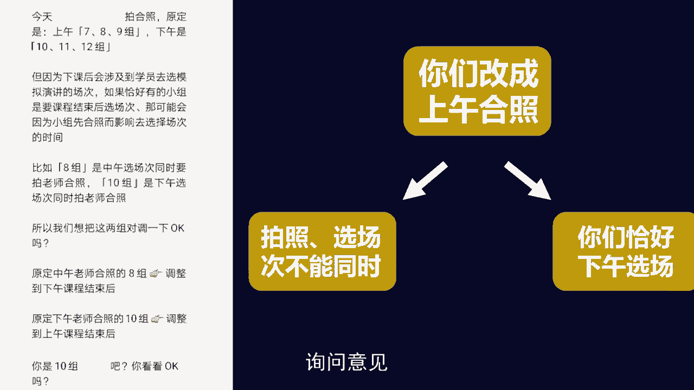

# 梁秋阳--超级沟通力 - P6：006-06.汇报：进阶模板让你深入人心 - 清晖Amy - BV1xFtWeuEao

Hello，你好，我是秋阳，欢迎回到我们的超级沟通力训练营，继续今天的课程，用沟通优化关系在职场高歌猛进，我们之前聊过了一个很重要的内容，叫做如何做工作汇报，但是请注意，那只是我们的基础版。

就是怎么样让你的汇报清晰好懂，而今天我们要来进一步的思考这个话题，就是除了清晰好懂，具备了一个汇报的关键元素之后，我们怎么样还能让自己的汇报深入人心。

就好比我们之前有提到过，我们做一个汇报吧，至少要有四个部分，就是拆解出项目它的关键结果，它的相对进度以及汇报我们遇到的挑战，和我们未来的改进计划好，那问题来了，在此基础之上。

如果我们要让我们的汇报更加有价值，应该怎么做，上面那种被我称之为日记型汇报，当我们能做到这一步的时候，保证我们的每一次汇报都是有意义的，保证我们的每次汇报交上去之后。

老板都有话能跟我们聊，那如果我们还想更进一步的话，我们就要了解另一件事情，就是工作汇报，除了是你跟领导之间工作的汇总，你们之间工作信息的传递，工作汇报还有一个更加进阶的功能。

就是给团队提供信息增量协助决策，什么意思，就是有些时候，团队里的其他人，也需要借由你的汇报来获取必要的信息，有些时候你不仅要告诉大家你自己是怎么做的，你还需要用你汇报当中的信息增量。

来反哺你的领导的决策，也就是我们所谓的在日记型汇报之上，还有一种增量型的汇报，如果说日记型的汇报，我们是做到一个基础信息的全覆盖的话，那增量型的汇报我们要着重讲一件事情，叫做什么呢。

就是我们怎么样来在行为和现象之外，提供自己的分析和建议，分析和建议哪里来，我们每一天的工作，我们每一周的项目进展都会有一系列的现象，发生了什么事，客户做了什么，我们遇到了什么情况。

也会有我们自己采取的行为，我们已经用过什么样的措施，我们未来还将用什么样的措施，我们受到了怎样的反馈，而分析和建议就是在这一部分的基础之上，给出你自己的思考，并且细化的汇报出来，例如说第一步出现问题。

第二步发现原因，第三步给出改善措施，第四步拿出参考成果，最后引导方向，当然由于我们发现了问题和相关的原因，除了改善措施呢，我们也可以对于一些原有的行为给出替代方案，让老板知道。

那原来你不打算这么做的事情，你现在打算怎么做，光看这张流程图，可能还会稍微有一点抽象，我们来进一个具体的案例，同样是之前提到过的，如果我是一个hr，我这一周的工作当中遇到一些问题，在日记型的汇报当中。

我需要提到这件事情，可是在增量型的汇报当中，我还需要细致具体的分析这件事情，并且给出我自己的思考，例如文案写手简历推荐艺人，通过零人，这是什么呢，这是描述现象出现了问题，目前的进度并不理想。

我认为是因为咱们只用了公众号这一招聘渠道，所导致的，这是我对于原因的洞察和分析，所以接下来我想申请一下拓展其他的招聘渠道，这是我的改善的措施，另外由于文案写手本周紧缺。

所以我建议这一周的宣发可能要延期两天，可以改用发图的形式先铺垫着，用一些有趣的热点的图片来代替，原来计划当中的几条推送，这样呢可以缓解文案工作的压力，与此同时又能够为之后的宣传期做铺垫。

这是我的替代方案，那我之前所提倡的改进意见有没有什么成果呢，有我们参考同类型的公司，在类似渠道下的招聘效率大概是什么样子啊，能达到我们之前的目标，说明他是值得尝试的。

最后引导方向建议这周内就转移工作重点，多花精力拓宽招聘渠道，争取从本质上解决这个问题，而不是像原来一样，把绝大多数精力放在，怎么样写好一篇特别有吸引力的招聘推送，争取只从自己家的公众号这一个渠道。

就能招到足够的人选，O所以以上几个步骤你会发现，如果我真的想要把我的工作分析清楚的话，我至少需要这六个步骤，在现象当中出现问题，发现背后的原因，第三步找出改善的措施，第四步拿出参考的成果。

第五步引导方向，第六步对于替代方案能有一个更好的弥补渠道，所以基本上这六步做完之后，你会发现每一份工作都可以做得非常的深入，而且你不仅仅是一个只知道执行命令的工具人，你对于这个任务本身是有思考的。

很多朋友会有一个好奇，就是那这样做的话，就是我是一个下属嘛，我汇报我的工作就好了呀，我什么事情都提出自己的想法，会不会显得我特别像刺儿头，特别让领导觉得我在教他做事情啊，这件事情恰恰相反。

你要理解汇报的本质，就是领导下放了选择权，只把握决定权，什么意思，有一个类似的场景是在点菜的时候啊，女朋友跟你说随便，可是呢你说吃这个好不好啊，他说我不想吃，那吃另一个好不好啊，我今天身体不舒服。

吃不了这种类型的，那这个是店家的招牌菜，我们吃这个行不行，我再想想吧，你再看看别的很多人这个时候心里会火冒三丈，你又说随便我说什么你都不吃，这是哪门子的随便，可是很多时候职场分工的本质就是这个样子。

当领导把一些事情交给你的时候，他就是在让你帮他做事，甚至某种程度上教他做事，因为他把选择权下放给了你，你不断的提供不同的选项，而他只把握决定权，所以如果你在工作汇报当中不提供选项。

这意味着领导在跟你相处的时候，他必须事必躬亲的从中去总结，而如果你在跟领导的汇报当中，不懂得去提供选项，这就意味着，当你的老板必须每一件事情都自己非常了解，都自己归纳出选项，然后自己再做选择。

这是一件非常累的事情，所以不要担心汇报的时候，你有些时候会像在教领导做事情，很多时候他需要你提供你的建议，因为反正最后的决定权都在他手里啊，退1万步讲，你要是不教他做事，你要是不提出提案。

他怎么能通过拒绝你来彰显自己的权利呢，当然这个是题外话，开个玩笑了，但是我们要了解汇报的本质，在某种程度上，一个懂得汇报的下属，就是要给领导提供一个又一个的好选择，让他来做最终的决定，而如果你没想过。

我要汇报自己的建议和分析，很多时候反而会让你的上级觉得，你是不是没有认真了解过我自己的工作，因为职场不是一个萧规曹随的场合，前人做过的事情，如果你永远都做得跟他一样，怎么彰显出你的价值。

如果一份工作你做了三个月，半年一年，却没有思考过要做任何的改进，也没有提出过任何改进的方案，这难免反而会让人怀疑，你到底有没有认真在工作，毕竟环境世界始终在变，可是你的做法一直不变是很难的。

当然我完全可以理解，在有一些老牌的企业或者是规章制度，特别明确，本身弹性不够的地方，没有什么改进好做，那也没关系，至少你要努力通过工作汇报体现出你在用心，你在努力的从中思考出你可以做得更好的地方。

没必要做那么多，这句话你不妨留给你的领导来说，你可以过分努力，他可以好好安慰，但是千万别自己安慰自己，因为你永远也不知道你的领导会怎么想你，那为什么不表现出你自己的思考能力，和你自己的分析决策和判断。

让你的报告不仅是对你工作的描述，还能够为整个团队提供更多参考的信息呢，而聊完了，我们具体要汇报什么六步走的方法，之后我们来聊，那在汇报的过程当中，我们已经想清楚了，这六步我们怎么汇报呢。

我们汇报的顺序也是跟刚才那个一样，从1234~56吗，当然不是，事实上你光看前面那个汇报，他就没有按照123456的顺序，而是把相抗政策，把替代方案提前了，为什么，因为在每一次工作的场景当中。

汇报的重点是不一样的，那要怎么来确认重点呢，如何在汇报当中不让领导觉得。

这个人怎么讲了半天都没有说到重点呢，特别简单，就是我们所谓的金字塔人。

先看一个典型的没有重点的汇报经理，王主任说，他今天有事来不了，周总监出差了，明天晚上才能赶回来，赵主管说会可以晚一点开，不过最好是在明天中午以后，因为在这之前啊，他没有时间。

还有明天的会议室被其他部门占用了，所以您看要不要把会议安排到后天，其实你会发现啊，这一份报告他的报告者并不是没有用脑子，他看到有一个人出差了，马上去主动调查，其他的与会者能不能及时参与。

同时呢还去问了场地的情况，发现场地也不配合，所以我们只能把会议安排到后天，可是这一段话如果他说出来，你肯定不会觉得很清楚，为什么，因为最重要的信息它放到了最后面，您看要不要把会议安排到后天。

我听了一大段，脑子都晕了，突然听到这一句，我只想问你一句啊，你说啥为什么要安排到后天，于是这段话前面整个白说，所以什么叫做一段话有重点呢，有一个特别简单的方法，也是当之无愧的，全球第一咨询公司麦肯锡。

沿用了几十年的一套思考和表达的方式，叫做金字塔原理，什么叫金字塔原理呢，这是一个舶来品，我们简单把它归纳下，其实就是两个步骤，叫做结论先行，然后给理由分类，什么意思，刚才那一段话的结论是什么呢。

特别简单，对不对，原定明天的会议我们要改到后天举行，所以结论先行，就是先说我们的会议安排呀，要改到了后天举行。

那什么叫做理由分类呢，就是支持我们这个结论的理由有哪些呢，啊有两大类，第一类是与会人员没有空，第二类是会议场地被别人占了，所以如果要分理由的话，这一个结论下面可以分出两个理由。

与此同时，我们在对理由进行细分，会发现与会人员都没有空，具体而言是周总监出差了，王主任有事来不了。

赵主管想要明天之后再安排会议，所以你会发现这样整个一个复杂的结构，就变成了一个非常清爽的金字塔结构，它的塔尖是结论，下面的塔基就是你的不同的理由，理由越细致，那个塔基就会排布的越多层。

可是这样一层一层的说下来，就可以给人一种思维上非常明确的分层的感觉，因此用金字塔原理的顺序，从上往下，从左而右的讲清楚，这段话就会变成经理，我建议今天的会议改成后天，因为王主任。

周总监和赵主管今天都没空，以及明天的会议室也被其他部门占用了，所以您觉得呢清清楚楚，而且字数还少了很多，事实上，用这种方法很快可以条分缕析地剖清楚，非常多复杂事物的汇报逻辑，比如说像左边这一段。

这是在一场活动当中，在安排合照顺序，其中由某一个组应该先合照，某一个组本来要后合照，可是由于一些特殊的原因，导致他们两个组呢，可能需要调换一下合照的顺序，于是我在报告和询问的时候。

用了这样一段公式和流程，那这个流程能不能优化呢，当然可以，我们用金字塔原理来剖析一下左边这段话，你们会发现他的结论特别简单，就是问你你们组能不能上午合照，就这么简单的一句话，那有没有理由呢，有两个理由。

第一个是拍照和选场次，这两件事情是不能同食的，这是一个逻辑上的理由，第二个理由是，而你们组恰好下午选场地，这是一个事实上的理由，在此基础之上，我建议你们改成上午合照，非常清楚，从结论到理由。

最后回到结论询问意见。

所以你会发现任何的汇报，只要你用这样一种结构，这样一种习惯去锤炼你的表达，一旦你把它形成你的本能，你说话都会非常的清楚，而怎么样分金字塔才是合理的呢，有一个所谓的M1C1原则，说起来复杂，其实很简单。

其实就是两个原则，叫做这个金字塔的同一行是否彼此独立，比如说我们看到刚才的两个理由，拍照选场次不能同时，而你们下午恰好选场，这两个理由一个是逻辑，一个是事实，所以他们刚好是彼此独立的。

又比如说前面的案例当中，与会人员都没有空，会议场地被占领了，这两个理由也是彼此独立的，所以当他们是彼此独立的时候，他们就不能合并，他们必须要在同一行列成不同的点，这叫做同一行是否彼此独立。

另一个原则叫做呢同一列是否完全穷尽，什么意思呢，参会人员都没有空，原因是因为周总监没有空，王主任没有空，赵主管也没有空，那还有没有别人没有空呢，如果有的话，也应该列在这下面，所以如果我们要检查。

我们用金字塔原理去梳理一段表达，一段沟通的这个梳理出来的结构是否合理，我们只需要用这两个原则来检查一遍，叫做同一行是否彼此独立，以及同一列是否完全穷尽，只要符合这两个原则。

那我们按照金字塔原理的顺序去汇报，一定是清楚明白，而且重点突出好，那很多人会问领导，会不会觉得你这样说是不周全的，因为当我在说完结论的时候，我的理由还没有出现，这听起来我愣给了个结论，非常的冒失。

当我说完第一层理由的时候，我的第二层理由还没有出现，这也会显得我的第一层理由非常的缺乏支撑，事实上很多同事就是因为心虚才会出现，像刚才那样，会议室的报告叫做我想要一口气，把我今天要汇报的所有事情都说完。

我今天建议领导去某一些招聘平台上增加流量，加开账户，购买会员，让我们的招聘渠道可以更多，这个建议我是不敢贸然给出来的，因为我给出来会觉得哎呀好像非常的心虚，非常的缺乏支撑，我必须先把我的理由说出来。

老实说，这是一件对你有利，但是对领导不利的事情，什么意思，你一口气讲完，你自己当然觉得非常的顺，因为你已经知道背后跟着结论是什么，你也知道这件事情到底有多少层次，多少类型的理由，所以你一口气讲完。

觉得你自己非常的有底气，但是领导听起来却非常不方便，为什么，因为重点不突出，所以什么是好的汇报呢，通常都不是一口气说完的汇报，请大家重新调整一下自己，对于汇报这个场景的想象，他不是演讲。

他不是我们一口气说完，领导一口气听懂，他不是，我必须要在3分钟之内讲出1000个字，让领导一下子听的深入骨髓，它是一个互相交互的过程，甚至很多时候就是要你说一句，领导问一句哦，为什么你再接着往下说。

这个沟通才能够充分，否则你一口气说完，领导也不确定你后面还要说多久，你自己也会因此错过，有一些可以提前被讨论，提前被质疑的节点，反而不利于双方彼此信息和观点的充分交流。

因此当我们在设想汇报这个场景的时候，请大家千万要忘掉自己脑中，原来听到汇报这两个字，就想到的一个大横幅，一个大会场，我站在台上滔滔不绝，全部讲完之后，领导竖起跟大拇指说，你真棒，讲的真清楚，不存在。

真正好的沟通者，往往是懂得怎么样把自己的沟通拆碎分层，用碎片化的时间，用非常清楚的结构一点一点跟领导说，你说完一层，领导问完这一层，你再讲下一层，他再问下一层，你再讲完最后一层，这样才可能是层层叠加。

让你们两个人的认知充分对齐，除此之外，还有同学会有另一个困惑，叫做，那，可是有些时候，我确实是用金字塔原理的方式去说，但是说完之后，领导总显得很不耐烦，是不是我还是应该先把原因讲出来，而不是先说结论呢。

否则他会觉得我的结论莫名其妙啊，这里请注意，当然不排除有些时候你的结论跳的太快，你后面的理由没有及时跟上，可能会出现这种误解，但是更多的时候，如果先行的结论被对方认为突兀。

它往往的原因不是因为结论缺乏支撑，而是你的结论与他无关。

以至于他听完之后，依然不知道这个结论的意义是什么，比如说下面这段话，比弗利高中通知全体教职员工，于下周四前往萨克拉门托，参加一个教学方法研讨会，与会发言者包括人类学家玛格丽特米德。

芝加哥大学校长兼教育学家罗伯特梅纳德钦，以及加利福尼亚州州长埃德蒙古了，你听完这句话之后，你光记着记人名去了，对不对，完全不知道他到底要说什么，这个时候如果要简化，我们已经知道我们要提供结论放在最前面。

比如说比弗利高中通知知名学者，在下周四要给全体职工开展教学研讨会，可是我问你，如果我把这个结论放在最前面，谁听完这段话会觉得莫名其妙，谁跟这段话没有关系的人，跟这个结论毫无关联的人，对不对。

所谓的结论先行是把跟他有关的结论，从他的角度出发放在最前面，所以这段话如果是作为教学职工来说的话，可能会觉得OK非常清楚啊，我之后再问一问，这个教研会需要配合我做什么，可是如果你是家长，你是学生。

你就会觉得这跟我有什么关系，你会觉得突兀，但是你让他不突兀的方法，当然不是把前面那些一大堆废话再重复一遍，那不会让他觉得不突兀，只会让他觉得困扰和厌烦，那什么样的方法能够让他觉得不突兀呢，很简单。

把跟他有关的前提和结论放在前面，比如说，如果你要从学生和家长的视角出发来梳理，刚才那段话，你的第一句话应该是下周四不上课。

因为这是学生和他的家长关注的问题，所以如果你感觉到对方不耐烦，对方觉得你说的重点不是重点，往往不是因为你没有重点，先行，而是因为你重点先行了，但是你没有从对方的角度给跟他相关的重点。

所以扣回前面的案例，如果我们希望真的改变我们的招聘方式，我们要把这个方案做汇报，我们的第一句话甚至都不应该是，我觉得我们公司应该怎么做，我觉得我们的招聘口，我们整个hr部门应该怎么改。

你的第一句话应该是老板，我希望你下个月能给我多批3万块钱的预算，为什么，因为我希望去给几个，我们之前没有尝试过的招聘平台，充会员加投放加推广，让我们能够增加招聘效率。

然后再问为什么的时候才是下一层的理由，而否则你突然没头没脑的提一句，我们hr部门应该怎么样改进啊，这确实容易让对方觉得蒙，但是这个蒙不是来自于你应该说更多废话，这个蒙是来自于你应该从对方的视角来给出。

第一步的结论，所以举个例子，比如说我们的一份课程，运营人员所写的课程反馈，如果你的反馈，你的报告是内容宣发流程，这里面虽然有一些改进意见，虽然提到了一些挑战，虽然像上一节课所说的，我们提到了一些东西。

但是还不够还不够，如果你希望它变得更加有利，它是一个更加有意义的汇报，你必须要回答几个问题，叫做这里面的结论是啥，你给了我这个挑战的描述，你给了我这个困难的场景，所以那这次课程到底是行还是不行呢。

以及明明有些东西归类为内容，却在讲怎么用京剧来做宣传，明明有些东西归类为宣传，可是本身好像又跟宣传的关系不直接相连，也跟别的有关，那怎么改，如同之前所说，用金字塔原理在横向上确认一下所有的理由。

是不是彼此独立，在纵向上确认一下每一类理由是不是完全穷尽，以及把这个课程反馈要针对的那个被报告者，从他的视角给出我们先行的结论，如果这个课程反馈是给讲师，是给项目部门，是给产品经理听的。

那优先要让他知道这件事情应该怎么改进。

如果这个课程是给别人听的，比如说是给财务主管听的，那可能优先要知道的是，我们这一次的财务流程有哪些不足之处，以及我们对这个课程的盈利情况的，一个综合判断之后，才是逐层独立清晰穷尽的分类。

以上一个提出分析和观点的六步方法，以及一个用金字塔原理梳理表达的沟通方式，这两步都清楚之后，我相信你一定能够，在之前的清晰易懂的工作汇报的基础之上，给出一个有利的，容易被人理解和接受的一下。

就能听到重点的，更好的工作汇报，更加卓越的沟通思路，最后说回来，我们为什么要花两节课的时间跟大家聊，工作汇报这个话题呢，其实就是因为这就是在职场当中，你跟老板最高频的沟通方式，我的朋友胡建彪。

当他在索尼做产品主管的时候，曾经有一次放假回来，留箱里多了600多封邮件，当然这也跟外企特别喜欢，用邮件沟通的习惯有关啊，现在大家都发微信为主了，可是你想想看，这个时候他作为一个团队的领导。

他会选择优先看哪一封呢，哪一些邮件在他扫完眼之后容易被束之高阁，哪些邮件它比较容易看进去呢，这个时候其实考验的就是你在工作，汇报时候的能力，同样的老板的时间是有限的，虽然这么说好像很不负责任。

因为老板的任务就是要跟下属沟通嘛，可是当你仔细算一算，你的部门有多少个同事，你的直属老板能花在你身上的时间，有多少的时候，你就会意识到，你多么的需要用这么短的时间，创造出足够充分的沟通。

这不仅有利于你要求资源，这不仅有利于你在老板心中留下印象，这更加有利于你开展工作，所以很多时候沟通的效率就是你工作的效率，如果有一个办法，能够让老板在吃饭的时候都能听进去，你说的话，如果有一个办法。

能够让你的每一周例行的工作汇报，成为你跟你老板的深入的沟通和交流，而不仅仅是流于一次发一封工作邮件的表格，然后他回一个收到的话，为什么我们不努力去精进自己的表达，让我们的汇报变得更加优秀呢。

而如果你是一个老板，我相信你也会更加喜欢用这种方式给你汇报的，下属，认为这才是一个能够讨论事儿的人，因为注意力是每一个领导最珍贵的资源，而当你好好做工作汇报的时候。

你不仅是体现出了对自己工作的重视和思考，也是体现出了对你的上级的注意力资源的尊重，以上就是我们关于工作报告的第二节课，你学会了吗，如果学会了的话，期待你的下一次应用和尝试。

