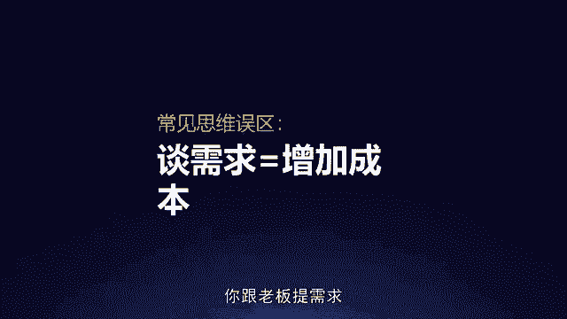
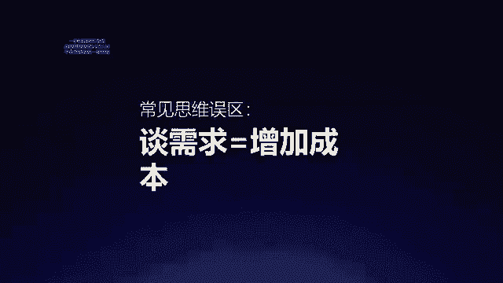

# 梁秋阳--超级沟通力 - P7：007-07.提出需求：两大思路提升你的对上说服力 - 清晖Amy - BV1xFtWeuEao

Hello，你好，我是秋阳，欢迎回到超级沟通力训练营，继续今天课程的学习，今天的课程我们依然还是向上沟通的场景，而且是非常非常关键，也是很多同学之前在课前提问，问过我的一个话题。

叫做我们要怎么给老板提需求，也就是怎么样用两大思路来，提升你的对上说服力，很多时候朋友们都会遇到一个困难，叫做能不提要求就不提要求，因为我们都会有一些想法，叫做我要升职加薪了，这和领导提开。

口感上就特别的low，难道不是应该领导发现我的闪光点，然后主动给我升职加薪吗，啊我在精品演说的时候，如果把话说的很满，总是感觉好像万一出了事怎么办，总是会担心自己这么不谦虚，会招人恨。

以及实在忙不过来的时候，我怕问老板要更多的资源和知识，会显得我很无能，又或者是担心万一被拒绝了，岂不是更惨，以上种种往往都来自于一个误区，叫做很多人都认为你跟老板提需求。

是在增加你们的沟通成本，其实完全不是第一。

为什么要提需求，因为这个世界上会帮你的人，一定不是你不麻烦人家的人，而是你曾经麻烦过人家的人，我问大家一个问题，请你们现在闭上眼睛想一想，在公司里面，如果有一天你遇到了困难，谁会愿意帮你，谁会愿意帮你。

你脑海当中出现的那些人名，希望大家脑海中能出现几个名字啊，千万不要一个都没有啊，如果你的脑海当中出现了一些名字，我相信一定是因为这些人曾经帮过你，而不是你从来不麻烦他们。

所以你觉得你在他们那边积累了非常多人情，他们以后一定会帮你，对不对，这个世界上非常微妙的一件事情是，越是帮过你的人，他们越期待你能过得好，越是你向别人提过需求，他们满足过你的需求的人。

以后越有可能满足你更多的需求，为什么，因为第一一个人帮过你之后，他就成为你的投资者，他当然希望我帮过的人以后能过得好，否则的话岂不是显得我很奇怪，因为他帮你，你们才有机会结成利益共同体，第二其实老实说。

你向别人求助，是让他获得价值感，他能够帮助你，很多时候真的都是举手之劳，但是会让他自我感觉很好，所以不要害怕去求助，给别人一个参与你这件事的机会，因此不会提需求的人，往往不会在办公室里那么受欢迎。

反而是那些特别擅长提需求的人，在公司越来越多的人帮，为什么整个公司都是他的同谋，整个公司的人都觉得这小子是我看着长大的，上次那事要不是我伸手，他可能都趟不过去，那你趟过去了之后怎么着。

他肯定希望你之后能过得更好，来证明自己的价值，因为这个时候他的内心已经跟你们是一体的了，在美国选举的时候，有个很有意思的案例，就是非常多的议员啊，他们在选举的路上，都会选择去住在当地的民众领袖的家里。

为什么，因为他们有一句老话叫做，一个跟你在一个房间里睡过的人，一个把沙发借给你过一宿的人，以后不可能不给你投票，所以他们从来不担心说嗨，我都麻烦了这个人，那这个人以后肯定不给我投票啊，我给他添了麻烦。

完全不是你越给人家添麻烦，在职场当中，只要这个麻烦是有价值的，很多时候反而是拉近你跟他之间的羁绊，所以需求这个东西不要不敢提，一定要提，不要以为不提需求，你这个人很省事，你不提需求，有的时候老板更心慌。

底下这个人做啥事都不问我，底下这个人做啥事都不需要我的帮助，他不会出事吧对吧，你敢提需求，你懂得提需求才是一个正确的认知，可是话又说回来了，不管是谈薪酬，谈提成还是谭晋升，你提需求是不是愣提都行。

怎么提都是对的呢，当然不是，有三种常见的大家提需求的时候会出现的问题，也就是我们常说的普通员工提需求的三个大坑，哪三个大坑呢。

第一个叫做似是而非提需求，什么意思，就是我很心虚，所以呢我希望把我的需求提的越模糊越好啊，您忙吗，哎呀我想这个事是不是需要一些哎呀，算了算了没事，我自己做就好，哎领导，我想下周调个休，休息个哎呀。

实在不行，算了算了，实在不行也没关系啊，或者是呃这个项目我其实哎呀你你布置下来，我觉得唉算了还好啦，应该做的老实说，正常的领导听到你这三句话都会追问，遇到什么事，这个时候你再怎么说，他都会不爽。

因为你话不说清楚，很多时候如果你连你自己都不正视你的需求，领导更不可能认真对待你的需求，而且他也会觉得你这个人想事儿不清楚，什么事情重要，什么事情该提，你居然都想不明白，这是第一个陷阱。

而第二个大坑呢是抱怨式提需求啊。

很多同事不好意思直接提，于是他开始怎么样呢，旁敲侧击，哎呀这个项目太难了，我根本做不来，大家都不配合我，怎么办呢，天哪对吧，我不行，我从来没做过这个项目，这个项目牵扯太多，一个月根本做不完啊，天哪来。

我们虽然经常用亲密关系来类比，职场当中的一些沟通技巧，那是因为亲密关系很复杂，跟职场中有些像，可是你不能真的把领导当成你的女朋友，或者男朋友，撒娇是没有意义的，当然具体的语气上。

也许有些时候你跟你领导有自己的相处思路，你们可以撒娇，这是你们的默契，但是在内容上是需求，就是需求，一定不要把它变成抱怨，为什么，因为很多时候你用这种负面的表达方式去提，看上去你提了需求。

老板看来却只是抱怨，或者你根本不敢直接提需求，只好通过抱怨让老板看到，但是这样子他看到的也只是问题，而不是解决方案，你明白我的意思吗，因此所有的需求请你从抱怨改成你的正向目标。

比如说不要说这个项目太难了，我根本做不来，大家不配合我，请说要完成项目，我现在需要谁谁谁的配合，您可以帮我去跟他沟通吗，不要说啊，我不行啊，我从来没做过这样的项目，而是要说做好这个项目。

我可能会需要怎样的经验，您知道哪个地方可以获得吗，或者您能接受我这一次先边做边学，我们把这个项目的结项期稍微往后延迟一些，或者降低一些对项目的交付要求吗，又或者说不要讲这个项目牵扯太多啦。

一个月根本做不完啊，那你要几个月呢，改成具体的正向的表达，叫做如果要实现这个目标，我建议我们把截止日期放宽到三个月前，两个月我会用来整合资源，协调各部门，如果您觉得可以考虑的话。

我明天就把这三个月的计划表发给您过目，咱们再讨论可以吗，你会发现所有的抱怨改成正向之后，听起来不仅不具备负能量的情绪，还能让人一目了然地听到你究竟想干嘛，所以在职场沟通的时候，请注意，切忌负面情绪。

请将议题导向积极的，建设性的，开放性的，未来的，还记得我们在增量思维中讲过的吗，而具体的做法就是刚才那个样子，最后第三个坑就是威胁式的提要求，我能理解，有些时候啊，大家的需求是非常着急的。

你也很期待能够强化自己的语气，但是这种强化千万不要是负面的强化，比如说老板，我觉得如果你不给我加薪，我真的会很失望，我就没法好好工作，老板我想下周调个休，否则我真的要累死了。

这个项目你还是让那个谁来帮我吧，否则我真的必崩，这么说，也许有些时候你跟你老板有默契，你们互相吐吐槽无伤大雅，但是长期来看，你的主要沟通思路一定不能是这个样子，你的主要沟通姿态一定不能是如此的负面。

具有威胁性的，你想想这个项目你让那谁来帮我吧，否则我必崩，这是什么话，这是不给对方退路的请求，而这个世界上谁都不愿意自己没有退路，你不停地强调你必崩，我就特别想知道你崩了会怎么样。

以及我特别想质疑你真的必崩吗，因为事实上你确实也不一定真的崩，总是有努力的空间的嘛，所以如果你真的想要强化自己的需求，你不妨强化你要到了这个请求之后，你能够实现的效果的好处，比如说不要用这种方式改成。

如果咱们调薪机制灵活一点，我想不光是我团队都会士气大增，不要说领导，我想下周调个休，否则我要累死了，而是下周能调个休吗，这样我正好整理一下这段时间的工作思路，不要说这个项目你让那谁来帮我吧，否则我必崩。

而是我希望某个人能来帮我，这样这个项目就可以怎么样呢，为什么要这么讲，因为第一没有人喜欢，没有退路，所有的具有高威胁性的信息只会招来反弹，因为人在这种高威胁信息的压力之下，他的本能都是先确保我是安全的。

什么叫确保我是安全的，就是确保我就算不这么做也没问题啊，我必须要先确认这件事情，我才会考虑我要不要这么做，要不要满足你的需求，所以千万不要用高威胁的信息来威胁你的领导，第二。

为什么我们要把所有的需求的方式，都改成正面的表述，因为正面的表述才是大多数领导做决策的依据，我不会去思考，你这个人遇到什么样的极端情况了，我只会思考对于这个团队来说，我们这样做能创造出怎样的价值。

真正的聪明人都是很难被逼迫，只可能被吸引的，所以如果有一天我要跟马老师沟通，希望他答应我某个需求，比如说投钱，譬如说做一档新的节目，比如说做一个新的项目，我不可能逼他说，你不这么做就会怎么怎么样。

他就会说，那我倒要看一看我会怎么怎么样，我只可能用一个更有价值的事情来引导他，来吸引他，来说服他，所以谈需求不是在增加成本，所有的谈需求都不要用负面的东西来谈，它不是一种负面的威胁。

抱怨或者是模糊的沟通，它是在协作增量，谈需求不是你要给我多少，而是我们要一起去创造更多的东西，那怎么样能让老板觉得你这个需求，我们是在一起创造更多的东西呢，或者是刚才那些扭转了误区的表述。

有哪些共同之处呢，两点第一点寻找理智利益，第二点交付决定权，什么叫寻找一致利益，就是让老板明白这件事情不是为了让你好受，而是为了让事情让业务编号，这叫做寻找双方彼此的共通点。

而你跟老板在职场里面的共同点，当然就是业务了，因此怎么样能够把你的需求跟业务挂上钩，怎么样能够把需求的价值，和业务的更高的价值挂上钩，就是你要做的第一件事情怎么做呢，两条思路，第一个叫做以情动人。

让他感同身受，第二个叫做以理动人，帮他延伸思路，我们先来看第一个怎么样以情动人，把我的需求转化成领导的需求呢，大家都知道故宫博物院的文创最近做得很好，而领导这一次故宫IP崛起的故宫。

前任博物院院长单霁翔老师，曾经讲过个很有意思的案例，每一次国家的领导来故宫视察的时候，他都会带他们去一个地方，你们猜是哪，大多数人在刚开始听这个故事的时候，都会猜是不是去看最厉害的那个馆藏。

让领导意识到务工特别特别有价值，所以我要给他多拨款，恰恰不是，单院长每次带大家看什么呢，看仓库，看那个漏水的地方，看地下管道，看那些年久失修的建筑，为什么看这些，他要让所有的领导感同身受，叫做我的天哪。

咱们堂堂故宫博物院怎么有这样的地方，你们是真的缺钱呀，我们的钱都去哪了呀，很多时候我们向上提领导都会遇到一个问题，叫做彼此的体感不同，这是为什么，我们说觉得有需求的地方，领导不批。

不是因为他不承认你的需求，而是他没有跟你感同身受，所以最简单的方式是创造一个环境，让领导也能体会你这样的困扰，这是为什么呢，单院长不带领导去富丽堂皇的温暖，干燥的博物馆里面看那些精美的藏品。

而要带他们来看这个阴冷潮湿的库房，是怎么漏水的，因为他要让领导跟他一样面对同样的场景，有了共同的感受之后，他才能理解哦，难怪你有这样的需求，所以如果你也希望向领导提类似的需求，请你试着让他也被绊倒一次。

怎么样说服领导要重新装修，一定是让他也能体会到这个办公室，现在有些地方需要动一动了，怎么样让领导感受到这个项目需要有人手，更简单的方式是让更多的人跟他去汇报，让他意识到这个项目需要有更多的汇报节点了。

因此当你在跟领导沟通需求的时候，第一条思路叫做用创造共同体验的方式，让领导也能跟你一起感同身受，而除了这个感性的路线，还有一个更简单的理性的路线，就是让领导意识到你想要的这件事情。

跟他想要的那件事情本质上其实是同一件事情，什么意思，有一句很有意思的话叫做不是我要加薪，而是公司想要积极性更强的员工，当年硅谷FACEBOOK的高管桑德伯格在刚加盟的时候，跟他的老板也就是创始人提嘉欣。

他是怎么说呢，他说扎克伯格啊，我明白你很想让我来管理你的市场团队，所以你当然希望我是个优秀的谈判者，对不对，而我为什么要给你提加薪呢，因为此时此刻我正在展示我的谈判能力，如果我都没有办法谈判成功。

你给我涨薪，我有什么样的把握去跟我的合作伙伴谈判呢，所以这句话很妙，叫做不是什么，而是什么，不是我要加薪，而是公司想要积极性更强的员工，不是后面跟着的是我的需求，而是后面跟着的是更大的。

你的老板也在意的需求，在他们之间建立因果联系，就是让你的需求成为老板的需求，因此好好想一想，你要的任何的资源，千万不要说成是因为我遇到了什么困难，老板会想，你遇到了困难，你解决啊，你遇到了困难。

为什么要我来搞定这件事情呢，而一定是业务遇到了困难，一定是生意遇到了困难，一定是市场遇到了困难，所以任何时候请你扩大这个框架，不是你要加薪，而是公司想要积极性更强的员工，不是我干不成这件事。

需要公司给更高的报价，而是我们的合作伙伴，需要一个更加有竞争力的配合性的价格，我们才能拿下这一单生意，当然这个时候很多同事会说，那哪有这么巧的事儿啊，对吧，我的跟老板的需求。

总不可能这一辈子都是绑定的吧，毕竟位置不一样，如果不巧，我们的利益就是有冲突呢，比如说老板预算卡的很死啊，我就是要多花他的钱，这个时候怎么办呢，这个时候我们还有别的办法叫做变通，怎么变通呢。

纵向来挖掘需求，横向来细化方案，首先什么叫纵向挖掘需求，就是每一个人都不是就事论事的，我做一件事情都是有背后的目的，不是为了做这件事而做这件事，所以我们在纵向上可以问对方，或者说我们可以自己思考。

我们这个需求，如果没有办法在这个节点得到满足，这个需求有没有别的目标，我们能不能满足更进一步的目标，但是换一个方法，这种曲线救国，例如当领导无论如何不同意，增加两个部门人头的需求的时候，你会怎么做啊。

这件事情在大型的外企经常出现，以及在体制内也经常出现，就编制是有限的，你说你多需要两个人来干活，可是领导无论如何不同意，这个时候怎么提需求呢，很简单，问一问，如果你增加两个部门人头。

只是手段什么才是目的，是完成什么项目吗，那有没有别的方式可以帮助你完成这个项目，比如说他可以特批一笔顾问咨询的费用，你不增加内部人头去请外脑帮你干活儿，比如他可以用大量雇实习生的方式，来解决这个问题。

甚至更加釜底抽薪的，有没有可能这个项目的交付减少一点，难度，降低一点标准，这都是有可能的，当然你会说，那有些时候老板就是要对吧，吃草挤奶啊，那我这头牛怎么办呢，OK还有另一个方案叫做横向细化方案。

每一个方案如果在当前那个节点上行不通，还可以变成别的形态，例如说当老板说你要的薪酬太高了，不符合公司规定，你该怎么办，这个时候大多数人都会跟老板argue说，我们公司规定可以改一改嘛，啊对吧。

这当然是一种思路，因为我们彼此有一个更高的目标，叫做让员工得到激励，但还有办法叫做横向细化我们的方案，例如说所谓的太高，具体指的是什么呢，是不符合公司的职级要求吗，那很简单啊，把我的职级提上去啊。

当然往往没那么好的事，那是不是整体的收入也超出了预算呢，那也很简单，我们的收入是可以按照不同的部分来叠加的，如果年薪超出了预算，超出了我的职级的限制，那我的年薪可以只变动到上限，还不足的部分。

能不能用其他的酬劳和奖励来完善和补充呢，例如说增加一笔项目奖金，这样就不用计入年薪了，又比如说对于我额外的工作酬劳，公司可以给我结算一笔额外的专款，专批的费用呢，还是月薪不符合绩效呢。

如果月薪不符合绩效，是税前还是税后，那有没有别的财务算法可以用这个事情搞定呢，或者是别的同事可能会不平衡，那有没有其他方式可以让别的同事感觉，我这个东西并不是在加薪。

而是只是单纯提升了额外的绩效bonus呢，每一个方案到背后都会有无数考虑的时机，除非你的老板真的就是完全不认同你的价值，那是我们之后要聊的话题，否则单纯因为限制而导致的需求不足，所有的客观限制。

都可以用主观的努力来试着加以破解，我承认也许有的时候我们就是会遇到死局，我我们一定做不到的时候，但是至少有了今天的思路之后，你会知道你还有别的方式可以尝试，在这些方式尝试完之前，你都没有真正失去希望。

因此如果你的老板告诉你说有一些特定的原因，你可以要求他说，那你不用这个原因，你具体会怎么描述这个情况，什么叫工资太高，工资太高有很多种讲法，对不对，什么叫我要的资源太多，什么叫做这件事情很难沟通和协调。

我试试看有没有可能稍微调整一下我的方案，你看这是另一个关键点，不是我在逼问你，而是如果对你造成了麻烦，我来试试看我能不能改我自己的方案，而如果你能够因为这件事情做出更细致的协调。

是不是反而本来有更大的机会，达到你原本的目标和诉求，这是我们讲的第一件事情，寻找一致利益，第二件事情就简单了，就是在寻找完一致利益，明确地提出了你的需求之后，你需要做的一个收尾动作叫做交付决定权。

什么叫做交付决定权，但他们心中一定有一个想法，就像当年张艺谋的电影满城尽带黄金甲，里面发哥说的那句叫做朕给你的才是你的，朕不给你不能抢，有些东西朕可能愿意给你，但是如果你逼朕，朕就是不想给你。

所以我们每个人提需求的时候，不管是出于礼貌还是出于对人性的揣度，我们要把选择和自主的权利完全交给你的老板，因此每一次提需求的时候，在期待领导满足你的需求之前，你首先要满足领导的权威。

这也是为什么我们千万不要用抱怨，不要用威胁的方式去提需求，因为这本身都是在触犯和损伤你的老板的权威，这个时候有些同学会问了，可是你一开始不是说不要太模糊吗啊，不要话，说到一半就说这事可以可行可不行。

那老板不就会觉得既然可行可不行，你说出来干嘛呢，这二者的差别是什么呢，模糊的需求是一开始就跟老板说，哎呀其实这个需求满不满足也行吧，这个时候我是老板就会觉得，那你提他干嘛，而什么叫做给老板自主权呢。

是你一开始的需求是说的清楚而坚定的，我就是需要这个，如果你给我，我们能怎么怎么样，但是你最后的态度是开放的，当然如果不行，我们还有别的替代方案啊，您可以参考，这是我的想法，这叫做需求要具体。

但是态度要开放，也就是我们讲的第二点，交付决定权，因为没有人喜欢，没有退路，没有人喜欢，没有选择，不要害怕把决定权交给老板，他就会轻松的决定拒绝你，你越是把决定权交给他，他越是从容的。

而他满不满足你的需求，取决于你的需求究竟提得好不好，有没有价值好，那综上两点，提出明确需求之后，寻找一致利益，交付决定权，打造一个好的需求提案，那最后我们看一个综合案例，这是一个职场中的真实案例。

也是一个做的非常棒的案例，是一位同事在一个大企业当中，发现自己由于入职时间晚了那么几天，没有办法参与第二季度的考评，也因此可能无缘第二季度的奖金，他当然觉得很不服气了，因为他那个季度干活干的很辛苦。

可是怎么问hr，hr都说这是规矩，所以他决定向自己的老板提出一个需求，我们来看一看他是怎么提的，在此之前，大家先想一想，你会怎么说呢，你知道这里面的一致利益可以有哪些吗，你知道怎么样在最后交付决定权。

可能让老板比较舒服吗，好我们来看一看他的做法，首先来看他的第一段描述这个事情的前因后果，Hello，老板抱歉打扰您，我这边收到了关于Q2的绩效考核的邮件，刚刚得知，因为两个工作日之差。

未能满足入职满三个月的绩效考核限制，所以不能参与第二季度的考评，我明白公司有制度，只是由于情况很特殊，离符合资格的时间也很短，所以我还是想申请能一起参与第二季度的考评，你看这里就明确的提出了需求。

我就是希望能参与考评，我知道不符合规则，但是我就是希望不管答应不答应，你先把需求提出来，接着我们来看他的第二段，是怎么构建自己的需求，跟领导的需求之间的一致性的，我理解啊，考核的目的是获得反馈与建议。

得到激励与肯定是考核的目的哦，不是我的目的呦，啊所以前一个部分来看呢，我完整地参与了这个项目的，从叉叉到叉叉的运营过程，提出了很多能启动的运营方案单，从业务的角度来说，我都很适合，也很需要做绩效考核。

因为这样才能得到及时和充分的反馈嘛，除此之外还有第二点是从激励的角度来讲，我们这个是创新型业务团队，很需要保持活力，而第二季度的测评也是对我之前工作的肯定，也是对我之后工作的一次激励。

你看他一开始就讲得清清楚楚，这个考评不光是为了我，更是为了业务，我参与了这么多，我只差了两天入职的时间，那这个考评难道不应该给我一个反馈吗，我们这个业务是新业务哦，当然这个时候可能有些同学会说哈哈。

那我如果我是老板，我就说给你反馈，不给你奖金，所以他也很大方的提出，那从业务的角度来说，还有另一个功能叫做团队需要得到激励，尤其咱们这个是新业务啊，非常需要团队的冲劲跟活力。

而Q2的测评可以对我之后的工作进行激励，所以你看两个点讲完，他给的其实不是他自己提出需求的理由，而是老板如果想要同意他的这个需求，提案，老板可以做决策的理由，所以你发现了吗，你在沟通的时候，很多时候。

尤其是向上沟通，你要提供的不是你自己的理由，而是对方能够用的理由，最后给予决定权啊，制度从来不是为了框死人的，而是更好管理和激励人的，所以我也想要通过主动的协调，向公司表达自己的想法。

这里还提了一下制度本身的目的是什么，职场最重要的就是敢提要求，能被拒绝嘛，所以如果最后实在没办法参与考核也没关系，希望能够得到老板的反馈，谢谢你，看最后还有一句退步叫做零决定，实在没办法也没关系。

反正我需求都提出来了，而且呢还给自己留了面子和台阶，叫做职场，重要的就是敢提要求能被拒绝吗，就算没有得到满足，我最后也希望能得到您的反馈，OK这个很有意思，所以基本上你会发现这是一个很多同事。

平时也许会难以启齿的，叫做开口问老板，要激励绩效奖金，但是如果你真的要去说的话，他能够说的非常有体面，非常有说服力，只要你用刚才的步骤明确提出需求，构筑需求一致性，最后把决定权充分地交给对方。

那到最后可能有朋友会好奇，唉呀这个原来总是不愿意提需求，除了是可能不太确定怎么提比较好，还有个原因是我担心直接提需求，会不会显得我这个人太直给啊，就是中国人讲究含蓄是美嘛，可是含蓄只符合审美要求。

不符合现代职场的效率要求，除非你的老板啊，你很明确的了解他就是喜欢那种含蓄的人啊，他就是喜欢主动，喜欢员工被动，那是另一回事，可是非常多的老板给我的反馈都是，他很希望你能直接给他提要求。

因为这样他才能知道怎么激励你，怎么激励你，就好像我们曾经说过的，不用担心给他提需求会困扰他，因为他拥有充分的权利，把这个信息提供给他，把你的想法提供给他，才是有效的，充分的沟通，那当然学了今天的课程。

我不敢保证你会一定不被拒绝，所以千万不要担心你提的需求被拒绝怎么办，就好像刚才那个案例里说的，职场重要的就是敢提需求，能被拒绝，重要的不是不提需求，保全面子，而是你用我们正确的沟通方法。

这样你提出需求就算被拒绝，你也能学到更多东西，而且当领导在拒绝你的时候，你往往能因此收到更多很重要的反馈，你可以从问他，为什么不可以问他对于某些事情的看法，跟你有什么不同，用这种开始慢慢对齐的方式。

来开启一次更有效的沟通，所以不要把提需求，当成是一件给领导添麻烦的事情，很多时候你是在避免他的麻烦，更不要把被拒绝当成自己职场上的一次挫败，很多时候，某一方的拒绝往往才是另一次有效沟通的开始。

有些问题你平时不好意思问领导，这次拒绝了，你厚着脸皮问出来，你都拒绝我了，我有什么不好意思问的，对不对，所以不要害怕拒绝，沟通是一个连续的不断向后的过程，这一次的拒绝，可能就是下一个有意思话题的开始。

因此我们要有提需求的勇气，也要有接受拒绝的觉悟，更要有从拒绝中学习到东西的智慧。