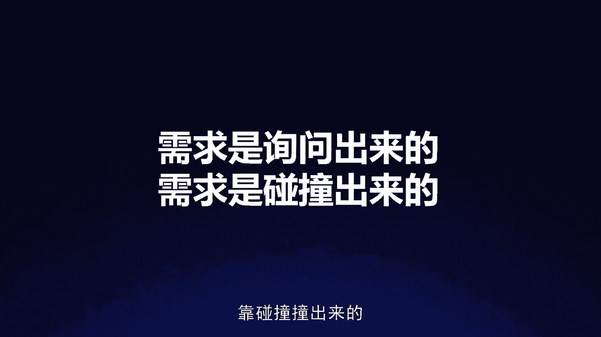
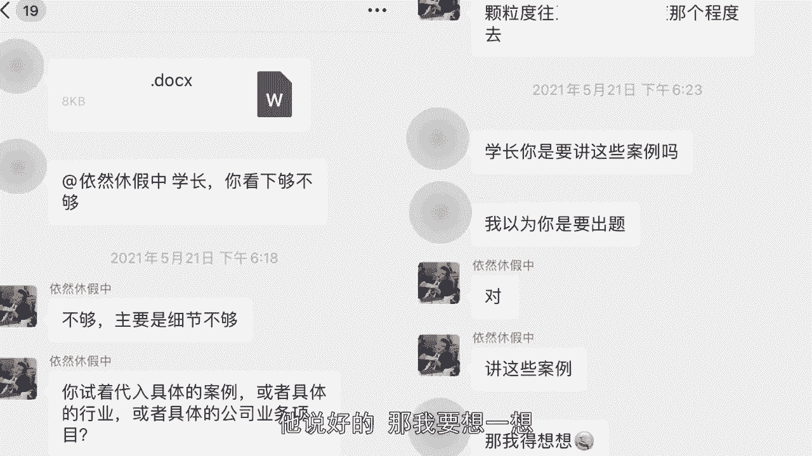

# 梁秋阳--超级沟通力 - P8：008-08.管理需求：沟通中如何回应上级对我的要求(1) - 清晖Amy - BV1xFtWeuEao

Hello，你好，我是秋阳，欢迎回到我们的超级沟通力训练营，继续今天的课程，学习用沟通优化关系，在职场高歌猛进，我们还是继续学习向上沟通的场景，怎么样用好的沟通打造你的职场靠谱人设。

让你成为每一个老板人见人爱的好下属，那今天要聊的呢是管理老板的需求啊，很有意思，你会觉得我有什么资格对吧，我一个小下属，我何德何能去管理他的需求，事实上你越懂得管理你老板的需求，你就越让他省事儿。

因为他知道自己提出的每一个需求，底下都会有一个软垫子，什么叫软垫子，就是它既能落地，不是无衣无着，有一个垫子在那，与此同时呢，这个软垫子呢又可以帮助他很舒服的知道反馈，调整自己的预期。

所以当领导对你提出需求之后，你不仅要答应和拒绝这两种方式，你在应对当中要有更细腻的层次，也就是在沟通当中，如何更好的系统化的回应上级对我的要求呢，是我们今天的课题，很多时候职场当中。

领导的需求总是未必那么让人舒服，和对下属友好啊，领导有可能会临时安排任务给我，他下达任务的时候呢，有的时候话只说一半，以及他可能对我的表现不满意，但我已经尽力了，怎么办呢，以及我已经按照他的话去做了。

为什么他还没有满意，为什么我还是升不了职，很多时候都是因为你只知道遵循需求，或者拒绝需求，而不知道管理需求，不知道在跟他的沟通当中，怎么样多层次的去回应他的需求，而这就是我们今天要聊的话题。

怎么在沟通中对领导进行需求管理，简单来说它分成两个大的模块，第一块叫做挖掘需求，第二块叫做超预期交付，这两件事情都做到了之后，你就是一个非常善于需求管理的向上沟通者，好我们一步一步来看什么叫做挖掘需求。

就是领导说的话未必就是他真实的最本质的，最需要你去听到的那个需求，他的需求往往不是你单一听就能听到的，而是要靠询问问出来，靠碰撞撞出来的。

我们一个个来讲，什么叫做靠询问问出来的问题，很多时候尤其是体制内的同事，往往我们会遇到一种情况，叫做我明明按照领导的要求去做，为什么他还是不满意，为什么他还是不满意，如果大家还记得。

我们在倾听这节课程当中的内容，我讲过一个很有意思的话，叫做没经验的秘书只会上传下达的说，这是领导的原话，可是有经验的秘书会说这是领导的目的，所以为什么，有些时候你明明按领导的要求去做了。

是因为你只是按他字面上的要求去做，没按他真实的要求去做，那问题来了，我怎么知道他的要求，真实的要求是什么呢，拷问，所以当收到工作信息后，你的第一时间的回复是什么呢，千万别是好的，收到。

除非真的是肉眼可见，毫无疑义，诶，小李帮我去买个烟，这种问题啊，除了这种以外，请记得先问出他真实的需求是什么，不要只回一句，收到给大家举个例子，前段时间我给我的员工布置一个任务，我以为我讲得非常的清楚。

事实上，所有的领导都会认为自己讲得非常的清楚，因为他自己是很清楚自己要什么的啊，我甚至说出，你不用编辑PPT，你给我word就好，我只需要看内容，我的同事说好的，可是呢最后的结果是什么呢。

是他给了我一个文档，我看完之后说不对劲，这个细节不够，你的颗粒度至少要到某个某个程度，他说哦，所以你用这个东西是要用来讲吗，我以为是有别的用途，我说对我是要讲，他说好的，那我要想一想。

这个时候你会发现一件事情叫做，他虽然态度很好，可是单纯从任何人的直观描述当中，都未必能够呈现一个复杂需求的全貌，这也是为什么，我们两个人虽然已经合作了这么久，可是我给他一个我自己以为很清晰的要求之后。

还是没有办法让他一下子就弄明白，具体需要做什么，原因是大多数的指令，它只是一个结果，它不是一个需求，什么叫做指令，只是结果，不是需求呢，是领导的，每一个指令往往都是他自己想玩了一圈。

然后发现我需要这个才能实现那个需求，于是呢他给你说的就一句话叫做，你帮我弄个这个过来，可是由于你不知道这个指令的目的，是为了实现那个真实的需求，于是你照着做，最后的结果是这件事情做完了。

但是领导最终的需求没有得到满足，这叫做很多指令都只是结果不是需求，就好像他刚才给了我一个word里面有内容，但是由于我没有办法通过这个内容来满足，我最后面那个需求，我还是觉得你这做的不对呀。

我要的不是这个是那个呀，而这个怎么办，这个要靠你自己去询问出来，怎么问，问两个东西，一个叫做目的，一个叫做边界，目的特别简单，就是问领导，您要这个东西是干嘛用的。

领导说你去帮我把销售那边的电话数据拿过来，这个时候，你贸然的去隔壁部门进行一通复杂的交涉，你拿到的东西到底是什么呢，你拿到的电话数据是他要的那个电话数据吗，能满足他的那个需求吗，你通过这么大的代价。

可能甚至得罪了那边的小领导，或者那边的同事的代价，拿到了这个数据，是他希望你做的吗，他是不是本来其实有更简单的方式，就是自己打个电话呢，这个时候如果你懂得去问诶，老板，咱们要这个电话数据的目的是什么呀。

OK也许能够更好的减少你在执行当中的落差，当然有些同学会问了，要你去干，你就干，你怎么那么多废话呀，领导什么事都需要你过问，你烦不烦啊，没错，但是这个东西充其量只是告诉我们说啊。

我们要尽可能用不烦人的方式，不冒犯的方式去挖掘，去询问领导的最终目的是什么，比如说你可以去猜领导说，去帮我把销售的电话数据拿过来，你可以向他询问，叫做哦，我明白，如果是要实现那个目的的话。

所以我应该拿这部分数据优先拿这些对吗，还是要全拿呢，OK这个时候领导给你的回复，你就知道他真实的目的究竟是什么，这叫做问目的，接到每一个指令都往后问，你们问的越多，你知道的需求就越多。

而且你的心中是非常坦然的，不管领导觉不觉得你烦，至少你是在努力领会他的真实意志，甚至你是在帮他思考，因为很多领导在一开始布置自己的指令的时候，未必想得清楚，这个指令跟最后那个目的之间的联系关系。

第二再烦也不如事情做不成，反，对不对，还记得几页PPT前的那个案例吗，你说我作为他的老板，是我是更愿意忍受他这件事情，做的不符合我的心意，得重做这件事情造成的麻烦，还是他在接收任务的同时多问我几句。

给我添的麻烦，我肯定是更愿意忍受后者，对不对，好，而你能问出越精确的目的，你能给出的解决方案才会越对口，这是问目的，那除了问目的，还能问什么呢，特别简单，问边界，就是问各种各样的情况下。

发生的不同的处理思路，用这个方式来确认这个项目的边界，比如说当领导跟你说，哎这个项目你跟一下，你除了问您希望我在跟的时候，留意哪些地方之外，你还能问什么呢，还能问责任边界啊。

首先这个项目我现在算是负责人了吗，还是这个项目中哪些事情是我自己决定的，哪些事情是一定得您把关的啊，以及意外编剧啊，出现了一些例外情况，比如说如果销量不好的时候，我是需要推翻重做吗。

还是我就把这个项目按照现有的方法跟到底，那如果到时候无法准时交付的时候，我应该怎么处理，以及期限边界，这个项目我应该多久和您汇报一次，它的截止日期是什么时候，我当然知道很多同事会担心说。

我所有的问题都在一开始的时候，一股脑儿的问领导，他不成10万个为什么了吗，所以你核心要稳的是这几个边界，把这几个边界确定好，基本上就像一个平面上确定了三个点，可以确定一个平面一样。

一个项目的本质其实就是这个项目的边界，当我们在看到一个圆的时候，我们看到的其实不是圆这个概念，我们看到的是这个圆的边，它那个边消失了，这个圆也就融入了背景当中了，所以当我们在了解一个项目的时候。

我们经常要问的除了这个项目的目的，还有他在各种各样的边界上的处理的规则，确定了这些东西之后，我们就能知道领导的真实需求究竟是什么，这是问的部分需求，很多时候是靠询问问出来的，这是第一层。

那你说有些时候问的差不多了，那就真的已经确定了吗，还有第二种叫做需求是碰撞出来的，什么意思呢，就是在遇到冲突的时候，看领导的选择，自己手头上有四个活，老板临时给你加派了一个，你会怎么回复。

我相信这个时候绝大多数的同学的回应，两种类型，第一种是勤奋型，好的老板百分百完成任务，第二种是机智型，哈哈老板我忙不过来了，我手头有四个项目的啊，要么能完成，要么不能完成，听起来就这两种。

但是事实上这两种都有一个缺陷，叫做你没有给老板思考和决定的空间，你只是按照自己的思路在想，我能做完和我做不完，以及我要不要花点代价把它做完，但是这个时候其实还有一个回法，叫做跟你的老板碰一碰。

什么叫碰一碰，就是有时候啊领导在给你一个任务的时候，他也未必确定自己想要什么，什么叫未必确定自己想要什么，就是他可能会什么都想要，你明明已经手头有四个活了，他为什么还要派活给你啊，就是因为他啥都想要吗。

这就跟我们进一个理发店里面，别人问你怎么剪，你的第一反应都是剪短一点就好，可是具体怎么剪短怎么好，你是没有费心去想的，老板很多时候就是员工的客户，你要思考的就是像理发师一样，怎么样跟他碰出他真实的需求。

比如说像刚才那个案例，你就可以用提供方案加询问选择的方式，让他真实的需求得以浮现，把他真实的需求碰撞出来，领导我现在手头上还有其他四个项目，如果要额外加一个项目呢，档期恐怕需要有所调整，我有三个想法哈。

第一个是要不要其他四个项目先研一研，因为这个是宁先加派的，可能比较紧急，第二个是其他前四个项目呢，我们的交互标准的节奏调一下，降低点难度，这样我能匀出时间或者第三个方式啊，我们可以整体的延期。

你给我更多时间，我一定能保证全部都搞定，您觉得哪个方案好，这样三个想法列出来，表面上看是你在推卸责任对吧，你就是不愿意努力把它干好呗，但其实你是在帮领导节约时间，帮他梳理他的思路。

因为你的领导也未必想过，你就一定要加班，把所有事情都干好，因为人啊工作时间多了，你的质量就是会受到一些损失的，就完全的保质保量是不存在的，虽然领导有些时候会这么说，可是你至少要给他选择的机会。

他要知道你就是在加班才能做完这件事情，所以质量可能不能要求那么高，把风险点先提出来，才能让他对于潜在的结果有足够的预计，那有些人会说，那这是不是在忽悠他，我明明可以加点班做完。

我还要给他假模假样的选一选，让他在三个我比较喜欢的方案里选一个，这其实不是在忽悠，这反而是在告诉他更多的信息，你想想看这个方案，你明明有可能完不成，明明有可能五个项目无法得兼，结果你就自己硬着头皮做。

这是不是反而让他陷入了被动，因为他原来没有想那么清楚，他知道这个项目急，但未必考虑过这个项目是不是最急的，所以你给他三个想法，让他选，才是在帮助领导确认项目的紧急程序，帮助他做排序，才是在真正的帮助他。

因此领导提的需求不仅需要提问去挖掘，更需要你整理之后跟它碰撞，很多时候我们会说，那这样听起来还是非常的消极啊，不够勤奋，不够积极主动，为什么我们就不能努力地干流血流汗的干，把这件事情全部干完呢。

首先第一我们是职场人，我们要对自己的能力有充分的预估，这是理智的，不是任何时候流血流汗，你都能把它干好，其次第二点，懂得提前说出风险点和向领导表明压力，才能彰显你的努力的价值，因为你要知道按时交付。

按质量交付和按时交付，但是高质量交付是不同的，你懂得提前点出风险点，才是给自己留下了安全的斡旋，优化这个项目交付的空间，与此同时，更重要的是，第二点，你也给自己留下了在职场中，在和领导的沟通。

在满足他的需求，完成他的任务的过程当中，制造惊喜，创造出超预期交付的机会，也就是我们今天要聊的第二点，在做需求管理的时候，第一步是要挖掘出领导的深层次的真实的需求，第二步针对这个需求。

我们要尽可能做到超预期的交付。

什么叫做超预期的交付，为什么在职场当中，我们正常交付是不足够的，我们要努力去创造超预期的交付呢，这是一个听上去不甚合理，但是却符合人性和人的认知习惯的做法，什么意思。

这个世界上能够被别人记住的东西总是有限的，而人的认知特征是，我们只会记住打破我们预测机的东西，不管是意外还是奇迹，还是额外的倒霉的事情，我们这辈子能记住的大多数事情，都是在那一刻创造出了超出我们预期。

击穿了我们的期待的事情，所以你作为一个职场人，如果你希望你的努力有所回报，甚至能够超预期的回报，你就要懂得怎么样去在交付过程当中，创造超预期的体现，让领导感觉到你不是能，而是你既能也能还能。

这叫做超预期的交付，比如说曾经我有一个同事，他的能力非常的优秀，但是他真正进入管理层视野范围内的那一刻，是什么时候呢，是一个非常重要的项目，当所有人都以为这个项目由于当时工期太短，必然要被砍掉的时候。

他主动提出，不好意思，这个项目我已经默默的做完，那一刻，公司所有的合伙人都非常的震撼，你说在这件事情之前和之后，他的能力有质的飞跃吗，未必可是我们对他的印象有质的清晰和强化，为什么，因为这是一次意外。

我们说在沟通当中不要说大话，不要说假话，可是如果有机会能够创造，击穿对方预期的良好的体验，为什么不能够让领导意识到你的这部分价值呢，而他的做法特别简单，就是在正对需求之后。

我们去思考怎样的交付是正常的交付，然后循着这个标准努力做到更多，不管是在沟通的过程当中，还是在配合的过程当中，你在表现和行为的时候，要循着这个目标去努力，这也是我们所说的沟通不仅仅是动嘴。

更多的是动脑和规划自己的行为，因为你和领导之间的沟通，你的向上沟通很多时候是凭借你的策略，你的行动方向，你的做法去完成的，而不仅仅是靠你的语言来完成，比如说海底捞。

为什么总是能够给大家超预期的服务体验呢，仔细想想，其实这件事情很没有逻辑，因为服务员跟客户相处的时间，在海底捞和在别的餐厅是差不多的，因为这个相处时间太多，客户吃饭的时间就减少了，这体验必然不好。

所以海底捞的做法特别简单，他是在努力地寻找一些能被你记住的东西，来突破你的预期，让你留下深刻的印象，比如说谁都知道点菜的时候要提出建议，可是正常的预期是你可以告诉我什么好吃，但是他能做到的事。

我告诉你什么东西难吃，今天不要点，于是客户留下了深刻的印象，再比如说业界知名的里斯卡尔顿，他的著名的打破脚本的服务是怎么做到的呢。

是当一对夫妇他们回到家之后，打电话给酒店，前台说我小孩的长颈鹿玩偶落在了酒店，请你们寄回来的时候呢，告诉我的小孩，他的长颈鹿啊，不是我们忘了，是在酒店度假，来圆一下我们的谎。

因为我们刚才是这么安慰我们的孩子的，两周之后，酒店员工寄过来的，不仅仅是这个长颈鹿和刚才那封信，而是一整本相册告诉他的孩子，你的长颈鹿呢，你看在酒店的这些地方，在沙滩上，在鹦鹉旁边，在床上，在电瓶车上。

在监控室上，在别的玩偶的怀里都进行了度假，他是在这些地方玩过，所以延迟了两周才到家，你说其实两周把玩偶送还回去，是一个很好的很有效率的做法吗，未必，但是他做的这些事情是一个超出预期的做法。

所以怎么样先塑造预期，了解预期之后再超出预期，这样的沟通策略比较容易让你的努力被人看见，因此当领导问我，能在下周一之前做出这个方案吗的时候，一般人可能会回答说啊，好的没问题，百分百完成任务。

但是你要知道这样的回答不仅不是诚实，反而可能增加领导的决策风险，因为他根本不知道你这个好的没问题，百分百背后是要付出怎样的努力，以及面临着怎样的风险，可能你是要好几个通宵加班才能完成，但你由于态度好。

你就直接把它藏在了你的好的，没问题后面，事实上你就让你的领导，跟你一起冒了同一个风险，叫做万一你有一天没有通宵，那可能就做不完，又或者是由于你面临着很大的工作压力，可能这个项目就算在下周一之前做完了。

但未必能达到他期待的那个交付标准，因此懂得需求管理的回答会说，我这周有好几个方案在做，未必能来得及完成，但我一定会优先做您的，这样看似后退了半步，但其实把更多的选择权利留给你的领导，因为他会知道。

由于你手上有很多事情在做，所以这个项目如果真的很重要，那我应该多找几个人帮你，或者干脆交给别人，而如果他不在意这件事情，他当然可以继续交给你做，因为你承诺了优先，而由于你说出了前因后果。

所以当你交付的时候，他也会知道你是在为他做优先，你是创造了额外的价值，而不会只是单纯的当成啊，你就完成了你的一个本职工作，当然配合前面的还有另一个前置条件，大家别忘了，我们还应该优先问一下领导。

这个方案的需求究竟是什么，遇到了各种边界的情况，我应该怎么处理，这就是一个完整的需求管理的沟通案例，因此很多时候，我们之所以要在沟通当中学会管理需求，不光是为了自己，更多的也是为了我们的上级。

对每个人在发布一个指令的时候，这都是这个指令的1。0版本，随着你们彼此的讨论，询问碰撞，这个指令会变成2。03。0版本，不要担心你的领导会因此觉得你烦，因为在大多数工作场合当中。

大家还是更重视事情能不能做好，如果你的领导发现把命令布置给你，虽然你可能会提出很多其他的想法，甚至有一些是反驳他的意见，但是由于把这个指令询问的碰撞的，变成了2。0版本，3。0版本变成了更加的靠谱。

更加能成事，在这个完整的反馈周期中，他会意识到跟你布置工作是省心的，他的每一句话说出来之后，你会代替他去用脑子，久而久之，你反而更容易得到重视和欣赏，而另一方面也要明白，怎么样能够主动地创造超预期交付。

让领导意识到你的这段话，你的这件事情，你办得出彩的地方在哪里，为什么这个地方超出了原来有的标准，先塑造标准，再越过它，创造超预期交付的体验，才能不让你的努力成为某种理所当然，而是得到正确的对待。

以上两个步骤还记得吗，先挖掘需求，再超预期交付，这就是在沟通当中如何实现向上的需求管理，有些时候我们不仅要自己懂得提需求，对于领导给我们提的需求，你也要知道如何细腻的去回应。

