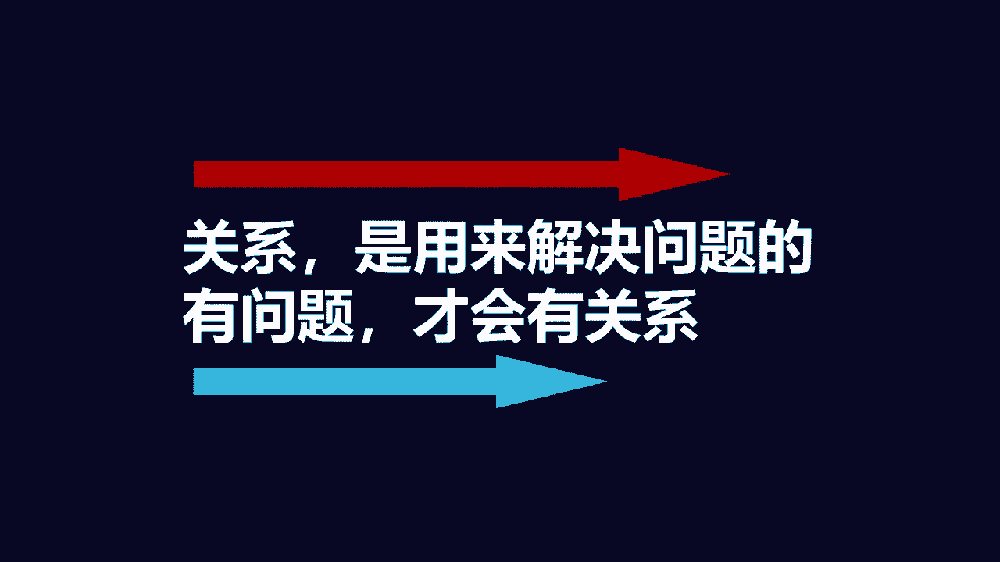
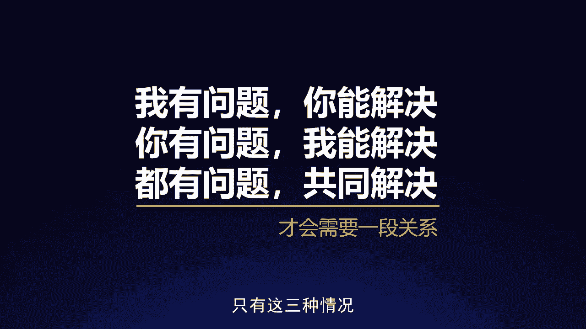
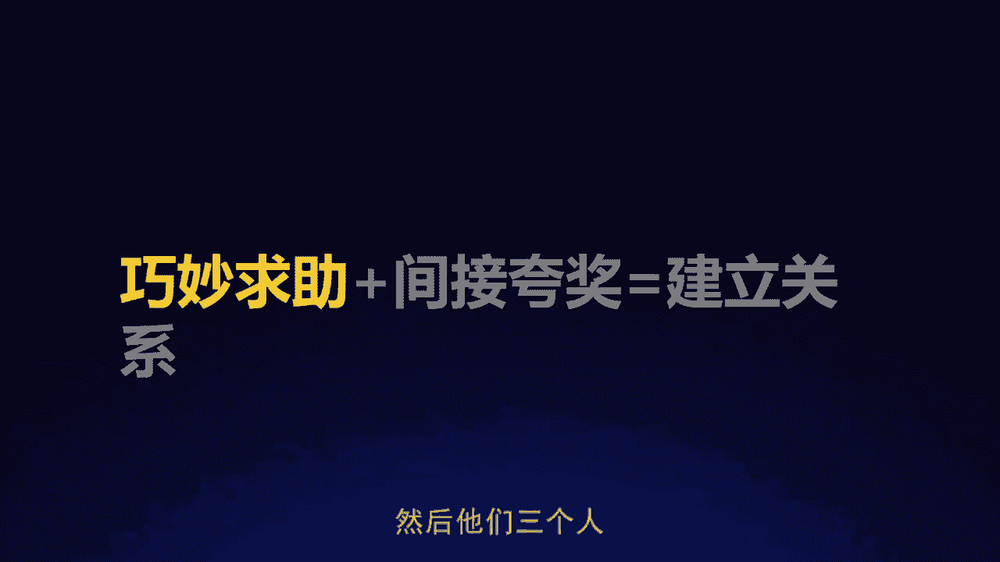
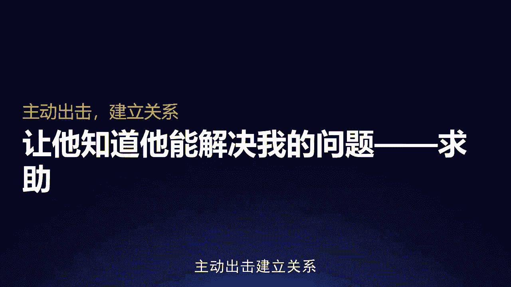
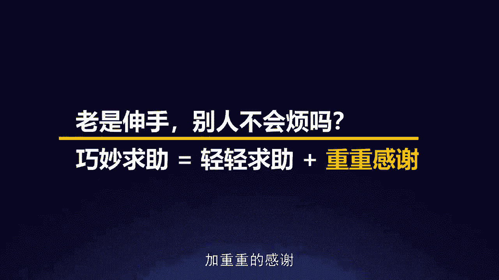
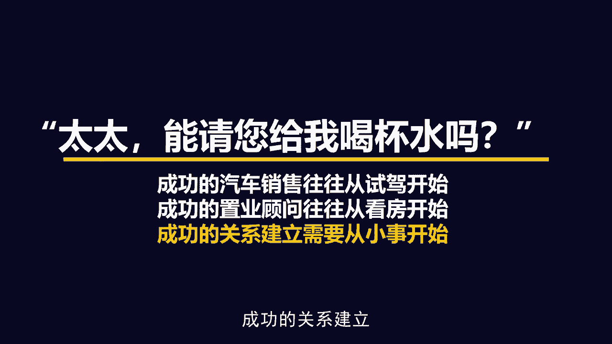
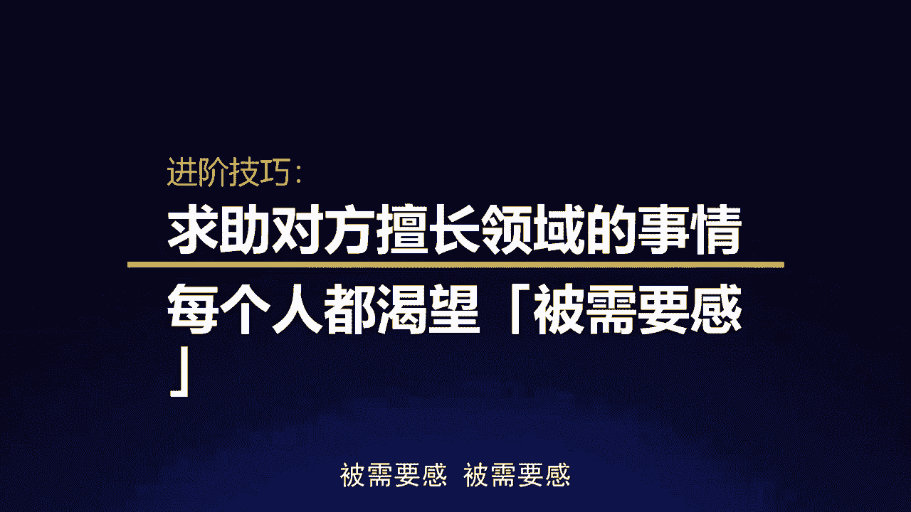

# 梁秋阳--超级沟通力 - P10：010-10.连接：怎样和同事建立真正的“关系” - 清晖Amy - BV1xFtWeuEao

哈喽你好，我是秋阳，欢迎回到我们超级沟通力训练营，继续我们的课程，那今天要聊的话题呢，是非常多在职场的朋友都会关心的一个话题，甚至他们会认为这个话题是在沟通之前的，一个前置问题，就是如何跟人建立关系。

对我临时想找同事帮忙，但平时和他不熟对吧，人到用时方恨生，这个时候我就会觉得，为什么我不是那种长袖善舞的人啊，为什么我不是可以和隔壁部门的同事打成一片，让他们能够把多余的资源愿意给我的人。

为什么我在职场混了10年，别人在职场混了10年，但是我的人脉圈子跟他的人脉圈子，看起来就不一样啊，我怎么样能够在同事当中，成为那个有影响力的人，每次有什么事情啊，重点是有什么机会，他们是能够想到我的。

跟他们如果要合作的话呢，我的老板也会相信我跟他们合作是比较顺畅的，因为我们关系好，那所有所有这些东西都指向了一件事情，叫做我要如何建立一段关系，我们人生当中非常多重要的关系。

大多数情况下我们都是不知道他怎么建立的，或者他是被强制的建立，我们没有选择权利，比如说父母和小孩，对不对，我们出生下来，他们就是我们的父母，我们就是他们的小孩，这个关系没得选，再比如说夫妻关系。

这个关系是有的选的，可是我们现在都比较强调缘分对吧，而且你都已经在一起了，基本上这个关系还包含很多复杂的因素，包括性吸引力，包括当时的一些偶然，包括两个人的彼此家庭的一些复杂的元素。

那在职场当中的关系跟这两个都不一样，他既没有那么的偶然，也没有那么的强制，你可以跟一个同事在一起共事4年，但是离职的时候删掉微信号，双方都不会有任何的遗憾跟可惜，你也可以跟他建立起一个很好的关系。

下一次你创业或者他创业还会拉上他，所以我们要怎么建立一段在职场当中的，这种非强制性非偶然性的关系，怎么样，我们有意识地去设计一段关系，怎么样能够有意识地去拉近，我跟我想要建立关系的人之间的距离。

这是我们今天要聊的话题，而聊这个话题的时候，我们来看一个最常见的场景，也就是前面我有提到过的一句话，叫做我跟这个同事不熟，我们怎么找他帮忙啊，我有一件事情需要他帮忙，可是我跟他不熟诶，这怎么办呢。

我要怎么去找到一个我熟的人呢，好这里面是非常多的朋友，在职场会出现的一个误区，叫做我不熟，我怎么找他帮忙，言下之意是，我只有跟一个人先建立了一段比较密切的关系，我才能够去找他帮忙，这件事情完全是颠倒的。

为什么，因为不是不熟。

你没法找他帮忙，而是如果你永远不找他帮忙，你们永远熟不起来。

明白我的意思吗，如果你永远不找他帮忙，你们几乎永远不会熟起来，你想想看你跟一个人要怎么熟，基本上你是不可能凭吃几顿饭就熟的，非常多人心中有一个困惑，叫做我跟一个人的关系，到底是什么时候建立起来的。

是我跟朋友聚餐的时候老是坐在一起吗，是我跟他公司同事出去团建的时候，我们经常互相帮助吗，还是我们有很多的共同语言呢，其实这里面有一些是有一些不是都达到一点点，如果一定要用一个概念来归纳，我们要建立关系。

我们要先要了解什么是关系的话，我们要知道，关系的本质是用来解决问题的工具啊，关系的本质是用来解决问题的工具，什么意思，什么时候你会跟一个人关系好，当你们共同处在同一个问题之中。

这就是为什么战友同窗关系往往特别好，因为大家在共同面对同一个问题啊，我们要每天在一起学习，如果我们不建立起一个比较好的关系的话，会影响大家的学习状态，这个时候我们就很容易会成为好朋友。

或者要么我们就会很容易分开，所以所有的关系都是用来解决问题的，如果你发现你跟一个人慢慢疏远了，不是因为你们两个人出了问题，而是因为那个问题消失了，换句话说，关系是用来解决问题的，下一句叫做有问题。

你们两个之间才会有关系。

你跟老板之间关系为什么能够密切，一定是因为这个时候你们遇到了一些问题，非如此不得以解决，所以这个时候你们的关系很容易建立起来，所以你在职场当中想跟另外一个人建立起关系，你优先要考虑的是。

你们有没有可能面对什么问题，通常无非是这三种情况，我有问题你能解决，这是一种关系，你有问题我能解决，这也是一种关系，我们都有问题，共同来解决，这是最好的一种关系，对不对，只有这三种情况。

我们才会需要一段关系，所以怎么样建立关系，也很简单，我们锚定的不是人，锚定的是那个问题，巧妙求助加间接夸奖，比较容易帮助你在职场建立起一段关系。

首先什么叫巧妙求助，最好的方式建立关系，最好的方式当然是挖掘共同问题，然后呢我们来共同的一起奋斗啊，这是最合理的一种方法，比如说我们都看过，哈利波特里面有一句话非常有意思。

它叫做什么时候人和人之间会成为好朋友呢，就是他们共同经历了一件重大事件啊，在哈利波特这部作品里面，他们共同经历的是一入学就遇到了一只巨怪，然后他们三个人齐心协力把他干掉了。

于是他们三个人瞬间成为了好朋友啊，为什么，因为他们共同创造并解决了同一个问题，那很多时候我们在跨部门合作的时候，怎么样拉近彼此的关系，也很简单，就是我们发觉我们有没有什么样共同的问题。

这个共同的问题可以有两类，第一种叫共同的目标啊，我们的KPI是同一种，我们的KPI有某一个层面是同一个类型，或者至少我这个项目里面做这个工作，可以辅助你完成你的KPI或者反过来，这是一种共同的目标。

还有一种呢也很简单，共同的敌人，为什么在公司大家一起吐槽老板啊，比较容易让自己成为伙伴，是因为当我们面对一个共同的敌人的时候，我们通过吐槽也好，通过离职也好，通过聚会也好，来缓解我们情绪上的焦虑。

来发泄我们心中的不满，这也是我们在一起解决一个问题，挖掘共同问题，互相求助是最容易创造一段关系，所以当我们觉得不熟啊，不知道怎么找同事帮忙的时候，我们优先想的是这件事情，有没有可能是你们共同的困难啊。

除了是你的困难，也是他的困难，当然我知道大多数朋友，这个时候会遇到一个困境，叫做那可是我都要他帮忙了，不是他来找我帮忙对吧，不是我们两个都去找别人帮忙，肯定是因为这件事情只是我的问题，OK我想建立关系。

但是对方没有什么问题要解决，这个时候怎么办，这个时候很简单，求助，主动出击，建立关系。

让他知道他能够解决我的问题，OK很多人之所以不愿意求助啊，包括曾经的我，也是我们往往心中都有几个非常错误的理解，第一件事情叫做求助，会让别人不喜欢我，求助会让别人不喜欢我，完全相反，完全相反。

我现在问大家一个问题，假如你们现在缺钱，假如你们现在缺钱啊，你们要问别人借，比如说3万块钱，我问你，你在你的朋友圈里面翻一遍，谁最有可能帮助你，是那些你从来没有向他们求助过，按理来说。

你们在他的情感账户那边，积累了非常多存款的人，比较容易帮助你，还是那些其实已经帮过你很多次的人，你会更愿意相信他们，愿意再帮你一次，所以不要觉得求助是让别人不喜欢你，求助是建立关系的开始。

O很多时候当别人帮助你之后，其实你不仅是在请他帮助你，是在给对方机会分享你的成功，这是我们在一开始就讲过的，我们在思考沟通这件事情的时候啊，永远不要把它变成一个封闭的一个很短的过程。

请用增量思维来思考这件事情，不要光想到对方帮了，你，想想你还可以为他提供什么，这里有一个非常有意思的案例，我给大家分享一下，有一个产品经理在他们行业的社群里面，这个产品经理朋友呢。

他之前相信一件事情叫做，那我不麻烦别人啊，我帮别人应该是一件好事，所以他在群里面分享了很多东西，然后也每天会发一些有的没的啊，避免自己成为一个彻底的小透明，可是他发现，这样并没有让他成为一个。

特别特别受欢迎的人啊，当然那些字字珠玑，一句话值千金的大佬，那是另外一回事啊，作为一个普通的刚入行没多久的产品经理，他要怎么找到一个朋友，直到有一天，他实在是忍不住了，为什么呢，他正好遇到一件急事。

就在社群里面问了一个某一张PPT，具体要怎么调整的一个小问题，有一个人回复了哇，他非常的感激啊，具体操作问题就加那个人的好友去问，然后之后呢，因为这个项目持续了一段时间。

他因为PPT制作的问题三番五次的去请教他，然后他那个朋友呢，后来甚至会主动的发一些链接和教程给他，甚至有的时候过一两周还会问他，说APPT做得好，有没有被领导夸奖。

啊啊你这个最后调出来的效果O不OK啊啊，他也很开心，说我这个最后出来的效果确实在做PRE的时候，大家都觉得很厉害，很牛逼，然后那一刻他突然发现一件事情叫做哎，我好像跟这个人是朋友了啊。

我跟他之间有一段联系了，他发现当我愿意伸出我的求助之手的时候，其实也是在给对方一个机会，分享我的成功啊，这是建立关系的第一步，就是求助，那很多人会问你这个是不对的，这不就是俗称的伸手党吗。

你还三番五次的去问，对不对，那人家不会烦吗，哎很有意思，你老是伸手，别人很有可能会烦的，原因是因为你只伸手，所以求助不是光求助，巧妙的求助，很多时候需要你轻轻的求助，加重重的感谢。

什么意思，还记得刚才我们那个故事的最后吗，啊人家教了你PPT，随口问了你一句，说哎我教的技术有没有派上用场啊，这是帮过别人的人都想知道的嘛，我帮了你，我要一个结果嘛，我也不要报酬，非常好。

这个时候你就很容易可以说出一句话，叫做啊派上用场牛逼，非常感谢，下次我请你吃饭啊，有来有回。

关系就建立了，而且也为关系升温留下了话口对。

所以其实大多数人啊，我们在职场当中，我们扪心自问，别人找你帮忙，你真的很讨厌吗，也不是你讨厌的，是不知感恩的人，对不对，因为人在职场走，谁都会有需要帮忙的时候，这次我帮你，下次你帮我。

这是非常合理的一件事情，所以亲亲求助加重重感谢，那有的人又问了，那可是我在公司老是求助，会不会让我看起来很无能啊，不是完全不是这个样子，我认识一个CEO，他常说一件事情。

他说每一个CEO的本职工作都是hr，什么意思，CEO是这公司里面会的东西最少的人，因为他但凡会一件事情，那这件事情呢就不需要招别人来做对，所以他的努力是去找到更多，更擅长这些具体事情的人。

来帮这家公司创造它的价值，所以不要认为求助是一件很虚弱的事情，求助是一个很强大的事情，内心富足的人其实往往更善于示弱，当然我能理解，有一些人的求助会让人觉得这个人有问题，这个人怎么什么都不会。

往往是因为呢你求助的时候犯了下面两个错误，第一个叫做一下子就要求对方帮大忙，对什么意思呢，就是交浅言深，那你说我不能帮大忙，那应该一开始怎么求助别人，我建立关系的时候怎么求助呢，啊特别简单。

有心理学上有一个很常见的原理，叫做登门槛效应，什么意思啊，在50年前，基本上那个时候美国推销还是以登门的模式啊，因为大家都是住house在一个街区里面啊，住大房子。

我们每个人呢推销员去拜访他们的潜在的客户，每人负责一个片区啊，挨家挨户的登门拜访，很多时候推销员之所以会失败，是因为咚咚咚我敲门，然后呢家庭主妇一开门，我就说诶我这里有一款最新式的吸尘器啊。

您这边需不需要人家说，对不起，我不需要关门再见，这是最不容易成功的一种推销模式，为什么呢，因为你步子迈的太大，所以往往成功的怎么做的呢，是他在登上那个门槛之后，不会先提出一个特别大的要求。

他会先试着建立一段关系，因为当你咚咚咚刚敲完门的时候，你们两个是陌生人，这个时候按照我们前面的知识点，我们要求助嘛，对不对，可是作为陌生人，你的求助不能太离谱，所以有经验的推销员他都会说啊太太。

那我走了很久了，能不能给我喝杯水，喝水的时候，但凡有礼貌啊，请你进家门口，哪怕只是在玄关啊，门廊坐一坐啊，给你一杯水啊，跟你随口闲聊几句啊，这个时候你们的关系，就已经从一开始完全的陌生人变成怎么样。

他给你一杯水，你跟他聊了几句，OK点头之交，然后你就可以开始下一步开始，聊一聊他的生活啊，询问一下最近遇到了什么样的问题，然后然后才开始，OK那今天我可能有个东西可以推荐给你。

当然更高明的销售人员会把这个过程切的更细，一步一步一步一步一步一步，这个就是登门槛效应的后面的延伸运用，而所有的东西都是从一开始，那个小小的求助开始的啊，这个求助不能太大，但是不能没有。

因为如果没有的话，你们永远都是陌生人对吗，所以成功的汽车销售往往从试驾开始，成功的置业顾问往往从看房开始啊，成功的关系建立也需要从小事开始。

你找隔壁部门的同事给你配合一个大项目，你当然不能一开始就是我来求助啊，那人家肯定会说啊，你是谁，对不对，那也不是一开始我来请你吃顿饭对吧，无事献殷勤，非奸即盗，你可以先从一件小事开始。

这个大项目里面有哪些很小很小的部分，是你可以拆出来，先让他帮你这个小忙的，他但凡愿意帮你这个小忙之后，你就有无数的机会跟他建立并且强化这个关系，对不对，帮你一个小忙，值得请顿饭吧，请顿饭的过程当中。

值得约一个时间复盘一下这个小忙运行的情况，给他展示一下这件事情，他对你产生什么样的价值，重重的表达一下你的感谢，这个时候你们就有一个初步的关系，然后就可以开始试着请他帮别的忙。

并且向他展示你也愿意帮他的忙，关系就一步一步升温了，所以得寸进尺啊未必是一件坏事，它的前提是你必须要先得寸再进尺啊，千万不要还没有得寸，我一上来就问你啊，那个尺子能不能给我，OK好。

那刚才说求助之所以会被人觉得厌烦嫌弃，你这个人是不是有问题的，第一个误区叫做我老是一开始就一步登天，求助一些很离谱的事情，而另一个误区叫做呢，我求助一些无价值的事情，就是千万不要觉得我们的求助。

我只要请你帮忙对吧，诶你能不能帮我把这个东西扔去垃圾桶啊，啊帮你扔了啊，你好棒啊，感谢你啊，我中午请你吃饭，这真的是神经病对吧，不要求助一些无价值的事情，对就是六神磊磊说过的一件事情。

在职场当中其实就一个原则，淘宝能买的土特产，别问同事要，你真的需要他帮忙，很多时候你像愿意向他帮什么忙，也是决定了它在你心目当中的价值，不要去问那些没有价值的东西，当你的同事感觉到这件事情。

还真的只有我能帮你的时候，我跟你说，他自己都会产生一种自我实现的冲动，叫做我靠，我也想证明一下，这件事情确实只有老子能做到，你明白我的意思吗，擅长求助的人是知道去求助对方，擅长的得意的领域和事情。

让他感觉到这件事情确实非我不可，他就能感觉到OK被需要感，被需要感。

所以基本上尤其是你的老板，或者是手上有资源的人，或者是很忙的人，你去让他帮你做一件事情，这件事情他愿不愿意帮你做，很多时候取决于这件事情到底有没有价值，如果你让他帮你做一件是个人都可以做的事情。

哪怕他现在有空，他也懒得帮你做，因为他知道这件事情他就算帮了你，你也未必会特别感恩，因为是个人都可以做，他只是刚好路过，那是真正的举手之劳，所以尽可能的去针对性的提问，那当然常常麻烦对方。

对方会不会嫌弃我，其实不会，Ok，那在心理学上的第二个重要效应，富兰克林效应，富兰克林只是一个命名，就是美国的前总统富兰克林，他有一个特别有意思的习惯，就是每次跟一个政敌呀公开辩论之后啊。

他都会找那个政敌帮忙啊，他很喜欢看书，人家家里有一本非常稀有的一个古迹的孤本，问别人借来看，看完之后还回去啊，别人说你这个人怎么这么没有眼力见儿啊，哎人家跟你是政敌，你还找人家帮忙，富兰克林说是这样的。

正是因为如此，我才需要让他喜欢上我，每个人都会喜欢自己帮过的人，为什么呢，你在他面前是有道德优势的啊，我认识非常多的职业经理人，他们都跟我讲过一件事情，就是吃饭，如果他们想要吃一顿舒心的饭。

他们会选择去一个他买单的饭局，还是别人请他的饭局呢，一定是他买单的饭局，因为一个饭局如果是他买单，他主导他就没有压力，如果别人请他，OK他还得赔笑，别人跟他聊天，他也不好意思，不认真回。

得观察下人家的喜好，完了了还得还人家人情，所以很多时候，很多时候人是喜欢跟自己帮过的人待在一起的，这叫做帮助过你的人，比你帮助过的人更喜欢你，就像我们之前在提需求讲过的，不要害怕找别人帮你的忙。

不要害怕找别人帮你忙，你在他的家里的沙发睡过，不会让他更讨厌你，只会让他更觉得你是自己人，OK这是我们的第一部分，巧妙求助，那求助完了，他帮了我怎么办呢，怎么反馈呢，在沟通当中。

大家都知道的一件事情叫做夸奖他对吧，我的同事拿下大单，你会怎么夸别人，帮了你一个忙啊，省了你非常多的烦心事啊，你会怎么样去赞扬他，怎么样感激他，怎么样吹捧他对吧，商业互吹。

80%的人都只会说你好棒啊对吧，剩下20%的人会说你好牛逼啊对吧，可是这是最没有意义的一种方式，为什么，因为我问你，当别人夸你哇，你真厉害的时候，你能回什么，你只能回哪里哪里对吧，难不成你还能回他一句。

说没错，我就是这么厉害，那基本上能这么回的人，一定是关系已经非常好了，或者你的性格真的很特别对，通常别人在夸你真厉害的时候，你自己都会意识到，我这个时候只能谦虚一下对吧，我只能谦虚一下。

所以每一次直接夸奖都是在逼对方谦虚，OK如果你想表达你的谢意。

你想表达你对他的赞许，直接夸奖是一种终结式，基本上你不想跟他聊了，你就夸他，我谢谢你哦，哇你真牛逼啊，他说一个啊哪里哪里结束了，话题可以结束了，OK所以不要用这种终结式的聊天方式，那怎么夸呢。

好奇和落差对吧。

什么叫好奇，就是除了说你好厉害，试着问你怎么做到的，我遇到了一个业务上的问题啊，隔壁某一个资深的一个前辈帮了我一个忙，OK这个时候这个时候你与其说厉害，他心里想我厉害，我不知道吗，我要不是比你厉害。

我怎么帮你搞定这件事情呢，所以有意义的方式是给他一个展现自己的舞台，如果你们是一个聊天的场合的话啊，问他哎哇这个你是怎么做到的啊。

为什么我做不到这件事情，间接夸奖是一种开启式。

OK那除了好奇还可以怎么做呢，还可以用落差什么意思，就是除了说你好厉害，还可以试着说诶啊你跟别人描述的不一样，你跟我原来想的不一样，OK很多人都以为你只是厉害，我发现你这个人还很好玩，很有趣。

很有意思啊，跟你在一起很开心，什么意思呢，就是通常情况下，你在跟别人讲他很厉害的时候啊，他是很难说出下一句话，他没什么好讲的，可是如果你能指出他所谓的表现，跟你之前的认知之间的那个落差。

OK第一这给了他一个解释的机会啊，为什么会不一样，为什么别人会认为他那样，为什么你看起来是他那样，也会给他一个好奇的机会啊，就是他居然原来给别人心中的印象是那样的吗。

与此同时还表现出你对他有不一样的观察对吧，别人看到的都是A，你看到的是B，所以不管是好奇还是落差，你会发现一件事情，这样聊天都容易把天聊开，什么时候关系是升温的，你会发现。

就是当这件事情是一个未完成态的时候，关系是可以升温的，你好奇，那这个话题就留在了让对方很得意的一个领域，而且你们可以顺着这个话题聊下去，你描述落差就有了解释的空间，有了好奇的引子啊，你们又有东西可以聊。

所以你们在不断地聊着，这些让他愉快的过程当中，的这个整个沟通的过程才是真正意义上的夸奖，它才能起到真正夸奖的效果，这就好像夸为什么一定要公开夸一样，因为真正让那个人感到自豪感的，未必单纯是你这一句夸奖。

而是周围人对他羡慕的眼光，功成名就不还乡，如锦衣夜行，所以很多时候如果是一对一沟通，不存在这种公开化的场合的话，那你要做的是什么呢，就是把这个过程拉长啊，让对方能感觉到你的诚意。

让对方真正体验到跟你在一起，他是会能够体验到别人的感激和夸奖，那种感受的，你单纯的说一句，你好厉害，只是字面上的夸，但并没有让对方接收到这种体验，K那很多人说，那这不是拍马屁吗，不是马屁。

是发明他的优点，夸奖是发现他的优点，马屁什么呢，愣夸对吧，你真的就是你帮我倒了一杯垃圾，你真是心地善良的好同事，什么叫做夸奖，就是你真的搞定了一件有价值的事情，我希望期待啊。

能够让你感觉到你做的这件有价值的事情，你对我的帮助，You do me a favor，能够得到充分的认可和记忆，我是真的记住和注意到了这件事情的，所以夸奖是在发现优点而巧妙求助加间接夸奖，间接感激。

在这样不断的沟通循环当中，你会发现你们两个之间的关系就建立起来，这种东西叫什么呢，叫做所谓的羁绊对吧，你遇到了一个困扰，他把你救了出来，你好好的感谢他，他遇到了困扰，你把他救了出来。

他好好的感谢你这样的一个交互的过程，双方彼此之间互相麻烦，这才是真正关系建立的过程，所以之前有一首歌叫做匆匆那年，王菲在里面唱了一句话，叫做什么叫真正的分手呢，叫做我们不要相互亏欠，我们不要藕断丝连。

相互亏欠难道不是仇人才会做的事情吗，大多数人以为是这样，其实不是真正的好朋友，一定是相互亏欠，只有相互亏欠，你们才能从藕断丝连，到那跟你关系的纽带坚不可摧，所以建立关系核心就是求助和反馈。

求助就是巧妙的求助，从小事开始，不要一步登天，从有价值的事情开始，不要问人家一些无聊的问题，与此同时倾心求助，郑重感谢，然后间接地去夸奖对方好，以上是今天的课程。

