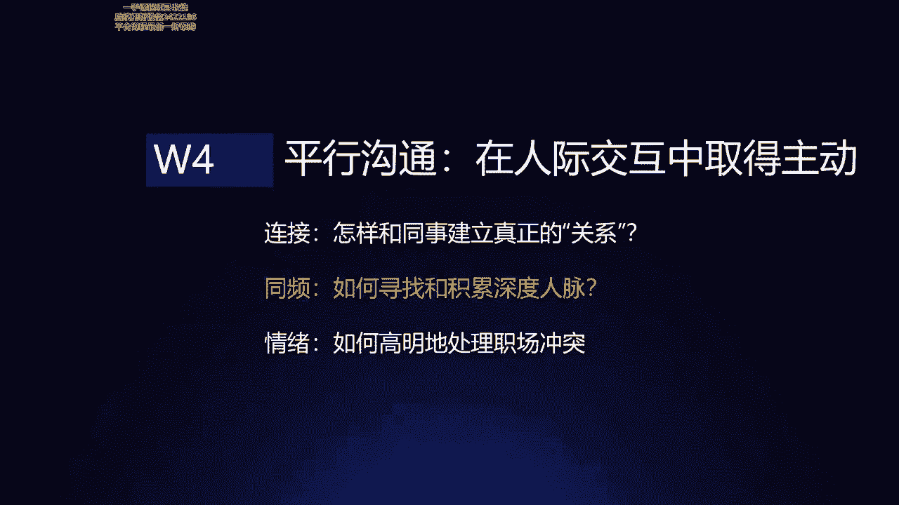
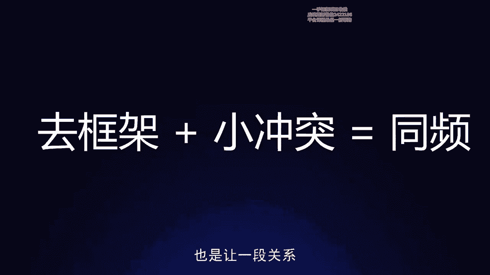
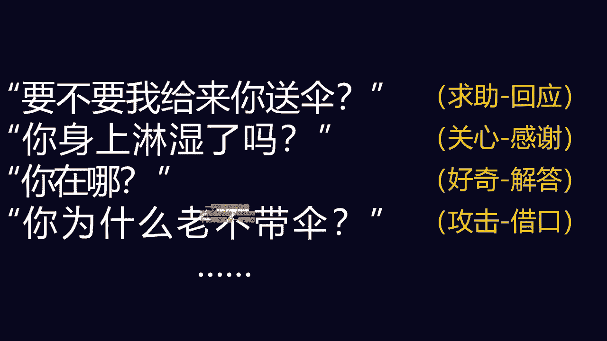
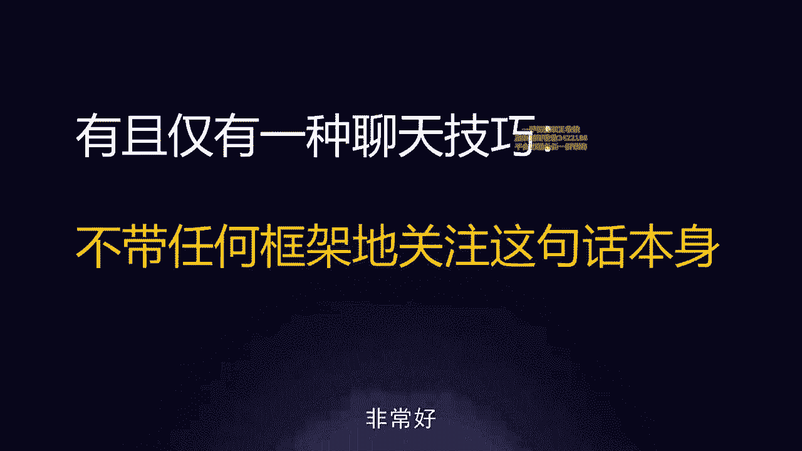
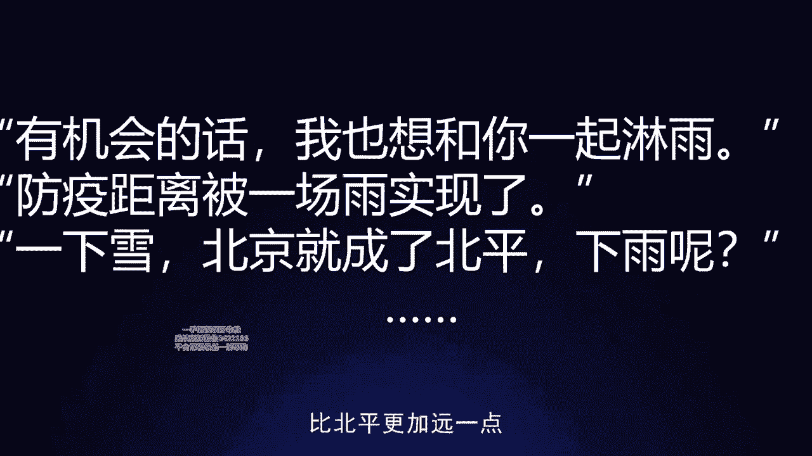
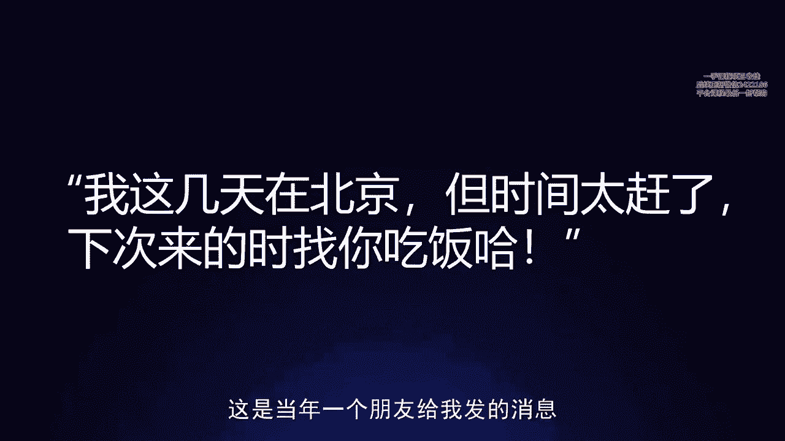
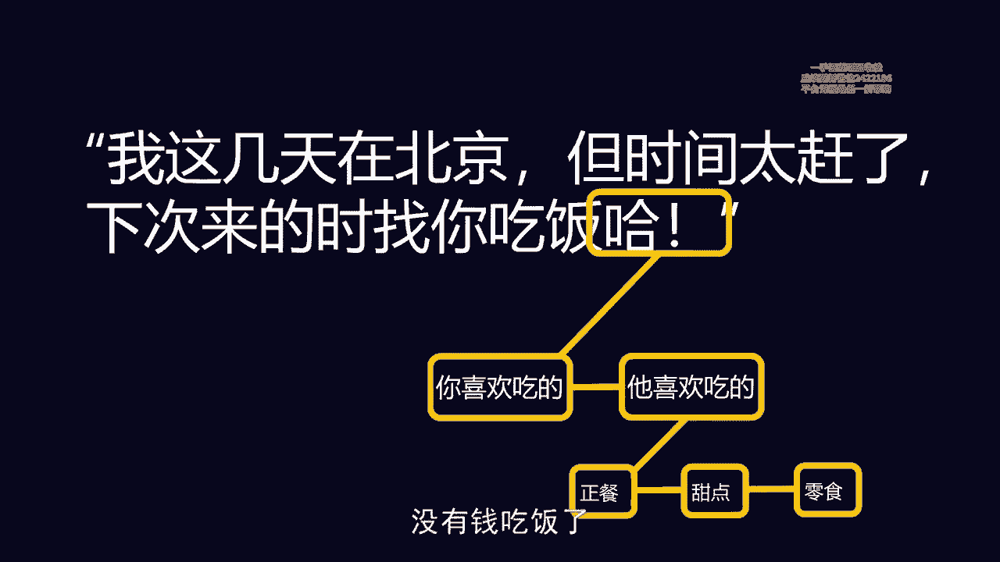
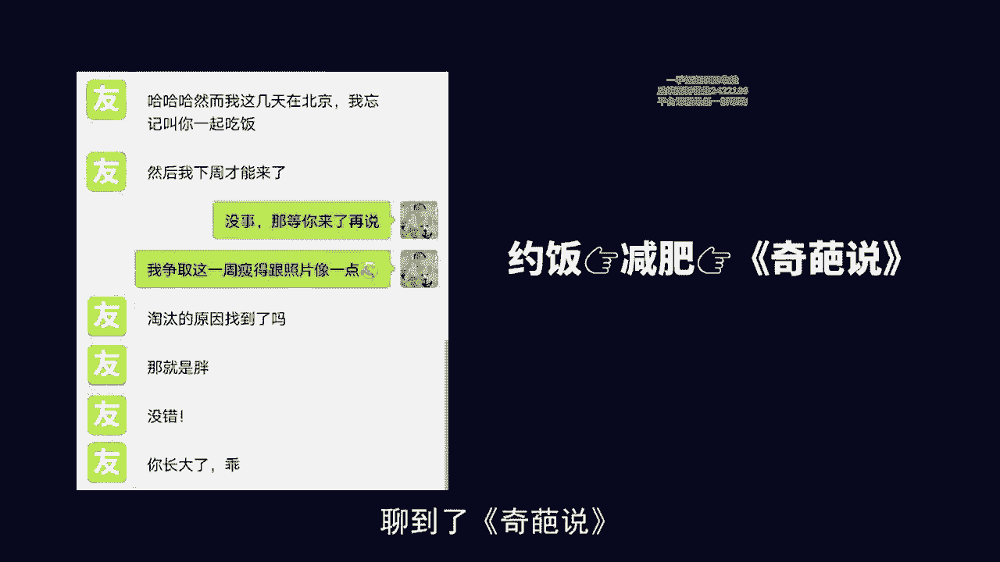
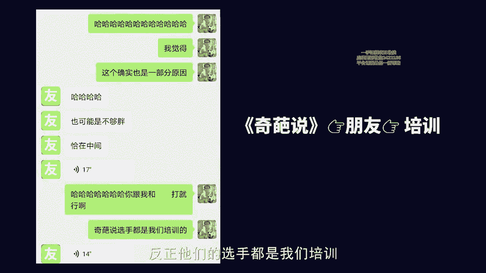

# 梁秋阳--超级沟通力 - P11：011-11.同频：如何寻找和积累 深度人脉？ - 清晖Amy - BV1xFtWeuEao

Hello，你好，我是秋阳，欢迎回到超级沟通力训练营的课程，那今天我们继续聊平行沟通的部分，用沟通优化关系在职场高歌猛进，事实上在讲今天这节课之前，我会稍微有一点点犹豫和担忧。

因为我知道今天这节课涉及了非常多的内容，大家心中会有自己的见解，因为今天我们要聊的是，在连接建立真正的关系之后，我们要怎么去同频，去寻找和积累一个更深度的关系。

而在沟通当中做好这件事情的本质，或者最常用的工具就是聊天，但是聊天是一个个人风格特别特别差异化，多元化的一件事情，我所介绍的沟通技巧，但凡表述稍有不当，都有可能让大家误解，觉得跟你的常识相不符合。

所以在听这节课的时候，我希望大家可以以一个更加开放的心态，去回想一件事情，叫做你上一次跟人聊天，聊的很开心，是什么时候，他有可能是你在火车上遇到了一个人，有可能是你在微信上，跟一个很久没有聊天的老朋友。

聊得非常非常的愉快，有可能呢是在一个你压力其实很大的时候啊，突然出现了一个人，他可能是你的伴侣，可能是你的同事，跟他在等车的时候三两句话啊，聊得实在是太开心了，太放松了，想一想那个时候你的体验。

这就是我们今天想跟大家分享的，我们在沟通当中怎么样能够做到这件事情，怎么样能够真的跟人同频，怎么样真的能够跟人更加深入的交流，很多时候啊我们在沟通中的深入的交流，两个人的同频那种彼此都很放松，都很愉悦。

能够尽情的享受交谈的乐趣的那种状态，未必是聊工作，聊到很深的状态，大家可以理解吗，我们在聊一个数学题，聊到很深，周围所有人都听不懂，我们当然也是同频的，但是那个同频有赖于这个话题本身。

那我们本人在人与人之间，我们怎么让两个人同频，我们怎么能够让这段聊天变得愉快起来，这是我们今天在努力思考的问题，我只能说每一个人聊天都有自己的习惯，每个人的人生经历，生命体验都不同，但是如果你能试试看。

去做到，今天课程当中讲到的这些方法和，需要注意的地方，也许你以后会多一些和别人聊天，聊得特别愉快的那些时刻和瞬间，那怎么做呢，两个点，第一去框架，第二少冲突，它们加在一起就是人与人之间沟通的同频之路。

也是让一段关系不断深入的必经之路。

这里面比较重要的是去框架，什么叫做序框架，我们每一个人在聊天的时候啊，看起来我们是瞎聊，但是其实我们的内心都有一些，已经预设好的框架，不信我问你个问题，如果有一天你喜欢的人跟你说啊，下雨了。

好多人没带伞啊，发条微信你会回他什么啊，如果你没有喜欢的人，哈哈对不起，冒犯了，如果你没有喜欢的人，你可以想想你在乎的人，你重要的人，你的爸爸，你的妈妈，任何一个你希望其实可以跟他聊得很开心。

或者按理来说，你应该可以跟他聊得很开心的人，这么跟你说说，下雨了，好多人没带伞，你会怎么回答，你知道吗，这个问题我问过非常多的人呃，他们其实很多人，甚至在生活当中都被问过这个问题啊。

他们甚至很多人在生活当中，还真的收到过这句话，甚至有些是客户发给他们的，就是那个时候大家在业务合作比较熟，然后甲方乙方之间互相聊一聊，他们的回复呢通常拖不出下面几种，第一要不要我来给你送伞。

是不是最常见，第二你身上淋湿了吗啊，第三诶你在哪啊，你怎么没带伞啊，第四你怎么老不带伞，我不知道这些四个最常见的回答里面，有没有刚才你们心里的回答，可是你们仔细拆解一下，你们会发现。

这四个回答背后都是有非常既定的模式的，要不要我来给你送伞，你完全可以想象这是一个求助和回应的模式，我把它预设为就是像我在求助，我回应你，然后你的回答应该是谢谢，不用了，我搞得定，对话结束。

OK你身上淋湿了吗，关心和感谢我关心一下你啊，对方说谢谢，没问题啊。

How are you，I'm fine，Thank you，然后对话结束啊，你在哪啊，我刚下课好奇解答对话结束，你怎么老不带伞啊，对不起，今天忘了哎，你这个记性借口攻击借口，对话结束。

你会发现这件事情未必我这么聊啊，之后就一定跟这个人聊不下去，甚至我们生活当中，基本上随意的时候都是这么去聊天的对吗，我们基本上都是用自己省事的方式去聊天的，那是因为很多时候。

这些基金的框架是非常有助于我们去敷衍，这是比较难听的讲法，好听的讲法叫做，是非常有助于我们去应对高频率的沟通的，因为我们不可能对每一个人都太费心，和太费脑子，我有没有说话的框架呢，我也有。

如果在座各位有哪位加了我的微信啊，我不知道有没有啊，那我们在别的场合遇到你加了我的微信，如果我们在聊天的时候，我有一天突然问你，聊到一半，我突然问你，哎你最近在哪个城市，你猜这个框架的后续发展会是什么。

这个框架的后续发展是我最近在忙，我想体面的结束这段对话，我为什么要问你在哪个城市呢，因为我问你在哪个城市，你就会告诉我一个城市，我就会说那个城市有一个什么地方好像很好吃，或者有没有什么特产很好吃。

你就会告诉我说确实是这个样子，然后我们会很自然的说诶，那下次有机会约饭啊结束，所以你知道吗，框架我们那些很熟练的聊天套路，不是帮助我们把一个天聊的很愉快的，它是帮助我们把一个天结束的很体面的。

别人在问你下雨了，好多人没带伞，不管怎么样，你问你身上淋湿了吗，那基本上除非对方真的非常喜欢你啊，希望你去送她或者见见他，那基本上这个对话就是体面的结束，体面的结束。

所以你会发现一件事情就是浅尝辄止的聊天，往往都像是在写剧本，而剧本的特色就是，写到这就必须要往下走了，你说我想停一停，看一看这个人具体在想什么，对不起，剧本不是这么写的，剧本要往下走。

所以我有一个概念叫做聊天中的理发师谬误啊，数学里面有理发师没有，我很多朋友应该知道，但是聊天当中的理发师没有误，是我邹的，有一天我去理发，那个理发师一边理发，一边抱怨他的老婆啊，抱怨什么呢。

抱怨他的老婆忘记把一个东西带给他，疯狂的抱怨，说哎这个人我都不知道他是怎么想的啊，这太笨了太蠢了，跟他说了那么多次，他非得这个样子，他非得这个样子啊，我的天哪，搞得我烦死了，我当时因为可能是性质比较好。

我随口问了一句，我说哎，所以他当时为什么忘了呀，那个理发师愣了一下，然后马上说，谁知道他怎么想的，他就是一个用广东话讲，so嗨，他就是蠢，他就是笨，他就是不知道，当时我觉得这件事情太有意思了。

就是你看那是他老婆，他做了一件事情，人做事情总有理由，可是在他的聊天剧本里面，他老婆做事情不需要理由，那就是一个NPC，它的作用就是被他抱怨，所以很多时候聊天之所以浅尝辄止，包括我现在在跟他聊天。

之所以浅尝辄止，也是因为我只是一个负责听他抱怨的人，他的老婆只是一个被他抱怨的对象，我们两个都只是NPC，他根本不关心我们会有什么具体的想法，他的脑海当中也没有超出框架这些内容。

因此我们会讲浅尝辄止的聊天，像在写剧本，事实上，这也是阻止很多人从交谈当中获得乐趣的地方，KY的创始人陈庄老师，在他的一本书里面写过一个很有意思的对白，说他的老师当时跟他讲，以后你当心理咨询师。

会有非常多的患者走进你的咨询室，他们每个人都携带着剧本而来，你要做的工作就是，识别出他们想要灌输给你的剧本，然后拒绝扮演里面的角色，让他们意识到他们也不必如此，而我们要分享的也是。

如果说这个世界上有且仅有一种聊天技巧的话，就是请你跳出框架，不带任何框架的关注，这句话本身我们可以试试看，就从这句话开始，请大家盯着这句话看，你会发现这句话变得慢慢的陌生了起来，你略读一下这句话。

你一下子就理解了，不带任何框架来关注这句话本身嘛，你很快就会发现，再看几眼这句话变得陌生了起来，什么叫框架，什么叫不带任何框架，邱老师强调任何有什么别的意思吗，什么叫关注我平时有关注一句话吗。

那什么叫做关注，一句话是盯着他看吗，什么叫这句话本身呢非常好。

这个时候你就进来了，所以喜欢的人跟你说，下雨了，好多人没带伞，或者客户跟你说，哎呀下雨了，我最近在哪条路吃饭的时候，你除了说我要不要去，你除了说别的以外，还有一个办法叫做关注这句话本身的东西。

例如说提到语，你会想到什么，你可能会想到最近的天气冷潮湿，广东的回南天啊，家里又漏水了，夏天可以凉快一点，出门鞋子会湿啊，金凯瑞的雨中曲，午夜巴黎最后的那场雨，伦敦人的说话方式对吗，伦敦老是下雨。

所以大家出门就问啊，最近天气绅士都会带把伞出门，你其实可以聊到非常多的东西，你就会告别原来那条单线条的沟通方式，叫做下雨了，我没带伞，你要伞吗，你淋湿了吗，哦你在哪，谢谢再见，同样的提到伞。

你能想到什么，伞长得像水母，上次忘记带伞的经历，不带伞的话啊，跑和走零道的与的分量是一样的吗，啊有我没记错的话，搞笑诺贝尔奖有一期的得奖结论，就是论证了我们在奔跑的时候，由于身体是前倾的啊。

是弓着身子的，所以我们虽然跑的比较快，但是淋到雨被淋湿的程度，跟我们从容地走一段路，在某一些距离以内其实是完全一样的，甚至走淋到的雨更少，提到人群我们会想到什么，好多人没带伞人群你在什么地方。

这些人在做什么，人与人之间的距离，所以如果他不管怎么样，随口跟你提一句话，OK你的回法至少可以有非常多，有机会的话，我们可以一起淋一次雨，试一试，看没带伞，正好啊对吧，可以淋一次雨啊。

听说北京的雨是酸雨，或者听说广东的雨是酸雨，OK啊防疫距离被一场雨实现了啊，政府老是强调要隔1米1下雨，大家撑着伞，瞬间隔了不止一米对吧，很多营销号会说一下雪，北京就成了北平诶。

那下雨了为什么没有什么变化呢，啊他说下雨了，北京成了大都啊，比北平更加远一点。

OK所以其实有很多可以聊的，当然这个时候我知道会有很多朋友心中在想，用不用这么复杂聊个天而已嘛，对不对，他要是不是想要让我关心一下他，或者送一下伞，他为什么要跟我讲这件事情呢，是的。

很多时候我们聊天是有目的性的，我们也可以默认对方聊天是有目的性的，所以我在一开始就说过了，有目的性的沟通，我们当然有各种方式，像我们之前聊过的，我们可以去夸奖，我们有说服啊，我们有道歉，我们有同步信息。

我们有汇报，因为很多时候，我们想要和一个人建立深入的关系，我们需要的是大量的无目的的沟通，那我们怎么样学会无目的的沟通呢，虽然这件事情很讽刺，听起来无目的的沟通就直接聊就好了。

可是现代人由于我们做了很多事情，他的目的性和功利性都特别强，所以反而需要分享一下什么叫无目的的沟通，就是不带任何框架的关注，这句话本身我再重复一遍，有且仅有一种聊天技巧，就是不带任何框架的关注。

这句话本身会有非常多的PUA教程告诉大家，我们要推拉，我们要上堆下切，可是如果说我们真诚地聊天，我们不是带某些很强烈的功利的目的性，且不论那个目的是好是坏，我们想跟一个人从聊天当中获得愉快。

最简单的方式就是关于这句话本身，有没有我感兴趣的部分，有我就聊，没有就再说，OK给大家一个简单的练习，我这几天在北京，但吃饭时间太赶了，下次来的时候找你吃饭哈，这是当年一个朋友给我发的消息。

我那个时候我跟他还不算特别熟，后来由于我们建立了深入的关系啊，我们成了非常好的朋友，如果是你你的朋友给你发这句话，你会怎么回呢，啊千万不要告诉我，这个时候你回的是好的啊，就没有下一次了。

这是要结束对话的时候才会说的，当然你也可以猜测对对面那个人是我，他就是为了结束对话，但是老实说他主动说我这几天在北京，但是时间太赶了，下次来的时候找你吃饭，通常意味着你其实不知道他在北京。

他主动跟你说一声，这意味着他其实是不介意跟你的关系，往后发展的，那除了回好的，你还能聊什么呢，我们来看一看，首先第一最容易被关注到的叫做吃饭对吧，我们可以聊一聊你喜欢吃的，他喜欢吃的正餐，甜点零食。

甚至跟吃饭相关的还有什么呢，我们来想想不吃饭对不对，节食长胖，健身啊，健身教练刚买的健身卡或者吃饭会不会很贵呢，消费花钱，最近钱都花在别的地方。

没有钱吃饭了，OK那这还只是吃饭这一个词，我们可以引申出的不同的聊天的话题，还有什么呢，北京时间太赶了，你最近是不是很忙，你最近都在忙些啥呢，然后北京哪个机场的餐厅好吃，然后为什么会选择来北京啊。

你赶上了北京的一个天气不错的好时候，这几天下雨算是夏天比较凉快的几个晚上，我们会有非常非常多可以聊的，事实上我在跟他聊的时候呢，也因此把这段对话延续了很久，我们两个聊的都很开心，对吗啊。

他说下周才会过来，我说没事，等你来了再说，我争取这周啊，瘦的跟照片像一点，因为那个时候我刚上节目，然后准确的说是刚被第六季奇葩说淘汰，然后这个时候呢他说那淘汰的原因找到了吗，就是胖没错。

你长大了孩子对吧，所以我们就从约饭聊到了减肥，聊到了奇葩说。

而之后啊我就说这个确实很有道理啊，有可能是因为这个原因，观众不给我投票，对他说，那也可能是不够胖，夹在中间，因为足够胖的话，可能观众会觉得你可爱，然后他发了一大段话，因为我们聊到了奇葩说。

他想到说诶那是不是，其实改天我也可以想去试一试啊，这个时候我说那你要去试的话呢，培训不用找别人找我们，反正他们的选手都是我们培训啊。

他发了个一秒的语音表示诶开心，好的没错，我们就从奇葩说聊到了朋友，聊到了培训，老实说，如果这个时候我想跟他做生意，我已经可以就着培训往后聊，给他推产品了，因为我们的初步关系已经建立了。

我们已经聊了一些没有目的性，没有意义性，但是其实能够建立羁绊的东西，其实所谓的关系，很多时候也是在这种无目的的交谈当中建立的，当然没必要，我跟他是个很好的朋友，所以我们就正常聊天就好了，但是事实上。

深入的关系能带来的信任愉快，远比我们想象中大得多，这个朋友之后在完全没有见过我面的情况下，我们到目前为止到这段对话发生为止，没有见过面，他在完全没有见过面的情况下，给了我非常大一笔钱支持我的工作。

那当然事实上我最后的啊工作成果，也没有辜负他的期待，只是他见到我的面的时候很惊讶，说哇我觉得我们已经很熟了，关系很好，突然意识到这是我们第一次见面，所以深入的关系，能带给大家的东西是非常非常多的。

而对我来说更重要的是，我交我交了一个这么好的朋友，别的倒是其次，而它的前提就是我能够不带任何框架，我既不想利用它，也不想说服他，我既不想把他当成我宣泄情绪的对象，我分享观点的一个出口。

我就单纯的跟他平等的彼此关注，彼此说过的话来顺畅的聊天，那除了去框架之外，还有一个小点叫做小冲突，什么意思，很多时候我们在跟人聊天的时候啊，会刻意的避免冲突，我们看到有人说了一句让我们不开心的话啊。

我们都直接略过，假装没有看到，而把这个情绪成本选择由自己来负担，但其实很多时候这样做反而是不对的，因为你会失去两件事情，第一由于你在跟他的相处过程当中没有冲突，所以你们少了很多推进关系的机会。

我和我的合伙人，我认识了非常多的朋友和工作中的亲密伙伴，所谓的不打不相识啊，他们都是从一场又一场的小冲突当中，建立起关系的，因为只有互相亏欠，我向你道歉啊，你表示原谅，下次呢我们礼尚往来不断。

米平之前的冲突的过程，让我们的感情慢慢的加深，如果大家都是井水不犯，河水波澜不惊，反而难以建立深入的关系，所以在一开始的时候不要去回避冲突，而如果回避冲突，你失去的第二件事情是。

你很有可能把精力浪费在一个不适合的人身上，如果你们频繁的出现冲突，你们一开始出现冲突，你们就发现彼此的观念，彼此的态度，彼此的立场具有极大的分歧，其实你就知道这段关系，没有必要特别强行的把它往深入带。

可是很多人由于他们太害怕冲突，他们避开了这种彼此确认边界和原则的机会，最后的结果反而是，他们在一个其实不太适合深交的人身上，花费了大量的时间，最后也没有建立起真正的深入关系，最后得不偿失。

所以基本上人在聊天当中的风格不一样，习惯不一样，有些人喜欢装高冷啊，有些人很热情，有些人觉得笑称自己是舔狗，那有一些人呢觉得自己比较内向，但是不管你的说话风格怎么样，你在跟别人聊天的时候的内容都可以。

有一个很简单的法则叫做第一不要回避冲突，第二尽可能的去掉内心当中预设的框架，当然去框架是一个否定性的动作，大家不好做，那我都意识不到我内心有什么框架，或者说我我意识到的同时就表示我有框架了。

我怎么去框架，那简单的做法就是尽可能公平的公正的观察，在聊天当中的每一个词，每一句话，这样的状态我之前发现之后让我受益良多，为什么呢，我举一个例子，有一天我的朋友向我推荐凤凰传奇的版本的。

海底海底是一首歌，然后这首歌本来是一个非常忧郁的，非常消沉的歌，但是凤凰传奇改成了一个很正能量，劝人珍惜生命的版本啊，听完歌之后，很多人都觉得被治愈了，包括我那个朋友，他推荐完这首歌之后呢，我回了一句。

我说我很喜欢它里面的一句歌词，叫做梁博的人，脸上总挂着无关，梁博啊，就没有良心的人，脸上总挂着无关，就感觉什么行情都跟他没有关系，很自私，只关心自己，我那个朋友也是一个被人伤害过的人啊，他说有道理。

那我一直很好奇梁博的人，这些没有良心的人，他们是靠什么活着的呢，我说他们应该是跟动物一样吧，所以就很自私，但其实也不是自私，他们就是遵循本能活动，他们是像动物一样活着，他说可是我觉得动物很笨呐。

我觉得梁博的人又不笨，他们往往很精明，我说这可能是另一种笨吧，他们看起来精明，但是错过了这个世界上很多，更值得关注和珍惜的事情，然后我们就聊了下去，我非常的感慨，因为我很确定在半年以前。

我都没有办法跟人这样聊天，对我跟很多人说，我是一个不是那么喜欢社交和认识新朋友的人，很多人不相信，但是事实上对我来说是真的对，可是这个方法对我的帮助非常大，它帮助我跟很多人建立了深入的关系。

因为我发现我只需要公平的关注彼此，话语当中那些有价值的内容，我们总能找到我们都能认可的地方，那我把这种状态称之为心理学的一个词，叫做正念式的聊天，我们能够不带偏见的，不带框架的看着大家。

当然我们在描述正念的时候，更多是一种心理状态，可是今天我会更希望啊，这个方法对大家来说是有启发的，所以如果说我们之前教了非常多，工具性的东西呢，今天这一课，我们更多想跟大家分享的是一个理念性的东西。

就是我们如果想要从聊天当中建立起愉悦感，能从聊天当中获得更多丰富的内涵，让这个沟通不止于直来直往的目的性，我们还能获得更多的东西，我们可以试一试，不带偏见的关注双方说的话，然后不要回避那些必须的冲突。

以上是今天的课程。