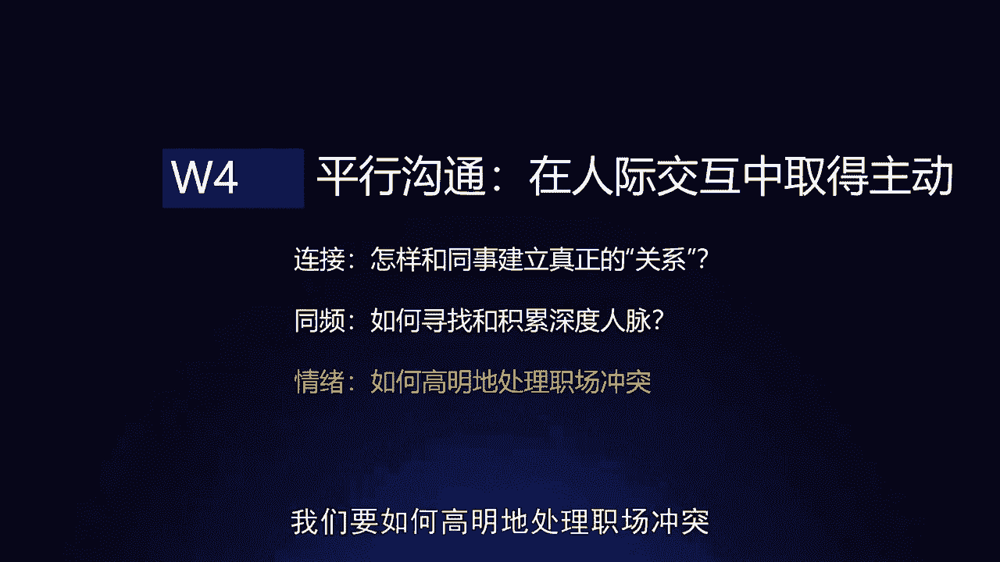
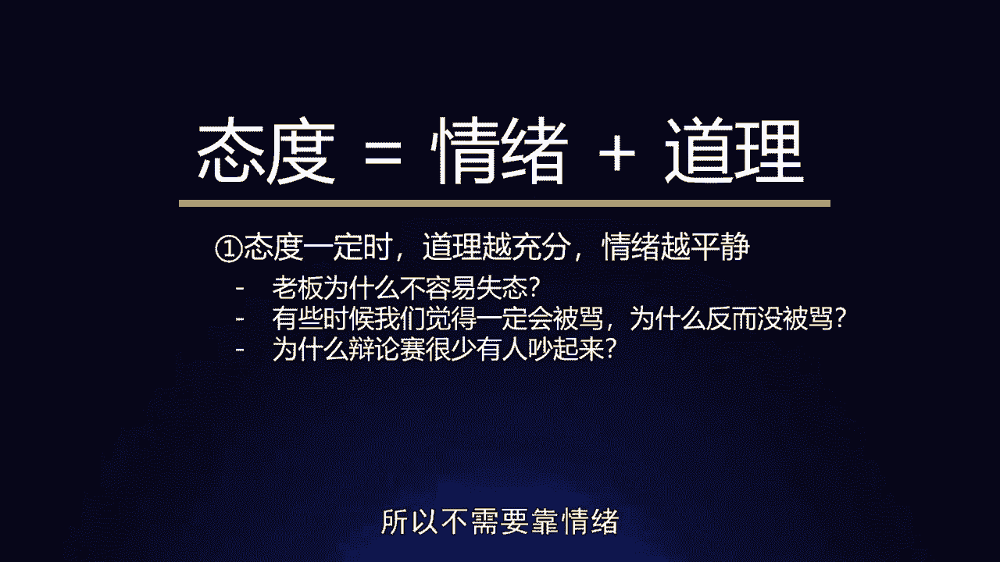
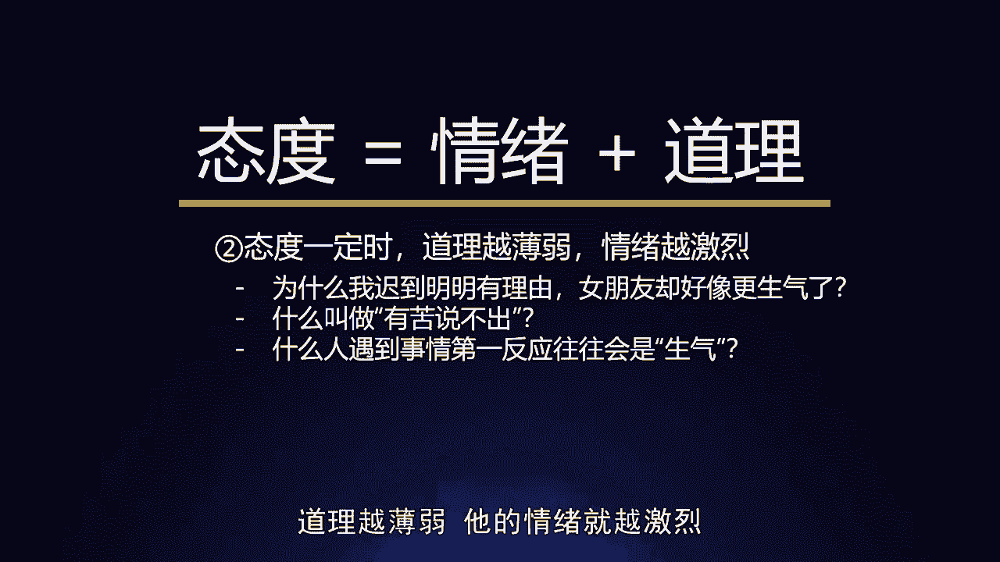
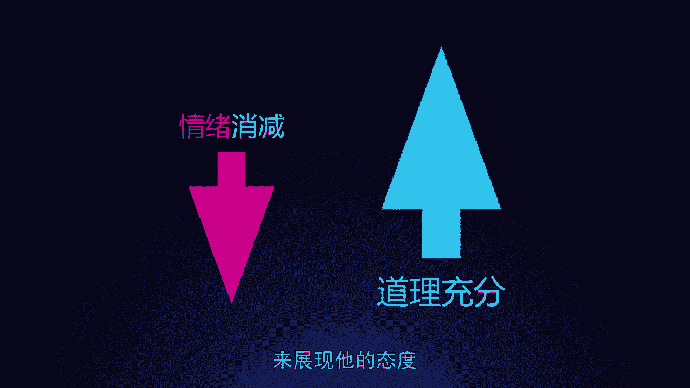
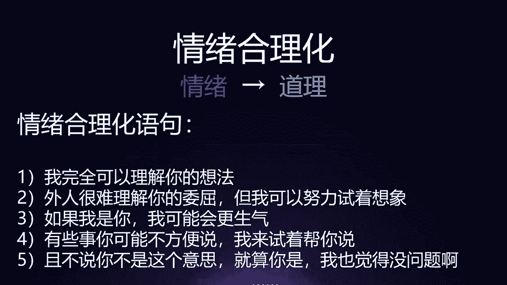
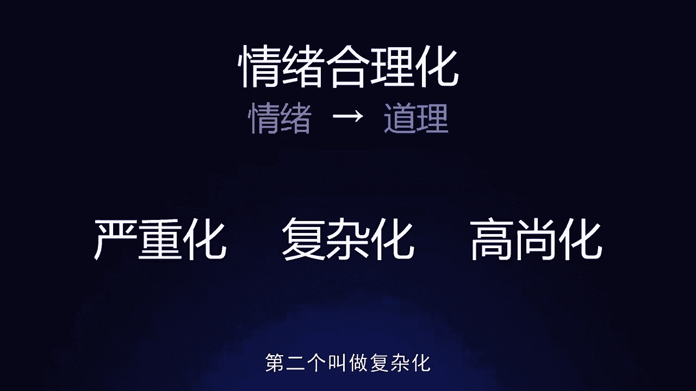
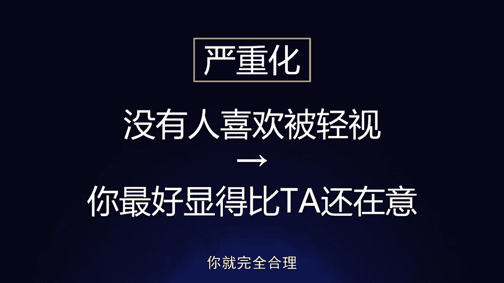
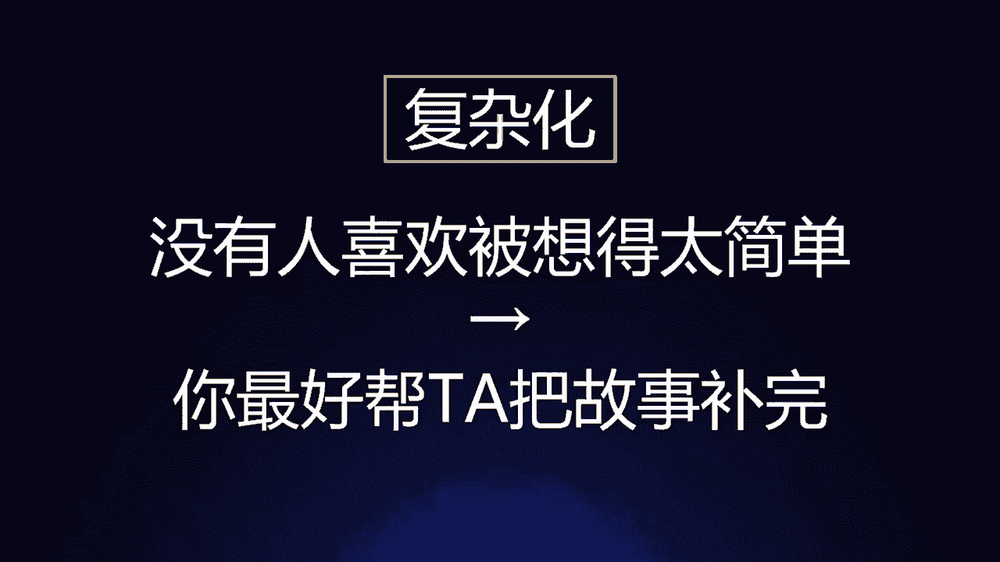
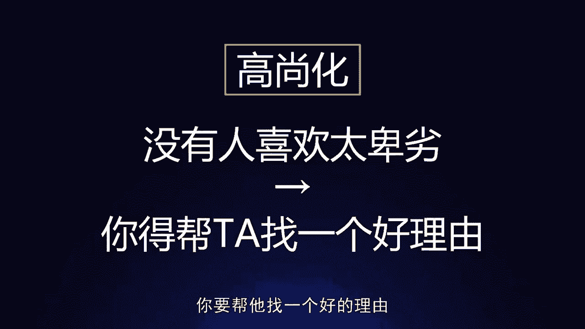

# 梁秋阳--超级沟通力 - P12：012-12.情绪：如何高明地处理职场冲突？ - 清晖Amy - BV1xFtWeuEao

Hello，你好，我是秋阳，欢迎回到超级沟通力训练营，今天我们继续课程，用沟通优化关系在职场高歌猛进，我们继续来聊关于他者沟通当中，平行沟通的内容，而今天要聊的是一个，在职场当中出现频率不能算低。

但是我们都会期待它不要出现的事情，就是关于情绪，我们要如何高明的处理职场冲突。

情绪在职场当中是一件非常非常微妙的事情啊，因为我们通常会认为情绪在职场中是必要的，可是呢你最多只能用一次啊，李诞老师讲过一个很有意思的观点，他说这个世界上所有最强烈的情感，都必须要用情绪来表达。

如果你没有情绪，大家都会认为你这个情感，你这个观点不够强烈，不够坚决，可是这个工具情绪是一个很强大的工具，但是他在职场中通常只能用一次啊，或者我换句话说，在一个小环境内只能用一次，为什么。

因为你一旦用的多了，你就会显得你是一个情绪化的不专业的人，你的情绪连带着你的观点，你的表态，你的意见都容易被轻视，所以人没有情绪是不行的，人太有情绪也是不行的，开课吧的高伟老师讲过一个很有意思的例子。

他在跟他的工作伙伴开会的时候，有一天非常非常的生气，拍了桌子，面红脖子粗，跟大家发完一通脾气，走回自己的办公室，可是呢当大家来找他的时候啊，他说实在是不好意思啊，刚才一时没忍住，其实没有那么生气。

我问大家，你们觉得他真的是没有那么生气吗，未必他很有可能比这个还生气，但是为什么他要这么说，就是因为他知道情绪这件事情用完，就算如果你持续投入在里面，很多时候反而会适得其反，我心中有十分情绪。

表现出三分，很多人会觉得不满足，我该找个机会把剩下的七分也表达出来，可是事实上在别人眼中，你作为一个平时大家都乐乐呵呵，和和气气的同事，你今天表现出的这三分，在他们心中接受到的震撼已然是十分。

这个时候收在这才是恰到好处，你要是硬是把剩下那七分都给宣泄出来，反而会出问题，所以我们会说情绪是利器，但是唯不得已而用之，它是利器，它可以是你的谈判筹码，这个工作让我不开心了。

加工资他可以帮助你和对方深入沟通，因为你生气了，他会更加的重视你，它可以是你的个人标签，甚至全公司都会流传一个传说，你某一次发脾气把谁谁谁骂了，但是这只能是一个标签，只能是一个传说。

而不能是发生在办公室的每天每次会议的日常，否则反而会削弱你这个人在沟通当中的，说服力和威信，所以情绪和冲突是一个非常非常微妙的事情，但是反过来说，如果我们自己遇到了对方产生的情绪，我们要怎么给他台阶下。

我们怎么化解这个冲突，首先第一我们要了解情绪是怎么产生的，它的变化有哪些特征和规则，合伙人之间因为利益分配产生矛盾，大吵一架，可是按照原定的分法分的最多的那个人，反而是看起来比较生气的，你觉得是为什么。

为什么，因为他挂不下面子，对不对，但是没道理呀，我们通常认为吃亏的人才会生气啊，为什么他看起来是最容易生气的，因为他心中有一些说不出来的东西对吗，因为他知道自己占了便宜。

可是呢他又觉得自己并没有占那么多便宜，值得你们翻脸，所以他一方面不开心，另外一方面这个不开心还没法表现出来，所以他反而更容易生气，这是我们要今天跟大家讲的最重要的一个观念，叫做态度等于情绪加道理。

这个公式乍一看没有什么奇特的，对不对，谁都知道，我情绪上讨厌你，那道理上我又占理，那我自然就反对你，我情绪上很开心，那道理上我也讲得通啊，我自然就支持你，有什么好说的呢，这个时候我们要聊第二件事情。

叫做人，很多时候不是先有情绪，有了道理，然后才有一个态度，而是我们先有了一个态度之后，我们自己的大脑把它合理化一部分，剩下的那一部分就是情绪，什么意思，第一种情况叫做态度，一定的时候。

如果你的道理越充分，你的情绪往往越平静，为什么老板很多时候在公司不容易失态呢，特别简单，因为老板往往在公司是有里子的人，所以我不容易因为面子的事情而发脾气，我心中知道的东西多，发生什么情况。

我都能够自圆其说，我都能够合理化，我的解释机制都没有失灵，所以我不需要靠情绪来证明我的态度，有些时候我们觉得一定会被骂，为什么反而没被骂，因为破口大骂是一个情绪失控的表现。

当一件事情连我们自己都觉得我们做错的时候，对方肯定更加明白你做错了，当他的手上的道理很充分的时候，他就不需要破口大骂你，他可以直接批评你，这也是为什么辩论赛很少有人能吵起来，两方的态度一定是互相对立的。

但是由于两方准备了非常多的道理，所以不需要靠情绪。

当我发现你说了一句胡话，我很想反驳你，我很想反对你的时候，什么时候我会情绪失控的骂你呢，就是我讲不出道理的时候，我容易情绪失控，我这边准备了好多的道理，数据案例，事实我才不怕你，所以态度一定的时候。

一方的道理越充分，他的情绪往往越平静，而反过来你就能理解为什么在冲突当中会出现，有些人的情绪失控，因为当态度一定的时候，道理越薄弱，他的情绪就越激烈。

为什么我迟到明明有理由，女朋友就好像更生气了，跟女朋友约会好久不见了，我迟到了一个小时，她在西餐厅等了我一个小时啊，我跟他东解释西解释，我真的理由太充分了，叫做我明明提前出门啦。

我考虑到了周末北京会堵车，结果今天突然啊有一个什么活动导致封路，我又连续遇到几个路口有车出车祸，实在是没办法，我总不能跑过来吧，我跑过来更慢呀，这叫做我明明有理由。

这个时候不管你对面的是女朋友还是男朋友，你会发现，他很有可能呈现出一个特别奇特的状态，叫做他未必会怪你，但是他会很不开心，而由于他没有办法怪你，他会更不开心，明白我的意思吗，因为如果单纯是你蠢。

你迟到了啊，他罚你给她买个包，他罚你陪他去打游戏，陪他去看球啊，你们两个好说好笑，他骂你几句，结束了，越是他发现骂不了你，同时他又真等了一个小时，他越容易心中有情绪，叫做我明明什么也没做错。

可是我现在白等了一个小时，我还骂不了任何人怎么办，这叫做态度，一定我很难受，道理薄弱，没法骂你，情绪激烈，心中憋气，什么叫做有苦说不出也是一样的，一个人越急越气的时候，往往都是他有苦说不出的时候。

如果有人能帮他申冤，能帮他的委屈全部都说出来，往往这个时候他就不那么生气了，这是为什么，很多时候我们很难过的时候啊，我们看一部小说，那部小说写的很悲伤，它能够抒发我们的情感。

我们看完之后感觉被治愈了一样，本质上这不叫做被治愈了，这叫做我们心中的那个态度，终于可以被人用另一种方式说出来了，那我们就不用用情绪去表达它了，我们很多时候，哪怕但凡跟人吵架的时候。

有一个人站在我们这边，把我们想讲的道理讲的清清楚楚，我们觉得都无以复加，没有什么可以再说的了，我们都会消气很多，为什么，因为之前之所以那么气，就是因为没有办法，我把自己的这个境地讲的这么清楚明白。

但凡有道理，谁要跟你发脾气呀，到底是多体面的东西啊，所以什么人遇到事情第一反应往往会生气，就是他没道理，他越容易生气，就好像刚才那个案例，为什么那个分的比较多的合伙人，特别容易情绪失控，因为大家分钱啊。

吵架撕逼当然不是一件开心的事情啊，那些分的少的心中是有道理的，叫做我分少了，我不满我是很合理的，可是呢那个分的多了，他觉得自己没做错，可是他说不出这个道理，他就特别容易生气。

这个时候人会有一种被动攻击和转移行为，叫做我当然不好意思说出来，我甚至有的时候没有意识到我是这个想法，我就另外找一件事情生气，这就好像我迟到了，我有理由啊，你不能骂我，那这个时候呢你会怎么办。

你会另外找一个事情对我发脾气，我不发脾气，你迟到了，我不骂你，迟到了我骂你，别的其实原因根本不是因为别的那件事情，就是因为我有气无处发，所以情绪的本质是一种代偿，什么叫代偿，就是如果一个人在道理层面。

无法充分支持他的态度，我反对你，但是我的这个反对没有办法完全用道理说出来，我们的内心会自然的帮他补足，这部分动力叫做情绪，它出现了，也，因此我们怎么样在冲突当中消解对方的情绪，和面对对方的情绪呢。

不是像很多人想象中和第一反应一样，我们用道理来驳倒它，因为你想想看，他本来就是因为道理不充分或者还不够充分，没有人充分伸张他的道理，他会生气，你把道理驳倒他，他会更气，他一边反驳你一边会更齐。

这就把原有的冲突，他的情绪上升成了激烈的对抗，消减情绪最好的方式反而是帮他讲道理，但凡他的道理有了，他有了比发脾气更好的方式来展现他的态度。

他的情绪自然就下去了，那你说这个时候那不是为虎作伥，放虎归山吗，他没有道理都这么嚣张，他有了道理怎么办，他有了道理，你就该跟他讲道理了呀，这个时候沟通场景就从冲突降级，为了讨论，因为有情绪才有冲突。

大家都讲道理，那叫做讨论，讨论，你肯定不害怕，对不对，所以我们要做的应对冲突，消解情绪最重要的一件事情叫做使情绪合理化，把他的情绪帮他转化为道理，他做不到的，你帮他来做常见的情绪合理化的语句啊。

比如我完全可以理解你的想法，你这个想法是对的，当然这句话看情况，有些时候对方会不爽，叫做你凭什么觉得你可以理解我的想法，所以我们还可以用第二句话叫做，外人很难理解你的委屈，但是我可以试着努力去想象啊。

就是我承认我很有可能怎么办，都不可能理完全理解，设身处地的想到你的想法，但是我可以努力去想，OK或者是啊，如果我是你，我可能会更生气，这个叫什么，这个叫换位思考啊，很多人对换位思考有个误解。

他说换位思考可能就是我想象一下，如果我是他，我会怎么办，然后想了一下，说如果我是他，我可以做的更好，然后劝他做的更好，这个不叫换位思考，真正的换位思考是想清楚在他的场景下，拥有他的经验。

面对他面对的问题，感受到他的感受，你所能做出的只能是那个选择，这其实是唯物的，这才是真正的换位思考，OK第四条，有些事你可能不方便说，我来试着帮你说，且不说你是不是这个意思，就算你是我也觉得没问题啊。

这是情绪合理化的语句讲法，我相信通过这些语句，大家大概可以想象，那我们是怎么样让对方感觉到，他的情绪是合理的，从而消解他的情绪本身，让他的道理增长的，那基本上这句话说出来是，至少他是不会火上浇油的。

那具体来说，怎么样让对方的情绪真的在内容上合理化呢，通常有三个思路，第一个叫做严重化，第二个叫做复杂化。

第三个叫高尚化，我们一个个看，首先什么叫严重化，就是表现出你对于对方情绪和对方反抗态度，的充分的理解，甚至高估，为什么，因为没有人喜欢被人忽视和轻视，你最好显得比他还在意，比他还能理解他。

内心可能有三分心虚，我因为这么件小事跟你撕逼，生这么大气好像不对劲，不这个时候你要告诉他不，你完全不应该心虚，你就完全合理。

这个时候你甚至应该更生气，才是正常人的做法，你已经让我很惊讶了，你真是个好人，什么意思，同事因为上次聚会我忘了喊他而耿耿于怀，常见的情况吧，职场中人际的小矛盾都是这么累积起来的。

之后总是在一些业务流程细节上找我麻烦，比如说他是财务的呀，你的报销单啊，我忘了晚点出啊，让你这个月吃点土，这个时候啊你想要把这个冲突消解掉，让他的情绪消除掉，怎么办呢，第一句话点出自己的感受啊。

我感觉到被你针对了，不要去质问他，你有没有针对我，对方一定会说没有，直接说我的感受，我的感受是我感觉到你不太喜欢我啊，但是呢我还是很在意你的想法的，然后合理化情绪啊，我也能理解。

换成是我可能上次遇到这件事情呢，我会更生气，毕竟没人喜欢被孤立，把这个问题彻底的充分的严重化，你内心肯定一直在喊呐喊，我就是忘了喊你啊，谁他妈要孤立你啊，但是这个时候你越这么说，对方越可能不开心。

因为对方也知道自己做这些事情是有点小气的，你越是帮他找补，他越是有可能同意你的讲法，叫做啊，其实还好，其实还好，也没什么大事，这句话一说，基本上情绪就消失了，这个叫做充分的严重化。

千万千万不要流露出一点点说哎，我本来以为这件事情不至于，但是这句话一出口，对方一定会炸，这句话就是治愈这件事情，就是非常治愈，让他感受到他的情绪完全合理，这个时候他就没有必要再来跟你发脾气了。

因为他可以跟你讲道理了，因为你承认了，你帮他承认了这个情绪背后是有充分的道理的，这叫做严重化，那第二个什么叫做复杂化呢，就是没有人喜欢被想的太简单，不要把人家的情绪，归于一些特别特别简单的事情。

你最好帮他把故事补完整，每个人的情绪都是复杂的，因为每一个人就是复杂的，没有人会因为单一的一个情绪来做出一个行为。

比如说客户因为自身财务困难，非常需要退费，但是我们公司的财务流程需要他多等一周，客户在电话里面暴跳如雷，什么叫做简单化的情绪，合理化，就是哎我非常理解您，这您就是手头紧，需要钱嘛。

哇没有人会承认自己发脾气是因为钱，这实在是太low了，这实在是太扁平和简单了，没有人喜欢被简单化亲，第一点你需要先表达，尽量去理解，就是您现在的困难啊肯定很复杂，有很多您那边的细节，我这边没法理解。

实在实在是惭愧啊，我也很难受，但我可以尽量去想象，然后复杂化的原因展现共情，因为去年疫情的时候啊，我们公司也是很严重，差点发不出工资，完全能感觉，那个时候老板根本不是因为缺钱难受。

他是因为觉得我作为这个公司的老板，我要负责任啊，那种责任感真压得人很难受，然后共同讨论潜在替代方案，给情绪一个出口啊，或者您看这样行不行，不拉不拉不拉不拉，你说他真实的原因真的就一定是像你所描述的。

试图共情呢，去年疫情的时候，你们公司差点发不出工资，这么复杂吗，未必啊，有可能更复杂，有可能不如这个复杂，但是不管怎么样，你往复杂的去是一定没错的，因为你尽可能的帮他设想出一个越难越复杂，越麻烦的两难。

你是在给他台阶下，明白我的意思吗，让他意识到，让他意识到他的情绪在被人体谅，你在努力帮他圆这个故事的同时，让他会感受到你的这个努力是在体谅他的情绪，你给他一个足够复杂的，足够宏大的道理和理由。

其实是给他一个充分的台阶下，他就没有必要再暴跳如雷了，因为终于有人愿意给我一个特别复杂的理由，支持我，非要一周内退款这件事情了，所以除了严重化，更多的是复杂化啊，严重化体现的是你对他的重视。

复杂化体现的是你对他的尊重，就是你的原因不仅严重，而且还很复杂，有你自己的原因在里面，那第三个更简单的高尚化，就是没有人喜欢太卑劣，你要帮他找一个好的理由。

他才会接受这个道理啊，你说你无非就是为了钱嘛，啊没有人会接受这个合理化，虽然听起来是很合理的，但这种道理不够高尚，对吧啊，你无非就是觉得就是你的上司管理管太严了，所以你生气嘛，这个理由呢也不够高尚。

因为他很有可能真的就是真实的理由，可是没有人会愿意在当众的沟通当中，承认这个理由，因为这会让自己很被动，显得自己很卑劣，曾经有一家广告公司的员工，因为最近经常加班，怨声载道，甚至直接顶撞上级。

互相情绪也不好，在一次团建上，身为总监的你想聊聊这个问题，你能怎么消解情绪，我负责任的告诉大家，这是一个非常真实的案例，当时他的总监问的是我啊，他也很坦诚的告诉我说呃，他只能做到这些。

因为广告公司不可能不加班，然后现在公司也确实遇到了困难，但是他也感受到员工的情绪很重，他想指导作为一个啊中高层的领导主管，怎么样可以消解员工的情绪，OK这个时候我给他一个讲法，后来他给我的反馈是。

他在一个很合适的团建的场合用了这个讲法啊，甚至有些员工都哭了，这个想法是什么呢，就是我知道大家待在这肯定不光是为了钱，毕竟是赚钱的话，以你们的能力其实去哪都行啊，你们真正觉得不开心。

也不是说加班没有加班费，就不光是加班没有加班费了，当然是不光是哈哈，你要直接说不是，肯定也是被人理解为你是在逃啊，不光是为了加班费，谁会只为了钱待在一家公司呢，唉你们肯定是因为没有反馈。

加班很多时候没有意义，因为大家我们彼此在职场这么多年，我们都知道，如果真的是一个工作，一个项目，到了项目期一要加加班，没有人会退缩，他是一个非常目的性明确，很有意义感，很有价值感，很有成就感的事情的话。

没有人会耽误那两个小时加班的时间，非得去做点别的，所以当他说到这一步的时候，这个台阶同事团队是乐于下的，为什么，因为这个台阶足够高，给大家一个好的理由，大家会愿意消灭情绪，接受这个好的理由。

当然情绪还会反复出现，你要根本性解决这个问题，你肯定还需要公司实际的制度的配合，和工作的内容的处理，但是沟通当中怎么样消弭情绪，你可以用这个思路，如果说严重性是体现重视复杂性，体现尊重啊。

高尚性呢就是这个台阶足够高，体现格调，他现在有了一个被重视的啊，足够有质感的，得到尊重的，有格调的理由，那他为什么还会要有情绪呢，对吗，所以记住一开始那个观念，态度等于情绪加上道理，但凡有道理。

何必生情绪啊，那有些同学可能会说，你说的会不会有点太多了，就是你这会不会想太多，人家生气就是生气，就是一些很简单的理由啊对吧，你跟他讲这么多，不是显得你神经病吗，你想那么多不会让人觉得很害怕吗。

很有意思，因为这个方法我和很多同学在生活当中，在处理非常多的案例和场景的时候都使用过，当我们找出的那个合理化的台阶是严重的，是复杂的，是高尚的，它只要符合这三个要求，基本上真正有情绪的对方。

他可能会说你想太多，但他不会真的怪你想太多，很有可能你说的确实太多了，你想的确实太多了，他会纠正它，甚至会往好的方面找补，其实也没有那么严重，其实也没有那么复杂，其实我也没有想的那么好，但是你知道吗。

这个纠正就是沟通的开始，当他愿意往好的方向纠正你的时候，那就说明你的情绪工作做到位了，对当然还是那句话，其实我们应该在职场当中啊，尊重那些有情绪的人，因为这证明他们要么在意你。

要么很在意现在自己在面对的工作，否则遇到再大的委屈，我走就是了嘛，对不对，所以面对他们情绪的时候，也值得我们尊重和妥善的，有技巧的花脑子的处理，而不是对抗，不是忽视，不是说你怎么能乱发脾气。

你专不专业对，当然对于我们自己来说，情绪是利器，但是为不得已而用之，一个小环境内不要用超过一次，通常很多时候如果是情绪特别极端，当然不能三言两语就让他消气，这个时候呢，我们要学会避开那些最极端的情绪啊。

他已经暴跳如雷了，等一等让他稍微消气一点啊，等能聊天的时候再去，但是必要的时候真的需要面对情绪的时候，我们也得知道如何去面对，在沟通中，除了有理性的议题，我们也要知道怎么来处理，这些极端的感性的议题。

这就是今天的课程。