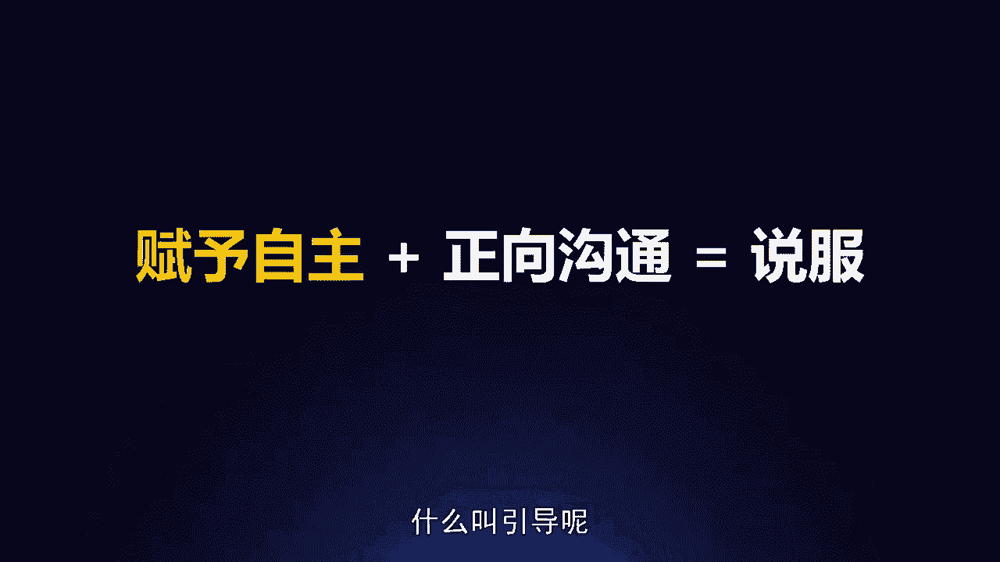
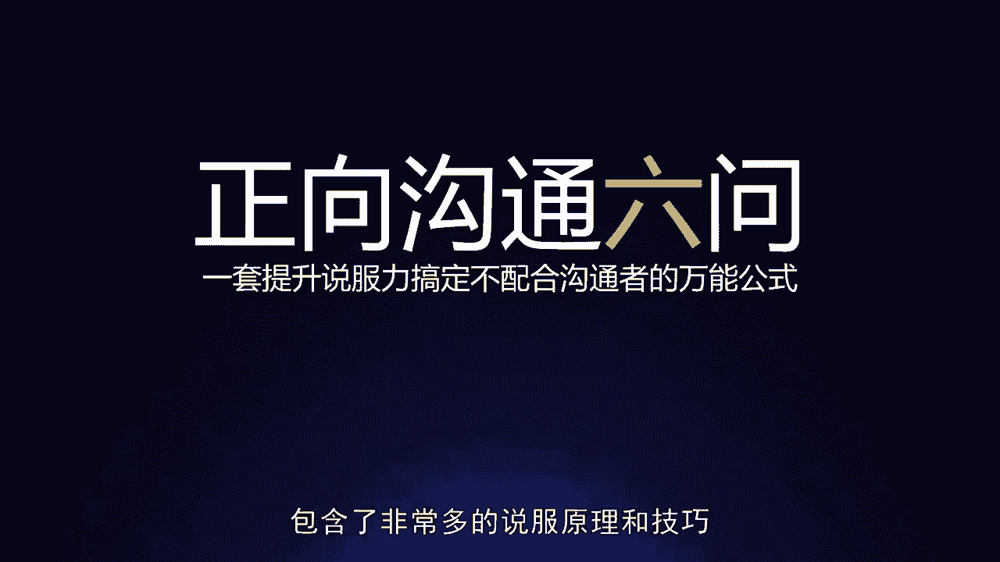
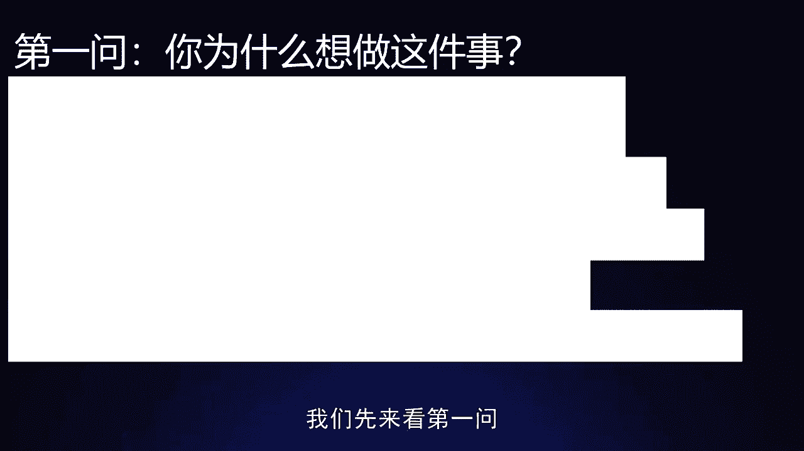
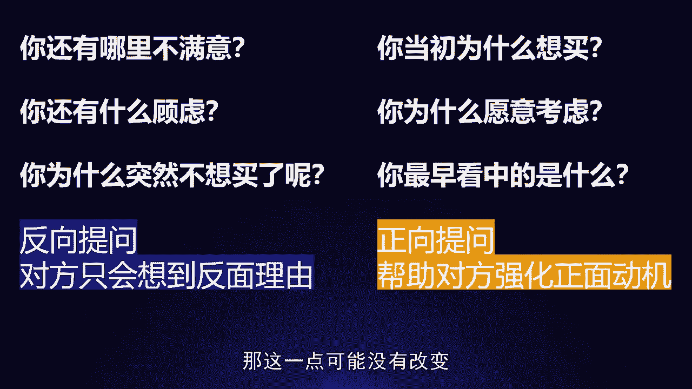
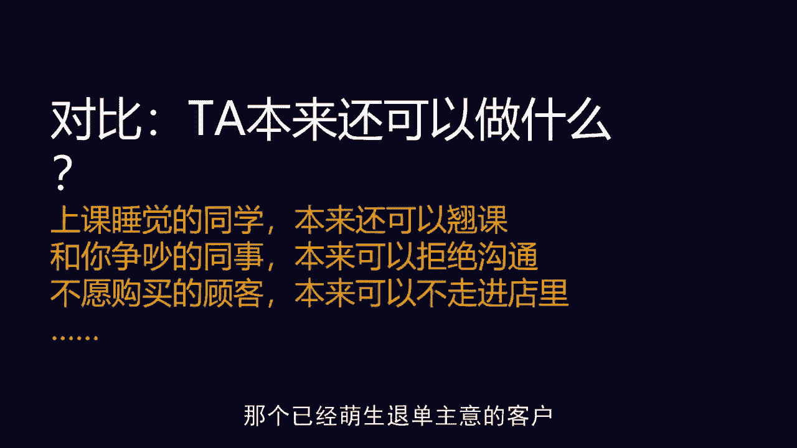
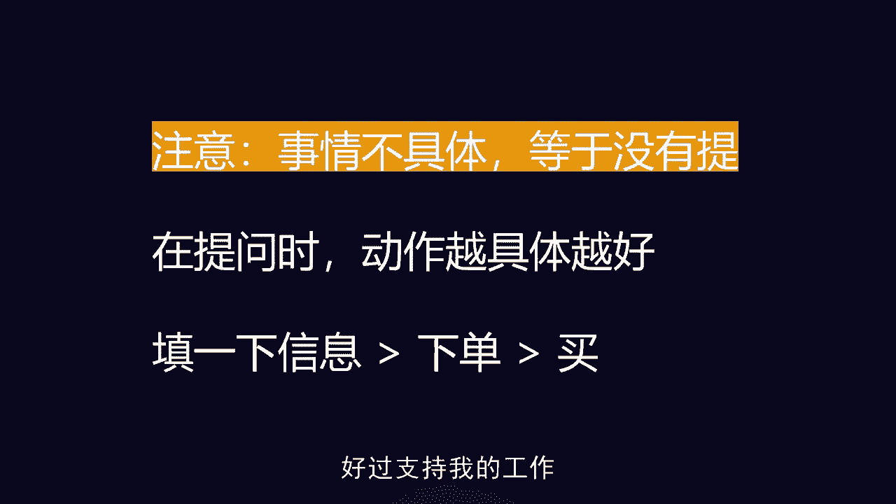
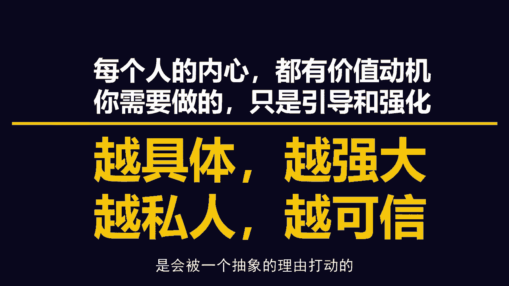

# 梁秋阳--超级沟通力 - P13：013-13.说服：怎样改变对方的想法？ - 清晖Amy - BV1xFtWeuEao

你好，我是秋阳，欢迎回到超级沟通力训练营啊，用沟通优化关系在职场高歌猛进，今天我们继续来探讨关于他者沟通里面，平行沟通的一个重要的板块，叫做我们怎么样改变对方的想法。

什么时候你会在职场当中需要改变对方的想法，你肯定有非常多的场合，比如说你要向上级要资源对嘛，尤其是在很多互联网公司，有一些流量资源是客观的，我们按照指标来分配的，有一些我们可以主观来判断。

什么业务比较重要的跨部门合作的时候，那也许上面给了一个框架性的一个指导，那对方的部门呢有义务配合你，但是配合到什么程度，他响应的速度快不快，配合的态度好不好，这个是需要你来争取的事情。

以及推行新制度怎么样可以不被其他人反对，申请加薪的时候，怎么样比较不容易被驳回，或者我组织部门聚餐，怎么样可以让来的人多一点诶，我有面子，或者这个活动能举办成功，所有所有的这些场合。

都需要我们去改变一个人的态度，或者是行为态度上，让他由反对到支持，或者至少是从反对到中立，行为上，让他由抗拒到无动于衷，再到愿意积极主动的配合你，赞同你，以上这些部分我们统称为沟通当中的说服啊。

怎么样改变一个人，我们之前聊过很多的场景，都是我们没有那么明确的目的性，或者是我们单方面的自己讲好就可以了，但是现在在这个场景里面，我们必须要面对一件事情，叫做我要怎么改变对面那个人。

O比如说我们曾经遇到过一个很有意思的案例，叫做原本预先承诺的客户最优价格，突然发现公司取消了优惠方案，需要客户补钱，客户不愿意了，说如果要补差价，我就不下单了，这个时候我该怎么办。

这个案例的当事人是一个保险的经纪人啊，他是遇到了一个非常严重的问题，叫做我好不容易拿下了这单，结果现在可能因为公司取消了优惠方案，要黄了，这个时候我该怎么办，我问大家，他期待达到什么样的目标。

那当然是很简单，就是让客户补个差价，继续买这单保险，对不对，那他现在遇到的问题是什么呢，就是由于公司的蛇皮操作，现在客户非常的不开心，而且客户心中有极大的抵触情绪，叫做我不想这么做。

我现在希望你直接退钱啊，甚至是我希望现在就以后再也不要跟你联络了，就是我们就直接走了啊，接单就取消了，客户是这样的，我要怎么把它扭一下，变成这个样子，这是我们面对的话题，这件事情靠说服，靠沟通。

靠谈话能做到吗，是有可能的，可是在我们介绍具体的思路之前，我们先来思考一下你的第一反应，你会怎么做，你的第一反应你会怎么做，K最常见的情况其实肯定是，这事就不应该发生对吧，哎我觉得你你的抱怨也很有道理。

我就跟公司商量商量，看有没有可能给您这边一个特例，当然这很难啦，资源无限的情况，或者我们这边资源占优的情况对吧，拿钱砸对方，没有什么不能说服的啊，有人之前说过一句话。

叫做这个世界上最有说服力的一个搭讪方式，叫做你好，我是王思聪对吧，当然现在可能已经不是了，那我们还会有别的人出来，所以不能用资源去砸，还有什么别的办法呢，讲道理对吧，我们要有契约精神。

可是你会发现这个道理呢，你能讲他也能讲，我们要有契约精神对吧，我现在不应该反悔，那你们怎么反悔了呢，你们承诺的优惠方案怎么就没有了呢，那还有什么办法，还有什么办法啊，尽可能的问他说我们的产品啊。

就算是涨了这个价其实也是值得的对吧，这个套餐真的已经很优惠了，他只是没有更优惠而已，对不对，你已经赚了，你只是没有赚更多而已，那客户会说，我之前明明可以用更便宜的价格买到啊，我为什么不能赚更多呢。

或者就道歉道歉道歉，跪下来求他，对不对，请求原谅，你会发现所有所有这些思路，听起来都是我们很多人或者是我们很多时候，我们第一反应会去做出来的尝试，但是他都不是一听就觉得bingo对了的那个动作，对不对。

为什么，因为所有的这些动作，它的本质上都是在讲清楚我这边的道理对吧，我道歉了，希望能得到原谅啊，我们的产品很有价值的，就算涨点价也是划算的啊，我这边努力的补偿，你用别的方式，OK可是无论你怎么说。

由于这都只是你自己的事情，你说的再清楚，再优美，再动听，都未必可以打动对方，因为你这里面所有都不涉及，对对方的影响和改变，说的最极端一点啊，这里面如果客户是真的很不开心，这件被忽悠的事情的话。

他可能会告诉你说，哪怕你现在告诉我，我们这个价格降回去，我可能也都不想买了，为什么，因为我觉得我受到了羞辱，说好的事情你都可以反悔，你不把我当回事儿，对他的这个心理，他的这个心理不是你在这边疯狂的强调。

哎呀我们很有诚意啊，就可以解决的，那这个时候这个时候怎么办，OK这个时候我们就要讲到说服的本质，不是对抗，不是价值的展示，是引导，是让西风也能变成东风对吧，当一个人感觉到你在试图对他施加影响的时候。

他就绝对不会被你说服，什么意思呢，我曾经有个习惯，就是我很喜欢看电影，我经常给我的同事推荐，我看过的亲测好看的电影，我我阅片量还可以，所以他们也会同意我推荐好看的电影，往往真的还不错。

但是我发现很少有人听完我推荐就去看了，往往是我越说的兴高采烈啊，他们那边听着听着嗯嗯有道理有道理啊，下次去试一试，然后就不去了，为什么，因为我说的再好，那都是我的想法，只要对方感觉到。

这个是这个人在试图给我灌输他的想法，他们就会有一种本能的抗拒，所以我们在说服的时候，很多时候这反而会适得其反对，所以真正的说服啊，真正的说服是引导，什么叫引导呢。

就是赋予自主加正向沟通好，这两步走完才是真正的说服好，先看第一步，什么叫赋予自主，就是首先你要接受一件事情，一个人最讨厌的事情就是被强迫，没有人喜欢你摁着头让他做一件事情。

我今天告诉你说你必须嫁给吴彦祖啊，没得商量啊，必须嫁给他，别人都不能不行对吧，刘德华也不可以，别人也不可以，虽然吴彦祖真的很帅，可能也真的是你喜欢的长相，可是你第一反应一定是要告诉我说，凭什么对不对。

凭什么，因为人的本能，人在沟通当中也是遵从这个本能的，人的本能有哪些生理本能，安全本能，尊重爱自我，实现越底层的越强有力对吧，所谓衣食足而知荣辱啊，仓禀实而知礼节，你在你的生理本能，你饿着肚子的时候。

你还每天发抖的时候，你是不可能有什么所谓的尊严，会突然从你脑海中冒出来的，所以在沟通中也是一样的，当我们在试图用一些非常具有威胁性的话，去威胁对方，说啊，我们这个产品这么好，你为什么不买啊。

我大不了我们帮你把这个价格降回去嘛，你再考虑考虑嘛的时候，当他感觉到你在强迫他说我必须要再考虑考虑，我必须要买的时候，他的本能会抬头，什么本能安全本能，他会先让自己确认我是处于一个安全的状态。

什么叫安全的状态叫做有选择的状态，我是可以不被你强迫的，所以这个时候他一定会疯狂的做一种尝试，叫做我就补对吧，你要我嫁给吴彦祖，我就补，你让我自己选，我可能会选吴彦祖，可是你非让我嫁给他。

我就不我要先确认我有选择的权利，所以当你要说服一个人的时候，每一段说服你在跟他，在进入真真正的沟通的时候，之前，你有一个前置动作叫做赋予自主，先让他感觉到我是自由的，消除他的不安全感。

他才会愿意跟你接下来慢慢聊，所以刚才那个案例，如果你真的要跟这个客户聊的时候，你必须要先让他明白一件事情，您是随时可以退单的啊，这件事情真的完全就是我们的问题，你随时可以退单对，所以我跟你说的这些东西。

甚至都不是公司让我说的，就是我就是单纯跟你分享我的想法，看你愿不愿意跟我聊，你不愿意聊，你也可以马上走，你也可以马上挂电话对吧，大不了我大不了，我过几天再打电话给你，对，可是用这种赋予自主的方式。

你可以让对方感觉到，你可以让对方感觉到真正的充分的安全感，而这个时候你就会起到一个效果，叫做他才会愿意跟你往下聊，你才有接下去聊的指望，你聊下去才有戏，那具体怎么沟通可以赋予自主性呢，让对方感觉到啊。

我是有选择权利的呢，很简单，避开高威胁信息，多使用低威胁信息，什么叫高威胁信息，就是让对方觉得我没有退路，我没有选择的信息，你难道不应该处理好这个文件吗，这看上去是一个问话，对不对。

可是他完全没有给对方选择，它其实是一个强调，叫做你就该处理好这个文件，你就不能多为团队想一想吗，我不懂，就只加一天班很难吗，老板就这么说的呀，你就应该做啊，客户的需求，你应该尽力去满足。

这都是高威胁的信息，但凡任何人听到这句话都会本能性的皱眉头，为什么，因为这个话言下之意就让对方没得选，什么叫低威胁信息叫做，如果你现在去做好这件事情，我会感觉非常安心啊，当然你不做好，那是你自己的事情。

那可是你如果愿意做好，我会很安心啊，我需要你和我们一起再拼一天，这个项目就搞定了，就是我求你客户这个需求谁能满足就好了啊。

整个团队都希望你能留下来，你会发现低威胁信息里面，虽然说最后一句话，整个团队都希望你能留下来，稍微有一点点威胁性，因为给人一点压力，但是整体而言他都是把选择权给对方，问的那个人是一个低能量的状态。

叫做我需要你们和我一起再拼一天，客户这个需求谁能满足一下就好了，像不像一个小孩在求助，所以很多人在沟通的时候，特别容易滑到高威胁信息那一边的原因是，因为他们太着急了，很想强调，对不对。

尤其是刚才那个保险经纪人，他但凡一着急跟客户说，哎呀，你就能不能再考虑一下嘛，那客户一定第一反应就是烦躁反感，我不能，我现在已经考虑清楚了，我再考虑也是这个结果，为什么，因为我们总是有一个错误的概念。

以为我们这边越强调这句话的威力就越强，可是不是的，这句话实际上在对对方心理造成影响的时候，应该是我们这边越强调，越不给对方退路，反而对方就会被我们推走，当我听到同样两个请求。

一个叫做你就不能多为团队想一想吗，另一个叫做啊，我们整个团队都很希望你留下来，你说我会更愿意去考虑哪一个请求，肯定是后者嘛，对不对，为什么，因为他不让我没有安全感，所以我会愿意至少思考一下这件事情。

对所以尽可能的避开高威胁的信息，使用低威胁的信息，事实上在心理学实验里面，我们推荐同一款产品，用高威胁的信息，用低威胁的信息，两个结论都是合乎科学的，都是理论充分的，都是论据充足的。

可是后者的效果要好得多，所以你会发现啊，人是一种心理很奇特的生物，叫做你越给他自己选择的权利，它越有可能去选择你要的那个选项，应该说他才有可能去选择你要的那个选项，如果你不给他自主权的话。

他的所有选项都只剩下一个本能冲动，叫做我啥都不选，我要先保证我有自由选择的权利，所以赋予自主权的表达方式有很多种啊，最常见的一种叫做不要说你应该改，说我需要啊，不是你应该配合我。

而是我现在很需要你配合我啊，不是你应该来参加这个团建呐，大家都来了，你为什么不来。

而是哎呀，我们都很想要你来参加这个团建呢，为什么，因为应该是一个我做到了不加分，做不到要减分的玩意儿，你应该配合我的意思是，我这个时候如果听了你这句话，表示我同意一件事情，叫做这事是我的。

应该我配合你也没什么好说的，可是我要不配合你，这是我的错误，那我怎么能同意这个框架呢，我肯定是要先否认这个框架，所以你你在说我应该的时候，我会先否认你，可是如果你说我需要你帮忙，就变成选择权在我。

而这个时候这个讨论的框架变成了，我如果愿意帮你的忙，我是满足了你的需要，是加分的，我不帮我也仅仅是没有满足需要，但那是你的需要嘛，所以也不扣分，这个时候我会有安全感啊，愿意考虑一下我要不要来帮你的忙。

甚至我会有动力，因为这个时候我帮你忙是有分家的，对不对，在你心中我的形象是会提升的，所以这个时候由于赋予了自主权，看上去语气更弱了，我反而更愿意答应你，反而愿意更愿意跟你接下去聊。

那关于赋予自主权的语句有非常多，比如说啊，我对你的理由比对我自己的理由更感兴趣啊，所以我很想听一听你的想法诶，你会发现，如果一个销售愿意对客户说这句话的时候，客户反而会愿意跟他多聊几句。

越是急匆匆强调自家产品有多好，强调这件事情值得去做，这个东西，值得去买的沟通者，反而对方越不愿意听你的对吧，越不愿意跟你聊下去，我肯定没法做决定啊，这事还得你来做决定，当对方听到这句话。

他就不会着急做决定了，对不对，因为他就不需要通过我马上做一个否决，来证明我有决定权，因为你同意他有决定权啊，虽然其他人也有想法，但显然只有你能做这个决定，理由是一样的，我们其实可以就按照你说的做。

不过你觉得这对我会有什么影响呢，我很想听下你的看法对吧，我顺从对方，只想知道他的看法，你觉得我们可以怎么来讨论这个问题，让对方参与进来，你会发现整个赋予选择权，赋予自主权，在说服之前的这个前置动作。

它的核心思路就是第一我不要引起对方的反感，不要把他逼走，第二我让对方没有心理压力的，可以跟我继续聊下去，让我获得一个聊下去的机会对吧，第三由于对方有自主权，他内心更有可能有动机。

OK更有可能有动机来选择我让他选的那一边，所以赋予自主权是一个在沟通习惯当中，非常需要注意的，跟任何人在沟通的时候，注意这件事情，你都可以避免非常多无谓的损耗和误解，那当然这个时候会有一些更细的东西。

我们的教练会带大家去做练习，我们的课后练习中也有，比如说啊我举个例子，哎我本以为你应该是那样的，当然你这样也行吧，我问大家，这是赋予自主权的语句吗，这不是为什么，因为我本以为你应该是那样的。

这句话给了对方太大的压力，这个时候对方就会很需要向你证明，我可以不是那个样子对，所以在实际沟通当中，有很多具体而微的场合环境，每个人的表达习惯，但是我们就确认一件事情，我的这句话说出来。

让对方的选择变多了还是变少，如果是变多了，OK那你就可以想象，这是一句赋予自主权的语句，对方也不会有反感好，那赋予自主这个问题解决之后，我们来进入说服的后半部分，也就是正向沟通。

这个时候对方已经愿意跟我们聊了，他内心也有动机了，那我们怎么样让他内心的动机滑向，我们希望他说服的那个方向呢，正向沟通六问一套，提升说服力，搞定不配合沟通者的万能公式，基本上这六个问题里面。

包含了非常多的说服原理和技巧。

但是我把它简化成这六个问题，方便大家掌握，K如果我们之后遇到一些情况，你们会发现你们不需要六问全问，或者是你们可以自行去变形，但是只要你们理解了这六个问题，它背后的原理，那就可以提升自己的说服力。

好具体是哪六个问题呢，我们先来看第一问。

第一问叫做你为什么想做这件事，OK原本预先承诺的客户的最优价格，突然发现公司取消了优惠方案，需要客户补钱，客户不愿意说要补差价就直接不买，你该怎么办啊，假设这个时候，我们已经赋予了客户充分的自主权。

还愿意跟我们聊下去了，那这个时候我们要问的第一个问题叫做，我能问问你当初下单的初衷吗，你为什么想买这个产品，你为什么想要投保啊，你为什么觉得保险对你的生活来说是可必要的，很多人会好奇。

这个时候问这种问题，你的脸呢对吧，你的脸呢，人家明明是已经很不想下单了，你问他，你当初为什么愿意下单，你这不是哪壶不开提哪壶吗，恰恰相反，恰恰相反，我跟大家说，这个世界上之所以人能被说服的原因。

前提之一叫做每个人的内心永远都有两个小人，一条say yes，另一个say NO，周围一定有朋友跟你抱怨过他自己的伴侣，男朋友或者女朋友跟你说想分手，但是你会发现一个非常奇特的现象。

叫做她跟你抱怨了一个晚上，她的男朋友是个渣男，你义愤填膺，把她男朋友骂的狗血淋头，陪她喝到半醉，第二天早上她接了个电话走了，因为她在干嘛，她说我跟我男朋友去逛街对吧，又或者是你跟她跟她男朋友蜜里调油。

你吃了一一嘴狗粮，然后呢，第二天过来，她又跟你说，男朋友是个渣男，是你的朋友精神分裂吗，还是她的男朋友一夜之间变了呢，都不是，而是因为人内心当中本来就有无数个动机，在疯狂的交叠冲突，你说这个客户啊。

这个客户在你们取消了优惠方案的当下，一定是不爽的，那一刻，他有一个动机从潜意识浮上了意识，表层，叫做我不想买了，老子要退单，可是我问你，他内心深处还有没有别的动机存在呢，肯定有对不对。

有一个动机一定叫做啊，可是好麻烦啊，都谈了这么久了，我现在不在这卖，我还得去跟别的经济再聊半天对吧，肯定还有另一个动机叫做唉，其实涨了个价也算是划得来，虽然没有原来那么划算，但是其实也还行，对不对。

当然也会有别的反对的动机，我要强调的其实就一件事情，就是每个人的内心啊，像是一锅汤啊，这么说有点难听，每个人的内心像是一片大海，这大海里面啊游着不一样的，各式各样的在游动着的动机，像鱼群一样。

他最终做什么决定，取决于哪条鱼最后浮上了水面，可是哪条鱼最后浮上了水面，如果你不想屈从于偶然，你可以试着自己去把它钓上来，那怎么吊，就是靠这个跟正向沟通，而当我们第一个问题在问。

你为什么愿意这么做的时候，我们就是在试图钓起那只正向的动机的鱼啊，为什么呢，是因为人的大脑是没有办法抵御提问的引导的，就好像盗梦空间里面说，你不要想大象，你脑海里一定会出现大象对吧。

这是人的大脑就会产生的本能反应，就好像我在这里321倒数321，虽然我啥都没说，你内心突然有一点紧张，对不对，所以这个时候什么样的提问比较容易吊起来，正面动机呢也很简单，叫做正向提问啊。

简单点来说就是不要问为什么，不要问为什么要不要反面提问，要正面提问，你反面提问，他想到的全是反面的动词，我问他，你还有哪里不满意啊，他就会告诉你，我还有哪里不满意，你问他好。

新新手销售特别喜欢问你还有什么顾虑呢，我可以帮你解决，对方心中就算想到了顾虑，也未必会帮你解决，可是你真的问他还有什么顾虑，他就一定能想出还有什么顾虑，因为这个世界上没有完美的产品。

我现在让你想一件事情的缺点，你是一定能想到的，他是一定能想到有顾虑的对吧，诶您为什么突然就不想买了呢，你以为加一个突然我就想不到答案了吗，我马上告诉你是什么原因让我突然不想买。

你会发现当你反向提问的时候，对方只会想到反面的理由，而你正向提问的时候，才能帮助对方强化正面的动机对吧，你当初为什么想买啊，可能是因为啊就是家人一句话触动了我啊，你为什么还愿意考虑一下。

我们这公司说的难听点，我这公司我都不想干了，他们居然临时取消了优惠，这么不守信誉，您为什么还愿意接我电话，考虑一下对吧，您最早看重我们公司产品的是哪一点，是品牌还是什么，那这一点可能没有改变。

所以你会发现当你正向提问的时候，这第一步问题就是在帮对方强化他的正面动机，当他的正面动机存在了之后啊，特别好，你就知道这个东西有戏，就好像曾经有一个非常高明的置业顾问啊，一个顶尖的销冠，他遇到过案例。

很有意思，他说一个客户跟他说，他已经决定了要买大户型的房子了啊，疯狂抱怨说你们这个楼盘怎么搞的啊，全是这种70平90平的小户型，然后应该怎么说服他购买，他的第一句话特别简单。

就是您当初是怎么想到要来看我们楼盘的呢，当然没有问的这么嘲讽啊，这么问有点嘲讽，思路大概是这个样子，大概就是哎呀，就是您先消消气，我们这个楼盘确实是啊，我都有点纳闷了，你当初是看上他哪一点了。

过来看对吧，跟客户一起吐槽，而这个时候客户可能就会给你答案了，叫做啊看你们地段毕竟好啊对吧，你们这毕竟是学区房啊，你们这个品牌我喜欢啊啊，我们家里的人喜欢你们这个楼盘，OK正面动机出现了。

这个时候就已经不是一个完全的反对的情况，他已经有了一个正面动机，你就从一个完全被反对的状况，变成了一个诶正派跟反派在对峙的状态，那你说鸡呀，不要嫌人家小，一开始在引导正面动机的时候，就跟钓鱼一样。

不要嫌那个钓起来的鱼小，钓上来第一条你之后就可以钓更大的鱼，所以动机是可以被比较出来的，你可以想想他本来还可以做什么更消极的事情，但他没有做，那就说明他内心还是有正面的动机，让他意识到这件事情。

上课睡觉的同学本来可以翘课，和你争吵的同事本来可以拒绝沟通，不愿意购买的顾客本来可以不走进店里，那个已经萌生退单主意的客户，本来可以不接你这通电话，所以很多时候我们发现不了对方的正面动机。

往往是因为缺乏对比啊，之前执中学长在台湾做一个讲座。

那个时候他没有奇葩说，他做那个讲座呢单纯是小众圈子的啊，但是有些同学呢啊被莫名其妙的老师啊，同学被学院里的人拉过去听了，很强迫冲人头嘛，怕讲师太尴尬嘛，唉这帮人是不知道，你拉了一些完全不想听的人过来。

这讲师更尴尬，这些人就在教室里面自习啊，玩手机啊，执中学长不紧不慢，好在开始之前跟前面几排的人聊天说，哎我很好奇，你们看上去对我这个不是很感兴趣啊，那你们为什么没有缺席呢，当他问出这个问题的时候。

这些同学之所以没有缺席，为什么已经不重要了，因为他们总能找到一个理由，而这个理由会帮助他们让自己相信，可能其实我们还是有那么几分，来想听这个讲座的，OK所以有了对比之后，正面因素就出现了。

这是我们正向沟通六问的第一问，叫做你为什么想做这件事情，还有一个进阶技巧叫做找对比，OK发现不了正面动机就找对比，那接下来我们来看我们的第二问和第三问，这是一个组合拳，叫做第二问。

叫做你有多想做这件事情，请你从1~10里面选一个数字，一分是不响，十分是很想原本预先承诺的客户最优价格，突然发现公司取消优惠方案啊，我问客户说，你当初为什么要下单呢，你还记得吗啊，客户说，因为疫情来了。

觉得健康风险很大，现在没有优惠了，就想退单了，好这个时候我就可以问他了，我能问一问，你现在还有几分想买吗，从1~10分里选一个数字，一分是不想十分是很想，你会选几分啊，通常情况下这个数字很难是零。

为什么，因为我们已经问过第一个问题了，他已经有一点点正面的动机了，但是呢这个数字当然也不会很高了对吧，他要是十分想买，还用你来说服他吗，啊比如说可能是二分和三分好，我们现在拿到了一个数字。

那接下来怎么办呢，接下来我们来问他第三个问题叫做诶，你为什么没有选更小的数字，那很多同学会说你这又是哪壶不开提哪壶啊，他已经选的够小的啦，两分三分，你非要问他为什么没有选更小的，如果人家说哦，对不起。

我选错了怎么办呢，来我来告诉你，第一大多数人啊，他真的给了你一个数字，他不会轻易推翻它，因为这是他给你的数字，他推翻了就等于推翻他自己，第二这个时候我为什么要问他不选更低的呢。

比如说客户说哎我觉得最多还有两分想买吧，这个临时变动确实让我没什么想买的了，觉得你们没有诚意，这个时候我问他，咦我以为会是一分甚至更低，毕竟公司做了很过分的事情嘛，出尔反尔嘛。

为什么你没有选择更小的数字呢，OK你会发现上下问差距的时候，他给出的结论会是什么，一定会是一个积极的结论，因为他要试图去证明这个东西不止一分，至少有两分，所以他一定会说啊，毕竟之前跟你沟通很愉快啊。

毕竟你们公司是一个信赖的大品牌，而所有这些东西都是在不断帮他强化，你一开始问出来的那些正面的动机，这个时候就好比好比同样的一片海，大海里面负面的动机是一群鱼，正面动机是一群鱼，当你向下问差距的时候。

正面动机的那群鱼就跟打了兴奋剂一样了，开在开始快速的游动跟活跃起来对吧，而如果你去抱怨说两分也太低了吧，你为什么不能高一点呢，你就这么不想啊，配合我吗啊或者你问人家说你愿不愿去团建啊，你有几分。

他说三分，三分也太低了吧，你就这么不想去团建吗，你换个数字吧，对方就会告诉你，我为什么打这么低分啊，负面动机那群鱼就会非常的活跃，所以这两个问题是一个组合拳，我通过一个1~10分的量表。

能够让你一下子有一个具象化的强度的感知，叫做我有几分想做这件事情，而一旦这个东西被具象化固定下来之后，就等于一个动机，从虚无缥缈变成了一个具体的东西，这是一个三分的动机，然后我再通过反向询问。

向下问差距，来帮助你强化这个三分的动机，其实也很了不起，换别人可能都只有一分了，对好，那这个时候一定会有朋友问我，哈哈老师你这个问法有破绽对吧，你说1~10分，如果人家回答一分或者零分，你要怎么向下问。

因为1~10分嘛，一分后面就没有了嘛对吧，或者人家更狠一点，直接问你零分怎么办，很简单，这个时候我可以换一个问法，同样可以圆过去叫做，那我能不能问一下，如果这个时候要从零分变成两分，或者从一分变成两分。

三分需要满足什么条件，需要满足什么条件，我问你，如果别人问你这个问题，你脑海中想到的是什么呢，想到的是一些补救措施，对不对。

一些能够打动你的东西，对不对，而这些东西妙就妙在，当我这么问你的时候，是你自己想到的，可是如果我主动提供说哎我有这些补救措施，你未必会买账，为什么，因为那就是我提出来的了，可是如果这是你自己想到的。

要符合这个条件，OK那接下来我就来努力满足你的条件，你就很难不从零分变成两分了，对不对，那当然有些人可能不想上套，他的心，精神抵抗力比较强，他会说那我就漫天要价，没关系。

我们着地还钱嘛啊我们先聊一聊这个条件，你告诉我说我们现在还要比之前价格更低，我才愿意买，OK这听起来很糟糕，我未必能实现，可是这至少说明你心中是有个价的，这个世界上怕就怕你心中没有那个价格，只要有价格。

大家就能来聊一聊，对好，如果说第一个问题问你为什么要这么做，是勾起你的那个初步的正面动机，1~10分，为什么不选更低，向更低处提问，是在强化那个动机，但是在做这些事情的时候，请大家注意一个基础的原则。

叫做具体，因为事情不去提，等于你没有提，什么意思呢，我问你，你接下来把这个项目做好的议员有几分，十分没得说，一定好好做好，这是一种问法和一种回答，可是如果我问你，你接下来配合我做这个项目。

然后我们的第一步呢是在今天下午，你要跟我去这个城市的另一边啊，大概30km外的酒店开个会，你需要推一下你今天下午部门内的会议，然后安排一下这件事情，你有几分意愿，这个时候的意愿就未必是十分了。

很多时候在说服的时候，一开始我们就要把这个东西具象化下来，要让对方知道，我们请求他做的具体是一件什么事情，第一社会让人有安全感对吧，你就配合一下我们公司嘛，你就支持一下我的工作嘛，这是个啥对吧。

虚无的东西让人没有安全感，我怎么知道知识你要支持到什么程度呢，对所以如果你是那个保险经纪人，你在问他1~10的时候，这件事情啊，这件事情啊，你的描述方式最好是填一下信息啊，如果你还愿意的话。

铁你愿意继续跟我推进这笔交易，然后接下来填一下这个信息，给我的意愿是，1~10，好过，下单这个抽象点的动作好过，买这个更抽象一点的动作，好过支持我的工作，这个抽象到不知道哪里去的动作，所以在提问的时候。

动作请你越具体越好好，这个时候我们可以试着回头，找一个你想要沟通的事项，比如说跟你的客户沟通初步的意向。

劝你的男朋友减肥，劝你爸妈戒烟，试着提这两个问题，1~10分为什么不往下，可能你会有新的发现，你会发现他的说辞跟平时的抵抗完全不一样，完全不一样，为什么，因为你正在让他的正向动机。

通过这两个问题活跃起来好，这是我们的第一问，第二问和第三问好，这个时候接下来鱼已经被钓上来了，更多的鱼已经活跃起来了，我们的第四个问题，我们要让这个鱼看到水平面，让他们知道我们最终的目标。

第四个问题叫做，如果你做了会有哪些好结果，如果你做了会有哪些好结果，为什么，因为很多时候啊，理由跟好处是两回事，我买保险是理由，这个叫做动机，因为受到了触动，因为被我的家人指责了几句，因为疫情来了。

这个触动我的是动机，可是动机只能让人开始动，不能让人动到达目的地，让人到达目的地的，一定是到了目的地之后的那个好处，那个目的地迎风飘扬的旗帜，会指引我们往目的地走完这段旅程，动机只能让人开始动。

只能推他一把，你还需要他这个燃料能够烧到足够让他成交，你需要什么呢，你在跨部门沟通的时候，你需要让那个人一直配合到你项目完成，你需要什么呢，需要最后的那个愿景，所以这个问题一定要让他回答。

你叫做你觉得你帮了我之后会有哪些改变，K在心理咨询里面，非常多的咨询师在初次见面的时候，都会用这种方式来固定和强化来访者的动机，叫做你为什么会想要来寻求我的帮助呢，你觉得我帮了你之后会有哪些改变。

如果说第一次来你的咨询室，他是靠内心的不舒服来的，那之后来咨询师可能就是靠这个问题，他答案来他之后来之前就会心中想到哦，这次我去完之后，我可以有这些改变，所以我会去同样的。

如果那个客户之前愿意跟你聊下去，是他一开始的动机，那些不适感，那些对于疫情的朦胧的恐慌，让他决定了解一下保险这件事情，那之后推动他真正承担的，推动他能跟你一起走完这个目的地的。

一定是他买完之后能带来的实际好处，这件事情要靠你的提问引导他自己想到对吧，他说可能因为我还是很担心，疫情反复以及健康保障确实重要，所以现在有两分不是零分，所以我问他，那所以你期待买这份保险。

会给你带来什么样的改变，什么样的东西呢，OK啊，这可能会让我做职业选择的时候，稍微安稳从容一点吧，毕竟我也快到35岁了，快到职场中年危机了，非常好，从此以后你就在他心中种下了一个什么呢，种下了一个旗帜。

他以后再想到保险，就不会光想到推动它的那个最原初的动机，会想到一个它可以达成的目的，叫做我以后做决策的时候，我都可以安稳一点啦，我不用那么着急考虑要不要辞职，要不要换份工作啦，因为我有保险啦。

OK所以第四问叫做描述愿景，如果你做了会有哪些好的结果，第五问哈哈是给这个愿景抛光打光，让它变得更加光芒万丈，好的结果我们都知道，可是这个结果为什么对你特别重要。

OK这会让我做职业选择的时候稍微安稳一点，从容一点吧，毕竟快到35岁了，所以你期待买这份保险会给你带来什么，那为什么你这么在意心态上的从容安稳，是之前发生过什么事情吗，OK这个时候。

可能你们就会聊到一些相对深层次的东西啊，大概是因为我们家曾经巴拉巴拉巴拉巴拉，巴拉巴拉非常好，这个东西是什么呢，这个东西是给这个愿景加固敲螺丝钉，把它钉在你对面这个人的心上，你问他。

你一个不愿意配合你的一个跨部门的同事，他为什么愿意配合你，为什么愿意跟你沟通这么多次，他多少还是想要这个项目做成的，这个项目做成能给他带来什么，这件事情对他为什么重要，问到这一步的时候。

他内心的那个愿景已经开始牢牢盯在他的心上，指导他去努力，就算你问到这边停了，他回家也会想起来说，哎啧啧对吼，如果我这么做，我要是配合他，我可能可以得到一个什么东西，而这个东西对我来说好像真的很重要。

你会发现当为什么重要这个东西的答案一出现，这个东西就锚定了，为什么，因为好处还可以是一个共通的东西，但是背后的那个具体的原因为什么，对他重要的东西是一个更加个性化的，更加私人的东西。

每个人的内心都有这种价值观，都有这种在意的东西，你需要做的是靠问题去引导和强化他，所以什么叫做聊透了，什么叫做说服的时候，说到位了，是你真的问出了一个，你感觉到这个真的是他真实私人想法的东西。

叫做越具体越强大，越私人越可信，一个理由，只有当他真正具体，他才能对这个人产生效果，没有任何人是会被一个抽象的理由打动的，比如说我举个例子啊，我减肥就可以更健康，是个人都知道。

可是我真正被戳到的那一刻是什么时候呢，是一个特别具体的场景。

就是有一期节目快录制了，我跟席瑞一起去一家淘宝店挑衣服，那家店我们各自看中了一件都很喜欢，然后我跟那个客服说啊，我的身高这么多，体重这么多啊，应该选哪个码，客服说啊，对不起，没有你的嘛。

那一刻我被这个具体的理由打动了啊，也戳疼了对，越私人越可信，什么时候他真的能给你讲出一个故事了，讲出一件往事了，你就拿到了一个具体的理由，其实你拿到不重要，重点的是你通过让他去挖掘自己的内心。

给你一个理由，让他自己意识到这件事情对他真的很重要，OK啊这里有一个清单，这个清单是我的同事去四处收集的一个，理由清单，但是这里面还不够具体，我会之后给大家一个更加完整的版本。

但是你们会发现其实一个人内心的理由啊，千万不要以为人在职场只在乎钱爽啊，晋升机会，这几个非常简单粗糙的东西，往往不是这个样子的，人，在职场能在乎的东西有很多，他为什么要配合你这件事情。

可能有非常多背后的理由，自主性权威的感觉显得有吸引力，成就感啊，助人为乐，诚实，希望独处稳定，容纳非常多种，K非常多种，这个完整的表单之后的教练会分享给大家，但是我们必须要了解一件事情。

就是每个人内心都有一个钥匙孔，对你要通过提问去刺激他，找到自己的那把钥匙，才能够说服他，你要让他自己找到那把钥匙，你当然是找不到那把钥匙的，所以我们现在从第一问你为什么想做这件事情，这叫做动机浮现。

第二问你有多想做这件事情，你为什么没有选更小的数字，这叫动机强化，第四问，如果你做了会有哪些好的结果，这叫做树立愿景，第五问，这结果为什么对你更重要，这叫做固定愿景，最后的第六问。

这个时候他内心的能量已经够了，你需要去把它引导，把这个内心的想法变成现实中的动作，一旦这个转化完成，这个想法在他心中就落地生根，因为已经有了一个外部世界的凭证，叫做你都已经这么做了对吧，俗称来都来了。

所以第六问叫做，如果真的你觉得可以这么做的话，当然你未必要这么做啊，记得赋予自主权啊，但是你未必真的一定要这么做，我只是好奇，如果你真的打算做的话，你的下一步行动可能会是什么。

OK很多人在说服一个人的时候很着急，就是你看他已经有动机了，他有愿景了，他有目标啦，Let's go，让他去做这件事情，不要因为一件事情动机离愿景离得很远，愿景和这件事情的完成离得也很远。

愿景和什么离得近呢，愿景和他接下来做的下一步离得是近的，所以任何事情循序渐进，先让他做下一步，不要让他去奔着最后一步去，努力说服一个人做一件事情，像是一个1万米的长征。

没有人可以朝着那个1万米的目标一直跑下去，而不感觉到疲惫和想放弃的，我都一定是一圈一圈朝着下一个50米，100米的目标跑下去的，这个50米，再一个50米，再一个50米，然后就跑完了，说服也是一样的。

所以你问他说好，你当时为什么觉得这个理由很重要，他说啊，大概因为我们家曾经巴拉巴拉巴，给了你一个理由之后，你的下一步应该是什么呢，应该不是说啊，那现在让我们一起去做吧，还等什么呢。

而是那如果你打算重新考虑一下这笔单子哈，你还是考虑一下，愿意给我这个面子，愿意帮我一个忙，但是你完全可以不用这么做啊，你也完全可以反悔，只是如果你愿意的话，你下一步会做什么呢，是会问我具体的优惠策略。

还是就我们填表单，我们先试试看推进，然后之后再说，OK为什么要这么做，因为人的行为是会极大地影响他的态度的，只要他愿意配合你走出第一步，它的成功率就会提升至少一半，在心理学实验当中，有非常多的消极患者。

就是他们内心极度缺乏做事的动力，心理医生只要让他们成功的在纸上写出来，自己可能想做的事情，并且这张纸上还有一句话叫做，你写了你也不用做，不用担心就会影响你，所以收服的最后一步，是让他做出一个初步的动作。

然后1。1。1点用刚才的过程完成它好，你会说你会说这六个问题，听上去好像是挺自圆其说的，那难道每一个场景都能用吗，当然不是，首先第11~10这个话题，不是每一个场景都必须要用，也不是每个场景都能用。

大家都会知道，这只是一个我拿出来做示范的一个案例，它是帮助你强化动机所用的1~10这两个字，这三个字他第二次听的时候，很有可能就会产生免疫效果，但是它的效力是不会改变的，它的效力是什么呢。

是通过1~10这个模型让对方认真思考，他真正配合你，他同意你，他为你所改变的可能性，只要他的脑海在这里停的足够久，他就会充分的考虑，我是有可能答应你的，而不是完全马上本能性地拒绝。

这个时候就有了更多的机会，你下一次再问这六个问题的时候，可以未必是1~10，可以直接问他，就是你有多想做这件事情，对未必是1~10咯，可以是不同的等级咯，或者是把不同的，它可以做的事情之间拿出来给他选。

你最想做的是哪件事情，对这件事情的想做的欲望和愿望，强烈程度大概跟另外哪件事情相当，OK这个东西都可以变，但是核心是让他充分的考虑，这个正向动机的可能性对，而你会发现这几个问题我是不存在的，我不重要。

不是我在说服你，我只是在引导你，发现你自己的想法，这也是一开始我们提到的，说服的本质，不是对抗，是让那个西风发现诶，其实我可以是东风哈，那最后给大家看一个很有意思的案例，这是一个国内顶尖的精神科医师。

怎么样用这套方法跟不配合的患者沟通呢，实际上他没有全部用完啊，因为他是专门做儿童心理的，他的患者是一个少年，那他也不需要完全用完，可是他单纯用一个特别简单的技巧，就起到了非常有意思的沟通效果。

当时他的病房里面有一个非常不配合的患者，一个少年，第一天他去的时候拳打脚踢，不吃药，不配合医护人员，他去想问一问发生了什么事，那个患者瞬间进入了抑症的状态，就是整个人啊开始头脑发抽啊，我是谁。

我什么都不认识啊，我不认识你，我在哪儿啊，我什么都不记得了，OK这是人心里面对压力和应激的时候，的一种自我保护的本能，他说那这个时候他不能见人，让护士带他去房间，第二天再来沟通，第二天见到他。

这个时候倒是没有抑症了，还是不配合治疗，拒绝吃药啊，他问他说哎你为什么拒绝吃药啊，这个患者说我讨厌你，你让我恶心，我不想见，你，给我滚，你给我滚，我问你，这个时候你能跟他说什么，你怎么说服他，好好配合。

怎么样引导他对吧，这个时候我感觉你都不能问他，你为什么要来医院了，我被我爸逼来的对吧，我也来不及问1~10了，可是我们认真想一想，这个时候他身上有哪一些可以挖掘的，正向的因素，可以让我们问出第一步。

对吧叫做真好，你已经可以清楚地讲出你的观点了，然后第二步强化这个动物，就叫做你是怎么做到的呀，OK就这简简单单的两个正向沟通，赋予它自主，用正向沟通的方式改变他的态度和行为。

所以我们回想一下周围遇到过不配合的同事，朋友的案例和场景对吧，隔壁部门的同事总是不配合工作，客户对我的推荐无动于衷，团队看起来干劲不高，伴侣忙起来不回微信，所有所有这些东西都是可以用这两种方式。

伴侣忙起来不回微信，你怎么老是不回我微信啊，这种高威胁不赋予自主权的话语，特别容易让对方反弹，对吧啊，我很希望你能够回我的微信，这个时候他就算脾气再糟，他也会意识到是我错了，我满足不了你的需求。

而不是理直气壮的说我为什么不回，因为我也很忙啊对吧，所以接下来你又可以用六个问题开始，试着增强它的正向动机，这是我周围非常多的朋友在说懂沟通之后，我发现我自己很少遇到不配合的人，对那其实不是的，不是的。

并不是他们遇到的人跟别人不一样，而是好的沟通者是可以塑造对方的态度的，是他们会了沟通，他们就可以让对方意识到，其实他也没有那么不想配合，OK那以上是今天关于平行沟通中，一个非常重要的板块。

我们去如何改变他人的态度和行为，也就是说服这里面既可以用在销售场景，也可以用在跨部门沟通，也可以用在日常人际交往过程当中，很多时候一个有影响力的人，往往就是能够很好的引导对方去改变他的人。

有什么比能够改变一个人，更能体现你的影响力呢，同样轮流公司内组织团建，他叫别人来，别人就不愿意来，你叫别人来，就有很多人愿意捧场，老板一看就能知道谁在这个团队里面，更有影响力，对不对。

而这个影响力就是靠每一次细小的沟通，每一次成功的说服，1。1滴累积起来的，更别说很多时候说服还能帮你拿下这一单，下一单能够帮你要到这个资源，那个资源这些实际的好处，所以从现在开始练习改变你的沟通习惯。

赋予自主正向引导。