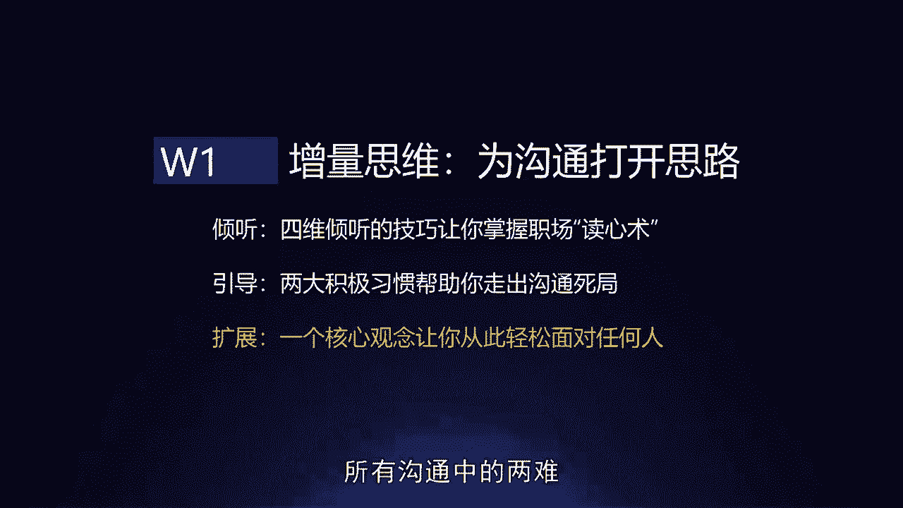
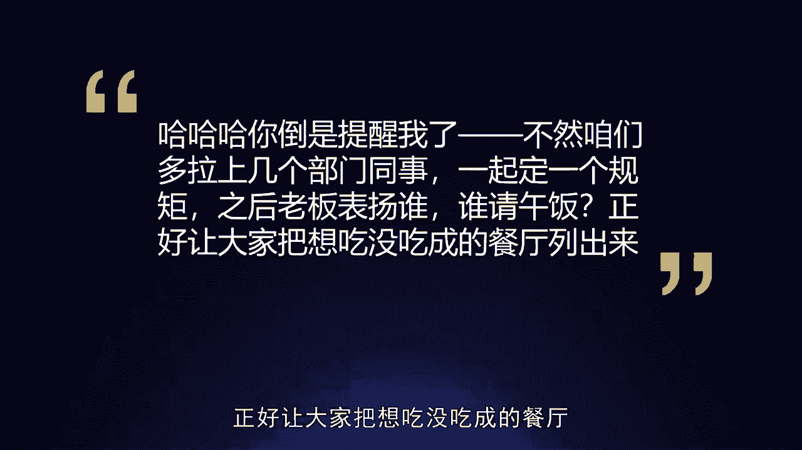
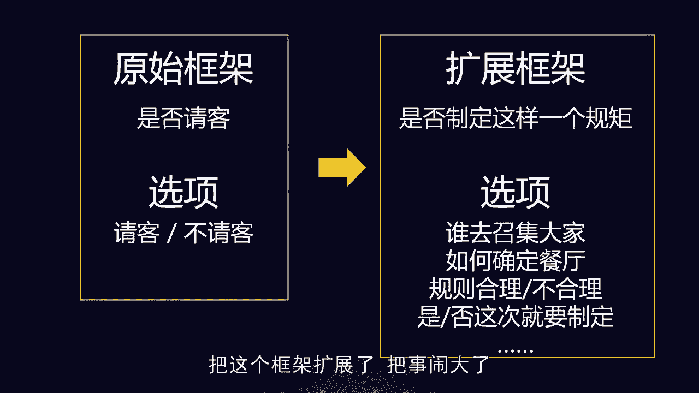
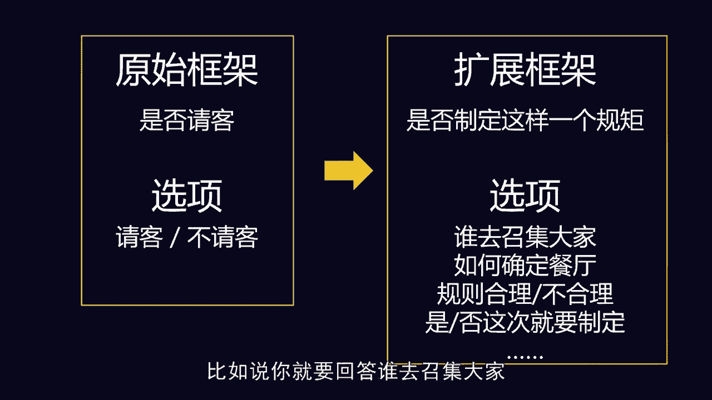
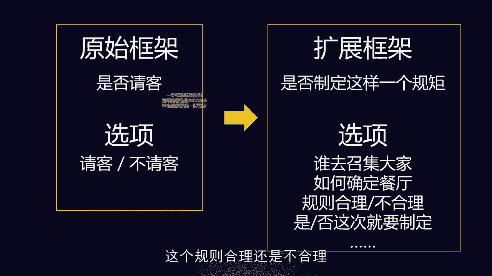
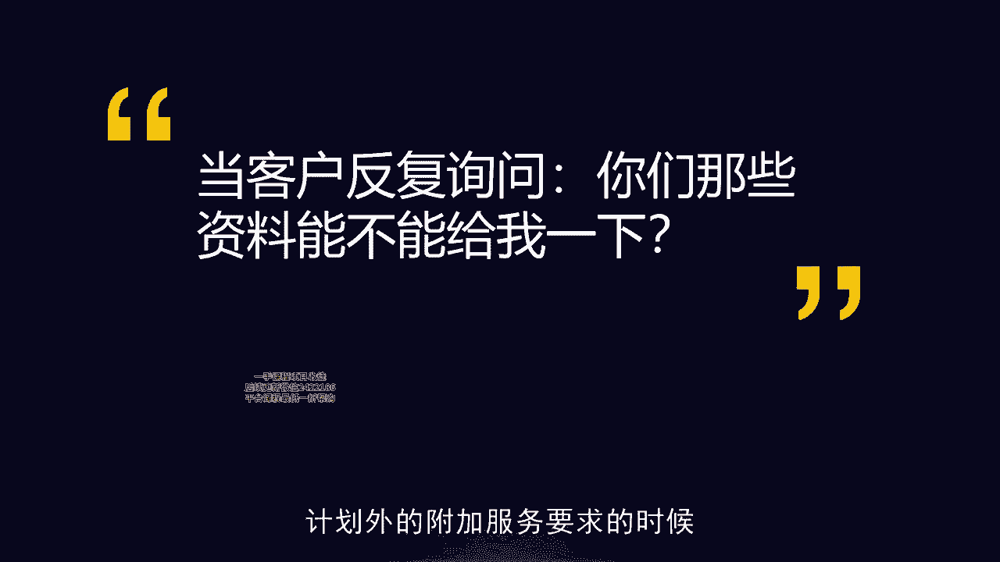
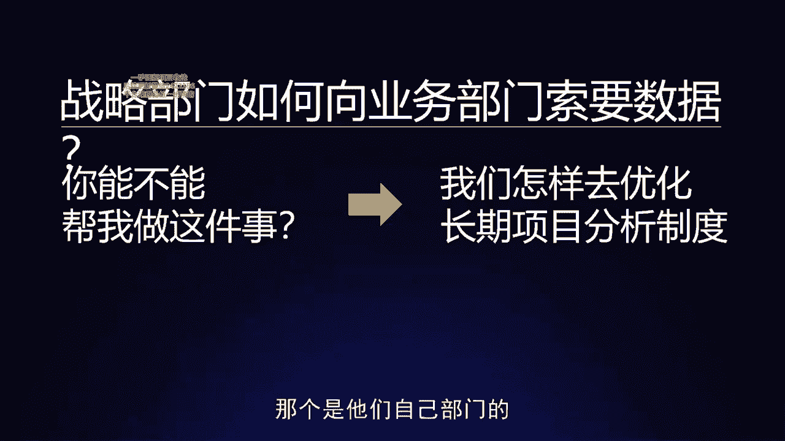
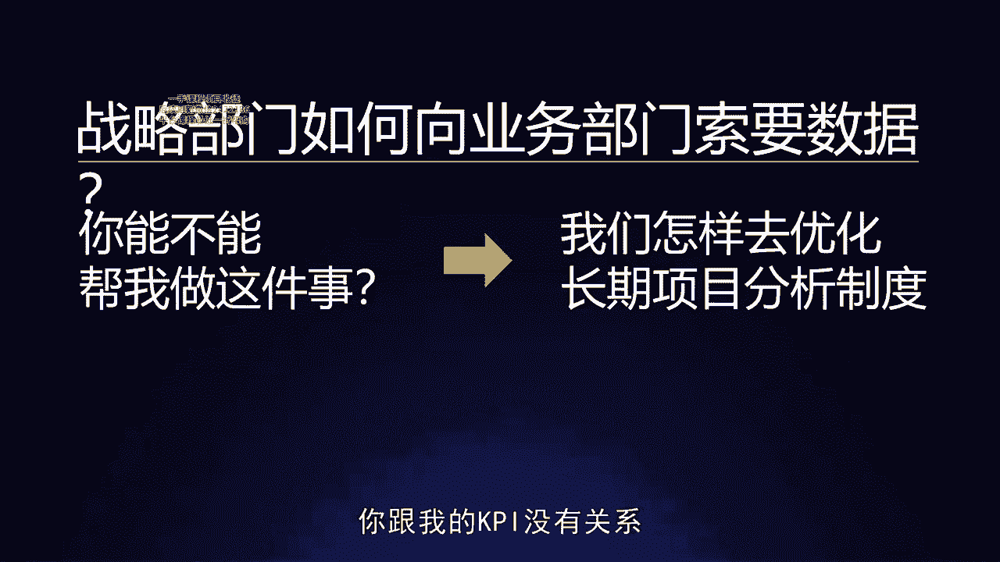
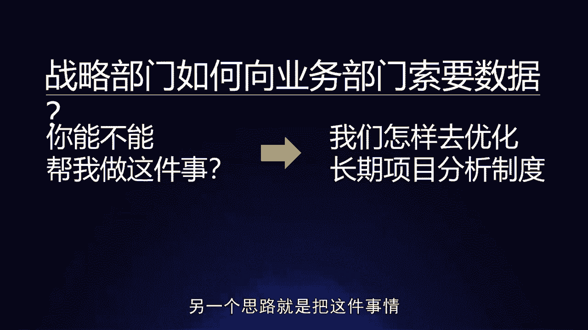

# 梁秋阳--超级沟通力 - P3：003-03.扩展：框架沟通让你在沟通中拥有更多选项 - 清晖Amy - BV1xFtWeuEao

Hello，你好，我是秋阳，欢迎回到我们超级沟通力训练营，今天的课程呢，我们会继续聊关于增量思维，怎么样在沟通当中打开局面，打开你的思路，我们之前聊过，当我们感觉信息不够的时候，怎么样能够听到更多东西。

当我们感觉这个沟通陷入死局的时候，我们怎么样能够引导到一个，有建设性的方向上去，而今天我们要聊的是，当我们感觉到一个沟通陷入了两难啊，我怎么说都不对的时候，如何通过一个核心观念，只需要一个核心观念。

就可以让我们从此告别所有沟通中的两难。

不会再出现让你觉得很难说话，不知道怎么表态的情况，场景或者是人，比如说我们在会议上被表扬，结果呢有一个同事阴阳怪气的，虽然你说哎呀，恭喜呀，秋阳啊，老板这样夸你，中午，不然请大家出去吃个饭呗。

我们通常每个人在生活，在职场都遇到过这种尴尬的情况，这个尴尬之处还未必是这件事情有多严重，而是这个时候你怎么说都不对，你想想看你被表扬了，同事阴阳怪气，让你吃个饭，你答应了吧，第一凭什么呀。

凭什么被他得逞了呀，我这这么点小事，我就得请大家吃顿饭，我多亏啊，第二这样显得你自己也特别的做作，对不对，明明就是一件特别简单的事情，特别轻的事情，就领导夸了你几句哎，结果你煞有介事的。

还真的请大家吃个饭，所有人都会在暗中嘀咕，你说哎这秋阳是不是没被夸过呀，这还真能作对吧，可是呢你要是拒绝他也很奇怪，因为吃个饭也不是什么大事，你连这个都不答应，总感觉好像你这个人特别小气。

非常多的朋友遇到这种情况，我问你们，你们是怎么处理的，基本上大家都是啊硬着头皮硬过去，这就假装没听到啊，我假装拒绝，假装吃个饭，然后当他没发生，可是这个时候你就会觉得，非常的不舒服和不满足。

就是这明明是一个好事，结果就因为出现了这样一个，看上去很尴尬的情况，然后呢，而我怎么做都只能让它变成一个，最多就是不扣分，但是很难有什么好事的事情，遇到类似这样的沟通场景，我们应该怎么去沟通。

遇到这种两难的时候，怎么去沟通啊，到底应该选A还是选B，应该更积极一点还是更消极一点呢，来今天要跟大家讲的一个核心的观念，就是面对任何两难的沟通场景的时候，你要做的都不是在两难当中选一个。

而是你要想办法把这个两难的选项给扩充，让它不只有这两个选项，你才能解决这个问题，比如说比如说像刚才这个场景，我在会议上被表扬，同事阴阳怪气，哎呀恭喜，中午请大家出去吃个饭，我说好也不对，我说拒绝也不对。

那怎么办呢，你可以换一个思路，给出自己第三个选项，比如说你可以说哈哈哈哈，你这个主意倒是提醒我了啊，那不然呢，咱们多拉上几个部门同事一起定个规矩，因为之前也有很多人被老板表扬过嘛。

每次开会老板总得表扬几个人，那之后老板表扬谁啊，我们谁就请当天的午饭，正好让大家把想吃没吃成的餐厅列出来啊。

我们可以一起学，你会发现这一段话，不排除那个阴阳怪气的同事继续杠你的可能，可是当你这么说的时候，你既没有答应，也没有拒绝，而是给出了第三个选项，叫做我们可以把这件事情搞得更大嘛对吧。

我们可以把这件事情变成一个制度，把它变成一个制度的好处就是第一，就算最后大家真的答应了，要建立这个制度啊，建立这么一个同事之间的潜在的规矩，那也是大家都认可的，那我这个时候再请大家示范，就是照规矩办事。

就不是我在装，对不对，而如果这个时候你拒绝了，你觉得这事太麻烦了，大家都没兴趣，那说明大家也不认为一定应该有这么一个规矩，叫做谁被表扬了，谁就吃饭，被老板表扬也不是那么严重的事情啊。

那这个时候拒绝的就不是我，而是你们，是你们觉得这事不那么重要，所以你会发现一个在原有的两难场景的情况下，你怎么表态都不得体，都不是很对劲的一个状态，而这个沟通只要你能够把它的这个范围，这个框架给扩大。

你就会拥有更多的选项，当然我必须要失望，万一这个时候大家真的非常想吃饭，那你也要接受，那说明这件事情呢就是顺应民意，如果大家真的不愿意做这件事情呢，也没有人会觉得你小气，因为你会发现这是他们不愿意好。

而做到这一步，想出这种解决问题的思路，在两难场景当中找出第三种选择的方法，特别简单，就是学会扩展这个讨论的框架，在一个框架内难以沟通的事情，在更大的框架内，你就会拥有更多的选择，什么叫扩展框架。

我们原始的框架叫做今天要不要请客，这是一件小事，由于它是一件太小的事情，所以你只有两个选项，叫做请客或者不请客，可是如果你懂得把这个框架扩展大，我们把今天是不是请客啊。

扩展成我们以后是不是都要定这么一个规矩，叫做以后谁被老板夸了，我们谁就请啊，这个部门内的其他小伙伴吃饭啊，定了一个这样的小制度，一个我们基层的小默契，把这个框架扩展了，把事儿闹大了。

你会发现你的选项就多了，比如说你就要回答谁去召集大家。

以及如何确定餐厅这个规则合理，还是不合理。

最后是不是这一次就要制定，你会发现每一个节点上咱们都可以讨论，也都可以选择，其他同事也有了选择的机会，所以很多时候事情越小，反而越容易陷入两难，事情越大，你的选项反而会越多，再比如，我一个做销售的学员。

给我分享了一个特别有意思的案例，他说他们销售啊在卖出去之后，跟客户的关系都是一件很微妙的事情，当客户反复的提出一些计划外的附加。

服务要求的时候，这个时候呢你会有一个麻烦，叫做你如果答应了他，这就是个无底洞，对不对，你是卖课程的客户，反复问你要资料，你是卖保险的客户，反复向你请教对吧，您是卖产品的客户。

反复为你要之后的赠品或者新研发产品的样品，你要是答应了，这就是个无底洞，因为你答应了一次，就会有无数次，他后面就会说，那这次跟前面为有什么不同呢，为什么之前能给我，这次不能给我呢，对不对。

这个就是零次和无数次的差别，可是你要是拒绝呢也不太对劲，就显得非常的不近人情，而且很失礼，对不对，很功利，那成交钱呃，态度非常好，成交后那客户就说哼你现在收到尾款了是吧，我提的要求你就不当回事。

通常情况下，从企业管理的角度和客户运营的角度，我们会诉诸规则，对不对，就是我们会制定一个运营的规范啊，守则有些东西能给，有些东西不能给，可是这个是站在全局的角度来说，一个企业是可以这么倡导的。

但是我们每一个销售，我们面对的是具体的客户，那个人每个客户都认为自己是特殊的，对不对，所以很多时候你真的要解决这个问题，还是得靠一对一的沟通，那我问大家，这个时候你要怎么扩展当前这个框架。

怎么样能够跳出给不合适，不给也不合适，这样一个两难的选项，特别简单，就是把这件事情搞大，客户期待的客户问你的只是一个小问题，叫做你能不能给我这个东西，而我们如果觉得给也不好，不给也不好。

我们就把这件事情给一个更大的定位，叫做我们能不能建立一个长期的合作关系，比如说客户问你要非常多的，后续的新研发产品的样品啊，这个时候你可以问客户非常好，我们公司内有一个规则啊。

只要您能够成为我们的长期测试合作伙伴，那我们当然以后的样品都可以免费给您，而且我还会主动给你提供信息，我们还有定期的活动和各种福利，那当然这个长期的测评合作伙伴，是有相关的义务的。

你需要参与我们的用户调研，你需要定期给我们提交报告，你需要把你现在的需求啊，你不能光是问我问题，让我给你一些答案，你需要把你现在的需求整理出一个输入，让我们也能从你身上学到一些东西。

让我们能从您的身上获得一些，您给我们提供的宝贵的帮助和资料，那在这样的情况下，我们肯定会有更好的合作，而这个时候如果客户真的有诚意的话，他愿意给你这些东西，那你给他更多的福利和服务也是合理的。

而如果而如果他发现这件事情他不愿意做到，那也是他在拒绝你，而不是你在拒绝他，对不对，所以你会发现，当一件事情，当一件事情变得有选项之后，有更多选项之后，它就不像之前的两难处境那么麻烦。

当然这个时候你会说那有些客户就是特别难缠，就像前面有些同事就是特别的尖酸刻薄，特别的阴阳怪气一样，他就是催着你，今天请他吃顿饭，这个客户就是说哎呀我不想搞那么麻烦，我就是希望你们能够啊怎么样。

就是给我这个东西，给我这个额外的服务，给我这个额外的附加值，那行不行呢，这个时候你就会发现诶你就有了退路了，你就可以跟他说，哎我不是不行，可是我们这个东西是有条件的呀对吧，你就找到了第三条选项。

从给和不给以外，你有了一个新的选项叫做有条件的给，而它的前提就是你懂得把这个框架扩大，原本只是客户问销售要一些福利，现在就变成了，你和我们公司能不能够建立一个长期的测评，合作的关系。

OK所以在一个框架内难以沟通的事情，在更大的框架内，你们双方都会拥有更多的选择，不要觉得这个只是在搪塞对方哦，你也给了他更多的选择，不是吗，他原来最多只能选择成为一个占小便宜的客户。

就是我拿到这个东西或者被你拒绝，你现在给了一个更多的选择，叫做他有可能可以付出一点，然后获得更多，当框架变大之后，当格局变大之后，你们的整个沟通会怎么样，会拥有开放性，所有的两难沟通。

造成两难的原因都是因为两个人沟通的双方，彼此都陷入在了原有的那个框架里面，这个框架是封闭的，要么给要么不给，要么拒绝，要么不拒绝，要么接受，要么不接受，当我们懂得，不断地扩展我们的框架和格局的时候。

我们的沟通就会拥有开放性，我们就可以做到更多的事情，我们有更多的选项，我们有更多的事情可以聊对，所以很多时候所谓的两难，都是因为我们没有意识到，我们可以拥有更大的框架和更多的选择。

比如说你不知道怎么拒绝的时候，不要去纠结我是拒绝还是不拒绝，试试看有没有在某种情况下，你不仅不需要拒绝，你还可以给他更多，只要他能够满足某一个条件，OK当我们在提要求的时候。

觉得这个要求对老很容易被对方拒绝，这个时候怎么办，看看有没有可能把整件事情做的更大，这样我们可以要求更多，OK当然对方也可以跟你，在更大的层面上进行讨论，说到这个我深有感触，就是很多人有一个误区。

叫做我向别人提要求的时候，这也是一个沟通嘛，通常情况下都是事情越小越容易成功，对不对，我们总会觉得问别人要一块钱，很容易，问别人要1万块钱，特别的难，可是事实上并不是这个样子，你仔细想想看。

你到街上突然问一个人要一块钱，那个人神经病嘛，除非现在也没有人带纸币对吧，通常情况下别人不会莫名其妙给你一块钱的，别人不给就是不给，不会因为是一块钱就莫名其妙就给你的，反而你问他要1万块钱的时候。

他会在意你背后有没有理由，你问他要1万块钱背后的那个理由，你跟他之间建立朋友的这种可能性，某种合作的基础和前景，反而有可能最后他给你的不是1万块，而是10万块，所以不知道怎么提要求的时候。

担心要求被拒绝的时候，有的时候我们的努力方向，不应该是把要求越变越小，那个只能寄希望于别人的施舍和不在意，对于越是关键的事情，我们要懂得把事情做大，就好比说一个企业的战略部门，如何向业务部门索要数据。

这也是一个真实的案例，通常情况下，业务部门是不愿意公开，自己的数据给后台部门的，因为那个和他们的KPI息息相关，那个是他们自己部门的一个核心的资产。

那一个战略部门，你跟我的KPI没有关系。

我们怎么样才能够让我把数据给你呢，要的少一点吗，你要的再少也是我的数据啊，我凭什么给你呢，那另一个思路就是把这件事情把这个格局扩展。

对原来我只有两个选项，叫做我给你，对我来说没有安全感，我把我的数据给你了，我不给你，听上去不太合适，但是也没办法，可是如果我是请求的那一方，我可以把这件事情扩大，赋予你更多的选项，我们更有可能达成合作。

比如说我们有没有可能有更多的一揽子方法，去优化长期的项目分析制度，有没有一个更全面的合作机制，而所谓的你把数据分享给我们，只是整个合作机制的一部分，这个叫做什么呢，叫做头过身就过。

只要我们的更大的框架是合理的，我们之前想要达到那个小目标，反而就能够借这个机会得以实现，而同学有的时候会问了，那具体我要怎么扩展框架呢，对吧，刚才听肖阳老师，感觉你就是随口说，你就扩展清楚了。

那怎么扩展呢，其实还真的就是随口就很简单，两个思路，第一个叫做如果这个只是手段，那什么才是目的，如果现在我的这个要求只是手段，现在我们两难沟通的这个这个意义和目的，只是手段，那什么是最后真正的目的。

比如说我今天问你要数据，如果要数据只是一个手段，那要数据这件事情，我们要实现的终极目的是什么，把这个东西作为沟通的框架对吧，比如说我要数据，是为了实现我们两个部门的合作。

那我要跟你谈的就不应该是给不给数据的问题，我要跟你谈的是两个部门怎么合作的问题，而这个更大的议题内，我们双方都有更多的选项，第二个思路叫做，如果现在沟通的这件事情只是一个结果，那什么是原因。

OK这件事情只是结果，什么是背后的原因，当什么事情发生之后，这件事情会自然发生，比如说之前我们提到的对，什么时候我会愿意请客，什么时候我会愿意满足客户，您的这个额外的需求。

是当我们已经有了战略合作伙伴关系，当我们团队内已经有了这样一个默契和潜规则，这样一个小规矩的时候，这件事情自然会发生，那我们要聊的其实不是在聊，我要不要给你这个福利，或者我要不要请客吃饭这个小问题。

我们要聊的是我们要不要建立这样一个小规矩，或者是我们要不要和这个客户之间，或者是您愿不愿意和我们公司之间，建立这样一个啊合作的关系，一个长期的关系，所以很多时候，我们之所以会觉得一件事情特别难聊啊。

一方面我们会觉得对方好像只有两个选项，而且他很有可能会倾向于那个，不利于我们的选项，另外一方面我们自己好像只有两个选项，而且这两个选项怎么做都不对劲，往往是因为现在的这个沟通的框架太小了。

事情越大反而更好聊，懂得扩展框架，我们双方都会拥有更多的选择，而这也是增量思维的一个很好的体现，说到这里给大家简单总结一下，增量思维其实带给我们的思路和模式是什么，我举一个简单的例子。

很多朋友会觉得我不太敢敢跟别人打交道，尤其是我在论坛里，我看到了一个很想认识的行业大牛，我不太敢去加他的微信，很多时候，这就是我们不太懂得扩展框架所导致的，你会觉得我加他微信很尴尬，很冒昧。

万一我对他没有用怎么办，这是因为你把你们两个人之间的关系，停留在了一个特别简单的东西，叫做我想加你的微信，你答不答应，可是你有没有想过，你们两个的关系可以是更加丰富，更加开放的。

有可能你也可以有帮到他的事情，有可能这个微信只是彼此的一个广告位之后，他发的每一条朋友圈的信息被你看到之后，可以帮助它传播，也许你给他单纯只是聊天，你没有办法给他提供资讯，但是你可以给他提供反馈。

不要因为自己的水平和地位和资源，暂时不如别人，就感觉到这件事情只是一个单一的一方求助，一方施舍的关系，而他可以有更多更开放的其他的框架，别忘了前面那两条思路叫做，其实我今天加你微信啊。

我们可以实现一些别的目的，以及其实因为一些更重要的原因，你今天应该加我的微信，把沟通的框架在心中扩大之后，你会发现你在沟通当中也会变得更加的从容，因为你意识到，我们每一个人都不止拥有两个选择。

OK那懂得扩展框架，让自己在沟通当中拥有更多选择，也让别人在和你的沟通当中拥有更多选择，这是增量思维的典型应用，了解了扩展框架的两个方法，我们再用两个案例来给大家练习一下，第一假如你是一个老板。

你有一个员工前段时间干的不错，现在在整个团队集体调薪之前，单独找你提，老板能不能提前给我多涨一次薪水啊，这个时候呢你答应当然有点坏规矩，你拒绝又有点打击这个员工的积极性，大多数情况下。

我们确实可能会选拒绝，因为公司的规则比较重要嘛，可是除了这个两个都有可能产生，破坏性效果的方法之外，在这次沟通当中，我们还有没有更多的选项呢，有只要我们思考一下，给他涨薪或者不给他涨薪的目的是什么。

不要光局限在聊接不接受涨薪，而是要聊涨薪这件事情，如果只是个手段，那什么是他的目的呢，他的目的当然是激励团队了，他的目的当然是赏罚分明了，所以这个时候你就会发现，从到底怎样能够起到激励团队的效果来说。

我们会想到很多别的方法，比如说有没有可能有比掌心更好的激励手段呢，所以这个时候我们有了第三个选项，叫做我可以拒绝你，但是给你别的东西，当然这个取决于团队的具体特征，有些团队在打仗中比较在意的是成就感。

那你要给他的是更多的反馈，有些团队在意的是物质满足，那也许除了掌心之外，还有别的形式的物质满足，是可以既不在明面上破坏规矩，又能够激励团队的效果，这是第三种选项，那还有没有第四种选项呢，也有。

那就是有没有可能给了他涨薪，虽然有一点坏规矩，但是还是能够有激励团队的效果，而不让大家感到不服呢，也有比如说我可以附带一些条件，叫做这个季度我给你一些额外的KPI，如果你真的能做到。

或者我设立一个特殊贡献的指标，如果有人能达到这个特殊贡献的关键指标，那给他一笔额外的奖金，我不管这个叫涨薪，无论如何，我们有了第四种手段，叫做附带条件的接受，所以你会发现。

同样看上去一个好像是两难的困境，只要我们懂得把这件事情扩展它的沟通框架，我就会拥有更多的选项，再比如说还有一个案例叫做，我是一个新入职的员工，我入职刚好两个多月，这个时候呢要进行上一个季度的绩效考核。

并且发季度奖金，好巧不巧，他们只有入职三个月才能够参与，我入职两个半月，这是不是太亏了一点点了，这个时候怎么办，我去跟老板谈这件事情吧，我也明确的知道他如果不答应，我显得不近人情，毕竟我就差了几天。

他要是答应了我呢，又坏了规矩，毕竟我差了几天，对不对，对于他来说，这是个两难，我要怎么样能够给他更多的选项呢，也很简单啊，我们可以思考一下，如果我们希望造成的希望得到的是，他愿意让我们接受季度考核。

并且发放季度奖金，哪怕只是按比例发放的这个结果，那这个结果可能是由什么原因造成的，他如果不是为了给我们发奖金，而答应我们的要求，他可能是为了别的什么答应我们的要求吗。

可能是因为别的什么原因接受这件事情吗，当然有，比如说他可能是为了给所有的包括新员工在内，这段阶段性的工作一个针对性的反馈，那我们当然应该参加评估，参加了评估，当然应该有奖金。

再比如他可能是为了团队的士气，以及对于特殊某一些工作，特别突出的新员工的表彰所啊，特事特办啊，这可能是一个原因，不是为了只给我发哦，而是为了整个团队的氛围，这个原因可能会最后导致给我发了。

这个季度奖金的结果，而这两个新的选项对于他来说都是全新的选项，所以你会发现，只要我们懂得啊，问一问自己，如果现在的沟通的这个很难沟通的事情，只是个手段，那什么是目的。

又或者是我想达到的这个两难的结果之一，只是个结果，那什么是原因，你就能够从现有的沟通当中，把你的框架扩展到更大，而如同之前所说的，框架一大，你和对方选项都会变多，两难自然就消失了。

目前为止我们有分享过三条思路，其实都是帮助大家面对不同的沟通困境的时候，怎么样让你的沟通能够有增量，怎么样让他能够不断发展出更多的意义，当你觉得信息有限，你不知道怎么回应的时候。

用四维倾听的技巧能够让你听到更多，当你感觉沟通进入死局，进入非建设性的方向的时候，怎么样用引导技术和两个积极沟通的习惯，让他们走出沟通死局，变得更加有正向的价值，当你感觉到面对两难沟通非常的局限的时候。

试着用扩展框架的观念，让你的沟通保持开放，具体最后要怎么聊，我们之后的工具场景类课程会给大家讲，可是我们可以聊什么，我们可以沟通什么，我们应该往哪个方向去沟通，请大家记住增量思维在沟通当中的作用。

以上是今天的课程。