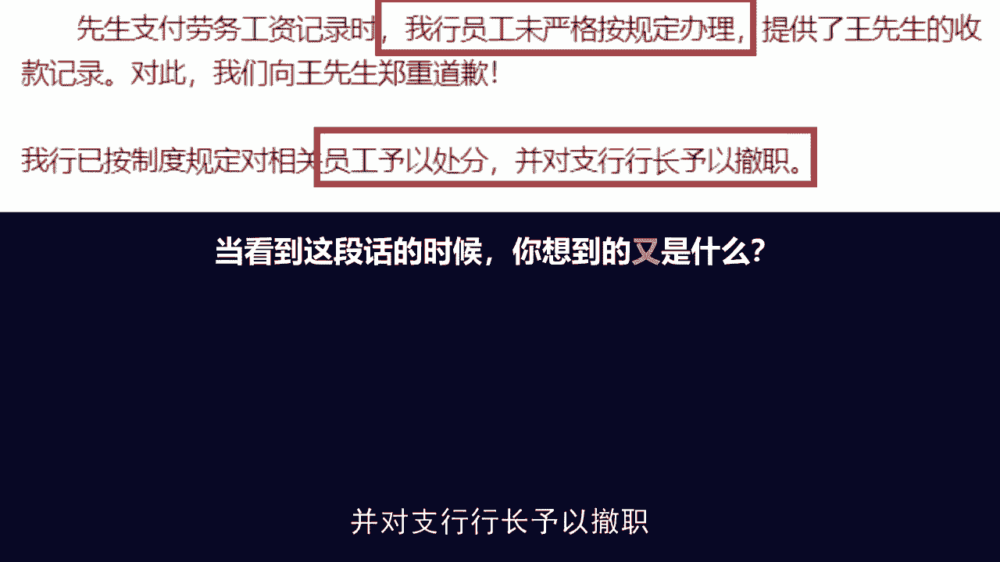

# 梁秋阳--超级沟通力 - P4：004-04.道歉：两个沟通动作，把犯错变成机会 - 清晖Amy - BV1xFtWeuEao

哈喽你好，我是秋阳，用沟通优化关系在职场高歌猛进，欢迎来到我们的超级沟通力训练营，继续学习今天的课程，那在结束了增量思维的学习之后，我们现在进入了更加具体的板块，在未来一段时间呢，我们会一一讨论和分享。

不同的职场场景当中的沟通问题，而首当其冲的第一步就是我们怎么样向上沟通，什么叫向上沟通呢，就是我们怎么样去和我们的上级，通过沟通表达来建立良好的关系，来打造我们的职场靠谱人设。

怎么样成为一个值得信赖的人，怎么样成为一个专业的人，怎么样成为一个让别人愿意帮助你，愿意听取你意见的人，而一开始我们要聊的是一个，很多朋友可能都没有想到的话题，叫做如何道歉。

是的，很多人会说，那向上沟通，你怎么好的不说，专说坏的呢，事实上是因为这个世界上好事不常发生，但是坏事一定会出现，我敢保证各位，你们不一定在职场当中受过大的奖励，或者受过大的表彰。

我们每一个人都需要等待一些特定的机缘，才能有这样的机会，可是做错事的机会永远都不缺，所以很多时候真正能决定我们在职场中下限的，不是看你好的时候有多亮眼，而是看你表现不好的时候，你怎么处理这个危机。

就好像很多的歌手明星都有做得好的时候，但是一次不好的公关危机就会让他们翻车，决定一个人在关系当中沟通下限的，恰恰是你如何处理道歉这样的负面场合，而今天要给大家分享的就是，用三个简单的动作。

让你不用再害怕，犯错之后怎么办，我们先来看一个特别容易想象的场景，叫做有一天我因为和我的同事沟通不及时，结果耽误了一笔非常重要的业务。

领导大发雷霆，把我叫进了他的办公室啊，我不知道大家看到这句话，有没有本能性的产生一些恐惧的反应啊，我自己是有的，因为我这辈子最害怕的就是跟别人产生冲突，尤其是当我自己理亏的时候。

对我是一个特别好面子的人，你让我跟别人聊一件我占理的事，我怎么聊怎么开心，你让我跟别人聊一件我本来就做错的事，我根本不知道要怎么聊，直到啊我研究了沟通和表达，先问问大家，你们看到这种情况。

你们的第一反应是什么，认错吗，当然要认错啊，告诉领导说啊，我会改，我会改，这个承诺肯定是要有的，可是具体怎么做才是一套完整的流程，当对方当你的上级出现了这种火爆脾气，出现了这种责罚你的时候。

你确实做错了事的时候，怎么样应对才是得体的，甚至怎么样应对，反而是有建设性，能帮到你未来的，这是我们今天要讨论的话题，马云在湖畔大学开学的时候讲过一句话，说我们每一个人最需要学习的不是成功，而是失败。

因为成功总是充满偶然，但是失败必有其必然之处，所以他会号召所有的企业家，都讲出自己是怎么应对失败的，而今天要聊的道歉处理三步走，就是告诉大家，当我们沟通当中出现了一些，必须要面对失败的时候。

我们应该用什么样的动作，才能够化腐朽为神奇啊，化干戈为玉帛，这三步是哪三步呢，承担责任，合理化情绪承诺，改变123，按照次序走完这三步就是有效道歉，本人我们一个一个来看。

首先什么叫做承担责任，其实特别好理解，大多数人都会说，我知道我错了，谁还不知道怎么承担责任呢，无非就是承认自己是错的，对不对，可是我这边多加一个字儿，才是我们今天真正要分享给大家的关键。

叫做你要多承担责任，什么意思，非常多的人在遇到错误的时候，都有一个非常不好的习惯，叫做我受多大责骂，取决于我担多大责任，那是不是我告诉大家，这件事里面我的责任小一点，领导就不太容易骂我呢。

比如说刚才那个案例，由于是我和我同事的沟通不及时，一个巴掌拍不响嘛，那肯定不是我一个人的错，他也该负有责任啊，所以我把这事儿讲清楚了，我把权责离定清楚了，是不是反而比较容易让领导消气呢，完全错误。

大家可以想一想，如果你是领导，当你的下属犯错之后，他告诉你说这事其实也不全赖我，您的第一反应是什么，是不是这个人怎么不先想着怎么样承担责任，就先想着怎么推卸责任，而具体你该承担多少责任。

这件事情在一开始是不会有人在意的，所以当我们决定要为一件事情认错，要为一件事情道歉的时候，于情于理，第一步，如果你希望道歉有效，就是多承担责任，这里给大家看一组对照的案例，对于每一个店家来说。

那他们的顾客都是他们的领导，是他们的衣食父母，现在出现在屏幕上的两家道歉声明，来自于两家大家都耳熟能详的企业，只是啊出于控制公关风险，我把他的真实姓名和案件当中的，具体的名字给隐去了。

左边这一家是一家餐饮企业，他们遇到了什么事呢，有一天记者来访的时候，发现他们的厨房里面有老鼠啊，这确实是一个非常非常严重的问题，因为是一个很重大的食品安全事故，而右边是一家银行，也很简单。

是有一位艺人打算从公司离职的时候，发现公司居然非法调走了他的银行流水，而这本应属于个人隐私，原因就是银行配合了公司的非法行为，所以从这个角度上来说，两边儿都犯了各自行业最大忌讳的一件事情。

可是他们的两封道歉声明，由于写法完全不一样，承担责任的态度完全不一样，效果也完全不一样，我给大家标注一下重点，左边这家餐饮行业说了什么呢，看他的第五点，第六点，他说我们这家餐饮啊，连锁机构。

海外的门店都要依据当地法律法规，同步进行严查整改，责任人是公司的某个姓狗的董事，以及涉事停业的两家门店的干部和职工，你们无需惊慌，你们只需要按照制度要求进行整改，并承担相应责任就行了，该类事件的发生啊。

更多是公司深层次的管理问题，主要责任由公司董事会承担，我问大家，你看到这句话的时候，你想到的是什么，别的不说，你是不是觉得这个承认的态度已经到顶了，该承认多少他就承认多少，毕竟他都告诉大家。

这事我不找替罪羊，就是公司董事会的事，可是我们看下一条特别有意思啊，这位先生呢支付劳务工资的记录时，我行员工未按严格规定办理，提供了王先生的收款记录，对此我们向王先生郑重道歉。

我行已按制度规定对相关员工予以处分，并对支行行长予以撤职。

我问你看到这句话的时候，你想到的又是什么呢，老实说你说这两件事情，他的责任，既可以说是公司董事会的深层次制度责任，也可以说是门店员工的个人行为，可是当一家企业愿意多承担责任的时候，我们作为看客。

我们的第一反应都是，可能也许问题没有那么大吧对吧，你们一家这么大的餐饮企业，一两家门店出问题需要罚到董事会投上吗，当然你们愿意罚，我会觉得你态度好，可是如果你真敢告诉大家啊。

这确实就是相关分行员工的个人行为，我们就处理一下支行行长，处理一下员工，且不说我们都是同行弱势群体，同行基层同事的，你这个态度就让人觉得你是在推卸责任，什么意思，每个人在面对沟通的时候都有逆反心理。

当你不停地强调不是我的错的时候，反而引起的结果并不是别人承认这不是你的错，哪怕你说的振振有词，我都会觉得这就是你的错，可是当你说出这都是我的错的时候，他表现出的更多是一个态度，而不是事实。

这意味着不管事实上是不是都是你的错，在态度上你愿意都兜着，而这样一个态度比较容易，让接受你道歉的那个人，开始跟你聊下一阶段的问题，为什么，因为你展现出了跟他对其责任意识的这样一种，基础的意识。

很多时候为什么我们越道歉，对方越火上浇油，大家想想自己在人际关系当中，往往都是因为我们在一开始的认知上不够齐平，你越是找借口，越是解释这件事情本身，越是让对方怀疑你认错的诚意，因为你在意的还是那个事实。

而不是你自己的态度，可是每一个大发雷霆，老板首先要考虑的都是你自己的态度，而在态度问题解决了之后，我们就可以进入第二个步骤，叫做合理化情绪。

什么意思，责任解决的是你的态度和意识，还有对这件事情的认知，有没有到达老板想要的那个层次，而合理化情绪就是你要开始来处理，他的一些火气，他的一些生气，他的一些愤怒，什么叫做情绪呢，请大家记住一件事情。

情绪的本质是道理，不足以描述的东西，很多人会觉得发脾气是很没道理的一件事情啊，没错，就是因为那个人这个时候说不出道理，所以他才会发脾气，你想想你跟别人吵架的时候，如果你是特别占理的那一方。

而且你能够非常清楚地讲出对方到底错在哪，你反而不那么容易发脾气，你可能会有盛怒之下的一两句粗口，一两句爆发性的言论，可是你相对来说更容易显得冷静，谁比较容易发委屈呢，当你委屈的时候。

当你说不出你的道理的时候，就好像你跟你的女朋友约好了要去约会，结果呢你因为工作耽误了迟到一个小时，这个时候他特别容易生气，原因有二，第一是因为你真的迟到了，第二是他说不出什么道理。

因为你去工作听上去是一个太正当的理由了，所以他没什么道理可以骂你，那他怎么办呢，他只能委屈，只能生气，所以怎么样处理老板的情绪，千万不要说我理解您很生气，你很难理解他为什么生气，你要是真能理解。

你一开始就不会做出这些事情，所以不要试图显得你很理解，你只需要尽可能的去承认，帮他把他的情绪合理化，你越是让他觉得我发脾气天经地义，他越是不需要通过发脾气来展现自己的态度，所以你更应该说的是。

以这件事的严重程度来说啊。

您这样的反应一定已经很克制了，我实在是不好意思，当他发现你能够充分的理解他的情绪，背后的那个他自己都没有意识到，要说出来的道理的时候，他的情绪反而可能消失，当然这边插句题外话，正常情况下在职场当中啊。

很少会需要用到这一步，因为但凡位于人上者，尤其是你的老板，尤其是成熟的职场人，都知道，情绪在职场当中是进气，就是你可以用，但是你必须少用，你用的一多就会显得你的表达特别的没有威信。

因为对方会觉得你是一个情绪化的人，周围人会自动降低对于你说出来话的信服程度，可是这也意味着，万一你的老板真的发脾气了，他现在真的很火，这个时候你尤其要做的就是告诉他老板，您发脾气实在是太应该不过了。

然后告诉他，你这做错了，这这这所以他才会发脾气，你完全可以感受得到，这叫什么，这叫做帮助对方把情绪合理化，而你帮他把情绪合理化了，他就有了台阶下，他也有了道理讲，他就不再需要通过情绪来表现自己的态度。

所以什么时候一个人会消息很有意思，除了时间会抹平他的情绪以外，更多的是你能够给他提供一个比情绪更好的，向你展现他的愤怒和失望态度的理由，也就是你帮他合理化这部分道理啊，解决了这两步，我们承担起了责任。

我们消除了情绪，接下来我们就要看第三步，就是如何去承诺改变，什么叫做承诺，改变就是我之前犯了错，对不对，我现在已经把事在情绪上填平了，那这件事情本质上我要怎么去改呢，很简单，就是告诉你的老板。

你打算怎么改，并且做出承诺，大家还记得我们在增量思维中讲到的吗，我们要尽可能的把沟通死局导向，开放性和建设性，如果说承担责任，合理化情绪，这两步是让他从死局中走出来，那我怎么样再迈出去。

再创造出更多的价值，让这次沟通真的变得是有成果的，就是靠承诺改变这一步，但是这一部有非常多的朋友有一个误区叫做，他们很喜欢一句话，我保证下次一定不会再发生这种情况，这句话说的人很安心，听的人很恼火。

为什么，因为如果你下次能保证的话，你这次干嘛去了，你怎么可能保证得了。

没有人可以保证结果，所以当我们在成功改变的时候，请注意一件事，我们叫做承诺动作，承诺过程和承诺代价，比如说有一天因为和同事沟通不及时。

结果耽误了一笔非常重要的业务，领导大发雷霆，这个时候你承诺我下一次一定不这样了，听起来毫无诚意，也毫无可信度，因为没有人可以保证下次一定不这样，你要是能保证你上一次也不会这个样子，所以这个时候你要做的。

你能承诺的改变应该是什么呢，比如说我保证以后遇到这种多人协作的工作，都直接拉群，保证每个步骤我们双方都check double check之后再推进。

这个时候会比刚才可信的多，为什么，因为你承诺的不再是改变一个虚无缥缈的结果，你承诺的是改变一个你确实可以做到的过程，而且给了对方监督你的方法，叫做，我能不能够在之后的每一次多人协作的工作。

都做到这件事情，更好的是你还要告诉对方，你为这件事情愿意付出什么代价，花多少时间付出怎样的资源，OK当你的改变是落实在你自己能够做出来，能够触及到的动作过程和代价上，这个改变的承诺才是值得相信的。

否则承诺结果是这个世界上，最不容易让对方消气，最不容易让这段谈话有建设性的内容，你说一句，他一定怼你一句，就好像前段时间被喷得非常厉害的，美国总统拜登，他在一次会议上看到。

联邦消防局的工资是每小时13美元啊，我必须承认，我之前没有意识到这件事情，实在是太不好意思了，我保证这件事情将在我的任期内结束，可是你会发现外网的网友在看到这句话之后，并没有任何买账的意思，为什么。

因为这样的保证完全不费本钱，只费口水，啥事儿我都可以说，这将在我的任期内结束，可是他怎么结束的呢，我凭什么相信你呢，这是完全没有得到保障的，为什么，因为他只承诺了结果，他没有点出他要做的动作过程和代价。

而与此形成鲜明对比的是什么呢，是在2018年的时候，星巴克有一家门店，针对这样一件事情，星巴克向公众向他的顾客老爷们道歉，他说什么呢，他说首先我坚决反对种族歧视，我们将对此事展开详细调查。

并亲自向涉事黑人道歉，这个叫什么，这个叫多承担责任，我们复习一下前面讲过的，因为当你把这件事情，愿意上升到整个集团的高度的时候，K大家会接受这件事情，是你真的认识到它的重要性，这就好比我们小时候犯的错。

写检讨的时候，总有一些老师喜欢骂人，说你这个检讨不够深刻，什么叫检讨不够深刻，其实就是你愿意多承担责任，你愿意把这件事情上升到一定高度，让对方看到，不管事实如何，你至少有意愿去改错。

有意愿担起这个道歉的责任，其次我们再来看星巴克总部，做出的改变是什么呢，是关停全美的8000家门店，对所有的员工进行反种族主义培训，你说他如果承诺之后，我们再也不会出现这种情况，有人信吗，没有人信。

大家要看到的是你实实在在的行动和代价，事实上这个行动并没有很夸张，因为他们关停全美的8000家门店，也就关停了一个下午，可是它的效果是拔群的，因为所有人都更容易被动作代价和过程所打动。

所以回到一开始我们的案例，因为和同事沟通不及时，结果耽误了一笔非常重要的业务，领导大发雷霆，把你叫进他的办公室，现在你知道像这样的一种聊天局，我们应该怎么来应对了吗。

不是说一句对不起，不是说一句老板我错了，不是说老板不全是我的错，更加不是说老板我保证下一次不会发生，而是你可以分三个步骤来走，首先第一步叫做多承担责任，老板实在对不起，这件事情完完全全是我的问题啊。

至于事实是不是你的问题，相信老板他会有一个英明的决断，等他气消了之后，反而更容易愿意接受这件事情，不全是你的问题啊，我对沟通中的失误估计不足啊，点清自己到底是什么问题，我太相信两个人之间的沟通了。

下次应该用制度性的方法来保证好，解释完第一段，我们来看第二段怎么样消解老板的情绪，老实说这件事情确实非常严重，我都有点没法原谅自己，也辜负了您对我的信任，您发再大的脾气都不为过，我们老实讲。

这个老板对他真的有很大的信任吗，未必可是当你这么一说之后，打蛇随棍上，顺杆往上爬，他也很难直接否认你叫做我，其实根本没有对你有什么信任跟期待对吧，没有老板这么说话的，你愿意这么想。

对于他来说是一个加分项，而这也体现出你完全愿意体谅他，发脾气这件事情，甚至你自己还诚惶诚恐，就算他原谅你，你都没法原谅自己，他不对你发脾气，你都要对自己发脾气，而当你能够把情绪承担到这一步。

把情绪合理化到这一步的时候，反而你对面的人，他会意识到自己已经不再需要发脾气了，因为脾气也是一种工具和手段，他通过发脾气这种工具，这种手段所要达成的目的，无非是让你意识到这件事情的严重性。

而当你表现出你已经充分意识到之后，自然它就会停下来，OK他不是说有某种生理反应，他这么一说突然就消气了，而是在工具的意义上，他已经不再需要发脾气了，好当我们把责任情绪都搞定之后。

我们开始做建设性的承诺改变啊，现在我的想法是，除了赶紧补救以外，我保证以后遇到这种多人协作的工作，都直接拉群，保证每个步骤我们双方都check完之后再推进，每周三下班后，我都会花一个小时来对齐一下。

现在手头那些需要配合的工作，保证尽可能的减少这部分的风险，OK这成功的是什么呢，动作除了补偿之外，我还会拉群以及代价，每周三下班之后，我为了这件事情，这次的错误付出的额外的代价。

叫做我愿意下班之后多花一个小时来对齐一下，手头需要配合的工作，避免这些信息误差之后再出现，然后最后还有一句点睛之笔，叫做我唯一还有点心虚的是，以我的位置想到的这些改进方案会不会不够。

您愿意多给我一些指点吗，什么意思，就是我们都知道沟通，沟通它的本质是一场合作，而不是一场演说，你的道歉不是你的单方面的表演，你的道歉是和你的上级之间的交流，所以当你在讲完自己的想法之后。

你必须要有一个意识，叫做求得对方的参与，而且这对你大有好处，首先第一如果你愿意多承担责任，这个时候你的上级跟你的沟通，多半是他会帮助你理清你真正的责任有多少，第二你提出了一个改进措施。

这个改进措施如果你自顾自的去做，对方未必会买账，可是一旦他愿意出手指点一下你这件事情，他就成为了参与者，成为了你的共谋，不是说你们是错误的共谋，而是他是和你一起补救这个错误的合作者。

如果他都成了你的合作者，他是不是更愿意让你这个错误被补救好啊，所以你必须要努力让你的这个承诺改变的策略，也获得对方的参与和首肯，所以以上三步走完之后，更加高明的还有一个做法叫做扩大战果，扩大这个框架。

百场你单方面的消极认错，变成两个人在共同商量，我们之后怎么可以改进工作，这样三步走下来，再加上增量思维的扩大框架，你是不是发现比单纯的老板我错了，这确实是我俩配合不好，我一定改，然后跪在他面前。

效果要好得多，你是老板，你是不是也更愿意喜欢这样的同事，其实啊老实说犯错每个人都会犯，但是什么样的人在职场中不怕犯错呢，就是你知道怎么样为你的错误赋予意义，当我们在聊怎么样道歉，怎么样在认错的时候。

其实更多的我们是在聊，怎么样能够让这一次的沟通不仅限于犯错，你会发现如果只是认错，根本没有什么可以聊的，这也是很多人不知道，怎么在这种时候跟老板沟通的原因，所以今天的三步走就是告诉大家。

除了一个劲的说对不起，跪一下哭以外，我们还能沟通一些什么，而这些多出来的部分，这些增量才是为这场沟通赋予意义的地方，在职场生涯当中，犯错大概是我们每个人做的最多的一件事情，包括我自己在内，我也经常犯错。

我经常在会议上被马老师骂，被我的合伙人骂，甚至被我们的学员骂对吧，因为没有人在职场中不会犯错，除非你不打算做任何有意义的事情，但凡有尝试都一定会犯错，所以真正懂沟通的人，不是去避免犯错，不是去否认犯错。

不是去害怕犯错，而是用你的沟通，让每一次犯错成为下一次进步的开始，这也是为什么我们要跟大家在一开始的时候，分享关于犯错之后如何道歉这个场景下的内容，因为了解了这个场景，你就会意识到。

连这么极端恶劣的消极议题，我们都能聊出意义来，还有什么不能靠沟通让自己变得更好的呢，以上是今天的课程，如果你学会了的话，不妨回想一下自己以往曾经犯过的最大的错，以及那个时候是如何应对的。

你肯定会发现一两处，自己当时没有考虑到的地方，以及如果你是一位团队的领导，不妨想一想你的下属在给你道歉的时候，是哪一刻让你觉得这个人虽然犯了错，但是你还是愿意培养他，帮助他，在和今天的课程相互印证。

我相信你一定会有更多的收获，我是秋阳。