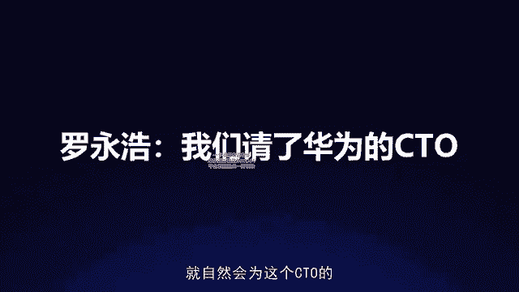
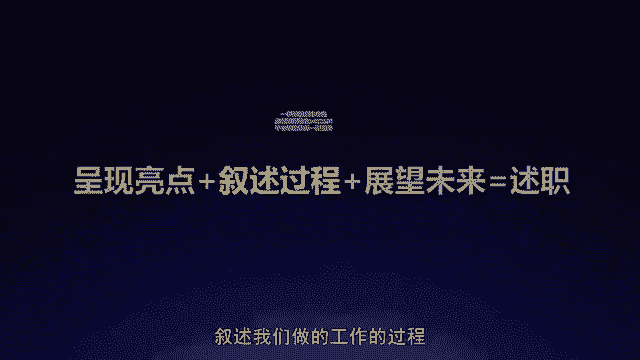

# 梁秋阳--超级沟通力 - P9：009-09.述职呈现：价值表达模板让你的工作成果不被轻视 - 清晖Amy - BV1xFtWeuEao

哈喽你好，我是秋阳，欢迎回到我们超级沟通力训练营，今天的课程学习，让我们继续用沟通优化关系在一起唱高歌猛进，那今天我们要聊的呢是，如何在述职的时候呈现你工作的价值，如何让你的工作成果不被轻视。

让你的数值呈现更加有说服力，更加的清晰，老实说，很多时候在向上沟通的场景里面，我被问到的最多的就是这样一个场景，因为我们都知道，养君千日用军，一时行百里者半90，很多时候事儿我都已经办得7788了。

能不能够让他为我的职业生涯带来帮助，让我获得肯定，有的时候看我在数值之后的呈现，好的数值呈现，我们不要求把五分讲成十分，那个是吹牛，但是它能够让我们的十分更加有质感，可是糟糕的数值呈现。

却也可以帮你充分的帮倒忙，你明明做成了十分，领导听起来只有七分，为了避免这样的惨剧发生，我们要好好的梳理一下数值呈现，具体要怎么做才好，年底的数值怎么样，我才能呈现自己的价值，项目我付出了那么多。

怎么样能被领导看见，怎么样防止项目汇报时候功劳被抢，怎么样数值才能够让别人觉得，我是真的做成了这些事情，我是真的有能力，进而可能在下一季度的重点业务规划当中，让领导愿意把项目交给我，我们一个一个来看。

首先基础思路，数值呈现的三大步骤叫做呈现亮点，叙述过程，展望未来，单看这三个词，大家可能还是不太能够想象，这个公式背后蕴含着怎样的观点，我们拆开来一个一个细讲，首先第一什么叫做呈现亮点。

呈现亮点顾名思义，就是我们把我们做的好的业绩给售给所有人看，每个人都有这样的意识，教徒要把我的优点讲出来，要把我的得意之处讲出来，可是你的得意之处，怎么样能够充分发挥它的好处优势。

说白了怎么样能够让亮点足够亮呢，特别简单，一个东西足够亮，一定是有别的东西衬托的，星星在夜空当中才会发光，你在白天是看不到的，所以你需要找的就像是一个夜空一样的坐标系，让人明白你究竟亮在哪里。

好比说如果你是一个新媒体编辑，你说这一年来我写过几十篇稿子，读者的反应都还挺好的，这完全体现不出你究竟多有水平，为什么呢，因为这里面概念不精确，定位也不明晰，所以你真正需要做的应该是。

把具体的数字的相对意义给讲出来，这一年来我写了50篇稿子，有41篇达到了10万家，有九篇达到了20万家，还有一篇代表作有3000多人转发，这样听起来是OK的，对不对，但是这只有了相对，比刚才好了一点。

还缺一个东西叫做洞察，你有了相对描述，但是还不够，而且你还更缺乏更深的洞察和观点，所以完整的版本应该是用坐标系法则告诉大家，这一年来我写了50篇稿子，如果10万家作为合格线，20万家作为优秀线的话。

我80%的文章在合格线，20%的文章达到了优秀，另外在行业内，一篇文章能有300~400左右的转发，就算是非常成功了，而我写过的一篇文章达到了3000多个转发，你看什么叫做坐标系。

就是你这里面有一个明确的标准和尺度，让大家意识到你做出来的这些业绩，究竟在坐标之上隔了多远，你有多优秀，如果10万家作为合格线，20万家作为优秀线，这就是一个坐标系，在这个坐标系内。

你就是一个80%的文章，合格，20%的文章，优秀的这么一个水平的写手，你就能自然地让领导明白你现在的价值是多少，另外在行业内，一篇文章能有300~400左右的转发，这又是一个坐标系，在这个坐标系之内。

您写过的一篇文章达到了3000多个转发，说明你是普通优秀水平的十倍，这是你的上限，你看有了这样两个坐标系之后，原本你的那个成绩还是你的那个成绩，但是就有一点点化腐朽为神奇，变得更加有分量。

变得更加让人明白这件事情究竟意味着什么了，所以我们在报告的时候，要做到的第一件事情怎样来叙述你的亮点，就是用坐标系原理，因为如果没有坐标系的话，很多时候你很难得到正面的反馈。

你的领导往往不从事具体的业务，他也不会知道你做出这些成绩，背后遭遇了怎样的困难，在这个行业内到底是什么水平，当然你也可以期待你的领导是一个非常懂行，非常智慧的领导，我们是存在这种情况的。

他一听你的业绩数据，就知道你这个人是个什么水平，在行业中是一个什么样的状况，可是第一你只能期待就是把主动权交给了偶然，第二总有一些细节是只有你自己知道，而领导通过他过往的经验未必能够正视的。

所以这个时候，如果你主动的把用来评价你的亮点，用来评价你的价值的坐标系给递上去，是不是就多了一个影响他得出结论，得出正面评价的依据和方式，因此很多时候，如果你觉得你发一个报告给领导。

或者你做完了一个很好的工作，给领导，领导回了个收到回了个，OK你觉得非常挫败的原因，未必是因为他真的不重视你，未必是因为他真的刻意的忽略你，而是因为你那篇文章可能很长，你那份报告可能很复杂。

他点开手机里的文件，一时半会儿根本找不到重点亮点在哪里，他还得一句一句，看完之后才能知道，你是不是就错过了一个当众收获赞扬的机会，也错过了一个在述职当中，让领导快速的给到你的价值的机会。

因此每一份报告每一次数值呈现，如果需要呈现你的价值，哪怕是在非正式场合，请你注意给领导一个评价标准，不仅让他知道你做了这些，更让他知道你做的这些意味着什么，我见过一个很有意思的，很厉害的。

现在已经是某家外企高层的职业经理人，他在早年是怎么让自己获得领导认可的呢，很简单，他会努力地加到大老板的微信，然后在做完一件确实很漂亮的工作之后，把整件事情的前因后果写出来，尤其会突出强调这个工作。

通常人的交付是什么样子，而他的交付是什么样子，业界的标准是什么样子，而他的成果是什么样子，坐标系一有领导知道怎么夸他，这个时候显示选择设置你这条朋友圈，跟大领导相关，他一看到清清楚楚，知道怎么夸你。

发一个大拇指简单评论几句，或者哪怕仅仅点个赞，你的其他直属上司看到了，也就知道这意味着什么，而你想想看，如果你完全不给坐标系的话，他看完你说一堆流水账啊，这人做了这么多事，但是这到底意味着什么呢。

他可能就未必会点赞了，反而会觉得你说话不清不楚，那具体怎么样寻找坐标系呢，特别简单，就是两个思路，一个叫做直接坐标。

另一个叫做间接坐标，什么叫做直接坐标，就是强化差异，这个世界上整体情况是这个样子的，而我做出来的情况是这个样子的，这是整体和我这个局部之间的差别，比如说我们组织这次活动突破了新高度。

不要光讲我们现在的高度，要讲过往的活动，用户平分的平均分，或者是业界通常这类活动的平均分是多少，最高的评分他们拿到过多少，而我这次的活动评分啊是4。78，远高于业界的平均分，甚至还略高于过往的最高分。

是目前为止评分最高的活动，可以考虑作为以后的旗舰活动，这样的对比一出来，是不是就能一下子看出你优越在哪里，以及市面上绝大多数的会销课，转化率在10%到15，而我们这次的会销课转化率高达30%。

因此这是一个值得骄傲的成绩，如果你不突出差别的话，是不是这个30%听上去还不过半，作为一个K12的课销转化课，怎么样能够让他的价值被人所看到，让你作为一个稍长老师的价值被意识到，被快速的洞察和发现。

你必须要用坐标系的方式突出差别，这是第一点，整体这样，我是那样，第二种直接坐标呢也很简单，别人那样，我们这样突出我和他人之间的对比，比如说快手和抖音，当抖音想要告诉用户说啊。

我们的平台跟别人有什么差别的时候，他会说快手重视的是人，而我们重视的是内容，我们不在意主播怎么样，他们能不能赚到钱，我们在意的是能不能把你们需要的内容，推送给你们，这是不是一下子你是一个什么样的状态。

就一目了，然而如果不强调差异的话，单说我们抖音重视内容，听上去就跟一句白开水一样，没有任何味道，为什么有差异才有认知，再比如表达学院，我们特别喜欢强调别人教演讲，很多时候是在教发音和姿势。

而我们是在教观点和思维，因为很多时候你的普通话不标准，你磕磕绊绊，你甚至有大舌头，你很紧张，都不妨碍你可能成为一个出色的讲者，决定一个演讲动不动人的去看他的观点，他的故事，它里面的思想，所以用这种方式。

让你知道我们做的东西有多特别有多有意思，而讲完了别人那样，我们这样，我们看第三个直接坐标叫做过去那样，现在这样突出一个时间上的对比，比如说我们今年啊，累计有196位老师开课，那这个是一个单方面的描述。

怎么样突出它的意义呢，比去年多46位，甚至我们可以说我们是在去年的基础上，增加了近40%，我们的讲师团队，今年累计239门课程是有多少呢，哦比去年多71门，换句话说我们也是增加了超过40%，接近50%。

我们今年累计有200位文案作者，比去年多31位，OK我们增长了接近20%，你看和之前的时间上的对比，一出来就能意识到你究竟进步在哪里，你今年需要修复30多个地方，这个东西到底是进步还是退步呢。

看跟去年比，去年你设计的程序累计出现了180多个bug，对吧，需要debug的地方特别多，那你的进步怎么样，在数据层面上体现出来，需要的是一个对比，也就是我们所谓的直接坐标系。

那直接坐标系是比较好理解的，就是强化差异，强化各种意义上的差异，用差异来拟定这个东西的价值。

还有另一种叫做间接坐标系，它不是靠差异，它是靠相似，它是靠你的某一个特质建立的联想什么呢，要么靠标签，要么靠类比，比如说一位讲师特别的优秀，我要怎么能够让别人意识到他的优秀呢。

间接坐标当中的标签会交给你，选取他身上的某一个明确的强有力的特质，把它凝练成一个大家耳熟能详的标签，这样子就在他的品质，他的实力和大家的已经认知的熟悉事物之间，建立起了一座桥。

这座桥会帮助大家更好地充分地理解它的价值，例如说得到这位老师，我完全不认识他，但是你给他贴上一个标签，叫做托布花和罗胖都喜欢的千挑万选的老师，我就知道，不管他别的实力怎么样，我虽然不太清楚。

但他一定是能够写出逻辑思维那个味儿的，好文案的老师，对不对，我去向他学习，我至少知道了一件事情，我可能可以学到什么样的东西，再比如罗永浩，在2016年的锤子科技发布会上，描述他们的一个人员变动。

这句话非常的简洁，他不会描述这个人以前做过什么事情，这个人未来会做什么事情，这个人具体叫什么名字，他只需要讲一件事情，叫做我们请了华为的CTO，华为的这个科技标签。

就自然会为这个CTO的履历和工作能力背书。

而反过来华为的c to，这整个标签又会为锤子科技的科技含量背书，这就是标签给人带来的认知上的便利，那除了标签之外，还有另一种间接坐标叫做类比，就是我虽然不了解你做成了这件事情，意味着什么。

但是我可以用一个类比来形容，比如说波导手机，手机中的战斗机，我完全不了解波导手机是什么，但是我通过这一句简单的广告语，我就能一下子知道你这个手机的主打卖点，它的产品调性，它可能带给我的品质是什么。

这就是表达的意义，很多时候我们本身产品有多优秀，需要长期的体验，一个人，我自己作为一个职场人，我有多优秀，要让对方充分的明白，也需要长期的相处磨合和合作，但是通过表达。

可以快速让我本身有的品质传递到对方心中，形成印象，就比如之前我们做了一个很好的活动，可是我这个很好的活动，这个工作业绩和成果怎么样，能够快速地深入人心，让我述职的对象，快速的明白。

我做的这个活动的意义和对于公司的意义呢，OK看最后一句话，这个活动可以考虑作为以后的旗舰活动，旗舰，这两个字，一下子就为4。78，这个苍白的数字赋予了意义，原来我只是听到你得了4。78分。

好像很高的样子，现在我知道这个04：78分有一个意义，叫做我们多了一个可以作为旗舰活动的选项，而这就是你为公司创造的价值，这就是在呈现亮点的时候，我们可以不断地通过使用直接坐标系和。

间接坐标系来突出我们已有的工作的价值，就是理性叙事的部分，那除此之外还有没有感性的部分呢，有也就是我们要讲的第二点，我们在做数值呈现的时候。

要尤其注意，不要忘了叙述我们做的工作的过程。

因为很多时候领导不仅想知道你的成绩，也想知道你的工作的过程，你的成绩很多时候代表的是你过去已经完成的，确定的一些数字，一些结果，但是你工作的过程，你用什么样的方式达成这个成绩。

你在这些过程当中的选择和面对的困难，才是更加能说明你这个人是一个什么样的人，很多同事在述职的时候都有一个习惯，可以说是老实，也可以说是诚实，他们会非常务实地，把自己的所有的工作的行动和结果列出来啊。

措施加大销售员维护分销力度，加强销售员与分销粘性，提供更多维护分销的方法成果，分销接待客户数量大幅度提升，成交率上升，措施实施报告制度，重新修改日报内容成果，有效监控销售员日常工作，有效改善纪律问题。

措施鼓励啊，成果啊，广告质量迅速提升等等等等等等等等，这是一个非常专业的做法，但是这未必是一个非常充分和高明的做法，为什么，因为一件事情，它的结果只是一部分，但是很多的信息是藏在它的过程里的。

因此除了用罗列型的叙事，我们还要学会用故事型的叙事，什么意思，我们除了讲清楚这件事情的结果，我们更需要让领导明白他的价值是来自于背后，我们做这件事情的过程，那怎么讲清楚这个过程呢，SCQA法则。

这个法则是个舶来品，这四个字母各自代表一个英文单词，situation指的是环境，complication指的是冲突，question指的是问题，answer指的是答案，那如果英文比较难理解的话。

我们用一个简单的中文来理解它，什么叫S就是得了灰指甲，就是陈述背景，S1个传染俩在这个背景下发生了冲突，C问我怎么办，站在对方的角度提出疑惑，Q马上用亮甲给出解决方案，A啊。

这是一个简简单单四句话说清楚一个过程好，那按照刚才的模板，我们来同样梳理一下之前的工作成果，你会发现完全不一样的感受，今年我负责了公司的T0级项目，这是环境，其实这次项目在进行到一半。

合作方临时要求我们加大供应量，当时的我们遭遇了人员短缺问题，这是冲突，请示领导后，领导立即帮我联系其他部门的经理，共同商议，看看应该怎么办，这是问题，最后及时从其他部门抽调两名同事做外援。

保证了我们项目的进度没有受到影响，这是答案，环境冲突问题答案，你会发现这件事情讲清楚之后，它呈现的不仅是这一个事情的全貌，更是这背后做决定的那个人，为什么，因为彰显一个人特质和一个人才能的。

就是他在不同的环境里面对各种冲突，在解决问题时候提出答案的这整个过程，你想想看，同样是保证这个公司T0级项目没有受到影响，一个懂得向其他领导请示，懂得和其他经理共同协作的人，和自己埋头苦干。

通过超长的工作时间搞定这个项目的人，他们展现出的是两种不同的特质，他们展现出的是两种不同的价值，而你要懂得的是，如何通过背后过程的叙述来让你的领导发现，你不仅做成这件事儿，你还是一个能做成这类事情的人。

这个靠的是背后的叙事，而在数值当中用叙事来补充你前面的理性的，实打实的硬的工作，结论还有两个好处，第一个是故事是天然的记忆装置，很少有人会忘记一段情节，你看刚才我说了那么多措施成果，措施成果。

你现在估计已经忘了，对不对，因为这完全没有任何便于人记忆的内容，可是情节是便于传播和转述的，你怎么向领导请示，领导怎么样回应你的请示，你怎么样和那些别的部门的经理合作，搞定了这个T0级项目。

你曾经心里有过哪些的想法，最后怎么样把他们落实，这样一段情节是便于传播和转述的，你想一想，如果你的领导要跟他的领导请示，能不能提拔你，他总要有一些理由吧，如果那个理由他连记忆都记不住，他要怎么聊天呢。

再其次，故事是更加有说服力的客观素材，很多人会很质疑这件事情，就是我们在述职的时候不是应该用事实说话吗，请注意，我完全不排斥用事实说话，事实当然是必须的基础，在事实的基础之上，为什么我们说故事。

很多时候反而会增加你的说服力呢，特别简单，因为故事因为叙事是不带结论的，我遇到了怎样的困难，遇到这样的冲突，遇到这样的问题，我用怎么样的方式做出哪些选择去解决它，这是一个完全中立的客观素材。

不需要我自己去下结论，由于这是一段故事，不是我自吹自擂的结论，所以呢它不太容易让对方觉得反感和反驳，与此同时，他是把归纳出结论的权利交给了领导，你看这是我做成了这些事情，那我是这么做的。

那至于我是一个怎样的人，我自己当然可以说，但是领导自然会从你的故事当中得出结论，而这个故事是你自己挑选和你自己讲述的，他能得出的自然是能够反映你的真实作为，反映你这个人真实特质的结论。

而这也是你希望看到的结局，不是吗，事实上，故事和叙事本身的好处，在非常多时候都能得到体现，比如说小米在他们十周年给客户做的演讲，给所有用户做的，雷军的那一次演讲里面也是用这个模型，非同寻常的一年。

全球都在面临巨大的疫情挑战，这是什么，这是环境，面对这样的局面，我该怎么办，很多人都心虚，我们也很焦虑，这是冲突，最后我们本来想办一次大的庆典活动，却不知道要不要因此而取消，这是问题啊。

我们的答案是生活需要积极面对，我们需要一些仪式感，所以办一场演讲来纪念这个重要的日子，你听完这一段之后，你不会想要反驳他，因为他从头到尾都是一个，关于雷军的跑步的故事，对不对，是一个关于小米在疫情期间。

做了一个简单的决策的故事，你也不需要从中听出任何的关键词，听出任何的结论，你自然会归纳出这个故事，讲完之后，小米这家公司在你心目当中的形象，品质调性和这个品牌的质感对不对。

而这可能比它1万句slogan，10万句自吹自擂都更能深入你的心里，而在数值当中也是一样的，懂得在有了硬的事实数据打底的基础之上，讲出你背后遇到过的冲突挑战，把整个叙事过程讲全乎了。

你才能够呈现一个完整的你的价值，而最后在这两点过去都讲完之后，我们需要展望未来，说到展望未来，很多朋友会有一点心虚，万一我期待对未来的展望，我做不到怎么办，万一我自己展望未来是给自己挖了坑怎么办。

我说我希望以后我能做到这件事情，最后做不到怎么办，这件事情特别简单，我们只要换一个思路，你觉得如果我们对待业务展望未来，最后自己的能力达不到要求，是在给自己挖坑，那么很简单。

我们可以变成按照自己的能力出发，来倒推我们未来怎么展望，也就是所谓的先射箭后画靶，我们先思考我们自身的能力，在什么样的领域能够有比较好的发挥，在这个业务板块当中，在什么样的方向。

什么样的角度比较有利于我们创造自己的价值，然后再去寻找它跟业务之间的联系，所以先在脑中用自身能力倒推，我们可以展望怎样的未来，然后用第三人称的叙述啊，我认为今天我们的业务的方向发展。

可能会需要什么什么什么东西，而我期待在下一个季度能做到这件事情，我认为我们公司当前的战略的重心，在什么样的方向，而我恰好有一个能力可以满足，我希望在这方面有更大的进步，这就是先射箭后画靶。

为什么有些擅长沟通的人，他们说话总不落空，不是因为他们会预言，而是他们知道怎么样来倒推，而不是顺推，所以以上三个步骤先呈现亮点，这是我们理性的基底，在叙述过程，这是我们感性的升华，最后展望未来。

这是给自己未来拿一个钩子，有更多可以讨论的部分，同时用倒推的方式保证它是我自己能够hold住的，而三步走完就是一次相当充分的数值呈现，这个世界上我们不会说说的比做的更重要，但是我们一定会说。

因为做的那么重要，所以如果因为说不好而让你做得好，被埋没了，才特别的不值当，所以以上三个步骤不是教大家怎么样夸大其词，而是怎么样充分挖掘我们已经创造出的价值，一句话。

别让你的好业绩埋没在一个烂的数值呈现里，这是今天的课程。