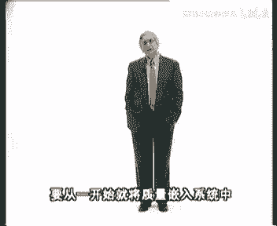
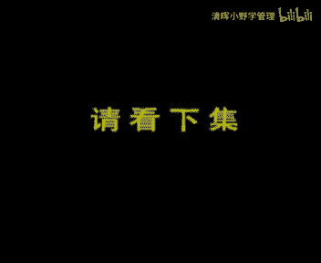

# 欧洲商学院MBA教程，涵盖你想只知道的所有内容，可根据副标题按需观看 - P18：质量管理1A-.动态质量管理 - 清晖小野学管理 - BV1LM411Y79Q

欢迎光临方圆世界帮代表组织的事件在此，一切都是定量的，并且是明确的，源代表客户的世界，温和，注重质量，并且电话不停，过去在生产过程中对于质量控制的少之又少，像地下的建筑被人所遗忘忽视。

仅有极少数的人除外，然而在最近几年中，随着人们逐渐认识到它的重要性，它才从黑暗中显现出来，慢慢地步入正轨，受到公司各层的重视，直到今天备受关注，成为董事会和高级管理层最为关心的问题。

这样的转变不是偶然的，而是一定程度上反映了一种越来越广泛的倾向，人们重新认识到，质量管理作为一种管理包容段，在提高性能，降低成本，获得竞争优势方面能起到巨大的作用，然而这种转变的实现。

必须要抛弃某种悲观的态度，如消极地接受糟糕的存货和物流管理，适度的产品缺陷或最后时刻产品设计的大改动，这类事情不应再被认为是系统或人为因素，不可避免的必然的损害，要想取得真正的进步。

经理们必须丢掉负面的效果，用全新的视角，完全是一个充满挑战的新概念，市场推动机奶奶的，下面我们先对历史做一个简要的位置，in the past过关raft当时有这次这套一定过客，但我知道灯塔的家具时。

它仅仅是将各种部件装配在一起，被标准化，没有更多的关心，因此每一件东西都是手工特制的，而因客户都是附近的人，他们能够帮助控制最终质量，甚至要求改进，当产品进入批量生产时期，装配在口水线上完成。

导致了生产标准的可替换原件的需求，于是质量控制出现了，太有用的方法是把生产者的治疗裁定转嫁到关，通统计手段，测量和检验专家是measurement and testing。

工程技术专家开展工时和动作的研究，规定工序将直接成本确定，每工时在万分之一以下，公益专家计算员工的复刻故障，则由修理机器的维护专家去处理，泰勒主义的研究工时和动作，并科学安排工作任务的理论。

导致建立起大型的远离市场的生产中心，而随着生产标准化和批量生产，为保证大量零件的可替换性，to show the interchangability of parts。

produced in large batches，通过规模经济竞相降低成本，导致了操作人员必然同设计计划人员脱节，sign methods and planning，在这种条件下。

工人这些只以产量为目的的操作者，如何能对质量负责，最初这个任务被分派给管理者，但是当质与量发生冲突的时候，这些人既是队员，又是裁判，也是为了解决这种两难的问题，质量管理部门应运而生。

公主他利用特殊的工具，测量器械和越来越复杂的统计方式进行工作，在这之后，他的职权范围也越来越宽，最初质量控制部门采取这种结构，会议部门领导的职责扩大，同生产或市场部门处于同一管理层。

而且也加入到了管理委员会之中，但质量仍未在公司内部引起足够的重视，质量问题仍被视为是不可避免的，像附加税一样，质量控制的成本必须要得到控制，先不管那些在当今听起来十分恐怖的，检查前的次品率水平。

内部水平在10%到10%的最终质量，检查后的次品水平是1%，而由于所用的抽样方法的局限，和相关的检查或评估成本，同失败成本之间的权衡理论，导致在1%上的任何减少都是困难的。

嗯可接受的质量水平是在失败成本及废料维修，启动质保和评估成本，即检查和质量控制之间进行权衡的结果，当次品率趋于零时，失败成本平缓的下降，但评估成本却急速上升，客户可以接受的价格取决于总成本平衡点。

是通过最小化总成本获得的，在这一点，两种成本相当超过这一点，质量的提高只会增加顾客的成本，这种平衡是，西方世界陷入可接受质量缺陷的矛盾中，有时必须接受和允许一些质量缺陷and manage，很自然。

如果苛求成品率，那么百分之百的检查就是必须的，然而除非各单元的检查都能自动完成，否则就达不到百分之百的，而且需要二次检查，如果最终1%的合格率，被作为行业标准去接受。

其结果必然是整个行业受导致保质成了保障，对质问，perfectly illustrated by the very term quality assurance，那么很显然。

质量控制作为工厂投入的保护性屏障和，产出时的过滤是必须的责任，质量问题必须依靠质管部门独自解决，但我们忽略了这一个事实，即在质量成为问题前，它是一个设计工业流程，生产或营销上的问题。

今天的产品和服务不仅技术和流程日益复杂，其本身日趋复杂，它们的种类繁多，以至于根本无法预测短期内会出现什么。

variety is so wide that is virtually impossible to forecast。

the many options that will be produced over a short period，如果产品和服务相对简单而且合乎标准，那么质量忽略标准线，即原材料和最终产品。

1%的次品率还是可以接受的，实际上多年来，西方工业文化的基础，就是运用统计抽样计划来检查成品的1%，质量平均线，但是这个标准是无法接受的，让我们来看一下下面的例子，它包括十个连续的各不相关的阶段。

第一个操作阶段合格的概率为0。99，次品率为0。01，第二个阶段合格率为0。994频率，0。01等等，and so on，只有当所有操作都顺利完成，发票才是令人满意的，换句话说，一份发票合格的概率是0。

99的十次方，等于0。91，这，就是说次品率为10%，几十张里有一张是错的，这对于客户来说可是个坏消息，现在以一个相当简单的产品玩具为例，假设还有50个零部件，如果每个部件次品率为1%。

我们可以得出产品合格的概率为，0。99的50次方等于0。60，也就是说100个里面有40个要重做，代价如此高昂的工序，最后再拿电视机做个例子，它的零件通常在500到几千之间，为了简单起见。

就算1000个零件，电视机合格的概率为0。99的1000次方，等于0。00004，换句话说，每百万台仅有四台五鼓掌，真是让人吃惊，almost a miracle，在这个例子中。

每台电视我们用n表示部件，用p表示次品概率，n乘以p等于1000x0。01，即每台电视机有十个次品，which works out to be ten her unit，这和汽车第1年质保。

汽车制造商使用的故障计数器，爆出的平均故障数字已经相差不多了，实际上从1980年到现在，西方汽车制造商已将这一数字从五降到了二，很明显，1%文化带来了巨大的检测返修成本。

此外解决问题也绝不能仅仅依靠降低次品率，下面的计算可以说明这一点，1‰次品率的结果，0。999的1000次方，结果是0。37，这只是稍微有点提高，远达不到令人满意的程度。

still not satisfactory，实际上避免失败，唯一的办法是直接以零次品为目标，零失误一的1000次方等于一，这种根本性的变化可以用扩大规模方式来解释，if we move。

我们以百万为单位计算，1%的次品率，对应百万个部件，1万个次品，million parts，我们看到的不再是1%，才是1万没办完，用放大镜放大一万倍，次品率变成了天文数字，我们必须要改变这种情况，啊。

同时在敏感性行业领域，如航空航天或核工业中，为评估保护措施的有效性，并保证其有效实施，人们开始高度重视质量控制，在20世纪60年代，人们认识到质量控制部门的成本在不断增加，他们的态度发生了转变。

质量部门是第一个涉及生产流程，每个环节靠协调质量保障和控制，完成预防性任务的部门，在更名为质量保障部后，他建起了一套系统的方法和程序，有时很繁琐，使得整个系统能够安全运转。

那时候质量部门的结构像这张图表一样，然而质量仍然被视为是质量专家的工作，即使他们越来越频繁地向部门经理汇报请示，尽管质量保障部门在预防协调，保障质量方面起着重要的作用。

稽查的角色常使他陷入进退两难的境地，任何超越职权的尝试，都可能激起执行者和管理者之间的敌对，难以收场，最终管理层认清了自身的质量职责所在，重大的转变发生了quality。

质量成了管理者的domain of management，任何情况下都不能委派哪一专职部门，用克莱门斯的话解释就是，这就像一场战争，非常重要，绝不能单独委托哪些专家，alone。

这个结论引发了另一个问题，如何说服管理者承担这个责任，诀窍在于使用金钱而非技术的语言，换句话说就是向他们证明高质量会降低成本，增加产量，西方公司一直有一种谬误及质量意味着昂贵，他连带着这样一种生产观念。

一种复杂产品比简单产品的成本要高，但如果我们考虑生产和运输环节，并且计算一下劣质成本，抑制成本是把预防成本，检测或评估成本和内部失误成本，质保成本加起来，就会发现这一偏见错得有多大。

这些成本加起来等于公司20%，到30%的年收入，他是你的金矿，这些数字主要是隐性成本，而且是不增加产品价值的工作，例如重复的检查修改，反攻退换减产，积压退货，投诉工厂危机等等。

年收入的20%意味着一个隐形的工程，一个存在又毫无贡献的工厂，一个仅生产事故和次品的工厂，很多公司吃惊地发现有这样的工厂存在。

has been discovered by numerous corporations，much to their surprise，究竟是20%还是30%并不重要。

问题是这足以使管理者和客户们大吃一惊了，接下来的问题是，如何取出这笔潜在的摸不着的押金，他涉及公司上下，而又侧重存在于部门的衔接之处，现在大家必须清楚地知道，解决问题的答案是方向和眼界的。

彻底改变质量的地位，要置于公司的核心位置，质量不是一个问题，它是一个解决方法，一个不断降低成本，保持竞争力的解决方法，设想一下，按常规，如果我们采纳质控部门最初提出的建议。

现在企业的失败成本同评测成本各一半，我们有没有可能超越这种均衡状态，is it possible to get beyond trade off，这种过时的均衡对将评估与失败对应。

可以通过发展第三种状态来超越，预防或学习次品，越早被筛选或预防后续阶段获得的节约就越多，这很容易用下面的例子来证明，假设防止使用次品电阻的成本固定为一，而这个电阻焊在电路板上后，检测和维修成本是20。

要是这个次品仅在最终检测时才被发现，成本就是200，最后如果这个产品在客户手中坏掉，此时的成本很可能是1000，因此只靠提高一个成本做预防，就会减少1000个检测和失败成本，这些数字在服务行业可能更高。

例如一个软件中没有检查出的编写错误，会给客户带来灾难，而找出错误并且更正他的困难太大，以至于要重新编写整个软件，现在我们能够提出论据证明，从情况一向情况二转变时。

为学习或事前控制而付出的巨大投资是必要的，通过将预防成本乘三，你可以将公司的质量总成本除去，还要加上质量差异，这种预防定理适用于全公司上下，让每一位员工都对自己的工作进行控制。

就实现了自上而下的全体参与检测，the，investment，在生产能力，生产控制以及技术和学习方面的投入，有助于防止问题的出现，重建良好的客户供应关系，意味着要杜绝误会的产生，而回到旧有的生产理念上。

简单地考虑问题，必定会导致问题，你可以浪费，不仅是公司的董事和经理们注意到了质量，忽略原理的负面影响，of quality，我们离开方的组织的世界，来到相对轻松的客户的世界，会发现他们也有自己的道理。

他想要的就是承诺的产品，不要麻烦，不要威胁，当公司不能兑现承诺时，客户越来越倾向于通过文字诉讼手段从对抗，而且现在更多的会索取可观的损失赔偿金，消费者协会有权召回不合格的产品。

随着产品标准化程度越来越高，公司必须找出新的有别于他人的方式，来提升形象，搞好同客户间的关系，啊啊啊啊，除了性能之外，还有其他方面，比如舒适性输送以及优质的利物，快捷的领先速度，更低的产品周期成本。

这种产品周期成本或称拥有成本，是指从购买到废弃过程中的成本总和，包括购买推荐使用成本，操作成本，维护成本，在争夺市场份额，提升客户忠诚度的竞赛中，质量是有别于他人的关键要素，甚至超过了价格因素。

日本公司于20世纪60年代，悄然进入外国市场，依靠坚定的实施，以质量可靠性和低成本为基础的策略，日本公司到了70年代已显示出他强大的威胁，and costs initially。

最初他们的威胁仅局限于电视，照相机，手表，录像机，高级音响和电子元件等普通消费品，however，然而到了80年代末，这种趋势扩大到汽车，计算机和精细化工业，我为那些想要了解日本质量发展的人。

总结了一篇文章，赋予本节目的配套手册中，我们短暂的历史已经证明，给予产量，质量检测和成本控制的泰勒式的原则或方法，你跟不上时代，如果我们把质量看成是一个解决问题的方法，而不是一个问题。

那么这种强调产量的系统必须要改变，质量必须放在第一位，当组织中的每个人都参与到预防问题中，搜地球首次将工作做好，质量将会带动产量，这种观念的转变是质量改革的第一步，这是一场内部的革命。

要从一开始就将质量嵌入系统中。

这一阶段的目的是达到规定的要求，并按照对客户的承诺提供商品，这方面的质量问题叫质量一致问题，我们以方块代表工作，因为我们讨论的仍然是组织内的东西，很明显设计与生产是带有明确的量化指标的，方形的内容。

所谓质量一致，逝者按照承诺交付工作不能打折扣，没有次品，没有不足，quality performed to the egiving one hundred，percent。

promise offer of the，promised requirements of the promised square，为了避免折扣质量要从设计抓起，并且在每道后续工序中加以控制。

这种做法不能把它仅仅当成是降低成本的项目，这一阶段的全面质量目标，从刚才提到的情况一转为情况二，并且为了减少未来的监测和失败成本，对预防进行了投资，我们先看一看，这种投资对重复性工序意味着什么。

下面这个是重复性工序的产品得以改进的例子，非常充分的说明了，一定要深刻理解质量，由于数量这个问题，我们找一个简单的重复性的工作，比如在一家大餐馆里做蛋奶酥，在学习和工作改进过程中，你要经历三个阶段。

极富创造性的你在尝试新配方，但由于对这个新工序你不了解，这一阶段你只能靠摸索来检验你的奶酥，你一个接一个的制造并品尝，直到吃到一种满意的为止，客户正在等待，所以你不想花太多的时间和精力。

于是你固定下这种还不错的配方，以及各种标准条件，开始正规的生产，现在你要为最终质检规定产品的特性，例如蛋奶酥的外观和高度，如果产品达不到规定标准，你要么放弃，要么改正生产，我们假设高度对蛋奶酥来说。

是一个很重要的特性，而你95%的产品都达到可接受的，九到11cm，如果正常加工奶昔的高度会呈铃铛型曲线，以理论值10cm为中心均匀变化，会有5%的产品检测不合格。

five percent of the production is thrown away after inspection，我们尽管经过检验，还是无法避免漏掉一些次品卖给客户。

这些劣质产品是由工序中的一些忽视造成的，配方不是最优的，大多数的参数仅仅是粗略设定的，但是你没有时间改进工序了，检测成本和次品就是忽视的代价，在没有很好理解工序问题时，尽管检测似乎是残酷而且一笑的。

但她也是唯一的办法，假设餐馆的生意很好，你必须扩大战场，为了提高产品质量的一致性，并保持餐馆的性，必须为质量预防和改进工具，ok ok ok ok，更科学的方法包括，确定并控制工序中的关键参数。

开始影响生产的参数很多，你可以把它们列在表中，agram，经过分析试验，用不同原料配方或炉子之后，三或四个对结果影响最大的关键参数出现，对这些参数认真的选择和监测，可以有效地减少结果差异。

如果挪威是一个很敏感的因素，这个温度就必须控制在一个精细的变化范围内，控制了所有参数，你的产品在前面所说的可控制标准内的，合格率就会达到百分之百，你取得了零次频率，所有的奶酥的高度都在可以接受的范围内。

尽管不都是最优的，10cm，通过定期的抽样，例如每30分钟检查一次，你就能有效监测产品的质量，确保生产正常，把这些连续的抽样结果汇成控制图，如果他们都保持在规定的界限内，你就可以确定生产运转正常。

if the results，结果和规定值不符合，你必须停止生产，找出导致差异的原因，这种连续的监测生产的方法，又被称为统计过程控制或s p c，利用sp c操作者对于工程的控制和结果的改进，负有责任。

但是也别因一线生产人员负责就高兴得太早，不要忘记质量是建立在公序设计过程中，公式设计合理，从一开始就保证了质量，啊啊啊啊，下一步是自动化以及控制变数和意外问题，为了进一步减少差异和意外。

提高对工序的了解是必要的，变化产生的来源是可以预测和控制的，所以生产规模越来越大时，就应该准备自动化生产，这一步包括控制内部障碍，如磨损和外部障碍，如温度环境以及原材料什么的，for example。

例如你发现因炉温不均匀，卢比四周的蛋奶酥从不，于是你改变配方，增加了一种特殊的原料，奶酥的烤制不受炉温太大的影响，更加的稳定，一旦情况得以控制，不再受外界的影响，工序就可以进入不再受人监管的自动化阶段。

随着控制逐步融入工序当中，劣质成本进一步降低，这个道理很简单，只要投入足够多的精力去尝试，掌握了更科学的工具知识，高质量将带来生产的自动化以及产量的提高，总而言之，要达到质量一致，减少变动。

从根本上要从只对结果和检测的管理，转变为研究工序，控制结果的管理。

