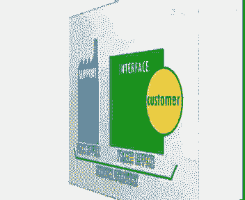
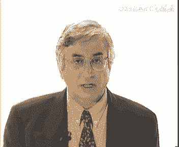

# 欧洲商学院MBA教程，涵盖你想只知道的所有内容，可根据副标题按需观看 - P20：质量管理2-.服务双赢策略 - 清晖小野学管理 - BV1LM411Y79Q

在第一期节目中，我们说明了全面质量是两个层面努力的结果，发布一个世界，他终极的目的是，达到并保持一个必要条件的一致，也就是说，每个人都必须为百分之百地实现传播工作，做到没有刺激，质量上不打折扣。

要想在开放的环境和激烈的竞争中生存，就要不停的革新，实施受市场驱动的动态质量管理，每个人都必须接受这样一个观念，这样就不会封闭在自己的方形世界和舒坦，但闲散的喜欢中，他们必须考虑和预测顾客的想法和需要。

这又原形了代表其难以建立的信，the second effort，则需要根据客户或使用者的需要，不断改进工作系统，换句话说，你的产品或应该涵盖消灭，要提高预测的命中率，在同样价格条件下扩大绿色区域。

but the desires of customers are constantly changing，当然顾客的想法在不停地变，因此你也应随着变化改进。

and perhaps achieve real superiority over，为了营造鲜明的个性，并在竞争中领先，你要不断地创造竞争优势，而内部和外部优势要相互依赖，在公司内部质量保证系统，明。

确，保各工序以及整个系统都处于一种标准状态中，按部就班，其最终目的是使每一个人在第一时间内，都能正确地完成工作，everyone the job，严格的规定和程序，应该不会妨碍亲密或雇员们进行革新。

一旦人们被赋予行动的权利，那么他们会把改进工序简化或重新布置活动。

当成power自己的责任，they will begin to fear responsible for，每一次开机以后，sifying一定要保持这种改进的成果。

重新定义标准，and these new position by reshining standards，保持住这种优势，from this solidly a position。

在此牢固基础上可以开始新一轮发展，动态质量传播的是一种全新的吉普森，他让人们从全局的角度去理解自己的使命，人人都能分享，为了解释这一点，质量第一，顾客是我们所做一切的中心，我们的胜利源自不断的改进。

员工参与是我们的生活方式，供应商和销售商是我们的合作伙伴，永远保持正直，我们在节目中讲述的企业的各，均应该了解这质量的horizontally and cross functionally，一定要。

而且是抽象的，而且和每个人都有关，都可以转变成行动质量，可以量化进步，也能测量，各层次人都可以为他做出贡献，使他不同寻常客户的意见可以反馈到每个车间，每个部门动态质量。

就是要在组织中重建这种the three establishes，a constructive tension throughout the organization，但仅说出远大志向太远远不够。

一个组织怎样说就要怎样做，那如何能成功地实施这种新的规则，很不幸我们没有标准答案，没有秘籍，没有可套用的成功指南，每个组织都要根据自身的需要，走出一条自己的路来，首先我们举三个例子来说明。

为什么质量策略是特殊的，是有条件的，然后我们把一些成功的因素调出来，这些因素能够指导你完成全面质量管理，帮助你更好理解动态质量，为了解释可能的变化，我们选两种产品寿命周期相反的例子，当一个企业的定位。

还处于产品导入和增长的早期阶段时，新产品在市场上的费用很高，这样的例子如摩托罗拉，飞利浦和索尼的公司，对于这些公司创新是关键，他们的创新是由智能强大的小组来管理的，这种情况下，管理动态质量。

就是监管新产品开发各阶段的质量，一个质量计划有必要的有效时间质量，保证特定时期的复查和严格限定的期限安全，很显然，在这种所谓的变动期中，控制时间比控制成本更重要，正如我们在前面节目中提到的。

通过增加样品，通过在潜在问题分析和预防上投入更多的努力，我们既可以缩短开发周期，还可以降低后期的失败成本，必须在，现在你要想了解为什么能取悦顾客时，会发现他们感兴趣的是产品的性能及新颖性。

相反在产品周期的另一端，成熟期的企业生产着大量的标准产品，如特种钢材的制造厂，生产不锈钢和高级合金，在这种所谓的稳定期产品线的速度比较慢，人们更注重标准，对供需的关心多于对生产的关心，在这种情况下。

动态质量管理意味着，利用统计性工具控制法或系统统计研究法，去改进生产工具，那么这时靠什么来取悦顾客呢，不仅仅是质量的一致，还有全面的服务，例如及时送货即可提供如指导，使钢铁在机器上运转的更好的技术基。

举个例子，如果供货商的生产部门按客户要求的尺寸，预先炸制好，刚才在按时交货，那样客户就节省了库存成本，省去了杂志操作和检验运输等等环节，这里是位于上述两个极端例子中，质量工作的安排差别很大。

正如我们所说的，没有现成书本可以照抄，如果看看某些服务行业的情况，这一点就更加明显了，到目前为止，我们着重谈的都是生产方面的生产，一件产品就是一个将原材料转变成产品的过程，而提供一项服务。

则设计客户和供应系统的互相作用，这种作用发生在相互接触的层面上，在前台客户既是你的原料，又是你最终的产品，例如在餐馆，饥肠辘辘的顾客进来，心满意足的顾客出去，在医院生病的人进来，健康的人带出去。

嗯这些互动区域及客户存在的地方，通常要配备供给物资或要素的基础设施，向银行中的办公室和餐馆的厨房。

staurant，事实上我们要注意，无论是生产产品还是提供服务，两种情况下，都有互动区和支持区的存在，当你提供某项服务时，同客户的交易一般在互动区，而生产时则主要发生在支持区，也就是工厂客户不在。

mainly in support，工厂是基本要素，is absent here，the factory is the essential element。

正如我们所见的，互动区域的大小反映着服务的密集度，如何管理工厂的制定，在我们前期节目中以最高的规讨论过，现在我们仔细分析一下互动区的质量管理，首先我们要弄得卡特是physically。

客户以实实在在的存在于互动，屈辱顾客，就是你对他提供服务时要加工的材料，extremely difficult，这种原材料是极难控制，因为不同的客户既要求和期望的变化也很大，此外顾客不是被动，他有反应。

有预期，能提出自己的看法，还可以帮助你提高质量，the customer visit your premises，客户来到你的服务场所，装是技术提供服务的方式，员工的太多，甚至其他客户他都很敏感。

在看了所有这些接触层后，顾客会总体上表达自己的满意程度，i like，我喜欢在这购物，或者是我不喜欢这地方，不想再来了，一个微小的令人不快的地方，足以毁掉整体的感受，沃尔特迪斯尼想要的。

想让顾客在他幻想的世界中，看到的是一幅完美的背景，她每天都去公园游览，确保这幅眉心不受破坏，第二个该强调的是，服务和服务的提供过程不能分割，服务是过程，过程就是服务，服务是不可触摸的，不可存储。

而且每个员工和顾客相互作用的敌军，都是真实的选择，一个制造商能召回或改进一个次品部件，但是你要想召回或更正一次接触或经历，every personal meeting。

every day by every body，每一位员工作的就是经历一个个真实的时刻，这是赢得或失去顾客，公司成立基，由于这种特性。

the researchers and the service ride time to summarize，so far，总结以上所讲很清楚，以布置质量战略的方式，取决于产品在生命周期中的位置。

目前顾客打交道的紧密程度，这些是决定你所选择实施市场驱动的，动态质量管理方法及因素，nevertheless，主要是出一些车子，还是在办公，能够知道你帮助立在艰苦的过程中，更好去理解全面质量。

前面质量不仅是研究和虚拟的，它还可以被应用于整个游戏，为了尽可能生动地解释，一个人的分水泵做类比，我们假设河流代表技术时代的工具或系统，再假设为了提高水平的质量和权限，也安装了一台水泵。

把问题机会优势和劣势抽出来，然后将关公告，one of the main，这个变化过程process，你在一个很困难的问题是，他的射击面太多，每个人每一层都会也都必须采用，其中，如果公司有1万元。

要在一个又一个的阶段中将他们统统考虑，这样将全面质量工序扩展到公司的那一段，连续的减法，我认为这里主要包括三个阶段，并增加项目，第三阶段，二次动车车新年快，这三个阶段，不管你的场景属于什么位置标。

无论由中客户相互作用的影响有多大，他们都现在让我们一个已经进攻，第一步是启动程序，用合作比喻及准备释放，那么什么条件才能使这一步成功呢。

in our previous，we analyze the main reason videos to the total quality in party。

国际精神的international competition，lexity of products，成本质量的集体网等等，我们总是容易忽略一些微小的信号，当危机真正到来的时候。

and wait for the real prices for accepting the need for ch，有时候开明的经历未能说服组织中的其他人，相信即使组织的运转还很顺畅，全面质量也绝对。

但更多的时候是危机感和紧迫感带来的，and allows the new disagree to diffuse，throughout，开动水泵和抽出，以及解除对当前条件的控制，啊啊啊robert。

朋友们的话，他说我们的质量显示是臭气熏天，接下来是性格上成功的第二个，因为所有层面的所有人都非常关注工序的，接受了新的价值观，通过言行一致，证明他们说到做到去说服组织内其他的人。

然后在车间去去教授他们所学的东西，都可以，只要他们都是整体计划的一部分，但这些东西只不过是典礼上的热闹，你总是不能仅听一些声音就能改变什么，你们应该安慰自住的那样行事，因为员工们看的是行动，而非语言。

employee雇员在无法进入战争，在管理上拥有力，员工用自己的实际工作，这需要管理者通过放松管制，通过授权实验形成宽松支持，信任安全感，一种良好的气氛，才能发现那些隐藏的不能创造价值的问题。

可以有效的管理和领导，是能尽快将新的目标将成为现实和实践的，要实现这一切，重要的是，在起始阶段对公司奋斗目标和结果的差异，对系统的实际状况及类比苏的河流，先做一个诊断。

这个阶段能解除辩论过程中的关键区域，实现最终的目标，要从小培制度起，从开展实验性项目，以及能用作演示样本和学习资料的实验开始，之内，其他城市必须对这些失败的项目进行仔细观察，这些项目还是未来进攻的乔治。

选定项目并不是一些决策性的管理小组的责任，他们在选定后还要再负支持的责任，进化的动物，是水泵的马达，他们将是未来指导经典关于改革的，关于委员会的政权，choosing the right。

选择合适的管理者十分重要，the future，未来的管理委员会是由所有同城区的八个，相关学门和分支机构的高层经理组成的，他们也是从死人或事进群，设定早期第一批项目，project teams。

他们需要分配资源，保护进行中的实验，你或许会问，第一批项目选定的标准是什么，这些火车头项目必须是战略性的重大的，但不能是那种几个月无法完成的庞大的项目，the danger here。

已犯的错是太过雄心，不败者，总想已如期看问题，不要忘了我妈一口吞下一头大象，要把猎物分成除以消化的小白，通过几个进展，成龙的项目要求的经验和结果会更加啊啊啊。

最重要的投入是时间，不是技术，记住涉及的部门越多，结果就越有说服力，而且管理人员也准备好了水泵，以市场为导向的质量工具，就该布置到组织中去了，复制质量工具很费时间，因为必须增加组织中的项目和质量活动。

自上而下灌输管理理念和自下而上收集项目，都不是有效的做法，顾客满意度的不断变化，要求所有部门要协同作战，the voices，打破障碍，是顾客的意见融入各户村，这种垂直和水平上的布置总是非常困难。

而且时间比预期的要，总会出现一些没预见到的问题或者危机，或是要对抵触行动及低下的效率进行协调，在这一时间里，管理者必须更努力的去说服大家，所以成功部署工具，并且已经准备挑战牛有关系，引入动态质量概念。

当然他们还必须说，无组织其他成员化解抵触情绪，他们还要花时间利用各种沟通方式，如狂奔协同学召开会议以及培训年后等，传达新的业务和新价值，实验性项目以及第一批试验，并增强经理们的信息，并帮助他们整理信息。

这些成功的项目可以拿来当作宣传，向其他成员证明新质量的价值，他们有利于新知识的传播，并能被当成学习的榜样，因为他们感受到数千后来自下属的威胁，被迫转变领导黄金，在有些情况下。

共同的危机也可以促使人们解决，so da nice to ging with issues，such as，强有力的领导再一次成为重要的因素，我们曾强调过，高层管理者在创建心理安全中的管理者的行为。

在管理工作布置过程中投入的时间，也证明了这一点，这样我们引用80年代，诗歌公司董事长戴维克斯的话，一次一个朋友问戴维，为什么你能忍受这些员工，你为什么直接告诉他们，你想要他们怎么做呢，戴维克斯回答说。

而这让人一点也兴奋不起来，但两岸关键问题一是深刻力气，而是把人调动起来，the management also demonstrated by，资源的重新配置中，还是david vs的话。

资金短缺时能拥有高级的现象，尤其，people watch resource，allocation very very carefully，在青岛员工属相性治疗过程中有参与。

for leading employees towards，the new quity values and encouraging participation，员工会很快发现，双击导弹质量标准。

应在每天的生产活动中予以强调。

管理者应该是花时间达到某个结果，而不能仅强调短期五秒，因为实际的改进，linda的才能开启现在全面提升本地redis的烟雾，而重要职位的分点绩效的评定。

performance crazor promotion and status，are all clear signs of an organization values。

您用组织文化与领导艺术作者爱莉希的话，basic assumptions are reinforcement，criteria of flim promotion，谁实际上会发免造成事件的规矩。

正是您的猜测，culture还有企业文化，通过聘用使自己永远延续，例如在施乐公司高级管理人员的升迁，同他们对质量问题的关注是挂钩的，正如董事长在为格斯所说的，categories由三类很容易分辨的情况。

你可以成为榜样使用，你的手下，也理解质量方面的问题，换句话说你一天就一步，第三类的人必须要去学习，如果高层管理者被评估的结果是需要学习。

which are the things that other than most，after communication moduwe，come to diagnosis，制定质量部署及法时。

要以及部队内部运作体系，内部绩效的调查或者依据，对领域内客户满意度的分析展开，不要忘记质量就是顾客的要求，评测内部运行就是要分析次品水平，生产周期，木村非增值操作等等，金色质量绩效。

就是要分析对于所有要求的满足情况，可靠性，及时送货等等，finally，number of complaints etc，正如霍普教授在工作评测节目中所强调的一样。

it also be necessary to best，motivating class，organizations or processes。

find a good shoes of comparison，比，例如拆开进行对应的机器，弄清及抗分及软硬性的方面情况，我们那样做了好长时间，将所有对手都这样，这只手。

当然其中飞行员杀的比赛过程才是关键，诊断完成后就应该设立远大的目标，例如1980年一届，摩托罗拉将其质量目标设定为，到92年达到k6 习惯导技人，达到六西格玛标准及满足六种标准差的条件是。

次品率已经很低了，需要注意的是，这一目标是针对所有领域设定的，而不仅仅产品质量啊啊马自达，一家日本的汽车制造公司，发起了552运动及减少50%的库存，减少50%的次品生产率，提高20%。

见卡尔森斯卡迪纳维亚航空公司总裁，他的目标是使公司成为北欧最准时的航空公司，他们用的是使用传送带账户，这和行李重复到达行李认领处，处虑到质量工程以及改进项目的多样性，质量严正道战争的计划中。

并and updated jy year，there is no limit on the dynamic aquality improvement，管理委员会起到重要作用，他必须进行整合，作出计划。

并对所有的行动作出反应，正如前文所说，高层管理者也是管理委员会中的成员，他们对工作小组成员的选择和计划，项目的消息要有发言权，而且有时还要参与其中，但不幸的是，在说服各层次人员，相信人们必须做出改变。

应对危机的过程中，在制定远大目标，tended efforts启动阶段，后期好意的改进活动仍有可能会遇到主，一些计划可能再次落空，斯内德失去了动力，the。

chance may returing the traditional distribution of power in the company，那不一定需要准备和培训，不足或者不够。

and the more resistance will be raised，你就是一个接一个认真的操作，部署改进工作的第四部是，将实践中获得的方案转化成有效的结果。

into effective results，我们可以举出四个支持，将尝试变为成果，ins，第一个是行业标准，每个人都应该能够清晰地说出自己的目标，并能理解和评估衡量自己的工作。

正如霍普教授在他的节目也即评估中所说的。

测量过的才能完成，以及你会得到你测量的东西，一旦经过测量。

质量就更有说服力，见卡尔森斯卡迪纳维亚航空公司的总裁曾为此，一个包裹运输时间过长的例子，大家在分析了各部门内部程序，并评估了运输时间后，找到了最严重的瓶颈，那为什么以前没能这样呢，是因为没有人想到。

why not been done before，because no one had ever cared to measure，the total transport time。

管理层的一个基本特征，就是要找出决定性的指标或者标准，首先用它们来维持和控制工序，然后再进行改进，利用标准和控制限制，先解决一些散碎的问题，并巩固工序，然后你可以着手去改进工序，提高限额。

这样一步步去解决一些根深蒂固的毛病，例如佛罗里达电力和照明公司，这是一家经营电气设备的美国公司，为提高服务质量，他们决定平等停电次数，他们的目标是在下1年度，将这一数字降低20%。

像拉绳子一样抓住这个目标，就可能发现需要改进的重要领域，并逐步解决造成停电的一系列根本，one by one，第二个关键因素我们称之为成长的空间，正如运动员很自然地要跑出最快的速度。

音乐家要表演的最完美一样，员工也想提供最好的产品和服务，以满足顾客的需要啊，但为什么他们并不总能成功呢，变异可能行驶环境的不足，他们没有得到足够的培训，或者更糟糕的是，系统根本无法让他们施展学到的东西。

正如赫斯伯格所说的，对那些同客户接触密切的行业三线人员来说，工作上的高度权，但随着试验转化为成果，解决问题的方案得以实施，地域上角色或权力上都有可能发生改变，这些改变带来新的价值，新的行为。

以及you behavior new sponsibility and resistance to change，as she explain，有这种心理安全。

to permit group members to that，the anxiety is the cover examining and changing part of their culture。

当你不再将警戒者拒之门外的时候。

也就将组织里的恐惧挡在了门外，josecurity做的扎，人们觉得他们可以去做而战，那些数据去试验，冒险开除或解聘那些受过培训和指导的员工，当然是重要的资源。

middle managers are seventy a key resu，减少管理层次时，他们会觉得是太极，他们在新岗位上管理的时间少了，而支持的工作，阿曼教练培训或是一线不来支持。

结果他们要么为新工作接受培训，要么他们就被重新安排了，很显然要获得授权并得到发展空间，员工们要接受更多的培训和教育，因为取得权利，但缺乏运营能力，将会导致混乱和灾难，摩托罗拉董事长罗伯特格尔文曾经说过。

在培训和教育方面，管理委员会起着很重要的作用，他们的任务是要分析当前的特殊，确定是否要买些员工，especially following，质量概念和方法。

the employees clearly in both，knowledge of their internal and external customers，the reasons。

why they are doing their job，每个人应该能够评测自身工作的沉默，以及对整个心动，不如，个人能力的发展，例如他们合作融资授权支持很厉害的赛车，他们要分析当前的技术情况。

确定是否应提高专业人员的专业素质和知识，最后管理委员会还要监督人员安排方面，采用的方式方法，例如统计就是个人认为真实数据而已，观点，为什么总要享受些简单的工具，如控制组合排列，因为每个人都能听懂。

成功的成果转化的最后一个因素，是对成果价值的认识和鼓励，他们要是在这个特定的程度范围之外，我想听一下，要将内部和外部部分都包含到认真地城，这种is a permission for好的方法。

when promoting a maintenance manager for example，例如提升一位维修部经理，听听他的下一部门，生产者和他的部署的想法都是好，还有一点要注意。

成功的成功是一个思想的企业，他们之中任意一个为零，整个工作都可能变得毫无意义，我们现在就要讲，全面质量实施的最后一个步骤了，在成功的项目增多后，一定要保持东西进公共，新的企业文化，到这个时候。

我却大多数的围攻应该会很乐意接受，604和失落，和雷向增加的速度，随着质量改革越来越制度化，因为整合进管理系统，管理委员会仅仅如多小机构，就战略计划的制定中包括了持续的改良，对于顾客的需要。

需求和希望也要保持着长期的警惕，溪流的源泉不再有干涸的危险，空海质量不如了心魔哈佛，然而我还是要来，要费时间，有的时候甚至要花上1年的时间，正如最著名的质量专家输出所做的精辟的比喻。

the incubation period for chicken is twenty one days，如果你家人太坏了，它就变成了一个鸡蛋，随着组织变得越来越灵活敏感，新的文化特征可以这样来定。

员工的参与和授权，employees now have a moon sense of，how the efforts pinto the overall organizational。

在进本职工作上更有权威，富有创意的建议应得到认同和组织结构更清晰，更具有学习能力，同时减少了官僚急救的现象，新文化的第二个特征是，不同职能部门的合作及以顾客为导向，顾客的要求被传达给各部。

从一线车间到后勤办公室，导致this is the real establishment of cross sans roberation，这意味着专门化程度的减少，和小组合作的寂寞增多。

新文化的特征还在于专家作用的改变，或方法设计工程师，维修小组等等，专家的作用以越来越多的变位，在预防性基础上组织起来，他们所负责的程序，这样操作人员或服务人员，可以在第一时间内正确的完成工作。

这同旧有的习惯做法相比，是一个大型，where experts to lay down and play the restarts，并扮演着救生员和消防员的角色，而在这种新的稳固的情况下。

管理委员会的根本作用是监督企业文化的改变，review查公司的质量情况，帮助那些表现，那就说明我，总结以上所讲的，最好的办法是，看一下被广泛接受的全面质量管理标准，鲍德里奇国际质量大奖的情况。

嗯这个由1988年以来，每年由美国商业部颁发的奖项，是为了表彰那些在质量成就和管理方面，取得卓越成绩的公司，他效仿1951年起，颁发给质量先进公司的日本大奖，大明奖。

欧洲奖是已经有2年由欧洲质量管理基金会，颁发的类似于bdi奖的奖项，对比一下时间，从1950年的大名奖到1988年的orge，你会发现有趣的是，美国整整迟了37年。

the roots of the american world world has tr，可以追溯到20世纪八，当时全世界和美国，这首为解决生产力下降的问题，组成了一个联盟。

建立总统或商业部门颁发的国家，嗯嗯但不幸的是，商业部长malcolm borderrj，死于一次意外事故中，就以他的名字命名，为加入打击，目前这一奖项，由来自国家标准与技术协会的专家组成的小组。

来监督管理，有鉴定家，the boy之前共有16项，两家工业企业，两家商业组织组合两家小，但是如果评审小组觉得没有合格的候选契约时，检查员和鉴定专家，并不一定要将六个奖项全部翻出。

例如头4年的24个奖中，翻出了12个对border rage奖的回顾，附在本节目首配手册的后面，我的里脊酱还是一本说明书，他们知道他是怎样去做，井边查分为两个监控，首先由评估团团评估水面身体。

能有得奖可能的公司，在接受实地检查，为期近四天实地检查后，after visits the gas long as four days award winners。

are chosen spiderrg，讲的检查，基本上分析的项目每一项都有一定的分数总分，they toscoring one thousand points，尽管大部分奖项的内容和授予。

都有了很大的改进，但为了保持连续性，七大检查内幕仍然保留了下来，我们来迅速浏览一下这几个类别，第一类是高级管理人员的领导能力，在1000分钟的90分。

as coffee reiterated during this program，高级管理人员责任，体现在人事和与质量相关的长期活动，存向目标设定计划，复查项目和去工作一下。

inside and outside the organization in the second qu，信息与分析。

information and analysis is worth eighty points here，the importance of managing quality。

is good data and reliable internal and external information again，appears，鲍德里奇检查出，桥本评估在确保信息可靠性提直行。

standardization and the proper date of information throughout the organization，治疗系统的第三个方面是人力资源的开发。

所占分数高达150分，鲍德里奇侦察团，你要检查公司在公司资源开发，专业方面的人士们以及相应制度，他们也评判公司在维护环境，和调动员工参与上的能力，正如前面所强调的，质量始于教育，也至于教育。

质量系统的最后一类是工具管理和质量保证，在140分，这涉及到企业通过工序设计和管理，将质量融入系统内的方法，也包括控制供应商的过程，正如迈克林德斯教授在采购管理或反向营销，节目中介绍的。

经销商不仅具有营销作用，更能起到战略作用，只有贯彻这种观点，营销职能才能为公司的质量部署做出最大功率，在下面的内容里，我们回顾一下摩托罗拉罗伯格尔文所说的话，他说摩托罗拉最早所犯的错误之一就是。

一开始我们从供应商沟通不足，我们本可以从他们那里学到更多的供应商，清楚怎样去引导顾客，摩托罗拉还希望帮助供销商提高，摩托罗拉通讯部通知他的供应商，他只会继续同那些同意在5年内申请。

鲍德瑞奇养殖公司一起合作，within five years，巴德瑞吉奖评定的第六类是质量和操作成果，占180分，这一类不但要检查产品质量和服务水平，例如规格的一致性，送货及时性，可靠性等等。

还有检查内部操作的成果，例如生产的误差，订货程序以及时间啊，产品制造周期，产品领先期，库存周转成本节约等等，供销商的质量效果就是在这一类中衡量的，borderag讲的最后一类是顾客关注和满意度。

占300分，很显然这是最重要的，不。

顾客的满意是质量管理的最终目的，因此鲍德里奇检查团着重考察，公司对顾客的了解程度，他们的客户服务系统，以及他们在迎合顾客需求上超越对手的能力，为了总结本节目，让大家了解鲍德里奇大奖的评判原则。

我们用几个大奖获得者来做例子，施乐公司拥有5000名员工，获得1989年borderig大奖，我们曾多次引用其首席执行官戴维恩，关于人事管理和领导方面，来让我们列举时的1989，治疗系统的基本特征。

三拥有国际质量改进小组供应商的数量，从4000到，他们依照项目小组方式重组新产品开发的程序，公司的中心明确，将质量从设计阶段开始就整合到生产过程之中，从1985年到1989年值了。

公司投入超过400万人民，以2500万美元进行质量培训，并得到下列的称呼，客户满意度调查，search is increased by，客户服务响应时间缩短了35%，员工流动性降低。

目前比全国水平低了17%，第二个与失乐童年，我报的日子公司是美林肯公司，它是一家有14000员工的私人公司，从事纺织业，他们倡导的改进机会计划，1988年就收到了。

emone dance implemented in nineteen eighty，eight，公司有1600个解决问题小组，还有个顾客，本林粉最终形成了精简的组织结构，节点和重组了几百个管理职位。

减少了60%的质量问题，并极大地提高了按时送货量比例，达到接近99%，最后一个和bdm讲的是一些小公司的例子，弗里斯一家以修顿为基尼的销售公司，为化工和石油企业提供管道阀门和相关的配件。

the company employees，公司的280名员工被称为合作者，而非雇员，所有的人都接受过质量改进工具和方法的培训，所以提供的这种培训平均为每人每年60小时，质量计划和改造项目。

确立了16个质量战略目标和战略目标，又分为若干重点，每个作品都由一个改进小组来负责，每位合作伙伴有权处理，1000美元以下和顾客相关的决定，按时送货，从75%跃升到32%，公司销售量增长了69%。

而市场份额也从10%，das market share increased from ten percent to eighteen，percent，很有趣的事，奥德里奇大奖曾是一些美国管理专家。

争论的主题，management expert，一些批评家指责他的方法论和哲学基础。

其他人则指责那些鲍德里奇大奖的优胜者。

并不是财务上获得成功的公司，这里存在一个误解，即鲍德里奇奖并不希望直接评价财务成果，财务上的成功依赖于许多其他方面的因素，在本期节目中，我们追溯了质量观念的发展。

