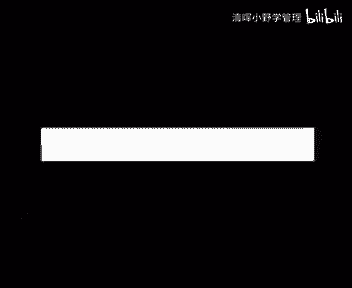

# 欧洲商学院MBA教程，涵盖你想只知道的所有内容，可根据副标题按需观看 - P22：压力管理2A-.成功地实施压力管理 - 清晖小野学管理 - BV1LM411Y79Q

不要放弃，记住一条基本规律，给予支持，更多的心理得到的支持，也使员工变得强大的心理，也是在使自己变得强大，信任他人的经历会得到他人的信任，个人导向预防方是第二个，people as a manager。

客观证据表明，近年来很多公司的工作量大量增加，更少的人正在做更多的事，我们刚刚讨论了，如何帮助员工应付给加大工作量，但压力管理的另一个要点是，注意设定可达到的目标，如果加班成了你公司的一种习惯。

那么这可能预示着你的目标设定会降低生产力，过多的加班会对员工的身体产生影响，另外过多的加班往往会降低成本，因为员工的效率降低了，加班还会使员工与其朋友和家庭的关系，变成间接地影响到适应力。

很多公司没有完全认识到，the voice is important for health of the ocean employee。

but also for the health of the company，所以作为需求方面的第一个因素，我们首先要确定理想的工作量，首先来考虑人们得到的信息量，在一些公司里。

压力是因为员工们得到的信息太少造成的，缺乏信息会造成不确定怀疑和误解，从而导致错误的决策，在另一些公司里，压力被认为员工们得到的书面信息太多而产生，比如大量使用的电子工件，正如在上期节目中所讲的。

如果有足够的放松和恢复时间，我们可以很好地应对压力，甚至是很大的压力，所以重要的不仅是工作量本身，还包括休息一会，特别是在有压力的公司里，心里应该注意给予员工放松和恢复的机会，工作中间的小细午餐时间。

避免因过量工作出差，晚班和周末加班而影响员工在家的恢复，但工作量并不仅是客观工作量的问题，有些工作会要求的更多安全责任，事业压力，工作环境以及在医疗工作中，对于病人的责任。

都会比对钱过人机器的责任产生更大的压力，then the responsibility for money or machines，工程师，律师和经济学家每天都要面对数字，文字和前在领导的岗位上。

他们要与人打交道，处理情感，不理性的行为，直觉和各种关系，他们在做这一行时，没有考虑过这些没有适当的培训，这样的责任对他们来讲会更重，作为经理，你可以影响的第二个需求方面的因素，是团队的控制力和预测力。

这两者的重要性使经理们处于两难的境地，在公司里，我们需要有创造性，处事灵活的，他们需要自由的做决策以发挥，其次他们不在乎因此损失的预测，一方面我们又需要那些有很强预测力量，他们需要被告知做什么。

而不是自己做决策安排，于是授权对那些希望得到控制力的人，但对那些喜欢被告知做什么的人，恐怕没有生意，一般来说，人们越清楚他们在公司或部门里的角色和任务，压力就会越小。

如果员工们不清楚经理的要求和他们的责任，他们就会感到含糊和不确定，由于合并重组，会使短期压力加大，如果这种预测力的缺失成为一种规律，而不是，那么问题将会改变。

rule rather than the exception，矩阵组织研究，这时员工面对两个意见不一的老板，如果该员工按照一个老板的话去做，他就会得罪英明的老板，反之亦然，另一个例子是。

他们不知道该站在哪，对于人们来说，重要的不仅仅是对压力环境的内在或客观的，还有能够影响环境的主观感受，在很多公司我听到的抱怨之一就是，员工们自己决定工作顺序，制定计划并开始工作。

只有对于那些老板关心的即所谓的急事，他们才和老板商量，更糟的是，下属发现老板早在几周前就知道要出问，但一直拖到最后一分钟，解决这种问题的一个方法是，让员工们列出自己的老板的工作顺序。

这样老板可以随时倾注的安排新的一个期限，可能会有激励作用，但是一个接一个的期限会产生很多负面的压力，a lot of negative stress，能够在需求方面做到的。

我们可以发现并没有一个适用于所有公司，所有员工的减低压力的通用单，员工之间总是有差异的，因此几个经理只需具备各种style，以促使整个部门发挥最大效应，一名优秀的足球教练指导。

仅有一个媒体关注的好射手组不成一支好球队，他还需要那些给射手位球的中场队员，和那些名气不大的防守队员，他还知道该给谁压力，该让谁冷静，该朝谁喊来拍去，肩膀，一个人的压力也许是另一个人的轻松。

一个人的不安却是另一个人，卖一个公司的环境也是这样，也不要简单地认为是对压力敏感，甚至是第三方，压力敏感的人，会经常的处于压力下，给人以情感不稳定的印象，但另一方面，他们对意外的变化反应很快。

因而可以在他人的帮助下很容易地调整过来，善于承受压力的人，给人以情感稳定的印象，但他们对意外的变化反应很慢，因此调整起来，也我们再看看别的例子，严格的或追求完美的人，比那些灵活而利于相处的人。

承担着更多的压力，但对于很多工作来说，对压力敏感的人，如果因为他们不能承担压力而不使用它，们，是一个很大的兵力，从某种意义上讲，不能承担压力，是你为他们的能力跟付出的代价，你不能只看到事情的一面。

作为经理为这些人发挥才能创造环境，是你的，you can perform the top level，从另一方面讲，以针对一些人在商界很受欢迎，以至于人们忘掉了他们的缺点，就拿工作狂来说吧。

因为他们看上去能够进行大量的工作，却从不抱怨压力，我们就会忘记他们的缺点，他们的高竞争性使他们更看重最后的结果，而不是过程，你会发现他们不是好的团队成员，会很快感到延迟，不能很好的听音。

并经常打断他人的话，他们在与其中眼中除了胜利者和失败，他们经常轻蔑的对待同事，老板的表扬，对他们来讲，比对其他同事而言。

more to them than that of their colleagues，这种对于表扬的强烈依赖，反映出隐藏在竞争性被动的不确定性，作为经理，您必须正确的引导这些工作朋友们。

对他们不正摔倒或压到别人身上，从压力管理的角度讲，你要了解这些个性的比例，大家需要不同的敲打和激励，你需要这种组合达到理想状态，for an optimate productivity，我们来总结一下。

一个经理会管理压力要做的事情，但即使在理想状态下，你把员工管理的很好，有些人也会出现问题。

在你发现了危险信号时，个人导向的预防方法失效，你需要改动个人导向的补救方法，一个专业的医疗部门或人事部门，可以帮助一个生病的或处在危险边缘的员工，恢复正常，如果他们及时得到了专业咨询或心理治疗。

就可以避免重，但问题是，大多数心理专家的工作，无法与经理去ceo的工作混为一谈，他们更能理解基层的人相处的也更好，所以如果为了保护你的精神，你需要另找专家和治疗中心，对于受害者的公司来说。

重要的是他们要尽快回来工作，让他们呆在家里，并等着他们病愈归来不是好办法，通过妥善的治疗，这些人往往会更加强壮和聪明，下面我们来说说预防性压力管理的合理运用，对于公司的压力管理。

可分为自然方面和社会层面，很多产生压力的自然方面因素都已有一定，你是噪音，热度湿度，化学品，气味等二形态都已经有了相关的光照通风，生物工程，卫生和安全标准，但在公司里可能有非常重要。

但又不为人知的方法来减低压力，提高生产水平，有调查表明，1/4的白领偶尔会出现，下列为，急躁，视力下降，头疼口干，把你倦怠和鼻塞，有趣的是，员工们离开工作场所后，这些问题也随即消失。

办公室综合症是现代工作环境的一个重要环节，现代化的工作场所会影响生活，但在法律上只有违建，大家都知道或感受过建筑和建材对日本危害，但它的危害不仅在于导致疾病的物质污染，很多现代建筑特别是办公区。

往往不适合人们的生理需要，从而影响了人们的身体健康，fundamental and deeply ingrained，千百年来，人们一直住在空气流通的自然界中，人类的机体已经适应了这一环境。

我们的感官接触到危险的气味，噪音和景象后会感到不适，只是在最近我们与自然的接触减少，并开始缩小了这么多，但由于长期养成的习惯，我们的集体还来不及适应现代产品，因此在一个不适的环境里，我们会感到倦怠。

现代建筑使脑力劳动者和他的生理要求，对立起来，我们的机体，于是默默地理解了现在办公楼里的各种型号，比如循环的空气总带着香不同的综合气味，当这种气味没有变化时，你的嗅觉器官，你的头脑没有受到刺激。

机体就认为一切证明，从而使注意力减退而进入睡眠，off to sleep，如果有一种机体不习惯的非自然气味，进入了机体，你将肯定无视，这样在对气味没有任何意识的情况下，你会产生莫名的紧张。

即使在您不知道，我自认为已经适应时，宫颈绿色和自然光的缺乏，也会对适应力和工作产生负面影响，植物灯光颜色鲜艳的热带鱼照片和风景画，只能做部分的弥补，而对于自然光和自然风景的基本要求仍。

你的感官很难会因为办公室里单调的风景声音，温度和气味而感到兴奋，如果你的工作也很难调，你的感官就会渴望刺激，如果环境缺少这样的刺激，我们就会对细微的身体变化或抱怨不敏感，在这样单调的环境里。

一件小事可能变得像被老虎咬了一样严重，轻微的不安可能会被人为的扩大，proportion，我们可能本来并不怕老鼠，但在单调的环境里，老鼠会变得和大象一样，他至少给我们提供了一个，与之对抗或逃避的理想。

另一个需求是要有自己的一块天地，他没有明显的界限，经常由工作区域所划定，如果人们没有私人空间，如果他们需要和他人共用工具，如果他们没有自己放松的时候，如果他们的空间经常被噪音，和他人的谈话所打扰。

如果他人可以随便进出，人们就会感到紧张手，所以如果公司要使用组织导向的压力管理方法，就要非常具体的改善工作环境，stress management approach，在社会性方面。

首先要明白高层管理优先于一般人事管理，这样可以保证每个层次清理选择，从而做好我们讨论过的个人导向预防管理，in the way，we have discussed，如果你真想让压力管理项目。

成为公司成功的动力，就要注意自然和社会两个方面，所以我们接下来谈谈公司压力管理项目的具体，第一步是收集关于公司内压力的来源及后果的，能力数据，你可以通过平常的接触到一些属性，但你也可以使用更正式的方式。

如采访单独路过城组，也让司工作更简单的，在全市范围内发调查问卷来思考这些数据，最好你能够用一些比如缺起事故，个人产出等方面的数字与数据综合起来，并把它们与同行业，其他公司的有关数字进行比较，另一种信息。

特别是关于公司压力产生的后果的信息，会成为公司的医生，从我的经验看，他们对建立压力管理项目大有裨益，同时另一个不太令人高兴，但很有参考价值的信息是，一起或一连串严重的事件，我们的研究表明。

压力管理项目经常是在一个聪明的经理，将一起严重的事件与公司压力联系起来后，and stars in the company，第二步是测试你要找到谁是你的支持者，同盟者和指导，换句话说，谁准备改变。

谁支持谁反对，你要争取得到更多层次人士的支持，因为为了在全公司实行压力管理项目，你需要从上层得到支持并开始实施项目，为了说服他们，你可以举证其他公司成功的案例，我请一位外面的顾问。

你也可以发送上期节目的拷贝，因为事实已经证明，人们在有机会熟悉了压力的问题之后，都很愿意讨论，这是有关的，support a company approach，如果可以开始实施项目。

第一步就要用精确的统计数字取代估算数据，有两种做法，第一种是压力调查，一个全公司范围的调查或高级压力审查，往往可以取得最好的效果，因为这种风险分析师包括了三个层面的信息，及公司各部门和员工个人。

它提供了一套最广泛最完整的数据，但要记住，如果你不能妥善的利用这些调查，会变成追打你，压迫一个悲剧来气，所以在开始之前，你要确认已经满足下列条件，将相信他们的判断，每个员工都比他的老板或老板的老板。

更熟悉自己工作哪里，对结果迅速作出反馈，如果你认为分析节目是上面管理层的事，就不要进行调查，结果行动依据一定要对结果有所预料，并准备根据结果采取行动，得到正确数据的另一个半区，从压力周期入手。

这种办法让人们讨论工作中的压力，并自发地寻求可能的解决方法，you are，可以像组织质量周期一样，这一活动就是说你可以找一组不同的员工，让他们列举压力问题和解决方。

start in terms of possible solutions，这样做可以为解决问题开个好，而且还能听到员工的意见，在进行公司调查前回导，此类活动可以使出调查问卷更具体，你要干嘛。

调查或压力周期的结果应尽快的反馈给整个组，最好反馈结果应被立即处理，并马上开始下一步的，first steps will be taken to improve the situation。

如果小问题可以被迅速解决，人们就会受到鼓舞，并耐心等待，更努力的控制，你的干预可以立即在全公司实施，也可以在某个局部试验成功后，逐渐，下一步是评价，与压力管理培训一样，企业压力管理项目的效果。

可以对员工个人或整个公司来评估，对于整个公司来说，评估包括各种客观指标，如生产缺勤事故及其损坏，个人产量破坏行为和偷盗等，对于个人来讲，你可以使用包括生活与工作质量，工资满意度和压力信号在内的调查问卷。

最好使用与开始使用的相似问卷，来具体的评价效，你的评估结果，可能显示一种总体提高或部分提高，如果是这两种情况之一，你应该继续在管理中推广压力感，比如说将其作为全面质量管理的一部。

你的评估结果显示没有变化甚至恶化，这时要检查一下你的公司或部门是不是有，with a sick company or sick department，记住如果公司真的存在运转问题，预防性压力管理无效。

首先要由专家进行补救干预，来解决管理组织和关系的问题，当我发现几位老总之间的关系不和甚至敌对时，或当我感到高层充满着父母信任时，不会拒绝实施压力，还想在某个公司里，我发现经过好几轮机构重组后。

公司并没有处于非常危险度遍地，但在考虑实施压力管理项目前，必须先要解除经理的用户，我希望本期节目，能够使你不必陷入被迫使用补救方法的境地，上期节目的结论是，对个人来讲，压力不仅是不可避免了。

而且可以是一种主要的动力，对公司来讲也是这样，企业压力管理的目标既不是要避免压力，也不是要消除它，而是防止压力产生负面影响甚至破坏，如果你不能很好地处理，公司或部门里的压力问题。

他就会成为影响生产力的恶魔，如果你能很好地处理公司或部门里的压力问题，压力就会成为你的公司及你个人成功的动力，嗯我能我们能嗯见你一面吗，我们这儿有点问题并不严重。

