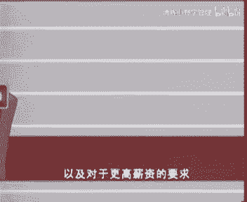

# 欧洲商学院MBA教程，涵盖你想只知道的所有内容，可根据副标题按需观看 - P31：服务的价值与管理要素 - 清晖小野学管理 - BV1LM411Y79Q

嗯啊啊啊啊，从积极参与经济活动的安全，即从劳动人民中，如果是取样，你会发现其中很大一部分在诸如交通，快递或银行之列的服务业工作，distribution or banking，被采访的人也许是建筑师。

doctor师，但是咖啡馆的服务员，汽车修理工，洗衣工，理发师或各大游泳的员工，这些人也是在提供服务，在今天的西方工业社会中，70%甚至更多的人进在线，他们创造的国民生产总值，比重占到了70%。

并且还在增长，1984年离职时，在各个工业领域减少了21000个工作岗位，但是服务业新增加了2万个就业机会，哈佛商学院的教授讲道，成分指数和剑桥服务指数进行了对比，前者由大约30种工业股票组成。

而后者包括了大约同样数量的服务业企业股票，人们发现，即使在证券交易所里，服务业股票的强劲势头也明显超过工业企业，80年代早期以来，在相比，其实这样的国家中，40%以上的外貌是由服务业实现的。

如果你对物业的重要性还是十分幸，考虑一下这个事实，日本人占据优势地位的行业不是汽车或者电子，而是银行业，前十家最大财务机构，有几家是日本的企业，服务业的经济重要性怎么估计都比，然而商业院校和管理学者。

对其都未给予足够的重视，另外由于大部分理论都是针对公有体验的，你好医院冠军联文化机构，如我们现在看到的布鲁塞尔的摩尔皇家戏院，此类服务企业与这些理论并不直接相关，甚至政府部门也帮忙忽略了服务。

也但在我们考虑服务业的问题，管理机会及一些成功的策略之前，我们先必须努力弄明白，究竟服务也意味着意味着是很难嗯，computer，计算机属于工业还是，汽车是工业产品，产品交通设施。

答案取决于人们从生产品，消费者的观点看待这个问题，购车者购买的实际上不是一个硬件，转动的灵活性，车况舒适和操作的安全性，化妆品业的巨无霸，六任有限公司的总裁曾说，我们在工厂里生产化妆品，在商场里销售。

希望这句话同样可以给我们一些启发，在回答电脑汽车，化妆品究竟该如何分类这个问题时，经济学家那种传统的123类产业的划分办法，并没有多少帮助他们将物业定性为第三产业，主要的依据是银行没有交通的行业。

不属于第一或第二产业，他们据此将服务业看成一个综合性的行业，而不是从服务业自身的一些普遍特性来判断，因此从管理的角度看，当我们谈论服务业时，我们面临的不是一个单一的问题。

所以在那些传统上被归为工业企业的行业中，服务的因素也在日益增长，例如比利时的丹特斯马克公司，随着生产线的工作，自动化程度是已知，高，管理方越来越关注，诸多产品和流程设计等准备工作，以及生产后期工作。

如后勤和售后服务，这些都是典型的性活动的，在机械行业，服务活动有时构成了附加值的90%，难怪工业领域的管理人员像对待工业活动一样，关注服务活动，同时使用服务管理或服务行业的管理。

我们更愿意讨论服务经济中的管理，正因为如此，工业企业将目前也学习，就比通常情况下服务企业向工业企业学习，更有服务的两个基本特征，无形性，因为服务是非物质的人物，是我们不能带走的一些行为，而这些行为。

而同时性是因为服务的生产和消费，大体来说是化神的，下图解释了服务的这两种特性，他泰勒斯自称是汽车下方服务中心，很明显他提供的服务是有限的，例如更换一种新型的排气装置，就必须被这种服务。

但say a new exhaust for instance，在传统的修车行情况就完全不同，它的费用中部分包括了诊断故障的劳动成本，这种故障链断具有使客户放心的效果，这种效果是无形的，但始终存在。

每一项服务也意味着提供方便的商品，这种物质因素重要，以至于人们忽视的，这种情况经常发生，人们很少意识到他们正在被服务支付费用，很明显，比如麦当劳这样的快餐店生产消费的。

当时is it a much lower，will lika，freestar restaurant，麦当劳汉堡包中的许多配料都是事先准备好的，而传统课堂教育中的同时性。

就比开放式大学教育的同时性明显得多，such as that offered by video management，呜呜呜，如果我们将两条轴线放在一起，那么传统的工业融资就被你所下脚。

因为最终产品的有效性很高，并且生产和消费的同时性几乎不存在，自动焊接机就是要很好的例子，比如戏剧谣言，无形性成熟的服务，也就是表演是同时生产和消费者，右上角因而包含了服务的一些典型工具，也有服务化的。

我要了解这些后宫的，我现在想指出处于这个位置的公司的管理后果，正如我们已经提得到的这种，越多的更加重要的重要，第一项与产品定义有关，无形性和同时性，有时会使得一项服务产品变得很复杂，难下定义。

也难向顾客说明，一家三星级的饭店提供的绝不仅仅是食物，products公司第二位事物，舒适的内部装修地位，舒适社交环境等等，五中人们通常将这种满足实际需求，比如在餐厅用餐及所谓的核心或实质因素。

和一系列的外围需求区别开，后，一种需求也必须由正在讨论中的服务满足，包括人际接触，安全感，气氛，归属感，环境实际选择，以及我们以后将提到的其他需求，这些需求有实证明比实质性需求更重要，许多成商务舱体。

愿意支付比经济舱贵一倍的价格，也有人会包下一个十分昂贵的足球场包厢，即使他们对这项运动并不十分感兴趣，在某种意义上，复杂的定义对每种产品都是个问题，站在传统的工业领域。

受关注的一般是提供给客户的最终产品，而在服务业，这种最终产品是不存在的，正如我所说的，服务是一种过程，一种正在被生产的产品，这种产品一生产出便便消失了，消失了，服务的提供者。

面对的是有着独特需求的真实的顾客，他们每一个人都有着不同的需求，因此服务也是一个多样化的产品，因为无法给其制定一个统一的标准，服务产品如此复杂，以至于无法通过控制生产过程中的参数来生产。

同样的同样的产品，所以它是很复杂的，我们再回到麦当劳的例子，即便原料相同，温度时间等过程参数也相同，跟测试的汉堡包和纽约的味道仍然不同，仅仅是因为客户群地区，社会接受程度等环境因素有所不同。

第二轮后让管理者投资者是同时进库兹敏，导致控制权的丧失，所有的事情都可以归结为标准的程序和产品，如此可以保证最大限度地控制，在此背景下，教科书上的一个例子是，20世纪20年代的福特公司。

他生产著名的t型车，只要有黑色款式的车，客户就可以购买到任何颜色的这款，与此相反，管理服务行业就远没有这么简单了，另一个技术的因素是复刻管理他们的行为，并且让其适应一个顺利运转组织的。

此外由于服务产品的无形性，及由此引起的瞬间性保持库存是不可能的，因此事先被需求的多样性和不稳定性，做好准备是破坏，在服务生产过程中要考虑这一因素，所有这一切的结果是服务产品的成功实现。

取决于能够临场发挥的员工，仅靠标准化的操作程序是不够的，三个会员随时盯着看，第三个后果是服务，生产过程和客户之间的相互作用，这种作用的方式，往往直接影响顾客对产品的承认，弗里克教授杨志分析了这个过程。

按照他的观点，除了服务中的核心因素，影响客户对服务看法的还有其他七种因素，for a start those the general of the service or sector。

从社会学的角度来说，工业企业的经济活动是相当中立的，然而在服务业中情况就有所不同了，各个服务行业往往有一个事先被认定的名声，而这种名声并不仅仅取决于产品的经济价值，它也和完全社会学角度上的。

肯定和否定价值有关，据说公章的内容在专心目中行，皆为二手车交易盘，也同样如此，for instance to enjoy a positive image，there is a general。

顾客接触的一般totally independent，他们的时候并无关系，即使他们做的是几乎同样的same work，在某些治疗中，相对药房工作人员，患者可能更性感，医生及时。

这位工作人员通过经验或训练和医生同样合格，第三同一行业内的形象也有差异，麦当劳的标语口号，我们为您做的一切是他与竞争对手汉堡王，去年买后者的口号是您自己决定，麦当劳提供现成的产品，顾客无需增加。

而在汉堡王顾客必须自己调配汉堡包，决定若干如何坚，to the customer that determines the way in。

which the his fried in other words，he gets his hamburger，his way，定为企业目标的客户群体也会影响你形象，事实上。

当前的客户在决定未来的顾客群体方面，起了重要作用，呜呜，a fifth theatre is the influence of the。

physical environment of the location in，which the service is delivered，室内布局等等，第六比环境更抽象一些气氛。

很多因素可以共同带来一种平静勤劳，高效合作的气氛，直接与客户打交道的操作，员工和其他岗位是最后一个因素，but there通过自己的态度，行为举止以及钻研技能，这些人对顾客和声音，moreover。

she told me a procedures海量，例如书面文件设备，这些方面的重要性也不能掉以轻心，insert organizations，图形性和同时性，导致了业务管理和营销之间必然相互影响。

在这个度假中心顾客的存在，换句话说，即同时进，使得选择商务场所不仅成为业务管理的问题，又成为你的一马克规模经济公司成本，材料和能源在这里都是必要的，旁边，介绍基础设施如道路水管供电的程度和效率。

在建造这座公园是不是全新，否则这些黄色就会造成几层楼高，而且集中在一起，the customers，客户对于安全和解是主要的考虑，由于产品不行性推广很不容易，但是可以用一些辅助性产品。

如这些房客或一座热带游泳区，事实上，所有这些基础设施构成了红土产品的各个部分，而产品是营销组合中的一项，质量管理也存在同样问题，我们讨论的是多样性的复杂产品，在度假中心要规定出质量标准也是很困难的。

更不用说监控质量了，毕竟最终长期不存在，因而也就没有机会在客户得到产品前，对他进行监控，因为那些产品已经消费掉了，as far as，对员工来说，生产人员维修服务，维修人员都更在客户发生接触。

他们都在销售产品，换句话说，他们的客户导向意识就是产品的他们的态度，着装和仪表将影响顾客对服务的看法，无论服务的内在质量怎样，因此营销将会影响人事制度，就因为营销的任务在于负责查询。

以及企业和客户之间的所有联系，营销和经营管理之间的互相影响也非常，因为在服务业保持库存是不可能的，在工业企业这些库存时，生产和销售脱钩，在服务业啊，想做到这一点，那是不可能的。

如果你面临的需求是和这个度假中心或会计师，事务所面临的季节性需求相同，你无法在淡季把剩余产品储存起来，即便在望京销售，然而可以通过营销来影响需求模式，营销也可以寻找到一个一个互补性的市场。

即使在传统意义上的淡季里，也成功地保持了高度主力，然后他主动联系其他公司或老年群，如果价格轻微下降，这么做将有所帮助营销，因此在经营规划中起了更直接的多的作用，无形性和同时性的之后一系列后果。

关系企业的发展，growth，戴夫物业，人们不能满足于那样的小规模，成功的企业可能会受到他人积极的模仿，同时保护自己免受模仿的手段相对少得多，例如专利就无法申请，这就是为什么银行能很快效仿彼此的产品。

牛仔也是为什么，假日饭店和游乐园大量有限的高音，因为可以魔法，如果你构思一个成功的服务器不模仿的，最好办法是迅速发展过去，这是一种预防性办法，明显意识到这就是为什么他在荷兰，比利时边境迅速发展。

他的度假村在特定的区域，对于特定的单位，导致许多饭店和度假村失去了他们的吸引力，发展经常意味着一致一种特别的服务概念，但要这么做，人们必须能够定义这种概念，说明他为什么能成功，只有只有当产品和生产过程。

能够被标准化控制时，才有可能成功移植这个概念，为此需要一种非个性化产品，也就是一种和企业脱离的产品，企业提供的服务产品可以被看作三种因素的，而每一种因素都被看作三角形的一个点，人称位于三角形的底部。

顶部则是制度，以及一个企业的所有典型组装部分，他们独立存在或位于单个员工的旁边或上方，关于员工有两组特征很鲜明，一专业技能如做出诊断或提出建议的技能，二更多由人际沟通决定的特征，如友好态度，主持策略。

语言技能等，这个三角形强调了服务企业中员工的重要基本，他也清楚地表明了企业的影响和，提供服务的员工影响力的区别，当当人们谈论服务业的产业化，有时也含糊，成为专业画师，人们实际指的是物业员工树的前序。

和企业数目的，这种现象的例子之一是律师，医生等自由职业者协会的出现，他特别表现为从右下角向右上方移动的趋势，客户们认为专业人士的知识是理所当然的，专业人士不得不那么大。

被motto personal skills，the triangle，这个三角形帮助企业定位对付竞争和替代方案，这样一来，麦当劳可能会位于左边这条边靠近上方的位置，这是因为相对员工而言。

麦当劳的服务在更大程度上是由now has meant to do，with expert holmwayin rin upon，影响更多，决定于他们如何实施操作，不过在和客户打交道时。

交际技巧仍然重要，和麦当劳不同，一家三星级的饭店归位于右边，这条边接近底部的位置，classroom and organization，距离上方接近，当长期受到魔法或其原神自己开店，经拉走客户时。

受到的损失越小，企业对于服务概念影响很大，因而顾客的忠诚度更高，的收入证对企业而非提供服务的，the individual who performs，the service。

这是因为这些行业的企业经常被下载，企业离顶角越近，有概率越容易移植，the easy for the concept flanted，and for the organiz。

管理人员不仅要了解服务业的特点，他还要了解一些行业的趋势走向，在我看来，这些趋势对服务业有重要的权，他们既带来了机遇，因为服务业的传统公司，构成了很大的很大的威胁。

for traditional companies，这种威胁不可忽视，第一个也是全球性的趋势是政府管理的减弱，真的服管理尤其适用于服务业，比如航空交通，自由职业，电信银行保险，医疗卫生等等。

这管理的放松，使许多进入许多领域的障碍消失了，此外一口价格或其他因素，竞争的机会也就更多了，一个可能的意思是，通过技术发展，拿破股票经纪人的垄断，每个人通过电脑终端，居证券交易所的一天也许不远了。

第二种趋势是放宽专业组织制定的标准，这里我所考虑的不仅是会计医生律师，还包括大学教育，因其标准放宽的通常是政府改变专业形象，和消费者日益敏锐的，在一家销售眼镜和药物超级市场。

在菜单这打破了腰伤和炎性上的温暖，许多原本是由国家提供的服务，将由个人或企业来提供，越来越多的广播公司正在丧失，他们在欧洲的垄断地被获取了商业网络，分享广播时间，此外计算机自动化和技术创新。

极大地改变了服务业的商业运作方式，考虑一下所有例如银行，图书馆内的服务业，在这些行业中，数据存储和信息的处理或传送是至关重要的，另外受电信和诸如网络的影响，商务旅行的倍数可能会减少，除此之外。

新的服务业也正在出现，比如出租，包括录像带之类的超级俱乐部，几年前他们甚至不怎样，因为这些行业本身只是尚未出现，新的销售渠道也在出现，从现在起，购物可以在家里通过电视屏幕进行了。

每个人现在都可以通过自动银行，进行简单的金融交易，通过连锁经营，这促进了快速发展，在很多行业，特许经营连锁正在替代或吞并那些更小的公司，像喀纳斯这样的面包店工作，各种健康的面貌。

这对个体面包电路构成了严重威胁，就价格来说，一名普通的车行老板在更换汽车排气装置，减震器或刹车上，是无法通凯瑞斯这样的大集团相竞争的，在许多类似行业中，这种趋势也日益明。

另一趋势是作为生产者和客户的租赁业的扩张，people increasingly realize that they can make a pantageous，use of peter。

without actually owning it，进而产生了许多作为中心的中心，出租的通常是七顿，但是人力资源也很不，这种趋势反映在大量的临时雇佣公司，主要原因是人们对生活的reflected。

by a large number of temporary employment officers，第七种趋势是工业企业内部的服务中心，日益对外部市场开发，这主要是受了子公司独立趋势的影响。

一段时间以来，这种现象在信息处理领域也很明显，但是最近在其他领域，如人力资源或广告业也出现了此类现象，美军曾经是不属于飞行员的保护问，但最近几年还被阴影内人员的工作，而且成为一家合法的独立公司。

internationalization，国际化是服务业的第八种知识，和许多传统经济学家看法不同，许多服务性组织意识到服务是可以销售的，婴儿也是可以出口的，想一想，培训财务或咨询业吧，比如理发过餐饮。

这种趋势也在加强，当然影响协同演变的因素，又人们日益增加的流动性，及其技术的冲击和工业化，后者反映在向三角形顶部的towards，the top of the frangle。

最后一个趋势是市场细分和专业化，traditional，传统的服务企业，通常同时针对许多不同市场提供一系列的服务，这种服务往往并不是最优的，因此这些传统的企业很容易受到。

来自那专注于特定市场或产品系列的竞争者，各种各样的甚至很强烈的冲击，考虑一下快捷，在许多国家，他们的价格比相对低廉，同时服务improve of the service，同样的情况也发生在，到目前为止。

我们一直在讨论服务经济中的许多管理问题，以及可以观察到一系列趋势，在接下来我们将举出一些对策，并看看服务经济中一些成功的策略，成功的服务企业明确知道他们销售的是什么，以及服务生产的系统中。

每个人和每件事怎样影响这些产品的质量，不仅如此，他们还把自己的知识传授给员工和他们的客户，换句话说，第一个成功的策略是精确的定义肤色概念，客户的需求构成了偏离点，这是符合逻辑的。

以及不仅是它的实质性需求，还包括它的外围需求，对于服务处理系统中的每个步骤，是否充分利用了对这一点的理解，并进行了研究，我们处于什么行业，或者我们怎样和客户有效沟通，这一点非常明显。

因而是人们在销售课程中学到的第一样东西，但是我们不要忘了，操作人员也将直接和客户打交道，因此他们总是以积极的或消极的方式，对客户的需求做厨房那个位，住院的患者常常担心医院的气氛。

味道既长又不确定的候诊时间，医生难以理解的解释，所有这些没一样，是他关心的一份普通的需求清单，我会觉得以前讨论过的菲菲的计划，以及从顾客角度考虑的简单的流程图解，将对这有所帮助。

这本图鉴经常被应用在工业领域中，其中列出了生产过程的每一个，这样一来就区分开了改变产品的操作，产品的存储点，也能同样制成图表，它包括客户和业务系统的组稿接触，我们将通过一个熟悉的过程来说明这一点。

也就是汽车的修理，这里边没毛病，first，necessary解，如果必要的话，如果故障不严重的话，也可以在休息室等候the。

supervisor lands in the car in the workshe the same to mechanics。

the letter will make a diagnosis on the basis of his own test，信息位置判断故障原因，德随后在车行内部或当地的销售中心，订购要更换的零部件。

并交管理人员检查，如果他宣布出资部分，则必须重新检查故障并修理，同时如今该准备发票，the customer，客户可以在事先约好的时间取车结账，离开后，整个服务过程结束。

by means of the process diagram，and we can now prey the critical analysis of each step。

described put default，what van is each of these steps，contribute to the product in this case。

the service，the making of them is very important，for good italization of costume and for fixing。

人家是很重要的，making the diagnosis，and it's also necessary to determine，precise price and delivery aggre。

一段时间接待三人的数量，it goes without saying that each step，应该有相应，without one could be a limited，在以下这个飞行阶段。

我们问自己是否有些步骤可以合并计算，这些步骤的方式和地点，是否应该增加更多的步骤，有事业心的服务商亲自回应，信函告知客户，这样一来整个程序就增加了两个步骤，一向是在开头进进出提醒性。

另一个是为结束后就通过这种方式，车行可以尽量避免临时性预约，从而可以尽可能高效的利用生产能力，同时一些维修中所需的零部件，也可以根据预约情况及时订购，and accuracy。

同样重要的还有预约的迅速和准确性，女性和冲突替代冲刺一步走到第一步，因为许多客户在预约维修时，就提出了要一辆替补车的要求，休息室的整洁安静，magazine提供杂志，很可能还有咖啡，这些也很重要。

客户离开前最重要的是，我们为哪些客户，and the need to satisfy sufficient in homogenous，我们提供哪些服务，根据服务生产系统的要求。

这些服务组合的一致性如何，这些是考虑市场细分和专业化的主要问题，传统的车行有时机有些难过，有时不怕，事先确定要花多长时间，要用哪些材料，这些工作需要有技巧的员工，他们的昂贵的劳动力成本。

最终要由这些客户来支付，如果所需的材料手头没有，这种心理活，可能会发生很长时间，长时间的等待和高昂，reconcise himself，the long waiting period。

and the high labor costs，我们前面提到的所谓车上的车，不需要有技巧的培训和安慰的设备，服务时间，uncertainty。

how long repair will take this contrast，clean shoes conditional，当涉及到更换废料减震装置或刹车时，传统的车行是难以占据优势的。

在分析生产系统时，美加本部公司都问自己，各种自然型的存在大量矛盾，其他必须考虑的问题包括，如果孔子转向专业化，哪些方面可得到改进，工作量是否大到足够专业细分的程度，或者是否可先专业化再扩大工作范围。

价格和质量的影响又如何，当然所有这一切并非十分创新，每一本销售手册都关注了市场细分，对公司的必要，包括服务性企业，然而有一点很明显，即在服务企业中，市场细分要贯穿整个组织。

包括生产系统和其他客户存在的地方，在工业领域，市场细分常常仅限于仅限于市场营销这一部分，在专业化和市场细分方面，服务业还遇到了一个问题，始终优先考虑限制客户的多样性及其行为，是有可能的。

不过其他例子表明，还有别的选择，客户的行为也是可以，我用过这个机会存在，那么你要尽可能并没有这个机会，第二商家父母会向所有人发放新闻，用户必须具有支付能力，尤其是那些申请金卡的客户。

运用积极的参与性方法教学了，商学院，会检查未来的学生，是否能足够的社交和人际结构，当然情况可能是要挑选客户是不可能的，你只能用别的方法，比如内地点价格广告营销综合因素法。

抱有相同期望和有相同行为的客户群体，结合起来，地中海俱乐部在其广告中明确告知了度假者，等待他们的是什么，可以推想到，预定该俱乐部房间的客户，通常会遵守俱乐部的行为规则，服务作为产品是不容易定义的。

考虑到员工在几个行业中的关键地位，与这些员工保持彻底的坦诚的沟通就更重要了，要保持对市场的专一性，沟通是必不可少的，人们认为员工在相似的工作情况，工作表现或多或少都是相同的。

尽管和机器人那种机械性活动完全不同，人们还是认为员工理解为什么必须如此，为此经沟通本身是不够的，还需要足够的培训费用，服装业的句子，cn na a版，这一点他特别关注员工和客户的沟通。

在那些最好的服务企业，员工非常了解客户的处境，心理和需求，荷兰的餐馆连锁ac，甚至花时间在舞蹈棚里培训员工，通过这种办法接待人员，可以可以从镜子中观察自己，必要的话还可以调整姿势。

服务企业的活动有时是不当着客户的面进行的，这些即所谓的后台是相对前排不符而言的，office服务企业应该明确区分。

have to be able to make a proper distinction between the two，初看上他们可能会说，应该尽量限制前台服务的规模，因为顾客的存在会降低。

生产系统的设计者和管理者的自由，在服务业减少和顾客的接触，经常能成为提高效率，降低成本的有效的方法，但这条原则不是一成不变，比如某项市场有意识的寻求客户的存在，这些超市不出售包装好的鱼。

相反于是被冰冻的展示，专门有人负责为顾客切鱼饼包装，这种做法突出了鱼的新鲜，this is the bigb，一个企业要进步最好的方法是列出所有的工作，检查一下哪些可以从前台转到后台，反之亦然。

这么做的同时，企业要弄清涉及到哪些成本，哪些地方节约了，客户认为服务质量是提高了还是下降了，这都很重要，即使客户在前台，他也配比扮演了极其的考虑客户的作用，对许多服务企业都是有帮助的。

通过客户更大程度耐力，提高生产力，降低成本，超市餐馆和加油站早就意识到了这一点，开始注水，加油站不仅更便宜一点，客户也能更快得到自己所要的风险，至少这是他的评价，客户的参与可能也是区分竞争力的一个原因。

荷兰的ac餐馆取消了传统的餐桌服务，取而代之的是开放厨房概念，和所谓的王室自助餐，在这顾客可以选择菜的配料，征求厨师的意见，表达自己的口味，在许多服务行业，员工和客人的区别正在变得模糊不清。

然而要获得最满意的银行服务，顾客需要某些态度和一定程度的知识，还能履行一个真正的银行职员的工作，因而要是顾客成为一个高效的雇员，挑选培训告知顾客是非常重要的啊，自动银行构成了工业化的典型示范。

而工业化正是目前服务产品的特征，工业化意味着必须扩大服务三角形顶部的面，正如我们前面所说，这么做带来的一些好处，如改善可控制性流动，更容易让产业股的危险更小，最近的研究表明，驾驶者翻盘自助式加油站。

这表明了虽然顾客的实质需求得到了满足，但安全焦虑，归属感等外围支出成果汁，自动化程度不那么高的加油加不会这么感情，在此可以互相传说，消息测测也更干净了，在任何情况下，系统研究服务和服务的提供。

对每一个企业都是有意义的，这比不闻不问或让员工负责服务要好得多，即使一家高级的产品，也可以从诸如控温定时装置，预定系统，库存管理和全面质量管理原则等方面，如果分析这些全面质量管理原则。

我们会发现他们很适合运用于服务业，全面质量控制的一个基本是，公司应该提供定制保安支线，因为糟糕的质量带来的成本，比保证邻居间的成本要高得多，全面质量控制的第二个原则是，质量应该主要由设计和生产检测来做。

第一次就要做，控制最终产品是否可吃，因为它在生产时就被消耗掉，也因为产品没有什么可比较的标准，流程控制，因而变得更重要，这意味着，人们必须检查在生产过程中的哪些步骤，有可能突破，可以制定什么标准。

必须记录下标准当中可能的偏差之处，可以找出导致这些偏差的原因，找出哪些是最常见的原因，在航空业服务质量取决于制，旅行者希望能准时起飞和到达，借助于这两个工具，航空公司可以找出。

导致每次延误的真正核心燃料，是否准时提供，匹克的登机手续仍然顺利，机组人员是否准时登机，保养工作是否占用过多时间，是否受到恶劣天气的影响，通过这种系统性分析，斯堪迪纳维亚航空和美国航空公司。

成功的把他们的准点率从62%，提高到98%，这些航空业的成功案例证明了员工的重要性，培训基地所负责的管理上是成功的战嘟嘟嘟嘟，只有企业明确定义了服务概念，是这样管理才是可行的，商家必须明确知道路过程中。

哪些因素影响到客户对他的看法，某些地方的失败，主要是由人们行为的不可预测性和不可控制性，而引起的，最终必须找到办法来b防这种宣泄，和其他客户一样，他们对于接待护理和医疗的评价，将受到一些表面的标准影响。

因为他们无法真正停下医院的运作方式，很可能他们觉得一切都井井有条，环境等候的时间，候诊室的气氛都将极大地影响客户的评价，无论工作人员是否有礼貌，客户对于有形的质量标准是找，也有意识地引导客户的期望。

并使其略低于提供的标准，对服务器也是有好处的，不过对于销售和广告人员，这就是个难题了，日本人让我们明白了，有缺陷的产品，实际上告诉了我们如何在将来避免类似的错误，四品的信息反馈。

对于继续希望继续学习的公司是很重要的，在服务企业里，次品就意味着客户不满，只有不到10%的客户会不怕麻烦，投诉不合格产品，而大多数人对此保持沉默，但会像几十位潜在的客户去抱怨，从而影响你的企业形象。

因此企业应尽量把投诉的门槛降低阻力，顾客投诉饭店或餐厅里的留言，本是这边方面的一种，虽然经验表明，只有非常不满的顾客才会真正填写地。

but only an extremely discontented customer，will go to the trouble of filling these things in。

无条件的服务保证似乎更有效的多，许多服务企业也效仿这种做法，给那些不满的客户提供退款的保障，当服务业在经济活动中开始起主导作用时，人力资源管理就出现了，这并不是一个巧合，人力资源管理。

只有在服务副业中才显示出最大的意义，因为只有通过员工的服务，企业才能获得可持续的竞争优势，and with it gross，必须从战略性角度来对待与选拔，培训，激励。

判定这些制度的判定过去不适合更缓慢的发展，这个事实导致了某些软件公司陷入了困境，明显被你假定了一点，拜仁也是，但就是感觉起皮也会无限发展下去，在强劲发展的情况下，通过在企业内部实行灵活的工资和责任制。

公司可以很容易地吸引并留住那些优秀人才，但当发展减缓，事业的进步也会减缓，这引起了更大的不满，以及对于更高薪资的要求。

于是企业剩下了一群年龄偏大，工资过高的员工，这反过来引起了必须减少的多项指出，这是被客户索要的价格与质询费用之间的关系，这与来自市场的价格压力，共同导致了利润的下降，在员工的事业进步。

初级管理岗位代表合作关系，员工的理想流动，新兴结构和发展之间有密切的关系，如果其中一个变量改变，其他变量必须相应调整，the success factors，人民快递的成功因素包括薪资结构。

以让股方式给员工分红，员工年轻化以及相应的低工资，还有就是统一的企业文化，没有然然在许多观察下看来，最终给他带来灾难的困境，是由于他放弃了对于专业商务旅行市场的环境，内心服务理念，对于服务三角。

靠近底部位置的企业的一个特殊的问题，就是员工的流动，在这种情况下，客户往往更忠实于员工个人，而非企业整体，这使得企业很容易从员工流动中受损，因为这将导致相应存活的流失，在客户对企业缺乏忠诚的情况下。

人们必须检查一下如何加强员工和企业的联系，尤其是在专业服务公司与员工建立合作关系，允许他们参与企业决策，给他们股票，在这方面，fairly quickly可能会有不小的帮助。

如果我们再次考虑一下这些策略，我们会注意到他们是多强烈的彼此依赖，stri，同样的，值得注意的是，我们周围成功的服务企业，都一直在运用这些策略，这些公司充分利用了这种可能的信息收集技术，因为在服务业。

一切都与信息有关，我重申一遍，这些成功策略不仅对服务企业，对于所有行业都是有用的，正如我一开始已经差评了，那些所谓的工业企业创造的附加值中，最大的部分都是来自服务活动。

毕竟考虑到大部分公司都在用服务来表明自己，与众不同的目的这一事实。