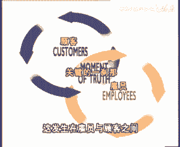

# 欧洲商学院MBA教程，涵盖你想只知道的所有内容，可根据副标题按需观看 - P32：服务制胜1A-.服务双赢策略 - 清晖小野学管理 - BV1LM411Y79Q

早在几十年前，经济学家们就已经预言了，服务竞技将要来临，服务业公司都将在数量和规模上增长扩张，并且雇用许多富有活力的员工，这种所谓的第三产业将因此更为重要，而传统产业包括大多数的农业，采掘业。

第二产业和制造业部门都将下降，这种趋势已经成为事实，并且仍然在促进经济转型，第三产业不仅在国民生产总值中占的比重很大，而且他们在证券交易市场上也优于传统产业，与此同时，制造业企业已经认识到。

服务在提高他们产品价值中的重要作用，随着竞争性产品，在生命周期内的差别变得越来越小，各个公司试图通过服务来体现差别，例如通过稳定供货及时装运，技术支持和维修或培训的这种无声服务革命，已经吸引了一批顾客。

随着整个公司在整体服务上竞争越来越激烈，顾客们也变得越来越挑剔，几年前为人们所接受的服务水准，今天则变成了抱怨的原因，那些现在被认为是提供高级服务的公司，几年后将被认为仅仅是，提供了一种普通水平的服务。

因此不可避免的，人们需要把越来越多的注意力放在管理，服务活动上，在我们的许多节目里，从服务的管理，基于客户的经营活动，盈利性定价到控制与绩效评估中，我们已经发现，无声的服务革命对战略管理思维，逻辑。

定价策略和会计核算产生了多么深远的影响，在这个节目中，金克劳德拉拉克教授将构建一个框架，它将会帮助从事服务行业的公司，对关键要素进行整合，以达到成功的服务管理，首先要认识到企业的成功依赖于同时满足顾客。

员工股东的血量，啊啊啊啊啊啊，有金克拉德拉拉克教授主讲，创造顾客员工和股东的最高满意度，兰儿谁，尽管各种服务之间有差别，管理者的目标总是动员他们的团队，去满足顾客的需要，以获得收益。

每一个服务型公司的成功，都高度依赖于其经营活动中的一个关键的阶段，即员工接触顾客并提供服务的那段时间，the employees and customers，这种交际是如此重要。

以至于被人们称为关键的一刹那，has been called the moment，以斯科蒂纳维亚航空公司为例，支持一家曾经效益低下的公司，对顾客的抱怨漠视不公，杨恩卡尔森。

把他变成了一家从事商业旅行服务的服务优良，效益显著的公司，他认识到员工与顾客交流的重要性，因此他归纳出便于记忆的一段话，斯堪迪纳维亚航空公司，每年提供5000万次的服务，平均每15秒一次。

这5000万次的关键的一刹那，将最终决定斯堪迪纳维亚航空公司的成败，那一刹那，科尔森采取了大量的或大或小的行动，是斯堪迪纳维亚航空公司摆脱困境，他的计划包括集中于某一类客户群体。

那些经常出差旅行的商业人士，增加航班，坚持准点起飞，培训员工，增强他们的应变能力，因此服务重点不应放在各个商务功能的效率上，任何一种提高服务管理的系统化方法，都必须建立在对关键一刹那的监视理解下。

要想进一步深入，就必须了解各项服务的特性，characterist，第一个特性是无视体型作为价格交换，顾客得到一些收益，虽然有些服务可有实体形态，由餐馆里的食物，银行的钱和结算票据或酒店提供的客房。

但是顾客实际得到的服务却都是无形的，actual component received is entirely intangible，一项服务首先是一种经历，而且很难描述。

服务的无实体性的直接结果是它的不延续性，他们不能够储存，如果一架飞机起飞时，一半座位是空的，这些空着的座位却不能在第二天继续出售的，这种座位的供给和需求相匹配的巨大压力，导致定价策略复杂化。

他需要根据服务的时节来进行调整，他同时也使得服务质量管理困难，因为服务的好坏，不能像产品好坏那样处理和作出分析，服务的第三个特性是其商务职能的不可分割性，食品由工厂生产及分销。

却通过一个特殊的部门distribution由销售团队进行营销，当顾客开始喜欢上这种产品时，他们并不理会这些产品是如何生产的，以及他们的分销渠道是如何运作的，一个服务公司永远不能依赖于分割的职能。

同一个员工要负责生产销售并交付给顾客，因此这些公司所有的营销运营人力资源决策，在员工为顾客服务时，不同公司政策上可以相同，但提供的服务质量却大相径庭，由于服务的无视铁性，大多数服务程序分散。

人为因素太强，与其直接接触了顾客，五花八门，确实很难借用前期的护肤经验，vari it is indeed very difficult to perfectly。

replicate a service，experience，time and again，现在的问题是，我们如何把这些特性都考虑进去，以便在关键的一刹那来临时做得更好，用什么东西能把这些都串起来。

使公司的服务更加出色呢，几十年来，零售业，银行业，餐饮业的经营选址，被人们认为是服务业取得成功的关键要素，在那个经济迅速膨胀的年代，找一个所谓的交通发达的经营地点，是至关重要的。

甚至被认为比服务质量本身还要重要，这种基因选址固然重要，但它只能是更广阔的商业逻辑的一部分，这其中包括战略，但愿不止战略，不过也并不高深莫测，在竞争环境中，什么是最重要的，人们都十分精彩。

逻辑因素也代表了一种强有力的心理模型，它是每个人都看重成功的主要要素，甚至在形势变得复杂，模棱两可和紧张时，可能是大家把每天大量的工作，有条有理地联系起来好了，逻辑关系是一切其他的成功要素之母。

例如领导能力和信誉，卓越的领导能力需要有许多技巧，但是如果没有一个好的逻辑关系模式，领导才能也很难发挥幸运，数字在无数企业成功的历史中发挥过作用，但拥有很强大的逻辑关系模式，也是很有益处的。

我们用法国生物化学家巴斯德的优美语句，来形容机会去车心于有准备的头脑，逻辑条理，在服务管理中不仅是成功的决定性因素，而且还是通过学习最能改变的一个因素，本节目中，我们构建的框架是帮助你在自己的公司里。

理顺逻辑关系的，这个模式，能帮助你发现公司中什么是至关重要的，把它概括为飞轮，the winning wheels of substance，服务制胜的飞轮，这幅图的中央是关键的一刹那。

这发生在雇员与顾客之间。

雇员与顾客分别与两个制胜飞轮相关，成功的服务企业背后有许多人情异事，是完全正常的，这是服务管理软的方面，这是很重要的一方面，但也不应忽视硬的方面，应德方面专用于数字和事实，最关注的是盈利。

这两个方面是基础，任何成功的服务企业，在这两个方面都要做得很棒，这种成功的商业逻辑，把服务管理中软和硬的两个方面整合起来，并且他还充分考虑了在当前的服务环境中，各种已发生过了变化。

航空公司本身的性质就是跨越国境，与客户在国外的银行，广告代理商或美国快递公司打交道，在国际当中，服务公司落后了，因为他们的产品，因为他们不能够脱离基地，他们要么必须开始就把公司做的很大，要么根本就不做。

再者由于直接与顾客接触，使得他们的经营有很强的文化限制，他们要在不同的国家取得成功，因此有更大的风险，如今对服务企业来说，甚至连受本地文化影响很深的服务业，近年来都成功地在全球扩张了。

香香美国的快餐公司有麦当劳，肯德基，他们现在已经拓展到法国的乡村小镇了，想想法国的超级市场连锁店家乐福，他也把分店开到西班牙，巴西和台湾了，本地服务业也受到快速转变的，更加苛刻的国际标准和创新的影响。

商业环境全球化如此迅速，使得悠闲自得的国内企业不再优先，他们只能努力达到世界级的经营水准，以保持竞争力，world class operations，甚至公共服务部门和国有企业，都清醒认识到新的压力。

have awakened to the new pressions，全球化竞争的结果使得电信公司，邮政部门，电力，自来水和铁路部门在过去的几年中飞速发展。

endous progress in the last few years，服务业竞争不仅极具全球化，而且自身增长迅猛，服务部门对现有企业和企业家是很具有吸，一旦产生这种现象是由于制造业机会下降。

服务业门槛降低，顾客需要更多的服务，当然还有对服务业管制的建筑，另一个是竞争加剧的因素，是服务管理的日益复杂化，许多服务企业是由企业家自己创办的，他们在开放的世界上抓住了机遇，但自那以后。

服务公司的管理变得更加复杂了，这就产生了更加强有力的管理团队，高质量培训以及更先进技术的使用，technology服务创新和竞争反应的高速度，是这种现象的征兆，简言之，今天的服务企业处在比5年前。

竞争更加激烈的环境中，唯一能够确定大师明天的竞争更加激烈，tomorrow，正因为在这种日益竞争激烈和全球化的今天，我们必须考虑客户价值的观点，客户价值观念，物管理软和硬的两个方面。

都反映在客户的价值理念中，这里存在两个客户价值，一个是公司提供给客户的，另一个是代表公司利益的客户价值，最终双重意义反映了一个重要的关系，它使得双方受益，客户价值的两个方面是商业的本质。

应该受到更多的重视，attention they usually receive，我们来从客户的观点出发，看看他们的价值观念发生了哪些变化，当客户购买一项服务时，作为价格交换，他会因而受益。

在正常竞争条件下，客户的收益和为此付出的价格是能达到平衡的，客户会是这种结合为一种平均货币价值交易，许多交易止于这种收益和价格的结合，在低级经济交易中，低价格获得低收益，而在高级交易中。

高价格获得高收益，benefits，and at the high end a premium market，where a high price is paid for high benefits。

在许多部门中并没有达到这种竞争平衡，由于缺乏竞争监督力量不足或缺乏规章制度，使得一些企业高高凌驾于客户之上，在这种情况下，进而用少量服务崛起超长利润，只要竞争受到限制，从而选择的自由受到约束。

顾客的不满意就不会造成什么短期不良后果，it was trained，许多企业无法抵制这种诱惑，通常这甚至不需要管理者做出明确的决策，他简直就变成所有员工的一种生活方式。

移动公司各个部门上下之间不言而喻的合谋，管理者们只看中高额的利润回报，售货员对待顾客的态度是想买就买，不想买就走，电话员接外线时盛气凌人，航空业处于这种状态已经有几十年了，航空管制飞艇机位有限。

容量不足，门槛高的是航空公司在经营上从来不尊重顾客，乘客上机要抢座位，提供的食物很差，就像对待牲口一样，还会丢失行李，价格高得出奇。

lost their luggage and paid exorbitant prices，银行业也是同样一种情况，银行上班时间短切，服务质量差，臭名远扬，如今竞争使得这种虐待消费者的做法行不通了。

但是一些大的航空公司，大银行，零售商和连锁旅店的改变却缓慢而举步维艰，从长远来看，受到这种虐待的最终受害者是厂商，而不是消费者，of these，在竞争环境中，厂商由于虐待消费者而产生错误的态度。

一旦采用这种态度，那么想改变他们比从头开始难得多，them to start from scratch，虐待消费者还会导致十分低下的成本结构，同样要想改变会很难，只有当竞争进步加剧。

才能迫使厂商提供优质服务，better value for money，当竞争达到像今天这样激烈，且扩展到全球范围时，就会呈现一种新的景象，一些公司，尤其是新兴服务公司，有能力开始提供价廉物美的服务。

换句话说，虐待策略甚至货币价值的策略，都将由凤银消费者的策略所取代，维京大西洋航空公司就是这方面的例子，北京大兴航空公司，是由一个英国商人理查德布兰森，于1984年创建的私营企业。

it wants to provide international，他想为国际旅行者提供质量高，幸运休闲且价格合理的，经过10年的经营，他已经获得了大量的荣誉，包括获得了最令人羡慕的年度最佳航空公司奖。

四次，他在这一产业中不断开拓创新，为每个座位配备了个人收看屏幕，还有免费接送大巴，配有美容专家，缝纫等一级商业服务，and business class serviceconomy prices。

这些服务都在价格上经济合力，而且公司是盈利的，另一个凤银策略，只有佛斯迪瑞公司推行的，这是一家经营电话银行业务的公司，由英国的中国银行在1989年创办，银行还有24小时电话银行业务系统。

1年365天都不营业，他没有分支机构，只有电话终端安排，有能力的银行代理人，除了这样的长期支持设施以外，波斯迪瑞克斯银行还提供了附带服务，如较高额的日现金取款业务和价格，颇具吸引力的高担保支票业务。

在1992年，经过近3年的运作，托斯特瑞克就成为荣膺美国消费银行，消费者满意银行的五大银行之一，然而其母公司比特兰银行，一个在年代和规模上远远超过他的银行，却只位列第13位。

ford rice是一个有趣的案例，因为一个古老的公司发现了这样一个机会，因此创立了另一个独立机构，以提供优质服务，通常这种奉银消费者的方法，是为新型风险公司所采用的，现存的公司都不会这么做。

认为这是无限时代，并宣称这种公司终将倒闭，事实上，企业奉阴消费者通常非但不会有危险，相反会促使产业转型，因此这种明智的经验怎么会错呢，一些老企业的经营理念是质优价廉，虽无大利可盈。

但他们的想法至少一部分是正确的，采用传统的经营方式，并尽力满足客人的需要，为企业赢得了可观的回报，消费者也获得了可观收益，如果价格更低一些，就能提供更多的服务，但如果消费者人均收入不变。

争取消费者并提供服务的成本不变，这时利润会明显下降，decline，只有当经营方式改变之后，供应消费者的策略才能有一定利润，但是随着消费者权力的增大，厂商别无选择，只有逐步从虐待消费者的态度想公平的。

最终是凤银消费者的态度积极转变，现在顾客就是上帝，今天看起来是凤银顾客的服务，在将来，这样的服务只能算是一种普通的服务，决定一个公司能提供何种水平服务，且保持足够利润的基本信息，是精确评估消费者的价值。

is precisely the estimation of the customers of value，换句话说，企业提供给消费者的价值，直接依赖于消费者为企业带来的价值。

现在我们来看一看消费者价值的其他方面，value of customers，创办一家服务之声的公司的出发点是，充分评价消费者代表的价值，represent，问题是。

传统企业甚至根本不会提及这样重要的问题，他们更关心他们的产品，而不是顾客的价值，在一个特别的案例中，有一份关于消费者价值的数据，上面有每位消费者的总收入，这些数据的价值被低估了，仅仅是被数据源用来分析。

而没有对重大的决策和员工行为产生影响，相比之下，看看这些数据，这是一份由顾客导向的公司提供的，对多米诺比萨饼公司来说，每位顾客的价值为5000美元，对不列颠航空公司来说，顾客价值为每人5万美元。

卡尔斯威尔，是一家在达拉斯的卡迪拉克汽车销售商，他们的顾客价值为322000美元，这些数字如此之高，让人无法想象，但至少通过逻辑评估后是这样的，传统迹象是用交易的观点来看待顾客价值，恰当的平淡。

顾客价值应当考虑企业与顾客之间的长期关系，considers the long term relationship，between the firm and its customers。

看一家快速食品餐馆的例子，平均一位消费者一次支付十美元，如果这位顾客一周去一次，那么10年后，这位顾客的对公司的价值就是5200美元了，这种评估对一线员工的意义是什么呢。

what are the implications of this estimate，and of communicating it to frontline employees，如果没有这方面的知识。

员工就会以这样一种态度对待顾客，顾客走进来买食物，在商场只滞留了一会儿，如果有什么差错的话，也就是十美元的事儿，这个数字就像一个人在茫茫人海中走过一样，没有丝毫意义，而如果是牵扯5000多美元的话。

这个员工服务的动力就大多了，这些可能交易的边际成本是多少呢，与顾客交谈五分钟的可能成本是一美元，更换食品是二美院提供免费饮料，半美元，让顾客回头光顾的一张赠券，0。25美元，twenty five。

相比较而言，这些边际成本会比具体交易的边际成本要高，但与顾客的关系价值比较起来，这种边际成本事实上是很少的，这种观念从一项交易转向另一种看法，它反映了交易的目的，不仅仅是为了满足顾客一次的需要。

而是为了达到这样的结果，即顾客以后会经常光顾电厂，这种观点对顾客价值的评价会造成很大差异，我们刚看到的这些数字都是指回头客而言的，他们可能不精确，而且是依赖了一些假设得到的，但是他们的数量即是正确的。

首先他们完成了关键目标，因为他们引导了正确的决定和正确的行为，如果你采取正确的行动保持他们，那么这些就是顾客的价值，如果你相信顾客值这么多，那么你就更会采取正确的行动，在这当顾客离开店铺时。

他们在熙熙攘攘的人群中消失了，要再去找到他们，然后说服他们再次光临，是要付出代价的，好吧，好的服务提供给有价值的顾客就要便宜得多，这些顾客应该是能够很方便光顾的那些顾客，但是你并不知道他们的价值是多少。

只有在经过长期接触之后，你才能评估出，因此在我们在讨论下去之前，请努力为你们自己的公司回答如下问题，忠实顾客的价值对你们公司来说意味着什么，你的答案将会给出顾客在1年内的开销数额。

但是你是否考虑过与顾客建立长期关系，牢牢记住，对一家服务公司来说，10年是一个现实的雄心勃勃的目标，你是否还考虑过顾客的口碑，要想评价口碑对总收入的最终影响，并不是容易的事。

但是积极的口碑确实会使顾客增值，顾客的价值及评估，那么你是否考虑过，你该如何把评估结果，与你们公司其余的人交流呢，了解顾客的价值是一回事，把他用朴实有力的方式表达出来，我希望这些小的练习能使你相信。

谷歌的价值是一个战略问题，这些应当与所有员工一起分享，作为员工行动指南，如果这些条件达到了，那么顾客之称的飞轮就会为你的企业转动起来，for your organization，顾客制胜了飞轮。

一个成功的关键一刹，那就是一项好的服务，这样就能使顾客满意，反过来将是顾客以后经常光顾很多的回头顾客，又将使你负担更多的顾客服务，这样就可能促使企业提供更好的服务，通过这种方式，这个飞轮转得越来越快。

库克也获得了利益，最终企业也从中受益，same reasoning explains，why，不过同样的原因也可以解释，为什么在有些公司这个飞轮却纹丝不动，提供的服务质量差，会导致顾客不满。

使得顾客不再光顾，这样进一步使服务质量更差，delivery这个案例中，双方都受到了损失，但是不同之处是，顾客的损失只是暂时代，他们花了钱，只得到了差的服务，相比之下，公司失去了客户。

却长期影响公司盈利，通常公司都不了解这个过程，让我们在每一个关键阶段多花一些时间和精力，以便让顾客的飞轮高效运转，提供服务，关键的一刹那，现在我们都清楚，服务在提供的开始阶段，最关键及关键的一刹那。

这是公司提供优质服务的能力，由顾客来检验，关键的问题是这样，提供什么样的服务才是优质服务，如果我们首先考虑一下软的方面，任何进步都开始于一个清晰的服务观念，尽管各种服务之间存在差异。

但这两个关键部分是相同的，及优质的服务，提供解决问题的方法，并使之成为一个美好的经历，经营的一个基本方面是，成功的企业不是在销售产品，而是在提供解决问题的方法，然而不幸的是，还有企业没有这个意识。

继续沿用老方法经营，不经常得到提醒的话，企业慢慢的就会淡忘这些，甚至连那些最棒的计算机公司，也会最终未忘记这些基本原则而懊恼不已，戴尔公司很快便认识到这一点，他们着重关注顾客遇到的问题。

不是私人电脑本身，而是价格合理，又有高效技术支持，他们是第一家通过利用高效电话支持系统，编制订货目录，销售产品的制造商，这需要电话技术员的帮助，他们能够把顾客想要得到的电脑特征画出来，然后按此进行组装。

几天后就可以发货了，为那些遇到问题的顾客提供解决问题的方法，对任何一家公司来说都是必须的要求，但是顾客希望得到的更多，一家公司提供的基本服务，很好地反映了金钱原则的传统价值。

他们在恰当的时候会提供更多的服务，当他们了解家庭购物是整家外出时，他们针对家庭购物的需要，为顾客提供小孩看护，游乐场，跷跷板等设施，以一种体贴的方式为顾客解决问题，这样能使顾客更加满意。

我们来进一步详细讨论这个过程，the winning wheel of customers satisfaction，顾客满意度不仅仅只是一个时髦的口号，然而有的企业管理者只会要求自己的团队。

满足顾客的要求，但却不断衡量满意度假投资，衡量满意度的方法是，许耐心观察顾客的满意程度，还是抱怨，存在的问题是顾客长期不满或相当不满，没有爆发之前，发觉不良企业的这种自以为是的方法。

暴露的问题是企业的无知，当发生这种情况时，一切都太晚了，大多数顾客不会劳神地去抱怨这家公司，而是会去买别家的商品，事实上研究表明，只有4%的不满意顾客会投诉，租金的公司会在不知不觉中失去顾客，说服公司。

在测量顾客满意度上进行投资的最好方法，是让公司看看它的真正商业价值，因为顾客满意度至少在三个方面，表示了朴素的商业概念，更高的消费水准，满意的顾客会消费的更多，保留率，满意的顾客依然重视口碑。

满意的顾客是一个公司最好的拥护着高消费，对利润率的影响是显而易见的，保留率存在于我们对顾客满意的，飞轮讨论的第二个关键阶段，让我们用对口碑现象的观察，来总结顾客满意度的这一部分。

with some observations on the phenomenon of word of mouth，许多研究表明，满意的顾客会把这种快乐与2~5个人分享。

然而一个不满意的顾客会对其到15个人诉说，二战的影响程度显然是不对等的，期望与经历各不相同，顾客可能与别人宣传的就越多，如果正常期望是得到优质服，那么一般满意度就不会有很高的口碑，在地中海俱乐部。

他们对这点相当在意，他们的拇指规则是当人们旅行回来之后，他们的经历无论是正面的还是反面的，都会必须告诉十个人左右，口碑的重要性在于它反映了在特定地点，特定时间的一个事实，65%的头。

一回来到地中海俱乐部村的客人，都是从朋友和熟人那里了解到这里的情况的，这其中有25%的人，后来成了这里的回头客，口碑的经济价值也许很难精确评价，但是人们可以很容易地推断出，其经济数量的重要性。

那么可以得出总体上顾客的满足程度，如果要得出精确的评估，不大切合实际的话，那么一个经过仔细分析的结果，也能知道决策和行动，艾瑞特酒店集团评估得出，顾客的满意度每增长1%，公司每年从中得到的收入回报。

将增加5000万美元，ibm电脑公司设在明尼苏达的生产厂，得出结论，顾客满意度每增长1%，那么在今后5年中获得的额外收入回报，将达25000万美元，尽管这只是个估计数字，但事实上。

这些数字能够促进公司争取和保持，高水平的顾客满意度，high levels of satisfaction，如果没有进行衡量的话，那顾客满意度将是一个不能抗拒时间考验的迷，衡量。

对缓慢灌输真实感是有必要的，因为许多管理者对第一批结果已经感到吃惊，最后横梁能够促进进步，因为人们经常观察到，当顾客满意度等级首先被测量到并被交流时，顾客满意度就会获得一个自然的增长趋势。

设定顾客满意度远不止这么诱人，但因为人们没有理由不这么做，人们担心这样去花钱，请专业人士进行市场调研，但是设定顾客满意度并不是一件困难的事，只要你坚持不懈的在同等规模上进行测试。

这样花费的时间和金钱与在出现危机时相比较，是微不足道的，希望我们下一个讨论的主题，能使你进一步相信的顾客制胜，飞轮保留率，开拓客户或许比留住客户更引人入胜，然而以这样的借口来补充时。

对待保留率是不正确的，商业的价值，实际上很大程度上依赖于老顾客的光顾，开拓新客户的高昂成本，只有客户同公司在业务上保持相当长的时间后，才能收回，顾客满意度表现的最重要的结果是。

说明了企业在留住顾客上的能力，然而顾客满意度并非是留住顾客的唯一要素，研究表明，事实上，65%到85%的便捷，顾客对以前的供应商甚至非常满意，with the former supply。

同样也不能得出这样的结论，留下的顾客就一定对我们的服务满意，it is unfortunate，but the dynamics of customer retention。

or not as simple as that，下面让我们来详细探求。