# 欧洲商学院MBA教程，涵盖你想只知道的所有内容，可根据副标题按需观看 - P4：企业的持续发展力建设 - 清晖小野学管理 - BV1LM411Y79Q

愿你的生活有意义，这是一句古老的祝福语，今天每个企业管理者都知道，我们的确生活在这样的时代，过去成功的企业是市场比赛，如今我们比以前更容易参与到市场中，积极主动的创业者，可以比强大的竞争者。

更有效地把握住新的市场机会，但是问题还有另一方面，企业的经理都认识到了这一步，如今企业比商业史上任何时候。

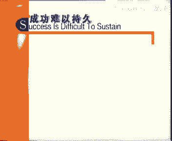

这一观点的宏观证据包括许多不同的方面，一是企业更新的速度，ademics跟踪企业生命周期的学术研究发现，认为企业可以长期存在的观点是错，有明显的趋势显示，90年代以来企业障更快的速度消亡。

还可以通过分析企业创造就业机会，来研究企业更新周期，以财富500强或其他优秀企业为例，经营状况好的时候，这些公司至多也只能说处于中性距离状态，不创造也不减少就业机会，经营不好时，以消除就业状态。

即从长远的角度会减少就业机会，市场上新的就业机会主要来自于，通常称之为eels的创业型企业，finally，股票，市场上按公司经济价值排定的企业名度不断变，这也可以说明公司在加速更新，一些往日的巨人。

甚至包括那些似乎永远在发展的机构，已经定下了，比如号称永动机的i t t，60年代还是华尔街的最爱，现在也老了，这个例子说明，一个企业可以取得出色的财务业绩，但不会总能如此。

另一家公司是美国的零售商西尔斯，由于没有发现并适应新的市场机会，如改变零售地点或提高品牌层次的，它从市场的顶端跌落了下来，my bm是另一个例子，他们没能把握自己发现的市场机会。

他是英特尔早期的投资之一，也是他授权使用ms dos操作系统，才有了microsoft公司介，许多公司的管理人员察觉到了，更微观的证据表明，成功很难保持住，product lifecycle。

产品生命周期越来越多，也更难预测，在it行业，用月来衡量硬件和软件的生命周期，在10年前是无法想象的，现在技术创新正处于巅峰时期，对商业机会的预测发现和保持更加会心。

催生就economic opportunity，but it also leads to the destruction of the old order，当前世界的特点更多是不确定性而非风险。

风险是可以评估发的不确定性难以估计，有一个人经常与不确定性打交道，人们以非常的方式谈论，其他那些重庆企业家精神，善于把握机会的新人，把他视为榜，这个人的名字叫jean from sh。

是总部在丹麦的传媒公司ex mt的首席执行官，shock先生，你非常坚定地认为公司需要企业家精神，并且要善于把握机会，这是为什么，为什么，这非常简单，要么发展，要么消亡，你不抓住机会，别人会抓住你。

在传媒行业变化非常迅速，所有产品的生命周期都非常短，如同时尚行业industr，我们面临两个挑战，一是保持自我，一个是发展，要为为我们的公司创造价值，是我们在30个国家有105家公司。

这些公司之间相互关联，为公司创造价值，relationship，在过去的10年里，我们以每年14。2%的比例高速的增长，我认为创新和授权是紧密相关的，要信任自己的员工，他们是最了解情况的人。

作为管理人员，我们可不能妨碍他们，这是最重要的原则，明白了这一点，经理们所要考虑的是公司的目标和价值观，我们公司有非常强的目标，我们要求每个员工都信守公司的价值观，这些价值观最重要的是。

主动赋予创造性和合作精神，要不断追求这种精神，我们要发展说起来很简单，但要真正做到却不容易，相信你的员工，这是第一准则，要有很强的目标和明确的价值观，要相信员工，他们不会让你失望的，这样就能发展起来。

新的经济逻辑是经理们必须要注重发展，无论是开发新产品和服务，或拓展现有产品或推陈出新，否则现有产品和服务的下降，最终会导致公司的消亡。

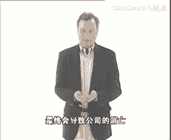

公司不想继续发展，就应该将资本返还股东，他们可以找到更好的投资机会，在企业消亡率越来越高环境中，仅要维持经营状态，公司就必须不断成长，公司要不断成长，就必须动员所有的人参与到寻找新的机会中去。

organization for growth。

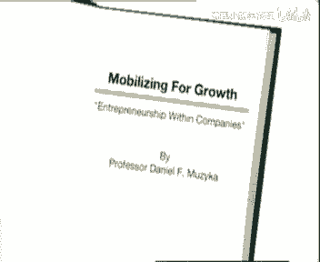

对发展自我更新和适应变化的动力，只有在可预测性降低的时候才会出现，此外遵循新建立的市场模型，技术和经济至多也不过是短期行为，在其他状态下，公司就必须面对自80年代中期以来。

便对企业发展形成威胁的各种挑战，90年代早期，情况进一步恶化了，经理们如何处理管理中的新问题，最初是机构重组和转型，包括裁员，出售所有非核心业务，调整业务组合等解决方，后来发展的业务流程。

以提高效率和消除闲置，结果通常是企业的成本降低，缩小这些解决方案的实际情况，归结起来都是在维持现有的管理状态，管理层不过是想通过控制收购降低成本，专一化，合理布局结构重组等方法，尽早获得成功。

管理层没有放弃自己的特权，也没有改变计划控制组织和实施等权力层次，这些解决方案最终也产生了一个有效的，以同样资源获得更多产出的组织，是的进入新世纪以来，我们反复考虑这个管理模型是否可行。

我们认为可以缩小个人的管理范围来提高效率，但这不是我们希望的方式，主动意味着拓宽视野，刚才我们看到的解决方案还没有产生更有效的，即可以设立并争取新的目标。

发现并把握新的机会的new opportunities。

相反的，在其管理者谈论新的发展时，他们产生了一个规模不断缩小的公司，看起来有些公司实际上却在试图减少发展的路，另一些公司更注重以人为本，管理层有所授权，但是要求所授权的人按照现有的控制系统工作。

许多时候管理层掌握着重要的资源，并没有将管理工作真正交给被授权的人，当存在分权的趋势时，授权是有效的，这和委托不同，委托只是转交责任，而自己仍掌握控制权，其他一些董事会开始研究新的领导精神，不改变现状。

而是企业正常运作的奇迹创造者，如果这位领导失败，便是精神的失败，任何董事会希望这位领导，取得经营的成功的同时，保持目前的组织机构和管理层的特权不变，这个事实无关，公司把所有的管理权限交给了一位新的领导。

对企业进行大换血，并在很短的时间里取得较好的成绩，但是这类领导很快便会有更好的去处，留下了一个有效率但不能持续发展的企业，小杰经理们尝试各种办法来解决，维持利润这个问题。

众多的方法都试图维持已有的管理实践，但并没有取得预料的成果，许多经过业务重组，公司陷入了缩小规模和业务重组的死寂中，这就是为什么公司被市场淘汰的概率很高，多种因素促使公司向所谓的多类型公司发展。

以寻求更多的机会，然而由于机会很难得到，这种公司不能维持他们的增长，网络公司和零售专卖店来去匆匆，金融市场追逐短期利润最大化，却没意识到这种做法是不能维持可持续性发展，尽管有欧洲就业法的约束。

个人也在接受更多变的工作，不停跳槽，寻找新机会，正如peter坎帕里在再看劳动合同一片中指出的一，样，人们被鼓励忠于自己的事业和职业，此外他们可能不愿将自己的成功，和短期性的企业联系在一起。

这些因素驱使我们转向多变的公司，或是机会单一的公司，这些变动没有考虑交易成本，首先对个人而言，是要重建自己的生活和社会关系网，其次对知识和能力的整合，分拆重新整合对整个经济而言是一种成本。

最后我们认为最好建立一个可以创造，利用并拓展能力的企业，这样他们可以建立一个活泼的人文社区，所有的人都可以实现对资源和目标的需求，这就是我们所说的调整型创业公司，a e o a e o。

我们回到了最基本的问题。

如何从内部推动企业的发展，因此有必要建立一个叫其他企业更易识别评估，善于把握机会的ao，这些公司将自己的业务看作是流动的，因而可以更好地调整自己的组织过程，能力和系统融入新的机会。

总之他们是具备自我更新能力的经济实体。

我们正在欧洲商业管理学院进行研究，试图发现创建可持续发展的企业所必备的条件，我们非常愿意和您分享我们的研究结果，但要提醒您注意两点，一是和任何研究一样，这项工作还在进行之中。

二是创建这样的企业必须满足一些条件，我们先看看这些条件，在你开始为组织中的企业家精神水平担心钱，以下的要求是必要的。

一是基本目标和方向，譬如我们要成为互动娱乐业的领袖，我们让人们更好地沟通等，即使在新的机会带来的新的目标和方向时，我们也需要知道大致的努力方向，二是最低业绩保证，即在正常经营情况下，公司不会亏损。

在面临灭绝的威胁时，人是不会去考虑如何适应环境的，持续亏损让人极度沮丧，公司也没有闲置资源可用于发展和改善状况，只能先保证不亏损，才能考虑长远的发展，三是结构和业务整合，即所有业务分类合理，形式规矩。

一些人认为组织可以以项目小组为基础单元，人员组合松散，项目结束便各自解散，但这种组织结构很难把握新的机会，对虚拟的团队和组织而言，把握机会和长期发展的能力也是虚拟的。

你必须保证这些队伍中有一个专注的小组，他们感觉自己是公司的一部分，这么做的目的是积累信息。

another另一个条件是评估体系，至少应该有简单的会计体系，来度量企业的盈利和发展能力，没有评估行动便没有目标，最后是合理的管理和组织，律师会发现这里面有非常大的变动空间，但公司至少应该有一批。

对公司的组织激励和发展有想法的人，如果您还缺少这些，那就先去创建这些条件，让他们敬畏，然后再接着收看我们的节目，我们的主要目的是在合适的时候，鼓励人们成为企业家，并在适当的时候对他们的创业精神予以鼓励。

我们希望这些人在发现机会，并觉得发展时机已经成熟的时候，能主动站出来，动员员工，意味着给他们更多的机会，让他们愿意为企业的发展寻找机会，要准确地判断出哪些机会，企业可以尝试，哪些不可以。

需要员工具有极度开放的思维和资本约束能力，懂得什么是该汇报，什么是可以独立处理，我们鼓励员工在企业的经营中，寻找促进企业发展的机会，而不要和企业经营独立开来，因为从企业的角度来看，如果我们会失去他们。

不能将他们的观点为企业所用，那我们为什么要将企业交给他们呢，我们也不愿意他们将来离开企业，去发展自己的事业，所以让我们来看看这些可以为企业所用的人，应该具备什么样的特点，首先他们可能来自社会的各个方面。

他们未必年轻，企业家的年龄和社会阶层各不相同，媒体总是认为企业家是天生的，这种说法没有任何遗传学上的证据，来自于家庭背景的影响也非常有限，一些迹象显示，出生顺序和早年家庭条件。

对一个人是否能够成为企业家有些影响，譬如年幼的孩子比年长的孩子更富有创业精神，但是更多的例外说明家庭影响是可以超越的，此外企业家不能有明显的心理障碍，他们可能会有些与众不同的爱好，但不会焦虑过度。

也不会咄咄逼人，最后人们对企业家的一个基本看法是，他们对金钱的需求不是非常强烈，他们看中的不只是金钱上的激励，金钱至上的80年代有很多传奇故事，有些反映的就是个人对单一报酬的，他这种简单的报酬方式。

对实验室里的动物可能有效，对人无不心，人们当然看重自己努力所得的物质回报，但也非常重视自己价值得以体现，被人认可，被人重视的环境因素，每个人都可能成为企业家，谈了这些。

我们确实发现企业家有一些共同的行为模式，如果和管理者或政府官员进行比较，有些企业家的特征非常有趣，正如哈佛大学的史蒂文森教授指出，在战略上。

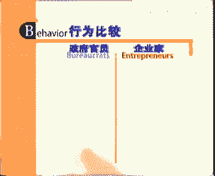

企业家注重机会，管理者和政府官员注重控制资源，我们希望激发员工的主动性。

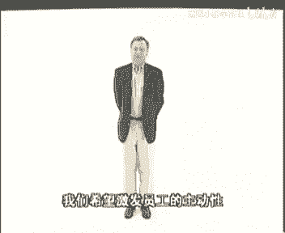

来促进企业的发展，我们不希望员工认为我们怀疑他们的动机，但在政府部门，如果你主动地表达观点，会有人认为你要抢他们的位置，或想讨好上司，政府官员从长期和稳定发展的角度来看待机会。

企业家看重机会的短期性和阶段性，比政府官员喜欢这份工作的安全性和永久保障，有些人可以准确的告诉你，再过几年，几个月，几个星期，甚至几天，他们就可以拿到全额养老金了，企业家认为资源配置是阶段性的。

政府官员却认为资源是一次性分配的，企业家投资学习，然后再投资，他们从不会把筹码全压在一次机会上，政府官员希望购买或占有资源，但控制资源对企业家意义就不大，因为他们喜欢租借的方式，管理结构上。

政府部门喜欢等级制度，而企业多为网络状结构，激励方面，政府部门注重效率，希望能以较少的资源做更多的事情，而企业家注重效果，鼓励员工发现新的机会或完成既定的目标，换句话说，他们将奖励那些捕捉住新机会。

或制定并实现新目标的人，强调资源的企业真是太多了，对他们来说，预算经营和战略比发现机会要重要，他们常常为效率问题担忧，但从来不问哪儿有新的机会，当然我们必须追求效率，我们需要盈利。

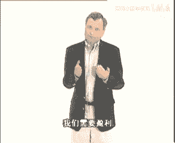

但是更应该关心如何把蛋糕做大，而不在于怎样分配切割蛋糕上，我们希望有更多的人，成为能够主动把握机会的潜在的企业家，presents itself for the organization。

我们需要更多的人来思考应该做什么，怎么做，谁来做等问题，我们不愿和只强调行动的人讨论过多，他们根本不能从行动中发现机会，我们也不需要牢骚满腹的人和教条主义，他们也许能发现机会并提出方案，但从不付诸实施。

他们根本不了解企业，更不用说去经营，更不要说那些没有主见的人，这些人一开始就不应该被招进公司，但不要误会，要知道最好的领袖也不会向所有人挑战，没有人能够改变大多数最终成功的领导者。

能够将企业中那5%愿意，并且能够承担责任的人扩大到10%，并不是每一个人都能够被动员起来行动的，and deliver，要实现这个目标，需要一个允许失败的环境，让他们可以从失败中认识学习，并最终走出来。

他们不会总是失败的，他们在小的地方失败了，在关键时刻就不会失败了，我们已经了解了企业家的行为方式，现在来看看那些鼓励创业精神的公司。

都有些什么特点吧。

首先在企业设计上，a e o和同行业中其他企业差异甚微。

初看起来办公室设备和公司员工有某些共同点，事实情况表面上总是不那么明显，appearance，其次这种企业处于某种动态平衡状态，他们需要不断沟通和共同处理这些明显的矛盾，比如发展和盈利，控制和独立的。

or independence and control，这就像自行车一样，只有在前进中才能保持平衡，a e o正是矛盾的存在，放手让下属处理此类矛盾，以此树立正直的形象。

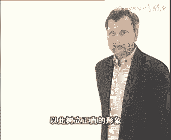

而传统企业像椅子一样。

非常稳定，但是很难独立往前走，焦点方面发展是这类企业永恒的目标，尽管结果可能只是维持现状，资源管理是传统企业关注的问题，似乎这些企业祈祷经理们能完美的保持资产，这是我的工厂，维持工厂的运作。

在保证多少多少盈利，千万不要冒险，ae o的资产都用来发现新的机会，即使这意味着关闭工厂并重建新工厂，你的任务并不仅是保持现有资产，在我熟悉的中等规模的成长型公司中，执行董事总是在管理层会议日程中。

优先考虑成长方案，他不断强调，没有发展公司就会失去生气，这种判断不仅仅只基于经济效益，每个人都知道，不发展就不会有新的机会，实现发展的最简单的做法就是要求发展，为什么正常的企业在激励员工成长。

和自我更新方面很难的，最简单的解释就是指出，在大部分大型企业里，他们在制定预算和分析变化上，花费了太多的时间，成功的创业型企业，不会把企业形象和现有的产品服务，紧密联系在一起，相反他们注重公司的能力。

潜在的机会和公司的员工，高效的ae o意识到，他们必须从现有业务和产品中发掘机会，并不断改进，在aeo工作压力是非常大的，他们要关注现在的机会和未来的发展，因此他们懂得何时必须拆分一项盈利的业务。

以便保证企业未来的发展，譬如戴尔计算机公司，他们总能赶在某一产品过时之前推出新产品，a e o激励企业发展，他们的另一特征是激励公司的员工意识到，经济业绩是必要的，而满意度必须通过取得业绩来获得。

should be received from delivering performance，公司自上而下的每一个人，对公司所有的事情都非常了解，透明度很有作用，这是衡量绩效和报酬的基础哦。

我非常愿意在这里宣传一下透明的力量，power of transparency，在高校发展的企业里，在那些更以发展为导向的公司里，经理们更乐于分享单位业绩信息，并把可比业绩放在大家都看得见的地方。

这对员工的激励远胜于经理们的说教，谁也不愿意比别人差，毕竟对员工的评价是基于业绩，而不在很难评价的参与程度，参与固然好，结果更重要，在关注业绩的同时，还应该建立一个共同的面向未来的远大目标。

人是情感动物，有时会感情用事，a e o的经理们也是如此，他们用大胆的想法激励员工努力工作，因为这让员工明白，他们为他付出时间是值得的，不管从市场定位质量还是创新角度来看。

领导者经理和员工都有一个共同的愿望，a e o的员工在满腔热情的领导，经理人和团队的鼓励下，而非奖励和惩罚下去，实现既定的预算和战略计划。

who all share a common burning ambition，一种激励和巩固业绩和学习的方法，是我们所说的归属感，某个项目领导者要很小心，认可每一个支持他的团队成员。

这个团队通过经理和其他因素，如内部刊物等支持，确保每个员工，包括只在很小的方面对企业有所贡献的人，都了解他们的工作结果，无论结果是否肯定，whether。

it's positive good negative，我工作的团队会举行，邀请所有有关人员参与的机会，在那里大家可以了解到最新的消息，在派送咖啡和点心时，人们培养对彼此的信任。

这种方式鼓励更多的人参与进来，归属感，把行动和结果联系起来，可以帮助员工调整工作方法和积累知识，正如人工智能领域的计算机模型显示的归属感，就像救火场上专门传递水桶的水桶队，它是一股非常强大的力量。

没有这种力量，你是无法巩固知识和行动并最终适应的，and finally adapt a e o，最不起眼的优势在于，他们的知识结构看起来很明显，却很难度量，这是威廉哈克特先生。

他是生产窗户材料的德国公司mhz的执行董事，他父亲创立了这个公司，他是新老板，几年前这个公司就停止增长了，是他使得这个公司又焕发了生机。

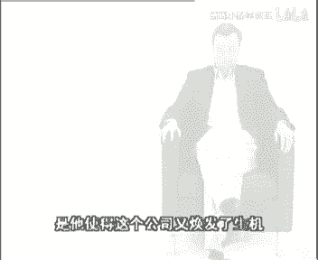

哈克特先生，你是否觉得沟通在一个追求发展的公司里，非常重要，particularly，经过那段增长缓慢的时期后，我们知道是员工在为这个寻求发展的企业，描绘未来，这一点很重要。

这个未来不能只建立在事实和数字基础上，因为人们对企业未来的发展，通常会有一种只有通过有效的沟通，才能完全勾画出来的直觉，我们必须和他们进行感情的交流，根据他们的认识，设立一个易于理解的目标。

要了解员工的想法，并帮助他们实现这些想法，our own目标一定是可以实现的，这种信心非常重要，因为那种本质的理解嗯，只有通过设立目标者本身的可信任性，才能实现，intuitive pictures。

can emerge，cultural characteria e o，员工开始认识到信息的价值，觉得他们应该把自己知道的东西展现出来，共享信息回顾也很重要，公司有多种沟通方式。

来分享一下我们的研究成果吧，let me share in our research，要将资料整理为知识a e o设立各种论坛，论坛的类型可以是定期的头脑风暴，可以随时发表意见的板报。

以及定期讨论新产品方案的跨部门的论坛，为为避免研发部的员工疏远其他部门，企业的咖啡间设在了研发部附近，这样大家随时都能见面，一些公司的内部网络很方便，通过搜索引擎和论坛，员工可以随时了解各种观点。

并发表自己的见解，we're working around different sets of ideas，to put ideas and information online for。

everyone's use a e o，积极利用网络来支持知识转移，公司内部各种专业性的和社会性的俱乐部，为沟通提供合适的环境，网络既是转移和检验知识的通道，也是没有级别的信息交流方式。

knowledge transferred，创新是ao的另一个特点。

在这里创新并不是某些部门的特权，它无处不在，并得到鼓励和支持，a function maintained by a chosen few，在3m公司员工，只有参与了成功的新产品开发过程，才可能获得提升。

不是一定要创造什么，而是要表明自己是创造新价值的一份子，对3m公司进行分析，可以了解多种创新方法，在这种开放程度很高的公司里，创新和机会产生于任何角落，有的来自正常的内部渠道，也有的来自外部。

尤其是客户资源，3m公司的一些产品的想法，就出自于汽车修理店经理，每个人总是在寻找从政府部门，学术界竞争对手，供应商和分销商那儿得到的一些新的启示。

originacademia or competitors，可以从机会自身的特点来评价，a e o的开放程度，这个机会可能和企业现有的业务相差很远，像3m公司研制的冬装绝缘材料，senslater。

对公司而言就是全新的业务，new的便签纸也是这样，这之前3m公司从未做过职业机会的，着眼点可能会很小，但是也能给公司带来增值，像生产不同颜色的posted便签纸，两者都能影响收入和利润。

如果posted便签纸一开始便很成功，给他们上色，则能使销售翻番，世界的精彩正在于此，一个看上去小小的机会可能会带来巨额的盈利。

the intermediate case is that you may have an evolutionary opportunity。

the next program generation in the life of a product，3m等公司在创新上的成功，主要得益于不考虑来源和规模的机会，发现评估和开发机制。

we'll find a way to be discovered，evaluated，and eventually exploded，对产品进行独立包装，也是一个增值和创新机会。

如何识别创新和改善现有产品的机会，变得很重要，这不能只进行简单的实验，而应该直接面向市场，for enhancements of existing opportunities。

this is not a trivial exercise and requires，an open interface with the market，消费者感兴趣自然很好。

但他们并不知道这样是否可行，仅仅依赖市场调查并进行产品开发的做法，是非常错误的，要相信自己的判断力，同时倾听消费者的看法，要走在消费者前面，并引导他们进行消费。

and new product areas，you've missed the third requirement，which results，创新还要求企业内部的能力比较一致，这样新产品和机会的选择。

才能建立在现有和未来的能力上，这是互动的过程，能力选择的机会，机会因能力而出现，selected capabilities that。

capabilities are also selected on the basis of opportunities，对致力于发展的公司能力和机会，互动是其战略最有力表述，能力建立以后。

经理们可以在选择机会的同时便执行战略，然后利用这个未来发展的平台，不断学习来建立比较优势，a e o通过实验来消除信息的不确定性，将其变为食物，并为组织接受，我们开始经营公司时。

有人告诫我们不要进行试验，因为那意味着我们什么都不懂，或者为什么要冒险，take the risk，这看法很片面，我们需要周详的计划和不停地寻找新的机会，只有做过试验才会知道试验结果是什么。

posted便签纸是很成功的试验，但开始时几乎没人愿意接受，但最终他们占了统治地位，注重长远发展的成功企业都会进行数据收集，但要提高学问，发现机会并对其进行检验，则必须借助于或大或小的试验。

这样不仅激发了人们的主动性，也可以最低的成本获得知识，往往一个低成本的试验便能取得的信息。

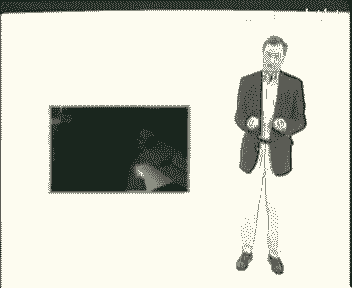

政府部门可能会花很多的钱，让咨询顾问来收集a。

要进行成功的试验，个人和团队必须满足如下条件，试验之前目标便非常清楚，谨慎考虑试验成本，客观对待观察结果，尽量降低对企业其他部门的影响，紧密监控试验的发展，了解最终的结果，在出现意外事故时立即结束试验。

管理层要给参与试验过程的人足够的自由，试验过程中要保持耐心，初步试验结果出来后，要能够决定哪些试验应该继续，哪些试验可以投产，时间便是金钱。

拖延则会失去机会，在3m微软和其他的ae o中，试验都产生了许多新的成功的产品，为支持试验，管理层必须制定特定的决策程序，有了新的想法，即使不符合公司的战略规划，个人和团队都可以向管理层表达出来。

管理层可以为试验寻找教练，企业和客户的资源，并对可能持续进行的试验做好充分的准备，其实提出想法的人最希望加快试验，将想法变为结果，最终转化为产品，to full production。

even if it's not officially sanctioned through normal channels，在资源配置僵化能力闲置的企业里，许多成功的试验和观点往往来自企业的底层。

receive试验结果需要反复评估，已决定哪些应该深入开发，试验变成现实，需要相应资源的支持，管理层则需要配置或再配置资源，来把新的机会转化为成果，资源配置机制要保持组织的效果和效率，请注意。

这不是效果或效率，而是效果和效率，资源的有效配置，要求公司不要隐瞒过往业绩，而应和大家分享结果，再次回到透明度和整体观，a e o，通常有通过数字分析发展趋势的审计人员，他们不只是注重转折点。

beyond管理层也不是对所有的数字都感兴趣，而只是掌握一些经过证实的重要的数据，这才是积极而不过度的控制，control，a o a e o的审计人员就像天主教徒，他们的责任不只是报告和控制。

还要传播信仰，他们既是管理者，又是传教士，they were in effect，acting as controllers and promoters at the same time。

管理者也是如此，他们要适度控制，了解并帮助企业成长和保持业绩，最终创业者能够提供给投资者的就是信任，投资者认为，企业家坚信自己的想法并付诸行动，当面临更大压力时，他们应该比政府官员更值得信任。

他们不能仅仅依靠审计人员来监督他们的行为，官僚环境中的经理人，可能会不负责任地随心所欲，这是管理层的失误，也是控制系统的失败，个人或团体的责任并不重要，企业家们必须愿意承担更多的责任，更值得信任。

追求未规划的机会的个人和团体的选择，通过前面提到的一个因素得到了强化，及系统的闲置，闲置表现在没有充分利用财力，时间，设备和人员等方面的资源，应该在公司里重新分配闲置能力的分配，不必通过正常的申请报批。

利益平衡等进行集中管理手段，否则就失去了存在的意义，惠普公司曾有一个非常有名的故事，公司的创始人在周末来到公司发现，为了防止盗贼，所有的设备都被锁起来了，他砸开锁，借走了设备。

并告诉设备保管员不要再锁设备了，因为这种情况下的设备意味着最廉价的闲置，工作日用不着的东西，往往周末会有用的。

或许业务重组针对的就是企业的闲置能力，许多咨询公司对公司承诺，通过砍掉存货员工和关闭一些办公室，可以为公司节约上百万的流动资金，这是一次性的成本支出，通过它然后达到最佳状态，但再不会有人尝试新的事物了。

因为大家都太忙了。

这就是重组的代价，在过去的10年里，几乎所有的重组都不仅排除了浪费，还消除了那些可能引起无计划增长的资源，多次重组的企业寻求增长，创新尝试和适应外部环境的能力很弱，由于需要对项目进程不断进行回顾试验。

便可以留有一定余地，就像风险投资a e o，希望为自己的项目找到资金，但对项目的跟踪结果不好时，他们便会中断这个项目试验是可以的，但继续试验则需要新的东西，如果不对项目进行跟踪，并在结果不好时候停止。

那么对新机会和试验的需求会剧烈膨胀，最终使得系统崩溃，数字设备公司最终被其竞争者收购的命运，现在仍然存在争议，这个公司有非常多的创新成果，一些还正在进行中，事实上创新太多了，公司的资源被分散在方向。

各不相同的多个项目中，管理层很难决定应该停止哪些项目，来确保有吸引力的项目能够成功，我想谈一谈对待风险，资源配置和控制的态度，a e o的经理们认为，风险是发展和创造新价值，必然要面对。

关键不是消除风险，而是如何管理风险，are not risk takers either，成功的企业家不是风险厌恶者，他们不回避风险，但也不会无畏冒险，而是只承担可以接受的风险，除了赛车选手。

不会有人为冒险而去冒险，对风险的态度应该是这样，这并非风险，不过一些不确定因素而已，这种环境下的a e o的另一个关键的要素是，如何面对并管理失败，许多企业说不介意失败，但仅仅不介意。

还不够成功的a e o希望容忍甚至奖励失败，他们认为如果我们没有失败，那肯定是因为我们还不够努力，a e a e o认为失败是生活的一部分，只不过如果持续失败才使人难以接受，然而即使是在3m公司。

人们也不是真的认为失败是可以忍受的，一位副总给他下属讲述自己的故事，一天我有了一个非常好的想法，把平面彩色胶片切割成各种形状，然后放在玻璃上，便可以得到磨砂玻璃的效果，我开始试验这种产品，虽然有人反对。

但并不是很强烈，很快便进入了生产阶段，不用说了，这个产品是个灾难，每次总有人会说，老兄，我很担心失败。

如果我尝试这么做，也许我很快就会失去这份工作，我只需告诉我的失败可以堆满大半个仓库，可没有人解雇我，但这在今天的管理环境下是很难处理的，媒体和市场会很快发现女失败并批评你。

主管人员的升迁系统也会记录这些失败，往往职位最高的管理者，不一定是最努力创造价值的人，而是那些失败记录最少的人，这样的提升制度下，每个人都会尽量避免失败，而不回去追求成功。

a e o是不会陷入这样的逻辑中的，尽管如此，a e o也不是尽善尽美的，但他们的文化是积极的，活力更高，有共同的责任感，所有员工都愿意为企业努力工作。

在一家这种公司里，我和一个初级职位的秘书一起走过停车场，他和我谈论，这个公司是多么需要，通过提高生产率来保持竞争地位，他注意到，这只要不替换那些将要退休的人，就可以实现，最后他和他的同事自发的重新调整。

分配了他们的工作任务，这是在这所公司所常见的团队和协作精神，a e o的这种企业环境，就像是邻里之间大家的共同愿望，是社区的发展和繁荣，他们明白，即使普通的项目也会产生共同的利益。

因此他们非常愿意组成必要的团队，来共同面对威胁和机会，孙权化管理是这种企业的另一个显著特点，经理和其团队通过合同关系相互配合，在实现约定目标的过程中，人们有相当自由工作，通常分配给相关知识最强的人。

而不在乎他是否在这个职位上，and not by someone with the right title of job description，大量的研究指出，必须为决策提供适当的环境。

这不需要太多的规则，但是要一些准确而清晰的指导，guidelines，基于对责任和自律的认可，a e o提供的不仅是决策的自由，还有对哪些不可接受，哪些不可逾越等的清晰的定义。

人们需要知道他们不能做什么，否则就不可能做出决策，一个成功的例子，就是艾莱恩古达在领导run pa公司的化工部时。

所做的，吴达先生，给予创业型企业中的人们很大的行动自由，有什么重要意义吗，您是怎么做的，在公司分权呃，这个过程中，我所做的呃，是给员工的企业家足够的主动性和呃，行动的自由度。

这些措施产生了对创业型公司来说，非常重要的经历和热情嗯，问题在于这么做，首先必须满足既定的框架下的公司愿望，在公司内部，我们设置了一些黄线，这是约定一系列并不可以做的事情，就这给了企业管理者呃。

行动的框架，让他们嗯永远知道能做什么，不能做什么，无论他们离公司总部呃有多远，我认为要在企业内创造一种企业家呃，创新精神，一定要强调企业的呃价值和纪律，三看上去很矛盾。

但这样才能同时维持公司里的精神和风格，获得企业家精神，创业的热情和结果，关于a e o积极环境的最后一点是，a e o的管理层向员工保证，在他们寻求机会的过程中，不会遇到来自组织和技术上的聪明。

追求新事物的个人团队和业务单元，不需要考虑势力范围和组织上的障碍，他们不需要经过申请，便可以合理不受约束的使用美公司的资源，为避免同部门保护行为，内部权力机构发生冲突，管理层有时会把创新作为。

需要各部门配合的事务来处理，这样可直接和间接地节约大量监管和控制成本，在a e o无法自我约束的员工，很快便会被淘汰掉，公司倾向于选择态度积极的员工，而不只看重其某方面的技能，出发点是技能可以培训。

但你无法改变基本的操作能力和本质态度，这反映了公司文化的一个特点，是员工让我们与众不同，看待任何模型时，注意一下它没有涵盖到的内容也十分有趣，你会注意到，我们这个模型没有特别提到战略支持。

管理决策的组织结构和系统，因为我们讨论的是a e o的共性，而战略组织和系统是和特定的经营活动，进行相关的，拘泥于某种结构的组织是没有适应力的，特定的管理系统会排斥多元化思维。

particular management，特定的策略或策略倾向，当他们被认为是放之四海而皆准的手段时，也会影响企业的适应力。

为未来某种特定环境制定的战略，在环境变化时便不再适用，a e o倾向于把策略看作需检测的工具，必要时需要调整，如果您要使用这个模型，我们为您提供一些建议。

一是上述条件不是简单独立的，不能简单的按照自己的需求进行选择，拥有持续性和适应力的特征是相互关联。

互为条件的，mutually supportive，二是aeo尽管并不完美，但在发现和把握机会，并最终实现增长和创新方面，比其他同等公司突出一些，higrowth，renewal，最后坦率地说。

我们承认创立一个可持续性发展，适应力强并赋予创业精神的组织是很难的，除非处于垄断地位并受制度保护，否则不是每个人都能创立一个能长期独立，持续发展的企业，如果没有类似于政府和宗教组织一样，超长的权利。

要想建立一个永久的企业应该是不可能的。

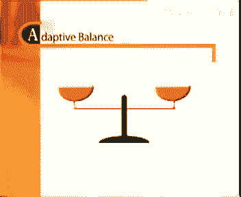

a e o的确很难维持下去，他们必须不断适应环境，一方面他们要对知识进行控制整合，以培养自己的能力，另一方面要不断寻找发现，检验新的观点，来为现有知识补充火力，existing knowledge。

公司保持动态发展的压力非常明显，就像骑车时，如果一方失去平衡，则很容易翻车，问题在于，企业也很容易失去动力及这种动态的平衡，最终业绩平平，如果你希望保持企业关注机会，保持适应能力。

维持这种平衡是关键的管理要求，a e o发展的障碍有哪些，人规模或大小可能是一个障碍。

规模越大，沟通就越困难，资源分配机制也越复杂，此外对知识的建立和利用也不困难，另一个问题在于，为追求效率而坚持重组尝试，对这类企业来说是毁灭性的，a e o并非完全有效率性，与更有效的竞争者相比。

对发展开拓和适应的渴望要求，a e o存在闲置，可利用资源或某种程度上的资源，短期不完全利用a e o的投资者，希望看到，通过不断的改进和降低风险而创造的价值，a e o成功运作的最大障碍是。

过度局限于现有的产品和服务，要突破现有产品和服务的约束，非常困难，也使得企业很难为发展新的更具潜力的业务，淘汰一些生产效率不高的业务和产品，多数营销活动和战略，都集中在对现有产品和服务的管理上。

对如何面对变化，发现新机会，甚至如何确定我们的产品，等方面的关注则非常的少，大多数经理人都把自己，限制在现有产品和服务的机会中，我们仍然受到市场短视行为，这个由来已久的问题的困扰。

我们把自己局限在现有产品之中，而不去关注机会如何出现，和我们应该向何处发展，这样的问题，几乎所有企业都会面临对领导能力的挑战，在a e o粒子当中的不同情况是，领导既是挑战，也是制约。

对自己的管理才能过于自信的领导，往往是变化的最大阻力，领导者应该能给大家以信心，并在大方向上提供指导，然后退至幕后，不再干预经营的人。

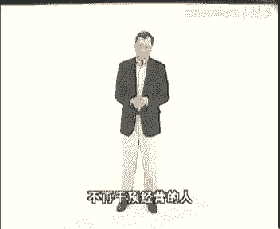

has a cost here，一位创业型组织的ceo说过，问题直到我干预的时候才会出现，我只需要鼓舞大家，然后再回到幕后，如果越过了这个尺度，便会在用人激励人和发现机会等方面有所损失。

一个积极进取的企业的执行董事，在管理层会议中经常会提这样一个问题，你们最近做了什么让我感到惊喜的事情吗，如果一位高级经理，近3年来只是执行了基金的预算目标，他便要考虑这位高级经理的去留问题了。

a e o最后必须面临的问题是，没有什么东西像成功那么容易失去，成功以后便容易满足，不思进取，也不再寻求变化，没有发现问题，使许多赤字运作，多种意思以为自己什么问题都没有，欧洲有许多这样坚持。

认为自己没有问题的私营企业和国有公司，像瑞纳斯菲利普，法国航空和阿里塔里亚公司，都认为目前的状况非常好，除非发生意外，惯性是从植方剂中最顽固的意思，尤其是气势上超人业绩的情况下。

