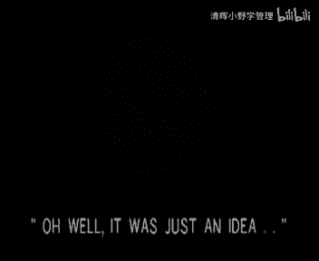
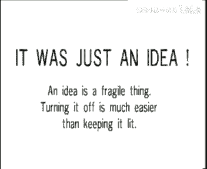
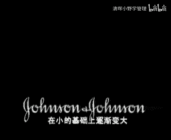

# 欧洲商学院MBA教程，涵盖你想只知道的所有内容，可根据副标题按需观看 - P41：创新管理2B-.管理中的创造力 - 清晖小野学管理 - BV1LM411Y79Q

公司想吸纳一个创造性人才，我们邀请两个候选人进入到我们的工作室来，创造力测试，首先是衡量他们的积极性或宽容性，啊啊啊啊啊，除了宽容测试之外，富有创造力的人经常能表现出下面一些特征。

characteristics，让我们从概念流畅性出发好吗，请两位准备好，请尽可能多地写出用纸夹子的作用嗯，你可以夹纸，你可以用它做项链，你可以做戒指，你可以做腰带，可以做手镯啊，你可以做耳环。

也可以做拉链，spectacles，you could，我们要进行的第三个特征测试，问题是心理灵活性，女士们开始下个问题了，how do you train，怎样系统性的训练你的狗。

去图书馆查这方面的资料，我货到黄页上找某个训狗师的电话，另外还有其他办法打扰一下，我想我已经知道您用指甲做什么了，很遗憾，时间到了，让我们看看心率灵活性的得分好吗，不错没有遗漏什么。

现在让我们测试独创性，你能从这朵云中看到什么呢，我从这朵云中看出他小额蝴蝶的翅膀啊，起泡的牛奶嗯，捣碎的土豆嗯，男士的剃须泡沫，shaving cream，你不能把云朵和指甲粘在一起。

独创性的测试到此为止，现在测试决策延缓性，你认为通过把臭味炸弹放在汽车里，来防止汽车被盗的这个想法如何呢，我不知道具体是什么气味，不过我觉得这主意不错哦，我支持这个想法，这绝对是令人厌恶的。

也是违背法律的，假如不是盗贼进去，这会让他窒息，现在是最后一个问题了，我建议穿蓝衣服的这个小姐先回答问题，我们现在测试候选人对权威的态度，假设我是老板，你是人事主管，我告诉你可以解雇。

那些在一个月内不能提出两个或更多想法的人，你对此怎么看呢，我们是立即解雇，还是先通知一下你想要细节，还是只要名单好的，那我是否可以刺激他们产生想法的能力，或者说难道我们不能考虑一下想法的价值。

而不仅是从数量上考虑吗，收集分数时可以看出，创造力高的人比创造力低的人更容易挑战权威，他们很少愿意相信上司是绝对正确的，他们希望获得信息，并渴望解释，在有些组织内，这样态度是进步的障碍。

当然这样的组织是最令人遗憾的，很明显，区分那些敢于挑战权威的人，发问的人，顽固不化的人，以及没有什么经过什么训练的，笨拙的人是很重要的，同时计算机得出最终分数，这分数当然取决于候选人的个人表现。

最高分是60，专门为上帝设置的，超过50分的人很少，这种人太优秀了，简直难以置信，得分在40~50，但是富有创造力的人，我们公司将尽可能挖来这位富有创造力的小姐，得分30~40的人做创造性工作是有用的。

得分20~30的人可能是被接受的，平均值得分处于10~20的人，是值得让他参与团队工作的，虽然我们不指望他发明什么东西，而得分低于十分，实际上不能让他参加我们创造性的团队。

现在知道了如何评估个人创造性能，让我们看看公司创造性的审核，并非所有的公司都参与这样的测试，许多公司都认为谈论创造力和创新是很时髦的，这两个词，每隔一段时间就会在新闻稿和宣传材料上出现。

promotional material and frequent intervals，越来越多的公司养成习惯，把这两个字放进年度报告，内容，说明书，与年度结果相关的广告以及公司宣传活动工具，不幸的是。

这些词虽然被经常使用，但却没有人去考虑其组织含义，让我们现在系统性地考察一下组织含义，记住整个过程的主要目的是创新，首先我们看到创新取决于公司所存在的创造力，创造力和创新要想达到，必须具备相当的条件。

这些是有内在逻辑联系的，必须以完整的方式去进行，我们还是一个一个的讨论，先从开始with the climate，打扰一下罗德先生，能否将氛围放在最上面，它是最重要的条件，因此我把它放在最醒目的位置。

我想着重的强调他，谢谢我更喜欢这样好了，开始吧，创造力只存在于那些全体氛围的公司，公司的氛围总是从上面开始，有些老板爱出主意，或者对他人想法表现出真正的热情，这会推动公司培养出适宜的氛围，不幸的是。

创造力的尝试经常会失败，我有个主意，你得非常谨慎，这主意有点太激进了，我自己是喜欢的，但是我们以前尝试过这个办法，要是这主意不那么困难就好了。

i wish it with that easy，oh well。

was just an idea。

适宜的气氛就是在公司内部，每个人都乐于思考，并且善于抓住每个合适的机会，相互沟通，产生想法的人应该受到尊敬，而不是被认为是奇怪的时间浪费者，汤姆皮特斯有一句名言，公司最紧要的任务就是学会欢迎。

来自每个人的创新想法，那么想真正形成这种氛围的领导者，必须要努力工作，制定包括自身的行为在内的多方位工作计划，致力于转变组织行为，最重要的有效的领导和高层人士的介入，会影响氛围的变化。

作为形成创造力氛围的一部分，高级管理必须找出抑制创造力的障碍，并排除这些障碍，尽管每个公司都应该诊断自身的障碍，但列出那些最典型的障碍还是有用的，组织结构僵化，绝大多数管理者极力声明。

时间是他们最为稀缺的资源，假如这一主张重复出现在公司内部，那么除了做的活动外，就没有时间了，创造力是一个想的活动，是需要花相当时间的，而且值得注意的是，从基层运作到管理或者跃层。

做和想的时间比例应该变化，or strategic levels，the ratio，想的时间要逐渐增加，should change in favor of the latter，越算越多的公司。

在他们的工作描述和评估系统中，引入这样的陈述，即需要播出部分时间思考，改善行为和业绩的新方法，以及在各个部门营造出创造氛围，要让人们留出时间进行创造性思考，还有很长的路要走，还有很多困难需要去克服。

3m公司经常被作为革新的编发，该公司有一个15%法则，即允许员工将一周工作时的15%，花在自己的判断力上，但前提是与生产有关related，大的公司比紧凑的小公司更易于受其影响。

这就是为什么在市政服务中，很少遇到重大的创造力，假如每个想法都要经过琐碎的手续才能实现，那么就没有什么人能保持热情了，在设立一个结构之前，必须很好考虑一下他对公司创造力的影响，与松散型公司的员工相比。

在高度集权型公司，公司的员工追求创造性想法的意愿更低，原因很简单，集权型公司想法要获得认可或赞同，必须要经过多个管理，自，这些公司必须花更大精力去刺激员工，产生不好的想法，勇敢的再次开战的大公司的。

典型例子就是强生公司，他的理念就是在小的基础上逐渐变大。

第四个大障碍是横向交流，当某个部门实施的想法，不能在同一公司内部交流，这将是极其可悲的，我们知道交流是有效管理的很重要，但是当应用到内部交流的时候，很多种仍然有，另一个大世界进口人才多。

有些公司往往以一种蔑视的态度来看待，自己员工的创造性，希望那些人才给公司带来创造性，而在3m公司内部，what a commer更乐于锻炼自己的员工，激发他们的创造力。

有关创造力的另一个熟知的障碍是斤斤计较，这是对公司内会计师和管理者，行为方式的一种毫不仁慈的描述，没有人能说他在每个公司都有一个重要位置，and every organization。

创造力要求一定的智力冒险和经济风险，当被财务人员卡脖子时，就很难会有所谓的创造性的，creative，it goes，这张名单，当然不是要把已经列出来的障碍排除灭，还有很长的路要走。

创造力所必需的整体推动力，需要注意的是，他们关于创造力和创新的承诺，会在公司人情感骂使命，共同价值观和目标中心有所体现，这可在创造规划过程中表现出来，可通过已经讨论过的产生想法的方法来解决。

尤其是头脑风暴，头脑风暴并不只是专门为基层操作人，高层人士使用才是最有价值的，if the board，假如董事会使用头脑风暴和情节构思方法，来展望未来和预测未来市场需求，那么这就对公司其余部门发出了。

大声而清晰的信号，启动我们的创造力吧，这很有必要，高级管理者也应该注意发掘想法来源，就像我们前面看到的一样，最后的目标创新是需要很多想法支持的，前面我把这称为漏斗过程，大量想法进入漏斗顶端。

质量高的想法在最末的，但是这些想法从何而来呢，想法可有许多来，首先是商业上有联系的人，如客户竞争者和二供应商，只要你有耐心去找，就可以从他们那里找到很多好主意，也可以求助于外部环境。

如尼龙搭扣或减少船摩擦力的粒子，当然也有大量人工客观选择，如听景构思或冠以想法会or wildest idea sessions，哒哒哒，情景构思的一个惊人例子就是由bel提供的，在一盘全新的磁带中。

他们展示了2000年我们的生活方式，以及那时他们的产品在生活中扮演的角色，就是谁哦等等，让我看看我的日程安排，请替我把和英特尔的约会推迟到下个世纪周末，我星期二前可能不在办公室好吗，假如公司氛围很好。

也充满了各种新想法，那么人们将乐意反应，然而清理机制也必须被这套追上，以维持那些可以帮助企业获得成功的想法，动力和热，firm你，现在该谈钱了是吧，要说啊，不是的，吉利物不必是金钱，实际上很多想法认为。

经济上的鼓励有可能使人们集中于创造力，而不是工作上的表现，出concentrate and creative instead of performing their job。

实际上波特教授有关经济降临的另一个问题，就是，当许多人都与新想法的产生有关时，奖金该如何分配，林一的障碍就是，在不同创造者之间维持奖励的公正合理，奖励是否该和带来的收益挂钩，还是简单的固定一个数额。

而不论创新的大小和本质，而且有些人认为创造力是人们工作的一部分，他们的报酬中包含了创造性的部分，该休息了，教授啊，好的一个更满意的激励系统，是一个非金钱性的激励系统，例如，公司杂志上列出创新者的名单。

张贴海报，描述最有创造力的想法，向创造性个人致敬，可放在个人办公室的证书，证明此人创造的奖章，奖励创造力的故事，在早期困难时期，公司必须进行技术创新才能够幸存下去，一个晚上，一位科学家到达总裁办公室。

带来了创造性的解决方案，总裁不知怎样奖励这位科学家，他在抽屉里寻找合适的家伙，才能达到的只有一根香蕉啊，我看了一部分，这根香蕉代表我最真诚的感觉，从这开始。

小提箱交真就变成了fox bo公司创新的最高奖励，大多数人甚至记不住这种不寻常奖励的起源了，already indicated，很多公司创造力是有极大障碍，就是cedures，他的存在。

对成功提高智能攻击的创造历史很重要，但最大的问题就是不知道该向谁，表达他们的想法了，如果缺少沟通想法的清晰系统，那么部门间的创造力交流就可能效果不好，这在大公司，尤其是跨国公司危险更大，这一图表阐述了。

忽视了想法交流的公司的必然情况，illustrates，a company that is ignored the necessity to，grapple with the need to。

许多想法是在不同部门，ideas circulating，但由于没有一个很好的沟通路径，最终都消失了，communication route or a focal point。

on the other hand，另一方面，这一图表也可以阐述，公司如何与阻碍想法和创新细节的问题作斗争，以保证他们能在整个组织内，throughout the organization。

值得注意的是，想法的一个重要来源是公司的销售部，销售人员直接与客户接触，在工作时观察市场，还能遇到其他公司的销售人员，他们代表了一家公司的耳朵和眼睛，涉及到利用所有好的想法和信息片段的系统。

是十分重要的，还有封面，许多公司在获得每个销售人员的想法时，都表现出巨大的创造力，以下例子说明了这一点，假如前面的步骤都用心的继续，那么创造力诺斗就会各种各样，现在需要的是有一个想法，以为这好像很简单。

但是当繁忙具有大量想法，有爱筛选时，这一过程就很容易拖延，结果是好的想法不能获得立刻的关注，假如这金朝人们提出创造性想法的热情和动机，就会下降，这种情况在行动偏见站上风时，经常出现。

公司员工在提出想法和建议是抗，那么至少高级管理者应当做到设置好程序，确保最好的想法一直活跃的，而且能够有机会在公司得到实施，筛选想法可以有两个标准。

criteria of attracting with the criteria of idea，compatibility with companies，needs。

the former reed to the attraction of the idea，per se，本质上是创造力程度，例如独创性难以复制于实施，容易使用，很有趣等，后者是指想法与公司具体需要。

解决具体问题的能力，费用，其他资源以及形象等的关系，第二系列标准可测出想法变成创世的潜力，很明显，两个指标都很高的想法，就是一个要费力去追逐的想法。

clearly the idea that is high，on both counts is the one to pursue with figure，现在让我们回到方法总表上来。

创造力的最好自己就是知道哪些想法不断实现，管理，创新和监控器，成功代表了整个循环中的逻辑高潮，萨克管理创新过程的一个重要部分，就是系统地列出一段时间内成功实施的想法，大多数通知监控销售内个或市场份额等。

实际的结果与原先的计划和预算之间的比较，为什么不能有个相似的创新监控程序呢，本期节目的手册包括了创新监控表，还有一个监控想法和创新之间，转化率的公司实力，which even monitors。

the conversion rate between ideas and innovations，这种程序的目的是提高20分，转化的达到公司所喜欢的一个想法，就带来一个创新的程度。

her idea surrated，这只是一种理想机会，to be reached，然而这是一个好的目标，我们研究了八个重要且相互关联的因素，他们要求高层管理者给予热情和持久的关注。

然而这种努力是值得的，因为它带给公司和员工的回报是相当高的，在完成本期节目之前，有一点需要强调，基于创造力是出类拔萃的最有力的要素之一，它能引导管理者去解决大大小小的问题。

可以激励相关的任何公司提高质量水准，最重要的是，她能帮助处于顶层的领导者，把创造性的想，这和公司应该奋斗的目标联系出来，很明显，那么其余员工肯定是乐意跟从的，西蒙先生准备上镜头了。

