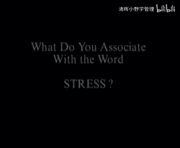
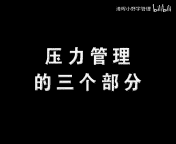
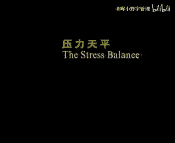
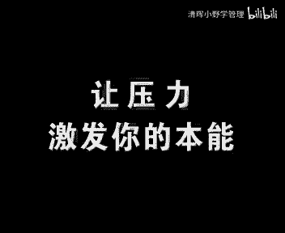

# 欧洲商学院MBA教程，涵盖你想只知道的所有内容，可根据副标题按需观看 - P21：压力管理1-.压力管理的两重性 - 清晖小野学管理 - BV1LM411Y79Q

in today's organizations，the only safety is constrain，变化已经成为行业标准，各类组织给的选择，只有不断的创新和比以前更快的进行重复。

于是便产生了压力，因而在未来的商业中，更多的需要人们能够积极的应对变化所带来的，positive way，对于你们以及生活和工作在你周围的人来说，你对压力的思考方法获取，妨碍了真正有效的压力管理方法。

那么在我们进行真正开始讨论之前，为什么不花上几秒钟时间，我想让你思考一下，压力这个词会让你联想到什么呢。

你有司机的打法吗，好了，让我们先看一看，你的同事是如何回答这个问题的，当你听到压力这个词的时候，脑海中的第一反应是什么呢，too much work，繁重的工作，没有空闲时间，头顶冲出心脏病。

中风矿工敌对情绪，睡眠有问题，酗酒抽烟，过量饮食或者是厌食，我不知道你的回答是否也像刚才我们所听到的，但是调查显示已超过90%的人来说，压力是与失落以及非常不愉快的经历向关联之，这些关于压力的消极想法。

往往是受了媒体的影响力，而他们恰恰是错误的，这正是我们想更正的第一个重大误解，如果你把压力看作是某种消极的，不健康的需要尽一切办法避免的事物，那么你错了，压力并不是绝对小心。

实际上压力可以产生非常积极的作用，它可以激发你的创造力，让你在工作中更加无私，在正确鼓励的环境中，经常面对和控制的压力，能增强你抵抗压力的能力，而且还可使你的大脑和身体保持最佳状态。

那些缺少良性压力的人更容易生病，而且寿命较短，把压力只看出是消极的一样优派，因为这的确增加了压力产生消极影响的机会，这种消极影响既有生理上的，也包括心理上的，对于成功的压力管理而言。

首先要求正确地理解压力这种现象，你对压力的控制程度，在很大范围内决定了你的健康和能力，而且当你在团队中工作的时候，你自身和同事应付压力的能力，将对团队的业绩起到决定性的作用。

你会发现压力管理所产生的结果，出现在个人和团队两个层面上，在这两个层面上，压力管理有两种应用方式，如果甘雨出现在损害已经产生之后，你就不得不采取更有效的方法，以应急有效压力管理不是本节目的内容。

当需要采取有效的方法时，你可以为个人选择因人而异的特殊方法，也可以为团队进行咨询，in this video，在本节目中，我们主要探讨预防性的办法，这应该是压力管理的最基本目标。

不管是处理个人还是公司的事务，预防总比补救要好得多，在个人层面上，我们的目标更确切地集中在预防性压力管理上，如果经理人不能恰当地处理他们自己的压力，那么你能期望他们处理好，他们所负责的员工的压力吗。

一旦你把握住了个人压力管理的实质，你就为应付团队阶段的预防性压力管理，做好了准备，agement corporate level，这将是未来一个节目的主题，在那个节目中，我们将仔细地研究。

预防性团队压力管理，是如何转变为高额投资回报的，良好的个人压力管理是团队压力管理的出发点，尽管团队压力管理的效果看起来更明显，让我们看几个实例，肯奈考特铜制品公司预计他的压力管理项目是。

矿工率减少了60%，医药费减少了55%，通用汽车公司的报告显示，在1986年，他开展的雇员援助项目，使矿工率减少40%，医疗和意外伤害减少60%，accidents by sixty percent。

而且上述实力都没有提及生产力的增长，以及员工面对工作室明显更加积极的态度，还有上级和下属之间关系的改善，但是这一切的开始都要依靠个人，以及他对压力的正确理解，如果你惊讶于压力不绝对是消极或者有害的。

这一基本事实，那么当我们研究压力真正的实质时，或具有更多的惊讶，在打针，现在请记住，压力处理得好，他会是一个完美的令人兴奋的朋友，而如果处理的不好，他会是一个敌人，一个死敌，对于压力究竟是什么。

最恰当的比喻是攻，如果弓没有张力，剑哪也到不了，所以弓需要拉开才能起作用，但是弓可以被拉到何种程度，取决于弓的质量，对于一张脆弱的弓，如果不想让他锻炼，那对他的拉力只能有所控制，结果就会使劲。

没有足够的力量而飞不远，相反对于一张坚实的弓，就可以毫无困难地施加拉力，将建设得很远，弓的质量可以比作一条曲线，弓越强，它可以承受的拉力越大，这条曲线就变得越高，越宽，箭就射得越远。

现在箭的射程代表一个人的效率，积极性，创造性，或者可以评价其表现的所有方面，换句话说，我们的表现或者箭的射程，是由工的质量和拉力决定的，拉力象征着要求，而这种要求既有生活和工作的环境施加给你的。

也有自己施加的，弓的质量，决定了这条曲线的高度和宽度，它代表你个人的适应能力，也就是以面对和应付各种要求的能力，或者说你对付压力的能力，ability to cope with stress。

从这个隐喻中可以得到的第一重要结论就是，相同的要求，对某个人来说是一种很好的激励和挑战，因为他们可以让这个人在自己曲线的最高点处，发挥作用，而对另外一人而言，就可能压垮他，后者的弓不够坚固。

无法伸展到要求的程度，你可以看到，要求决定了一个人将在虚线的那段其作用，让我们仔细地研究一下不同的阶段，看看他们对工作有何暗示，让我们回到这条又高又宽的曲线，以及那些特定的要求，在这种情况下。

适应力符合这条曲线的人能够发挥最大作用，换句话说，如果你是这个人，那么你给自己设定的要求，或者你所生活和工作的环境，给你施加的要求，正好与你的能力在同一水平线上，因此你的表现就会很优秀，不管你做什么。

你都会很高兴，你的身体为行动做好了全部准备，你的大脑全速运转，你的感觉相当敏锐，而且你能最大限度地集中精力，在这个阶段，更多的要求，甚至可以增加你的快乐和满足感，更重要的是，在这个阶段增加的要求越多。

你的表现就越出色，the better your performance，will turn out to be，实际上在这个区域，你并非一直都能发挥最大的努力，具体的要看你距离你曲线的右侧有多远。

但是要记住，在这个阶段，无论你做什么，即使是一件痛苦的事情，你也能从中得到乐趣，很明显在顶点的这一次，我们面对的是积极的压力，顶点本身代表了超越单纯快乐的一种境界，这时你需要超越你平常的界限。

或者你能力的范围，你将经受压力以及无可避免的，积极的和消极的情绪，negative emotions，在你的生活中，没有哪件重要事物，不是在经历过极限压力后掌握的，它通常是一种奇妙的感觉。

当你第一次滑雪时，当你第一次从高高的跳板上跳下时，当你初次体验暗示，当你第一次面试时，当你第一天做经理时，当你第一个孩子出生时，在这些时候你可以体会到夹杂着快乐与兴奋，疑虑与焦虑的复杂情绪。

最恰当的反应，这种感觉的是，当小孩子第一次试图放开双手骑车时，焦急和兴奋的将来，我们可以看一下，no mommy，no hands，所以你每次成功的应对压力，并且超越了你原来的界限池。

以便增强了自己的适应力，也就是说这些顶点表现的经常是很重要的，学习经历，随着时间的推移，它们使你的曲线增长，预防性个人压力管理的基本目标就是要确保，首先你一直生活在你的曲线的地步。

其次你的适应力要经常经受最大压力，从另一角度来说，预防性个人压力管理的目标，不仅是消除不必要的压力来源，而且要不断加强一从挫折中振作起来的能力，或者是不断增强你个人的适应能力，一定要搞清楚这一点。

人类天生就能应付大地，甚至几乎大地，只要压力持续的时间不是太长，因为超过一个特定水平，并且经过一段特定时间之后，压力就会产生非常消极的影像那样，stress will become negative。

如果一直不好，即使最坚实的工业，或者当如果压力太大了，尤其是又持续了很长一段时间，那么即使是最坚强的人，他的适应能力也会消耗殆尽，让我们适应力增强的不是压力本身，而是压力到恢复，由压力到放松的轮流交替。

如果压力持续的时间过长，你工作的效率便开始降低，你的曲线开始向右侧下降，这表示你将开始经历消极压力的第一种形态，在下降，刚开始的时候，你会觉得要求成为一种重负，请注意，这并不意味着你的表现不够优秀。

你此时的表现仍然和快乐阶段的表现，保持在同一水平线上，但是不同的是，你已经无法享受工作的快乐，而且在这个阶段提高要求，很可能导致你表现的更差，当你已经越过顶点而要求继续增多。

这些要求就渐渐成为一种真正的负担，直到最后，压力就会威胁你的心理，以及你的生理健康，physical，很容易就能知道你生活在压力曲线的哪一点，在越过顶点之前，你把增加的任务看作是一种激励。

一次挑战或者一项乐趣，而越过顶点之后，即使稍微增加一点压力，都会让你的效率下降许多，但要明白，当要求过低，与你的能力相差太远时，你的表现也会很糟糕，in that case，在那种情况下。

你的曲线开始将左侧下降，这意味着你没有完全展现出自己的能力，这是消极压力的第二种形态，通常它也会让你感觉不爽，在左侧曲线的第一阶段，你会感到厌烦，这可能导致你的表现还不如某个能力稍差的人。

即使对那个人来说，这样的要求仍然具有挑战性，quirements challenging，想想那些在普通学校的天才儿童，有时他们的表现的确比其他同学要差，沿着左侧的曲线继续下滑。

施加给你的要求就越不重要，你将会感到极端的困苦，这种情况有时会出现在人们失业之后，或者是当他们奋斗了一生，而毫无准备的退休之后，他们无法填补生活的空白，after life of hard work。

they are unable to fill in the void，在少数情况下，那些工作中一直非常积极主动地应对压力的人，在周末或者休假时也会遇到这种问题，当突然无事可做时，他们会觉得乏味。

也开始生病或者偏头疼，因此小心的调节你的压力曲线很重要，你应该是尽量保持在曲线的顶部，但是曲线的高度根据你所处环境的不同而变化，那些和主管以及配偶在同一工厂工作的人，他们经常说工作中配偶是这样。

可在家中去世，另一样，正如弓的复原能力随温度而变化一样，你的适应力会根据你所处环境的不同而，提高或降低，让我们看一看，当你的工作环境发生变化后，你的适应力会怎么样，当你的状态像这样时。

换了另一个不支持你的人做老板，你的状态就会下降到这个水平，或者你在一个公司是这种状态，而换了另一家公司，仍旧从事原来的工作，你的状态会上升到这个水平，预防性个人压力管理的目标。

不仅是让你的状态保持在适应力曲线的上部，而且要确保你的适应力曲线一直够高够宽，现在你应该清楚地认识到，避免压力是不可能的，即使试图避免也是不明智的，因为那样你将会失去学习和提高的，最重要的体会。

当然增加积极压力的最有效的方法是，改变你的工作重点，你的工作环境以及你的个人生活，然而许多压力是源于工作，与人相处以及生活本身的，living together with others。

你无法改变或者避免，你能做的是学会更好地处理它们，减少消极压力，或者是把它变为集体发力，当你身为一名经理或者领导者时，压力管理还涉及到创造一个良好的环境，使你的下属能身处积极压力之下。

你的责任是不要制造太多的消极压力，对经理人来说，这也是一个自我管理的问题。

对一位经理人而言，压力管理有三部分，自身压力的管理，工作环境的管理以及下属压力，your collaborators，我们已经指出，经理人压力管理的起点是个人压力管理，因此现在我们要谈谈。

为了更好应对压力，你和你的下属能做些什么事情，尤其是当工作环境无法改变时，而如何改变工作环境，以及如何更有效地管理下属的压力，将在一期节目中探讨，在这个阶段，那些声称承受压力能力很强的人和经理人。

应该非常小心了，他们倾向于忽视或者轻视自，己和别人的压力信号，这绝不是什么值得骄横的事情，to be proud，清楚地认识到压力信号是很重要的，因而经理人不仅应该，了解和认清自己的压力信号。

而且更影响我下手的压力下，一旦压力产生消极作用，一旦你处于曲线的错误阶段，那么要求就会变成负担，你的身体和意识就会发出警告信号，你可能会感到胸闷，心跳加速，无法集中精神，或者大脑一片空。

有些人会变得暴躁，更容易消沉，抽烟者会吸得更多，而另外一些人在晚间可能会失眠，这些信号是各式各样的，而且很重要，在配合本节目的宣传册中，你可以看到一份表格，上面列出了这些信号在情绪。

生理和智力等方面的表现形式，以及在行为上的反应，这些信号并不是有害的或者危险的，你可以把他们看成一种征兆，他表明你没有发挥，或者已经超越了自己能力的极限，但是如果这些信号不断的或者经常出现。

那就不是什么好兆头了，那时你最好认真对待这些地方，这对你来说是很重要的，seriously，有时这些信号本身也会成为一种问题，尽管他们是因为压力而产生的，但他们也可能增加或导致新的压力，那样的话。

我们就会陷入一个恶性循环，由压力造成的这些征兆，反过来产生了更大的压力，比如你由于压力而变得暴躁不安，这可能会引起别人的反感，从而给你造成更大的压力，再比如如果你感到兴奋，你可能会为此感到很担忧。

因为你觉得压力非常巨大，以至于list such an extent，do you actually begins to field tense，all the time，在消极压力下。

你的一些高级治理活动，比如综合抽象融合能力会受到损害，反过来，这不仅让你的逻辑思维能力下降，而且破坏你的创造力，这本身就足以让你更加紧张，消极压力对智力功能的破坏性影响，将持续更长的时间。

因为做决定是人们的一种本能，所以在消极压力下，当你的高级质地功能已经遭到破坏时，你仍要做出决定，而且这些决定可能不是最好的，因此长期承受压力的雇员，对公司来说是一种损失，即使不给公司制造危险因素。

他们不久也会并修一下来，这正是那些所谓抗压能力强的经理人，应该注意压力管理的另一个原因，同时这也是为什么他们应该察觉和处理好，下属面临的消解压力的原因。

personnel selection business，公司人员的选择，通常的依据是他们在压力之下的表现，这就会导致那些具有抗压能力较强缺陷的人，领导那些抗压能力较差及这种曲线的人。

因此可能产生同一公司，部门或者团队的老板和其下属，面对同样的压力时，产生截然不同的后果，ceo他们会发现在适应力曲线上，他们所处的位置完全不同，经理可能处在自己区县的上升阶段。

而下属已经越过了他们曲线的顶点，更多的工作会让经理快乐并且效率提高，但是对下属而言，会降低他们的效率，破坏他们的良好状态，在那些情况下，来自高层的压力和加剧的竞争，只会带来消极的后果，它会导致压力增加。

效率下降，所以经理人在接受新任务之前，应该估计一下他们的下属，正处在适应力曲线的哪一点，except newest，为了达到那个目的，他们需要注意下属的压力信号，这对工作是很有。

have to be attentive to the stress sign，如果经理人警惕性不够，而且要求已变成压力甚至负担的时候，那么下属可能早已到了压力曲线的底部了，difficult。

那就很难让他们恢复到良好的和高效的状态了，在这个事例中，预警信号可能被长期忽视，而且变得严重了，他们变成了危险信号，比如高矿功率，蓄意的破坏行为，背后的诋毁等，我们在宣传册中也为你列出了这些危险信号。

面对这些情况时，你已无法再求助于预防性压力管理了，你应该向那些本节目开始时介绍的专业人士，寻求帮助，如果无法做到这一点，不管是个人还是公司，都可能走向彻底失败，那再也没有压力了，不可否认。

察觉别人的压力信号并不是低，看一看小册子里列出的单子时，你会发现大部分信号都无法从外界观察到，只有本人才能感觉到他们的存在，然而在消极压力下的人，也会表现出一些可以被观察到的，经理。

人应该有敏锐的观察力，并且要创造一种宽松的氛围，让那些对压力敏感的人敢于直言，因为如果你抵御压力的能力很强，那么你也很可能对变化的发生不够敏感，这意味着你正在冒风险，直到不受欢迎的变化已经无法改变时。

你才感觉到他们的存在，然而在你的团队中，也会有一些悟性较高的人，由于他们能更早地察觉环境的改变，因而更早更经常地感到紧张，这让他们处于不利的境地，yet，可是他们主要的优势在于，他们能在变化很小。

很容易改正时，就发现那些不受欢迎的变化，hence this most a sensitive，因此如果抗压能力强的同事和老板，听一听他们的意见，这将会很有帮助，你要记住，那些对压力敏感的人。

更难形成自己的观点，因为当他们察觉到变化时，这些变化并没有被其他人所注意，在这样一个较早的阶段，他们很难将自己的直觉表述得富有逻辑，并且令人信，要是公司内气氛非常大，男子主义竞争激烈或者充满不信任感。

那么他们当然也不会取得成功，在这样的环境中，他们宝贵的及时的洞察力也会流失掉，所以要记住，大多数平民的雇员对压力的敏感性比你强，他们可以做出预警系统，当整个团队承受的压力超过了极限时。

他们会比其他人较早地表现出征兆，他们对于团队就如安全螺栓，对于机器保险丝，对于电器安装，或者以往矿井内用于预警的金丝雀，对煤矿工人那样重要，the next question，下面的问题是。

为什么工在某一特定环境下很坚固，并且弹性很好，而在另一个环境下却脆弱，其异端，为什么一个人可以积极地面对严厉的要求，而同样的要求会让另一个人崩溃，collapse，为什么一个人在某一环境中适应力较强。

而换个环境适应力就会下降，why are，为什么我们在某一环境中能发挥最大能力，而在另一个环境中却感到厌烦和焦虑，换句话说，究竟该怎样解释，适应力和永久之间的安利平衡呢。

我们已经看到，当你的适应力和环境对你的要求达到平衡时，你的表现自豪，或者说你的曲线最高，当你或者家庭和工作环境是这样的，要求超过你适应力的承受范围时，天平就会向右侧倾斜，压力就开始出现，反过来。

当你能够应付更多的要求，或者你的能力超过了要求，并且适应力没有得到最大限度的发挥时，天平就会向左侧倾斜，你会有一种失落感，为了找到天平倾斜的原因，我们应该检查一下两边托盘上的东西，也就是说。

什么是构成适应力，和加于我们身上的要求的基础，在这架天平上究竟是什么组成了他们的砝码，首先在适应力托盘上有块心理砝码，这块砝码底部固定，包括那些心理的遗传的和其他不可改变的品质，比如智力。

外向性格或者内向性格，但是随着你的成长，这块心理砝码不断增加重量，你所接受的教育和培训，日常经历或者工作，都会让这块适应力托盘上的心理砝码增加重量，一个重要的例子就是你学会了控制情绪的方法。

比如在受教育的早期阶段，男孩子就不馋哭了，因为哭泣是一种承受压力后，重新树立健康生理和平衡情绪的很好的办法，在这个阶段我们应该清楚，这种适应力和要求之间的平衡，就像公司的资产负债表一样。

如果我们想要两色保持一致，那么财产栏内的任何一次改动，都应该由债务栏内的变化与之相对应，在我们谈论压力托盘上的心理成分之前，应该着重指出，你要像关注公司资产负债表那样，关注自己的压力跟平，换句话说。

要记住你正在处理的是适应力，以砝码的瞬间记录，是，因为你要考虑到每种成分每天都可能发生变化，而你现在的压力平衡只是很短的瞬间，指，就心理砝码而言，你无法改变它的底部成分。

但你可以日复一日地影响他的其他成分，例如通过训练，你可以改变压力状态下的思维方式，或者用另一种态度去面对压力，这些都可以成为心理砝码，从而提高你的适应能力，strengthens resilience。

另一方面，生活中可能会出现特殊的情感伤害，这将削弱你的心理承受力，现在让我们看一下相对应的压力，托盘上的心理砝码，你的工作治理要求，或者说工作的难度是他首要的决定因素，不要认为这些要求。

只是为团队中的高层人士准备的，我们应该考虑到，大部分工作对治理的要求越来越高，现在我们很少说工人而改称为操作员，这绝不是什么巧合，影响他的第二个重要因素，就是工作对情感的冲击。

所有需对他人负较高责任的工作，比如护理职业都是需要高度耐性和技巧的，在这些人中劳累过度的频繁发生，一点都不令人吃惊，最后这种现象也在已出现在其他行业中，比如教师，警察，牧师和经理。

but now劳累过度是精神逐渐耗尽，这个过程的最终节目，只有在这种疲劳继续，随着最初对他人所负的私人或感情上的责任时，他才能被称为劳累过度，履行了高度的个人责任，却得不到足够的认可，是劳累过度产生的。

and a lack of a dream，and gets in the d，如果结果很差，同时这些专业人士又无法直接影响结果，那么这种情况就会恶化，这就会增加压力托盘上心理砝码的重量。

正如适应力的心理砝码一样，加在我们身上的心理要求也会每天变化，而且正如我们心理上的视频里一样，我们发现影响心理要求的主要来源，也存在于我们工作和家庭环境中，要求在心理上的分量。

受要求的可预测性和可控制性这两方面的影响，和is very much influenced，by their predictability on the one hand。

and controllability on the other，在应对心理压力时，可控制性和可预测形式极其重要，当你觉得态势无法控制或者无法预测战争压力，就很容易变得小丑。

当人们认为他们无法控制事态时，他们通常会做出更原始，更迷信或者是更不理智的解释或者行动，毫无疑问，人们心理上的差异起了重要的影响，林有一种，如果他们有最大限度的自由决定权。

那么即使在对别人来说压力已经很大的情况下，他们也能成，而另外一种，在比较容易控制和预测的环境中，在被告知该如何行事的环境中，才会感觉到最小的压力，正如我们必须要对压力敏感的人，也需要抗压能力强的人。

一个团队通常需要上述两种人，在人类社会中可预测性，很大程度上依赖于社会规则和正常运行的，等级制度，一个组织中的命令执行功能，下层工作人员会更紧张，这个普遍的规律适用于公司，学校和家庭，在压力状态下。

重要的是人们敢于做决定，而不是做何种决定，在第二期节目中，我们将深入探讨，工作中的可控制性和可预测性问题，解散要记住的是，作为一名经理，你应该在专横与过分放松权力之间，寻求一种适合自己的妥协。

因为一方面专横提高了可预测性，但又缩小了影响范围，另一方面过分放松全力，让你的影响范围更大，却带来更多混乱和不可预测性，在这个阶段更需要指出的是，对人们来说，压力状态，客观方面的可控制性和可预测性。

并不是那么重要，真正重要的是，他们的主观感觉，是那种在必要情况下可以控制局势的感觉，用莎士比亚的话来说，就是，事物没有好坏之分，但是人类思维让他如此，这句话也适合于压力，当这架天平向一侧或另一侧倾斜时。

大多是与我们观察情况的方法相关，而非情况自身所造成的，大多数你认为是消极压力的情况，其本身并无好坏之分，而你的思维，你的评价使得他们有好坏之分，对人类压力的研究清楚地表明。

引发压力的环境和你对压力的反应之间，很少有直接的联系，对于同种压力不同的人可以视之为与己无关，威胁危险，敌对或者挑战快乐，因而他们也会做出不同的反应，从漠不关心到害怕焦虑，逃避消沉或者奋斗享受。

在压力环境和你对压力的反应之间，有一种过滤器转换器，即你如何评价这种环境，这把我们引向关于压力的第二个基本观点呜，在很大程度上，你对自己能力的评价，决定了适应力一侧的心理成分。

而你对环境的评价决定了要求一次的心理成分，你会把许多自己的反应，特别是把自己的情绪，误认为是自发和难以控制的，实际上他们不是由客观环境引发的，而是由于你自己的认识，原则上他们是可以被控制的。

如果我让你想象一头粉色的大象，你可以理解一下，但是你能够想象自己需要的东西这一事实，这意味着你也可以很容易的欺骗一手，sideceive yourself，这种欺骗至少有两种不同的形式。

第一你可以在精神上适应那些客观上有害的，而且确实可以导致压力的环境，比如许多人在开始抽烟的时候，对身体发出的警报信号置之不理，再比如，许多经理无视自身生理和精神的警报信号，仍然疯狂工作。

透支生命直至崩溃，你可以使自己相信，身边没有什么消极的压力环境，但是从客观角度看，这种环境确实是有害的，比如工人可能习惯了车间中极大的噪音，他们当然不会把噪音看成一种压力的来源，所有的数据都显示。

噪音可以导致高血压和脾气爆发，第二在那些无害的环境中，你也可能感觉到紧张甚至痛苦，问题出在你的头脑中，你的确可以使自己确信，身边存在消极的压力环境，尽管从客观角度看，它并不存在，这种情况中。

最典型的例子是恐惧症，比如有的人害怕老鼠和电梯，再如有些经理把员工无足轻重的举动，看作是一种威胁，或者一次又一次地把并不重要的事情当做一种，important matters。

as a challenge，许多压力环境是无法改变的，因为他们可能是工作本身所固有的，然而这并不表示你在他们面前无能为力，相反你可以学习换个角度考虑这些压力环境，通过学习从另一角度评价环境。

你就可以把消息压力转变为经济压力，这可能是一种较好的解散，但是即使它不能完全管用，至少也可以减轻压力，但是你要记住这个方法有一种潜在的，这是独立，如果我一直对你说，不要想象一头粉色的大象。

我现在不让你想粉色的大象，那么结果很可能就会是你越努力的不去想，他，越会浮现在你的头脑中，对于那些减压的自言自语也是如此，努力的告诉自己，我不怕他，反而可能增加你对老板的恐惧感，努力的不去想我很愚蠢。

反而让你更显愚蠢，stupid，值得庆幸的是，认知心理学的研究已经找到有效的解决方法，这种方法可以在专门的工作室中是学到，在这个领域的研究，结论很明显，压力最主要的来源。

造成你的适应力与你面对的要求之间，不平衡的最主要来源就存在于你的思维之中，一方面你要对形势进行评估，另一方面你要对自己应对局势的能力作出评估，即使如此，你的思维仍是对付消极压力的最有力武器。

现在应该清楚的是，思维不仅影响你心理上的适应能力，和你面对的心理上的要求，而且也影响压力天平两侧托盘上的其他因素，其中之一便是你的生理状况，让我们仔细检查一下你适应力的生理因素。

同样的我们观察到固定的底部，也就是说那部分无法改变的生理状况，我们的体型高度生成胆固醇的方式或者残疾，但是同样也有可以后天获得的部分，这部分因素随着时间而不断增加改变，他们主要由你的生活方式所决定。

你的生活方式对你的适应力影响巨大，其中一些决定性的因素是体育锻炼休息，健康的饮食习惯，不抽烟饮酒，适量健康的睡眠习惯，合理安排时间和清晰的主次感，所有这些因素都在你的责任心和控制力，所及的范围。

与我们一贯认为的相反，在我们发达的社会中，大多数常见疾病和常见死亡原因，很少是由偶然的意外所导致的，他们通常是由无知和处理不当造成的，比如工作过于劳累，抓钱不放紧张，抽烟饮食过量。

过量摄入酒精或者咖啡因，以及服用其他药品，安眠药和镇静剂等，比起现代药物来，生活方式对我们生理健康的影响要重要得多，a very kit，现代女性可以清晰表明，生活方式对适应力的影响，统计数据表明。

女性比男性寿命长，这不仅是因为女性在生理上对某些压力，疾病的抵抗力较强和生活更健康，而且他们也更容易发泄压力，因为他们能更快更好地表达自己的情感，但是如果女性采取男人的生活方式，尤其是如果他们抽烟的话。

他们便会失去许多抵抗压力的先天优势，你的家庭生活和工作环境，每天都会影响你生理适应力中，一成习惯的那部分，然而你应该记住，他的大多数方面，都在你自己的责任心和控制力范围之内，另一方面，压力的实际成分。

大多取决于你的工作类型和工作环境，如果你处在高温或者刺激性的气味中，如果你的工作环境非常拥挤或者嘈杂，如果没有安全措施或者工作环境改造措施，那么这对你的生理要求就会非常高，幸运的是。

许多这样的要求都被规定下来，当比较你的生理适应力，和你承受的生理上的要求，是记住你的评价，或者说你对他们的看法是很关键的，这么说吧，由于采取了预防性卫生措施，生活方式的健康转变和工作条件的改善。

导致疾病最重要的，纯生理上的原因已经得到了控制，因而诸如压力等因素，已经开始扮演导致疾病的重要角色，但是要记住，你面临的压力，很大程度上由你对他的看法所决定，我们对他的理解影响着身体反应的方式。

从日常的经历中，我们都知道，某种念头和幻想可能导致生理上的反应，下流的笑话不让你脸红，或者仅仅是幻想色情的东西，都可以产生各种各样的生理反应，或者是当你被一辆警车拦住时，你就会开始心跳加速。

身上起鸡皮疙瘩，而且血压升高，看到这辆警车可能就足以产生这种后果了，every day，每天许多关于药物的文章都表明，当大夫和病人，认为他们正在运用一种有效药物时，有一半情况下。

这种药物的确会对病人产生疗效，即使那些药丸中没有一点有效的化学成分，心理机制就是这样影响那些决定健康或疾病，由压力到疾病的过程的，在工作室中，我经常会被问到，消极压力会对生理机能产生怎样的后果。

经理人想了解，压力是否真能导致心脏病或者癌症，压力是不是会诱发胃溃疡，以及压力是否影响哮喘的或者饮食习惯，or eating habits，为了能更好地理解心理因素如何影响身体机能，这个问题。

让我们回顾一下原始人类，当史前时代的原始人面对动物的威胁时，他们的身体会立刻做好行动的准备，战斗或者逃跑，or to flee，当你认为自己正在面临压力的威胁或者挑战，而且不得不采取行动时。

你的整个机体就会在数秒钟内动员起来，仿佛要面对一次生与死的斗争，以下是你应该记住的，关于压力的另一个基本观点。

在压力环境中，你身体的反应仍然像学巨人那样，但是学巨人所处的丛林环境，根本无法和当今复杂的世界相比，威胁现代人类的压力来源主要是心理上的，而你几乎无法用生理上的办法来解决，实际上。

那些威胁主要来自于心理和社会的环境中，你的那些反应，本能反应很可能会导致健康问题，psychosocial，心理和社会的压力，可以定义为一种被意识到的环境，对你的要求和你的适应力两者之间的不平衡。

这种被意识到的不平衡会造成下面两种反应的，其中一种，我可以应付，或者我无能为力，你可能会认为自己能应付这个环境，或者勇敢的战斗，或者积极地避开挫折，这两种表面上看来完全不同的反应，其实是密切相关的。

行为引发的焦虑和急躁，就像一对连体双胞胎，伴随着相同的生理或者生物反应，另一方面，你可能会认为自己无法应对这种局面，你所有的努力都是那么的重，于是你对此反应冷漠，而且沮丧，这种反应是很消极的。

是失败和无助的表现，这两种对环境的不同判断方式，导致不同的生理反应，他们激发不同的荷尔蒙系统，从而产生两种不同的表现，different classes of symptoms。

被激发的荷尔蒙系统产生肾上腺素，迅速释放能量，而且调动你的机体，这样在压力环境下，你就可以最充分的利用自己的感觉系统，肌肉组织和大脑，这时你的血压升高，心跳加速，你的皮下血管收缩。

那样可以让更多的血液流向肌肉组织和大脑，这也是为什么当你生气或者焦虑时，就会脸色发白的原因，最终你的感知系统更加敏锐，嗅觉灵敏，瞳孔扩张，听觉更敏锐，而且皮肤也变得更敏锐，你的呼吸更急促。

肺部气体交换的效率提高，it is quite impressive when you，这个系统让你整个机体转变到高速运行状态，所需的时间是极其短暂的，当你意识到它是多么迅速的时候，你会惊讶为你。

但是这种本能的对压力的反应，对于现代脑力劳动者所面临的压力环境来说，远非一种理想状态，当你的老板闯进办公室，给你一顿毫无道理的责骂时，当正要签订合同，客户却突然变卦时。

当同事的一个职业性错误搞砸了你的工作时，你的本能会立刻被激发出来，让身体做好战斗或者逃跑的准备，但是在如今的工作环境中，这不是对压力的恰当的怀念，当本能被激发的时候。

作为经理人的你不得不冷静地坐在桌子后面，听老板的训斥，作为销售人员，你必须对客户保持礼貌，而且你必须有技巧地指出同事的错误，因为你们可能还要共事几年，为了避免问题的发生，你应该通过良好的压力管理。

来控制你的本能反应，比如你可以改变生活方式，而且培养那些能够防止本能被不必要的激发，的意识机制和态度，如果你无法控制自己的本能反应，尤其是如果你还有不良的生活方式，诸如抽烟，饮食不当，那么过不了多久。

你的身体可能就要为此付出，现在，如果你不断地感觉到面临挑战，威胁或者侵犯，从而不断地激发这种荷尔蒙系统，那么你就真的有可能产生心脏或血管疾病，最理想的是在这种激发系统工作之后，当压力环境解除时。

恢复系统应该开始运行，恢复系统的任务就是消化食物，放松身体，以及为接下来的行动储备能量，它可以让游激发系统造成的所有症状恢复正常，这是非常重要的，记住你的生理适应力，可以通过压力和放松的交替而得到提高。

而不是通过压力本身，and not by stress alone，如果压力太大或者持续时间太长，那么放松系统也无法让身体恢复平衡，一直这样的话，就可能导致胃肠疾病，problems。

最后如果你对压力环境的反应长期无效，你的身体就会激发另一种荷尔蒙系统，它产生皮质类固醇，其中最知名的就是可地松了，可地松能够帮遭受极大生理创伤的失败者，存活下来，然而不断地感觉到失败无助或者被淘汰。

是很危险的，这种危险在于，那些分泌的荷尔蒙会抑制你身体的抵抗系统，一定程度上由于这种机制，你会变得更容易感染，患上某种癌症和衰老，在这一章中我们得到的启发是，如果危险性不大的预警信号被忽视的话。

就会经常出现生理疾病，如果在适当的阶段，你没有改变自己的生活方式，并且你最虚弱的一环已经崩溃了，after the medical treatment，has been co，在药物治疗完成后。

压力管理就会再次显出它的重要性，因为它能防止这些问题的重新出现，但是也有一些可悲的例子，比如一些经理人，即使在诸如第一次心脏病，这样重要的危险症状出现后，也不改变他们的生活方式，在他们的最后时刻。

没有一个经纪人会认为，我要是工作更努力一点就好了，可仍然有许多人宁愿选择死亡，第四个关于压力的基本观点就是，消极压力并不直接导致疾病，但它增加疾病产生的可能性，现在让我们把话题转向。

适应力和要求的最后一块砝码，按照习惯，我们把最关键的留到了最后，社会的支持，被证明是你的适应力中最重要的部分，缺少了它，压力托盘中就会增加分量最重的一块砝码，关键在于不仅客观上要存在这种支持。

而且你还必须感觉到这种支持的存在，从婴儿到老人，从手工劳动者到高级经理人，甚至还有宇航员，社会支持，对适应力的显而易见的积极影响，在人类各个阶段层都得到了体，现，在在所有可能的人群中，社会支持的作用。

不仅表现在它阻止了疾病的产生和蔓延，而且还表现在它减少了工业和交通意外的发生，current industrial and traffic accidents，the research。

这项研究是结论性的，和他人一起分担你的问题，忧虑以及快乐，对你的健康游戏，同样的，你的适应力中的社会成分，主要来自于你，从家庭以及工作环境中得到的支持，感觉从家庭和公司中得到足够支持的雇员。

与其能力相似，但得不到或者感觉不到这种支持的不远，可以应付更多的压力，有趣的是，职位越高的经理人就越依赖伙伴的社会支持，听起来有点奇怪，但是和你的伙伴保持良好的关系，不仅对你的心理健康有好处。

对生理健康也一样，因此如果一个公司的要求，损害了雇员的家庭关系，这个公司就会遭到损失，social support from home，你从家庭获得的社会支持，可能与你在哪种社会环境中出生有关。

但是在你生命的这个阶段，那方面，比起你每日可做的事情来说是次要的，对于工作中的社会支持也是同样的道理，你对工作环境的影响，可能不如你对工作之外的社交关系的影响，那么大，但是也不能低估你在这方面的影响。

尤其是当你作为一名经理时，在工作中首要的和最重要的社会支持，就是一个赞成你的老板，对于你和你的下属来说，的确是这样的，其次是来自同事的支持，一个为雇员提供强有力的社会支持的公司。

比起提供很少或者没有支持的公司来说，可以设定更高的要求，我认为在一定程度上，正是由于这个原因，才使得从长远角度看，内部合作气氛很强的公司，比内部竞争气氛浓郁的公司能获得更大的成功，在要求这一方面。

社会成本包括你作为配偶搭档，父母，家庭成员或者朋友时应负的责任，至于工作中的社会要求，大多数研究表明，消极压力的主要来源，与公司作为一个社会组织有关，准确的说就是公司负有管理的责任。

造成消极压力和健康问题的工作有如下特点，要求过高，对工作环境的控制不力，以及几乎没有社会支持，这也可以解释为什么在公司的最底层，雇员将面对更多的消极压力和健康问题，以及更短的寿命。

压力是经理人特有的问题，这种说法毫无根据，尽管他们高高在上，可能会感到孤独，但是承受消极压力最多的还是底层的雇员，随着这个有说服力的评论，我们对压力天平的探讨也结束了，这个隐喻表明。

你的适应力和施加给你的要求之间的平衡，是影响平衡的全部相关因素的总和，of all the factors influence，所以要求一测某个特定因素的砝码增加，并一定要有适应力。

一侧与之相对应的因素增加同样的砝码来补偿，你不仅可以提高你的生理适应力，还可以通过单纯的提高心理和情感适应力，来克服一种非常沉重的生活负担，不仅可以通过努力学习或者工作，还可以通过寻求更亲密的社会支持。

来应对一个时期内沉重的心理或者智力要求，如果你正在面对沉重的心理要求，那么照顾好你的生理健康或许会有所帮助，让我们看一些揭示压力天平相对性的例子，当40岁的吉米康纳斯，击败25岁麦克罗伊时。

他为了弥补生理适应力的不足，不仅需要依靠经验和比赛中的迅速恢复，而且首先需要坚强的意志力和心理适应力，在长期的艰苦的费神的谈判中，良好的身体状态以及关键时刻，下属坚定的支持。

可以避免心理上和智力上的极度疲劳，and intellectual exhaustion，然而问题是，当面对众多压力时间，如果你放任事情朝坏的方向发展，那么就会呈现相反的角度，在沉重的心理压力下。

你很可能自然地忽视甚至破坏你的社交关系，忘记日常锻炼，并且抽烟或者喝酒更多，而不是去更加注意你与配偶的关系，以及你自身的健康，让我们重述一下你应该记住的要点，处理好压力是你的朋友。

处理不好压力是你的死敌，压力存在于承受者的意识中，大多数你认为是消极压力的情况，其本身并不好坏之分，使你的意识对他们加以区分，压力激发你的本能，你应该学会控制这种本能，如果你无法控制对压力的反能反应。

记住压力并不直接导致疾病，但是它增加疾病产生的可能性，而且要记住，良好的社会支持，对你的适应力而言是决定性的因素，因为他也是影响你的压力天平的关键因素，你的工作在相当大的程度上，决定了你的社交关系。

所以我希望你已经明白了，将压力管理融入到整个公司策略中的必要性，但是还要记住，压力管理是以个人为出发点的，那些想对自己的压力天平做出评估的人，可以在本节目配套手册中，找到一个非常实用的工具。

当你完全理解了这些内容以后，你就可以看下一集的节目了，在下一集中，我们将主要探讨，作为公司或者管理策略的预防性压力管理，i'll see you soon好啊。

