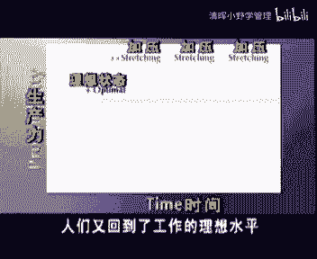

# 欧洲商学院MBA教程，涵盖你想只知道的所有内容，可根据副标题按需观看 - P23：压力管理2B-.成功地实施压力管理 - 清晖小野学管理 - BV1LM411Y79Q

节目将着重探讨，不能应付压力的人，不能应付压力的人，是不应该情商的，就是这么简单，心理学上的那一套根本没有用，三，很多经理我也不愿承认他不能应付压力，如果他们连自己的压力都对付不了。

又怎么能应付得了整个团队的压力呢，更不要说，正在不断地悄悄影响着生产力的压力了，我，不否认压力时现代社会的一个大问题，但我认为如何处理压力是一个人的事，说压力管理是一项公司的责任，未免太夸张了一点吧。

company true不错，压力管理是每一个职员的责任，正如你在上一期节目中看到的，每个人都要学会处理日常生活中的压力，but但只是一部，在工作中存在着很多，由于落后的人事管理而产生的不必要的。

可避免的，但又会影响工作的压力，所以至少你要找到并消除这些不必要压力，还是，我们当经理的已经习惯了压力，并能很好地处理它，对我们来说这种事是浪费时间，我觉得在我们的组织里，只有弱者才可能受益于压力管理。

true不错，压力管理可以使弱者变强，但它也可以使强者变得更明，为了使公司或部门的工作达到理想状态，经理们仅处理好自己的压力是不够的，职员们能否都处理好自己的压力显得更重要。

所以你要是个善于处理压力的经理，你就更需要知道，如何使职员们的压力起积极作用，你需要了解的是，对压力十分敏感，是一种优良品质，从个人而言，我绝不会像雇佣那些善于处理压力的雇员，的公司资。

现在我再一次将这个问题提出来，压力管理是一项公司责任吗，从公司应该提供特别的个人助理服务的角度讲，压力管理是一项公司责任啊，我们公司招聘的一些护士，医生和心理学家等，来监测我们员工的身体和心理的健康。

比起我们这些经历来说，他们在这方面更专业，对帮助那些已经因压力而崩溃的人们来说，这种做法是对的，但是你应该再想想，防止人们因压力而崩溃，以及呵护那些已崩溃的人们，只是压力管理的目标之一。

此外实行压力管理还有更多出于经济方面的，我不知道，但可以肯定的是，如果我们组织一个压力项目，大家就会认为我们公司存在压力，会嗯，事实上，这是事情的另一面，只有那些组织的很好的公司。

才会使用压力管理来提高工作水平，压力管理并不能帮助那些问题公司解决问题，问题公司需要更严厉和有效的距离，一般来讲，优秀的公司已经通过探索的压力管理，和打破压力经济来提高了业绩水平，需要花费一些时间吃饭。

但最终一般的公司都会这样做。

sorry，对不起，对于这个复杂的心理和社会心理问题，我所能说的是，当推动力起作用时，它产生不了什么效果，公司特别是那些小公司，只能按照最低的要求形式，尽管压力观点可以很多粉丝带来了明显对象。

一些心理还是不愿承认他是公司管理的一部分，进一步讲，这些经理将压力管理和那种过时的勤奋工作，对立起来，这是一个重大的错误，如果你对数字和机器的了解用于对员工的关键，那么你不仅会有负于你的员工。

而且也有助于您指那些数字和机器，如果你想在你的公司里引进压力管理，那么首先要排除我们刚才讲的那些甜点，从负面角度看，有一些令人不怕，第一个是工作压力的加，当很多公司想用更少的人做更多的事的时候。

当重组意味着缩减规模的时候，一些组织已经到了附近医药切除脂肪，而且要切除肌肉的地步，这样一来，每份工作的压力就不可避免的增加了，这一趋势并不仅仅出现在信息和服务。

information service industries，工业企业面临着同样的问题，蓝领工人们经历着，从身体压力到精神压力的变化，他们的工作不再是卖力气，而是按动开关或敲击键盘，他们的压力变成了。

要在正确的时间做出正确的决策，at the right moment in，信息革命在最近40年里，变化比过去400年还要距离，而且这些变化发展更快，压力不仅来自于某一单独的变化。

而且来自于一连串快速且不可避免的变化，尽管有些变化是必要，但变化已经成了一个白人的自由，即使在原来的工具，工具知识或技术够用知识，很多经理还是要引进最新的时尚，有多少次新一轮的改变。

并没有让你达到目的能力，你是否想过通过改进现有的工作方法，来提高功效，你是否想过这样做会减轻你员工的压力，任何改变的成功，说到底还在于如何处理人对压力的反应，如果你的员工发现他们的建议和要求不被采纳。

那么再伟大的技术或组织创新和失败，经理对于员工问题的态度，会决定新组织的运行情况，简单地将一切归于外部竞争是无用的，如果一个组织失去了竞争优势，原因往往不在外部，而在内部。

压力管理的目的不仅在于改善员工的健康水平，而且还包括在压力下提高工作效率和健康水平，你的竞争对手也知道这一点，研究显示，在过去的5年里，对于缺乏人员管理，不考虑承受着压力的企业规模缩减来说。

每1%的裁员，会降低0。29%的利润，所以你需要想清楚自己，现在法律义务也迫使公司将压力管理，视为一项公司责任，从70年代早期起，美国的公司雇员就开始起诉他们的雇主，追称巨大的工作压力使他们变得虚弱。

越来越多的人赢得了类似的官司，并获得了赔偿，我们15年来，一直以为欧洲国家在处理这种事情上，与美人不但在1994年，一名英国内务员因压力问题起诉了他的雇主，并获得了赔偿，今天在法院里。

大概还有100起类似的案子没有出门，此外一些政府也将预防工作压力，作为一种防御意，最后人道主义也要求公司处理好压力问题，落后的压力管理使我们付出很大的改变，一些国家经过计算得出。

这种代价占国民生产总值的5%，以及医疗费用的50%，所以如果每个人都能处理好压力问题，那么整个社会都会受益，这其中工作场所是帮助人们处理压力，完成度最佳成绩，从医疗费用的角度。

压力管理项目就是美国公司节省了数10亿美元，除了这些负面的原因外，我们有更强有力的论据，高进的我们的就是多巴克，压力管理可以提高生产力并促进企业成功，接下来我们将对这一问题进一步，哎。

压力发生于人与环境，也就是与组织或公司接触时，个人压力管理分为预防和补救两种方法，就像防病和治病，you are two totally different things，预防疾病的有效办法。

并不一定是治病的好方法，这是医学上的基本原则，饮用纯净无毒无菌的水，对预防传染病是至关重要的，但你要是得了病，喝纯净水并不能治病，于是我们可以得到减低工作压力的四种方法，一个组织可以针对职员。

个人或整个组织使用预防或治理两种方法，嗯最有效的方法是针对树脂的预防方法，这是一种旨在提高所有员工的生产力的方法，但使用这种方法的前提是公司基本运转正常，预防性压力管理并不能使一个运转不畅的公司。

作为一种互惠的哲学，他要求公司和个人在防范负面压力的同时，共同担负提高生产力的责任，那就这样做的目的并不是要消除所有压力，而是要找出合理压力水平，以便能发挥大家创造力和主动性，以及促进生产增长和发展。

考虑到上述原因，组织导向型的预防性压力管理要由上至下进行，如果管理层不能首先打破压力禁忌，下面的部门也就不会说出真实想法，并不是因为管理层不准备这样做，而你作为经理可以减弱这种优越。

an individual manager，事实上让管理层知道，通过你的实践证明，压力管理的成效是你工作的一部分，为了说明这个问题，我们回顾一下上一期也关于压力的那期节目的，主要结论。

一个人能够承受的压力取决于他的适应力，我们由此做出一条压力曲线，每个人都在努力的接近这条曲线的顶端，因为这样做可以使我们的能力得到最大的发挥，你在这条曲线上的位置，取决于你所处环境的要求，或对自己要求。

作为一名经理，你不仅要了解自己在曲线上所处的位置，还要了解你的团队里其他成员的位置，要记住，有的时候管理者还在向曲线中间位置前进，时而其他人已经到了曲线的极限，在这种情况下，经理也许还乐于接受新的任务。

但其他人却会因此而崩溃，为了提高你的团队的生产力，你要清楚整个团队的适应力，所以当你为自己的团队加任务时，你要考虑下面的因素，他们还没有被加压，要记住，如果你的员工，以位于压力曲线向下方向的位置上。

你不能给他们施压，当需要增加压力时，一定要明智，也就是说压力不要太持久，而且没有时间恢复，要给予员工大力的支持，让大家看到增加压力的结果，给予那家应得的承认，第三个条件是要认识到。

增加压力是成功预防压力，管理皮肤，我们用图来解释一下，这个梯形图反映了你的团队的生产力，人们可以在一个理想水平，一般水平或者低水平工作，人们会因为厌倦或过重的负担，而处在最低的水平，那些感到厌倦的人。

需要给予激励，促使他们进步，那些负担沉重的人，使他们重新达到一般水平，the average productivity，你现在可以使用预防压力管理，使人们从一般水平达到理想水平。

只有人们在达到理想水平时，你才可以通过增加压力而获益，增加压力是一个优秀的经理，对于一个运转良好的团队可以做，每一个部门或公司，都要通过热情和压力来完成任务，保持公司运转或建立一种新系统。

考虑到现在新的挑战层出不穷，那些运转良好的公司，确实需要那些有经验的经理，不时的给员工们增加压力，在这样的公司里，压力会产生很积极的作用，能够提高团队精神，士气和自豪感，一旦这项工作完成，压力不再增加。

人们又回到了工作的理想水平。

因此不要对那些处于一般水平的员工压压，而要先实行好的预防压力管理，个人导向的预防压力管理包括两大任务，第一是提高员工的适应力，第二是管理对员工的工作要求，两者共同决定了员工在曲线上的位置。

我们先来说说如何提高员工的适应力，作为经理，你可以从两方面改进你的团队，一是提供做好工作所需的知识和技能，换句话说，员工们是否已经拥有了与人，数字和机器打交道所必需的工具信息和培训。

然后你还应确保他们有能力，应付工作中产生的各种特定压力情况。

比如说他们知道如何应对挑剔的客户，不安的乘客，工作不理想的下属，文化差异及其他情况，于是你还应使他们的知识和能力，与其责任相匹配，记住对于一个高要求的人来说，一份简单的家务工作都会很有压力。

而一个没有技能的雇员却能胜任，我们还要知道，从心理或情感的角度看一份工作是不是太难，工作是否有挑战性，是否有良好的职业前景，或者从另一方面讲，你的某些团队成员是否获得了太多的提升。

在为员工提供了必要的知识和技能后，你还可以提高他们的适应力，主要做法如健身项目，戒烟运动和其他与生活有关的活动等等，还可以使用教授如何更好处理压力的，一般压力管理课程和录像，好的压力管理培训。

要针对压力的起因及人们评价环境的方式，上一期节目已阐明了在旁观者眼中的压力，我们举一个时间管理的例子，从我的经验看，如果对于评价潜在压力的态度不予重视，时间管理培训的结果总不能持久。

我们举一个这种态度的例子，我们都知道所谓爱面子的人，及那些很重视别人评价的人，他们一般来说是快乐和工作努力的同事，你可以问他们任何事，他们很少会拒绝，只要他们受到周围人足够的赞赏。

他们在压力环境里也可以干得很好，但如果压力很大而赞赏不多，他们就会变得脆弱，在时间管理方面，他们也很脆弱，当被要求做某事时，他们总能答应，即使他们不想做，因为他们想取悦每一个人，他们总是担负着太重的手。

以至最后在时间上出问题，只有在他们认识到过于重视别人评价的弱点，并想有所改变之后，时间管理的方法才对他们有意义，幸好在认知心理学领域的有效培训方法，你可以帮助人们忽略那些产生压力的态度。

juice你还好吗，当然可以继续吗，压力管理培训还包括那些适用于工作环境的，短的五分钟的或及时放松的方法，当某人刚结束了一次艰难的谈话时，不当一个职员因一个客户而不安时，他们不能拉下窗帘，打开音乐。

拉出垫子来休息20分钟，好的方法应该简短而实用，帮助人们在进入压力环境前，和处于压力环境状态中时，迅速的松弛下来，并很快重新进入良好的状态，上百人的经历表明，每个人都可以在一种情况下学会的魔。

即他们都要在5~6周里坚持，每天五分钟的放松训练，另外如果员工们不能按时练习你学会的技能，或不提醒他们这样做，任何压力管理培训的努力就会逐渐减弱，某种培训可能会很有效，但是必须要坚持。

人类合力学的研究表明，如果以一美元的课程费用为基准，一般压力管理培训的可测投资收益，大约是没有坚持的，以电话监督来坚持的，以现场监督来坚持的，分别为七八十美元，你要记住。

如果人们已经位于压力曲线向下的部分，培训课程是没有什么意义，on the negative side of the stress curve，那时课程可能成为，进一步降低效率和健康系统负担，培训课程。

只有当员工们位于压力曲线向上的部分时，最有效，或至少要在向下阶段的开始处才有作用，作为经理，为团队提供特殊的知识技能以及适应力，对你来说并不是很难的，事实上，如果你能够控制预算。

就可以将大多数工作委托给第三方处理，对于很多经理而言，为提高适应力，要做的第三件事就是给予支持，在上一期节目中，你已看到社会支持对于提高适应力的重要性，一个感到有支持的员工。

比一个没有支持或没有感觉到支持的员工，能够应付更多的压力，在工作中，社会支持主要来自于老板，也就是你我说的并不只是硬件上的支持，如为员工提供工具和设施，来于老板的支持，首先意味着人际交流。

我保证通过电子邮件管理是不行的，你的员工需要的是你，而不是你的邮件，我从下属那里听到的主要抱怨，与经理的主要抱怨一样，就是他们也就是上头就是不听我们的，所以在人际交流中倾听要用80%的时间。

而谈话只用20%，并且很多精灵之前那些已经说过或写过的话，其实情感也是一种信息，如果你真想知道发生了什么，你就必须了解字面里的情况，你不能用情感来管理公司，我的朋友，这就是我的想法，我理解你的观点。

但如果你只注意那些形式上的表达，你可能会忽略最重要的惊喜，还有如果你经常不表露自己的情感，你的团队会很难理解你，你的行为，你的目标和你的动机，缺乏这样真实的人际交流，他们就会感到不确定。

从而又产生负面的压力，所以不管你的公司在做什么，你作为经理都要真实的与你的员工进行交流，便于员工与其上司的不和睦关系，会在工作中产生最严重的压力，至少你可以将交流反映在你的管理方式中，除人际交流外。

管理军事博主都属于，很多经到期员工成绩同时又逃避指责，从而因破坏了团队的适应力，并产生出负面的压力，下面的情况是否会给你敲响警钟呢，no no no不，我记得我们的会面，只是我的秘书。

没有在我的成表里写明，我当然没忘，只是我的秘密，看着分开，yet right，three go s，这真的太糟了，我写了第一稿，并核对了计算错误，一定是后来出现的，我我会查出责任者的糟糕。

这已经放在我桌上两星期了，而明天就要开会，嗨，我明天一早就要这个报告，先做这个，现在做时间这么短，不可能了，没有不可能的事，如果你做不了，那你就不适合这个工作岗位，如果你想保持团队的生产力。

你最好勇于承担指责，并把成绩归功于他人，管理支持的，第三个内容是快速和大量的正面支持，每个工程师都知道，如果你要使一个控制技能，按预定计划发展并达到目标，你就需要不断的回馈，反馈越快越好。

很多人得到的反馈很少，而且很慢，只是在事情出错时得到怎么背，研究表明，有大量观点反对惩罚管理，即只有在事情出错时才干预，而在事情做得很好时，却不给予肯定，对于员工来说，如果老板不值知足。

就很难获得真正不值，而一个优秀的经理正是善于给予这样的支持的，真正的管理支持，还要考虑一，从适应力的角度讲，家庭的支持比老板的支持更重要，对家庭关系产生危害的公司也会危害到自己，作为经理。

你要避免这种危害，比如工作过量或缺乏计划的出差任务，这些都会破坏员工与其家庭的关系，比如说工作的改变，不仅仅会因为改变生物钟而影响人们的适应力，同时它还会破坏社交圈，对适应力产生负面影响。

所以如果工作的改变不能避免，就要最大限度地照顾到人们的生物钟，并且尽量减少对社交圈的负面影响，不要忘了作为经理，你管理的不仅是人，还有人与人之间的关系，你对于团队人际环境的影响是间接的。

只要这些关系影响到工作，影响就会是直接的支持，除了来自人际关系和老板，它来源于同事的支持和团队精神，所以你应该鼓励团队做，有些经理喜欢和他的同事们玩全数游戏，鼓励两方技能，他们认为这有利于提高生产力。

这有可能，但只会在短期内有效，团队长期的成功和高生产力需要更多正面压制，改善团队关系的最好方法之一，就是对自己负责的事情进行决策，我发现很多情况下，不必要的压力来自于员工们试图解决。

那些本应是上级解决的问题，at a higher level，想要避免这个问题，就做一个领导，然后做出决定，某人在压力环境里做出决定，往往与决定本身一样重要，一个让人产生压力的心理。

往往是因为害怕失去与其他人的友好关系，而不能做出决定的人，如果你不喜欢做出不受欢迎的决定，就不要当一名经理，也不要有孩子，人与人之间的矛盾是不能一点的，但也是可以妥善处理，也就是说没有敌意和进取心。

大家都只能获得很少的利益，矛盾可能会使你继续努力，迫使你找出你真正重要的东西，矛盾是互相了解的好方法，当然如果敌意太多，矛盾就会引起一大串后面的压力，这种负面压力甚至反映在你的血液里。

你的免疫系统会被抑制，适应力遭到破坏，所以你需要尽快解决部门里的有害矛盾，并确保他们不被转移到更低的手，然而在进行干预时，你要记住压力和永远充当第三方的定律，当压力在两个人之间产生时，第三方可以加入。

可以进入任何另一方，也可以以自己的观点干预，initiative，一般来说三方中没人知道结果会怎样，第三方可以减低压力，增加压力，或将压力维持在原来水晶，我们来举些可能的例子，甲和乙是矛盾的。

双方丙加入进来，双方都认为是饼引起了矛盾，这个体会羊可能不久就会被调整过开除，第三方可能会是一方的支持者，如果他支持甲，就会遭到你的反对，按100%第三方可能会是个全数。

权术者会利用甲和乙的矛盾达到自己的目，第三方还可能会是个斗牛士，斗牛士开始与甲发生冲突，甲在冲突中耗尽了能量，而被你轻易的消灭，最后第三方可能会是个调解，让联合国部队一样试图调解甲和乙。

但结果总是很高啊啊啊，作为经理，对于这种三角关系，无论它是发生在个人还是团队及其部门之间，特别是当负面压力分，平时，你要做一个清晰的预防性分析，你要知道直接对第三方的干预，一定能解决问题。

而且更重要的是，第三方可能就是你，如果你明显的决定去干预，比如充当调解人的角色，效果会很好，但你也可能不经意就陷进去了，这样你就很可能成为问题的一部分，而不是心理问题，你也许认为自己是个调解人。

但实际上已经变成了其他不利的，另一个需要关注这个三角关系的原因在于，第三方不论是不是你都可能显出压力信号，这时第三方除了显示另两方矛盾进展异常情况，接下来我们就要说说管理支持的最后一个内容。

以及对压力信号的关注，当经理在员工身上发现压力的征兆时，还要把他们拉回到压力曲线的积极，并且你不能通过进一步加压达到这个目力，因为你的推送会产生反作用，这是我在那些过度缩减规模的公司里。

看到的最严重的问题，如果所谓的幸存者被忽视，他们会变得自私，重要的信息得不到及时的分享，合作不能被实现，作为经理，你必须避免这种情况，因为你的团队成员们正在冒着自毁的风险，为了方便我们随。

本节目及关于压力的上一期节目，都提供了信号列表，在那期节目中，我们也对企业中抗压力的方法选择做了几十，我们发现那些能够承受较高压力的人，总是领导着那些只能承受较低压力的人，对压力有高承受力的人。

往往对信号的变化反应要signal this，另一方面，对压力敏感的人，遇到很细微的变化就会有反应，如果那些能够承受压力的精力，不注意这些信号，他们就会忽略及时的干预，为了发现他人的负面压力。

你必须留意他们行为的变化，在早期这些变化可能很细微，你越是了解你的员工，你就会越早地发现这些信号，当信号预示要出现大问题时，或显示已经出现了你并不以为然的问题时，你就需要及时的干预，如果不这样做。

信号本身会转变成一种压力，这样就形成了一个愤怒竞争，最后团队的生产力下降，员工公然崛起，出勤者的浪费时间增多，关于团队压力和稳定性的信息来源更新，这正是你想问咨询的原因，我们不怀疑顾问们怎么可以。

但他们睿智快捷的判断，很多都来自于不同的观察角度，cheap sources for the same sort of，会有一种更便宜的方法去浪效果，在你度假时，让同事暂时代替你工作。

他会从另一个角度看你的部分，想想那些刚上岗的新员工和授权者，在他们刚融进这个循环里，他们的行动能告诉你很多东西，如果你愿意听，他们都是很有价值的，if you listen carefully。

等一下我已经干了14年，你肯定不是说那些刚干了14天的孩子，就比我强吧，你把他们当成谁了，他们刚刚毕业，他们还什么都不知道呢，如果你这样想，你可能会失掉很多有价值的信息。

如果你想及早发现部门里的负面压力，特别是当你自己是个受承受压力的时候，你要学会提醒那些对压力敏感的人，tention to the comments，并且注意周围新员工的评价好，如果你这样说。

我倒不是说不接受有价值的信息，可是14天我已经干了14年，yes，no。