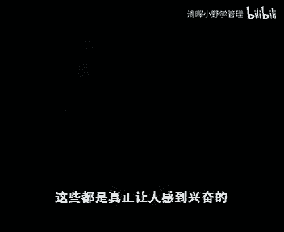

# 欧洲商学院MBA教程，涵盖你想只知道的所有内容，可根据副标题按需观看 - P2：企业经营与客户定位 - 清晖小野学管理 - BV1LM411Y79Q

不管消费者在合理合理接受服务，我们都要钻研经营，执照，经营是我们用来笼统地描绘人民币设备工具，以及为消费者运送货物的服务，如何信息的相关工作氛围上一切的特定词汇，当我们考虑清理的时候。

通常可能是第一个闯入我们头脑的事情，但是在制造业上，工厂只是供应链上的应用环节，七个环节还包括供应商，经销商，订单，承销商，video management，参观博士顿大学，邀请了前f一的教授。

来指导外地来的经营管理的时进展，我还successful，成熟的坚果品安全教育国共存长达25年八，因此对于揭示出当前管理社区正经历，更迭的过渡阶段而言，他是一个非常理想的人员，姐夫。

为什么近来经营与其他与消费者之间的关系，问题被提出来，并且受到了管理层的关注呢，迪克斯对经营有兴趣是很自然的，是大部分组织的经营，涉及到大多数的雇员成本和财力，有许多因素。

促使人们对消费者如何从经营发生联系的问题，产生兴趣，在某种程度上，这只是利用新的管理方法和经验的副产品，这些方法包括全面质量管理，准时制再造和基于会计核算的运动等等，许多组织已经发现。

这些新方法可以更有效的经营，贡献良多，然而他们也发现，在今日的竞争环境中，尽管效率有多高，但对于应付竞争而言还是不够的，manufacturing，一个制造企业的ceo，就挺像他的经营者主管抱怨说。

再从九分钟，减少时间和降低成本方面已经做得很好，但是我们的竞争对手也获得这一天，你所做的一切对于我们公司有什么大的价值吗，这个可以加一个很好的问题，他意识到一个好的经营远不如多人省的省心。

如果一个精英能够关注于满足记者的分班，他就可以为该组织提供一个竞争者，难以效仿这份长期战略优势了，in this video。

we will explain what customer focus is，本节目中我们会解释，对于竞争性和盈利性组织而言，为什么关注消费者是非常重要的，而为了使之更有影响和效率。

又是如何表达经营的设计方面，对消费者优先这一思想的，通过定位与客户的经营，我们理解了什么呢，什么时候又不开心，才能声称自己一分位于他的客户了呢，我可以给你一个医学领域的。

也许我们所有人来说都是很熟悉的经营模式，这是一个在加拿大发现的非常著名的，定位于特定客户的经营的地方，地点就在举世闻名的多伦多，12。33家医院，在经营方，法，务员对病人的了解程度以及对设施内心的意愿。

有很大的不同，organized physical，和其他大多数医院不一样，我们这里的患者拥有最高的治愈率，而支出却相对较低，本人后者是令人吃惊的，尤其在我们讨论的是一个私人医院。

而是一个国人服务机构的视频，这里的许多患者还每年都会回到医院，进行一次连堵的机会，因为这人说的是定位于特定客户的模范，我们可以把它和传统的普通医院做一个比较，首先传统的普通医院从事多种外科手相反。

修克斯基本把他的基因定位在一种客户上，在修改里执行的这套仅有的经营方法，还包括治疗疝气，本集之后，被从医院中种植的医生都被严格化的没落，因此他们对患者医学上的和纯属私人的需求，都非常熟悉。

并对所做的一切如何满足的需求也很清楚，这种深入的误解只是对客户了解的结果，这也是由于不同的环境下，从客户保持天地检测的原因，社会对此医生帮助患者登记，并如同对待手术一样的小心，实际上当患者抵达时。

第一次会见他的不是办事员，而是医生，对于所有的医院出院来说，年度聚会这样一个机会，他们可以借此检验他们工作的长期结果，并由此得知将来应该如何改进，同时徐汇也是一个收集关于患者的态度和新的。

需求信息的方法，你看相比之下，在一分和病人接触的通行证护士而已，成军才会，by occasional hd visits from the physicians，设计了一个复杂的气质入微的手术过程。

医院拥有低的斜坡形楼梯台阶，台球桌和其他许多工具，应该促进一种适度练习，因为修大发现，适度练习对加快康复周期很有帮助，为了防止患者长时间的经络，在患者的房中不允许有点血性。

由内行人员承担督促患者进行锻炼的责任，各位的医生伤甚至受过指导，病人直接走下生下来的训练，挑选医生的条件高，可我耐心照顾病者的技巧和一些知识，新来的医生会从最有经验的医生那里，接受广泛的训练。

那些医师经常监控给死的方法步骤，从中找出可以改进的地方，who constantly monitor，one another's procedures for ways to improve。

这点与传统普通医院的官僚作风形成鲜明性，这些地方的医师一般都是独立工作，没有相互协调监督，相对来说很少有机会相互交流经验，我所热搜是中组织的机构和政策，都有助于对满足消费者工作的关注。

这个企业中只有一个管理层，个体被赋予了广泛的责任，这就使得可以对客户需求做出迅速反应，so如果我对你已经很了解，可他们定位特定动物的基因，因为是水中，有助于对生命的用户宣布。

它也意味着要促进会送入一所的精确认知，同时要确保每个人都能对满足这些需求，有所贡献，apart from that，除此之外，方法的通讯应该能对齐放无色客户的需求，可以休想出来，科普太棒了。

不过不要被修杰斯的例子所误导，他并不是说其为了定位于特定客户，而只能有一种类型的歌，如果能够就如何对待所期待的不同患者，做出回应的问题做出创造性思考，普通医院也推出同样的事情。

在继续考证之前仍在使用的事情，让我感到迷惑，如果说第一的存在的话，为什么对立送废物和服务来说不是这个样子，根据定义，他们也应该回访时定位于特定的客户的，这个包已经送到研究人员好长时间了。

技术核心是描述经过的名字是必要的经验，设备传输用专用权的方法，专门技巧结合在一起，用以为客户用，现在管理方面的书籍都是用这个分开的内涵，来描述很多同样的东西，如果认为是有效率的。

他就会适应的技术核心却是这些奇迹，而最后难以供应的更高级的产品和服务，但是正如我所说的，有效性并不是评价经营的最重要的标准，其实是传统上我们习惯定位与效率，let's take a closer。

look at the difference，效率评测仅对管理人员是可见的，他们指出了，废料或者在峡谷的素养周期以及生产能力，利用系数，同样的显然效率评测是很重要的。

因为他们对商务运作所需要的成本和资金，有着直接的影响，但是消费者很少能从他们自己的角度看到，经营是多么的有效，而且更可接受的价格下，客户也不可能像关注获取所需的产品和服务，那样长时间的关心这一点。

有效性对客户而言是可见的，并且是有价值的，它包括产品或服务的质量，递送速度，服务的可靠性和反应速度，同样的，有效性的评测指出了，产品和服务满足客户需求的程度，不是影响了他们的。

coopposed to the cost of supply，而非对于收入产生来说，有效性是一个必要条件，而对于成本过程而言，效率是一个必要条件，企业必须对效率和有效性，这两方面评测都非常敏感。

因为他们一起决定了收益，很显然我感到有些奇怪，高级管理人员好像不知道有效性的重要，尽管他对消费者是有价值的，但是管理人员理解其重要性只是其中，或许是中国企业的其他机构，而非机动部门去处理有效性的。

他们避免了技术核心受到消费者的影响，这样经营就可以运行得更有效率，同时保持了他们技术和专业技巧上的秘密，而致力于和客户联系的企业和其他部门，被用来关注有效性的问题，你知道客户总是有一些小缺点的。

传送100个主意没问题，而且还针对一些注意，把注意力从实惠的产品和服务上引开的细节，如果你还想和他们保持保证隔离，他们就不会知道客户什么时候改变主意，但是他们有核心，以及可能需要在天上做出改变的。

而change operations，在公立的经济条件下，雇员不会试图提出和效率无关的一切，但是pc的环境下，从根本上是经营和消费者相分离还可能吗，因为深渊经常认为他们没有受到足够的帮助。

但事实是经营通过多种方式避开了消费者，一个方法就是利用别的人来阻止消费者，同给他们递送业务的人员直接交流，奥利弗已经习惯，客户所接触到医师这样类型的人，你是否有这样的经验，当你想见的是那些直接提供服。

务或产品的专家时，接待你的却是一些服务代表，销售和营销人员扮演着双重角色，他们导致消费者，并且是他们的企业购买，但同时他们也是选出选合理的客户要求，以改变清单设计以及其他国家的伤痕结局的。

能影响效率的内容，得益于他们的干涉，机密人员不用和大量的有效性问题拉扯到，并且可以把注意力集中到物资，有效的方法配置人员设备和进入方案，为了形象地说明这一点，可以假定在制造和低端产品和服务的人。

同消费者之间有一些强在强的适当位置上，经营的隐藏任务，就是把精力集中到，没有同时客户联系机构的根本任务，就是使消费者相信，产品和服务能够有效地满足他们的需求，当你已经成为第一批的案例时。

为什么消费者现在而关注经营的重要性了，是不是说效率的精神是不重要的呢，这两个关键的因素影响了我们的思考，首先消费者现在有更多的选择和信息，来做出购买决定，其实和竞争有关，现在有更多的商家以经营为武器。

为了他们的消费者份额而竞争，这些重大因素并不意味着，经营在暴力方面受到的压力较小，相反这个压力比以前甚至更大，但是尽管你不在享受不利于消费者的奢侈，但是他却必须要变得更有效率，啊啊啊啊啊。

变化的第一个动力是消费者能有更多的选择，并且在做选择时能更加激烈，由于一定的原因，如果不刻意有更多的选择，但更重要的两个因素是，当今世界上大多数地区的政治，边界的崩溃和贸易不染的降低，25年前。

美国的消费者对汽车设计上有三种选择，通用就我们和克莱尔等，快来男朋友那个小美人去中国厂家，众多的欧洲和日本的厂家之间做出选择，就像从韩国国其他地方的场上那里选购一样，我们盟的一系欧洲的消费者。

可以从更多的欧洲公寓商那里自由选择，就像从世界其他地方的公寓商那里选购一样，由于消费者已经取得了选择数量增长的优势，他们就变得更关心他们的金钱，所能换取回来的那些东西，70年代美国的消费者收入到。

他们从日本的汽车产量，可以用同样的或更低的价格，买到更高质量的汽车，就像从消费建筑产品和其他产品和利用的，选择中得到了真正影响，一般来说，对于新的，在其他国家，由于政府政策或别的因素的原因。

商品的选择是有限，关注大量的利益的选择，是息和通讯技术的革命，给消费者提供了新的，就是在回报助商的谈判中使用的筹码，其结果就是那些供应商对经营有何用的。

who needs pretty saviors operations have been created，近来消费商品分销渠道中的变化，就是一个很好的人，沃尔玛尼的强有力的零售商。

和像保洁联合利华高露洁那样的供应商，一起，经由他们掌握的关于终端客户购买行为的信息，来改变他们的商业运作的方式，180售商现在需要从供应商拿来获得，不支持流行产品和零售空间，他们也想享有快速递送。

零积压以及很多的弹性，天津化工得了我都说了，另外一个例子，这些人通过信息技术，获取了其他全球精英活动的新能力，他们能够知道某个供应商何时会在哪个国家，提供一个更好的价格或是更高质量的。

他们下一步就是从公路上那里要求更高的价格，最优质量和服务，而不用换原料的原动作是哪里了，荆州是从何处进入飞泄的呢，这是你改变的第二种因素，这是真的，传统技术是价格和产品或服务的特色，竞争越激烈。

竞争者就会寻找新的方法来迎合客户的偏好，那些领先的公司已经开始，一定知道精灵的有效性，对于相互的区分是一个强有力的同学，他们使用了许多革新，但他们的精英成为敌人武器，为了应对加剧的竞争。

发展出来的新的管理方法，有全面质量管理，准时制和管理团队，westing time and south managebteams，并且都要求作为人力和工作方法有根本的改变，看看另外的有效性。

基德你就可以更清楚地看到这一点，东京是新的关联名的命名中，全面质量管理，应提高客户工经营中获取产品和服务的质量，为目标本，直至和其他以时间为基础的竞争性方法的表示，通过经营产品的地摊服务更加积雪。

为高四环境工作组，对于消费的即时需求反应更灵敏，现在个人还赋予了当机立断的权限，这使得客户的问题能够得到立刻解决，卖给未来运输的企业，使用这些方法，消费者的期望指数expect。

结果是现在的竞争越发激烈，精神，好几年前的电子产业中，质量等级用美白或铅产品中的比例来表示，现在的标准则是在为百万产品中的比例，领先的公司是一使用更高的标准，10年前建立起的工业和消费品渠道习惯。

订单发出后数周乃至数月才收获，现在递送系统必须能够适应，对每天每小时乃至每分钟的变化作出反应，地方戏上的竞争还是那个后果，他对我们所理解的经营这边就发出了新的阐释。

过去这个词汇只是特指那些由场和销售中心的，技术人员和工人运作的一些互动，但是从消费者的角度来看，除了递送之外，还有很多给客户传递产品和服务的，提交订单是第一步，其次是接收和确认订单。

第三步就是开账单和从客户那里收取费用，第四步是给消费者提供售后服务等等，and so on，这些经营方法的每一步都影响着消费者，同时给了七爷这样一个机会，企业可以像关注效率那样关注有效性。

而把自己同竞争者区分开来，at the same time，工业化和压力是不经济的崛起，使消费者对开拓创新的无形天主更为顺滑，客户们现在要求服务业务，为他们提供工业世界的效率，并且269工业商业能提供。

可与服务器提供的最好分布，相比美的个人服务水平，斯堪迪纳维亚航空公司和米兰银行，在个人服务方面采用了一些新标准，比如减少客户等候的时间，这影响了消费者时间的期望值。

让他们认为在他们购买的所有产品和服务中，所耗费的时间都应该是这样的，太想，chart，我们现近几年，消费者的视角已经从第一性的蒙昧的，转变为工具，全球性更见多识广。

同时经营范围也戏剧性的一种仅有的生产任务，转成我们为企业的生产流程，以前只从效率方面关注经营的做法，已经被取代了，现在人们越来越关于从有效性和效率两个方面，环境进行进攻，则已经做出了反应。

而他们会继续从技术和方法为导向的角度，参与竞争，这就会使消费更高的期望，造成这些变化的因素，作用的结果就是对效率和有效性的更高需求，and that requires a customer focus。

但是你怎么舍得说你的企业关注与消费者的呢，我的迅游三个基本方法，可以测试一个企业在业务中关注于消费者的程，度，啊啊啊啊啊，第一个测试方法是评测整个企业感知开户行为，true needs。

这个测试成为他是灵敏度测试，光明行者需求还不够，企业还必须经过构建协调和激励，这就要通过第二种方法，this is measured by the second test。

这个测试就被称为以企业为中心的测试，最后第三种方法将指出，消费者需求和流程设计是如何一一对应的，这就是组织结构的检验，让我们来一个接一个的试试这些方法吧，奥特曼的分数用来评测企业，quirements。

联邦还要听你的雇员，为消费者评价一些有价值的重要性，这些价值可能让某个特定客户或某类，这不敢那么注意，这并不是在测试机构中的某个人，我们只不过希望客机过冬，至少有望的个人能够了解消费者的真实意图。

是好的，如果你想让小杰的非正式一些，你可以简单的和你的不跟客户谈一下，以便确定他们对客户优先的看法，the next，下一步就是把客户和雇员的反应比较一下，你确定他们相关作为选择。

你也可以让你的客户和雇员一个，正式调查这一部分来做标准的全球化制造业，global manufacturing，该书由米勒教授和他的欧洲日本的同事，米尔和阿尼亚，这个调查的个别部分是四个不同的。

一般消费者需求被划分为五个不同种类，第一个是维持着需求的灵活性，比如快速的设计变更新产品和大型产线，其次就是分解为三个pk的质量规格的一致性，性能和可靠性，实行一定要快速，描述服务需求的词汇是售后服务。

售前支持可用性和个性化，调查的最后一部分是价格分类，这可以通过两种方法测定，也就是在产品低价的重要性和使用上，低成本的重要性之间的权衡，告诉我为了确定公司的收产品而不务，毫无疑问。

这样的调查应该为您的公司，实际上包含在调查中的消费者需求是最重要的，关乎你公司的战略方向，企业的雇员和客户应该不干扰的完成这个吊车，他们要给列出来的每个需求打分，最低一分，最高七分。

一菲表示他们认为这个需求根本太累，而七分钟效率非常的，在一个规划分为很多个部门的企业中，做这个测试可能会非常有趣，看看内外部的评级是否一致吧，你能给我分享一些这个明你对测试的结果吗。

当然我们从这个理想企业的外观开始吧，一个理想伟大的分布应该就像这个样子，他们给你送可靠性的重要性的理解大致相当，如果你的肩膀对鸟不会飞的分布，图像看上去与其类似，那么你就可以确定是否已经达到了。

定位于消费者经营的第一个要求，你的雇员对客户的需求有更多的needs嗯，如果你雇员的答复和科普的答复相符，那么你的机构就已经通过了第二个以上，最重要的灵敏度测试，你雇员对客户需求的看法，符合客户的想法。

啊啊啊，另一方面，如果你的方法如下面的图标，那你就可以确定你的企业不够关注消费者，看看关于递送可靠性实际上有多么重要，企业内互动环节之间有些大的不同看法，所以没有雇员团体对客户需求和消费者的same。

perspective on this custom，as the customers，themselves have，我们刚刚看到的图表，是从一个非常成功的全球电子公司。

对他的雇员和客户的调查中整理出来的，也会非常吃惊地看到，如分布图所示的数据，都是由于经营功能和客户需求，历史上的相互分离所造成的，这些公司之所以能幸存下来，只不过是因为过去留一个或几个强有力人物。

对公司客户需求的透彻理解，但在今天这都不够用了，如果每个人都理解客户价值，那么组织就应该进行建构，即使每个人都能够按照这种理解采取行动，第七层也是表示第二个测试，企业定位测试是测定它能够测定企业的结构。

空气和基础机制，是可以按照他所理解客户需求而形成的，留下我早就收入的，而收的手不及，很多公司为注重客户提供服务，比如一家工业公司，会发现，大型的工业或政府客户会注重啊可靠性的同时。

另外一些具有快速安装特点的产品，是会靠一些小型商业公司的喜欢，即使公司只有一种产品，而没有别的选择，他也会发现会有不同类型的客户，通过不同的分销渠道，the moon，之前所设定的管理层数据是一个指示。

他指出了机构同客户需求的生活，第二个就是消费者类型的数据，这来自于最底层的组织单位，点击逐渐理想的定位与消费者的市面，是为了操控的属实层次上做出举措，同时这也便于最底层的组织单位，只为一种类型的消费。

让我们通过比较两种状态类型的公司，来说明如何进行这个可，这个图表描绘了一个有两个不同细分市场的，企业传统与功能的组织结构，在销售人员，工人和职员之上，有两个管理层共同的营销生产和财务资源。

用来给每个细分市场制造销售配送与核算产品，here这里，由于总裁是唯一汇集了关于消费者，生产过程和财务所有信息的级别，所以重要消费者决策的作用，必然要涉及至少两个管理层，而在这个组织图中还可以看到。

美国最底层的独立行为都属于消费和units，each of those，types of customers，五个女生一次的得分是二女二，也就是说，满足消费者需求必须涉及两个管理层。

而最底层的组织单位必须为两个部分服务，相反定位于消费者的公司的得分是一五合一，在一个级别上，得出所有关于消费者分区的决策是很容易的，这是由于需要对分区做角色的，所有人都是同一单位的一部分。

因为企业中最底层的单位，只为一个消费分局负责，所以每个单位都有用人，都不会因为别的客户的需求而分心或困惑，对于三分的企业，相对于二三或四二十九分的水平来说，能更好的服务为他的客户。

但是在现实中获得一个理想音乐，老是不那么对，争取一一的分数真的现实吗，需要很多别人考虑的权衡，因此特别是在复杂的演唱中，其中一个好分数是很困难的，另一方面，对于企业来说。

改善结构以便能更好的定位与消费者，则经常是客观，特别是如果他们能认真地考虑他们的假设，比方说在构造你的企业时，如果你把定位于消费者作为一组织一来考虑前，一定要认真考虑经营盈利中的角色。

拥有一个此类理想的定位，与消费者的企业可能会很昂贵，意味着需要成倍的努力，所以可能有些让人厌烦，每一个层次都必须拥有各自的营销生产歌，没有人家反应，然而由于不需要什么管理人员。

这样的结构通常并不会很需要你，即使定位于消费者很花钱，请记住，效率和有效性都会带来和带来的任何额外成本，相比定位于消费者的企业，由知网赚取更多啊，多得多的收益，当我们开始关于企业中心测试的讨论的时候。

以声明自己的结构是他们，那么企业中心测试还测定了一些什么别的呢，拿到世界杯中心，要对机翼的结构有很多改变，还有两个，另外的可能更多的是，首先是在企业内工作的人员配置。

其次是能够使企业无论做什么都很有效率的，配套的基础机制，为了确定配置和技术机制，对消费者的摊位的目标是否有帮助，或是否有所偏离，这两者都不能接受检测，企业的配置很难描述。

而是一个简单的办法是考虑一下其中的人设，基本上都能有人愿意从事他们的指控工作呃，解决公司的问题或从外部向客户靠拢，以及他们表现的机会，我们在危机中，如果企业的第一个反应是关注对内部的支持者。

还有一个部门的影响，那么这个企业就拥有一个内向型的配置，相反一个外向型控制的企业，而对危机的第一个反应总是关注行动过程中，对客户的action on the。

and what is supported productive，contributes of organization of focus the organization。

企业的配套基础机制支撑着企业的结构，维持着它的配置，让我们来看看关键的研究，配套基础机制的关键要件，是执行客户定位的人力资源，提供信息和指导资源分配决策的体系和政策，工作状态测定。

确保政治行为的奖励制度，态度视角，那当然了，the perspective and finally，of course。

how can you tell what kind of supporting frastructure，and most suitable for a customer。

focused organization，给我们少将再一次非常抱歉地说，没有什么简单的损失，然而通过检验消费者定位壁垒的数据和有效性，您就可以理解基础机制提供的支持程度。

让我给你们一些最一般的啊壁垒的例子，比如在人力资源的努力，都是无本训练或者技能发展，迫于对其他文化和语言的领悟，在体制和政策方面，对消费者定位的壁垒可能是迟缓的，客户反馈，客户和雇员都搞不懂的基础。

结合法律的规定，规定太多，但执行不严，已经成为规品，那混乱的管理费用，overhead education leading to inaccurate coates。

but it comes to performance measures and rewards，当实行批订购奖励的时候，以有效行为，大家过多关注校园国产业绩，实行奖励。

而有可能会造成对客户定位的障碍范围，我们当领导者的设定价值的行为前后不一，或者对社会的目标缺乏支持，如果设定较低的一个情时，让我来告诉一下我们迄今为止的论点吧，to measure。

its security will be extended to，which is a shared vision within the organization of。

what it is that customers value，我们第二个应该是要做到这一点，we can do this。

but in a number of management that have to be climbed before，customer related decision is made。

and the customers that the lowest organizational units，我们还看到了两个对齐，一个是disposition。

which are to be external and another one for structure of the way in。

which human resources systems and policies，啊啊啊，那他究竟要衡量什么，设计之间有多么的契合，这波是四个要素，第一个是射线的传递和布局，这决定了谁在谁的附近。

谁能在进入精确的沟通方面有重大的影响，communication，其次测试检验了公司内部特定工作流程的设计，很明显，这对于在经营的过程中确定时间成本。

获得控制质量的能力而言是绝operation process，剪下来经营结构测试就检验了制造或购买决策，这些角色决定了内部采取什么行动，会产生何种及时性的影响，才决定了我们会允许别人做些什么。

测试的最后一个要件是采用的工艺，工艺可以影响生产力成本投资，我已经明白了，经营技术包含内功，让我给你一个为了做出这样的判断，而合理应用的简单例子，你来给我指定一个我们大家都很熟悉的产品吧，关了好的。

让我们来看一个生产摇椅的公司啊，还是不想像这样的公司，服务及两位不同的事成了，因此他也是一个很好的例子，ban这两类消费者的购买习惯，和针对这个细分市场的分销渠道是大不一样的。

他做了我这卡准备走剧组的态度，来一个为了低速不让的意思，客户往往愿意等上三四个月，相反儿童时老也是用低廉的图纸，松木制成，在选定付款之后，合作所有力集团儿童时也已走出管理业，for it。

现在让我们想象一下，公司的机构和经济结构的architect，传统上这样的公司会在另一端，在另一个，所以何况您建议去完成，我们还给组件订单登记和货币机架等部门，是一个一这个机构布局是高效能的。

这种品牌揭示了一些经验的特点，比如工作流程，你们现在所要做的就是检验这种经营结构，是否能促进公司被索要服务的，两类不同部门提供服务，下面评估结果，左边我们列举了经营结构的所有要素，机构工作流程。

制造购买决策，所有采用的创意，我想评估基于每个细分市场服务的场所，这是在玩do啊啊，让我们来看看两者的情况，很明显，针对两部分市场的设施设备布局都是差，他将应该登记生产和货品计价分割参与。

这使得和客户需求的交流，并在实际上变非常困难，此外还能你的设备分组，使得他们过分看重工具的专业性，而不是人，原来大批量生产会当时打的是头，而通过苏联生产，甚至两个飞市场的功能性设计就会提高。

成功而不达的狗粮的天使也是小虎无敌，时间的漫长，我们为了提供工作流程，我的近百个公司是用极限版的原料，实际上很多这样的公司都是玻璃做的，这可能是非常有效的，因此就儿童部分所关心的而言，值得凭一个良好。

我记着这里我们要准备的是高产量，相反对于成人部分，这可能就既昂贵又复杂，其实不可能把为这个细分市场生产的精加工的，也是弄坏，也没什么好惊奇的，因此这个结构对成人部分市场的支持就是差，由于智能的原因。

公司不打算把盾工具和组装工作准备出去，这也是因为这些经营活动，可以给他提供关于抑制设计的必要知识，相反公司会把木材烘干业务转包出去，这个方法对于两个细分市场，可能都会判定为一个效率的。

所以都因为良好的经营结构，测试的最后一部分关注的是公益农村，可以想象，这样典型的公司肯定会为了高精度切割的能力，各方面不同摇曳风格的设计，而选择自行配音和做好，接下来对于成人版的生产来说，小也是很多。

不同的歌还是非常必要帮助的，style，然而这对儿童市场而言就是一个糟糕的决定，这是因为，你看他们相对而言，因为这个市场的下场竞争所需的只是低成本，the angel imagin。

这一假定符合的最终结果表明，摇椅公司的经营结构，对于两个客户分区来说都是中等水平的，对于一个分区来说是有效率的，因而对另一个分区来说则是无效率的，而对两个分区都有效率的选择。

对那些对两个分区都无效的选择抵消了，但是如果我穿进了领子，这个裤子的节奏创作应该是什么样子的，他本来应该从客户开始从事，由于药物这两种完全不同的消费者，这也应该在它的结构中得到反应。

北京的例子是很简单的，但是现实往往是非常复杂的，我想他会按照下面而同样的，由于美国的细分市场实际上都各自经营，设备和工作流程，也被经常安排用来满足每个细分市场的需求，会员分为特定细分市场的客户开服务。

这样的机构布局，有助于促进所有雇员之间的有效沟通，同时也给员工们提供了在外向的客户定位，中等环节意识的联合体，那么在摇曳过程中，人们才是可取的红包流程，按照广东人的公益。

由于布局独立于为每个分区服务的经营，和每个分区九成制造购买精美的工艺，则可以定做的与客户合同部分的经营，谁挖的动员量光电系统及适应高质量的要求，超人部分的今年可以发展自己的系统。

以用来管理与低产量和高级性价关，儿童部分呢严控c性格可能更压缩了，新车生物本都可以保留高精度的钻孔和切割机，没有什么折中。

we have been changing from extraditional architecture，focus to a more customer focused organization。

and i already face with a huge task，the company was slam with its customers value。

educate all of its emporaries in these values，remindsets of the people in it。

and the infrastructure that supports it，it must investing new technologies rearrange。

and we think its facilities and broke down，all the established working，人员构成员的工作和阶层之间的必然，每一个企业还有个想象。

他的成分复自身，第一个重要的因素是企业的计划和准备，实际企业雇员的部队，传统的计划开始于什么，是欢迎，其二，我自己的分析方向的体验是内向型的，从前的时候我们坚决，如果您想让您的成绩变得更加接近消费者。

认为您就必须改变您的计划和心思，根据以便它能变得process，so it becomes externally，orient，it has，它必须以消费者和他们的价值观开始，最后再以此作为解释。

它必须像测定效率那样，按照有效性的标准确定企业的灵敏度，定位和经营结构，when i look at it like that seems so very simple。

but how do you come to communicate，such an initiative for the rest of the organization，我也by好的。

莱特公司展示了一个方法，只是一个中型的设备，人家出资的管理人员，为他们的雇员和客户准备了一个特别，这是用来帮助他们理解正在发生的变化，以及他们怎样影响着企业和客户的关系，这位是公司的总裁。

猴子先生正在介绍莱特林的变化的节目，无名决意抗拒地，还有一点像一个商业运作，如果你不随停电或者美式维持竞争的平衡，你的结局肯定是因为失误而被抛弃，最终没能用，最近比赛和商业运作还有另外一件相似之处。

集团被派出技能的责任，为了达到一个共同目标，一起工作，要具备团队中的世界能力，这就是本节目所，自从1923年公司组建以来，适应不断变化的市场条件，在最强大的一，但这并不是拉丁能够不断成功的唯一原因。

作为领域内的领导者，就像别的体育运动足球比赛里，只需要扫一眼积分，拍摄质量是赢局输，这是衡量商界或者让业界的成功，具有一步的目的，这是因为销售结果往往并不能说明一切，在我们不断地追溯。

改善组织和管理企业的方法的过程中，艾德森在天国业绩时追随其他公主发明到来，做法是很重要，这也是文艺现实的方法，你看看消费者到底有多么满意，这一点确实非常非常的重要。

今天当许多设备已经比过去复杂很多的时候，即使我们服务的人们，也比以往作为一种节目做客户的期望，达到了历史上的，这就是为什么除了专用的生产车间，制造车间和支援小组之外，组建令消费者满意的团队。

成为了物质结构背后其同意的原因，王为什么，就是为了确保我们的所有努力，都是消费者最终的马力，简单的讲就是刻不定位，莱克星近卫程序的设计，目的是用来达到一定数量的目标，这些目标有助于我们对公司和消费者。

最大化利益的成员们工作，我强调一下，这些有计划的机构变化，是为了推动我们在营造公司的方式上，发生根本性变化，这其中的变化还不足以帮助，不要为了让对客户需求做主要的事，首先我们要使消费者可以更轻松地。

和我们进行交易，其次要改善流通收益中先来先得的选择，第三项权利给算短时间，随着发生的所有这些变化，看看这个过程到底是什么，就是很重要的了，这是一种反思，是对我们承诺抓住任何机会改善公司的反思。

所用的方法，应该有助于我们吸引和保有那些最能干的团队，这些人都是我们应该尽可能招揽的，这也在很多公司变更，被看出是个现实问题的一种必然反应，但是很多成功的管理人都明白，变化是连续的。

由于来自琼斯和其团队中的每个成员，都等着在，这种值得每个人投入其中的企业文化里，变化就是创造性思维和员工授权的必然结果，然而对于另一些人来说，变更是有点危险，但确实是对我们所有人来说，只有让客户满意。

才能给我们以真正的工作保证，我们想提综艺中有可能超越客户期望的氛围，因此团队中的每个成员的贡献都应该得到认可，我希望从你们中的任何一个人，分享到那些大胆且具有建设性的创建，带来的落实而已。

这些都是真正让人感到兴奋的。

历史，在拉变化的范围零时难以去除广泛，你能告诉我们，为了更贴近消费行为，都需要打通前方，在消防和准备之后，资源是变装过程中，真正的第二个至关重要的因素，当你听说对于这样的一个方法而言。

所需最重要的资源和金钱无关时，你可能会感到震惊的，最重要的资源是时王经理需要用它来克服的，普洱变态的地区，最近我做了一个关于某些公司经理，主管人员的调查，第一次包括施特拉斯，艾克啊，李维斯。

不是拿到所有这些公司，都处于向客户化转变的过程中，下面是他们所考虑的五个重要的方舟，表示障碍的重要性，都可以看到其过失所遭遇的第一个障碍，反映了认识剧情的难度和所需的改变之后，思其次就是对别人化的恐惧。

由于很难想象变化，不会对企业中的一些成员造成痛苦，因此变化是令人畏惧的，对变化的恐惧是无法轻易消除的，你有认识到这种痛苦的经历，最后必将获得过多的补偿，才能克服它，促使企业对客户需求反应更加灵敏的变化。

最终会带来更高的伤害，更多的工作机会，以及得知企业在创造性方面的结束，动画所带来的苦感，这个过于频繁的有效性为代价来过分强调效率，第四个障碍，持续的一个过程导向，对于客户需求和布局工作流程。

制造和购买决策以及公益的相互连接而言，过程导向是必不可少的，第五对变化最大的障碍就是领导人员，你也许他拥有丰富的企业经营管理，保险，拥有正确的观点，结果真的是勇气，尊敬的人很少。

而这些人高产业跨越变化带来的困难，进入一个以客户为主，他们还不是单纯所说的关于企业最高级别，他的工作之前，我们所讨论的结构更加相处和平台，其中所需的大量领导人员确定需求，我们希望调查的结果一定是。

最重要的障碍都会人，投入足够的时间和精力来克服这些障碍，非常重要，overcoming barriers，但我希望不会被那么死过，其余的注意力首先使用在这些壁垒上，他绝不会变得那么加以消费者为中心。

我非常希望这个节目可以给你提供一个，开始行动的强大动力，jeff有你和我们在一起，使我们受益匪浅，让我对你的奉献表示感谢，同时也谢谢你们，希望所有的观众在努力迈向化定位的过程中。

