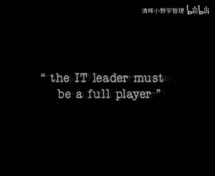
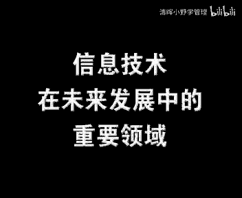

# 欧洲商学院MBA教程，涵盖你想只知道的所有内容，可根据副标题按需观看 - P30：信息化与业务流程再造 - 清晖小野学管理 - BV1LM411Y79Q

🎼The。🎼お？🎼，🎼お。🎼お。🎼。🎼TheEDS Management Consulting Service is pleased to join the MIT C School of Management and Video Management in this video because it will help you to better understand how information technology has contributed to the success of several companies and how it can do the same for your organization。

😊，🎼那些最成功的企业都知道，为了赢得竞争，他们必须有效的管理和控制革新。无论哪种行业，把顾客放在第一位和重视竞争的公司，始终处于变化当中。您在本节目中遇到了管理人员，都曾经迎战过变革的挑战。

并成为最终的胜利者 come。🎼DDS依靠他们30年为顾客提供专业服务，并帮助顾客面对挑战的经验，取得成功。🎼这也正是EDS企业管理咨询服务为什么可以骄傲的成为这个项目的一部分的原因？

Information Management Center is Frank and healthy。🎼Yes。今天，企业的成功和信息技术已经被密不可分的联系在了一起。但是这种联系在本质上到底是什么呢？

这就是我们这里所要探讨的问题。大家好，'m jack我是jack是MITs管理学院信息系统研究中心的主任。现在我们将看到7家企业是如何利用信息技术来大幅度提高他们的竞争力的。

他们知道如何释放出信息技术的能量，并实现信息技术的潜力。我们可以一起来看一看。0ero。石乐打 one。that's one生new England公司的首席执行官高级信息管理人员和其他人员。

将会和我们一起分享他们所知道的一切。他们的经力将贯穿我们的节目。对他们来说，信息技术就是一个高效的推进器。用他们的话来说就是要给顾客提供更好的服务就是要改进生产力，改变他们的过程，即使是最受尊崇的。

对信息技术的有效利用来说，他们的经验将揭示出，我称之为成功利用信息技术的关键因素。so那么这些公司的共同点是什么呢？当很多强大的公司衰败的时候，他们却能维持自己的领先地位。

他们可以从他们对信息技术的投资中获得可观的价值。他们从不抛开其他关键的企业要素，策略、人力、工序、组织而孤立的看待信息技术。简而言之，他们正通过对管理和经营过程的再设计来重构他们的公司。

他们需要通过建立强大而健全的信息技术来做到这一点。这就是本节目所要涉及的内容。但是首先我们要面对现实，并不是每个人对信息技术的表现都感到高兴的。并不是每个人当我有信息技术。😊。

和企业的管理人员谈话的时候，我得到的回答是一种非常奇怪的组合物。一方面他们感到灰心丧气。因为他们为此投入了大量的金钱，但是在生产力的增长上却没有得到相应的回报。另一方面。

这些机器正在从事一些如此重要的事情，以至于您不可能把他们从公司扔出去，而不用不用使用他们了，于是就有了这非常奇怪的组合。啊，这是必须的。我们都见识过信息技术的后果，极少的成功和太多的失败。尽管如此。

那些大大小小的公司依然大量投资于信息技术，统计数据表明，美国公司在信息技术上的投资超过年固定资本投资的50%。这怎么会呢？😊，事实往往是我们的公司就好像一个个独立的封建领地，每一个都严守着自己的疆域。

沿着价值链从新产品开发到为顾客递送货物的每个环节上，都有一个属于他们自己的世界设计者设计，制造者制造、销售者销售。他们之间几乎没有相互影响。他们没有太多的沟通，目标和运作对于获得顾客的满意。

愈加无所注意。

但是警铃已经讲起，在更严厉的竞争到来之前，我们的模型就已经开始运行了。然而是他工作的是，我们已经在那些领域附近建立了一些缓冲区的事实。这些缓冲区可以让他们的工作相对的独立。总共有4个主要的缓冲区。

充足的存货，大量的基层人员以及管理层及充足时间开发以及递送新产品。对于国际公司来说，地域上的分离，允许每个国家里的分公司可以近乎独立的从事经营活动。新的竞争已经给美国敲响了刺耳的警钟。

就好像突然有一盏灯把所有这些无效率的事情都暴露出来了一样。其结果就是企业生命的驱动力由相互依赖，变成了各自独立。许多企业还没有认识到这个事实。😡，然而，今天企业的刺激团体已经没有选择的余地了。

要是他们还想改进推销期限，降低成本，以及改善顾客服务的话，他们就必须一起工作。对于这一点，信息技术就正好是一个强大的推进器，不过技术带来的效益并非立竿见影。我总是习惯把生产力作为一般的子。

其特点之一就是在七八十年代的时候，公司总是在信息技术上投入大量的采力，但是却看不到生产力从无底回升。事实正好相，这种技术他们使用的越，他们在生产力方表现率越。现在隧道的尽头终于出现了一丝微弱的亮光。

这是因为最近的6到12个月以来，白领阶层和服务性领域的生产力度突然开始增长。说这是信息技术的贡献还延迟过早，但是很可能是他需要一个很长的酝酿时间，而现在开始盈利了。

我给石乐的pa提了一个于信息技术生产力的问题，下面是他们就信息技术是否对生产力有积极影响而给我的回答。事实上我。认为当您所看到的发生的一切，特别是从服务行业或者是商务办公的某个侧面观察的时候。

您就会发现一个能够说明信息技术没有这种影响的很好的例子。我认为这个原因就是信息技术经常被用于自动化运作。而不是真正的进入，并且被用于改变生产过程。因而如果您只是让工作自动化而没有改变其过程。

特别是您没有把握呃，没有把握把每个人安排在合适的位置上，您就不可能在生产率上取得大的提高。因此我认为这就是您没有看到您所应获得的大幅度增长的原因之一。我想90年代的您可以从投资中看到生产率的增长。

我认为我们所遗漏的，就是在没有搞清我们要使什么自动化的时候，就采用了自动化。而且我也相信，如果您。能在决定怎样利用技术来解决问题之前，能够用疑问的目光看待商业过程的再设计和您工作的方式。

您就会明白您必须重新设计您的运作过程，必须实行自动化，采用某些技术，或者把二者紧密结合起来。最后就是您还必须改变您的人力系统。您必须考虑角色职责、奖励、品性等所有这些正改变的一个体系的相关人士。

我觉得如果您能计算出在实现生产率上的失败，那就是因为我们总是孤立的看待信息技术。它起推进的作用，但并不是全部作用。因此，如果您还没有改变您的人力和过程，那么通过技术的使用，您只可能获得某种微小的改进。

泡和pet早先做了一个极为重要的论断。这个简单的论断指出，不能抛开企业的其他部分而孤立的看待信息技术。30多年前，卡耐基梅隆的hel尔莱也有同样的看法，他指出组织必须被看作是均衡的举动。

要使信息技术发挥作用，您就必须在企业的各部门之间创造出呃适当的均衡来。有三种关键的因素影响着战略、结构、过程、人力和技术这5个要素。

这些因素包括行业走向、技术环境和企业文化 industry trends， the technological environment and the culture of the organization itself。

如同您看到的机构管理过程和人员职责，构成了企业的中央核心。如果要成功的运用信息技术，主要的变化都会发生在这个核心部位。过去我们经常在技术方面注入大量资金。

但是我们并没有总结并管理在过程、职责和机构方面引起的相关变化。然而，今天技术只不过是组成之一，对它的有效使用依赖于对图表核心部分所发生变化的同样有效的管理这是很重要的。要点在于。

要让信息人员和技术最大程度的发挥作用，各级管理人员具有同样地位，他们总是要在过程职责甚至是结构上做出重大并且困难的改变。大多数信息主管都知道这些改变必须做出。但是，即使他们中最出色的人。

也没有能力和影响力来实施这些必要的改变。这种权利从属于生产线。我们邀请的这位高级人员精辟的表达了我们在这个节目中所要传递的信息。听一听这些经验丰富的领导人如何评价信息技术。

对他们商业战略的重要性将是很有趣的。就在几年前找一位愿意谈谈信息技术对企业重要性的首席执行官还是一件很困难的事情。显然，今天总裁们是可以，并且愿意这样做的。

让我们从聆听power谈他用什么来改变一个公司开始办。在革新的管理方面，很少有公司像石乐那样成功。记住。实得面对的是他的生存。我们开始问一些问题，就像我们在公司里遇到的那些基本的争论那样。

很快就有了论断。在生产率和改善消费者满意度方面，获取真实有效的阶梯函数的唯一现实的方式是改变您用来生产所您所重视的产出的基本过程，以及通过我们例子里各种功能性的机构，查看一个进程的基本过程。因此。

过程概念上的再设计必须回归到您真实的产出上，同时问问自己为什么政策，怎样才能做的更好，会涉及到什么人。同时检查一下您为达到目标而使用的过程。就是那些我说过，您用来跨越各种职能的那些过程。

您还要给自己制定一些目标，为了实现过程上的真正再设计而共同工作，而不只是从一般功能。改良的角度上来考虑首席执行观众和他在desest one的同事是信息技术的真正信奉者。

desest one做了一件非同寻常的事情。由于每个银行创意的必然性，他们平衡了集中信息管理的各方的利益。如果您看过我们的战略就知道，我们的战略之一就是经营中型零售市场银行，我们利用了技术上的优势。

或许我们也是这么干的，关键是我们是一家银行，这是一个规范的行业。我们早期所认识到的事情之一，就是在竞争中，我们有一种方法可以获得优势。我们运用技术软件硬件等各种手段做一些事情。别的竞争者总不能打来说。

嘿教点技术吧，有6个月9个月在竞争中，我们以此比对手领先了12个月。技术扮演的角色太重要了。他是这个公司的驱动力，人们会对我说，您为什么会这么成功呢？当然我们有优秀的员工。

但是第二件事就是我想我们有最好的信息系统，这会让很多人去打哈欠，感到枯燥宝倍。但是我们处于一个分散的始重。我们今天。经营着61家独立的银行。

因此我们就要有一个信息系统来让我们每天都能真切的知道那些银行的情况。而且我们的系统中有一份预算表，每个月都对今后的12个月进行预测。一个月里有5次，您可以评估您的收益。啊，这很有趣。

当人们第一次使用这个系统的时候，通常会感到无所适从。然而。如果两年后啊，应跟他们说要把这个系统拿走，那他们就会说这样的话，我的银行还怎么经营呢？One of the things让人惊讶。😡。

并且经常让我感到吃惊的事情之一是，我从来没有在别的地方工作过，所以我也不知道有多少人坚持这样做，也不知道人们怎样去做。但是我们这里的规则之一是，公司里的每个人都知道其他人的密码。

我发现在某些公司里一个部门是不能查看另一个部门的数据的。但我们是完全公开。您可以登录我们的系统查看任何人的数据。因此如果您正在克罗拉多州的偶尔德操作一个分期贷款系统，您可以找出您想找到任何人。

而且您还可以挑出5到6个和您的要求差不多的其他银行。比如俄亥俄州。呃，是图伊文威尔的银行或者印第安纳州马林的银行。您可以看到他们是如何操作他们的数据的，以及他们当时收取的汇率。您可以得到一些地点。

您可以去那里跟他们说，您是怎么办理这个的。这个系统实际上是我们来示范的一个形式。信息技术对企业的影响和高层对他的理解程度成正比。

 lesson希望信息技术能给GNG的管理人员们一种对现实明白无误的洞察力。下面就是他对自己所应起作用的一些想法。我认为作为一个和信息技术相关的首席执行官。他的作用就是为企业设定一种基调。

我想我在信息技术方面并不是一个专家，这里周围有各种各样的人，他们用计算机或者信息技术所做的那些奇妙的事情都是我搞护的我的。但是我认为首席执行官的任务是制定基调。

授权并鼓励员工给他们合理利用信息技术所需要的资源。他应该能恰当的运用信息技术来进行分析，定位或者用来获取对现实的深刻洞察力。一个。首席执行官可以使公司获得竞争上的优势。而如果您不了解现实，不了解事实。

更不了解问题本身，您就不可能处理好问题。光告诉自己有多棒，对市场份额的增加是无益的。您的市场在哪些国家，谁又是您的竞争者，您必须了解这些信息，因此，我认为首席执行官的真正任务就是设定基调，鼓务员工。

并让他们放手去做。WR从过去到更成功的塑造自我意识的将来，WR和vi一直卓有成效的领导着JCpenny在这个过程中，他重新定义了JCpenny对消费者的意义，结果带来了更高的盈余。

更高的利润以及更低的管理费用。Manyy times好多次当我们面临问题的时候，特别是从战略的角度来看，有时我的操作背景让我求助于信息技术，将其作为一种控制成本的帮助。实际是它的作用不止如此。

在GC它是一个有效的成本规避过程。但是他也给我们提供了进攻性的武器。我认为是到的。

是什么把所有这些紧密连接在一起呢？我们必须从信息技术的投资中获得利益。我们所用例子中的每个员工都已经把顾客作为关注的中心。以顾客为中心，意味着要不断挑战和改变过去那种舒适的过程。

他意味着要把精力集中到经营上去，而且还要支撑一个在成本尽可能低的情况下，把货物和信息尽快的运送到顾客手中的过程。在我们的例子中，我们已经看到管理过程再设计的一个关键。

那就是管理人员用以捕捉分配和使用信息的过程。然而，在很多公司里，有权使用信息，依然只是中高层管理人员的特权。这种做法很老套，而且很危险。新的重点应该是让各个级别上的管理人员都能够利用信息。在今天。

这还包括那些先进不备视为管理人的，从事一线经营的员工们。而现在是这些人做出了影响顾客的决色，而以前这些决策都是由公司高层做出的。🎼最后公司所推动的变革不仅仅发生在技术方面。当然。

技术是其中一个必不可少的部分，但是它不是唯一的部分。事实上，很多时候信息技术本身也往往成为问题，因为人们觉得它是万能的。如果您还不理解，并且改变您的过程。如果您还不懂得相对于购买一项新技术而言。

改变人的行为要困难许多许多。那您就不要指望从信息技术中获取太多的东西。🎼因为银牌根本没有办法获得。🎼如果信息技术在企业重储过程中被成功的应用了，那么现在我们就来看看那7个至关重要的因素。

这些因素是在那些受技术投资影响最大的企业中发现的。因此，我们要逐个来探查这些成功因素的全部细节。现在让我们从第一个重要的成功因素开始，高层对信息技术的看法，这一特色将贯穿我们所有的案例。可能说的最好。

来听一听他的what best。top，如果你处于公司的高层，你就需要我们作为公司的体系结构所描绘的东西。您需要知道，您正试图把公司引向合法。而从战略方向上来说，您还需要知道您的前方是哪里。由此。

为了到达那个目的地，为了贯彻战略目标，您需要知道需要哪种基础设施。而当您开始重视这一点时，信息技术就成为设施中不可或缺的一部分。您拥有员工，您拥有自己的机构，您有正规的过程。

然后您就可以用信息技术对您和您的员工给这些加工工作提供粘合剂。这样您就可以让所有这些密切合作了。Essentially the same message comes德瑞斯也有同样的想法。

他是新英格兰医学中心的首席财务官，在医院里，他谈到了首席执行官jojery的任务。ion came from grossman这是man博士自己的观点。他很早就认识到，为了医院的成功。

医师应该多参与决策。而且当我们要求他们那样做的时候，我们还要给他们提供比过去更准确的信息，这其中包括了提供和财务信息相联系的临床信息，他还认识到我们正朝着一种完全不同的医院赔偿体制迈进。呃。

那是一种可以提醒我们应该注意成本，以便给服务定价的系统，就像是那些更传统的企业那样。而 second critical我们第二个关键的成功因素是，随时愿意重新设计操作和支持流程。

让我们来听听patt和chice对他们企业过程再设计步骤的讨论。had我们最初是从被称作施乐商业体系结构的一些事情开始的这些体系结构包括了从高层以下公司在全世界范围内的各项商业流程。

对这些流程做了逐个甄别和说明，确定了所需要的条件。这是一个非常巨大的成就。

现在我们取得了一定数量的核心过程，并把他们指定为需要优先投入力量的领域。这是因为这些过程往往在很大程度上影响着我们的目标或目的。所有这些过程都具备一个主要的支柱，或称为信息基础，或称为信息技术。

同时描述这一点是它展现出如同高维横帆船一样的图形。因此它被称为高维横帆船图。并从而作为高维横帆船船遍的整个公司。我认为业务过程再设计对今天的美国企业来说真的很重要。我知道现在讨论的不是我的专场。

但是在我看来，美国的企业和每一个企业都需要做下来。根据世界上正在发生的事情做出重新评估。欧利沃曾经说过，出于简单化的考虑，我不会为这种复杂性付出一丁点。但基于同样的考虑，我会为另一种复杂性付出我的生命。

这在我看来才是一个首席信息观的角色。利用他的业务知识和业务关系和首席执行官一起，在连同同僚们，他就会做下来，并且说一切都好。这里的复杂性就是指我们的业务。现在如果我在经历复杂状况之前，就提出简化的建议。

那么我只会得到表面上的答案。而如果我通过复杂性的艰苦工作。换句话说，我重新设计营业过程，并且根据外部影响和内部动态来看看什么样的营业过程，在今天才是合适的。那么现在我就可以把它删结到本质上的简化状态。

这才是做事的方法。管理流程的再设计师，我们获取成功的第三个重要因素。我们所调查的7个公司中有5个都在这个领域上做出了较大的努力。其中一些已经在公司上下广泛利用了信息技术。

我认为我们正在一个每件事都被分崩别类的环境中活动。在一定意义上说，信息被紧紧的压制住了。在一些方面从竞争的角度来看，这样做是很有道理的。

人们不想让信息公之于众。在其他一些例子中，人们就是有些事想让他们的邻居和同事知道，你知道各干各的这种心理，我觉得这些都在改变。在今天的世界里，我们一边授权给人们，一边又把团队结合在一起。

这就是我们今天已经开始活动的环境，再也不会有单独的行动了。人们必须掌握他们需要用来提交决策和解决问题的信息，而您就必须在尝试的限度内使他们能获得获得这些信息。这是非常重要的。

在NEMCdo jackty和ry越过行政人员直接把信息调动到第一线的人员，医生和护士那里，看上去这很正确不是吗？但是看看自己的企业，最需要信息的人员，他们得到信息了吗？

重要问题就是帮助专业人员获取那些可以帮助他们提高工作和目标的信息。同时，我认为这是我们在发展体系中的职责的一部分，这不仅仅是信息的问题关键是如何以有用的方式提取和组装信息的问题。

我想关于这个的最后一件事，就是在现在使用信息系统的人员当中认识到难以置信的变化和技能。we have我们有两套并行的系统。对那些刚刚学习还不适应的人，我们有一套标准配置，但是我们现在有了黑客配置。

在我们工作中的方方面面，都有很多喜爱信息系统和他们的个人电脑的男人和女人。对于他们不能等着按他们想要的方式开发一套体制，我们要让他们无拘无束的去创造发明，想要多少。糖们多少。

我们第四个重要的成功因素就是信息技术使用过程中的现行领导。在过去，许多企业都让首席信息官去处理信息技术问题。高级领导们不适应信息技术，因此他们要保持距离，这不再可能发生了。

今天除了人力、金钱和机器、生产线管理人员的武器库中还有一样重要的资源，信息技术，他们不得不使用的在那些信息技术被利用的最好的公司里，他们就是这么做的。

I think need be more aware of我想他们应该比过去更加关心信息技术。正如我们现在说搞信息技术的人，需要多了解业务。我认为有一种共识带来了共同的价值观。

这些价值观可带给您牢固的合伙关系，这些对于真正实现我们给企业所要做的那些事情来说可是很必要的。现在关于实施，我认为在这一阶段生产线人员必须起主导作用。当您对此适当考虑所有为了成功必须做的事情时。

职责就改变了，工作机制也会变，等级奖励体制行为也会改变，显然，过程也即将改变。呃，同时在此之下，还会有一些关于各种根本行为上的事情。这是信息技术所做不到的，为了成功生产线就要做到这一点。

Our fifth critical success factor我们第五个重要因素是能干的业务导向型的首席信息官。显然，生产线不能独自做事，技术知识和强有力的职务上的领导也是必不可少的。

这就要来自首席信息官的努力了。但是首先也是最重要的。首席信息官必须是一个业务人员。实际上，首席信息官做贡献的能力直接和他们的业务知识，而不是他们的技术能力成正比，这是毫无疑问的是非常重要的。

要有确定的一个人对信息技术工作负责。在同样的级别上，他要为所有我们称之为部门经理的人做报告。因此他有几分像是在跳舞。我们用来管理公司的过程之一就是每月召开一次政策委员会。

在那里做各种专术的人们，首席财务官、首席信息官都不。我们花很多时间谈论我们要怎么因此，他实际只是在那个会议上汇报自己的数据。接下来我们会谈到声通。很快加入进来的就是我们需要什么？您怎样把这个给我。

在这个项目上，我们到哪里了。以及每一天内因此我认为呃，公司很难说信息人员属于。呃，哪一个部，所以他属于公众。So he has tremendous。因此，要我说的话。我认为。他是一个全职选手全职的。

从我的立场，我们首先要找这样一些人，他们有良好的战略性的思路，对企业如何经营，以及我们要把企企业带到何方等更多的问题感兴趣。其次就是找一些具有技术能力的人。

我们还想要一些具有所完成工作记录的可以完成任务，可以传达结果，可以和经营行政人员一起工作。而且可以培训，同时，还可以给他们讲解呃，他们正在做的事情对公司的未来，所产生的一些重要的重要的影响。

查理斯就是这样的一个首席信息。首先你应该是一个商人，能够理解业务上的问题。商业的机会和许多特定的商业战略，并且您只能在适当和可行的时候使用信息技术这个工具。因此。

我认为一个首席信息官应该首先试图建立一种和他的总裁合作的关系，他们相互应该配合无界，并且知道他们正在尝试完成同样的事情，达到同样的商业目标做到了这一点，然后您就要把他们扩展成为一个非正式的。

和您的同事那的销售副总裁行政分配营销人员财务人员，以及所有生产部门的主广组成了联盟您需要组建一个团队来，因为如果您不这样的话，您就会在一个旁观的位置上。

他们就会把信息技术的开销看作一种他们不愿付出的话呗。如果我是一个生产人员，我可能想要一个冲压机，而不是一台新电脑，如果您不是团队中的一员，他们就不会明白，为什么发新联脑。

你也不会赢为他们为什么给的冲压机，因为你的方向是不一致的。commitment承诺对信息技术进行投资，就是我们第六个关键的成功因素。大多数信息技术投资不能单纯用成本收益标准衡量，他们实际是一种赌资。

压在了该技术对于企业未来的价值上。然而makeco和ho都确信有必要进行这种投资。making如同你所说的，我们正在信息技术上进行一个大投资，怎么证明是合适的呢？基本上有两种过程。

一个就是简单的看看账目底线数字，那就是用来检验分支的投过程。诸如此类等等。还有一个就是我们一些固事值，大约占我们税前净收益的3到投资在我们称之为研发的方面这就给了您很大的余地，去做那些。

In我为 to do things但是可能呃却没有的情没。I而我会毫不犹豫的对那些没有进行投资的人说，你已经落后了。您最好进行投资，并且走到曲线的前面。因为落到曲线的后面，显然不是一个解决过。

一个宣称要跟在别人后面的人，在组织中是无法拥有领导力的您必须站在一个领导者的位置上去考虑问题。our final我们最后一个重要的成功因素是变革的有效管理。这不仅仅涉及到技术的变革，还有过程。

人员职责以及经常甚至是企业机制和文化的变革 and culture。在80年代中期，michael指导过一个ser学院关于90年代管理的研究项目，他开始确信这种全方位的变革管理是绝对必需的。

而且是很重要的。我认为这一信息到现在已变达的很充分。无论我们给信息技术下的定义有多广泛，全球性竞争的下一个十年和信息技术无关，而和组织形式上的变革有关。90年代的图表显示。

信息技术的冲击在根本上依赖于组织结构，管理过程以及劳动力的技能和教育方面的互补性变革。这三方面都受到企业文化的巨大影响。很常见的，许多我们在60年代研究过的企业的研究项目。

都在技术本身上花费了大量的时间以及金钱。我的同事wenda是solo学院的行为学专家，他关注的是对信息技术带来的变革的理解。他强调，企业文化的作用非常巨大，但是经常却是一个很少被考虑的。

But two are a little considered。当人们考虑信息技术和企业变革的时候，真正被忽视的事情之一就是文化。文化是那些不可琢磨的事情之一。我认为这也就是他为什么总被看作理所当然的。

经常被忽略，不被考虑不受注意的原因。可能他不向其他更不可琢磨的事情，比如机制技术和战略，那样更容易被处理，但是由于文化提供了最基本的假设预期价值，以及人们在企业中遵循的规范，所以它是一个重要的参量。

他还提供了思维模式或称参照系，帮助您理解如何活动如何作为，什么是合适的，什么是被期待的，做什么工作，不做什么工作，以及如何在所处环境中取得进步。因此，文化就是思维模式。

他提供了人们在企业中活动的最基本的假定，并且帮助他们做有助于。术的活动帮助他们思考和解释技术。让我给您一个我研究过的公司的例子，他正实施格l普位技术，他们试图在成员之间促进协作以及共享专业技术。

可是这家公司有一种非常竞争性的个人主义的文化，在个人成就的基础上，对个人进行评价、提拔和奖励。而且由于只有数量非常有限的管理职位，每个人都要和同事进行竞争。在这样的环境下。

个人关于获得成功的那些假定和期待强调的是个人的成就。对他们来讲，和同事共享专业技术，以及在那样的环境下协同合作是很困难的。技术在本质上是反文化的，人们并不是很欣赏他。

他们并没有想在工作中为变革文化或前提以及期待做些什么。很自然的是，员工最终把为技术作为一种个人发展的工具来使用，并没有像预期那样促进协作和专业技术的共享。我认为当人们考虑企业变革和信息技术的时候。

考虑一下文化因素，以及到底需要什么样的变化，才可以促进企业变革。这样的问题将是至关重要的。您可以改变技术，您可以改变机制，您可以改变战略。但是只有当您改变人们对如何在一个企业中活动所做的设想和期待时。

您才会开始改变他们的行为，改变他们的思维过程和文化，要花费大量的时间，努力教育，重新培训以及定位，可是这是至关重要的。如果没有这个就如同新瓶装旧酒，从外面看来非常不一样，也许更好，但是从里面看。

它就是一个麻烦。什么都没有变化。我们第一个重要的成功因素是对一个技术刺激型企业的看法。为了发展这个观点，一个人就不仅仅要通晓当前技术是什么，还要知道技术将走向何方。为了更好的理解这点。

我们接触了三位MIT的教学人员。是solo学院的信息技术教授。他已经研究信息技术25年以上了。我们向其咨询了有关信息技术的走向和可能带来的影响。

除了可使技术在菜单应用中得到更广泛利用的递减成本的影响之外，还有好多可利用的新型功能。我认为还有3个我看来非常重要的领域，首先是通讯领域，不再只是成本的降低和提高产量，它是普遍存在的，不管您在哪里。

您需要多少。您都具备与同事业务信息，相互联络的能力。那么今天我们都已经看到，不过只是冰山的一角，飞速增长的对移动电话的认同及其增长率。但是这还只是我们在通讯方面所能做的一个开始。

第二个主要的领域就是信息的收集和储存。您会看到，向超市中销售扫描仪的地方，我们所能捕获的信息数量要能允许我们，比如根据人们的实际购买，把营销目标定位于。等候优惠的人。

还要具备收集大量信息并进行加工以及传播能力，具备用更成熟的方式做出比以前更聪明的更聪明的决策的能力。第三个领域涉及拥有一套体制的能力。这种体制可以在通讯以及人员之间的协作上帮助我们。

我们最大的挑战之一是在某种意义上。就我们在工作中的所为。我们所在公司以及所在国家或地区来说，我们每个人都生活在一个区域化的世界里，并且这成了我们全部的世界。当我们不再谈论全球化。

这谈论在公司之间文化之间跨越职能部门一起工作的能力时，我们就有了一个历史性的主要障碍。我认为技术给我们提供了一些新的令人兴奋的方式，来克服一些像这样的。考え。

我邀请我的另外一个同事tom更全面的研究这种技术的影响。他最基本的研究方向是。在未来，企业将如何管理？

在考虑这个将来时，我发现了一个很多人都使用过的，并且很有用的词汇。那就是网络化的企业。我认为在不同的方面以及不同的尺度上，未来的企业将更加网络化。当我考虑网络化企业的形式的时候。

我特别喜欢的就是alwin在他1970年的未来的冲击一书中使用后来流行起来的一个词汇，那就是灵活组织机构。那些新兴企业，我认为将越来越不像那些曾经我们所有人都了解并喜爱的传统的等级尊严的官僚式的企业。

他们将更像一种快速变化的流体，特别是在人员和流程的管理上。这种灵活组织机构就像资源配置很分散的企业，员工要负责从企业中不同的地方收集他们所需要的支持，而不是仅仅依靠他们的管理者。

这十分依赖于贯穿全企业的横向交流，而不是传统组织那种官僚主义的传统的分向交流，这些新的灵活组织机构更依靠员工自身的企业行为，人们需要认识到市场的需求，或者新技术上的可能性。

或者把来自企业其他部分的事物进行组合的可能性，以及还要能看到抓住机遇，取得优势的需要，他们不能等着更高的管理层来解决关于这个世界的每一件事情，并告诉他们，他们需要做什么？我认为他们必须。

要自己去努力的解决问题，并且要采取一些实际而有效的行动。未来世界中另一个非常重要的组织结构将是企业之间，而不是企业内部的联系。人们已经开始使用这样一些词汇，比如虚拟公司或者虚拟企业。

来描绘那些流动的关系。这种关系不仅出现在同一公司的不同部门之间，还出现在不同的公司之间。例如，许多以前可能只在大型纵向组合的层级内部完成了事情。

现在则要通过小公司集团通过各种同盟和协约间的相互协作等等来完成。在计算机行业内，我们已经很明显的看到了这一预告。计算机行业里，原来可能由一家大型公司完成的工作。

现在会通过小型软件公司和至少曾经是小型硬件公司完成。因此，我所要说的就是舅舅的差别正在被打破。在过去的世界里，我们一方面自己拥有公司，另一方面通过市场与其他公司保持联系。在市场上您和别的公司竞争。

和您的供应商、客户从事交易时，您考虑的基本上是自身利益。在公司内部，您和同事协同工作，无需担心合同和价格等等。随着我们看到新世界的浮现，在一定意义上，我们也看到了新旧两个世界的消融。在公司内部。

我们有了越来越多的灵活性机构的相互联系。看上去就像过去市场中那种关系的继续。不过呃也不再有高层告诉你应该做什么。企业内部到处都有专业人士，我们已经在企业中的分部和小组之间获取了内部的转让定价。

我们还得到了许多没有预料到的品种的网络化，他们可能在以前的市场中已经发生了。但是所有这些却是发生在一个单一的大公司内部。另一方面，在市场里，我们取得了建立在不同公司之间的长期伙伴关系。

我们也获得了信息技术，它建立了不同公司间的联系，并把各公司相互之间联。得更紧密。因此，在不同公司中经常发生在伙伴之间的事情上，看上去越来越像那种曾经发生在单个公司内部的事情。由此原有的差别打破了。

同时旧的分工也不再那么有意义了。我认为对于我们所有人来说，问题是新的差别将会是将会是什么呢？😊，伦学院的peter是第五条原则的著名作者，他是体制和企业学习项目的主任，他的研究中心在于学习型企业。

peeters research focuses on the我们来听一听他的高见。I think that there's no question that will you that。我认为。

对高级管理人员记忆的工作已经发生了极大的变化，传统企业中的领导能力实际上只涉及两件事，不出关键决策和设计控制体制。呃，这种体制可以把那些关键决策转化为整个企业的协作活动，计划、组织和控制。

这是传统管理的三个基础。我认为这也在变化。我觉得想在建立一个学习型企业方面成功的人们，正在越来越多的扮演着非常不同的角色。这样考虑一下，事实上，驱动这个的力量之一我认为它是一种力量。

是权利和权限的一种分配。您可以使用类似授权这样的术语和词汇，或者您可以只是简单的看看大型传统企业不再成功这一事实。例如东欧国家，由于无法应对这个多变的世界，他们在90年代初发生了巨变，以及一些大型企业。

随着您分配权利和权限，高级人员的角色就会发生戏剧性变化。现在您已经有了上百个做重要决策的人，因此，我的工作更多就是您怎样创造出一个能做出良好决策的环境，以及怎样创造出这样一个环境。

在那儿不是每个人都按照我的观念行径，而是一起构筑一个更好的观点。您还要考虑如何创造一个这样的环境。如同我早前提到的，因为好的决策指的是能够为企业整体解决问题的好决策，而不只是我这一个部门。我认为。

信息技术在发展过程中可能意义重大。我强调可能，因为事实上没人可以确定有一种明显的联系，并且这种明显的联系就是在传播信息分配信息上，信息技术已经成为一种强有力的力量，而且事实上，如果权利和权限正在被分配。

那么拥有信息就是至关重要的了。如果没有得到信息，人们不可能做出不可能做出更好的决策。尽管这样说，我还是认为信息技术还是要扮演更大的潜在的重要的角色。我这里要强调的是，信息和知识之间的重要区别。

一个是传播，一个是促进智力。实际上，未来管理的关键职能之一将是理论的建筑。这就是我的意思。这还不足以取得一个过程，比如产品开发并加以改进。我是说我告诉您有很多很多的案例和例子已经表明，在产品开发上。

企业已经取得了突破性的变革，并可保证无论如何不会对开发新产品的下一个团队产生影响，这没有发展成什么知识，在奠定下一次人员活动更有效率的基础上也没有什么进展。只是让人们讲述自己的故事还是不够的。

您必须发展一种理论来解决这样一个问题。团队如何让他们不同的所作所为，能够真正开始解释观点以及获得的结果。那么如果您能用一种别人一开始就能理解并与之契合的形式来构筑那个理论。

您可能就真的拥有一种创意知识的过程。这个世界在发展中正变成一个越来越相互依存的地方，企业也越来越相互依赖，在一定意义上，信息技术是伟大的，它让每个人都更多的了解了正在发生什么。但是如你所知。

它也是企业内部联系更加紧密。人们现在根据以前得不到的信息采取行动，相对于赋予人们理解信息含义的能力来说，我们在信息的分配上做的更好。在传统的等级制企业中，一两个人必须统筹全局。

而在一个越来越多的人都见多识广并做决策的企业中，越来越多的人们需要理解他们的所作所为，如何影响了别人。因此我想呃具备几分能认识到更大范围上的相互联系的能力。呃，是一个学习型企业的至关重要的一个特征。

I think我认为在商业中，我们依然处于信息技术发展的早期。

您在MIT的一个同事指出了这一点。也就是事实上，我们作为一个行业引入信息技术仅仅大约30年，而工业技术已发展了250年此时此刻，我们好像在运行一个T模型。我认为信息技术将变得越来越容易。并将对企业祈祷。

越来越大的猛做。如果我们今天还是花80%的时间在技术上，而在把业务和技术结合在一起运营的全部看法上，只花20%的时间。那我想明天就会有所不同了。在整体上，我们会在技术和商业上花费80%的时间。

结果就是这将是高度复合型的熟练技师的20%。他们可以帮助我们处理客户的友好联系，呃，因此结果将会更加复杂，但是这将导致更小型的人员组成，并且通常我们要着眼于更多的培养多方面的特长。

以便于人们能具备良好的人际关系技巧，来和他们的业务伙伴建立关系。我们也要发展优良的业务技能，以便于人们理解我们所做的业务，以及如何利用技术，我们还要具备完备的技术常识里便，他们能够随着技术的变化而。

进步。因此，我们对人们说有两种技能，如果您仅仅只能拥有两种技能，相信我，我们的技能设置中可能会有200种，而您只可以有两种技能。那么一种就是学习如何学习，另一种就是学习如何变化。

如果您已经有了这两种技能，您就可以学习新的技术，新的业务部分，思考问题的新过程，以及可以让您的职业道路有更宽的发展空间和发展速度。我们的故事快结束了，经验已经给了我暗示，先行的创业的精神和变革的意愿。

依然是我们性格中很大的一部分。西方可迎接东方的挑战，真正的领导者可以维持他的领导力。leadership今天企业面临的变革是非常难以预测的但是。😡，一些企业正在努力的争取胜利。

他们中的大多数都比以前更有创造性的利用信息技术。🎼we able对于有效的利用信息技术，我们可以对重要的成功因素做出定义。我们现在看到的信息技术已经处于充分实现自身潜力的边缘了。最后很明显。

知道如何去学习的公司将会及时合理的进行转换，并重新构筑自身。在此过程中，信息技术将成为比以前更为重要的更为重要的一个因素。非常感谢慷慨配合我们工作的所有企业，谢谢你们的出席。😊，谢谢。😊，🎼我呦儿谢谢。

