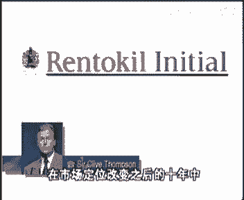
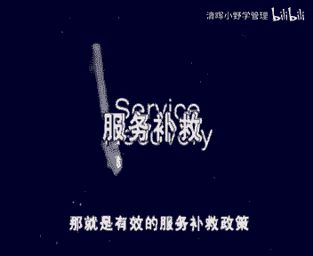

# 欧洲商学院MBA教程，涵盖你想只知道的所有内容，可根据副标题按需观看 - P34：服务制胜2A-.如何通过服务创造价值 - 清晖小野学管理 - BV1LM411Y79Q

呜呜在先前的节目中，我们已经看到，服务在各行各业是如何变得越来越重要的，有关服务活动管理经营节目需求的稳步增长，证明了这套节目中信息的正确性，为了做这期特殊的节目，我们邀请了金克劳德拉拉克教授来做主讲。

他是位于法国冯丹白露，著名的欧洲商业管理学院教授，请克劳德拉莱克教授，同时还是服务支撑节目的第一版的作者，1995年，他的关于维京大西洋航空货运公司的案例研究，使他荣获该年度欧洲管理发展基金会。

营销关系部队的最佳案例奖，并在1996年，获得了欧洲结算组的最佳案例称号，by european clearing house，欢迎马莱克教授，我们在后面将会看到北京大西洋航空货运公司。

努力把服务管理成功的一些关键要素，整合在一起，这些关键要素被拉莱克教授，包含在制胜飞轮的模型里，在前面的节目里，我们已经解释过了，在本期节目中，我们将会看到商业逻辑的全貌，他在中枢部分。

实质甲制作为基础的三个制胜飞轮，换句话说，在今天遵守护的基本原则是至关重要的，但你还需要了解的更多，拉拉克教授，您有什么需要加以补充的吗，这并不是只是增加点什么的问题。

你需要做的是在商业模式上进行创新或发展，商业逻辑虚拟有别于你的竞争对手，并且优于他们，如今如果企业只对过去的经营方式，商家改进是不够的，管理者如果还继续采用原来的方法，就注定被过去所束缚。

公司只把金星为统，现行的产业标准进行比较也远远不够了，在各行各业中取得成功的是，那些以创造出全新经营方式的公司。

都是are those who have invented entirely new ways，服务时代的革新可以归结为从把事情做得更好，到做好不同事情的转变，他是从在历史传统或遇上事务所主宰的世界里。

努力去实现成功，能为顾客员工和股东去创造一个新的，更美好的世界的一种转变，事实胜于雄辩，我们请求拉雷克教授重点讲出两个完全不同的，但是都很成功的服务公司service providers。

这两家服务公司已经赢得了几乎所有的中医，他们都有很快的发展，并且获利丰厚，这两家公司都为股东创造了大量的价值，并且都成为各自领域的带头人，二者都面临着被更强大的竞争对手通病了危险。

这家公司创建于本世纪初，其分公司已经拓展到全世界，它是一家提供环保服务的公司，业务范围，从工业经起到有害物控制以及热带植物租赁，该公司名叫李狗，第二也就是现在著名的雷克创世公司。

它已经成为英国最为人敬重的公司之一，1991年，该英国公司全面发展，1992年，该公司成为市场营销质量第二强的公司，1994年，他成为全球资产净值回报率位列第二的公司，变成为英国最令人羡慕的公司。

早在1996年，雷托吉尔公司既做了一项带有敌意的图标，目的，在签订b1 t环保公司比它深达两倍的工资，经过在伦敦证券市场上数月的激烈搏杀，bt终于屈服同一档雷托吉尔收购，让一个比自己小很多。

但管理却很出色的公司收购，这让我们了解大力土耳其公司创建于本世纪初，然而其所有的奖励和传奇都是近几年才发生的，这件踢得好，雷托吉尔公司能发生这样的变化，事实上你能归因于在1983年。

新山人的首席执行官克里夫汤姆逊先生，在他的领导下，公司在多方面取得成功，但有些方面是特别显著的，我想给我印象最深的是他们推出的故障机服务，他们在今天选择的充满进取心的国际扩张战略。

以及他们检测团内部管理，在深入了解雷托吉尔公司的商业逻辑之前，我们先来看一看另一家与雷托吉尔公司不同，但也取得了成功，粉色他仅成立于12年前，这家成功的公司是bcp公司，葡萄牙商业银行。

有风险投资家们在里斯本创立到1994年底，经过不到9年的时间经营，他就已经成为葡萄牙第三大的商业银行，成为在葡萄牙证券市场历史上，资产实力最雄厚的公司，1995年，他收购了最大的葡萄牙银行。

葡萄牙大西洋银行，成为行业龙头老大，pino portuguese to atlantic and became number one，对奉献投资来说，它就像一个神话故事没错，但是这样辉煌的成果。

也是风险投资家帮忙带来的，毕竟正式创立公司的管理团队，决定把1/3的初始资金投资信息技术领域，他们的目的是，要建立一个有很强客户信息系统支持的银行，以便能够提供低成本高质量，因此从一开始。

葡萄牙商业银行就能为顾客提供，关于公司全方面状况的信息，而其他公司仅仅能够提供个人相关账户信息，他们是如何迅速达到谷歌导向目标的，quickly，像前面的例子一样。

葡萄牙商业银行成功也要归隐于多方面的因素，但非常重要的一点是，从一开始，他们就邀请国际顾问，为他们建立一套世界级的顾客满意度和品质，追踪系统，在强大的计算机技术，充满活力和技术精湛的员工的支持下。

公司上下一致，为定位清晰的目标用户提供高质量的服务，这些在后面会提到，葡萄牙商业银行员工的薪资水平，也比行业平均水平高出一大截，但是为了得到这么高的薪水，员工要为公司倾力奉献，并且不能阻止第二职业。

而这位葡萄牙是很普遍的，但葡萄牙商业银行却禁止这样做，因此这两家公司有很大的不同，但共同的是，他们都相当成功，这表明成功的途径多种多样，成功的商业逻辑也有很多完全正确，雷托吉尔公司和葡萄牙商业银行。

不仅遵循了制胜飞轮基本原则，他们的成功还应当归因于他们那种，创造顾客满意，建立高效的激励机制，以及为股东创造价值的独一无二的方法，这两家公司都在各自领域建立了新的行业标准，并创立了独特的商业逻辑。

他们反映了我们各个服务行业，将要发生的巨大转变，雷托吉尔公司和葡萄牙商业银行能够获得成功，不是因为他们在原来的基因基础上稍加干净，他们获得成功，是因为他们同其他公司的经营方式不同。

并且还在各自领域建立了新的行业标准，从把事情做得更好，到以不同的方式做事情，这样的转变也可能在一个或相近的行业内发生，在这点上，让我们看看航空业的例子，直到80年代后期，整个航空业都在同一基础上竞争。

这个产业的前进步伐，被那些电机型和先驱性的公司控制站，如环球运输公司，泛美航空公司和欧洲的国有航空公司，尤其是那些在全世界拥有大量殖民地的，殖民王国的公司，其他的航空公司都试图在规模航线数量，员工数量。

飞机数量上紧随或超过这些领袖级的公司，a number of aircraft，如今航空业已经发生了翻天覆地的变化，从1989年到1992年期间，海湾战争，放松管制等复合因素产生的重大危机。

在这3年期间，航空产业由于恶性竞争损失达到了100亿美元，观察家政委，这个数字甚至比航空业自建立以来，累计的利润还要多，在此情景下，许多航空公司面临的破产，被收购的危险。

他们需要从政府那里获得大量的补贴，然而在过去的10年间，有五家航空公司一直保持着良好的运营记录，包括顾客满意水平和股东收益，他们都各有不同的商业逻辑，从下面的概括中可以看出来，由公务员管理的国有企业。

像一个极具活力的服务优良，公司进行了改革，马歇尔先后在赫兹艾维斯希尔斯公司工作，这些定位使它具备了两大优点，他深谙客户服务之道，在他经营汽车租赁业务期间，他结识了一批熟悉航空业的顾客，他敞开大门。

网罗了一大批精英，这促使了公司企业文化的改变，for a massive influx of talent from other industries，说起新加坡航空公司欧洲的同行会立即指出。

它受益于亚洲地区的低廉，劳动力成本和良好的社会法制，这些同行却忽视了这家公司独特经营方，发生的其他方面，想象一下，他们不断地对飞机进行更新，从而创造了在该行业中最年轻的飞机编队。

此外他们着力培养新加坡女孩殷勤待客的传统，精心挑选了一批优秀员工，把他们培养成符合顶级服务要求的员工，使他们面貌一新，第三个与众不同的航空公司是香港，国泰航空公司，它总部设在香港，像新加坡航空公司一样。

它也得益于以亚洲为基础，但它的经营方式，人在很多方面与别的工资不同，它的航线集中在亚洲一些国家之间，这些占了他们客流量的3/4，在唯一的动力供应商，罗尔斯罗伊斯公司的支持下，效率相当高。

美国西南航空公司，于1971年在德州开始运营，其专用于在美国本土进行短途货运服务，他们认为公路货运是他们的主要竞争对手，因此它们的价格通常比其他空中货运工资，低约60%，为了做到这一点。

他们削减了一些短途旅行顾客不需要的服务，如提供食物，预定机票当中，维京大西洋航空公司，是这个引人注目的行业中最年轻的公司，他们由于服务周到，不断创新，费用核裂等原因，迅速提高了知名度，他的总部设在伦敦。

他们已经成功地打败了不列颠航空公司，和其他一些大型国际公司，我们在后面可以看到，做到与众不同，正是北京大兴航空公司想要突出的一点，我们由此观点得出的结论是，甚至是在一个相同的行业内。

仍然有可能有五种完全不同的商业逻辑，也许现在是澄清商业逻辑和商业策略，或商业构想之间差异的时候了，商业逻辑，把服务公司大量员工的日常活动联系起来，这样的话它就不只是一种构想，因为构想总是太简单了。

不是一个策略，策略太复杂，太深奥了，同时也不是一系列的成功关键要素，或一套仅仅描述要做什么的过程，一个商业逻辑整合了推动经营的关键要素，表明科要素是如何相互联系的，并且如何通过管理影响这些要素。

可以把一个商业逻辑比作服务制胜飞轮，转动起来以后的整体氛围，因此服务制胜飞轮，就构成了商业逻辑的基础部分，在这样的逻辑下，管理师股东获得了收益，现在如果我们看一看在最好的公司中，这三个飞轮所面临的环境。

我们会发现好多服务管理的三条附加原则，他们是顾客个性化服务，服务补救和高级管理人员直接参与，从顾客个性化开始，我们来详细的分析分析他们，谷哥哥进化服务是如何影响制胜飞轮转动的呢，任何有效的服务策略。

其出发点都应当是选择目标顾客，然后公司的经营活动，都应当围绕这个顾客群体来设计，这样比起其他向一般顾客提供服务的竞争者，公司，就更能满足顾客的需求，verage，此外还可以了解该客户群体不需要什么服务。

从而不必要提供你能高度关注，为特定的客户群体服务，经常可以使企业通信较低的成本，创造较高的客户满意度，但是在服务中选择客户有什么特别呢，难道他是所有营销活动的基础吗。

选择客户并不等于提供一份多样化的彩蛋，去满足不同顾客群体的需要，在航空业里，大多数公司提供三种服务，工商被称为经济舱，公务舱，头等舱连锁旅店也提供不同类型的住宿条件。

以满足不同层次顾客对服务和舒适度的要求，但这种做法更多的是想吸引大量的顾客，而非选择特定顾客群体，以高利润率向他们提供更高质量的服务，higher，但公司受到某种诱惑后，往往会采取相反的做法。

他们想招揽尽可能多的顾客，却让一线员工对付这些性格各异的顾客们，试图为不同的顾客群体提供相同的服务，常常导致每个顾客群都不满意，并且公司会为此花费较高昂的成本，事实上，在这种情况下，市场份额越大。

可能导致顾客满意度越低，工资利润越低，请记住，如果顾客没有更多选择，或公司能够用较高价格弥补较高成本的话，公司提供不周到的服务或运营成本高昂，都可能引不起公司高层的注意，然而当竞争加剧时。

那些为特定顾客群体提供服务的公司，将成为圣者这种成功企业的一个例子，我们的前面已经提到，就是雷诺杰尔，尽管如此，当1983年，格列夫汤姆逊成为公司的首席执行官，是公司还不是一个要严格定位顾客群体的模范。

如果一切按计划进行，我们现在应该可以克利夫汤姆去健身，直接对话了，格里夫变身，你能听到我们说话吗，是的我能清楚听到我说话，格雷普先生，您在1983年接管雷托吉尔公司时，该公司的决定。

特定顾客群体的情形是什么样的吗，1983年，那时候，雷托吉尔公司有将近一半的收入来自于个人，家庭市场，家庭顾客群的问题在于，他们喜欢高质量服务，但他们又不愿为此支付现实的价格。

因此雷托吉尔公司渐渐用商业用房客户，代替了家庭客户，我们首先把目标选择在，认为质量高于一切的客户上，customers，工商业的客户不仅想要质量好的产品，而且也愿意支付，此外为商业客户服务也比较容易。

因为在正常工作时间里可以随时光顾他们，怎么continuously available，在家庭住房市场上制定访问计划，困难会延误时间或错误机会，都会使公司的运营成本显著增加。

并且使公司的生产率受到很大的影响，公司传统的物业服务业务规模，下降为不到1%，one of our total business，公司盈利能力发生的转变影响深远，在市场定位改变之后的10年中。

公司的收入是以前的五倍，利润是以前的十倍，令人惊奇的是，这些简单的给化境对公司产生这么大的理想，谢谢您，克列夫先生说好了，我们在节目的后面还会邀请您的，好的待会见，so，雷托尔街公司的例子。

表明顾客和公司之间的搭配不当是可以就诊的，其实他们做的还远不止这点，雷托吉尔公司，不仅把业务从家庭住房服务转向商业用房服务，还大量增加了服务种类服务，雷托吉尔公司。

从一家从事有害品控制和垃圾检验的公司开始，发展成一家国际性的环保公司，其业务范围从热带植物租赁到办公机械维修，以及其他乍看上去并不互补的业务，但是这些业务的共同之处在于。

他们为工商业客户提供高质量的服务，例如他们对医疗废弃物进行分类的业务，是源于安全处理皮下注射器的需要，而水处理和通风服务业务，是来源于防止建筑物气味，引起的恶心综合症的血样。

因此当你已经选择了你的顾客之后，第二部应当是为各个群体制定特定的服务方式，选择正确的布方法，真的只有一个管理方面的任务，而不是一线工人的工作吗，的确是要由管理部门来决定。

公司能为哪些顾客提供何种水准的服务进入，如果你提供的服务商，你的客户就不会满意，如果你提供的服务太多不适合，那么就会产生成本浪费，you will be cost efficient，正如我此前所说的。

越想要满足所有顾客的需求，越不能满足顾客所有的服务需求，因此用特定的服务方法去满足特定顾客群体，而不是去满足所有顾客是至关重要的，这看起来是不言而喻的，但我经常发现，有些服务公司的经营。

还是基于技术或者历史的原因，而不是与顾客相关的一些因素，他们只是遵循着某种，许多管理者似乎满足于自己和同行一样，有质量观念，他们似乎认为即使走的道不对，我们至少还有好多同行作伴。

所以为了给选定的细分顾客群体提供特定的，我们应该说是三，任何一家真心关心顾客的公司，都会观察到不同顾客群体之间需求上的差异，他也能找到一种比通常的方法更好，更便宜的做事来满足这些客户群体，令人惊讶的是。

通过公司为顾客特别设计的服务，一些看起来很挑剔，在他们身上赚不到什么钱，或有风险性的客户群体，却可以成为公司的重要伙伴，有一个恰当的例子说明，通过为每个悬念的细分客户群体，发展一道特殊的服务方法。

一家新公司可以在一个现有的部门获得成功，他就是我们开始介绍过的葡萄牙商业银行，我们来看看他们选择的各个细分选项，service between them，从1986年开始，分割成个人和公司两种客户类型。

开始为两种类型的客户服务，净资产高的个人，定义为年收入超过3万美元的个人，中型企业，定义为年销售收入超过150万美元的信，通过分行来处理，在这些分行里，账户经理亲自针对顾客个人的需要。

提供完整的金融产品组合，而其他的账户经理则负责公司类型的客户，提供的是完全不同的产品系列组合，in early，nineteen，eighty nine，1989年初开始。

葡萄牙商业银行为满足富人的需要，引进了私人银行服务，他要求个人拥有的资本超过100万美元，也启动了工资银行服务，目标是葡萄牙的500家大型公司，每个公司的营业额都在6000万美元以上。

同样葡萄牙商业银行为这两类客户提供了，由不同员工在不同经营场所提供的不同服务，在1989年，葡萄牙商业银行公司，涉足了领域更宽的中等收入阶层，这些人的收入在1万美元左右。

葡萄牙商业银行为此建立了诺瓦莱德网络系统，这种网络是基于很多小型的，高度自动化的分支机构，每个机构员工人数不到五人，提供快速吸引了在线电子化的银行服务，这种理念获得了巨大的成功。

其分支机构由1989年的22个发展了，1991年的超过了200个分布，1992年，葡萄牙商业银行推出了适合小企业，专业人士，企业家特定要求的服务，这些顾客销售额在30万美元左右。

由新鲜的小型商业银行运营，最后在1994年推出附加的银行基辅，目标市场是中高收入群体，这是一种全州全天24小时营业的电话银行，这种新鲜的银行网络，给予电话系统提供昼夜服务，且不准备齐全。

exclusively based on the telephone，offered around the clock service and the full product range。

这种有几个独立网络相结合的，分别服务于某个细分市场的系统，在顾客满意度和成本效应上都很有竞争力，事实上，葡萄牙商业银行每一位顾客都由客户经理代理，该系统引导我们进入顾客个性保护的第三步。

即在各个方面与各个顾客建立关系，德雷克教授，随着附近企业变得越来越大，顾客和员工之间的互动是不是还有可能呢，就像在传统的最好的小型商店餐馆旅店中，人们认出了你叫你的名字，询问你关于你家庭的情况。

但当事实上无法进行感情交流的情况下，您能不能谈谈如何建立两者的关系，not really possible to exchange emotions，最好的服务公司。

当然会努力与顾客建立那种众所周知的传统，小商店和顾客之间的那种情感，这需要各方面的条件，其中一项传统条件是给予好的报酬，以激励一线员工，但在今天还需要一种以顾客数据库为中心，建立起来的有效的信息系统。

为了得到这一笔财富服务，公司必须为每个顾客和每项服务交易储存起来，这样每位顾客的背景资料，可以用来使公司的服务更加适合顾客，更加个性化，一些服务公司努力建立了良好的顾客关系，甚至是那些在远方的顾客。

我们回头看一看，在上一期节目里已经介绍过的全天候银行，first direct list，顺着电话银行业务服务，由英国米特兰银行于1989年首次发起，全天候银行。

波斯迪克把自己定位为传统银行的高级替代者，委内些有积极生活方式，高收入和低薪的风险的顾客提供服务，这些全职的专业人士，不仅青睐工作时间之外服务的银行服务，而且由于他们有技术能力。

他们还习惯于非面对面的交流，全民银行force direct，现在正在考虑，在这个行业，制定一个最好的客户信息数据库系统，因为这个系统用来管理客户，而不是账户，他的士兵是尽可能地贴近个人。

客户最终能够知道顾客在下个月，来年或5年后的需求，or five years from now，经过一段时间，客户的个人行为方式逐渐显现出来，水银行能够为顾客提供更适合的服务，以更有效地满足顾客。

我的确知道我们可以监控购买行为，并最后依照监控结果形式，但它实际上并不是一种个人关系，不是吗，的确不是，但是全天会银行force direct系统，允许约翰与客户之间建立一种虚拟的关系。

尽管不会有直接面对面的接触，并且顾客很少和同一个银行职员说两次话，比如他们不会老是向一个声称要购买汽车的人，推销汽车保险，而是会不经意地说，我们很乐意为您介绍我们的汽车保险，您能不能告诉我们。

您准备换车的时间，一边到时我们和您联系，如果顾客回答的是明年10月，他们就会记住这条信息，并在适当的时候联系客户，如果史密斯先生说他得到了1万比赛，他并偶然提及他将在周末去西班牙。

那么这条信息也会被记录下来，当他下次回电时，任何银行代表接线生都会说，史密斯先生西班牙的度假愉快吗，结果许多顾客都声称，tom与for direct银行的关系要比普通银行更紧密，银行都在削减分行数量时。

全天候银行波斯蒂安，却已相当于每周开业一个分布的速度扩张，这个例子总结了我们对顾客个性化的讨论，个性化服务是最好的服务公司的制胜原则，我们现在再看看这一方面的第二部分，那就是有效的服务补救政策。

服务不修，是不是指咱们所说的要尽力提供完美的服务，同时还要准备纠正错误并做补偿，对公司所提供的服务质量的真正考验是，当服务出错是公司的应对方式，颇具讽刺意味的是，最好的公司也承认有些问题的发生不可避免。

因为他们知道油纸户意味着什么，即使是倾尽全力，也不可能使所有的顾客满意，即使是最好的服务公司，也不可能完全杜绝解或出错，食品变质，运输延误等问题，但是与众不同的是，当顾客不满意的时候。

他们明白损失的价值会有多少，他们因此会努力不让这样的情况发生，绝不提供糟糕的服务，他们严格的服务标准将由补救程序来完成，你重新换回那些不满意的顾客，那公司可以做到什么程度呢，我是说有没有一些指导方针。

或者你能不能计算一下这种主角系统扣了多少，幕府觉得最大合理投资局内尽力而为，留住了顾客所能创造的现金流，深夜指弹，还记得在前一个节目中，那些大段的关于如何评估顾客价值的讨论吗，remember。

我们也知道，公司能够愿意做出的最低投资很简单，最低投资就是寻找新客户，在数量上语音不满流失的老客户相等，所耗费的营销及。

not be sued from going to the competition by a good service recovery system，这是最小的投诉。

因为他并未把顾客的满意度和留住顾客的价值，考虑在内，无论你怎样看，你都很难找到一种回报率，你服务补就高的投资项目，dan investment in service recover，在下一个图表里。

我们将证明，服务补救政策不仅是公司可做的最好投资之一，而且还远不止这些，路虎就不仅能解决那些令顾客不满意的问题，而且还包含一种，弥补那些给顾客造成的麻烦的关心和意愿，这样就产生了一种有趣的现象。

得到服务补救的顾客毕竟更加重视，我们来浏览一下这种对顾客满意度的典型分析，such a typical analysis of a customer，satisfaction survey。

在所有接触过的顾客里，40%的人与公司有过浮夸经历，在这些人中有70%的人从来没有投诉过，另外30%的人投诉过，在这30%的人中被问及是否收到过答复，其中80%的人回答收到过，这些顾客还被问及。

他们认为这些答复是不充分的还是充分的，或者答复对他们来说无所谓，这样的比例分别是10%，50%，40%，forty split，现在这家公司顾客总满意指数为78%，与公司没发生过问题的。

另外那60%的顾客里，顾客满意指数比前者要高出7%，而那些与公司有矛盾，却没有进行过投诉的顾客，他们的满意水平比平均值指数为65%，低12%，satisfaction level。

在鳗鱼水平量最低的是那些投诉过，但对收到的答复不满意的，符合他们的满意指数仅有70的24%，顾客满意指数第二低的是那些已经投诉过，咱们有收到答复的顾客，他们的满意指数为55%。

而那些投诉过但对收到的答复漠不关心的顾客，他们的满意之处与那些有库曼，但被投诉过的顾客相近，为68%，正如我们先前说的，最令人奇怪的是，那些不满向公司投诉过，对公司答复满意的那些顾客。

他们的满意指数为93%，比那些从未不买过的顾客还要高出8%，营销专家们是怎样理解这个问题的呢，在某种意义上，这些接受纠错服务的顾客认识到公司在监理时，他们满意，他们似乎认为公司的这种对问题的反应方式。

对他们在一般的事件中所受到的待遇要好，看过刚才的那幅图表后，每个公司应当记住，鼓励顾客抱怨，他们经历过的任何问题是多么的重要，如果他们不断地纠正，公司在哪些地方做得不够好的话。

他们就一定会成为公司新的服务的支持者，they will have ensued themselves of some new advocates for the services。

所以有效的服务捕捉系统的低月支柱，就是便利的投诉系统，知识要搞清楚，首先是不是没有人通俗就是最理想的呢，哦你提到了很重要的一点，很多从事传统服务业的人士认为，如果顾客投诉减少，就表明他们的服务就会提高。

事实正好相反，真正的目标不应当是减少顾客投诉，而应当是减少不满意的顾客量，这二者之间没有什么任何联系，请记住这点，即使是最优秀的服务公司，也不可能做到完全令顾客满意。

cannot prevent some customers from feeling be satisfied，成功的服务公司与传统的服务公司的区别在于，前者会鼓励顾客投诉，因为投诉会加强交流。

每一项投诉都是一种，为顾客提供服务质量的机会，记住最不满意的顾客从来不投诉，因为公司也从来没有了解他们的特点，结果公司不可能再吸引他们回来，我认为不满意的顾客宁可什么也不说，而直接去找别的公司。

从一个顾客的角度来看，登记投诉要花时间，在此之前，他们通常会权衡他们的不满意见的重要性，服务本身的费用以及所遭受伤害的承诺，由于这些原因，服务企业应当想办法，使这些沉默的不满群体。

能更便利地写投诉信或打电话，投诉，投诉处理必须尽可能的简洁快速便利，投诉系统包括餐馆里简单的批评卡，旅馆里免费供顾客使用的投诉电话，一种更复杂的方法是不列颠航空公司发明的，introduced。

在1993年，威廉联航公司重建了客服服务，里面的60名员工，每天处理300个投诉电话和400封投诉信，不列颠航空公司投资了400万美元，重建这个部分，其中的一半会用来，建立一个叫光环的计算机系统。

也叫客户分析和保持系统，analysis system，如果一切都清楚了，我们现在来问一下客户服务经理，没想到希尔官方的学员目标是什么，吉尔先生，您听到我们说话了吗，现在我听到了。

如果我们听到的信息是正确的，官方的学员目标要尽量缩短，不列颠航空公司处理客户投诉的时间，而光环是怎样达到这一点的呢，我想说，在我们没有安装方法系统之前，我们的顾客必须等待4~6周，才能收到投诉反馈。

在这段时间里，客户服务部追踪那些，有时包括40来个办公室的信息，已完全反馈顾客投诉，而利用关怀系统之后，投资信件被扫描和储存于中央电脑系统，以关键字索引，例如用航班号和日期做关键词，一个客户服务。

员工能得到一系列与该航班有关的信息，有航班延误，天气恶劣，订票超人等等，同样的员工现在能够浏览到乘客的历史情况，如旅行频率，主要投诉信息，因此现代公司能够对电话投诉当场给予反馈。

对信件投诉仅三天时间内就能反馈，有没有可能评估关怀的投资回报情况呢，我们公司的研究表明，如果五天内投诉得不到答复，客户满意度将下降38%，因此仅仅从这里就可以看出，建立关怀系统。

生物有所值的那些不满意顾客的忠诚度提高了，现在我们了解到那些曾经投诉过的顾客，有84%说他们还会光临我们公司，而那些从未投诉过的顾客中，仅有65%的人，愿意继续乘坐不列颠公司的航班。

很显然我们要提高那些不满意顾客的投诉比例，不满意顾客的每一次投诉，都是我们有可能把它们转变成，不列颠公司的忠实客，总体来看，研究表明我们的生产率提高了30%，这节约了大约200万美元。

they've this approximately two million pounds，谢谢您给我们做了点听讲解，是新郎先生，我很荣幸，如果不满意客户的投诉被妥善处理了。

他真的变得比从前那些从未投诉过的顾客，更为重视，有人也许会这样想，由刘可以先使顾客不满意，然后再脱身处理他们的投诉，以使他们变得更为重视。

by rightly attacking the complaint，我担心有人会得出这样错误的结论，除了因为这种做法是不道德的之外，还因为我们的分析是其开始时满意不满意，服务量之比为60比40。

因此你无法将上面那个结论推广到最开始的，顾客不满意度很高的情形，除此之外，你似乎忘了，如果一开始顾客不满意度太高的话，那么重新招揽顾客的成本将会变得很惊人，这就好像是你去做节目的时候。

有意的想做的差点创造像观看者弥补的机会，错误的希望，这样会使他成为你下期节目的更忠实的支持者，一个部门的顾客有可能转变成一个忠实的顾客，但是绝不能通过制造不满来增加顾客的忠诚度。

so所以不要犯我警告过的错误，我们来继续关闭服务补救的讨论，看看除了提供便利的投诉系统之外，还有什么应该做的，除了便利的投诉系统，我们还应该对员工授权，使他们能够在线处理或现场处理客户投诉，拉凯教授。

为什么在无补救政策中授权如此重要呢，无补救包括各公司发布满意顾客，转变成满意顾客所采取的一切行动，因此为了说服普就更为有效，所有部门之间必须有合作创新的精神，然而最好的服务补救的方法是在线纠错。

即在服务出现问题时立即进行纠正，与顾客最接近的员工能够最先了解问题，并且最有条件决定该怎样使顾客满意，因此公司应当给一线员工授权，以便他们能尽可能快的采取正确行动，这意味着他们必须能够理。

利用公司制度进行开拓创新，享有公司资源，使公司内部运转更灵活快速，一线员工必须有一定的安慰顾客的权利，如为顾客提供一杯免费的香槟酒，提高不满意顾客的待遇，给他们的房间里送些鲜花。

或者期待一些减少顾客不满，甚至可以使之转变为忠实顾客的方法，为了这一线员工能够做到，这些，公司必须对他们进行培训和激励。

