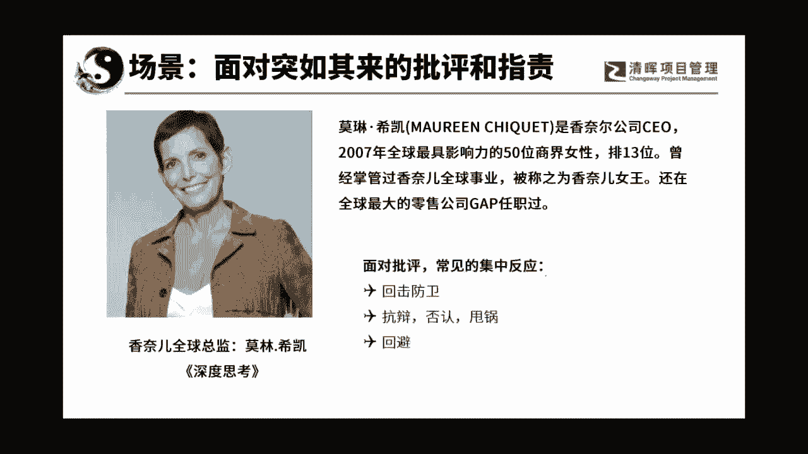
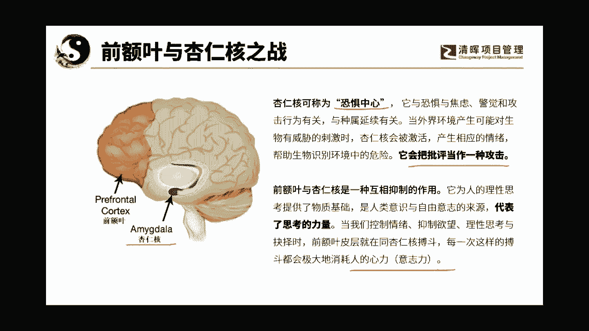

# 沟通管理的三大因素：人, 事，环境 - P3：3.前额叶与杏仁核之战 - 清晖Amy - BV1Sr421F77Z

那么我们呢这里来给大家看一个案例啊，嗯就是大家知道一下就可以了，以前呢有一个人叫莫林希凯，他呢是香奈儿的CEO，他曾经写过一本书叫深度思考，你们有可以呢啊去看一下这本书，他呢曾经呢在美国。

一个非常知名的服装的一个公司啊，叫盖普公司，嘿嘿今天会提前结束吗，那行吧，那我当然我现在就结束了，算了行不哈哈哈哈哈哈哈，感觉好像大家还是不爱听啊，沟通管理好像没有市场，吓人呵呵跑跑过来一看，塞心塞。

对不对，哼一下卡壳了，连故事都讲不下去了，然后这个人呢，他呢在他的那本深度思考的书里面，写了一个他的故事啊，写了一个他的故事，就是他呢曾经在gap公司啊，去，这就是曾经在一个女库的一个部门担任主管。

然后呢他就写了他在那里碰到的一件事情，就是他们呢里有他是的上级，有一个领导是CEO，叫米奇，这个人被清理就是华尔街的金融家，理解为是什么呢，叫商呃，就叫做商人王子。

就是他在挑选畅销品的这个眼光几乎是完美的，命中只要他看重的东西就是爆款啊，就是爆款卖的无数，但是呢他是一个很在公司里，他是个很恐怖的人，就是他有一个叫米奇会议，这个会议呢它就是每每个一个时间段。

它就会下面的各个品类的服装的，各种服装的品类的部门，就会把他们要挑选的下一季的主打产品，就是要拿到那个会上啊，去给这个CEO米奇啊啊，去去让他审查看他好不好，然后呢这个CEO呢。

米奇这个人呢他也是非常严肃的，所以每一次开这个会之前，那个会议室里面就通宵达旦，所以外国人也加班啊奋斗，那你把那个他们找出来的那个产品啊，就是那种品就是服装的新品，弄得各种的花里胡哨啊，模特啊，搭配呀。

色彩呀，就是通宵达旦的就把它放在那，然后就等着第二天接受这个米奇的那个审阅，然后呢这个呃就是莫林呢，她曾经呢是其中一个女裤的品牌的女裤品牌，有一款经典的销售的牛仔裤，就是那个米奇他发觉的啊。

每一季买的都是最多的，就是量是最大的，然后呢莫林来了以后呢，他想变革啊，他觉得那个他也看了一下数据，他觉得那个呃畅销的那个普通款的女裤啊，好像销量有所下降，所以呢他觉得机会来了。

他就找了一款就是大开口的牛仔裤啊，呃然后呢他就推了这个新品，在推的过程中，他就在跟那米奇的交流的时候呢，那米奇就问他，你为什么会选这一款的东西，请问这一款的东西在上一个季度，它销售了多少啊。

然后呢那个莫林呢被他这么一严格的疑问啊，脑袋就一嗡，她就感觉老板好像在质疑我的工作能力，所以呢他就急了，声音都发抖了，然后呢他就去辩驳，他说啊，我们这个东西在上一个季度呢啊，我们呢就是上一个季啊。

他说我们卖脱销了啊，怎么怎么的，这个牛仔裤的材质怎么怎么怎么样，就一直跟那个CEO米奇奇呀，就是在辩解啊，在辩解，然后的话呢嗯那个米奇呢后来就跟他说，我不跟你说了啊，他就生气了嘛。

他说你现在完全听不进任何的话，他就问他一个问题，他一直不肯正面回答，就是经典款卖一个上一个季度卖了多少钱，然后呢呃这个新款的牛仔裤啊，不是卖了多少多少条，那个经典款卖了2万5000条多条。

然后那个经典款一共就买了400多条，400条，为什么呢，因为他上一季就进了400条，所以就卖脱销了，所以他就觉得那个是款，未来会是个爆款，所以呢他们就争执起来了，把那个老板怎么样呢，就给气走了。

哼哼然后莫林想想不对了，我可能要被炒鱿鱼了对吧，他他说唉呀，我当时就逢魔时刻，怎么就跟老板就对上了呢，就是当一个人他觉得别人在批评他的时候，是不是他就特别的紧张，然后呢到底都是职场上的精英。

大概过了两个小时之后啊，他正在那忐忑的时候，就接到了他老板米奇的电话啊，他接电话的时候他就想完了完了完了，老板是肯定过来跟我说，哎呀呵，你滚吧，对不对，结果那个呢他就跑他那个。

但是那时候呢米奇就已经很冷静了，他就去跟莫林说，他说莫林你是一个很有潜力的人，我认为你未来一定会是一个非常出色的商人，我也知道你的品位是非常的好的，但是你在会议中，你一直在试图告诉我，你是对的啊。

你没有听过说任何一句话，大家知道吗，就是他就是双方已经不能冷静的，所以他在干嘛，中途干嘛撤退，看到没有，就然后我们双方都冷静下来的时候，我们再坐下来啊，再来交流这个事好，从此之后他就转变了很多的思维啊。

老板的建议不仅没有伤害他，并且给他提供了很多更好的建议，所以他就通过这个，所以我们可以看到啊，人在面对批评的时候，往往集中的反应是什么，一个呢叫回击防御啊，是不是毁气防御啊，我他觉得我的能力不够啊。

木怎么样，第二就是抗辩，否认甩锅，第三种呢就是回避，其实老板使用的用用了一下回避，就是他那个也不叫回避，他其实就是他发现了这个沟通的场域不够安全，所以呢他觉得这个暂话对话应该怎么样暂停啊，他应该暂停。

这个不是PUA，人家很职场的好不好啊，你要是能够遇到一个能冷静撤退，在事后还能够跟你冷静沟通的老板，那你就是烧了高香了，你要知道有多少领导他是能做成这样的吗，啊那绝对都是这个呃市场上的精英。

绝对的冷静分子啊，他绝对不会因为个人的情绪去给控制住自己，大家能理解我的意思啊，所以呢他就说他就回避了。

所以这个是为什么会造成这样的现象呢，来嗯对呀，有些老板就直接开骂了，真的有这么有素质的老板，你遇到了，那真的就是你的幸运啊，那其实是跟我们人的大脑是有关的，大家知道吗，我们人呢其实有三层大脑。

最里层的叫本能老，本能脑呢是爬行动物脑，爬行动物脑是管我们的呼吸肌肉心跳的，那个里面主要是一些脑干呐这种东西啊，大家要知道人家有没有人听说过，脑干要是受到伤害了，这个人就会死掉。

因为他没有办法让你这个身体的机能呃，起到一个正常的运作，那个大脑跟我们没关，我们也控制不了它，对不对，跟我们有关的是另两个大脑，就是本能脑外面的情绪脑经常怼老板怎么办，牛啊啊，那你们老板的脾气可真好啊。

第二个大脑呢叫情绪脑，情绪脑呢他呢是直觉脑啊，呃有的时候呢最主要就在杏仁河，这它又称为恐惧中心，这个情绪脑啊，这个也叫哺哺哺乳动物，脑是我们在原始社会的时候，几亿年前就发育出来的。

他的目的是为了躲避危险，大家能知道吗，如果你在那个时代的时候，你遇到了那个叫什么来着，就是猛兽啊啊或者遇到什么呀啊，这个时候往往怎么样，往往就是这个大脑起作用，他是能救你命的，大家知道吗，大家想想看啊。

你在电影院里看那个3D的电影，当有一只老虎扑过来的时候，你的第一反应肯定不是说诶，这是假的，你的身体的第一反应，肢体语言比你的大脑快，你发现没有，它就会躲闪啊，这个其实是可以救命的，就是在你的本。

在你的思考的脑袋还没有起作用的时候，它就闪避了，所以呢他们说这个大脑，他会把批评当成是一种攻击，大家能理解吗，是一种不安全的行为，所以它就会产生两种后果，第一种后果就是头逃避。

沉默就是逃避当中一种常见的形式啊，第二种呢那就是反击攻击啊，我你要来咬我，那我要把你打死掉啊，所以所以大家要注意，这个是它的一个脑，那么在外面一层，也就是最晚发育出来的这个大脑，就是前叶额的这个大脑啊。

叫理性脑，也叫新哺乳动物脑啊，这层大脑主要是创造发明思维，但是这层大脑呢它消耗一个东西，消耗什么呢，思考力和意志力，所以大家知道吗，嗯大家知道就是呃我为什么容易胖吗，那是因为我越忙的时候。

我忙于工作的时候，我就想吃东西呵，就是呃因为你的意志力是有限的，当你把意志力用在了呃工作上，就是你强迫自己人都想玩嘛，对不对，当我把励志力都用在了我的工作上的时候呢。

那我吃东西的那个意志力就有点消耗掉了，然后呢我就UBIUBIU的就胖出来了，啊哈哈，所以这个胖是工伤，大家知道了吗，植物人是哪个脑坏了，这个我倒也不知道，诶，我我不是做医生的。

我只知道这个东西对情绪的管理，我研究的是这一块儿啊，我研究的是我怎么用呃那个呃用那个理性的啊，怎么用理性的来控制啊，来来就是控制我的情绪啊，这是我研究的方向，我没研究那个生理生理上的那个东西。

我觉得大脑哪个地方好像都不能损坏，那个损坏了好像都有点麻烦。

