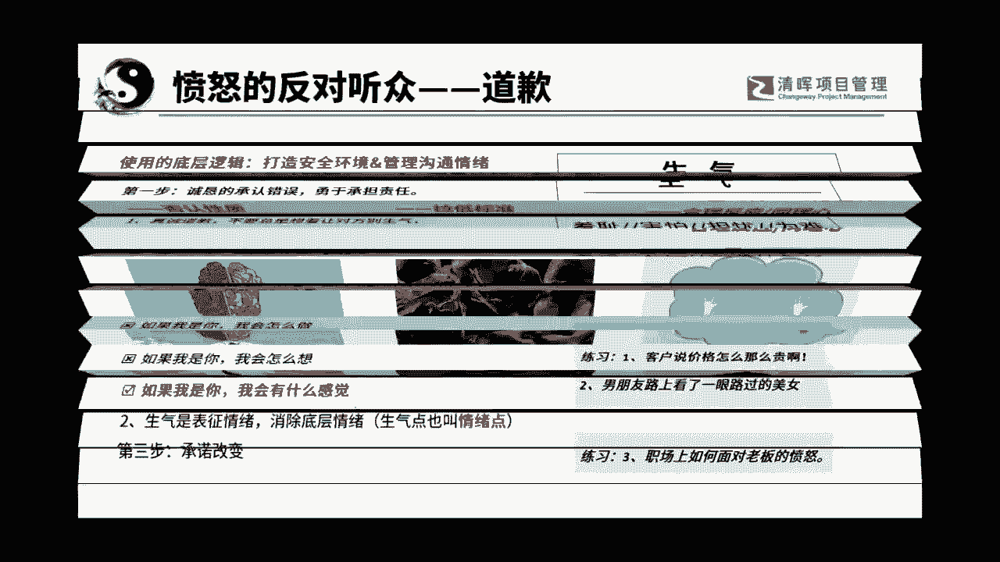
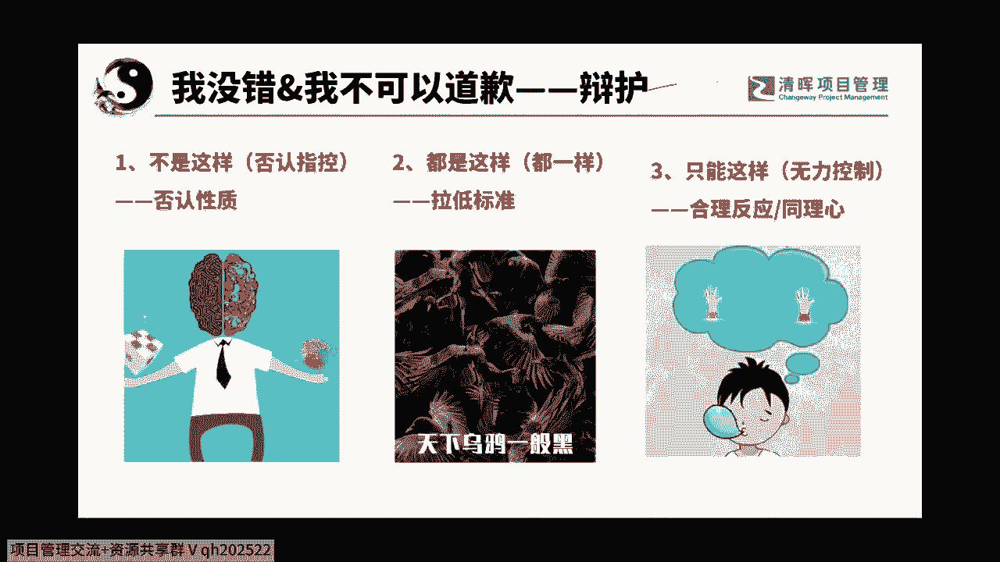
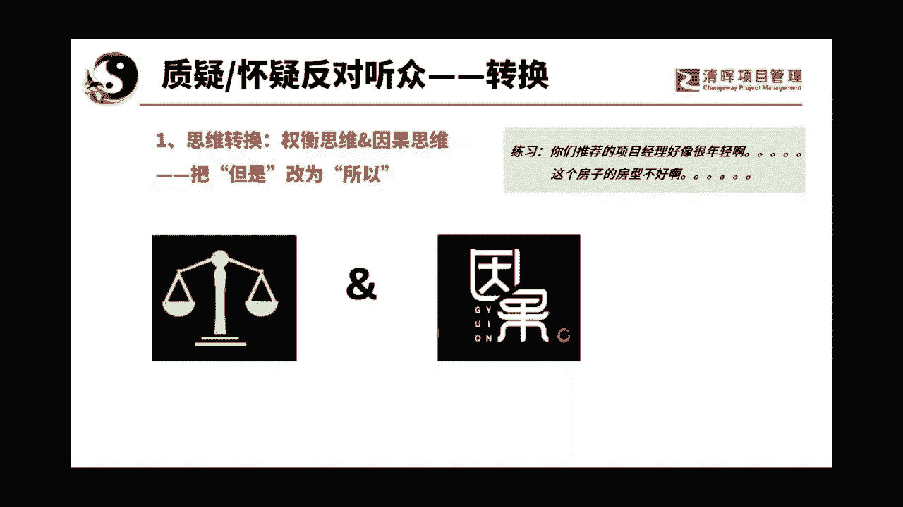
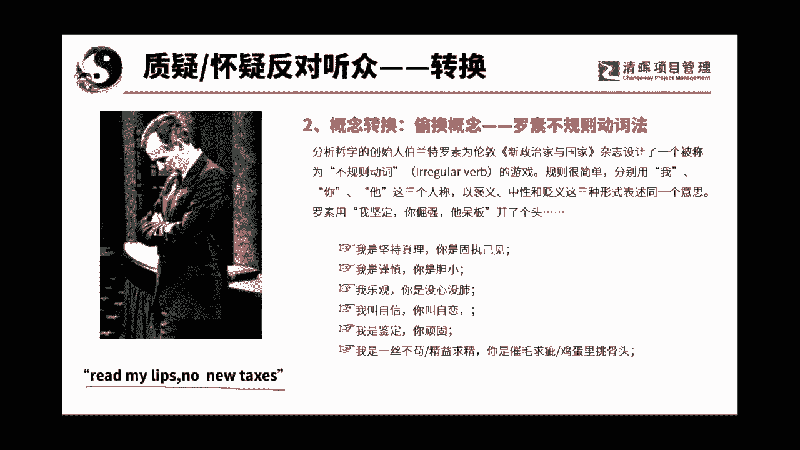
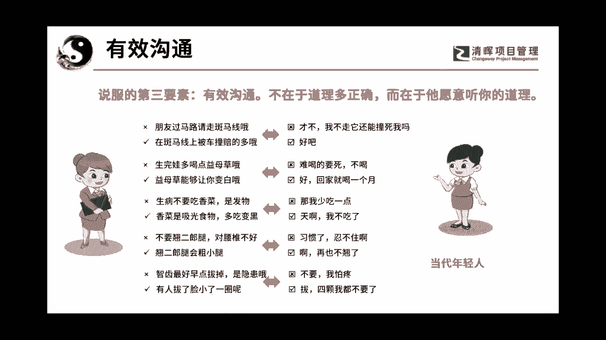
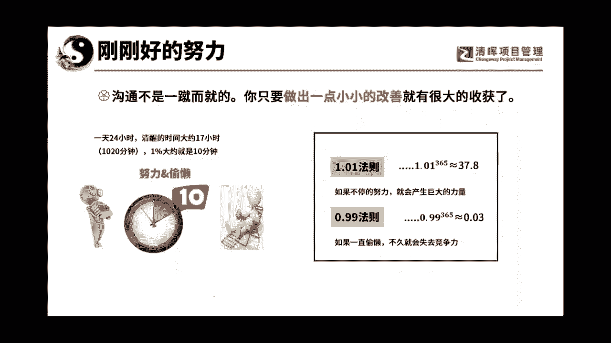

# 沟通管理的三大因素：人, 事，环境 - P4：4有效沟通 - 清晖Amy - BV1Sr421F77Z

那如果你遇到了一个我不能错。

或我不可以道歉的呢，也是可以辩护的，但是最好是如果你真的是有问题的话呢，那当然是呵呵，当然是道歉是更好的，但是如果遇到了你不能道歉呢，别人说你家的产品特别的烂，这说我要捍卫的。

比如说美国人说我们新疆的棉不好，对吧啊，那这个是不能道歉的对吧，这种东西就不是我可以道歉的底线，不能够错，是不是这个道理，哎那么这个时候我们应该干嘛呢，我们可以有三种方式，这三种方式不是特别好。

第一种方式，这个这个简单说说啊，嗯这个简单说法不是这样的，不是这样的呢，它是否认性质啊，否认性质啊，光否认说没有，或者是我们的东西产品是很好的，那是不可以的啊，那个不一定有用的啊。

那个我们学一学那个呃渣男语录啊，他说渣男啊，你出轨了对吗，然后那个渣男说唉呀是啊，我是出出轨了，但是呢我已经和我老婆分居多年，感情早已破裂对吧，他就告诉你，是的啊，哈哈是的，我是干了这个坏事儿啊。

但是呢我的性质不一样啊，人家呢呵呵呵是什么呀，这个我感觉我讲的有点不大好啊，好这是一个第二个呢是都是这样啊，曾经有某位男星曾经犯了一个什么，全天下男人都会犯的错啊，就是把大家的水平都拉低了啊。

还有就是经常就说产品啊，产品产品就是那个呃就是说唉呀，所有的东西品质是差不多的啊，我们的成本就放在那里啊，那个就是这样的一个东西，大家都一样的，这叫拉低标准，知道吧啊哈哈哈好，第三个是只能这样了。

同理心啊，大家看看下面那张图，那这张图就是最经典的那张图啊，我前两天讲问题管理也用了，但是图是一张图，问题不是一个啊，是什么呢，哼哼是说妈妈和老婆啊，女朋友都掉在水里了，先救谁的问题啊，对啊。

他就会跟人说，我会先救我妈，为什么呢，因为呢就是我有可能会爱上很多人，但是天底下我只有一个妈妈，她是最爱我的啊，她是最爱我，所以我会救我妈妈的，就是女朋友啊或老婆啊，非常对不起。

但是我相信如果换做是你啊，你的父亲或母亲掉在水里，或我掉在水里，你也一样会先救你的父母，因为天底下会有很多的男孩子爱你，但是爱你的父母，只会有一个你也会去救你的父母，也就是同理心。

反之你也会是这样子做的啊，那这样的话呢大家都是一样的啊，这就叫同理心，所以这个其实叫做只能这样啊，这个是聊聊天就可以了啊，就是不能道歉的时候或不可以道歉的时候，右手右手，其实这些都是竖，大家能理解吗啊。

道法术器的术啊。

都是道法术器的术，还有遇到质疑的反对听众，我们可以怎么玩呢，是不是大家就觉得后面的好玩了，对不对啊，其实后面的没有前面的好，前面的是底层逻辑，底层逻辑是可以用到任何一面的，怎么叫换位，叫做转换啊。

一思维转换从什么转换呢，从权衡思维变成因果思维，就是改两个字，把但是改为所以啊你的产品怎么那么贵啊，嗯啊人家说啊，但是我们东西质量好啊，那人说那就变成权衡思维贵和质量之间，我要做选择题啊。

对啊这如果用因果关系呢，啊你们的产品怎么那么贵啊，所以我们的产品的质量才是最优的呀，这就是因果关系了，变成什么，变成说你想要获得一个优处优势，你得付出代价啊，你想拿到好东西，你得花钱花成本，对吧啊。

你你你你不想花钱花成本，你就想拿到一个好东西啊，你不觉得啊，你不觉得你不讲道理吗，对不对，但是但是就变成了选择题啊，就变成了选择题，所以大家要知道这个是这个是衡量思维啊，权衡思维和因果思维之间的东西啊。

一个是权衡思维是有缺点，我不想要缺点，我只想要优点，而因果思维是你要花钱啊，你才能拿到获得成果哦，这是合理的思维，逃不掉啊，对不对啊，所以我们的利润才高啊，你不能做销售，你做销售要被人打出去的好。

来我们现在来换一个思维，你们推荐的项目经理好像很年轻啊，来接话接话，这个因果承受不起，哎呀我能不能说一句啊，哼你们这些娃还真不听话，哈哈来接话啦，做练习啦，快下课了，你们推荐的项目经理好像很年轻啊。

哈哈棒啊哈哈哈哈哈哈哈哈哈哈啊哈哈，特别棒，可以可以加班，所以他奋斗啊，有激情有动力呀，态度很重要的，精力又充沛，哎你看呵呵，所以会了吧，哎是不是就改了两个字，直接从权衡利弊变成了因果思维啊。

那第二个这个房子的房型不好啊，这个房子的房型不好呀，然后呢接画啊，所以你才能用这么便宜的价格买到学区房啊，学会了吗，好玩不就是把质疑怀疑的听众啊，转变成了说哦，原来是这样的，原来他们是因果关系。

呵呵呵呵啊。

好第二个最后一了啊，最后了结束了马上就结束了，最后一个要不要听啊，罗素不动词不规则动词叫做概念转换啊，啊那个学废了是学会了还是学废了，偷换概念，我们有一个东西叫罗素不规则动词法啊，他就是讲的是什么呢。

啊讲的是罗素啊，他呢为新政治与国家杂志，设计了一个叫不动词规则，就是大家知道吗，一个词用在不一样的人身上啊，他可以不一样啊，我们其实说白了就叫驰名双标啊，对于我叫坚持真理，你呢就叫固执己见，我呢是谨慎。

你呢是胆小，我叫乐观，你呢叫没心没肺，我叫自信，你呢叫自恋，呵呵我呢是呃坚定啊，你呢是顽固，我呢叫一丝不苟啊，精益求精，你呢叫吹毛求疵，鸡蛋里挑骨头啊，我告诉大家哼这是双标吗。

对呀这个就叫罗素不规则动词，是不是又写了一段，你们可以去百度啊，这张曾经啊那个谁大家知道用过吗，那个美国的总统老布什，他曾经用过，他在88年的时候竞选总统的时候，有一句口号，就是这个就是啥意思呢。

他的意思就是听我说不加税啊，他说不加税，他就是靠这个不加税这个口号当上了总统，然后当上总统以后呢，过了两年就是89年到2089年到90年，就在那个时候经济hold不住了，必须要加税，然后怎么办呢。

他就发表了一个演讲，在美国的一个国情咨文上，那个会议上，向全国的民众报告了美国的未来的发展，畅谈了美国未来的各种愿景啊，各种愿景啊，什么经济的，环保的，社会的，政治的，军事的呃啊说得非常好。

最后他说各位民众啊，机会来了，现在投资美国的时机来了，其实是什么，其实是什么加税哈哈他的意思，他把加税变成了投资美国，你看我们的美国是多么的好，然后现在你们可以投资美国了啊。

所以这种偷换概念我们现在也很多啊。

现在可多啦，我在网络上找的啊，我在网络上找的来，我们来给大家讲，第三个，我给大家今天带来的重要的要素，有效沟通不在于道理多正确，而在于他愿意听你的道理来，现在年轻人，这是我网络上抄的，不是我的朋友。

过马路要走斑马线哦，就不我不走，他还能撞死我吗，然后又说朋友不是的，在斑马线上被车撞，赔的多，那好吧，我走斑马线，他说这是当代年轻人的劝慰方式，他说生完娃要多吃一亩呃，益母草哦，这么难吃的东西不喝啊。

益母草能让你变白哦，好来一打，回家我喝一个月，就是你不一定要道理是多正确，而在叹于他愿意听你的，大家能理解吗，啊生病不要吃香菜，那是发物哦，那我少吃一点吧，啊香菜是吸光食物，多吃会变黑哦，天哪我不吃了。

我再也不吃了，是不是看到啊，不要翘二郎腿啊，对腰椎不好，习惯了，忍不住啊啊翘二郎腿会变腿粗哦啊再也不翘了，大家看出来啥了吗啊智齿最好早点拔掉，是隐患哦，啊不要我怕疼，有人拔了以后脸小了一圈诶。

拔四颗我都不要了，所以今天给你们的最后一个要素，就是不是要讲道理，而是要讲他们能够听得懂的东西。

呵呵呵啊哈好，最后最后沟通不是一蹴而就的，你只要做出一点小小的改善，就会有很大的收获好吗，我们今天只是拉开了沟通管理的一个角落，啊。

刚才那一样讲落好了。