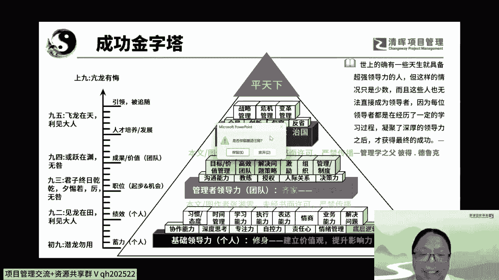
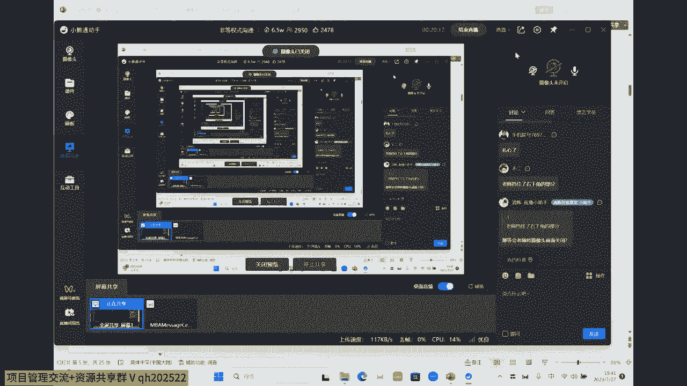
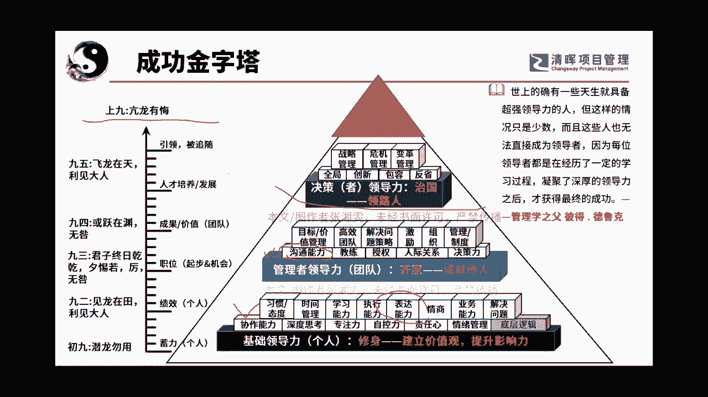

# 沟通管理的三大因素：人, 事，环境 - P5：5.成功金字塔 - 清晖Amy - BV1Sr421F77Z

之上此张图是独家自有啊，独家自有，所以这个我在想我是不是要把那个摄像头关了，因为这个好像呃呵呵影响小小小部分的字啊，这个影响不大啊，那么我们来看一下啊，嗯这里呢中西结合我们就不管它了啊。

中西结合我们来说说我们中国的吧，我是比较喜欢我们中国人文化的，大家知道吗，我们文王64卦当中，有一卦是讲一个人的一生啊，是讲的非常好的，那就是乾卦乾坤两卦中的乾卦，乾卦当中有六个爻。

六个爻呢不能哈哈哈哈，我直接回答你不能呵呵，独家拥有哈，你们可以看嘛，对不对啊，呃曾经拥有就可以了，呵呵是六个爻，这六个爻呢，分别代表着我们初入社会开始的六个阶段，而这六个阶段呢正好对于我们来说。

也是我们人成长和我们需要学习的一个过程，呃一直以来大家都知道要引导力啊，啊要领带领团队工作呀，啊要干啥呀，对不对，但是从来没有任何一张图谱来告诉大家，我们到底要怎么培养自己，能够让自己一步一步的成长。

那么我们先来看看这六爻，六爻呢是那个乾卦的六爻，第一爻是底下叫初爻，大家记住啊，上面叫第六爻，初爻二爻三爻四爻，五爻六爻，一共是六个爻，每一爻代表一个阶段，第一爻叫什么呢，叫潜龙勿用。

也就是我们大学刚毕业的时候，这个时候呢我们的经验右下角呃影响不大，那我就把它关了吧，好吧，你们哎我也就是我早知这样我就不露脸了。

我就是最讨厌露脸啊，呃放弃一下啊，嗯我看一下我怎么关掉，我把摄像头关了，诶。

关掉了没有，关了啊，好啦我自由啦，我可以横着竖着嗯，嗯讲课了啊好啦，大家能看到我的PPT的啊，那么我们来讲啊，关了干啥，他们说右边右下角的字看不见了，确实后面有些图会看不到的，所以我关了哎，见过脸了嘛。

这张老脸没啥好看啊，那个那没没没啥好看啊，就赶紧看PPT嘛，啊PPT又不给你们对吧，你们还不自己多看两眼，我们先来看啊，初爻啊，初爻呢叫潜龙勿用，指的是我们大学刚毕业，这个时候呢经验并不是特别丰富。

所以这个时候我们应该干嘛，积累自己的个人经验，所以大家可以看到啊，初爻和二爻九二啊，它呢是针对我们的叫做基础领导力，就是我们基础个人叫修身，修身的意思是干嘛呢，要锻炼自己的能力，把自己的的能力提升上去。

以基于给别人看到，增加自己个人的影响力，所以在这里我们会有很多的技能可以去学习，等会儿我们会帮大家讲一下，我先把九爻给讲了啊，那么潜龙勿用之后呢，其实这里是在蓄力啊，然后这个勿用并不是指不用。

而是说现在要蓄力等待使用的意思，九二呢叫见龙在田，利见大人，如果你努力的去学习，积累力量，发挥了自己的余力之后呢，利见大人就是你能够见到对你有利的人物，会得到高层人士的赏识，大家想一个大学生啊。

在基层岗位上埋头苦干了几年，做出了一点成绩，慢慢成为了个骨干领导，是不是会特别重视，说哎这小姑娘这小伙子特棒，是不是这样子的感觉，所以这就是九二，所以在初九和九二这里呢，我们主要的力量是聚集在哪呢。

是聚集在个人的能力上的，来我们看一下个人的能力呢，扁平的这一块呢，是叫做我们的基础的核心的一些什么呢，啊一些带有逻辑的底层逻辑的一些底层能力，在上面是我们要培养的能力，我给大家举几个例子啊。

比如说时间管理，这个大家都很熟，人说哎呀时间管理外面的书也很多，对的时间管理确实书籍非常的多，但是属于时间管理的核心在哪，它是需要我们下面的底层能力的，比如说他需要时间管理。

它就需要什么专注力加自控力加做好计划，做计划大家都知道，如果你去看一些外面的书，什么番茄时钟啊，什么那个啥啥啥呀，做好计划啊，紧急紧急什么那个重要重要不紧急呀，是不是有很多的做计划的方式。

但是时间管理最最核心的一个点，大家要注意是什么，第一个就是你要有专注力，就是当我去安排说唉我要做这件事情A的时候，你在做A的时候，你有没有专注力，你能不能专注进去聚焦，把这件事做完，第二是自控力。

你有没有能够按照计划去执行的这个自控能力，所以大家就可以看到，所以任何一个上层的这个能力，其实都是由下层能力打组合而形成的啊，它不完全是大家想象当中，按我一个时间管理就简单的就可以了，比如说学习能力。

他就需要深度思考的能力，对不对，加上专注力啊，再再加上一些自己学习的各种方式，这种东西叫随时能力，所以大家可以慢慢我们每一个人，我在这跟大家说一个东西啊，等于学校今天不是讲沟通吗，怎么讲，讲扩出去了啊。

我想了老半天，我还是把这张成字成功，金字塔是我自己独创的，这张金字塔呢我还是给到我们的大家啊，我想让大家能够知道自己可以在这里面去挑选，我自己喜欢的能力，或者是我觉得我欠缺的能力去做这方面的补充。

在这个世界上，人和人是不可能完美的，所以我也不可能在所有的方面都完善啊，我可以发挥强项，但是我也可以弥补弱项，单看我们自己的内驱力，大家能理解我的意思吧，好那么比如说啊大家可以看一下。

这里面有一个东西叫执行能力，执行能力和执行力是两个概念，如果在管理层面，我是不提倡执行力的，为什么，因为执行力是一个伪命题，很多的企业曾经呃要求说跑过来说，我要做内训，我下面有几个部门啊。

这几个部门他们的执行力太差了啊，所以你能不能去帮我上一个课，就能够让他们把执行力给提升上来，这其实是一个伪命题，执行是要靠双方的管理者和被管理者啊，管理者和被管理者，所以呢你可以在管理层面。

你没有看到有执行力这个能力，但是对于我们个人来说，培养一个具有的执行能力，唉这是个很棒的能力，大家想想对不对，对于个人来说，我具有执行力，这是我本应具备的一个能力，所以大家可以听听这个意思啊。

就比如说情商，那他就跟情绪管理是肯定是息息相关的，好啦我要拉回今天的主题，那么对于个人来说，首先沟通管理，很多人第一反应想到的就是什么啊，第一反应想到的就是哎呀，我要能说会道也没错，所以叫表达能力。

我是有专门表达能力的沙盘课程的，这是培养个人的能力的，那么表达能力呢它对应到大家可以看一下啊，呃我要讲一下，就是沟通管理他的，在我们人生成长和能力的素养的这个范畴里面，它所占的位置在哪里。

这个是非常重要的啊，那就是表达能力，表达能力呢是沟通的能力的其中的一个部分，就是我们要说嘛，对不对，所以从个人的角度来说，我至少能把话讲清楚，能做好汇报对吧，能做好向上的沟通啊，能够提问啊。

能够问问题啊，能够表达这个，所以我们对于个人来说，我们要增加自己的什么表达能力，表达能力呢分成左脑和右脑各有六个套路啊，那就是那就是素了啊，套路对吧啊哈哈，大家一听啊，这个就知道了。

那么沟通能力那就非常庞大的体系，我们今天会讲到沟通能力啊，会讲一点好，我们再往上看，如果我们个人比较能干了，并且得到大人的赏识，所以我们就到了九三，九三叫什么呢，叫君子终日乾乾啊。

这个钱钱这两个字好像现在说有误差，那个就是我们不是在哪儿挖了一个墓吗，那个墓里面出的那个易经，好像是中日渐渐就是健健健康的键，还是键盘的键，就是终日渐渐啊，应该是健康的健，所以那个就有点对了啊。

君子终日渐渐啊，兮亦若利无咎，啥意思呢，他就是说呃因为领导赏识你，就把你提到为一个小的领导岗位上，那么这个时候当你上升到一个岗位的时候，你是要影响你手下的人工作，所以你不可以有太多的错误啊。

所以呢你要天天呢要非常的警惕，时时的烟也要求自己或部下啊，不能有失，这个就是九三，所以大家想想就是职位了嘛，终于开始做小领导了，起步了啊，包括我们做一些项目经理了，也是算在内啊，我们终于起步了。

我们开始带团队了，再往上叫或跃在渊啊，也叫是无咎，无咎，就是无错的意思，什么意思呢，就是你做到一定的程度以后，你就往上发展了，地位呢也慢慢的变高了，成为一个高层的领导，为高层服务了。

这个时候呢所面临的局面也就是非常的大了，但是在这个层面一定要仔细认真谦虚，因为为什么呢，这个时候既可能是你大放光彩的时候，有可能也可能你怎么样会跌的很惨，所以在这里呢经常是上上下下。

所以在这两个阶段我们应该要干嘛呢，我们要做好管理者的领导力，也就是齐家成就他人，带领团队把活给干好，那么在这里呢啊在这里的话呢，我们来看一下，这里有一个就是沟通管理对吧，我们今天因为不讲领导力。

所以我这不会讲太多，我就是从个人的角度，我可以跟大家讲，所以我们一直从我们工作开始啊，从我们初九潜龙勿用开始，一直到我们的九四啊，护佑而在渊你都需要非常强大的沟通能力啊。

你要能够把沟通的事情表达明白了啊，你才有可能带领你的团队啊往前蹦哒啊，才能够作答啊，打好什么高效的团队，做好管理，然后带领着大家一起去冲锋啊，乘风破浪完成一个一个任务啊，所以这个是九四。

九五呢是飞龙在天，利于大人啊，利见大人，这里又有一个利见大人，这是什么呢，比如说CEO了啊，然后这个时候呢大家要注意你呢，这里的利见大人有两个，第一个利见大人，你本身就是大人。

因为你要去发掘下面的初九和九二的小朋友，这是第一个点，第二个利见大人是因为你自己已经站的很高了，所以你遇到的人也都是和你一样优秀的人才，所以大人见大人啊，利见大人就是这么一个意思，所以这是九五啊。

所以九五呢就是代表了最上层的两个领域啊，的时候，那你的目光就要注重在人才的培养对吧，以及怎么样带领我们的公司去破局啊，在最上面，有一个其实不在我们的六个这个阶段里，叫上九亢龙有悔。

这个有没有人看过那个武侠小说，我记得那个哪个武侠金庸的，金庸的一个武侠小说里面有一个那个丐帮的，就是那里面有一套拳呃，那个就是就是这乾卦的那个名字，不知道大家有没有人看过啊。

现在年轻人大家都不看武侠小说了啊，所以亢龙有悔呢，就是说我奋到最高端的时候，第一呢就是已经没有啊，奋斗啊，对对对对，降龙18掌没有了奋斗目标和动力了啊，嗯就是那个好像是射雕英雄传。

哎呀我好像还看过武侠片呢，呃天龙八部来的也有啊，那个就是六九，也就是上九，亢龙有悔，就是什么呢，我就没有奋斗目标了啊，那么这个时候呢就是什么有悔，那么这个时候其实你可以去呃，呃就是换个赛道也是可以的。

还有在这有一句话，什么呢叫功成身退啊，否则的话容易遇到风险啊，这个唉这个就是啊简单的跟大家讲讲啊，首先第一我也只是粗浅的啊易筋泥啊，仅是迷而已啊，所以呢大家就可以看到，我们的人的一生的职业生涯。

其实是可以用这个六爻来表示的，而在这六爻当中，说句实话，沟通能力，沟通管理啊，这个一直在我们的呃，人生当中是发挥着很大的作用，不仅是在工作当中。

