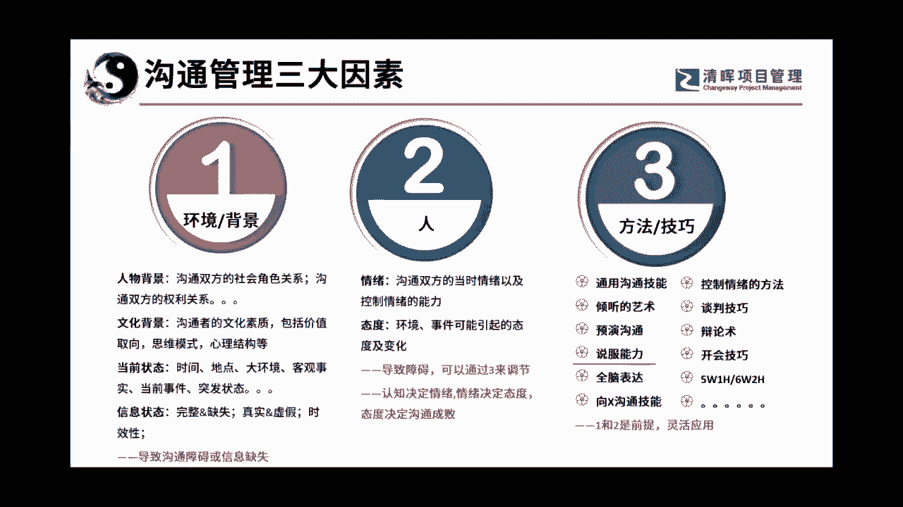

# 沟通管理的三大因素：人, 事，环境 - P1：1.沟通管理的三大要素 - 清晖Amy - BV1Sr421F77Z

所以我们来看一下啊，我们讲呃，我这我这一次的这个课程，但是我这个课程我没有全套全套特别大啊，分成了三个部分，第一个叫底层逻辑，我今天没有讲底层逻辑，因为大家比较喜欢听的是竖气啊，那个比较具有形象。

那么管理的一些原则，还有呢是技术，也就是应用场景，结合应用场景来判定我们在什么情况之下，使用什么样的沟通套路，所以是这么来玩的啊，那么沟通管理呢并不是口若悬河啊，这个大家要注意它最主要是什么呢。

是要改变我们自己的思维和思想，当你的内在思想的变化，它才是能够让你的沟通无往不利的地方，那么我们来看一看啊。

那么何为沟通沟通呢，我们这有一个我觉得这幅画我已经用了很久了，我觉得这几个讲的蛮好，沟通沟通沟者啊，渠道也通者，通畅理解也，所以沟是手段，通是目的，那这个呢是比较高大上的说法。

其实对于我们呃每一个普通人来说，在心底的最核心的想法很赤裸裸，其实是不太对的啊，因为我今天不跟大家讲底层逻辑，所以我不管他，但是这个心声是每个人都有的，就是我怎么才能让别人听我的。

这才是我们真正讲沟通想说的，哎我怎么能够让我的娃能够听我的，他就不爱做作业啊，天天在那打游戏，我怎么能让他听我的，是不是每个人都有这种想法，那我告诉大家，当以自我为中心的沟通的时候，其实是非常难的。

所以首先我给大家定个性，这个目标是错的啊，先跟大家说一下啊，那至于那个核心思想，我们以后有空啊，啊如果大家有兴趣请我做内训的话啊，我可以帮你们完完整整，把这个体系给大家好好的讲一讲啊。

那么但是每个人的出发点都是从这儿来的。

那么在讲到沟通的时候呢，因为我们没有讲底层逻辑，所以我想了一下，我就把我啊就是沟通管理的三大因素拿过来，先跟大家沟通一下，至少我们要知道沟通管理我们得关注哪些事，其实说白了其实就是四个字。

叫人市环境是不是四个字，环境就是说每一次沟通他的背景，双方的社会角色呀，沟通双方的利益关系呀，文化的一些背景，当前的状态呀，信息的一些状态，这个信息我拿到的是不是真实有效呀，对不对啊。

导致沟通障碍或信息缺失，那你的这个沟通成功的可能性其实就比较小，第二个就是看沟通的对象，我们说面对面的沟通是最直接，也最原始的沟通单据，所以有沟通者和被沟通者，或者是双方都是沟通者啊。

那么人在沟通的时候，当时的情绪啊，态度呀，我告诉大家，人事造成沟通失败的原罪啊，大家知道吗，一件事好好的，结果弄得声音不对了，哎你们今天怎么怎么这么慢啊，你看这话一说对吧，还是说各位老大啊，你们慢慢。

你你们今天来的有点慢，喏，你看这两种说法是不是一种就让人特别不爽啊，一旦不爽了以后，你还想不想跟我沟通，你有没有发现你就不想跟我沟通了，所以人是非常重要的一个因素，第三个却是我们眼睛看得最多的。

就是方法和技术，沟通的一些通用的技能啊，倾听的艺术，那人说唉，沟通诶，讲话诶，表达诶怎么是听呢，大家要知道沟通的前提是倾听，沟通的第一步其实就是听，所以倾听是有倾听的方式啊，寓言式的沟通是一个套路。

说服能力其实我们叫说服能力这个词好奇怪，大多数人都喜欢读睡，因为有我们古代的时候有一个词叫游说嘛啊，所以我就是老想打说说服，结果呢我在打字的时候发现拼音是说服，所以我就老改不过来，说服的能力。

今天我们其实要讲的就是说服，还有呢全脑表达，你看诶还有像X沟通的技能，什么叫X向上沟通，想听吗，向下沟通，想这想听啊，部门之间如何评级沟通，我相信你们特别想听，对不对，和客户之间对外沟通应该如何管理。

诶那也特别想要知道，所以这就是你们特别想要的东西没有，今天不讲，今天我给大家讲的是非等权沟通啊，是这个说服，等会我们来说一下说服，说服其实呃带有那个评级沟通的，有些东西可以是带在里面的啊。

大家可以看一下，还有怎么控制情绪的方式呀，哎你讲的你在沟通的时候是要控制情绪的，谈判的技巧，辩论述怎么开会，唉呀一堆一堆啊，场景是最多的啊，呵呵腻坏了，对不对，太坏了啊，张老师从来就没好过。

你们还不知道吗，我就这德行，呵呵呵呵呵好。

