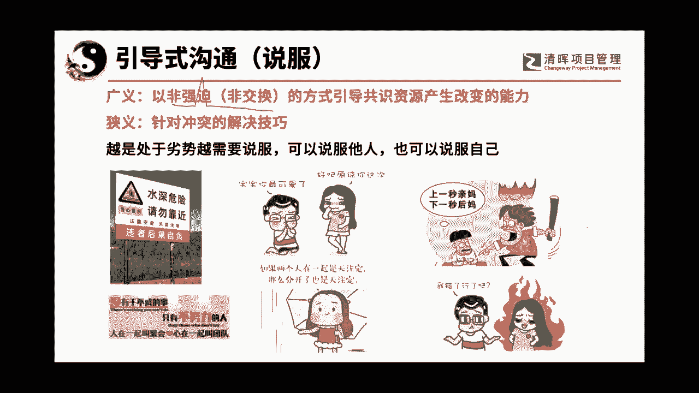

# 沟通管理的三大因素：人, 事，环境 - P2：2.认清你的说服对象 - 清晖Amy - BV1Sr421F77Z

其实也是非常好的一类哦。

你们真的以为今天的课程不好吗，今天的课程真的是一个很奇，很很好的角度去看问题，我们说我们沟通沟通的目的是为了好听一点，叫要达成共识，不好听一点就是我怎么才能引导着别人呢，按照我的想法把活事给做了。

对不对，按照我的想法来啊来走，那么在这里的话呢，第一种叫做什么呢，等权式沟通，就是双方手中都有确定yes说yes还是NO的权利的，这个一般的表达形式是谈判，谈判也是可以有课的，谈判也是一种场景啊。

我要先跟大家说一下，就是谈判记住双方手上都是有筹码的，才叫谈判，我们中国有中国的筹码，美国的筹码已经很明了对啊，就那几张牌，第一高科技的卡脖子，第二什么台湾牌，对不对，第三呢在我们的周围建什么军事要地。

对不对啊，军事威胁，不过现在军事威胁的，反正这几张牌也就这样了啊，那么那个唉呀这人说的啥沟通的天花板，就是给人洗脑嗯，呃等会我看看我的思路跟你合不合得上啊，我们待会儿来看一下。

所以呢谈判是双方都有权利说yes还是NO的，当有一方说NO的时候呢，谈判就不能成功，对不对，但是权利在双方，大家能理解吗，所以叫等权式沟通，我们今天要讲的是这个引导式沟通，啥意思，大家知道吗。

叫非等权式沟通，权利只在一方，而我想问大家一下啊，一个手上有权说yes还NO的权利，一个手上没有权利啊，没有说yes还是NO的权利，谁想沟通来各位老大们，谁想沟通，谁想沟通，哎呀你们都不想听课。

都在问CPU，这CPU啊，比我的那个沟通管理的课难道好听吗，有权的，肯定是没权的，大家能理解吗，没有权的，想沟通很简单，一件一人项目经理，项目经理说我想要公司答应我了，说要给我几个资源。

但是资源在谁手上，在职能经理手上，我是不是要求爹爹告奶奶的去跑过去，张总啊，王总啊，我跟您谈一谈好不好，我现在最近这个项目上需要两个人啊，你能不能给我两个很重要的人啊，是谁想沟通。

是那个没有权利的人想沟通，而我们在项目管理中，绝大多数的环境是非等权式沟通，理解为什么我今天要说说服了吗，说服这个课了吗，说服其实就是说我没有任何的筹码，我也没有判定权，但是我却想让你干嘛，给我呵呵啊。

按照我的想法，把我想要的资源给我理解了吗，所以这个东西才是非常重要的，对呀，没有筹码嘛，当然可不可以有筹码，有我作为PM，我经常会在企业里给项目经理创造筹码，这就是我干的一件事啊。

我其实就是把非等权式沟通变成等权式的沟通，我跟大家聊聊天啊，我所以今天是很愉快的一天，大家不用太过紧张，因为我们学的是神，而不是套路，套路这个东西千变万化，不到不一样的环境。

遇到这个人今天生气或者是不生气，他的做法其实都不一样，当你们把你们的底层逻辑学明白了啊，你们以后遇到哪是什么时候，其实它都是可以的理解吧，啊所以我们要学的是一个神，所以我最大的我在做PMO期间。

最大的一个作用就是给什么呢，给那些项目经理去创造一些筹码，让他们能有交换对等谈判的权利，比如说我让呃我在制造项目管理制度的时候，我说项目经理手上有工时，有项目的工时，然后那个然后怎么样呢。

资源部门他们要考核项目工时，哎我是不是人为的，就给项目经理手上创造了筹码，项目经理手上说我有500个人时啊，任天的使那个宫时来呃，那个你正好缺绩效，然后我们之间交换，哎你们有没有发现这个活就好干很多。

有没有发现这事儿，但是很多企业的平台没有搭建的那么好，所以大多数人还是什么还是说服，对不对啊，还有比如说客户啊，客户客户有一个点就是很多项目经理都说，哎哟老是要变更，老是给我们提条件，老是捣蛋。

是不是经常这么说，但是你知道吗，当客户给你提条件的时候，你应该反向思考一下，他其实在给你手上塞筹码哟，对不对，比如说客户跟你说，小张这个项目能不能提早一个月完工啊，因为我们公司有一个什么什么。

什么什么样的事情，所以呢我需要提早完工，哎你是不是觉得这是一个困难，但是在我眼里看，哎呀这是个香饽饽，为什么，因为他塞筹码给我了，大家有没有看懂这个点啊，就是说那个他可以塞个筹码给我。

他的意思说我有求于你啊，我有求于你，我希望你能够提早一个月啊，那么这个时候有的人说哎呀，回去就开始吐槽哎呀，领导，你要给我资源呐，那个这个要提前提提提前一个月完工啦，那个是根本不可能完成的任务啊。

啊这个这个实现不了啊，怎么怎么怎么地，那你要是我我肯定在那盘算呢，我跟你交换什么东西呢，那么我就跟人家交换说哎呀，如果你想提早一个月完工啊，呃我们经过仔细盘算，我做了最大的努力啊。

我已经向公司可以多要两个人过来，但是领导你也要给我，就是大家要做一些保障啊，就是比如说你既然要提早一个月，我们的需求就不能太频繁变更了，我们做个约定，可不可以到要完工之前两个月的时候。

你帮我签一个最终版的需求，并且在最后的两个月内你不要变更，那么这样的话我可能可以提前一个月帮你完工，如果你在这两个月里面你还要变更的话，那我怎么可能在两个月内啊，我怎么可能提前一个月帮你完工呢。

大家可以考虑一下吗，哎你看你是不是把你的条件就交换出去了啊，挑衅错了就交换出去了啊，你把对你不利的东西就交换给别人，这个东西就是叫把非等权式引导式的沟通，就把非等权变成等权，这个是我经常用的一种手段。

所以大家不要看这个三个东西之间，它们之间，尤其是他们两个之间是我经常拿来互换的啊，这个是沟通吗，有人说老师你讲的这个是沟通吗，这是沟通啊，是不是这是沟通啊，所以你们一定，所以我说我们说在沟通沟通的时候。

一定要记住你们换的是思维模式，而不是口若悬河，理解我的意思吗，啊你要想明白沟通的逻辑和本质是什么，你就会发现，其实这个世界上有很多的东西，是可以好好的坐下来谈的啊，呃我们为什么有的人就能把有些事情做好。

那真呢就说哎呦这人气场强大，沟通能力强，那他就强在哪呢，对不对，他就强在他的思维模式上好，那假设我手上真的可怜兮兮，没有筹码呢，那么我们就得要用一个方式叫说服啊，有在我们古代叫游说啊，叫游说。

游说是中国老祖宗的本事，在春秋战国时期，大家仔细想想，那些纵横家，他们是提着脑袋去给各位君王去沟通的，沟通的不好就直接被咔嚓掉啦，啊对不对，他们才是游说的老祖宗啊，游说的老祖宗，所以我们要有一定的方式。

那么这两种是我们在工作也好，生活中也好，都常见的，也会用得到的，第三种比较特殊，我实话跟大家讲，我没对他做研究，时间不够，来不及，还得帮你们上偏僻的课，软考的课还要改论文啊，就是时间是呃。

就是嗯就是没那么多啊，这个呢叫竞争式沟通，叫权利在第三方，比如说那个法院，两个律师口若悬河，在那里摆证据，讲事实啊，说东西最后谁是说yes还是NO的，有权的人啊，是法官，大家有没有发现。

所以这种一般叫辩论演讲啊，法院的打官司一般用的是这种方式，在我们的职场上，甚至在我们的家庭里不适合用这种方式，因为这种方式会激发我们的矛盾，引起冲突，我们就把他cancel了，可以吧。

人的研究精力是有有有限的，那么我们再来看一下什么是说服啊，我们给他做了一个定义，以广义的来说叫以非强迫，非交换的方式引导共识啊，资源产呃呃就呃不是共识资源产生改变的能力。

我觉得这资源两个字我也可以去掉啊，这个语言还还是没有精炼啊，就是引起共识改变的一个能力，狭义的来说就是针对冲突的解决方式啊，越是处于劣势的人，越需要说服，可以说服说服说服他们，唉其实是说服。

也可以说服自己，这个是它的定义，来各位老大们跟着我走，这个是说服吗，Yes，还是NO就可以了，yes还是NO，为啥是NO呀，哦命令啊，不是我说出去，但是最后说下水还是不下水的，是立这块牌子的人吗。

不是的，判定权还是在那个人手上，所以是yes，理解吗，所以天下无处没有说服很多的广告，很多的数字的牌子其实都是说服啊，我也不是警告他，只是告诉你这里水很深，但是你要下去的话，他拦不住的。

所以最后的决定权是谁的，还是在这个呃就是下水的这个人身上，大家能理解了吧，唉这么一说就明白了，我们再看一看这个呢，没有干不成的事，只有不努力的人，这个跟那个水深的危险是一样的啊，就是他只有劝服的作用。

但是个人要不要努力，是谁的事儿啊，是啊就是谁谁最后决定要不要努力，还是那个被劝的那个人理解吗，所以第二个也是yes，好了，我来我看看第三个啊，如果男朋友惹女朋友生气了啊，惹女孩子生气了。

他现在要想办法哄女孩子开心，这个是不是说服yes还是NO，今天轻松一点，很好玩哒啊，有yes有NO，为什么是NO，女朋友还能听男孩子的吗，这么多人NO，唉我我想我我想讨论一下，说NO的是男孩还是女孩啊。

你那个那个情场商有点有有点堪忧，包括那个吴亦柱啊，那肯定是yes了，小姑娘想不想原谅你，决定踩在女孩子手上啊，就是非强迫的，非交换的权利不在你手上的啊，哈哈对不对，权利是不是在女孩子手上来。

再来一个哎呀，这个女孩子她失恋了，然后她就安慰自己说哎呀，两个人在一起是天注定，如果分开了，那也是天注定，那唉你就不要伤心啦，来这个是不是说服yes还是NO，我告诉大家，有很多人连说服是啥都搞不明白啊。

跑过来听课了，对不对对的，这是说服自己啊，也是的，但是这个稍微有点特殊，因为一般说服自己的话就比较能够说好，对吧啊好了，我们来看两个NO的这个手啊，刚才还有人跟我好像我看给了个回音。

说哎呀这个教育娃这事儿，那真的是哎呀，那个比做项目还累啊，我我真的我告诉大家带娃，你把它当项目做，你的带娃能力强不强，我不知道，但你的项目管理能力一定能增强啊，上一秒是亲妈，下一秒是后妈的。

那个叫她做作业，那不是说服他说是手里拿了个啥东西，你知道吗，拿了个大棒子啊，请看啊，我们的说服是以非强迫非交换的方式啊，那个说赶紧做作业，做完了以后我给你买零食啊，那也不是说服啊，那叫利诱。

其实叫交换理解吧，其实在我们的职业生涯，或我们的生活生涯当中呃，交换式的就是谈判式的呃，等权式的和非等权式的这个方式，它是一直以来在相互互动的，带娃绝对比做项目难做多了，我项目管理能做的溜溜的。

但是带我家的娃，我是动足了一切的脑子啊，就就感觉真是啊寿命都减短了10年啊，终于把我家娃弄到大学里了，哎呀我真的是差点我喊万岁啊，哈哈哈哈好吧好，这个呢这个他在哄女朋友没哄好啊，这一页我留一留啊。

他说我错了心了吗，对不对啊，那个这个也不是说服好了，我们来看一下，既然我们要说说服呵呵，都是失业了，带娃比项目好多了呵，做项目能赚钱，带娃是嗯，就是就是送钱的。

我们来说一下，就是说服的对象，我们大家知道吗，就是我们如果想要做沟通管理的第一要素，也就是第一步是干嘛呢，啊，是对是了解是定位，定位什么呢，就是你要知道你说服的对象，他在哪一个位置。

大家还记不记得我们干事人管理，还记不记得官事人管理我们有五个呃，那个支持程度还记不记得，有不知道有抵抗啊，有中立啊，有支持，有领导，还记不记得那五个呃，五个干事人的呃，参与程度，来来来偏僻。

刚考完的娃们，各位老大们，哼哼哼哼，有没有人还记得那个干系人管理里面对抵制，不知道抵制中立支持领导，我就是通过那个东西，我做了这一章量表啊，我呢其实把说服的对象首先分成三类，第一类呢是反对的。

第二类呢是中立的，第三类呢是支持的，还给老师了，是我的娃吗，哈哈是我的同学吗，哈哈啊，是我的同学，我就当不认识你了啊，那个肝肾管理是特别重要的啊，那么反对大家可以看一下啊，反对呢我又把它列成了两种。

一种是愤怒抵抗，第一种，二种叫质疑怀疑啊，质疑怀疑中立的话呢，不知道其实很好办，从不知道到知道是不是比较容易中立，其实有两种，一种叫无感啊，啊这个事情吗，哦跟我没关系，我不嘛，我没兴趣。

我我家娃大多数情况之下在无感啊，我跟他说啊，我跟那个跟他说，我说哎最近有个电影哎，那个就是封神封神封神演义，我说好像拍的非常酷炫，我说我们去看电影吧，因为他现在在放假嘛，在家就在我隔壁啊，在在在在家里。

他说那有什么好看的，就走开了，冷冷的啊，反正我们家娃在家里的给我的表情，就是我欠了他500万啊，就是现在啊那个嗯男孩子就是在表现啊，不不不不啊，现在的小孩很聪明的啊，像看小孩很聪明的。

他其实这酒就是要无感，那么还有什么呢，就是犹豫啊，犹豫就是哦左边也好，右边也好，其实他也是中立，中立的原因是他犹豫，那么支持有两种，第一种呢叫认同啊，认同就是什么呢。

认同的话呢其实就是说我认为你讲的是对的，但是我却没有动力去做它啊，领导呢是我全心投入支持啊，所以叫领导型，所以这个其实我就是学了那个啊，就是该神的这个等级啊，给自己画出来的这张图啊。

所以呢我把这里面的定位呢就分成了三大块，一共七个小块，那么你从任何一块往任何一个方向移，其实都是非常不容易的，来我们现在就玩一下定位可以吗，来我们看一下啊，那个妈妈说你查完生字，写完背完啊，再看故事。

然后那个小姑娘说，为什么啊，为什么啊，他在干嘛，他是哪一个位置的反对中立，支持中的哪一个，不好玩是吧，大家都不跟着我玩，质疑啊质疑OK啊，质疑我再来问大家一个，这个是对的，再来问大家一个。

我跑过去跟我儿子说，你应该要好好读书哦，你应该要好好读书哦，啊你然后我们那个我我我儿子一声不响，也不看我，你觉得他在哪一个位置，哎我告诉你这个很难，你觉得他在哪个位置，不知道无感，不是的。

不是你们很难猜到他在哪，现在的孩子他们都懂道理，我告诉你，他在这儿他认同，他不觉得你讲错了，如果他觉得你讲错了，他是会反抗的，比如说你怎么老打游戏，我告诉你，他一定说你哪一个看到我老打游戏了。

他立马就反抗了啊，现在我还忍不住的啊，他陌生不想沉默，表明他的认同，他也知道读书对他来说是蛮重要的啊，对沉默也是反抗，所以我们你看我们说反对是要定位的，大家能理解吗啊，抗拒愤怒是反对质疑也是反对。

我不知道也是反对，无感也是反对，犹豫也是反对认同，嘿嘿嘿，有的时候哼哼哼也不是个好事儿，唉我认同，但是就就跟我们女孩子一样，大家都知道要不要减肥啊，哈哈认同的对吧，但是都是看着好吃的东西。

说先把这顿吃了才有动力减肥啊，哼哼哼，认同理解吗啊，认同也是反对的一种，所以我告诉大家，只有他不是反对，哈哈哈哈呵呵啊，所以大家可以看啊，就是而且不同的人他会站在不一样的位置上。

好像听说呃最近在什么地方啊，老是看到那个UFO啊，有没有听到过雪茄型的UFO，我好像在哪里看到有这个小新闻还是怎么滴啊，那你们是来你们告诉我你们会站在哪个角度，我想问一下有外星人吗。

来你们找一个位置找找啊，找个位置你你会是哪一个位置啊，有的人说质疑，有的人呢无感，关我啥事，有的人说哎我认为是有的，对不对，大家有没有发现其实不同的人，所以你的第一步就是要判断啊，你是认同对不对。

你看是不是每个人都不一样，所以大家知道吗，第一步就是你要判断跟你沟通的对象，他现在所处的位置是在哪里，你再去向资源部门老大要人的时候，你猜猜他们是在哪个位置，猜猜看他们会在哪个位置，资源部门要人的时候。

那些职能经理是处在哪个位置都有，对吧对啊，哎呀你们现在都聪明了，我挖的坑一个都没往下跌啊，领导型的那肯定很少，我告诉你大多数的人是认同的，因为你前面在项目章程的时候，已经跟他们说过了啊。

我们现在这项目利国利民利公司啊，我们也签过字了，答应给人了，你是认同的，但是我不想给我的人很忙，大家能理解吗，哎所以大家都知道，但我今天没有讲认同，我今天讲的是一个最差的，就是抗拒愤怒的啊。

怎么去变化的一个方式啊，当你确定好他是什么人的时候呢，我们就要用不一样的套路啦，然后呢我们再看第二个啊，如果一个你你是一个营业员，你看到一个人跑过来，在你的就是店铺里走了一圈，面无表表情的就走出去了。

你觉得它对于你的商品是什么样的定位，想想看认同吗，无感啊，小九同学说得非常的好啊，来跟着我一起玩嘛，对不对，大家今天嗯不好玩吗，啊是无感，无感的话，一是无感，因为他看了一眼，觉得这没有我需要的东西。

他就走掉了，这样的人一般来说也不是额，营业员应该关注的对象啊，就是嗯我有一个妹妹啊，呃应该算表妹还是算堂妹啊，堂妹啊，他是专门做珠宝的生意的啊，他看人就特别准，一个人跑进来，他就可以跟我说啊。

这个人我要去跟他谈一谈，另外一个人跑进来，我说哎你有人进来了啊，因为我有的时候去，喜欢到他的那个店铺里去玩嘛，对吧啊，然后然后他说唉那个人你不用管一看，就知道他不会来买东西的。

其实很多营业员为什么能感觉到，就是他心里也有一杆秤，这个就叫量表，我现在就给大家看到的是一个量表，那么如果他进来以后啊，他那个他就是比划了以后，比划了好久，然后呢问你价格，然后你告诉他价格以后。

他说这东西好贵呀，它现在是什么定位在哪啊，他定位在哪，你们别小看我现在问的问题很重要的犹豫，呃犹豫是什么呢，他手上拿了两件衣服，不知道哪件更好，叫犹豫啊，叫犹豫嗯，他应该是对这件商品的价格是抗拒的。

但是对这一件商品它是认同的，能不能理解，我告诉大家，其实这种定位还要分东西的啊，我只是用日常的东西在给你们讲啊，等会我们给你举一个商场上的例子，你们就有商业的例子，你们可能就更明白一点啊。

也就是说它是割裂的，他对你的商品是认同的，但是他对你的价格是抗拒的，明白吗，所以你在这两块上的策略是不一样的，你要把他的认同变成领导，让他的心里永远挂住，这里有一件衣服是他特喜欢的，同时你要干嘛。

你要削弱它对价格的抗拒，于是这个单子就能做出来，其实我告诉大家呃，这个说服的课程是可以拿来做营销的，做销售培训的，但我我不是主要讲销售的啊，所以大家要知道是这么一个玩意儿啊。

好那么我们拿一个商场的例子呃，一个商业的例子来说，他说客户在5年前购买了我们的生产设备，质量很好，一直没有出现什么问题啊，最近客户呢又想购买一台设备了，问了价格之后说价格太贵了，没有优势。

并转头找了另一家公司购买了，要给啊，相对要给相对服务的一个便宜，就是要价啊，相对便宜的一些服务，来，这个例子，其实和我左边的那个例子是非常的相似的，这个你们会玩了吧，参考一下左边的你就会玩儿了啊。

来各位老大们啊，你们好像也就在做做选择题的时候，好像相对更积极一点啊，这个玩的课你们也就玩着玩着啊，哼来这个是对，这是什么的立场，对呀，对于产品的质量它是认同的，但是它抗拒价格理解吧。

所以我们在做对策的时候，你就要针对不一样的东西产生不一样的策略。

好了，这是说服的第一要素，我们来看第二个要素，第二个要素就是沟通，也是沟通的底层逻辑之一，就是要打造一个安全的开发的环境，什么意思呢，开放的环境，哎呀我这个打字怎么老出错呢啊，开放开放的环境啊。

开放的环境不要老想着打折，打折不是我们沟通这边你要打折了的话，那叫做那叫谈判啊，你让一步，你有筹码，他有筹码啊，好也就是说大家想啊，如果我们在一个非常紧张的气氛之下，我们来沟通，你可能会沟通成功吗。

其实是很难沟通成功的，比如说我在训我家娃的时候，我家的娃特别的就是一脸的不耐烦，但他呢也不回怼你，他也知道回怼了以后可能挨揍啊，我们家小娃小时候就这样啊，他要回我了，就打小屁屁啊，不回我呢。

他就在那两只手紧握着拳啊，然后一声不吭，眼睛呢什么地方都看，就是不看我，你觉得在这样的场合之下，这种沟通可以实现吗，能不能达成共识，这几乎是不可能的，所以大家要知道，信任和开放的态度。

更容易构建什么沟通的安全场域，首先的话你们又跑偏了哈，要赚利润不是跑量吗，我们今天是讲利润吗，哈哈不是的，我们是讲怎么在不打折的情况之下，把东西卖给他好吗，完了我也走偏了啊哈哈，我也走偏了。

来我们拉回来，所以我们要打造一个什么呢，安全的场域啊，打造一个安全的场域，开放的态度，在安全的环境之下，双方才能愉快地去做好交流啊，才能做好交流，这样的话才能容易达成共识啊。

那么如果你一定要在沟通中善于发现不安全感，比如说今天有一场会议，领导在上面侃侃而谈，谈完了以后就问大家，唉，各位同志，你们有什么意见吗，有意见呢，现在可以提一下，下面鸦雀无声。

你们觉得这个场域是安全的还是不安全的，来各位老大，这样的场域安不安全不安全对，为什么恐怖哼，大家都不敢出声，对不对，抗拒就是这个时候你是你，如果这个上面的领导是真心想要意见的，你是拿不到意见的。

达不到你心里的要点，如果这个领导本身也不想听人家意见的啊，那他也拿不到意见，对吧啊，对于领导不安全，对于自己安全，对棒啊，这个站在两个角度说话的很好啊，纬度又提高了一个啊。

所以呢我们要善于地发现不安全的地方，就你不要以为沉默是什么，沉默叫消极的抵抗，大家能理解吗啊领导就是意思一下，那就看你怎么领悟了，有的领导说我们这是个头脑风暴会议，来大家一起说一下话吧。

结果下面鸦雀无声啊，头脑风暴会下面鸦雀无声，你觉得你这就完了吗对吧，如果你发现啊这个环境是不安全的，那我们要暂停对话，大家要记住，打破安全的僵局，再回过来对话，这才是做好沟通的第一步，你就记住。

没有一个安全的场域，是不可能实现你沟通的结果的。

