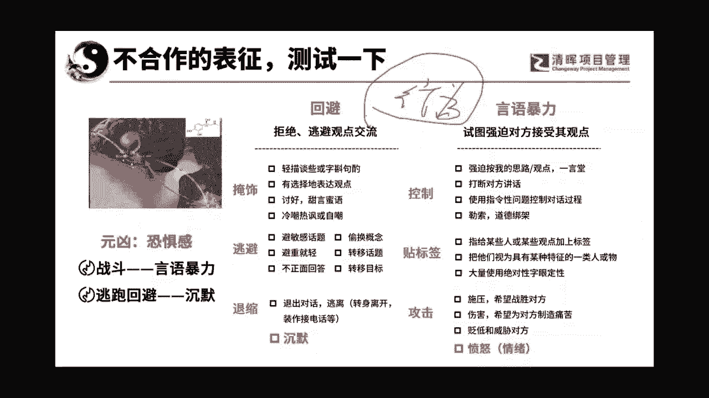
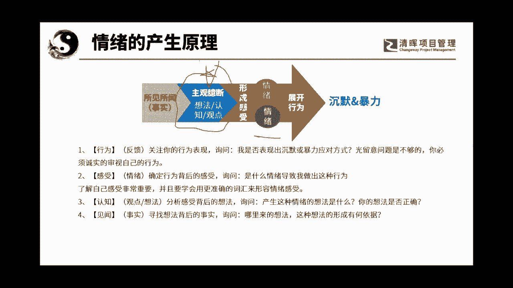
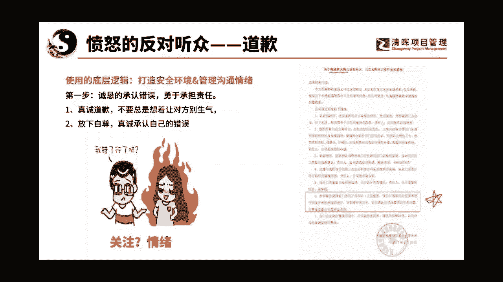
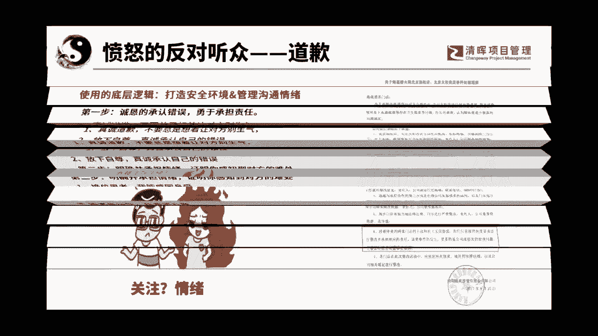
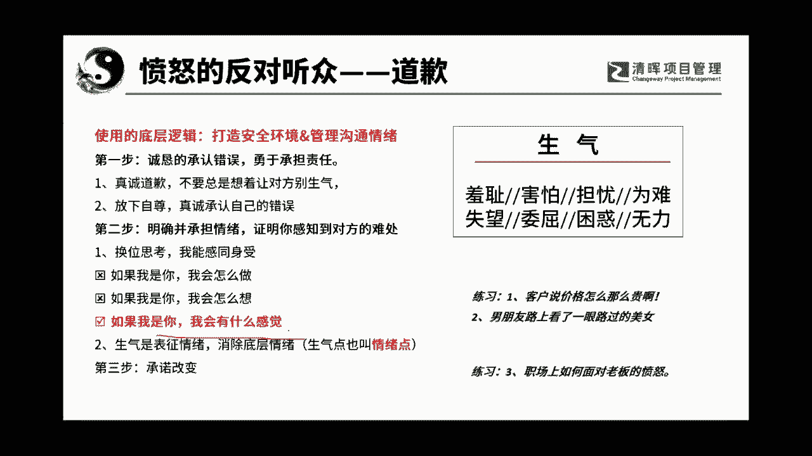

# 沟通管理的三大因素：人, 事，环境 - P6：6.情绪的产生原理 - 清晖Amy - BV1Sr421F77Z

所以我们来看一下啊，就是不合作的不安全的场景，最重要的是有两块，就是当一个人不想跟你沟通的时候，你要从两个角度看，第一个叫回避，第二个叫言语暴力啊，叫言语暴力，回避就是拒绝逃避观点以及交谈啊。

这个东西就叫回避，好玩吧，还可以吧啊这个课没让你们失望吧，哈哈哈啊，那么它有三种很很常见的表现形式，第一种呢叫掩饰，掩饰呢就是啊掩掩盖盖啊，有选择性的去表达一些关系，甚至有的时候就讨好你，哎。

不错不错哎，是不错啊，其实他没有把真实的东西交换给你，对不对啊，就是掩盖了，有的时候还会冷嘲热讽啊，这个还贵啊，要不我送给你算了，要不再打个两折给你，你要不出门去拾一个对吧。

这是冷嘲热讽的一种或者是自嘲，也是一种掩饰，大家能理解吗，这是一种看到这种，你就知道这个场域不安全了啊，这时候你得停下来，不要忙于沟通，因为这时候你忙于的沟通是没有好的结果的，人家已经反抗你了。

他已他已经反对你了啊啊这是第一个，第二个是逃避，逃避就是我不正面作出回答啊，不什么叫不正面做回合啊，或者是转移目标，转移话题，比如说啊刚才我我露了个脸对吧，我穿了一件白衬衣，我又来问你，我说哎。

各位你们觉得我今天穿的这件衣服好看吗，嗯人说一件白衬衣有什么好看啊，但是你又不能说我不好看，对不对，那我想拒绝回答这个观点，所以呢我就偷换概念，我说哎呀这个颜色还是非常衬你哦，白色衬谁都一都好衬啊。

哈哈哈对吧，白色嘛，对不对啊，哎这个色彩对你很衬你诶，他没有正面回答，你心里想说，就这么件衣服这么丑，你还好意思让我评价，对不对啊，算了，我夸你个色彩吧啊这是第二种逃避，所以你遇到了类似于这种偷换概念。

躲避敏感话题啊，那种避重就轻的，那也表明这不是一个安全的场域，你们的讨论的，他沟通的结果其实是非常难达成共识的，那么第三个就是沉默，就像我儿子那样，我那小时候的时候，小学初中的时候，我要训他的时候。

他把两只卷拳头捏得紧紧的，就恨不得逃开了，就是不敢逃，逃开了，可能老妈要挨揍啊，然后呢眼睛什么都看就不看我啊，然后呢就是那个一副面无表情，那其实就是沉默，那包括开会的时候，没有任何人给出信息。

交换有价值的信息的，那其实都是回避，对肢体语言就说明了这一切啊，这时候你应该要撤退的就是你，你要停一停啊，任何这个时候采用任何的术都是没有用的，理解吗，这时候任何的武功招式都没有作用。

那么第二种叫语言暴力，语言暴力呢第一个是控制，控制里面最最可怕的一种叫道德勒索，就是爸爸妈妈经常对孩子的，我辛辛苦苦把你养大，你就是这么对我的，你对得起我吗，呵呵这种事控制啊，这种是控制强迫。

按照我的思路走，我是为了你好，对你们比我还熟，对吧哈，爸妈那一套，哎呀你说你不结婚了以后可怎么办呀，对不对，哎呀你看我们已经这么大年纪了，我们不就想看到一个孙子孙女嘛，对不对，嘿嘿体会控制对的啊。

哈这个这是道德绑架啊，贴标签啊，贴标签就是说啊那个给你一个啊，给你一个那个叫叫什么来着，嗯控制用的不少啊，啊给你贴个标签啊，你看看你啊，你你是鱼吗，来我问你，你是鱼吗，我在讽刺你哪一点，有没有人知道。

你是鱼吗，记忆力大家都懂啊，是不是记忆力啊，意思就是说你就这么健忘吗，其实这种其实都是叫贴标签啊，啊哈我妈就是控制和贴标签，呵呵七秒的记忆对吧，对呀啊，那更甚者就是攻击狡辩啊，诋毁甚至会威胁老美。

就喜欢用威胁啊，你听不听话不听话不听话，我揍死你啊，那个我们有的时候带带娃也是这样子，对不对啊，所以大家都知道，回避和语言暴力其实都是不安全的啊，其实都是不安全的啊，什么叫听不懂怎么办。

哈哈鱼就只有七秒钟记忆，哼哼实验证明对吧啊，那就是一个谬论，对吧好了，当我们讲完这个东西，大家知道回避和语言暴力其实叫什么，大家知道吗，叫行为啊，我其实今天是借着竖气的抬头再给你们讲逻辑。

再给你们讲沟通的逻辑啊。

希望大家能有兴趣听一下，我这东西是很干货的，各位老大平时都是不拿出来，我今年啊那个智力大放送啊，哈哈讲了问题管理，再来讲沟通管理，哈哈嗯哼来我们来看一下啊，清蒸鱼很好吃，你们这个歪楼的能力真是强啊。

哈哈哈哈哈好，来听好了啊，我们来讲一个非常重要的东西，其实这个其实在心理学啊，人家说那个心理医生啊去做人，帮人家治疗的时候，往往要要用的就是没有啦，就沟通管理的课，就这个今年没时间做了。

下半年要对付软考，呵呵呵呵呵哼没空干这事儿了啊，所以趁着两次软考中间啊，赶紧给大家嗯那个啊播点小种子啊，让大家稍微知道点东西啊，好那我们来看一下，我们说呃那个沉默暴力这两个行为。

这两个东西叫行为行为都是因为情绪展开的，大家能不能理解啊，情绪展开的那情绪是怎么产生的，我告诉大家，想要打造安全的场域，是需要管理沟通情绪的，那么我们看一下PP也教啊，PNP不是现在正在交吗。

下个月PNP就考试啦，我正在忙着出PNP的选择题啊，啊还有我正在做最后80道准备啊，我们准备再编一套新的题，已经有100道了，再加80道嗯，我正在努力中，所以忙啊，来我们来看一下啊。

其实嗯这个就是经常从心理学里面经常说的，叫ABC情绪调节法啊，那么它是一个什么东西呢，他就告诉你所见所得叫事实，事实是不会让你产生行动和情绪的，之所以原罪在这里啊，是想法认知观点来，我给大家举个例子。

办公室正好有两个人在咬耳朵，大家能听得懂什么叫咬耳朵，就偷偷说话，然后我正好踏进这个办公室，这两个人立马就分开了，所以我立马就感觉怎么样，这两个人在说我坏话，于是我就形成了一种愤怒的情绪。

为此我后面就会展开我的行动，比如说我在拉开凳子的时候，我的油比较用力啊，哐哐哐的，大家有一点看明白了没有，真正让你产生情绪的是你的想法，认知和观点啊，所以呢你一定要明白什么叫庸人自扰。

大家能理解吗啊这个东西就叫庸人自扰，也许这两个人正好在说一件事，然后说完了之后正好分开，然后你又逢魔时刻，正好一脚踏进来，于是就变成了他们两个人在说你坏话，你这不是庸人自扰吗，本来就没事的。

然后你脾气就不好，然后对他们说话就阴阳怪气，那另外两个人就觉得，这个小张这个人怎么这么奇怪的，阴阳怪气的说话嘛，冷嘲热讽的哎呦，这种人少得罪少惹少惹，以后跟他少说话，你看是不是就搞不定了。

所以大家要知道控制情绪，我在这给大家一个情绪管理里面，因为沟通管理是要讲人情绪的，所以大家一定要注意到想法，认知观点，然后了解到他的情绪好了，我们把前面的已知已知条件啊。

基础资料，底层逻辑先跟大家要今天要用到的底层逻辑，还有我告诉你底层逻辑还有，但是我们就把今天要用到的那底层逻辑，先给大家low出来，因为如果我们不把底层逻辑讲明白，我们直接讲数的话。

其实是没什么太大意义的，我就告诉你哎，遇到这样的人，你可以用这样的方式，但是你其实底层的逻辑你是不明白的，大家能理解吗，我们今天就来讲一个大一点，反对到无感，什么叫反对到无感呢，因为反对到中立嘛。

中立的最常见的是无感，不知道是不需要宽的，不知道到知道，只要告诉医生就知道了，理解吧，所以往往呢我们遇到那种愤怒的，抗拒的，质疑的，怀疑的这些统称叫反对，我们怎么从反对把他拉到无感呢。

大家要知道一个人呐，他有一个自我的认知，当你想把他从一个自我的认知拉到另一个自我，认一个认知的时候，那他就是从舒适区跳到不舒服区，当他跳到不舒服去的时候，他一般都是会抵抗的，所以他的力量就非常的大。

你要什么呢，而且我们又不能用强迫的，不是交换的方式，所以呢要细雨润无声。

大家能理解吧，好了，我们来看第一个，就是如果我们遇到的是愤怒的反对听众，那么我们应该干嘛呢，我们说我们要道歉，有人说道歉道歉有用，还要警察干什么，这是我们经常听到的，哎但是我告诉大家，道歉是非常有用的。

但是道歉不能瞎道，刚才是不是有一句哎哟那个呃一个男孩子啊，他得就是就是那个把自己女孩呃，女朋友给弄光火了，然后他就在那说哎呦我错了，我错了行了吗，哎我你我问你啊，他说我错了，哎呀呀，你你别发火了，算了。

都是我的错，算是我错了，可以吗，女孩子会不生气吗，来我们女孩子说，我们女孩子听完以后是什么结果，我们女孩子听完以后是什么结果，听完以后是怎么想怎么想的，不这是男孩子说的，我们女孩子会不会消火。

我们女孩子会不会消火，更生气了，我老公在旁边讽刺我，说我不是女孩子了，是大妈，哼哼哼哼哈哈哈哈哈没有，他不是真诚的道歉理解吗，你知道他们道歉的底层意思是什么，他的道歉的底层意思，你看你我明明没有错啊。

但你还要说我错哎呀，这就是祖宗啊，那个菩萨呀，你事前对你事情太多了，你不要作啦，你放过我吧，你你看我都向你认错啦，我没有错，我都向你认错了啊，那个女孩子就在旁边，火气更大，你都不知道我在生气什么。

你你你你就是不想沉声道歉，对不对，是不是火气就更大了，要包包是不是要包包的问题啊，因为人是很难去啊，呃很难去呃，就是什么认识到自己的错误的啊，认识到自己的错误，你得诚心的道歉，所以他要真诚道歉啊。

不要总说着哎你不要生气了，你不要生气的目的是你不要为难我了，你看看我是多么的宽宏大量啊，对哈哈哈，所以要怎么道歉呢，啊我跟人家讲，是因为他们本就没有关注到啊，这个女朋友她生气的这个情绪的点在哪里。

我们这个是下一步来讲这么讲，怎么样叫做真诚的道歉呢，我们来看一个案例啊，这是一个海底捞，大家知道吧，在2017年的时候是曾经出过一个事件的，就是有几个记者，他在北京的两家海底捞的店的后厨混进去了。

拍了一些照啊，那那个后厨呢肯定大家懂得嘛，脏乱差是不是招人惨，两者各退一步，你们偏僻学的蛮不错的哦，嗯哼还各退一步对吧，兼容包容对吧，嗯啊你跟女孩子讲，各退一步，你不把女孩，女孩子不把你做的满头包。

那才是怪事啊，哈哈来拉回来啊，讲这个海底捞啊，然后呢，海底捞在这个事件爆发出来四个小时以后，他发表了一个道歉声明，前面讲的都差不多，哎呀我们错了呀，对吧，我们要接受那个客户的检查呀。

啊我们一定会痛改前非的呀啊等等等等，但是呢他最后在这有一个第六条，他讲的特别的好，他说涉事停止的两家门店的干部和员工，无需恐慌，你们只需要按照制度要求进行整改，并承担相应的责任即可，该类事件的发生。

更多的是公司深层次的管理问题，主要责任由公司的董事会承担啊，对啊董事会承担就是这一句话，哎这个文章发出去之后，几个小时之内，他就引发了风向就有点变了啊，风向就有点变了，为什么分享就有点变了，他们说哎呀。

现在这种食品公司啊，差不多都是这样子，后台都很乱，但是海底捞还是蛮好的，他们还蛮勇于承担责任，大家有没有发现他他们最大的一个问题，就是这是我们管理层的问题，是我的责任，不是别人的责任啊，不是别人的责任。

所以他非常勇敢的承认了自己的错误，怎么到洗脚了呢，各位老大啊，海底捞洗脚的吗，海底捞不是洗丸子的吗，对不对，哼哼哼啊，好拉回来，但是我们再想一想，我们在这个社会上另外的一个案例啊，另外的一个案例。

另外的一个案例就是城管打人事件，最后的结果是什么，来最后的结果是什么，城管打人，城管打完人以后，哼哼哼哼对呀，我们把那个临时那是临时工，我们没有错，都是临时工的错，我们已经把临时工编外人员给开除了。

是不是这个社会更加愤怒，哈哈大家有没有发现哎我告诉你，所以就是现在就是有这样的一个事情，大家知道吗，其实这是一个非常重要的点，所以承担责任是一个很重要的事情。

接着我们来看第二个。

第一步是承担自己是出了错了，第二步明确并承担情绪，证明你感受到了对方的难过或难处啊，比如说啊他说呃有的人是这么劝人家的，他说哎呀我我以前遇到过，就是我我我我自己就是呃在以前的时候，比较早的时候。

比如说我们看到那个，我经常有时候看到一些新闻说女子被家暴啊，女子被家暴，而且呢她交暴了好多次，不是最近的案子啊，最近的案子，现在我的心态已经非常平和了，就是以前的时候很多人就是被打了好多年啊。

然后才爆发的，我就是说他在敢打我第一次的时候，我我就应该爆发了，怎么会就有点恨其不争，你知道吧，就是如果我是你，我一定早就跟他绝交了对吧，我早就跟他怎么样了啊，如果我是你，我会怎么想。

其实这两种都不是感同身受，感同身受是我会有什么感觉，我说我理解你，我知道的就是你其实是非常想要反抗的，你就是看着自己的两个孩子，你舍不得你想要啊，你想要保持一个完整的家庭，你看这个叫我有什么感觉。

就是你一定要知道感知到他的情绪的点在哪来，我现在就问你刚才那个冒火的案子，你和女朋友走在马路上，迎面走过来一个美女，然后呢你看了一眼不算这个女孩子走过去以后，你还回头看了一眼，然后女朋友就生气了。

这个时候请问你女朋友生气的点在哪里，来再教你们一个好东西，生气就要表征情绪，我们要消除的叫底层情绪啊，生气点叫情绪点，管控分歧，你们在想啥，他比我好看呃，我们女孩子呢。

我们女孩子觉得我们的生气的点在哪里，他不爱我了，有的人真的就是第一反应就是，男孩子不用想，男孩子肯定想不到的，男孩子想不到的，女孩子想得到吗，脸面啊，他竟然看别人是事实啊，她比我好看，别说了，分哈哈。

这个好像也也过分了一点啊，男子爱美正常的男孩，男孩子要知道女孩子真正心里愤怒的是，你没有给我安全感，我觉得你没有办法让我安心，狗子你变了，反正你们乐不乐，我不知道，我倒是被你们弄乐。

弄得有点笑了啊哈哼吃着碗里的，看着锅里的，吃着碗里的，看着锅里的，其实从头到尾他在讲一个很重要的东西，叫做什么，大家知道吗啊，叫做就是就就叫做，他没有办法给我带来安全感啊，他没有办法给我带来安全感。

所以生气是第一个表现，大家知道吗，我以前遇到过一件事，就是我我我们公司曾经出去组织活动，到海边去玩啊，当时的话呢在海边玩，当时我们有一个呃同事，他带着他的儿子去的，结果呢海边的人很多，就那个娃就走丢了。

我然后后来才知道，那个娃是跟着其他小朋友一起在玩，其他家长带着呢，但是那个爸爸看到自己家儿子的那一瞬间，他就愤怒了，冲过去要打自己家的孩子，后来是被我们拦住的，那你想想他的生气，愤怒的。

他的底层的情绪点叫什么，当时他要打这个孩子的时候，他的底层情绪点叫什么，安全感不是男生给的，完了完了，我感觉在未来的话，婚姻制度基本上可以废了哈，对是一种恐惧，是就是那种啊就是那种担忧。

对的他极度的恐惧担忧，所以他才会去打那个孩子，害怕是的，生气是一个表象，大家能理解吗，但他有一个叫底层情绪点，大家要知道承担别人的情绪点，在我愤怒的人这里，他是有非常大的作用的。

你们有没有发现各种呃就是那种恶性案件呃，就是那恶性案件的话，一般法律都会制裁的，但是你会发现受害者都会有一句话，对方的家属和相关人员，从来没有到我家来道过歉，你们有没有听到过这句话呃。

我曾经在那个重庆的那个呃，有一个爸爸把他自己两个亲生的娃，真是想不明白，怎么会发生这么这这种不是人的事，就是丢下去，丢下去以后，就是那个妈妈就说过，就说对方的啊，对方的那个呃人家人就从来就没有道过歉。

还有就是那个什么南京的那个，南京的那个女大学生被杀的案子，还有一个大家也不知道，可能齐齐哈尔，我要说的，等会我说还有一个是有一个女女的电影明星，大家知不知道叫什么来着哦，叫谭松韵。

谭松韵的母亲是被人撞死的是吧，开车的时候撞死的那个对江哥也是一样的，就是你会发现恶性案件里面，对方的人是不会来认错的啊，谭松韵是谁，你名儿都写出来了，不知道谭松韵是谁，还有就是那种狗狗咬人的事啊。

咬了你对吧啊，我们家的狗比你的人可贵多了，来钱给你，这是你，你这是明天啊，你有事你跟我的律师去说好了，感觉就是说我可以赔你钱，你得到赔偿了，但是你有没有发现他们会更加愤怒。

因为他们的情绪点并没有被安抚到，所以你要跟你的女朋友道歉的时候，你还要说宝贝，对不起啊，我只是我错了，但我没有给你带来安全感啊，我一定后会还会改的啊哈哈理解吗，你要承诺到人家的情绪点，齐齐哈尔也是的。

齐齐哈尔的那个呃，就是那个就是最近这个案子，你有没有发现，其实现在的我们国内，政府的人已经意识到了这个情绪点的问题，所以他们的那个谁呀，就是那个就是政府的人是出来道歉的，大家有没有发现他是低头鞠躬的。

他是道了歉的啊，但是这个道歉我感觉没有道到他们的情绪点上，所以其实他们的家长其实还是有些愤怒的，特别是其中有一个男的家长说呃，那个就是四五个小时出了事情都没有通知家长。

这个还有就是呃我发好像看到一个视频，但但是我不知道这事情还没没有过多报道，他是说好像是阻拦家长去见孩子的最后一面，可能是为了家长好吧啊，可能是为了家长好吧啊，但是啊但是他们阻拦的时候。

这就你就你你踩不到他们的情绪点，我告诉大家，这个东西是对于那种危机公关的人，特别要注意看的东西，虽然大家觉得我今天讲的是沟通啊，但是你要知道，对于愤怒的人来说，你首先要让他的情绪先怎么样定下来。

变成无感，大家能理解吗，所以你一定要让他的情绪一定要消化掉它，这个点是非常重要的，那我们看一下啊，呃我们来给他一下，就是看看我们能不能给他到情绪点，客户说这个价格怎么那么贵呀，你们猜他的情绪点是什么啊。

男朋友路上看了一眼美女，哎这个我已经讲了，现在就问问大家，客户说价格好贵啊，担忧嗯，不是还不是担忧想吃回扣，你们这个这个延展能力太强了，PP是怎么考出来的，哼哼不会压糖啊，就给大家说说就行了啊。

简单的说说啊，是什么为难诶，小兔子，你厉害，为难了，大家知道吗，当一个人他对你的东西不屑一顾的时候，是无感的，大家能理解吗，但是啊他还在那挣扎，他在那挣扎，所以其实他是觉得价格太贵了啊。

但是的话呢这个东西呢他特别想要，所以呢如果你是销售，你跑过去跟他说，不好意思，让你为难了啊，我们的产品呢它好在哪里啊，那你他他会很会相对的会干嘛，他的心会相对的去定一下啊，然后呢第三步叫做承诺。

改变就是当你把人家的给他达到了情绪点，他告诉他我是感同身受的啊，你感同身受的时候，你不能给他错情绪点，你就在那说你不要生气，你不要生气，你根本就不知道人家生气背后的情绪点是什么。

所以他这辈子他的气都消不掉，就你连火源都没找到，你就看到一片火苗，你就在那拼命的在打火苗啊，那个火源还在那，你你搞不定呢，大家能理解吗，哎所以你要给他到啊，换位思考就是当一旦跟他共情了。

其实我们沟通管理的一个底层逻辑是共情啊，哈但是我们今天没讲啊，所以我今天只是带来了，我们跟这个题相关的东西啊，就是你给他到了哎呦，让你为难了啊，那么看看我有什么事能让你不为难呢，我们做出一些承诺或改变。

这就是第一个叫道歉好了呃，我们可以回去自己想想，在职场上如果面对老板的愤怒，你应该怎么办啊，老板的愤怒，大家如果这件事真的是你的错，那我要告诉你，你要勇于承担责任啊，然后换位思考的理解到老板的情绪点啊。

他说你这项目怎么还没有做完，你这项目的这个意外点子哪里来的，他很急躁，这时候你就应该知道他其实在担忧了，他在担忧他的项目了，那这个时候呢你就说嗯我知道领导您担忧了啊，但是我这边呢啊我会永远的就有。

就是我这个是有点问题的啊，我真的是非常抱歉，对不对，然后呢啊我会有这样这样的处理方式，我会把这个时间赶上去的对吧，哎就是你要用到相对应的方式去做，那么你才有可能，所以大家看啊。

这个方式是可以用到很多的场景里的。

大家想想对不对。