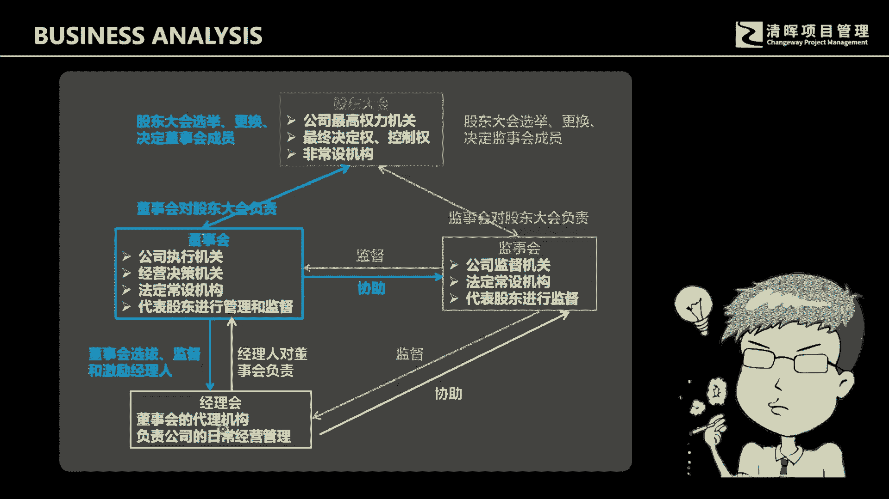

# 洞悉商业的本质--商业分析与需求 - P1：1、了解公司的结构 - 清晖Amy - BV19UxWemE2Q

如果你能够了解清楚一个公司的结构，我相信你会有一个不同的视角来看公司的经营，也可能会有一个新的视角去来看待，你曾经学习过的相关的项目管理知识，我这里给各位一个啊这样一个标准图形。

这是一个标准的一个公司的结构，这个结构呢应该来讲是说，不论你是哪个行业的，不论你是从事什么样的这个产业领域，只要是一个标准化的所谓的公司，那么这个结构基本上就是这样一个三层结构，同时呢这样一个表格呢。

它也是法律所认可的一个公司结构，这个三层结构它会是什么呢，它是个什么样的一个结构呢，首先在第一层啊，这是股东会，第二层呢是我们的经理会。

所以在一个公司里面呢，你会看到，其实标准的结构应该是就是这三层结构。

从最高的那我们公司的最高的利益获得者，或者叫最高的权利拥有者，然后第二层呢我们想我们看到有很多呃公呃，很多人会认为说，公司最大的这个职位的人会是谁，我经常会问这个问题，很多人会告诉我是说是董事长。

其实也不尽然，额有限公司的董事长，呃董事会他干嘛呢，董事会其实就是一个决策机构，就是一个决策机构，监事会呢他监督着董事会啊，为股东会，为老板负责，然后经理会呢会来进行执行性的工作。

为什么跟各位去来聊这样一个结构呢，其实是想让各位去思考，是说我们曾经学过的项目管理知识，或者说你曾经学过的各类的管理性的知识，经营性的知识，它会在哪些层面起作用，其实我们大量的啊。

我们曾经学过的管理性的知识，不论你是项目管理PMP也好，还是SP也好啊，亦或是其他的也好，它都是会在经理层啊以下啊，会产生相应的这样的一个一些作用，那么如果说职场未来要发展。

我们要去来完善自己的这样的一些，管理性的知识结构，我们可能要看的更高好，我们要站在更高的层面去看待一个公司的经营，那么通过这样一个结构，大家可能会进一步的去啊。

