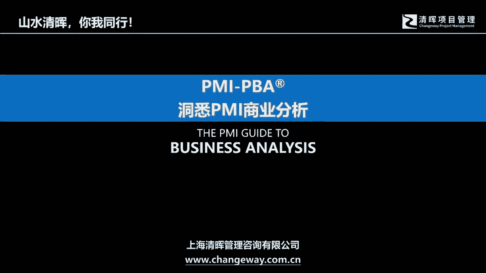
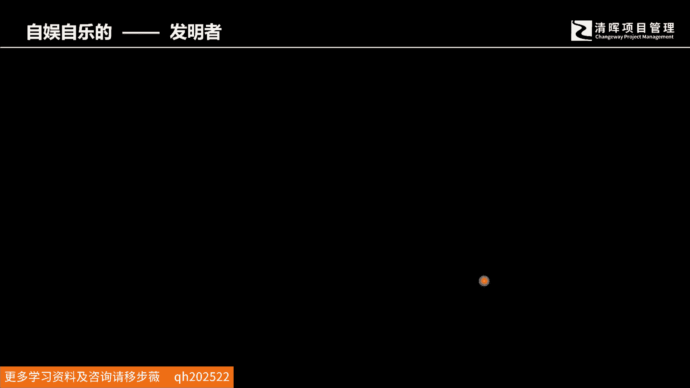
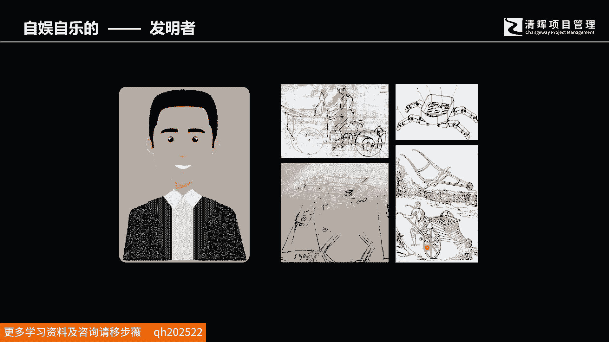
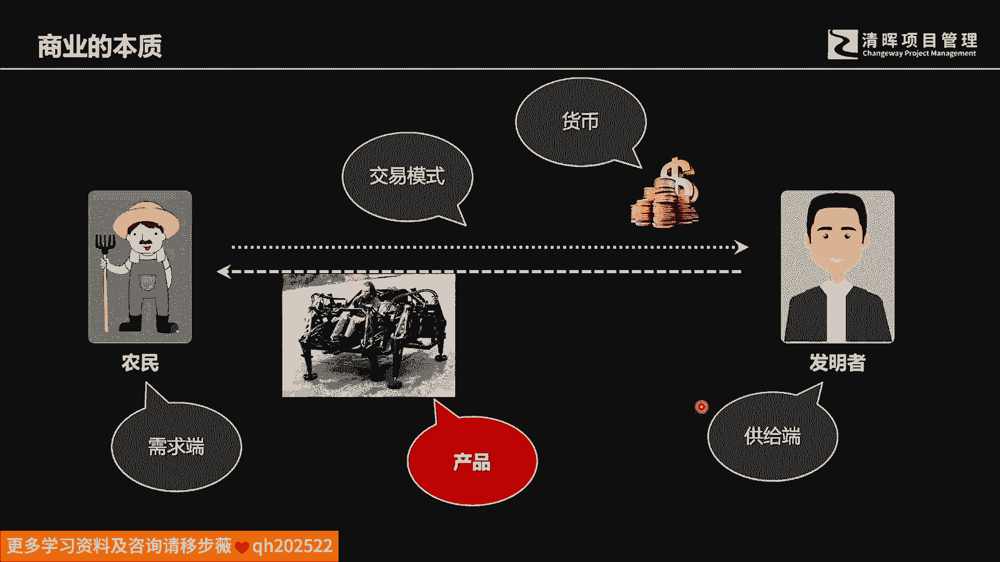
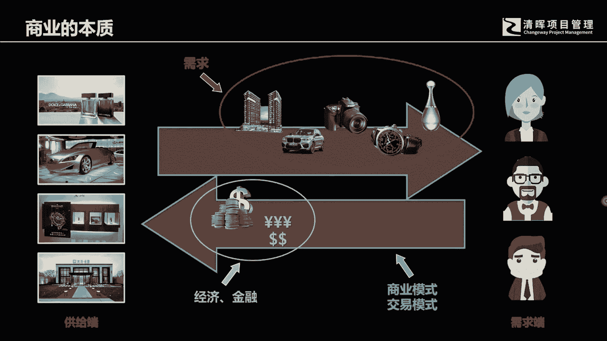
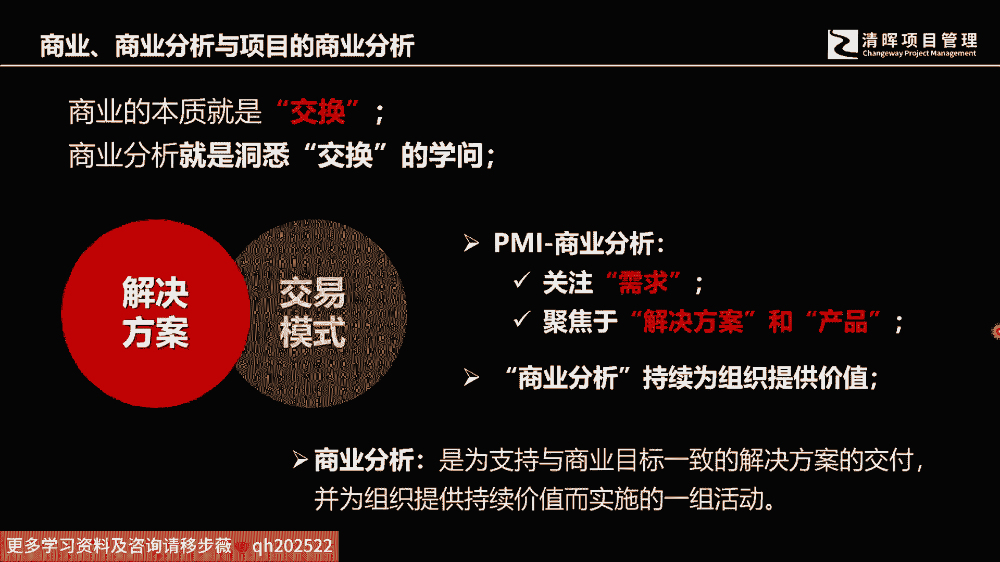
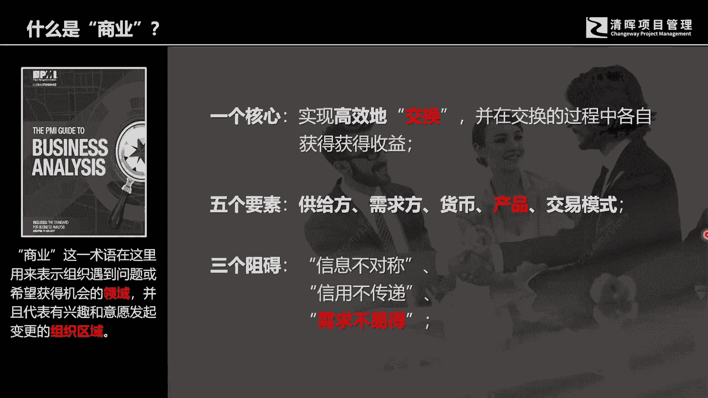

# 洞悉商业的本质--商业分析与需求 - P2：2、“商业”与商业分析 - 清晖Amy - BV19UxWemE2Q

今天呢我们分四个部分，来跟各位呢进行相应的这样的一些啊，交流和沟通呃，既然要谈到商业分析，那么我们必须就从商业这个词开始，我们去了解整个商业的发展，你会发现其实商业它是根据，是它是随着社会的不断的发展。

科技的不断的发展，而逐步逐步发展到现代的这样的一个商业环境，我们在很久以前的社会，如果是一个农民啊，不论它的粮食产量有多高，不论它采用了什么样的更好的育种方式，如果他只是自给自足的话。

那么其实这个里面没有任何的商业成分存在，如果我们还看到有一些人。

他可能会搞一些发明创造，会有自己的爱好，但是他们只是来自娱自乐的话，其实这个里面也没有任何的这样的一些，商业的啊，这个这个啊内容的存在。

那么什么是商业呢，其实商业的本质在哪里，就在于是说不同的啊这样的一些专业技能的人，他们产出了相应的产品或者商品，他们之间产生了互动，那这种互动就使得商业有了萌芽，有了基础，比如说我们的发明创造者。

可能会为我们的这样的一些农民，发明了这样的农用机械，农民呢给予相应的回报，那么这个里面呢，就形成了一个商业的最基本的结构，这里面呢就有相应的一些要素，首先呢会有一些需求方，然后还有供给方。

只有买卖双方同时存在商业的基本基础，才会才才会有机会产生，然后在这个里面呢会有货币啊，会有这样的一些产品，然后这个中间不要忘了还有交易的模式，还有交易的模式，我们在现在的商业社会中。

你会看到这种情境会天天出现在各位的身边，只要我们参与到这个社会化生活当中，只要你在市场中，只要你在商场中啊，只要你在日常的消费中，这种商业的啊活动它是必然都会存在的，我们有消费端需求产品。

然后他付出了自己的啊货币而获得这样的产品，那么这个里面呢中间呢是商业的交易的模式啊，商业的商业模式，这就形成了相应的一些商业的最基本要素，商业的最基本要素，所以简单而来，简单来说。

简单来说哈啊商业它有五个最基本的要素，产生了相应的互动，产生了才能有商业活动，那么它有供给端，有需求端，中间有需求的产品，然后付出的货币，然后中间还有相应的交易模式和商业模式。

那么简单来说，其实商业的本质是什么，商业的本质其实就是交换，那么我们学习商业分析，商业分析其实就是洞悉交换的学问，但是我们在PMI的这个PPA里面，商业分析呢，它着重于强调关注需求，关注产品。

聚焦于解决方案，而这个交易模式，商业模式的开发是另外的学科，所以我们的这个PMI的PBA商业分析，它是为项目层面，项目及项目组合，这些层面的工作来提供支持和服务的。

所以我们从这个呃PMI体系的商业分析来看，那他这个商业分析，其实是被我们日常的口语给简化掉了，其实它是针对需求的，针对项目的商业分析，是为了支持与商业目标一致的解决方案的交付。

而为组织提供了持续的价值的。

而实施的一组活动好，那么我们把这个模型简化一下，把这个模型简化一下，刚才我们了解到，我们核心商业的核心其实是交换，商业的核心就是交换，那么交换呢它有五个最基本的要素，我们刚才也提到了，有供给端。

有需求端，有产品，有货币啊，中间就有相应的交易模式，那么我们不我们的商业分析工作，他来克他的这个知识和工具，它是为了解决什么问题呢，可能如果说有性，也可能日常有些学员比较感兴趣的时候呢。

他可能会研究一些跟这个商业分析相关的，或者跟商业模式啊，交易模式相关的一些知识，那么我们但凡研究商业模式，交易交易模式的时候，它里面要解决的问题，是信息不对称和信息不传递的问题。

而我们的PMIPBA关于需求端的，关于产品端的，关于解决技术，教育解决解决方案的这样的商业分析，它解决的障碍是什么呢，它解决的障碍是需求的不易得，什么叫需求的不易得呢，随着我后面的这些内容讲解。

各位可以看得到，其实日常我们在跟客户打交道，然后获得我们的啊，可以参与到社会化这个交换的这样的活动当中，的商业活动当中，任何产品，他这个需求的来源其实是要经历很复杂的过程，要经过很多的活动工作。

才能够真正的啊能够应对市场的需要，即使在，即使你有可能有很多公司，做了很多的这样的工作，也不一定能够使自己的产品，获得他所期望的竞争力，所以这个需求不易得，是我们商业的分析所要面临的最大的一个障碍。

我们商业PMI的PBA的商业分析工作，他要应对的啊最大的这样的一个障碍，可以说就是需求不易等。

需需求不易等好好，那么我们再次总结一下，那么什么是商业，那么我们先有第一个商业，其实各位记住它是个153的，一个相应的一些概念，第一个我们有一个核心，我们商业要实现高效率的交换，我们所有的商业的这个啊。

这个比如说科技的运用，技术的应用，包括相应的管理理论的一些啊，这样的一些呃运用开发啊，甚至创造它都是为了去高效地实现商品的交换，而且在交换的过程中使得各自都能够获得收益，如果只有一方获得收益。

这种交换是不可能持续的，都是一锤子买卖，所以一定是共赢的，一定是共赢的好，那么还有刚才我们讲到的，商业的中间会有五个最主要的核心要素，就是供给，供给方，需求方中间的货币产品和交易模式。

那么在商业里面我们需要解决的相关问题啊，有信息不对称的问题，有信息不传，信用不传递的问题，那么在PPMIPBA里面，它要解决的是需求不易得的问题，那么这里面有一个术语啊，这个商业的有一个术语。

它是在研究我们组织所遇到的啊，或希望获得机会的领域，并且呢代表有兴趣和意愿发发起变更的，这个组织区域，这都是一些和相关的概念，那么我们接下来就会对这些，在我们核心的需要去解决的这些障碍。

那做一一的这样的一些分析和这样的一些啊。

这样的一些分享工作啊。