# 洞悉商业的本质--商业分析与需求 - P3：3、商业分析与需求 - 清晖Amy - BV19UxWemE2Q

刚才我们也讲到我们商业的本质其实就是交换，那么我们PMI的PBA商业分析，它主要针对的核心是需求，需求，它的最大的问题就是需求不是那么容易得到，那么商业分析，要和需求之间会有很直接的关联关系。

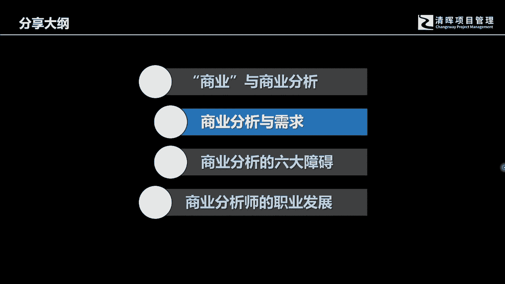

呃，如果去，我相信各位，只要是在清辉去上这个PMP的课程的时候，我不知道呃，应该是各位应该是记得有这样一张这样的一个，PPT的页面的呃，去来告诉我们需求的有关的这样的一个啊，英文的一个解释。

这里面呢有需要要need啊，Requirement，有需要有需求，还有其他的一些want这些，OK今天呢仅有我们在这个里面，我们有一个小插曲，需要去把这个需要和需求，在这里我们跟各位做一个解释。

做一个解释哈，那么什么是需要，什么是需求，在这里我们把这两个概念弄清楚之后，其实对我们后续有很多的跟客户打交道的，一些这样的一个认知和方法上的运用，有很很好的一个认知上的提升，和这个概念上的清晰。

然后呢，以此来指导我们相应的具体的操作工作呃，什么是需要，比如说拿这个人来讲啊，这个很很简单，口渴了，那口渴要干嘛呢，很多人的第一反应就是口渴，要喝水，那水是不是解决口渴的唯一途径呢，其实也不一定对吧。

其实也不一定，可能会有很多的方式方法可以解决口渴的问题，那么什么是需要呢，其实需要是一个深层次的目的，它是需它是需要解决的问题，那什么是需求呢，需求其实是方案，是途径，它来解决相应的目的，相应的问题。

也许在不同的环境条件下面，也许在不同的人的这个社会化需求上面，那么它所需要的这个解决方案和途径，它是不一样的，它是不一样的，好这里面最直接的一个指导，就是我们可以根据这个马斯node啊。

需啊需求需求理论啊，可以来指导我们对一个具体的需要一个目的，来对这个相应的人来进行分析，对一个市场来进行相应的这样一个分析，去来找到对应的解决方案图和途径，这里面可能要解决口渴，因为环境条件的不一样。

比如有些人可能会直接喝泥水，那为了安全需要呢，也许会有井水，那也许到了更上一层次呢，他要喝喝更洁净的水，甚至会有身份的象征或者更高的一些追求啊，我不知道各位知不知道这瓶水，这这最上面这瓶水能卖多少钱。

我简单查了一下，好像是10万美金哈，那有人会说呃，问问泥水呢可以喝吗啊我相信在很多条件下面，泥水是人必须没有办法的选择，你看到有很多像非洲国家，根本就没有洁净的水源，你要去解渴怎么办。

可能你能选择的余地都并不大了，选择的补余地并不大，但是如果说啊，我们看到有这个更高层次需求的人，他可能会对这个具体解决这个口渴，他的核心目的的这样的一个方案，需求的选择还是不一样的，需求的选择。

它会有更多的啊更高一层的啊。

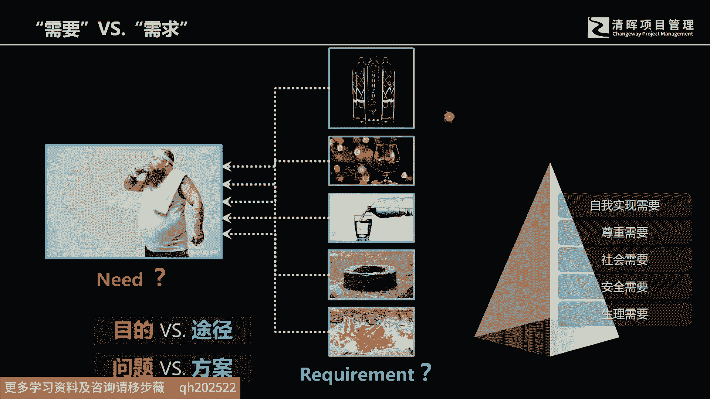

这样的一个要求，更高一层的这样的一个要求好，那么我们呃刚才解释了需要跟需求，那需要跟需求之间，其实对应的是一个目的和方案啊，问题和途径的这样的一个关系，那么如果我们要做好商业分析的工作。

我们在经营一个企业，经营一个组织的时候，我们可能要站在更高的层面去看待相应的问题，那么做好商业分析核心是来解决需求，但是商业分析，这三个基本思，其实是跟我们曾经学习过的，这样在这个偏僻课程里面，好各位。

如果还有印象的话，跟这张图有直接的关联关系，这张图有从愿景，然后再从使命再逐一往下分解，而形成了组织的战略和目标，然后呢进行了这样的一个项目组合的一个管理，一直到最下一层，一直到最下层啊。

我们的运营和项目管理好，那么我们的愿景使命组织战略目标，它体现的是什么呢，体现的是一个组织的核心的一个价值观，什么叫价值，那我给我的线下课里面，跟我们的学员们有过探讨，价值其实就是两利相较的问题。

和两害两害相较的问题，两利相较取其重，两害相较取其轻，人有自己的两害，两利，企业也会有自己的选择，那么这个每个不同的企业，根据自己所处的环境发呃，这个企业创始人当初的这样的一个理想啊。

他会有直接的关联关系，那么如果我们要做好相应的商业分析工作，我们不仅仅只是盯住简单的单一的项目，我们如果要真正做好商业分析工作，是要网上能够看到，要去看到企业的未来的更长远的发展愿景。

相对的中长期的战略目标往下要能够落实到啊，具体的单一项目以及后期的交付运营，这里面呢需要注意，我们的商业分析工作，一定是站在要复合组织的战略目标，我们的相应的解决方案要获得该县人的满意，然后呢。

我们的解决方案和最终输出的产品，能够持续获得竞争力且可行啊。

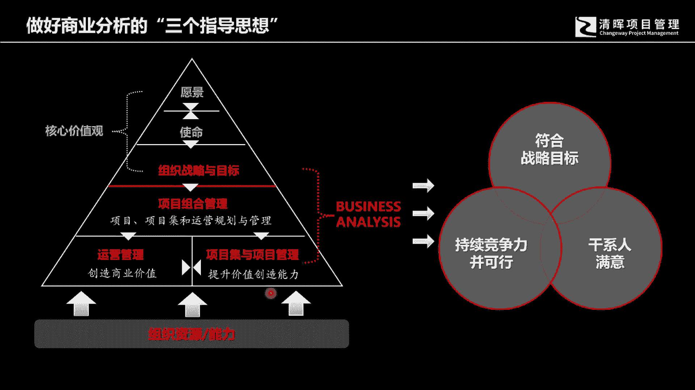

那么延伸一下，就跟我们的需求有直接的关联关系，我们一谈到需求的时候，很多人第一反应就是我们的需求，更多的我们考虑到是啊，我们的买方，我们的消费者，我们的客户的需要，我们的干系人的需要啊。

这个是需求所组成的最主要的部分之一，但是如果你仅仅只是站在干系人的需要，甚至说更小一点，只是某些客户群体的需要的角度，那么这个时候我相信你的思想层面啊，或者说你的认知层面。

充其量是指是一个sales manager层面，什么叫sales manager呢，就销售的管理者，他更多的是看到了客户的需要啊，我们的这个消费层面的市场的需要，他希望通过自己的产品。

去满足某一类群体的需要，那么如果随着你的工作的这样的一个，经验的不断的丰富，你就会发现，其实我们还有更多的是解决方案的需要，这个解决方案的需要呢里面就包含着功能，非功能。

这是我们PMP里面经常会讲到的一些内容，如果你仅仅只是盯住了啊这个解决方案的需要，那其实你站的层面是什么呢，你就是一个研发者，你就是一个研发者或者研发的管理者好，那么，我们商业分析一个具体的产品。

一个具体的解决方案，它不能够仅仅的只是考虑，该选人的需要和解决方案的需要，那他首要要解决的还是一个我们企业啊，商业层面的一个需要，那很多人讲，那我们刚才讲到了这个干系人的需要，解决方案的需要。

那我们都是企业的最直接额，就是充其量就是部门负责人，那商业需要，是不是代表着说企业更高层次的需要呢，是的，他不仅仅只是关注商业需商业需要，他其实关注的是这个所有的，他关注的是即使商业需要。

也包含着干系人的需求，也包含着解决方案的需要，那么我们就一一对这三个需求，来做这样的一个分析和理和这个学习理解嗯。

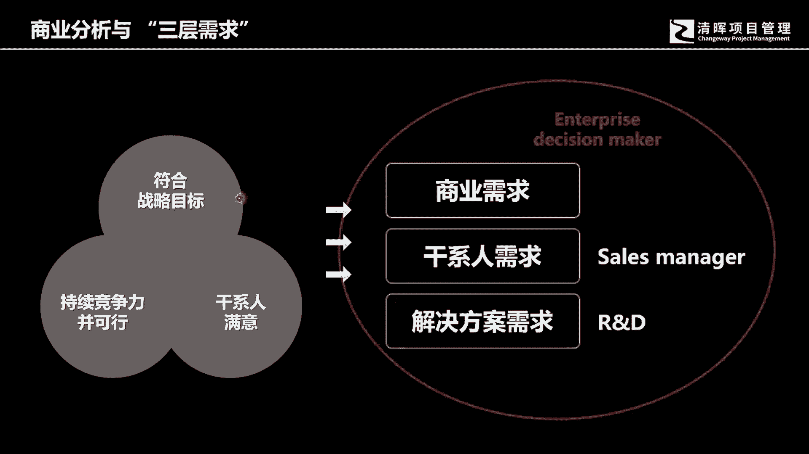

什么是商业，什么是商业需求呢，我们有一句话叫做属所谓的组织高层级的需要，什么叫组织的高层级，其实就是我们要做的任何一件事情，都要符合处置发展的愿景，都要符合组织更长远的发展目标和，战略的发展目标。

那么企业的战略发展目标会有很多，每个不同的组织，每个不论你是第一产业的这个农业，还是第二产业的制造业，还是第第三产业的这个服务业，在企在企业发展的过程中，你都会有相应的自己的中短期的，或者说中长。

或者相应的中期的一些战略发展目标，但是每个企业的战略发展目标，都是要依据企业最基本的这样的一些，比如说能力和资源为起点来进行相应的规划的，现在我们的身份不是一个单，不是不是一个单纯的是我们叫他这个。

我们叫他这个所谓的项目管理者，或者说项目经理，你会有一个更高的一个视角，这个更高的视角是什么，我们改变这样一个视角，如果那么这个时候你需要去关注企业，它是如何实现自己的战略发展。

那么战略发展的时候其实是会有两个导向的，会有两个导向的，有的企业呢因为这个资源条件的原因，他可能会选择这个成本导向，会提高自己内部的运营效率，然后通过啊自己的这种这种高效运营的方式。

能够获得自己的这样的一个，企行业领导者的地位，那么还有一些企业呢，它是会根据啊自己的啊对市场的认知，对自己本有行业的认知，然后呢更结合自己的资源条件，选择了市场的扩张渗透策略。

那么这个时候他是以收入扩张导向，收入扩张导向和这个成本导向最直接的差别，就是说一说说简单一点，就是任何一个企业它在经营的过程中都会呃，要么他要他要他要获利，那么获利其实就有两个最基本的途径。

一个途径呢就是我们叫它开源，还有个途径呢我们称其为节流，那么开源和节流这两种途径，其实就形成了不同的相应的策略，当然我们在企业经营的过程中，不会只有单一的单纯的，或者说单纯的只是开源的方案。

或者是单纯的只是节流的方案，它都是一个综合化的方案，只是他会更倾向于哪个方向，那么这个时候你站在这个角度，你就会发现，可能你在做这个需求分析的时候，也要符合组织跟啊，中长期的这个战略发展需要的时候。

有些项目是可能会去从事的，有些项目可能就不会是你选择的范围好，那么我们在高层级的时候还会再考虑什么呢，企业的所谓的高层级需求还会再考虑什么呢，还要考虑竞争的模式和竞争的策略，任现在的任何一个企业。

只要是参与到社会竞争，我相信它都会是在两个市场中来参与或者参与，或者思考，一个呢我们我们称其为是在这个消费市场，另外一个呢我们称就在称其为在这个资本市场，其实对于一个好的企业的一个评判呃，会有一种说法。

就是他所卖的产品会获得消费者的追捧，他公司所拥有的股份，能够获得资本市场的是追捧，那么这样的一个企业就一定是一个成功的企业，那么企业在发展的过程中，一定会考虑相应的这样的一些啊战略策略。

所以你会看到有的企业会有合并，有的企业会有分利啊，有的企业可能会收购其他的企业，那么在这个高层级的高层次的经营的过程中，具体的项目集项目他的选择，他的实施就会有啊，不同也会形成了不同的决策。

也会形成了不同的决策，这里呢我列出了几331个企业，它可能会考虑的啊更高层面的三种竞争，一种呢我们称其为技术层面的竞争，什么叫技术层面的竞争呢，技术层面的竞争，其实某种意义来讲，他是获得了时间优势。

什么叫时间优势，比如说一家公司，他开发了或者说他原创了某项技术，然后呢获得了知识产权的保护，那么原则上来讲的话，他会比他的竞争对手，获得了在时间上面独有的相关的优势，比如说是比如说知识产权对他保护5年。

对他保护10年，那如果大家都是一个守规矩的情况，下面，他其他的竞争对手们是不可以去抄袭他的，这样的一些技术原创的，那么他就在时间层面领先了他的竞争对手，那么什么叫市场竞争优势呢。

市场竞争优势其实就是一个空间优势，空间优势指的是啊，比如说有的公司它只是一个区域化的公司，但有些公司它是全球化的公司，当他们来操作相同类型的，相同类别的产品的时候，相信全球化经营的公司。

它的吞吐量会远远高于一个地区化的，地区化的这样的一个公司，那么他的这个影响力，也远远超过了地区化的公司，这么那么这样来说，其实一个企业要么就是在时间层面啊，通过技术啊创新获得相关的优势。

要么就是在市场层面不断的啊获得客户，不断的获得这个市场的这个认可，在空间层面获得竞争优势，但是会有另外一个竞争优势，这个竞争优势是什么呢，我们啊有些这个企业经营者，很会利用这样的一些经营啊。

这样一个竞争策略啊，这样一个竞争方式，它就是资资本的竞争，这个资本的竞争其实相当于是制高点的竞争，你会看到有很多的企业它会通过这个，它不是单纯的只是买卖自己的产品，它会通过这个啊合并的方式啊。

收购的方式啊，股份收购的方式来获得或获得自己的，这样的一个市场竞争地位，你会看到，比如说好跟各位举个例子，比如说像携程这样一家公司，1999年就成立了，2004年就在纳斯达克上市。

他在第三次获得这个凯雷资本的投资的时候，他就收购了当时一个非常有名的企业，那个企业叫什么呢，叫北京运通网络订房中心，20年后各位还知不知道有这样一家公司，应该不知道了吧。

啊这些他收购这个叫北京运通网络订房中心，那么他撞到了自己，同时呢也消除了一个竞争对手，那这是一种高层级的商业操作，使得企业能够获得更高效的盈利的，这样的一个啊这样的一个手段。

所以我们这个所谓的高层级的商业需求啊。

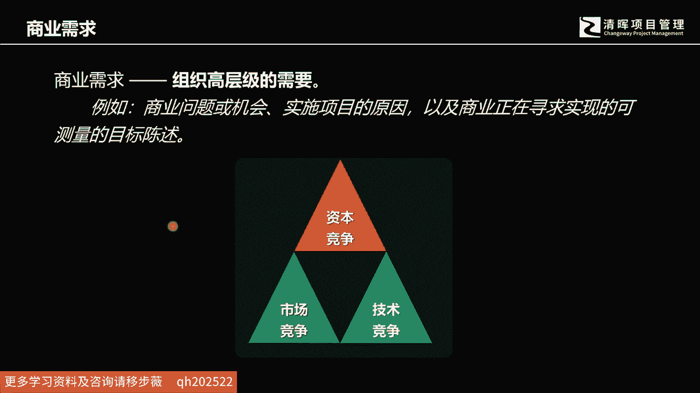

这个部分各位可以啊有所提示，那么另外呢包括像这个企业在战略的过程中，你会发现在竞争的过程中，他会采取不同的竞争策略啊，有些是总成本领先，有些是差异化，有些是专一战略啊。

那么这个里面这个里面其实各位一看就知道，这是迈克波特的竞争论啊，三种最基本的竞争策略呃，展示各位，这些其实就是想告诉我们在经营的过程中，在需求的管理的过程中，我们在选择投资哪个项目。

不投资哪个项目的过程中，一定是要看清楚企业当下正在实施的战略策略，然后我们所选择的被投资的项目，是要符合企业的战略发展方向，要与我们的这个企业的战略发展方向，是要保持一致的，这就是高层级的需要。

这就是组织高层级的需要，所以什么是商业，什么是商业需求，这个就是商业需求啊。

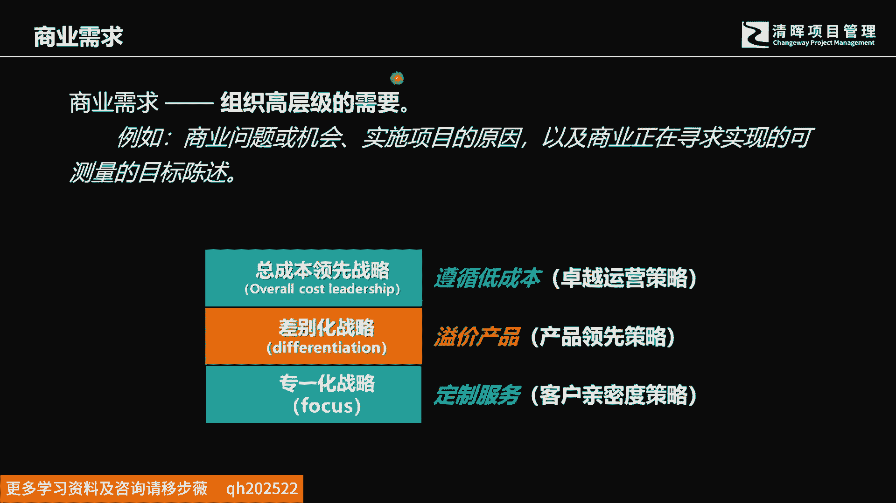

好那么我们举几个简单的例子，我们拿这个餐饮行业来来做这样的一个分析啊，比如说我们看到有高档的米其林餐厅，也有像类似麦当劳这样的连锁餐厅啊，还有这个中央厨房这种配送中心。

那么每一组同样都是同样都是餐饮领域，但是每个不同类型的这样的一个啊餐饮企业，它的战略运营方式是不一样的，也就是说他们所诉求的这个啊，商业需要高层级的商业战略，商业需要它也是不同的，比如说这个米其林餐厅。

他考虑的是环境啊，考虑的是菜品质量，考虑的是消费单价好，很多人在脑海里面，我相信很多人应该理解啊，我们在座学员应该应该是能够理解的，有些时候产品并不是卖的便宜才会有市场。

有些时候恰恰是产品卖的比较贵才有市场，对吧好，然后你看这种比如说快餐连锁，类似像麦当劳的，它也是标准化快速复制，这是他的战略核心需要，那么它它在它的内部发起的任何一个项目。

发起的任何一个项目的这样的一个实施啊，你都会发现它是要符合这样的啊，他企业的高层级的这样的一个商业需要的啊，高层级的战略的这样的一个策略，那么中央厨房它是个讲究什么呢，它讲究运营的效率和持续的改进。

中央厨房，中央中央厨房啊，他所追求的是什么，它主要追求的除了标准化之外，它它要吞吐量，它要能够快速的满足大批量的采购需要，然后呢要讲究卫生啊，要讲究这个啊食品安全啊，所以这个你会看到。

即使是同一个啊类型的行业啊，不同的这个企业啊，有这个高档餐厅，有快餐连锁，有这个中央厨房，它同属于这个同一个前同一个行业领域，他所他所诉求的这个战略策略，它是不一样的，那么不一样的战略策略。

那么对应的高层次的这个项目，发起的这样一个高层次的这个商业需要，它也是不不相同，它也是不相同好那么战略商业需要。

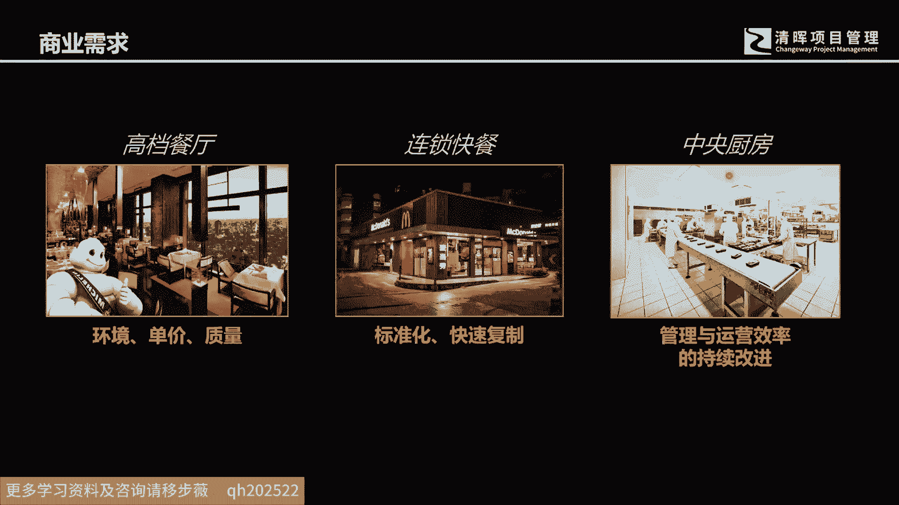

那么我们要关注什么，这里面我列出两点，当然这只是部分，包含但不限于这些部分，那么所谓的商业需要，我们要关注什么，一定是要关注，我们要保持战略一致性。

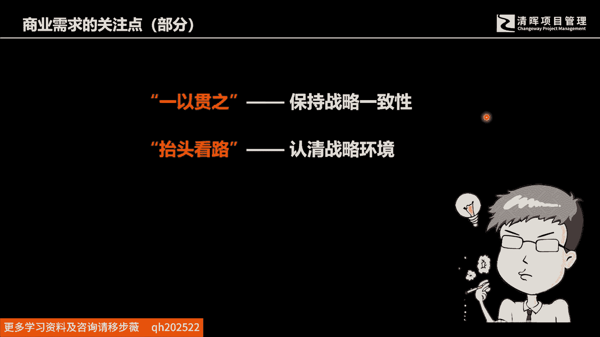

这一点非常重要，我们叫一以贯之，什么叫一以贯之呢，就是商业需要对上啊，靠我们要符合组织战略和目标的需要，然后呢再向上是一个更长远的愿景的需要，比如比如说这个马云啊，他提出自己的阿里巴巴啊。

成为一个仅能够经营102年的企业，能够让天下没有难做的生意，为了符合这样一个愿景，他逐步的把自己的这样的一些实施的时间阶段，和这个能够投资到的一些，他所啊在他愿景之内的啊，期望之内的啊这样的一些项目啊。

他做了分拆和这个分解，然后逐步逐步来规划，每个不同阶段的这样的一个项目，那么商业需要是要符合这样的向上，他是要符合组德的战略复合组织的这个愿景，那它的下端是什么呢，它下端是他要我们的项目。

支持着我们的所规划的解决方，案和产品的这样的一些需要，然后我们的产品是支持着我们的各方干系人的，需要的，一个或者多个的干系人，是要支持着我们商业发展的需要的，这就是我们的保持的战略一致性嗯。

这一点非常重要，为什么会这样说呢，如果你做的不好，战略一致性做的不好，其实是一个南辕北辙，为什么这样说，其实很简单，从个人来说，各位可以比较一下两种不同的人，有一类人发展自己的专业。

在自己所看所看重的所看好的领域里面，持续的深耕，做到非常高的高度，持续的在一个方向上去用力，那么他的人生，各位可以想象一下，是非常我相信应该是非常可以做得，非常有高度的，但另外还有一类人。

可能我们身边不乏这样的一些现象，他会偶尔做做这个，偶尔要做做那个行业跨度还蛮大，那么同样经历了和10年或者20年的时间，你会发现第二类人，他所取得的成就肯定远远不及我们刚才谈到的。

一而贯之的这样的一个第一类人，他会在长时间的才在原地踏步，他不断的去来，不断的去在原地踏步，不断的去挑选啊，一件事情干不好会挑另外一件事情，那么对企业来说，其实这种现象也是不少的。

比如说我就认识有这样的朋友，我记得很早以前我就嗯认识一个老板，这个老板干嘛的呢，我最先开始认识他的时候呢，他是卖红酒的，然后呢随着我对他的交往越来越深，我突然发现其实他还开着一个茶庄。

在湖北的某个城市还非常有名，然后在另外一个城市里面呢，他还开着美容院，后来随着这个交往的深度越来越深哦，我发现了他的起家靠什么呢，靠做保安，靠出什么保安呢，就是我们看到的很多这种物业里面的。

那个保安人员，他取得了相应的资质啊，然后可以可以培训保安，然后呢输出保安，这是他原来的原有的这个起家的，掘到第一桶金的这个发家的领域，发家的企业后来因为赚到钱了以后呢，他他他只要是看到什么觉得赚钱的。

或者说某些朋友说动他了，觉得哪个哪个哪个领域里面他还觉得不错，他就去投资，后来我们再去啊，有段时间没见过面了，然后再去了解的时候，我发现哦他茶庄关了，红酒也不卖了，美容院呢也倒手出去了。

还是回到了自己的本业，但是回到本世纪的本业以后呢，因为长期没有关注这个企业的规模，也这个公司的规模也大大的缩水啊，这个中间呢耗费了很长时间原地打转啊，这种现象会特别的多。

所以一个企业跟一个人也是一样的啊，你要选择清楚自己的发展方向，然后呢一以而贯之好，那么刚才我们讲到会有额，会有另外一个除了一以贯之以外，我们还要学会抬头看路去。

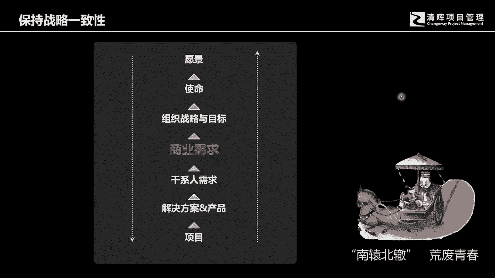

来看清我们周边的环境，其实看清周边的环境要从战略入手，我们经常会讲到战略，战略战略会是什么，其实战略是个军事用词，这个军事用词呢它指的是指挥官的一个啊，对中长期的这样的一个战争规划。

然后那么其实我们现在大多数的商业领域里面，学习到的战略啊，其实都是我们称其为叫不变环境下面的战略，为什么这样说呢，其实战略不仅仅只有一种环境，我们大致把我们所要面临的商业环境或者，市场环境啊。

我们划分一下，各位就能够理解，其实为什么我们在很多时候，我们的这个策略会发生无效的情况，就是因为他用错了地方，你对外部环境的理解远远没有到位，你再用这个行动啊，和环境之间呢产生了错配。

就导致了你的决策和策略失效了，那么我们理解环境的时候呢，我给各位参考一个模型，这个模型是什么呢，就是我们看到啊它有几个相应的要素，我们横坐标呢是叫可塑性，也就是说这样一个行业领域，它的相应的这个规则。

相应的这样的一个竞争的这样的一些格局啊，包括这个相应的标准，可以通过某一个企业或者某一个企业集团，来进行制定，也就是说它是可以调整的好，还有一个纵坐标就是不可预测性，那如果说有人是啊。

学习过ACP或者了解过风险管理，这个不可预测不确定啊，他这个就很容易理解，就是啊就是我们在讲这个瀑布型和适应型，这个项目生命周期的时候，对这个啊词不确定性不是不可预测性，是做过解释的。

我相信各位应该是能够理解的，那这样的话其实是把我们的这个战略环境啊，或者外部的市场环境啊，做了几种分类啊，首先第一个呢我们叫它经典型，什么叫经典型呢，就是我们外部的环境啊，他这个可塑性很低，什么意思呢。

就是你的企业，不太可能通过自己或者一个企业集团，他是不太可能通过自己的这个努力，去改变外部的竞争规则的，不可能改变整个行业的运行规则的啊，然后呢确定性很高，那不可预测性是很低的，就代表确定性很高。

也就这个你可以通过这个啊分析和了解，就知道未来这个行业啊，他的这个成长，它这个啊成长率这个发展方向，你可以提前做预测，这是一个最经典的一个环境，我们其实现在学到的大多数的这种呃，战略的策略啊。

很多都是在这个环境下面来进行，这个讨论和分析的，简单直说直接一点，比如说像迈克波特的竞争论，他其实就是在这样一个环境里面去讨论的，那如果再细分一下的话，你会发现那我们可以根据这个呃不可预测性啊，比较高。

然后呢可塑性很低，那这个就是一个适应性环境，这个适应性环境啊，嗯我相信在座各位也能听得明白，我们讲适应型生命周期啊，各位就知道了，但是我们不确定，但是而且这个这个外部，这个这个要交付的这个产品。

我们不可能提前，那就能够清楚会要交付一个什么样的一个，具体方案出去，具体产品出去，有时候呢也可能会发生这种呃，实施的实施的手段和采取的管理流程啊，也可能会是不确定啊，这个就是不可预测性是很高。

但是呢这个可塑性啊是不高的啊，可塑性就代表是说，通过某一个企业或者某一个啊和企业集团啊，可以改变整个行业的竞争规则和运行规则，不太可能啊，好那么再细分一下啊，我快要看到有一种愿景型的这种环境。

和这种这种这种战略环境，什么叫愿景型的战略环境呢，就是确定性很高，我们可以提前预知未来的发展方向，但是我们但是呢它这个环境啊，它是可以被我们的某一个企业，或者某一些企业集团所进行改变的，那再细分一下啊。

我们看看到这个不可预测性，高和可塑性也很高的，我们叫它塑造型，我们叫它塑造型好，那么这样一个二维的坐标，它有一个前提，它前提是什么呢，整个的经济周期是向上的，也就是说大家的对。

整个的不管是哪个行业领域啊，你对整个的这个地区的经济判断它是上行的，那如果说我们加入了经济的这个周期性的，一个一个概念在里面的话，比如环境的这件里面就有个环境的严苛性，那么环境的严苛性比较高的话。

那么就会是另外一种啊，商业环境我们叫它重塑性啊，我们这我们这里就简单的跟各位列出来，不同的这样的一些商业环境，所以我们在做一个商业分析工作，或者说是在企业的管理工作，经营工作或者决策的时候。

我们一定要抬头看路，我们在抬头看路，说直接一点，其实你就是要看清楚你所处的外部的商，外部的市场竞争环境，你到底是哪一种这种外部环境，更多的时候，其实很多人是已经习惯了。

在这个所谓的经典型领域里面去来做工作，因为经典型领域是大多数商学院或者NBA，课程里面所教的所教，所教授的这种啊战略策略的一些，相关知识的学习，他都是站在这样一个环境背景下面的好，那么不同的这个啊。

这个环境我们采取的这个战略策略它是不同的，比如在经典型里面，你只要是规模做得越大，你的竞争力就会越强，那么在适应型策略里面，它是你能够快速地适应变化，你的你的所有的组织管理结构，还有这个人员的素质。

还有你采取的管理方式流程，都能够快速的应对外部的变化，那么你的企业的竞争力就会变得非常强，那么愿景型呢它是一个抢先型战略，你一旦发现了某些机会啊，可塑性又很高，那这个时候你抓住了相应的机会。

你抢先占住了这个坑啊，那么这个时候你的这个竞争力就会特别的强，那么塑造型呢它是个协调塑造型的，它跟其他的适应型，经典型愿景型这种环境还不太一样，嗯适应型经典型愿景型。

它是以企业啊考虑一个企业它的战略策略的，而塑造型呢他考虑的是我们要用一个平台，要创造一种机制，能够协调啊合作的方式来采取这样的一个竞争，因为今天不是战略课，所以这个部分我不会把它做更深入的剖析。

我只是想提醒各位，我们所处的企业环境，它是不会只有一种企业环境的，那么最后呢我我们最后的第五个，我们这个背后的当经济是处于一个下行状态，外部资源条件是很苛刻的啊，市场又是难预估的。

那么这个时候企业要采取的临时性的，这个重塑型的这个企业战略，这个重塑型的这个商业环境或者外部环境，求存的策略，它是一个临时性的战略啊，它是一个短相对短暂临时性的战略战略策略啊。

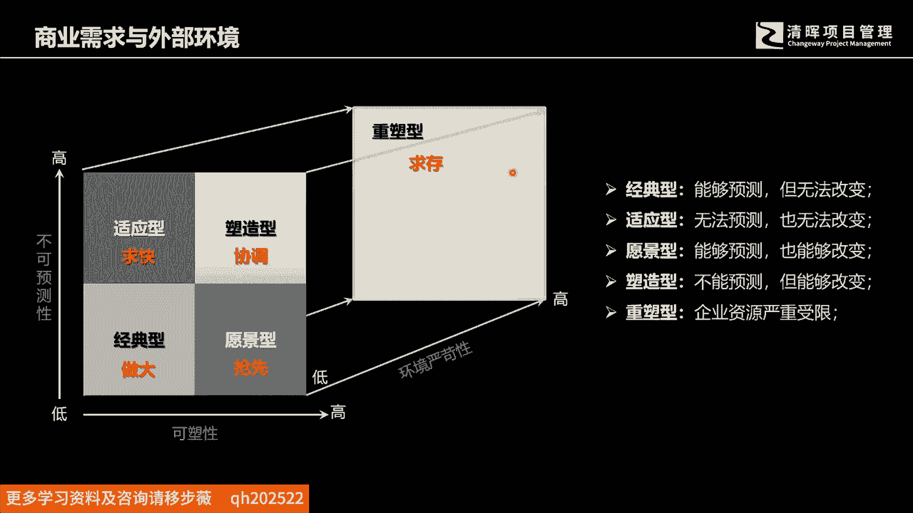

他就是一个求存的策略，那么再进一步的去细分一下啊，再进一步的去啊，我们深入的理解一下啊，我们这五种战略，这种五种战略环境啊，采取的这样的核心理念啊，以及相应的适应的相应的这种行业。

各位可以自己可以了解一下，可以了解一下，好比如说我们的这个经典型的，我们的经典型的这样的一个大家所理解的，只要企业的规模做的越大，它的抗金震力就会越强，你会看到比如说像汽车公司，石油公司啊，公共事业啊。

这种类似能源的，为什么呢，因为经典型战略，你会发现它差不多都是以人口结构啊，做这个核心分析，随着人口的增长，人口年龄的趋势变化，然后对自己的行产业，对自己所处的行业，这是具体的企业的这个未来发展策略。

来进行这个规划，它的可预测性是很高的，然后呢只要是规模做的越大，他就会啊竞争力就会越强，它的特征呢就是低增长高度集中，你会看到有很多领域里面很多企业啊，这这种领域里面的企业啊，寡头会特别多啊。

这种经常会有这个呃政府出台相关的政策政策，防止这个垄断啊，他的成功标准是靠规模啊，比如说适应性啊，这个我就不一一去念它了，各位可以啊了解一下，所以各位在自己去来分析，我们的外部环境的时候。

不要脑袋里面只装着我们曾经的一些经验性的，经验性的一些啊思想，其实我们外部环境已经发生了很多的变化，以每个不同的行业领域，都有，每个行，可能会有不同的这样的一个外部环境背景，那么我们采用的商业的策略。

我们采用了这个战略的策略，它会是不一样的，它会是不一样的啊。

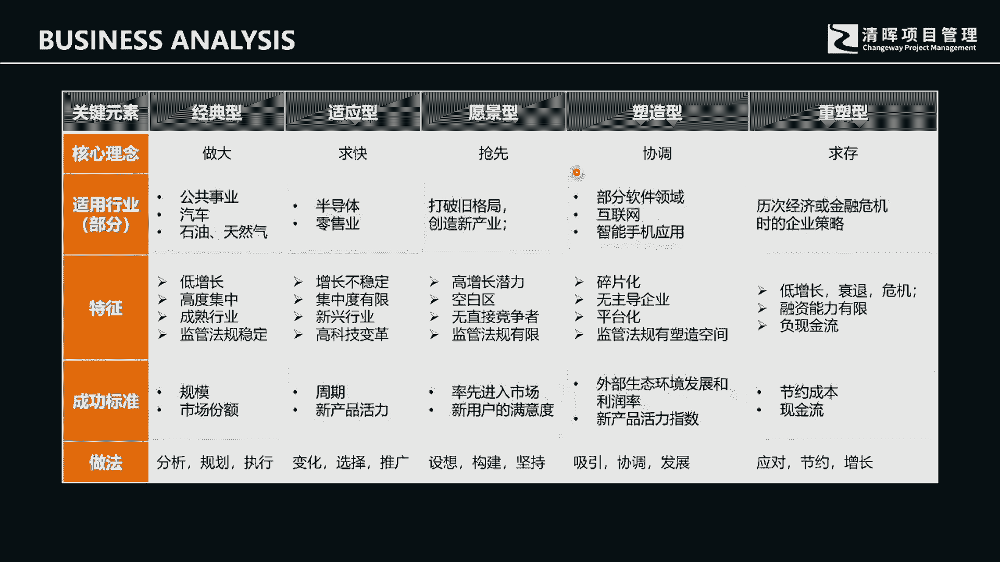

好那么我们刚才讲了这个商业需求，它其实就是组织的高层级需要，所谓的组织高层级的需要，其实就是企业的发展的愿景，以及落实到中期的，比如5年的相应的战略规划，那么这个我们的选择，我们的商业选择。

我们中间可能会要进行的相应的这个战略投资，我们的项目的投资选择，它是要符合企业的战略发展需要的，那么我们需要跟我们的企业的战略保持一致性，那么第二层的是我们的这个干系人的需求。

干性人需求一定是要干星人满意，如果我们在具体发现了问题，或者说找到了相应的机会，然后呢去来设计和实施相应的解决方案，我们首先肯定会考虑，是说我们的方案最终的成果，是能够满足客户和市场的希望和偏好的。

满足客户的偏好和期望，满足市场的这样的一些需要和需求，但考虑这样一类人是不是仅仅足够呢，我相信应该不应该不是这样的啊，我相信很多人应该理解，我们可能会进一步的去考虑，我们这样的一个竞争方案。

是不是能够比我们的竞争对手更有优势，是不是能够体现自己的差异化，那么我们自己的管理层啊，是不是获得了他们的相应的支持啊，我们在实施这个方案的时候，能够获得相应的管理层和执行层的支持。

那么我们在投资这样的一个项目，或者在设计相应的产品的时候，那是否符合政府的这样的合规的需要啊，包括我们是不是能够满足股东的投资啊，收益啊，能够符合这个债权人的这个相应的要求啊。

能够获得供应商的响应和支持，以及相应的社会团体的一些要求，所以我们在一个产品，你就不会仅仅只是思考到我们的解决方案啊，我们要从事的这个上，从事的这个项目，以及这个项目可交付的这个成果。

仅仅只是满足了某一类人的需要，你可能会要全盘的考虑多种人类，多种层面的人的需要好，那么这就是我们叫干系人的需求，那干系人群体会特别的多嗯，干系人满意，是现在一个企业获得持续成功的基础，为什么这样说呢。

我们可能会抛开这个竞争所，抛开这个竞争者不说哈，各位可以看一看，但凡任何其他的，我列出来的这样的一些类别的干系人，只要有一类不满意，你会发现这个企业绝对会走不远也走不长啊，随便挑一个。

比如说那政府就不用说了，在中国这样一个政这样一个经济背景环，政治政治经济背景环境下面，你不符合政府合规的要求，你根本就没办法开展经营啊，比如股东，那如果你不符合股东的投资回报收益，那有可能会股东撤资啊。

你如果经营不善，你没有办法满足债权人的这样的一个收回，这个债，收回债主债务啊，然后获得相应利益，利息的这样的一个回报的这样一个啊，这样一个收回要求，那你企业可能也失去了流动资金。

那么企业也失去了经营的活力啊，如果说你不能获得员工的支持啊，你不能，那么这个员工啊消极怠工，企业的经营成本就会特别的高，那么很多政策也不会得以切实的执行，最终企业企业也会失去它的竞争力，所以你会发现。

现代企业的经营一定是以站在。

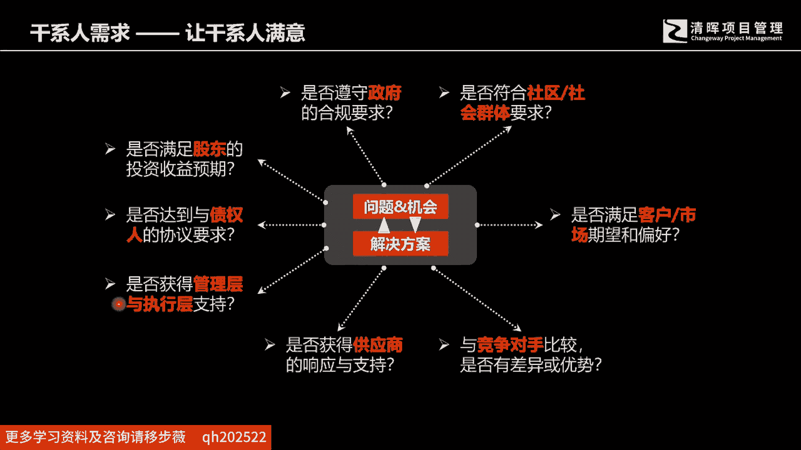

获得该行人满意为基础的好，那么我们第三层的需求，第三层的需求啊，就是我们的这个叫解决方案的需求，解决方案一定是要有竞争力，而且是可行的解决方案啊，我们一谈到解决方案，它里面就包含着所谓的所谓的功能需求。

非功能需求，那什么叫功能需求呢，这里面有我们就要知道什么是呃功能，那我们讲功能之前，我们先讲讲这个非功能吧，这非功能呢是我们这个产品正常运行所需要的，环境或者质量质量要求呃。

这是我们在表达相应的专业术语概念的时候，所用的相应的解释，其实这个非功能要求啊，直接影响着我们很多项目的成败哈，呃举个例子，那我曾经跟这个呃，比如说像因为我在湖北，在武汉哈。

武汉的这个中船重工的研究所特别多，也是我跟一个722722所的啊，七字开头的，一个一个一个一个研究所的一个高工啊，我们在聊天，他当时就讲一个事情，我觉得这跟产品的非智，能够很很好地解释这个产品的非功能。

非功能特性，什么意思呢，就是他说我们在这个舰船上面，军用舰船的船只上面或安会安装摄像头，那么这个摄像机的选择呢，在国内呢选择的这样的一些企业啊，就那么几家啊，一说起来大家应该知道，比如海康大华啊。

类似这样的公司啊，好，那么他们曾经找海康威视呢去去下过一批订单，然后呢装到他，装到我们国家的海军的这样的一个舰艇上面，然后出去执行这个演习任务，两三个月回来以后，用他们的话讲，是那个镜头啊。

就是那个摄像机的外壳，用手啊去一摸，就去摸了它一下，然后呢那个外壳就很就就就就像粉状一样啊，这个这个这都稀稀落落，稀稀落落就掉下来了，稀稀落落就掉下来了，那为什么会发生这样的情况呢。

就是这个产品的这个质量，它不太符合在海面上那种啊高温啊，这个高湿高盐分的这样一个环境的使用，虽然它的功能能够达到这个摄像的啊需要，但是呢他这个使用质量啊，是不能够是是是没办法适应这样的一个环境的。

没没办法适应这样的一个环境的啊，所以这是一个非功能需求的一个，非常典型的一个一个一个一个例子，好我们讲到啊，解决方案的需求，它既包含着功能需求，又包含着非功能需求，那什么是功能。

我相信不一定很多人能够真正理解什么是功能，我们这里有个解释，所谓的是产品应该执行的动作过程和交互。

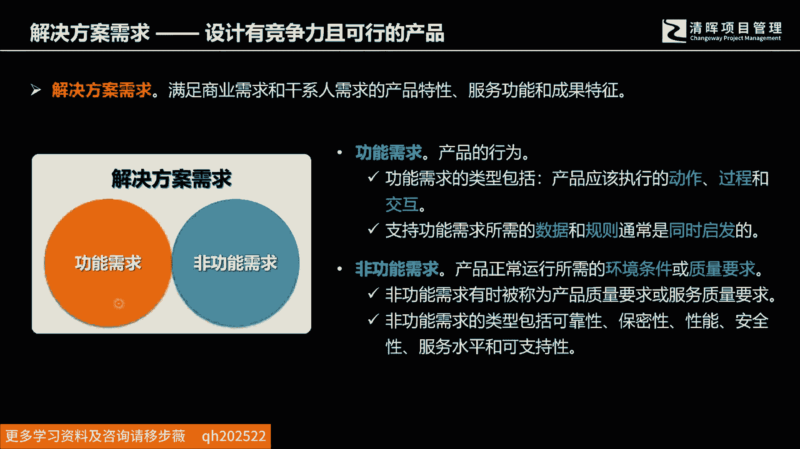

那这个怎这个怎么理解呢，其实有个更进一步的理解，我们可以跟各位交流一下啊，呃也许做产品的很多，这个工程师们更容易理解一些啊，功能是指的是什么，指的是一个组件改变或保持了另外一个组件的，某个参数的行为。

那么这里面我们就举例来说明，举例来说明哈，比如说啊各位可以看看，我跟各位列了这个产品，这是什么，这是个电饭煲对吧，那这个电饭煲啊有这个加热的组件，还有那个电饭煲的内胆对吧。

那这个里面的加热组件加热了内胆的温度，改变了内胆这个组件的温度参数，所以就表示着我们的这个加热组件，它的功能就是加热啊，这就是功能，那么一个功能啊，它存在啊是必须要有三个条件的。

第一个呢就是功能的载体和功能的对象，它都是组件，这个里面我们就要理解主系统和组件，什么是系统，什么是组件，人家电饭煲它就是一个系统，然后组成电饭煲的这些模块啊，它都是相应的组件，包括这个啊。

我们看到那个手提袋里面加那个外壳啊上盖，然后这个控制面板里面的加热加热部件，以及中间的那个煮饭的这个内胆啊，这就是相应的组件，那么共同形成了电饭煲这样一个系统，那么功能的组件和功能的对象之间。

是要有相互作用的，也刚才我们提到的也是加热的作用，那功能的对象呢，至少一个参数应该被它这个相互作用改变，或保持什么意思，它改变了温度对吧，那么我们我另我我另外再说一下。

各位知道我们怎么如果按照这样的一个条件，按照工程师的思维，去描述一个产品的功能的时候，那么我们的椅子我们坐的啊，我们上班的时候或者家里面坐的这个椅子，它的功能是什么，它的功能其实是支撑对吧啊。

支撑着我们的身体啊，不保持了我们身体悬空的这个这个这个沉重，这个悬空的这样一个尺寸啊，保持着我们静止的一个状态啊，所以这个是功能，那么我们再再列一个，那么汽车的功能是什么，汽车的功能是什么。

汽车的功能是运载，对不对，他改变的是什么呢，它比如说汽车的功能是载人啊，我们这家用汽车带是是是载人啊，那么载人它就是改变了你的空间的这个维度，参数对吧好，那么我再来列一个，你说那个刀刀的功能是什么。

dodo的功能是切割对吧好，它改变了这个他的对象，他的对象啊，比如说菜也好，肉也好，你改变了它的尺寸参数对吧好，那我再列一个头盔的功能是什么，各位知不知道头盔的功能是什么，很多人认为头盔的功能是。

我来保护这个戴头盔的人的脑袋啊，不要受到伤害啊，这种描述是不对的啊，他改变了与他接触的这个脑袋的哪些参数呢，没有吧，所以头盔的功能啊，它其实是改变了子弹的运行，这个飞行方向和飞行速度。

所以我们在研究一个产品的功能的时候啊，一定要掌握这三个条件啊，功能存在的三个条件啊，理解相应的一些啊，理解相应的一些这个使用的功能的一个环境好。

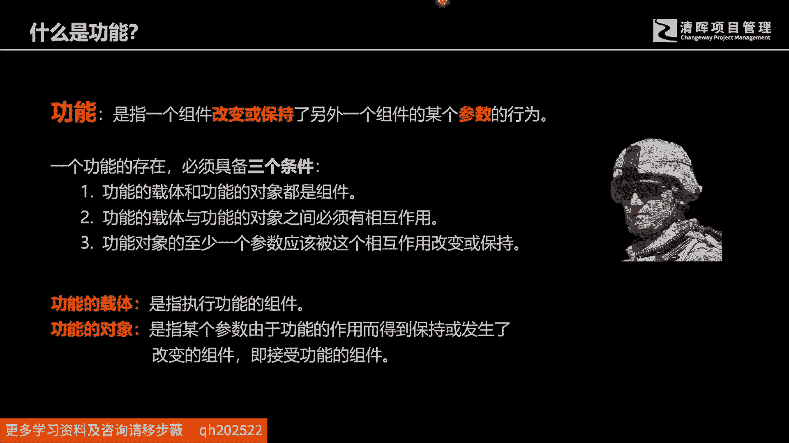

那么我们列一下那什么是功能，如果你真要去来设计产品，你真要来去来做分析，一个产品的具体的功能的时候，这些啊是我们经常会用到的一些描述啊，我们会来啊去来呀，我们要去，刚才我们解释了有什么系统啊。

组件呢啊如果各位能够有机会，因为今天时间有限哈，今天时间有限哈，比如说那可能可各位可能会要进一步去来学习，关于这个系统啊，超系统啊这些内容，它有些功能呢它是有害的功能。

比如说汽车它他的过它的有用功能是载人，当然如果他的速度过快，发生了交通工交通事故的时候，他的他有可能会撞伤对吧，或来损坏这个公墓或者伤伤害，或者造成这个人员伤亡好，那么我们在设计产品的时候。

要掌握这个功能的相应的这些冲突和矛盾，那么这个呢，就是我们在考虑相应的解决方案的时候啊，我们的功能设计主要考虑的相关内容。

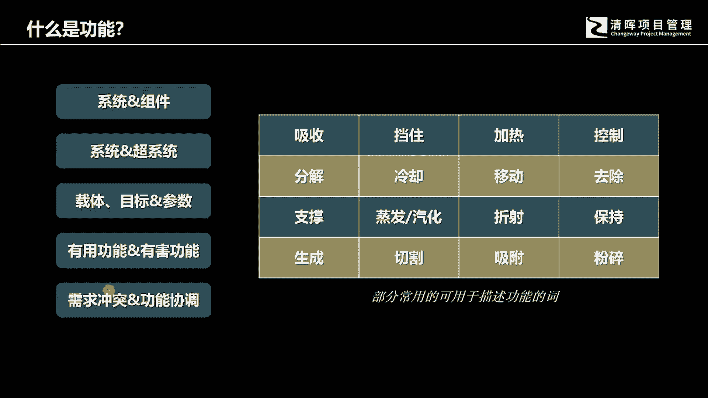

好刚才我没有解释功能，那么现在我们解释那个非功能，那么非功能也具有很多的这种感官上的，直观上的人为的一些这个感官判断呃，比如说我们经常会用到这个共享单车，那共享单车的时候。

有些人会评判是说诶这个早期的这个小黄车，跟这个呃有个小蓝车是吧，来比较的话，很多人认为这个呃蓝那个蓝颜色的车，好像没有比那个OFO的那个小黄车更好用，为什么呢，就是因为他的这个打开锁的时间是不是特别快。

而这个特别快其实是人的一种感官感受，那你怎么把特别快，这种非功能的这种要求变得更加的啊，具体更加的符合这个我们在具体的解决方案，中间的一些，比如说设计和测试的要求，那么这个里面就要来设置相应的一些啊。

这种描述，那比如说你可能会来设计，比如说我们打开这个车锁的，比如说这个操作步骤啊，扫描以后的操作步骤最好不要超过三次，那么如果还有进一步的这个呃要求的话，比如说开锁的时候不要超过这个额。

刷了以后不要超过十秒钟，那这样的话，可以进一步的使得我们这种非功能啊，能够得以这个实现设计实现和，这个啊，这个满足我们消费者或者使用者的需要呃，也而且呢也便于这样的一些啊，测试的这样的一些啊安排好。

那么我们常见的一些非功能需求呢，我们做了一些分类啊，这里有八有八项，发这个八项呢包括感官什么易用性，人性化执行操作之类的好。

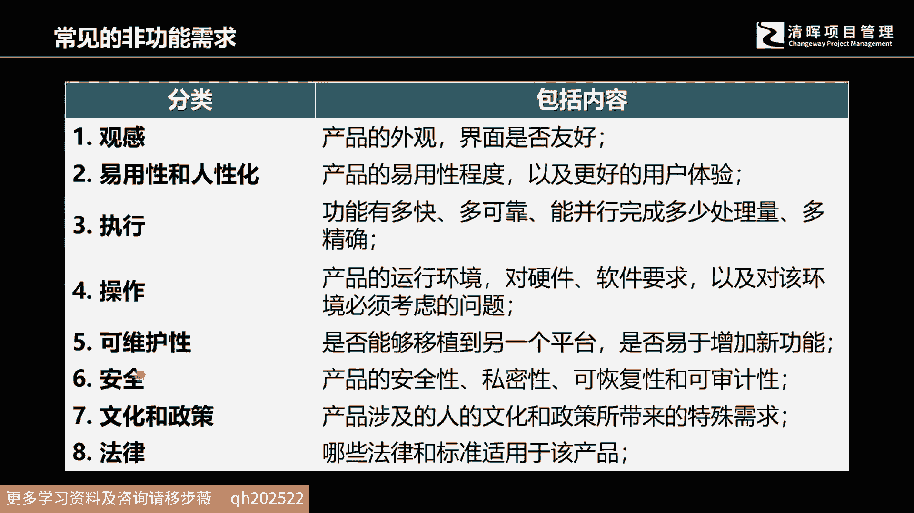

那么那么我们如何去来这个描述它啊，描述相应的测试方式啊，这里也给出了相应的一些建议和方法，比如常见的一些比如管感官上的，比如说符合公司品牌，六十六十%的客户能够在五秒钟之内啊，表示满意啊。

比如说执行刚才我们说了啊，比如说这个网络并发数啊，特别多的时候，我们在执行响应时间能够低于这个0。25秒，感官上面感觉特别快啊，包括啊可维护易操作之类的，比如说操作步骤特别差，特别少啊。

这都是一些非功能的一些测试方式，所以我们在这个商业分析的过程中，需求其实并不那么容易得到，为什么并不容易得到，因为它本身就要考虑很多的方面。

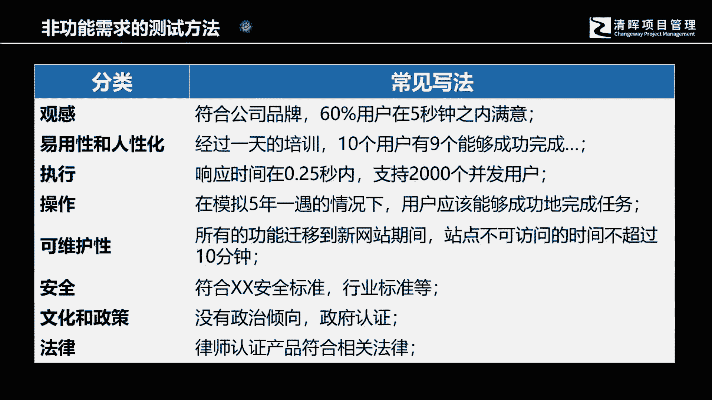

一个方面就是我们这个商业的需要，另外一个方面呢我们要考虑这个干系人的需要，那么在实施具体的解决方案的时候，我们也要考虑到功能的需要和非功能的需要，其实呢这中间还要考虑另外一个很重要的内容。

就是过度的需求，什么叫过度需求嗯，我相信有很多人在学习完这个偏僻之后，其实真正在企业里面是不是就能够发挥作用，很多人现在应该会有很多的具体的感受，和认知呃，我也接触过很多这个。

比如说派集体派一些公司的员工，来接受这个项目管理知识培训，的一些企业的负责人，偶尔我们在跟这个企业的我的呃，一些企业的这些负责人去沟通的时候啊，我发现是企业的负责人，有时候也会说出一个问题。

他说其实我们派了一些学员来学习，PMP之后啊，其实在企业里面这个呃发挥的作用啊，就是还是有限的，那么在这个时候，其实我们碰到的一个问题其实就在于过度，我们怎么把它过渡好，并不是说我们接受了全员化的这个。

项目管理培训，整个企业就能够呃把这个项目管理的知识，经验工具，曾经的经验工具方法，能够就都能够充分的应用好的，它其实是需要有一个更好的一个环境，然后改变整个组织的这样的一个。

更加适合项目的这样的一个开展的，一个管理流程，那么这中间也需就需要的是什么呢，需要的是企业能够准备好，去接收这样的知识和这样的一些能力好，那么过度需求呢，他考虑的其实就是。

我们从所谓的当前状态过渡到未来状态的时候，企业是不是真正准备好了，是不是真是不是真正能够接受，我们这个新开发的能力，或者说这个新开发的这样的一些解决方案好，那么这个里面呢。

其实整个包含起来就是我们的产品需要，我们的商业分析分析的是什么，其实商业分析工作分析的就是，这里面相应的商业需求，该行人需求，解决方案需求以及解决方案需求，中间所包含的功能需求，非功能需求啊。

以及相应的过渡需求，我们的项目需求和质量需求呢，是我们的项目管理工作所需要开展的工作，两者之间起到了啊相互关联的作用，商业分析工作呢其实是在项目工作之前，然后告诉项目这个项目团队我们应该去做什么。

他告诉他的是一个方向和背景，然后呢项目经理带领的团队去来做实现的工作。

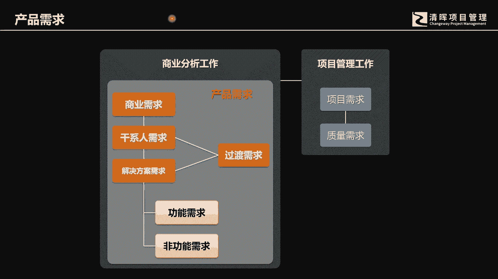