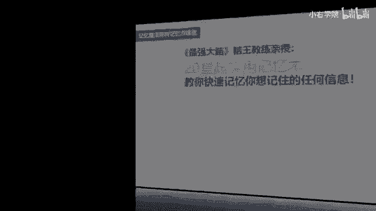
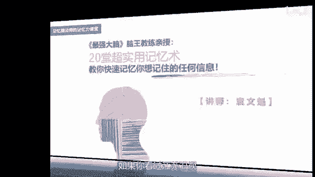
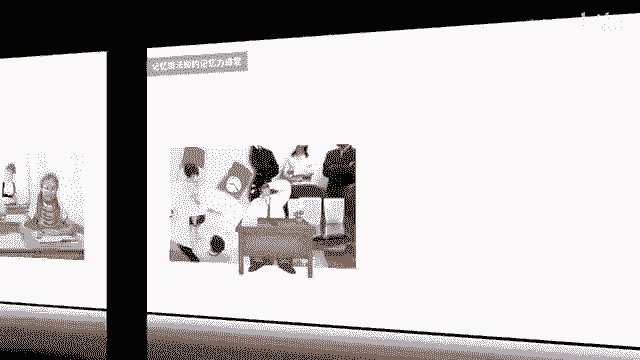
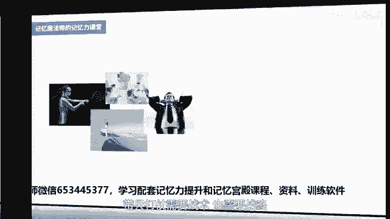
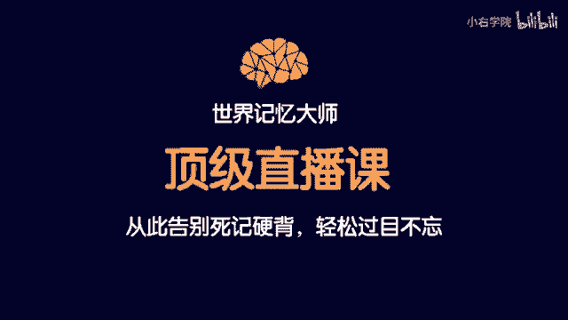

# 海马体记忆法：助你成为最强大脑 - P1：01 【发刊词】拥有超强记忆，助你成为最强大脑 - 清晖Amy - BV152tfe9Ev3

你好，我是记忆魔法师袁文魁，很开心为你分享最强大脑记忆法，今天起我们将一起探秘记忆魔法的世界。

一起创造学习的奇迹，如果你看过江苏卫视最强大脑这档节目。

对于中国队长王峰，全球老王陈志强一定非常熟悉吧，王峰是2010年和2011年，世界脑力锦标赛的总冠军，也是亚洲唯一一位总冠军，陈志强在初三的时候便成为了少年组，中国记忆总冠军，高中时在第四季和第五季。

最强大脑荣获全球老王称号，我就是他们，以及其他20多位最强大脑选手的教练，我在2003年时读高三，便开始自学记忆法，那个时候呢尝试用编故事，编歌诀，列图表等记忆方法，背诵了语文的课文和政史地的知识。

帮助我考取了武汉大学文学院，2007年，我又系统报班学习记忆法，学完以后一个星期就将一整本道德经倒背如流，后来呢又花了一个星期背完了六级单词书，当时呢我直接保送了武汉大学的研究生。

并且创办了武汉大学记忆协会，对于记忆法我爱得一发不可收拾，经过大约一年的刻意练习，我在2008年在四届老力锦标赛上，荣获了四界记忆大师称号，成为当时全球仅有的60位选手之一，从那个时候开始呢。

我就开始担任教练，2009年，我的学生王峰获得了世界记忆大师称号，并且排名世界第五，中国第一，2010年，他又问鼎了世界脑力锦标赛的总冠军宝座，2011年，我带领了武汉的精英选手。

为中国夺得了团队冠军奖，至今呢我也教出了有60多位世界记忆大师，包括王峰，陈志强，胡晓玲，郑爱强等等，目前呢全球的记忆大师的总量只有500多位，除了在比赛竞技领域带选手以外。

我这10年来也一直致力于实用记忆法的传播，针对中小学生和成年人开设各类课程，并且呢写作了记忆魔法师，打造最强大脑等实用的记忆书籍，有的学员从学渣飞速逆袭为学霸，有的轻松考取了名校的研究生。

还有的运用于职场，提升了工作竞争力，有的运用于生活，增加了个人魅力，他们通过记忆法为大脑赋能，让生命因此而绽放，我经常呢会遇到很多朋友，他们都有以下的这样一些苦恼，别人告诉他名字，结果他扭头就忘了。

考前背的滚瓜烂熟，临考时却忘得无影无踪，经常呢忘掉账号密码，反复试错，结果呢被冻结了账号，老板安排的工作又多又杂，经常了忘掉了，这忘掉了，那想好好学习英语，想出国去旅行，结果单词老是记不住。

股神巴菲特曾经说过，记忆好不一定会让你成功，但是记忆力不好一定会让你糊涂，一定让你失败，而且失败的很难看，每个人呢多少都经历过以上这样一些情况，但是呢大多数人呢都会觉得唉就这样吧。

自己呢反正天生记忆力就比别人差，于是呢努力活了半辈子，也不想要去改变，生活依然是一团糟，的确大多数人认为记忆力不好是天生的，但是据我十多年的从业经验来看，金山岛上几十位记忆大师。

无一例外都是后天训练出来的，甚至好几位选手第一季，第二季看了最强大佬才找我学习，后来才成为最强大脑的选手，最强大脑的科学评审dr。away这样说过，其实每个普通人只要愿意，都有可能成为记忆大师。

天才和非天才，除了一定的天赋差异之外，最重要的差别在于动机，他们的动机更强，更执着，那当你知道这条大脑的超强记忆力，是可以练出来的，你是不是也跃跃欲试呢，不过不要着急，我们还需要更加清晰我们的动机。

我们到底为什么要训练记忆力，对于学生而言，学习你的知识大部分依赖于记忆，英国哲学家培根说过，一切知识不过是记忆，如果你连最基本的概念定理，公式单词课文都记不住的话，即使头悬梁锥刺骨，背了又忘，忘了又背。

那又何谈去理解和运用这些知识呢，如果在考试的时候什么都想不起来，怎么奢望能够考取名校呢。

对于成年人而言，记忆力也必不可少，我这几年教的成年人，学生占到了一大半，他们学习记忆法的具体动机可以分为以下几类，第一类呢是，渴望提升学习力和竞争力的职场精英，第二类呢是想要帮助孩子。

拥有好的记忆方法和学习方法的父母，第三类是生活中经常健忘，丢三落四的一些人，第四类呢是拥有强烈好奇心，对技法感到很神奇，希望能看看自己的大脑潜能到底有多大，并且想挑战成为世界记忆大师的人。

不管你属于哪个类型，这一系列的课程都适合你，本次课程呢分为四个大的模块，第一个模块是大佬系统篇，我会帮助你消灭影响大脑记忆的拦路虎，同时分享升级大脑系统的智能训练，只有大脑系统升级。

我们的记忆法软件才能高效运转，第二个模块是记忆方法篇，你将学到形象记忆法，配对联想法，记忆宫殿法，情境故事法等十种方法，我通过实际学习工作和生活中的实例，让你轻松掌握，学完马上就能用出来。

当然呢只掌握方法还不够，带兵打仗需要战术，也需要战略。

所以第三个模块是记忆策略篇，我会分享调整状态的脑力管理策略，加速记忆的时间管理策略，克服遗忘的复习管理策略，让你运用记忆法更加游刃有余，事半功倍，最后一个模块呢是记忆运用篇，记忆法是万金油。

能够运用的领域多如牛毛，这里挑选出大家关注比较多，而且更实用的板块，比如说英语单词的记忆，数字信息的记忆，阅读书籍的记忆，以及社交场合和职场工作中的运用，这20堂超强记忆力课程。

浓缩了我10年来授课的精华，要参加我的面授课程，学习费用至少在1万以上，很多人因为经济条件比较有限，可能会望而却步，我是一名来自农村的孩子，家庭条件也并不理想，毕业后前几年创业维艰，生活窘迫。

如今我通过记忆法和大佬教育的事业，让自己的生活变得更加美好了，所以我选择以在线课程的方式，来更多地去普及记忆法，希望带领更多人走进记忆魔法的世界，助力于你们的学习和工作。

同时呢去看一看你们大佬拥有多大的潜能，去看到人生的另一种可能性，你远比你想象的要强大很多很多倍，所以不论你是想要摆脱死记硬背困境的备考者，还是想提升自己核心竞争力的职场人士。

亦或是想要帮助孩子解决学习难题的父母，欢迎和我一起走进记忆力的课堂，并且将这些方法运用于你的生活，融入到你的生命之中，我能够帮助那么多学生，成为最强大脑和记忆大师，也一定能够帮助你成为技艺的高手。

在学习过程中遇到任何的问题，你都可以在课程评论区里面留言，我会就一些典型的问题给大家及时的答疑，让我们一起共同携手，重塑大脑，重塑人生，我是记忆魔法师袁文魁，再见，现在开始把刷手机的时间用来改善记忆力。

五天以后呢，你会跪着感谢自己这个方法，你一旦熟练掌握以后，记忆的速度就会越来越快，学习以后呢，你可以挑战记忆一整本书籍，挑战记忆一整本英语单词书，没错，就是这么的神奇，当你能够快速的记忆一些复杂。

无序的内容的时候，无论是学习还是工作，甚至在生活当中，你都已经比别人快了很多步了，你相信吗，现在报名记忆训练营，零元即可学习，还有其他实用的记忆方法，赶紧扫描屏幕上的二维码或微信搜索。

653445377，653445377。

