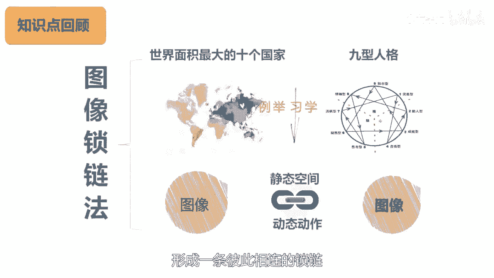
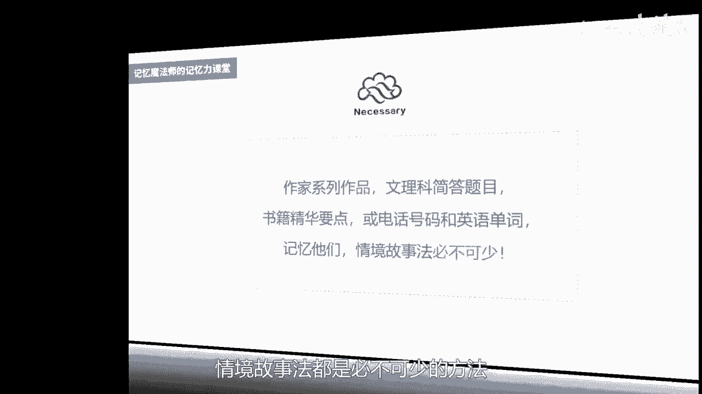
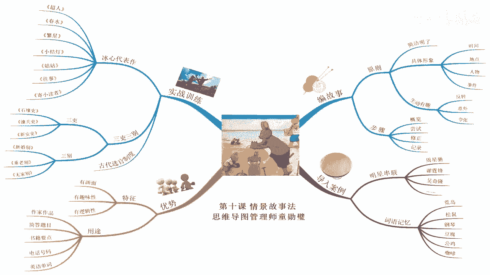

# 海马体记忆法：助你成为最强大脑 - P11：11 、【情境故事】放电影般趣记大量词语 - 清晖Amy - BV152tfe9Ev3

🎼。🎼你好，我是记忆魔法师袁文奎，欢迎来到我的超强记忆力课程，让我们一起拥有超强记忆，创造学习奇迹。😊，🎼上一讲我们学习到图像锁链法，以世界上面积最大的10个国家和九行人格为例。

学习到如何将大量的图像通过静态的空间位置或动态的动作进行两两连接，形成一条彼此相连的锁链。

🎼今天我们将学到的是情境故事法。🎼它与图像锁练法有相似之处，但更需要想象力和创造力。我一般会将它与图像锁链法结合使用。🎼。🎼情节故事法简单来说，就是将要记忆的信息按顺序编成一个有情节的故事。

在脑海中像电影一样呈现出来。

🎼为什么要变成故事呢？因为故事有画面，有趣味性，有逻辑性，能够将零散的信息像珍珠一样串联起来。🎼不管是用来记忆作家的系列作品、文理科的简答题目，书籍的精华要点，还是后面会讲到的电话号码和英语单词。

🎼情景故事法都是必不可少的方法。

🎼情经故事法其实大家并不陌生，网络上就有各种各样的段子。🎼有将各种汽车的品牌串起来的，有将某歌星的作品名串起来的，还有将明星的名字串起来的故事。我分享一个，你听听看。🎼从前有一座郭富城。

里面住着刘德华和张惠妹。有一天呢他们去周星驰喝水，突然刮起了谢霆锋。🎼从水中出来一条吴奇隆，吴奇隆手持郑伊剑，骑着黄家驹，抢走了张惠妹。刘德华手持周华健，翻过了赵本山，穿过了关之林，越过了潘长江。

终于抢回了张惠妹。🎼听完这个故事，你感觉如何？如果你能够在脑海中依次呈现出画面，那差不多你是可以把故事复述出来的。故事呢是有联性的那我们怎样编故事更能够帮助记忆呢？🎼在编故事的时候要注意几个原则。

一是要简洁明了，不要把一些八竿子打不着的东西都扯进来。编的故事像老太婆的裹脚布又臭又长。🎼二是要具体的形象，时间、地点、人物、事界都要具体，脑海中要有画面呈现。🎼三是要生动有趣。

不要把说故事变成了讲道理，或者变得让人听了想睡觉，在故事中加一些反转、意外和夸张，会让人印象更加深刻。🎼假设现在给你六个词语，荒岛、松鼠、钢琴、豆腐。🎼公鸡咖啡。🎼你应该按照怎样的思路来编故事呢？

🎼那我的步骤如下。🎼第一步，盖览。🎼先大致的浏览一下所有的词语，看看呢能够产生怎么样的联想。🎼再看看刚开始的三四个有没有可以作为主角场景时间的那如果没有主角，可以根据内容来虚构一个人物。

在这里荒岛可以作为故事的场景，松鼠可以作为主角。🎼第二步，尝试，先试试，将前面的3四个编一下。🎼接下来再根据逻辑往后联想。🎼我先开个头，想象在荒岛上，一只松鼠正在弹钢琴。🎼糖饿了就拿出一块豆腐来吃。

🎼接下来那公鸡和咖啡怎么煎呢？想到了松鼠吃完了豆腐，口渴了，公鸡端上来一杯咖啡给它解渴。🎼那为什么是公鸡端上来呢？我就想一下，公鸡穿着服务生的衣服，那松鼠呢是他的客人。🎼当然，故事呢也有不同的编法。

你还可以想象呢公鸡呢想来抢豆腐吃。那松鼠端起一杯咖啡就泼到了公鸡身上，它就变成了落汤鸡。🎼第三步，修正。🎼整体都编完以后呢，再重新屡变故事的情节，将不太符合逻辑或者不太对得上的部分。想想怎样去优化。

🎼然后呢，在脑海中闭着眼睛回想一两遍。🎼那刚才这个故事呢，后一个版本更夸张更有趣，我就将这个版本固定下来，并且呢复习强化。🎼第四步，记录，将编好的故事啊，用文字记录下来，也可以呢尝试用简笔画画出来。

方便以后在遗忘的时候可以复习。🎼在编故事的时候啊，特别要注意一个误区，就是呢在故事里有太多的并列的信息，这样就不太容易记住顺序。比如我一边吃着橘子，一边看着电影，一边听着音乐，一边想着心事儿。

🎼一边一边就是典型的并列关系。🎼还有我出门买东西，买了香烟、橘子、李子、木瓜、香蕉等。那如果这五样东西都是你要按顺序记的，那这个顺序就很难记住了。🎼要让大量的病列信息容易记忆。

特别要注意彼此链接的部分的因果逻辑。比如我运动，我吃饭，我胖了，那这三个之间没有关联，就像是未经拼凑的积木一样。如果加上因为所以加上一些过度的因果联系，就可以更好的将彼此拼合在一起。

变成更好记的情境故事。🎼想想这个场景，我每天晚上在健身房里运动。🎼透制了身体的体力。所以呢晚上吃饭就会多吃两碗，连着这样吃了一个月，我在称上一称，居然呢胖了5斤。

🎼那这样的话要回忆起三个词的顺序就变得非常容易了。嗯。🎼接下来我们要进行情境故事法的实战训练。一般在记作家的系列作品时，就可以使用这个方法。我是武汉大学文学硕士毕业，我们专业考试就需要记大量作家的作品。

包括了中国古代现当代外国的作家，看着厚厚的一沓复习资料啊，有时候真恨这些作家，为什么当初要写这么多的作品，光把名字背下来都很头疼呀？🎼好在呢我还掌握了情境故事法，比同学们要轻松很多。

比如冰心的代表作有超人、春水、繁星、小桔灯、姑姑、往事记小读者。🎼那这里呢主角就想到了超人场景呢可以选在春水边。🎼想象一下，有一颗冰心的这样一个超人。🎼泡在了春水里面再洗澡。🎼满天的繁星倒映在水里面。

超人呢把繁星摘下来，放在橘皮里做了一盏小桔灯。🎼把它送给了自己的姑姑。🎼咕咕了在灯下开始回忆往事，然后呢把它写下来，寄给了小读者。🎼再比如杜甫啊最具代表性的作品是三立三别，包括石壕立、潼关吏、新安吏。

🎼新婚别垂老别吴家别这6部作品。🎼杜甫果然很忙呀。🎼石豪很容想到了一个场景。🎼就是石头堆称的壕沟，潼关呢可以拆合啊，想到了把儿童关起来。🎼新安呢蔡可讲到的是新的保安。🎼那故事就有了。

想象的杜甫啊在石头堆成的壕沟里将儿童关了起来。🎼派一个新的保安来看守。保安呢从新婚一直守到垂老，仍然无家可归。那别提多伤心了。🎼通过这个故事，我们来试着回忆一下杜甫的三恋三别吧。

🎼我们再来看一个历史常识的例子，以史为鉴，可以知得失，上下5000年，留在历史里的都是我的老师。中国古代历史都有选官制度，我们在企业选拔干部时也可以借鉴。🎼我们来看一看古代是怎么选的。

🎼一、西周时期是四清四录制。🎼就是呢天子或者贵族连任亲这样的高官，并且呢享受俸禄，世世代代子子孙孙一直延续下去。🎼2、战国呢到秦啊是军功受爵，打仗有功啊，就可以了受爵位。在电视剧大秦帝国裂变里面。

商鞅变法就规定杀敌人首级一个就可以获得爵位一级。🎼3、汉朝呢是察举制和曾币制。🎼茶举制呢是让哥俊国啊，这也相当于现在的猎头公司。🎼美联当向国家去推荐人才。🎼那甄币制呢是项是会公开招聘。

🎼4、魏晋南北朝呢是九品中正制。🎼周星驰呢演过一个电影呢，叫九品芝麻官。那个时候的当官呢，除了官位，还要看你品位。🎼有名望的有眼力的官员担任中正。🎼会明察暗访周俊人士。

将他们分为上上上中上下、中上、中中、中下下上下中下下这九等。以后评关的时候可以参考。🎼5、隋唐的时候呢是科举制，这个呢大家都很熟悉了。🎼那至于现代的啊这个选官制度呢。

其中一个就是大家很熟悉的公务员考试了。🎼好了，大家都理解了，那关键还是要记住每个朝代分别是什么，不然呢非常容易混淆。我先把朝代转换成具体的形象。🎼西粥呢显然是我们在喝的这样一个吸粥。

🎼战国啊可以想到战斗的这样一个场面。🎼秦想到秦始皇。🎼汉朝想到了彪形大汉。🎼魏晋南北朝协议呢想到了魏经。🎼隋塘显影响到了水塘。🎼接下来我就要按照顺序开始编故事了。

🎼想象了西周的天子和贵族们世世代代的传下来，俸禄呢只够喝西粥了。🎼他们呢就掀起了战争，秦始皇镇压了战争，统一了六国，给有功的将士们颁发爵位。🎼那突然呢，一位彪形大汉站了出来。

举报一位警察到处征集辟谷之人。🎼这里呢指的是茶举和珍篦，让他们每一个人呢吃了9瓶味精啊，酒瓶呢就是九品中正制，被辟谷之人呢扔进了水塘里面。🎼一群蝌蚪将他举起来啊，这里指的是柯举，然后他就得救了。🎼好。

这个故事呢大家可以通过我们的文稿啊再看一遍。🎼这个故事呢像周星驰的电影一样无厘头，但是逻辑上说的通又比较简洁有趣，画面感强，还是挺容易记忆的。你可以结合文稿再多看两遍。

然后根据故事来依次回忆出每个朝代是什么制度。这个案例你会了。那记忆历朝历代的农业、文化、经济等方面的制度和成就，你也可以依葫芦画瓢去模仿了。🎼编故事这种能力，那背后呢是一种想象力、创造力和表达力的体现。

🎼有些企业的面试题会让面试者很快把几个无关的词语编成一个故事，来考察他的思维反应能力。🎼最近这些年，与故事力有关的书开始很火爆，比如你的团队需要一个会讲故事的人，故事思维，谁有故事谁胜出，使命感。

如何讲出企业故事认同感，用故事包装事实的艺术，无论是拉投资。🎼做营销混团队。🎼写文案做演讲，故事里都成为一种加分的能力。那怎么提升呢？多使用情境故事法吧。🎼我来总结一下今天的内容。

将要记忆的信息编成一个有情节的故事，就是情境故事法。要注意几个法则，简洁明了，具体形象生动有趣。🎼那编故事的步骤是概览。🎼尝试修正记录。🎼我示范了在记艺作家的系列作品以及在历史常识上的一些运用。

那你也可以用它来记其他的简答题目，还有了单词的一词多义，以及像十大文豪、十大名察等这种百科知识上面。🎼多多练习，成为故事达人吧。下一讲我们将学习到歌绝记忆法。

🎼今天的作业请尝试用情境故事法记日本作家夏日数食的作品，我们是猫。🎼草整。🎼与美人吵三四郎。🎼从此。🎼门。🎼行人。🎼一直到对岸。🎼稻草。🎼明暗。🎼Yeah。🎼今天的课程就到这里了。

请在文稿里查看今天的练习，并且把你的想法在评论区里留言，和同学们一起切磋交流吧。😊，🎼也欢迎你把课程分享给你的朋友们，和他们一起拥有记忆魔法，成为最强大佬。魏大佬富能让生命绽放。我是记忆魔法师袁文奎。

我们下一讲再见。😊。