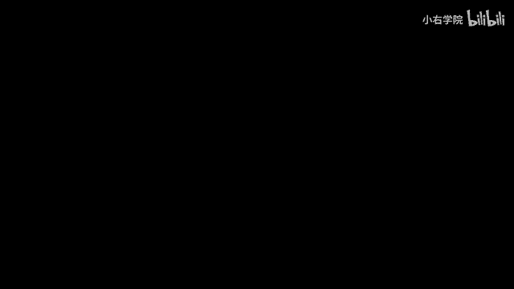
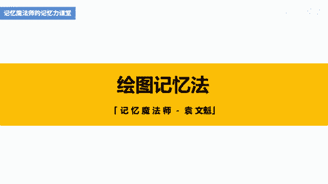
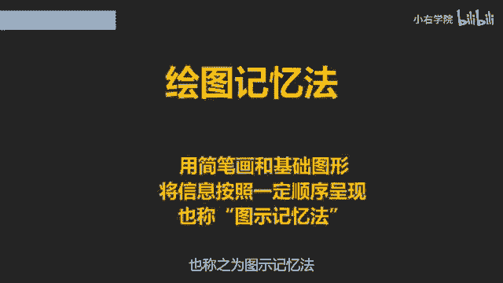
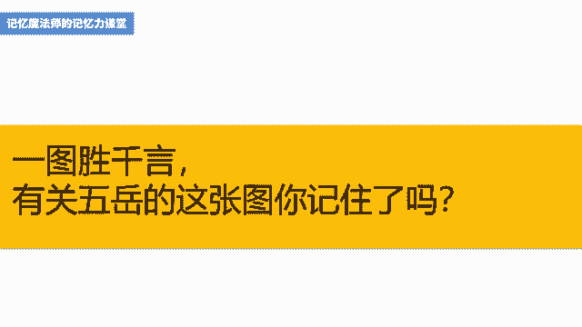

# 海马体记忆法：助你成为最强大脑 - P12：12 13、【绘图记忆】妙用简笔画速记百科题 - 清晖Amy - BV152tfe9Ev3

你好，我是记忆魔法师袁文魁，欢迎来到我的超强记忆力课程，让我们一起拥有超强记忆，创造学习奇迹。

上一讲我们学习到歌诀记忆法，包括字头歌诀法和要点歌诀法，将信息通过我们的智慧浓缩成歌诀，记忆起来形象有趣又朗朗上口，那怎么感觉和音乐课挂上钩了呢，今天我们要学习的是绘图记忆法。

这个不是要你回去补你的美术课哦，我这样的画渣都能用得很好，你也可以，绘图记忆法就是用一些简笔画和基础图形，将要记忆的信息，按照一定的空间顺序和逻辑顺序呈现出来，帮助我们达到直观记忆的效果。

也称之为图示记忆法。

不论是记忆各门学科的知识点，还是记忆比较大段的诗词文章，绘图记忆法都能够生动呈现，我一般是画完就可以马上记住，而且很长时间都难以忘记，很多名人都会使用绘图记忆法，比如著名作家马克吐温。

他以前演讲时经常忘词，在手上呢做了各种小抄，指甲盖上都写满了，依然是不管用，有一天他要讲美国西部牧场生活的内容，他灵机一动，用2分钟画了六张简笔画，比如一个干草堆代表着牧场，下面一条曲线代表响尾蛇。

那看起来很low的画，他画完呢看两眼就撕掉了，演讲时，这些画依次浮现在他的大脑里面，脱稿演讲变得非常轻松，他成为了众人眼中的超级演说家，著名的物理学家爱因斯坦也曾经说过。

我的所有点子都是通过画图得来的语言，只不过是我用来向别人解释我想法的工具，那要向天才看齐，我们可以学习绘图记忆法，有同学可能会说，我不会画画呀，我天生就没有艺术细胞，我在我的面授课。

文科大佬精品班会做这样一个练习，给大家每个人准备20多个圆，让他们在上面呢加几笔变成具体的东西，同学们都画了很多，比如笑脸闹钟，太阳车轮气球等等，我从来没有发现呢一个都画不出来的。

所以啊大家其实都会画画，我们绘图记忆法也只需要这样的水平就够了，甚至你要画老虎画个圈，写上一个王字就够了，不需要你画出蒙娜丽莎这样的水平，才叫做会画画，绘图记忆法的基本功，先要学会把单个的词语或句子。

转换成具体的形象并绘制出来，转换的方式依然可以用鞋子猜观众，但要尽可能的简单，而且容易画出来，比如中华的华，你画成花，比画刘德华要简单得多，比如慈悲，你转换成观音菩萨，要画出来可能比较费力。

你谐影响到慈悲喝水的这种慈悲，幼儿园的小朋友都会画，我们拿马斯洛的五大需求层次理论为例，从低到高依次为生理需求，安全的需求，社交的需求，尊重的需求，自我实现的需求，那这五个词语怎样分别用简笔画呈现呢。

生理的需求相关呢，可以联想到很多，包括吃喝拉撒睡等等，那我想到比较容易画出来的就是花生，既包含生这个字，又同时是吃的东西，另外呢还可以想到生理盐水，画一个吊瓶，安全的需求。

这个瞬间就想到了安全帽很容易化社交的需求，相关的想到两只手在握手，谐音呢可以想到了社交胶水的胶，想到把一瓶胶水放在弓箭上面射出去，那这两个呢我都可以很好的把它画出来，尊重的需求。

我瞬间想到了古代喝酒用的酒樽，看起来就很重的样子，也可以的想到两个火柴人在互相的敬礼，自我实现的需求，可以用自己站在领奖台上的形象，也可以呢是站在一根实线上，而不是虚线，这五个词语分别转换成简笔画之后。

因为呢是从低到高的顺序，可以的，用一个金字塔的方式来呈现，从下面一直画到上面，我在文稿里呈现出我的绘图，因为呢只涉及到五个信息，相对比较容易记忆，当然这五个信息还是比较孤立的，我称之为单一图示法。

马克吐温就是用这样的方式，平时遇到少量的比较重要的信息，在旁边配一张简笔画，突出一下，印象就会比较深刻，但如果一道题目的信息超过四个，虽然每一个都配了简笔画，但可能会遗漏或者忘掉顺序。

这时就需要更加有机的组织这些画，我分享两种常用的方式，一种是锁链图示法，就是把图像锁链法在脑海中的形象，用简笔画呈现出来，绘图的时候将单个的图彼此接触，通过空间关系和彼此的动作，来建立逻辑上的联系。

以方便我们一网打尽，我分享一下2017年，我的公众号袁文魁上的一篇文章，如何学习才能让知识过目不忘，当时呢看到逻辑思维的罗振宇，在得到专栏里分享了自己的一些学习方法，提到了如何学习的五个关键词。

我觉得挺赞的，就分享给学生们，但是第二天呢也发觉自己啊不能够完全记住，于是呢我就用绘图记忆法画了一遍，并写了这篇文章来分享，罗振宇在文章里提到，面对我们这一代人的知识焦虑，应该怎么办，这需要五个关键词。

第一人格就是跟着人学，而不是跟着书本学，先降低我们的知识负担，它帮助我们筛选和归纳，第二就是概念，通过掌握一个一个的新概念，搭建起我们的知识框架，再进来新的信息，我们知道把它放在哪，第三是缝合信息。

走来过去，我们不见得都记得住，只有我们通过表达一次，无论是转述还是写一则极其简短的读书笔记，在自己的生命和知识术当中把它缝合起来，第四就是碎片，这是我们提升学习效率，在这个时代几乎是唯一的法门。

当然最重要的是目标，只有目标明确，不断往前拱，我们才能把知识落实为我们行动的成果，这五个关键词分别是人格概念，缝合碎片和目标人格，那我就想到一个形象啊，一个人站在格子里面，概念很容易想到了新概念。

英语缝合就简单了，想到了针和线碎片，想到了碎纸片，目标一般会想到了靶子，于是呢我用锁链图示法这样来呈现，你可以来看看文稿里面的图，一个人站在格子里面，他手里呢拿着一本新概念英语新概念破了。

用针来缝合针的线上，串起了一张张碎纸片，最后针扎中了靶子的正中心，我一分钟就画完了，那我这画画的功底啊，其实也是小学生的水平，你也可以做到，但是我画过一遍以后，就可以印象非常深刻的记下来。

这就是罗振宇所说的，缝合转述或写读书笔记是一种形式，而用绘图记忆法则是我的特殊形式，可能以后我也会忘掉，但是呢当我翻到我的绘图笔记本，这张图就在那里，一下子就唤起了我的记忆，所以啊让我决定呢。

今天把这个案例分享给你们，另一种定位图示法，就是把身体定妆法，万物定桩法等方法用简笔画呈现出来，庄子就像一个圣诞树一样，不同的地方呢挂着不同的礼物，我们通过绘图可以一目了然找到礼物。

身体定妆和摩托车定妆，我们在前面讲过，这里呢就举一个以方位定妆的案例，即中国最著名的五座山，也就是五岳，人们常说五岳归来不看山，我们先通过这张图记住五岳的方位和省份，以后按图索骥都去爬一遍吧。

先来说一下知识点，东岳是泰山，在山东，西岳是华山，华山论剑的地方，在陕西南岳是衡山平衡的衡，在湖南，北岳是衡山永恒的恒，在山西中岳嵩山，嵩山有少林寺，在荷兰文稿里的这张图呢，是武大的学生张水晶画的。

因为呢是五岳，所以在中间画了一座山，东边的泰山谐音后，画了一个太阳，西边的华山谐音画了一朵花，陕西的伞谐音为散，所以花是闪闪发光的，中间的河南嵩山前音后化成了一棵松，在一条河的南边。

北岳恒山先影响到了恒星，化成了爱心，因为山西很容易想到煤炭啊，所以呢把爱心画成了黑色的南岳，衡山想到了平衡木，画在了一个湖的南边，看完这张图，我们尝试来回忆一下吧，东岳是什么山，对泰山，西岳是什么山。

华山山西有哪座山呢，对衡山永恒的恒嵩山少林寺是什么岳，好中岳，南岳又是什么山呢，横山啊，平衡木的这个横好了，一图胜千言，这张图呢印在脑海中以后呢，想忘都忘不掉了，我来总结一下今天的内容。

我主要分享了绘图记忆法的三种方式，一种是单一图示法，适合于少量的信息，只需要单独将信息转换成形象即可，另外两种涉及到对信息的整合，包括锁链图示法和定位图示法，分别是将图像。

锁链法和身体或万物定妆法画出来，以便更直观的形式方便我们记忆和复习，你学会了吗，尝试去用一下吧，今天的作业，请尝试用绘图记忆法来记忆下面的题目，法律规范在公共生活中的作用，一指引作用，二预测作用。

三评价作用，四强制作用，五教育作用，今天的课程就到这里了，请在文稿里查看今天的练习，并且把你的想法在评论区里留言，和同学们一起切磋交流吧，也欢迎你把课程分享给你的朋友们，和他们一起拥有记忆魔法。

成为最强大脑，为大佬赋能，让生命绽放，我是记忆魔法师袁文魁。