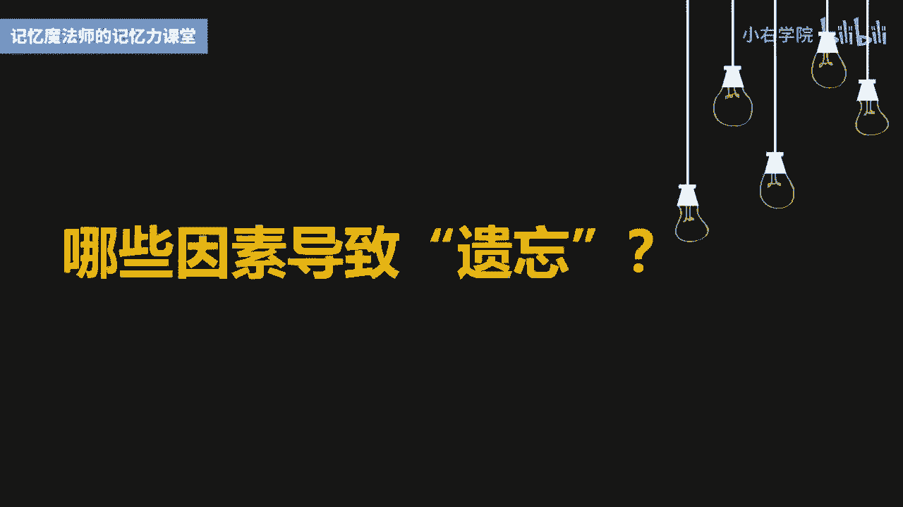
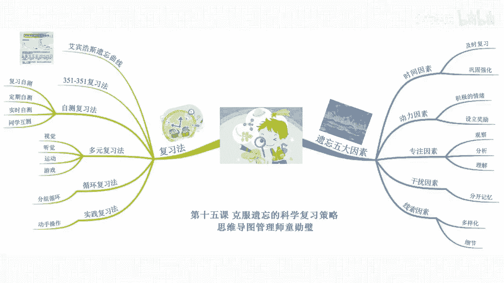

# 海马体记忆法：助你成为最强大脑 - P15：16 、【复习】4种复习要诀，摆脱遗忘困扰 - 清晖Amy - BV152tfe9Ev3

你好，我是记忆魔法师袁文魁，欢迎来到我的超强记忆力课程，让我们一起拥有超强记忆，创造学习奇迹。

然而即使我们的记忆效率非常高，如果遇到遗忘这个死对头，我们又不采取策略来科学复习，最终的记忆也会竹篮打水一场空，什么叫遗忘，我们先不谈很多影视片里面的诗意。

单从学习的角度来说，就是对实机构的材料不能再认或者回忆，或者了错误的再认与回忆，比如问你什么是社会主义核心价值观，西游记的作者是谁，你曾经都记过，但是呢现在一个词都说不出来，那就是完全的遗忘。

你能够说出部分的词，就是部分的遗忘，遗忘。

有的时候呢会非常尴尬，比如说很多歌星在演唱会的时候会忘词，比如啊蔡依林，罗志祥，张杰等，那陈奕迅呢还因为忘词向观众下跪，而且啊填词人林夕也在台下听着，真是尴尬不已，奇葩说等语言类的节目。

也有好几位选手讲着讲着就忘词了，不得不重新拿起笔记本来寻找提前准备的论据，这也是非常尴尬，那学生们呢也深受遗忘的苦恼，昨晚刚背完的课文和单词，老师检查时就忘掉了一大半，考前熬夜挑灯复习。

第二天考试的时候，大片大片的知识都想不起来，真是头疼呀，那遗忘呢也是非常正常的现象，即使是世界记忆冠军，也无法避免英国的冠军老本，那就经常会忘掉别人的名字，也会呢在出门时忘带钥匙。

那哪些因素会导致我们遗忘呢。

一是时间因素，时间是一把杀猪刀，也是记忆的强盗，知识在实际之后进入大脑的短期记忆，再往长期记忆的过程中，如果没有及时的通过复习或者运用去巩固强化，就很容易被遗忘大道给盗走，特别是在刚学习后的前几天。

是遗忘大道作案的高峰期，第二是动力因素，那一般最先遗忘的是我们觉得不重要，不感兴趣，不需要的，缺少感情投入的材料，积极的情绪会提高大脑的激活水平，从而有助于记忆的保持，我一般对于不想记的东西。

要找到一些让自己记忆的理由，并且给自己设立奖励，就会产生一种记忆的热忱，第三是专注因素，当你在记忆时溜号了，听东西，左耳朵进，右耳朵出，这时对于信息的关注比较少，缺少观察分析和理解，信息就如同过眼云烟。

需要时想抓也抓不住，也容易与其他的信息混淆，第四是干扰因素，我们对于正在学习的东西，会被过去已经学习过或未来要学习的东西干扰，比如你同时记20多个，以PIE开头的英语单词。

那这些单词之间就会互相产生干扰，中小学连续上同一门课不超过两节，也是避免同一门学科知识之间的互相干扰，五是线索因素，人们对于一些想不起来的事情，是因为呢在提取时没有找到适当的线索，比如阿里巴巴的哥哥。

他在记忆呢芝麻开门时，可能呢只是继承了一种食物，所以他在提取时一紧张啊，就会想到的是豌豆啊，大豆啊，那如果他在记忆时增加了线索，黑色的很小的，像蚂蚁的，那么它在提取时就会更容易想到是芝麻，好了。

知道了这些因素，其实呢就已经为我们避免了一些不必要的遗忘，但是呢即使上面的这些都做到了，可能还是会遗忘，这时候科学的复习策略是必不可少的，德国心理学家艾宾浩斯，是发现记忆遗忘规律的第一人。

他在记忆力心理学里，揭秘了人类记忆以遗忘的奥秘，今天分享的很多复习策略，也基于他的研究成果，提起艾宾浩斯，你一会熟悉他的艾宾浩斯遗忘曲线，他拿自己当小白鼠，找到一些没有形成联想的，完全同类的。

不熟悉的毫无意义的音节作为测试材料，比如ASWWCFHHGRFYJBC等，那通过长时间的记忆和考核，总结出规律，并且绘制了这条曲线，这条曲线呢告诉人们，在记忆过程中遗忘是有规律的。

在学习仅过了20分钟之后，就忘记了内容的42%，一天以后呢，望却量就达到了66%，到了一个月之后呢，忘却量高达79%，那可见呢最初阶段的遗忘速度是很快的，后来呢就逐渐的减慢了。

当然不同的信息遗忘的速度是不一样的，诗歌比散文要慢，散文要比无意义的音节要慢，越是抽象和无意义的信息越是忘得快，艾宾浩斯提出了一种复习方法，叫做351351复习法，也就是尽量在三小时内，五小时内。

十小时内，三天内，五天内，十天内分别复习一遍，当然要严格按照351，351复习法来进行记忆管理，估计我们都会疯掉，我会尽量呢遵循先密后疏的原则，如果是早自习背课文或单词，会在吃早餐排队时去回忆。

没有想起来的及时强化，课间没事就翻翻书瞅几眼，当晚呢也会再默背一遍来巩固强化，后面几天呢早自习也会复习之前的内容，在书本上我会记录下每篇课文，第一次，第二次，第三次背诵的日期，方便以后安排复习的时间。

那如何复习效果更好呢，我分享四种常见的复习方法，第一个是自测复习法，艾宾浩斯认为他是对遗忘曲线的最典型的运用，自测分为三个步骤，第一个是复习，自测就是对所学的知识随时进行巩固和测试，找到错误立马改正。

一般制作的黄金时间是早上的七点到九点，第二个是定期自测，比如每天睡前，每周的周日内容较多的时候呢，我们还可以分组来进行自测，第三个呢是实时自测，就是随时随地的测试，利用排队等闲暇时间。

可以呢边想边说出来，或者呢用手指在空中笔画来写出内容，我在高中上早自习背完课文，在排队等早饭的时候就会自测，那如果是英语单词，就会让笔划着去拼写，记不住的，吃完早饭就会马上回去复习，这样呢就可以了。

尽快去抢救遗忘的部分，另外还可以呢同学之间互策，在高三的课间，我和前后桌经常互测，谁出的问题能够拷打大家就会加分，那如果没有答上来呢，就会扣分，至于惩罚，比如在脸上贴条子，或者请吃晚饭。

一般没答上来的题目呢，在复习都会牢记，同学之间相互讨论，甚至辩论所学的知识也是一种不错的选择，第二个是多元化复习法，只是单调的重复，大佬也会觉得无聊，所以很多人都喜欢去背新东西。

却讨厌复习来巩固胜利的果实，怎样将复习变得更有趣呢，可以尝试多种感官通道，比如视觉上，可以呢用便利贴制作各种颜色的学习卡片，把英语单词写在卡片的正面，意思呢写在背面，根据测试的情况给予一定的标记。

比如对号代表着完全掌握，不等于代表着还需要巩固，差，代表着需要重新记忆，完全掌握呢就收起来放在一个盒子里，那后两类卡片呢就要投入更多的精力来复习，直到最终都完全掌握为止，比如在听觉上。

可以尝试给同学或朋友讲解所学的内容，如果没有轻重，选择对着录音设备讲解一番，也可以强化记忆，录好的音频可以在空余时间听一听，都可以潜移默化地巩固记忆，还可以再尝试体育活动或者游戏中来复习。

比如一边跑步或跳绳，一边背诗，第三个是循环复习法，当我们可以把大段的记忆材料进行分组，假设分为ABCD一共五组，可以的，记完A组，回忆A组，记完B组后，回忆A组和B组，救完C组，回忆B组和C组。

记完D组，回忆C组和D组，记完E组，回忆D组和E组，那最后呢回忆A组到A组一到两遍，这样循环复习可以有效的避免遗忘，假如我们需要长期复习，比如备战考研或托福考试，每天记新东西前都要复习之前背过的。

网上的流传一个超级90天的循环背诵大表，那主要是针对了背诵新概念英语制定的，那我们也可以参考，比如第一天背诵当天的100个单词，那第二天呢复习第一天，并且记忆第二天的，第三天呢复习第二天。

并且呢记忆第三天的，第四天呢复习第一三天，并且呢记忆第四天的，这也是基于艾宾浩斯遗忘曲线的一种复习策略，第四个是实践复习法，我非常喜欢陆游的一句诗，纸上得来终觉浅，绝，知此事要躬行，反复默背十遍。

不如动手操作一遍，法国资产阶级启蒙思想家卢梭，坚持把学习到的知识付诸实践，他学习音乐时就从事乐谱的创作，学习数学时就去丈量土地，学习药物，学时就去采药制药，让学生呢在学习物理，化学，生物等知识时。

如果能够通过做实验，亲近大自然，做手工，做家务等生活实践来巩固知识，就会印象特别深刻，而成年人学习一些技能更是需要在实践中复习，比如你学习开车，你不需要看教材，只记住开车的步骤。

动手操作几遍以后便自然熟悉了，多开车上路就会印象更加深刻，最终形成肌肉记忆，好了，我来总结一下今天的重点，我讲了遗忘的五大因素，时间因素，动力因素，专注因素，干扰因素，线索因素。

同时呢分享了艾宾浩斯遗忘曲线，以及他的351复习法，还包括我常用的四种复习法，自测复习法，多元复习法，循环复习法和实践复习法。

今天的课程就到这里了，请在文稿里查看今天的练习，并且把你的想法在评论区里留言，和同学们一起切磋交流吧，也欢迎你把课程分享给你的朋友们，和他们一起拥有记忆魔法，成为最强大脑，为大佬赋能，让生命绽放。

我是记忆魔法师袁文魁。