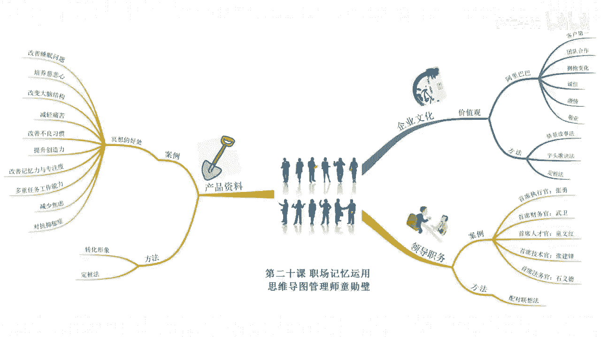

# 海马体记忆法：助你成为最强大脑 - P19：20 、【职场】成为职场记忆王，轻松升职加薪 - 清晖Amy - BV152tfe9Ev3

你好，我是记忆魔法师袁文魁，欢迎来到我的超强记忆力课程，让我们一起拥有超强记忆，创造学习奇迹，上一讲我讲到了记忆法在社交中的运用，如何将人脸和人名对上号，这一讲呢我将衍生讲到职场工作之中。

我经常会收到职场白领的留言，比如有人初入职场，要去面试一大堆企业文化和相关知识要背下来，头疼，有做了几年的行政工作，一直困扰于把同事张冠李戴这个部门继承，另外一个部门尴尬。

还有呢做销售工作的大量的公司产品资料，记不住，临时翻资料呢被客户怀疑是不专业，出单少，业绩低，危险要怎么办，有记忆法不怕，因为呢职场涉及到了不同的行业和不同的岗位，需要记的东西啊千差万别。

而我们的课程时间也有限，不可能做到面面俱到，那今天呢我就以企业文化，领导职务产品资料这三个为例，分享如何巧用记忆法，让你笑傲职场，首先来看一看企业文化的记忆。

我和最强大脑李威合作的书籍里就分享过，他所在的中广河，做了很多记忆大师代理学文化共识的漫画展板，李威通过记忆法帮助同事们把公司的使命愿景，价值观和行为规范更轻松的记忆，企业文化呢是企业的灵魂。

有些企业在招揽人才和考核员工时，会以此作为参考，比如马云的阿里巴巴集团，在企业文化里提出了六个价值观，分别是客户第一，团队合作，拥抱变化，诚信激情敬业，这六个词语呢可以用情境故事法来记忆。

先分享几个词语是怎么转换成形象的变化，我会想到变形金刚诚信，想到了陈晨的一封信，激情想到了激情欢呼热舞的画面，那情境故事呢是这样的，想想阿里巴巴的客户站在第一名的领奖台上，团队的几个人呢手拉着手。

然后一起喊加油，然后费力地抱起了一个变形金刚，捡起变形金刚脚下沉沉的信，打开信封呢，发现是巨额的奖金，他们都激情四射的欢呼热舞，然后呢都非常敬业的在电脑前投入到工作之中，我们还可以呢用刺头歌诀法来记忆。

我在挑取第一个字之后，进行了相应的组合，变成了成克庸鸡颈团谐音为乘客拥挤进团，想象一下，很多乘客呢，拥挤着要进入旅行团的这样一个画面，这里呢诚代表着诚信，客代表客户第一拥代表着拥抱变化，鸡代表着激情。

敬代表着敬业，团代表着团队合作，那如果要用定妆法来记，可不可以呢，当然也可以，那因为只有六个词语啊，所以用身体定妆法，物品定妆法，所谓定妆法都是不错的选择，那假设呢我就选择啊。

阿里巴巴价值观这几个字来定妆，R可以想到阿姨要记的信息是客户第一想象，一位阿姨啊，是阿里巴巴天猫的客户，双十一零点开抢时，成为第一个下单的客户，记住了客户，第一你可以先影响到鲤鱼，要记得是团队合作。

想象一下鲤鱼要跳龙门，很多条鲤鱼啊，团队合作一条跳起来以后，另外一条跳到他的身上弹起来，跳过了龙门，就可以由里想到的是团队合作，八八谐音为马云爸爸哈，要记忆呢拥抱变化。

想到马云爸爸拥抱一个巨大的变形金刚玩具价，可以想到呢价格标签对应的是诚信，想象在一封很诚的信里面啊，称了一下重量，然后贴上了价格标签值，讲到了值班，深更半夜还在办公室里面值班，很容易想到敬业观。

想到观众要记得是激情，想象了足球场踢进了一个球，观众呢非常激情的站起来欢呼热舞，有的呢还激起了琴，那这里呢为了避免啊激情会记错，所以呢还谐音想到了激情来强化它好了，现在呢由阿里巴巴价值观。

尝试回顾一下这六个核心价值观吧，如果阿里巴巴的记住了。

也尝试把你们公司的记住吧，我之前去一家公司内训，公司，连厕所里都贴的是企业文化，但是现场提问的时候，工作了十几年的老员工都记不住，那如果企业文化只是留在墙上，由于形式没有留在员工的心里面。

更没有落实为行动，可能还不如没有吧好了，假设你接受考核，已经成为阿里巴巴的一员，接下来你要接触到非常多新的同事，他们都来自不同的部门，有不同的职位，你也需要快速的将它们记住。

武汉大学文学院的副书记王怀民老师，刚去文学院报到时，跟着书记去各个办公室转了一圈，就将所有部门的所有老师的名字都对应，记住了之后，他看到就能够喊出来，这让他在空降文学院之后，很快就取得了大家的信任。

工作很快就进入了状态，那接下来我们就先来尝试挑战一下，将阿里巴巴，2018年在任的几位担任要职的人物记住吧。

他们分别是首席执行官张勇，首席财务官武卫，首席人才官佟文宏，首席技术官张建峰，首席法务官史翼德，在这里我们需要用到的是配对联想法，将名字分别与执行财务等这些词语进行配对，联想开始挑战吧，首席执行官张勇。

执行呢可以想到了执行就是笔直向前进的意思，张勇联想到张飞勇往直前，一直向前，在执行首席财务官武卫五位可以拆盒，想到武松手里拿着一卷卫生纸，在纸上呢，再算公司的账目，那算了整整一卷纸还没有算完。

首席人才官童文红，想象了一个五岁的儿童啊，在写文章，写成了网红，那真是一个人才，阿里巴巴的人才官将他挖了过来，首席技术官张建峰，张建锋呢可以想到了张飞踢毽子的时候啊，提到了马蜂窝。

那马蜂呢飞下来蛰到了正在写代码的技术人员，首席法务官史翼德，法务啊，就想到了合同，10亿德呢可以谐音为10亿的，想象一下马云签了一个价值10亿的合同，好了，来测试一下首席人才官是谁。

童文宏首席执行官是谁，张勇史翼德是什么职务，首席法务官五位是什么职务，首席财务官好，那接下来呢如果你要尝试记住公司某个同事啊，属于哪个部门，那就尝试用配对联想法试试吧，这样就不会张冠李戴了。

那如果你看到某人的长相，可以说出名字，而且熟悉他所在部门的工作环境，也可以直接想象这个人在那个部门工作的形象，比如张三是财务部的，想象张三在财务室按计算机的画面，或者呢你认识的某一个人，李四啊。

也是财务部的，就可以想象呢张三和李四在一起对账，这样呢也是配对联想法，接下来我们就要进入到企业产品。

知识记忆的部分了，一般情况下，这是销售干的活，但谁是销售，其实企业CEO是最大的销售员，企业的每一个员工都是销售，不论你是做什么岗位的，你的朋友听说你在这家公司可能都会问你，你们公司有什么产品呀。

这产品有什么功能呀，如果最基础的问题都答不上来，真的比较尴尬，我有一位朋友啊，在一家冥想类的app工作，很多人都没有听说过冥想，所以很多朋友就问他，什么是冥想呀，冥想有什么好处呀，怎么做冥想呀。

刚开始他也说不清楚，后来呢公司领导给了他一篇文章，让他背下来，叫做冥想的十大好处，他就求助我，怎么样可以更好的背熟，我们先来看一看这十大好处，那具体的解释的部分呢，我就把它省略掉，一改善睡眠和失眠问题。

二培养慈悲心，使人变得更加善良，更乐于助人，三改变大脑结构，训练鸣奖八周之后，与学习和记忆相关的海马区，灰质密度得到了增加，四减轻痛苦，五改善不良习惯，六提升创造力，七改善记忆力与专注度。

八提高多重任务工作能力，九减少焦虑，十对抗抑郁症，那因为涉及到的信息有十点，而且呢每一点都比较抽象，我会先尝试转换成具体形象，并优先选择定妆法，那我以数字计算法为例，用01~10的数字编码来进行记忆。

先来熟悉一下编码，零一的编码是小树，零呢代表着树下的花坛，一呢代表着树干，0202啊，通过谐音的方式填压两个铃铛的形象，零三呢是由三个角的凳子，零四是小汽车，因为有四个圆形的轮子，零五是手套哦。

五个圆形的手指，零六是手枪，因为手枪的形状像是六，零七是锄头，也是形状比较像零八溜冰鞋，因为它有八个圆形的轮子，零九是猫，都说猫有九条命，十是棒球，一是棒子，零四球好，接下来我们开始记忆。

我就举前面的五个为例吧，临沂小树，改善睡眠和失眠问题，想象在两棵树之间呢，你挂上了一个吊床，然后你躺在上面摇几下就瞬间入眠，睡得鼾声四起，0202，培养慈悲心，慈悲的想到寺庙里的和尚。

那和尚每天都在寺庙里面敲打着巨大的灵儿，来提醒大家时间，零三式三角凳改变大脑结构，想象一下三角凳呢扔出去砸到了坏人的头上，脑震荡以后呢，他的大脑结构就改变了，零四式小汽车，减轻痛苦，想象的路上出了车祸。

有人呢被撞倒在地，路人呢给他止痛药，来帮助他减轻痛苦，零五手套改善不良习惯，想象的一个小朋友啊，有一个不良习惯就是饭前不喜欢洗手，那于是呢妈妈就给她戴上手套来吃手抓饭好了，我就举这五个为例。

你可以尝试回忆一下，以后遇到类似的产品知识，获得了演讲里要记忆的大纲，都可以来尝试用各种记忆法把它搞定，我来总结一下今天的内容，我从企业文化，领导职务，产品资料三个方面分享了一些记忆的案例。

那记忆法在职场里的运用啊。

还有很广阔的探索空间，愿大家多多去尝试运用。

并且呢分享自己的心得，也欢迎大家和我交流，这是我们的最后一节课，但对你而言，这只是一个开始，真正去用出来记忆法才能变成你的能力，加油吧，今天的作业请尝试用我们今天分享的方法，把你们公司的企业文化记住吧。

也欢迎你在评论区里分享出来，今天的课程就到这里了，请在文稿里查看今天的练习，并且把你的想法在评论区里留言，和同学们一起切磋交流吧，也欢迎你把课程分享给你的朋友们，和他们一起拥有记忆魔法，成为最强大脑。

为大佬赋能，让生命绽放，我是记忆魔法师袁文魁。