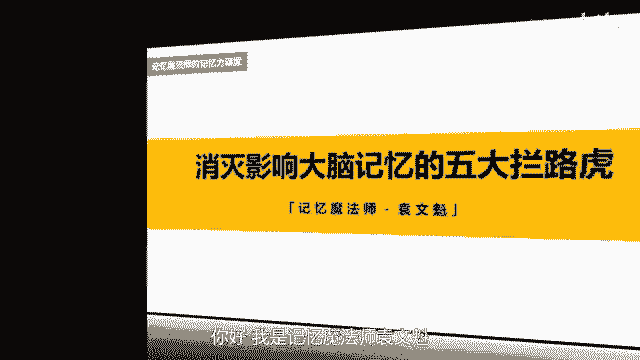
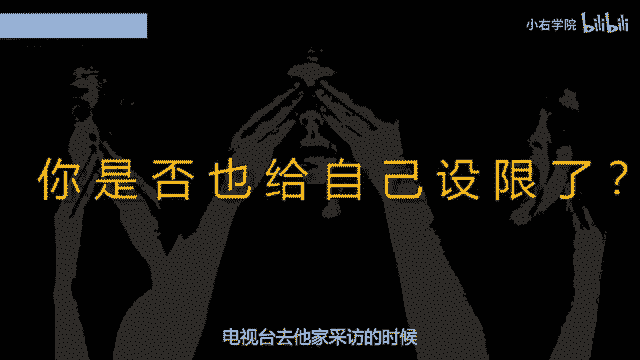
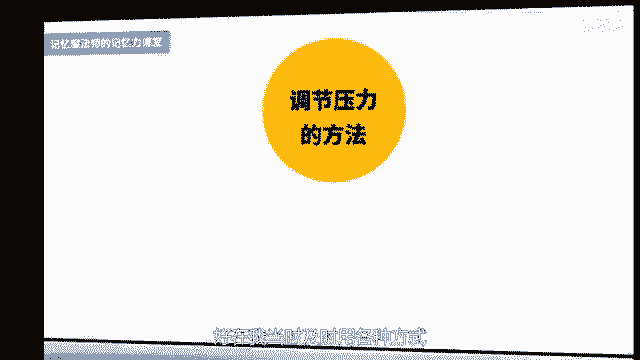
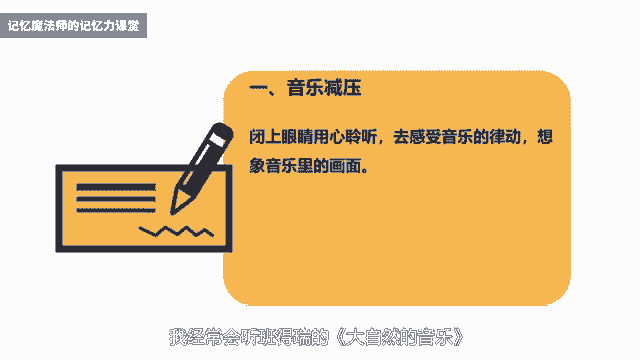
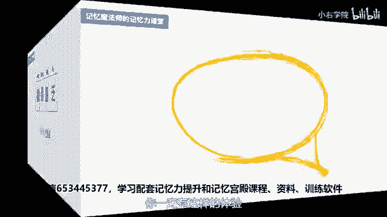
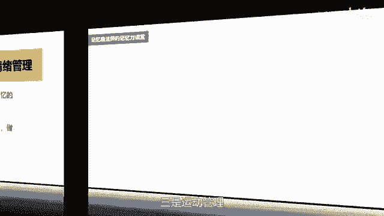
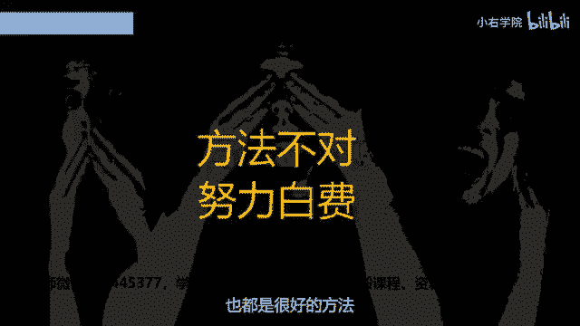

# 海马体记忆法：助你成为最强大脑 - P2：02 、【突破阻碍】消灭5大拦路虎，记忆效率翻倍 - 清晖Amy - BV152tfe9Ev3

你好，我是记忆魔法师袁文魁，欢迎来到我的超强记忆力课程，让我们一起拥有超强记忆，创造学习奇迹，今天是我们的第一堂课，在正式学习记忆法之前，我们先要突破阻碍好记忆的拦路虎，他们分别是自我设限，意愿不够。

压力过大，能量匮乏和缺少方法，拦路虎不除掉的话，记忆取经之路就很难走，我接下来会分享我的打虎经验，那第一大拦路虎呢就是自我设限，我们固有的观念会影响到我们对于记忆的态度，2009年。

王峰看到武汉大学记忆协会招生的时候，他很疑惑的问，记忆力不是天生的吗。

还可以后天训练出来，直到了他听完我的第一节课，将圆周率100位和36计倒背如流，他才相信记忆真的有方法，他在短短的一年多的时间，成为了世界记忆总冠军，电视台去他家采访的时候。

他的奶奶和高中的老师都没有觉得，他以前记忆力很好，他自己也说以前能够不记得就不记，因为真的很讨厌记忆，那如果王峰当初就固执的认为记忆力是天生的，从自我设限里走不出来，他也就不可能成为最强大佬了。

这样类似的自我设限，还包括年龄大了，训练记忆力也没什么用，手机百度这么快，训练记忆力还有必要吗，技法是骗人的玩意儿，根本就没有用，如果因此而限制了你自己，我们就会一直待在舒适区里，不愿意尝试新的，可能。

我们大脑的潜能也会因此而被埋没，另一种自我设限来自过去的经历，我有个学生小时候在背书时，妈妈经常数落他，你脑子怎么这么笨，背了这么多遍还没背下来，你记忆力真是太差了，他在背书的时候就会越来越紧张。

越来越记不住，慢慢也确认自己就是记忆力差，后来他一听说记忆就非常的恐惧，但是要学习考试，要升职加薪，记又绕不过去，他非常的痛苦，也不希望孩子经历他一样的痛苦，于是呢就来参加我的面授课程学习。

它不是一个个例，我接触到很多人把记忆力差当成标签，想要改变这样的错误认知，你可以这样来做，第一个呢是反复问自己，我的记忆力差是事实吗，我有没有记忆力表现挺好的时候，我在哪些领域记忆的效果还不错。

可以尝试把你记忆力好的表现写出来，比如你可能是一个球迷，对于足球比赛的球星如数家珍，这就足以证明我的记忆力差是不成立的，第二是学习记忆法之后，可以尝试写记忆成功日志，每天晚上呢把当天的事情回忆一遍。

把你成功记住的事情都写下来，同时也包括自己在记忆训练方面的进步，不断关注你的成功表现，你就会越来越确认你的记忆力真的好棒，第二代的路虎是意愿不够，我很喜欢一句话，你永远无法叫醒一个装睡的人。

同样你也永远很难记住你不愿记住的信息，比如你去参加一个聚会，现场有20位陌生的朋友会做自我介绍，如果你没有兴趣和他们成为朋友，或者呢他们以后也可能成为你的合作者，那么你也不会刻意的想要去记住他们的名字。

可能一转头就把他们忘得一干二净，强烈的意愿是主动记忆的前提，它可以让我们更加专注，尝试各种策略来达成记忆的目标，我曾经很讨厌英语单词，我甚至说我才不想背单词了，以后就找一份不需要英语的工作，在一年之后。

我学了记忆法，居然把四六级单词重新又拿出来背了一遍，我是怎样让自己的意愿更强的呢，一是要换一种方法来找到学习的乐趣，我当时学完记忆法后再背单词，我发现不再是单纯的死记硬背，而是变成了联想编故事的游戏。

单词在我脑子里都被玩坏了，让我呢也佩服自己的想象力和创造力了，关于英语单词的记忆法呢，我们在后面的课程里面会给大家揭晓，二是想象一个有美好前景的这样一个未来，因为我有周游世界的梦想，在每一次背单词之前。

想象自己在世界各地，非常自如地和外国人进行英语的交流，那这样呢就把背单词和自己想要的美好的未来，建立了一个联系，就增强了我们记忆的动力，三是设立一个自我激励机制，除了内在的成就感和愉悦感之外。

也可以通过外部的奖惩机制，比如我当时是和同学打赌，如果一周没有背完六级单词，就请他去吃一顿大餐，那当时呢差不多是我两个月的生活费啊，所以这个乘法鞭策了我去挑战成功，后来呢我参加世界脑力锦标赛。

每天要背几千个数字，我借鉴了游戏里面的积分和升级的方式，达到一定的级别就奖励自己看一部电影，但没有完成呢，就罚做俯卧撑，胡萝卜加大棒，让我的训练变得更加有乐趣了，第三大拦路虎是压力过大。

超负荷的压力是大脑系统的病毒，失控的压力会导致记忆能力，注意力和认知能力等下降，压力指数过大的人会比受到正常压力的人，认知能力低50%左右，如果压力过于严重或持续时间太长，可能会有毁灭性的伤害。

在高考前的两三个月，我当时每天都感觉很疲惫，全身倦怠无力，经常的晚上做噩梦，担心自己高考会落榜，好在了，我当时及时用各种方式来调节自己的压力。

才让高考顺利完成，考取了武汉大学，我分享几种我常用的方法，第一个呢是音乐解压，我经常会听班得瑞的大自然的音乐。

会闭上眼睛用心去聆听，去感受音乐的律动，想象音乐里的画面，那王峰呢在参加记忆比赛的时候，每一项比赛开始前，他都会塞上耳机，听一听高山流水等音乐，让自己呢全员的放松，以更好的去应对接下来的比赛。

第二个是身体放松，可以尝试躺下来，闭上眼睛做几次深呼吸之后，从头到脚依次绷紧身体的每一个部位，几秒钟的时间，然后再放松开来，比如说面部可以在绷紧时，将眼睛嘴巴都往鼻子靠拢，然后慢慢地舒展开来。

这个练习呢，可以在晚上和中午睡觉之前各做一次，当然也可以在自己觉得疲惫，想要放松的时候都可以随时去做，第三个是兴趣减压，做自己喜欢的事情，会让我们从压力中暂时离开。

如果有积极乐观的朋友陪伴你一起来做会更好，那我会用跑步爬山，打羽毛球，下象棋，摄影看电影等方式来减压，减压的方式因人而异，我相信呢你也会找到适合自己的方式，让自己可以轻松上阵，第四大拦路虎是能量匮乏。

一切的生命活动都需要能量，而大脑又是耗费能量最多的地方，高强度高难度的记忆活动更是如此，你一定有这样的体验。

当你忙碌了一天，感觉很疲惫，哈欠连天，情绪低落，给你一个字典，你就可以葛优躺，实此时让你去背100个英语单词，你肯定要崩溃掉，那怎么记都很难塞到你的脑袋里面去，其实我们身体啊这个能量就像电池一样。

从早到晚呢是逐步的耗尽的，有些能量黑洞会特别耗能量，比如身体上的疾病，会影响记忆力的疾病呢有高血压，糖尿病，脑外伤等等啊，包括了感冒啊，其实也会影响到我们的记忆力，从心理层面来说。

过分的焦虑紧张抑郁伤感，抱怨等情绪也降低了记忆力，另外经常熬夜，过度劳累，抽烟酗酒，服用，遇到棘手的困难和挑战，做一些违背内心的事情，都会让我们快速耗尽能量，那我们怎样来建立能量加油站。

管理好我们的能量呢，一是饮食管理，减少垃圾食品的摄入，比如油条烧烤，爆米花，辣条，咸菜，臭豆腐，皮蛋熏肉等等，多吃一些健脑益智的食物，比如豆类，鸡蛋坚果蔬菜，玉米芝麻等，另外重要的考试或者记忆活动之前。

不要吃的太饱，尽量呢清淡为主，避免消化时耗费大脑需要的氧气，二是情绪管理，当我情绪低落的时候，我会转移注意力去做一些其他的事情，比如说看喜剧电影，打打篮球，跟着音乐跳跳舞，甚至很简单的将双手举到头顶。

刻意地仰天大笑几声，这样的效果呢都非常好，三是运动管理。

我在高三备考时刚开始忽略了运动，在高考前两个月，我开始每天晨跑20分钟，在课间呢加入了蹲起伸展等肢体的运动，大的能量呢就更足了，我推荐四种比较常见的健脑运动，跳绳游泳，羽毛球和慢跑。

坚持运动会从事我们的大佬，第五大拦路虎呢是缺少方法，有句话说的很好，方法不对，努力白费，用死记硬背或者理解来记忆也都是很好的方法。

但是不能高效的解决所有的记忆问题，遇到没法理解的，抽象的，没有规律的大量的信息，比如生僻的古文，超长的单词，陌生的专业书籍，我们就会无所适从，缴械投降，这个时候就需要记忆法派上用场了。

最强大脑能够挑战复杂的记忆项目，都得益于记忆法，这些呢我在课程里面会详细的讲解，我们一起共同去期待吧，好了，我来总结一下，今天呢我分享了记忆路上的五大拦路虎，分别是自我设限，意愿不够，压力过大。

能量匮乏，缺少方法，我们可以联想唐僧师徒来帮助我们记忆，像孙悟空戴上了紧箍咒，所以呢会拉紧就代表了自我设限，那猪八戒呢老想着上火，就因为他意愿不够，沙和尚呢挑着所有的担子，所以压力是非常大的。

白龙马呢长途跋涉，肚子饿了，这就是能量匮乏，而唐僧的话遇到妖魔鬼怪，他就没办法了，只能喊他的徒弟哈，所以他是缺少方法的，想想唐僧师徒能否把这五大拦路虎把他记住呢，那这节课我还分享了一些打虎的经验。

有些方法请你去尝试一下哦，它可以帮助你打造更加强大的大脑系统，让我们可以更好地去掌握记忆的方法，今天的课程就到这里了，请在文稿里查看今天的练习，并且把你的想法在评论区里留言，和同学们一起切磋交流吧。

也欢迎你把课程分享给你的朋友们，和他们一起拥有记忆魔法，成为最强大脑，为大佬赋能，让生命绽放，我是记忆魔法师袁文魁，我们下一讲再见，现在开始把刷手机的时间用来改善记忆力，五天以后呢。

你会跪着感谢自己这个方法，你一旦熟练掌握以后，记忆的速度就会越来越快，学习以后呢，你可以挑战记忆一整本书籍，挑战记忆一整本英语单词书，没错，就是这么的神奇，当你能够快速的记忆一些复杂，无序的内容的时候。

无论是学习还是工作，甚至在生活当中，你都已经比别人快了很多步了，你相信吗，现在报名记忆训练营，零元即可学习，还有其他实用的记忆方法，赶紧扫描屏幕上的二维码或微信搜索，653445377。

653445377。