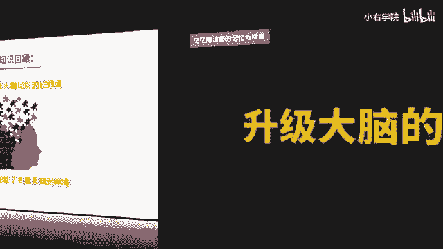
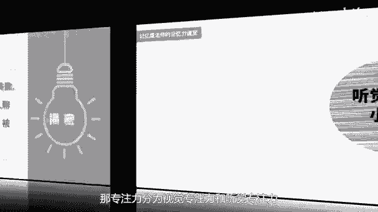
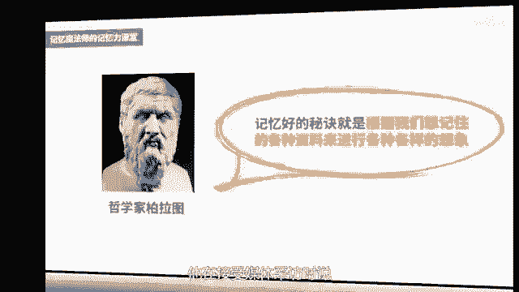
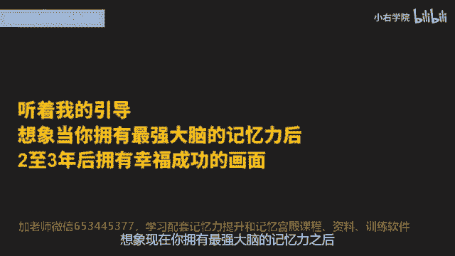
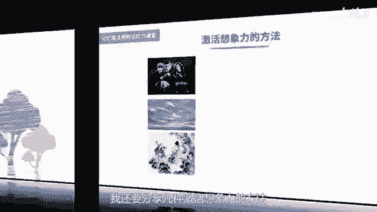

# 海马体记忆法：助你成为最强大脑 - P3：03 、【激发潜能】 3项智能训练法，升级大脑系统 - 清晖Amy - BV152tfe9Ev3

你好，我是记忆魔法师袁文魁，欢迎来到我的超强记忆力课程，让我们一起拥有超强记忆，创造学习奇迹，上一讲我分享了消灭大脑记忆拦路虎的秘诀，相当于是消除了大脑记忆系统的病毒。

那接下来我将要升级到了的系统，我从大脑智能训练系统里面挑取了三大智能，专注力，想象力和创造力，而这些都是和我们的记忆力息息相关，我们一起来看看如何在日常生活中来进行训练，首先呢来看看专注力训练。

试管婴儿之父爱德华兹认为，锻炼记忆力的良好方法是锻炼自己的专注力，最强大脑上的记忆选手都是非常专注的，无论是王峰挑战19。8秒记忆一副扑克牌。

还是圆梦挑战TFBOYS的歌曲，稍有留神，挑战便会失败，那专注力呢分为视觉专注力和听觉专注力。

我们先来做一个听觉专注力的小游戏，我会练一些词语，如果这个词语是水果类的，比如说苹果橘子，你就说一声yes好，现在请竖起你的耳朵，准备开始面包气球，菠萝瓶子，香水，菠菜蛋糕，柚子李白草莓，火龙玫瑰蜘蛛。

香蕉猕猴，榴莲好了，挑战结束，刚才呢一共出现了五个水果，分别是菠萝，柚子草莓香蕉榴莲，你有没有听到火龙猕猴的时候就鼓掌了，这是我故意给你的干扰，来考验你是否集中了注意力，那如果刚才这个挑战呢。

你已经过关了，我们就再来一个升级版的测试，我会读一篇小短文，你只能听一遍，要注意里面大脑的脑这样一个字，在我读完之后，你要说出一共出现了多少次脑子好，现在呢请竖起你的耳朵，预备开始，李兰青访谈录里说。

我们应学会全脑的运用和训练，提倡全脑开发，给学生提供丰富的环境刺激，发展语言的，数学的，音乐的，运动的，图像的逻辑和形象的思维，过去我们的教育大多注重于重复的训练，刻板的记忆和逻辑思维的培养。

忽略了对学生形象思维和情感能力的培养，而这些对学生今后的成功又是至关重要的，因此我们的教育要重视人脑的全面开发，在训练逻辑思维的同时，也要训练形象思维，使大脑的潜能得到充分利用，人脑的全面开发。

特别右脑开发就是形象思维的开发，创新思维的开发和长期记忆的开发，我觉得很值得我们研究，因此长期记忆可以提高我们的学习效率，好文章朗读完毕，你在里面听到了几个老字呢，你有没有把专注力放在内容本身。

而忽略了去找到这个老的个数呢，现在呢我就要公布答案了，一共是六个，如果你的答案不对，那就请回头再去听一听，或者看看文稿来对照一下吧，上面这两个听觉专注力的练习，大家可以来找小伙伴们一起来训练。

互相呢出考题来考验对方，你的听觉专注力呢就会越来越好。

无论是上课的时候听讲，还是让我们工作在职场里面听一些会议，听报告，我们的听觉专注力都非常非常的重要，除了听觉专注力，视觉专注力也很重要，我们可以在手机上下载一个舒尔特表格，这样一个app来进行训练。

以5×5的数字表格为例，里面的是1~25随机打乱的，你需要呢从1~25，按顺序来依次的点击每一个数字，只有你的专注力非常的集中，才可能在最短的时间内完成，可以的，每天的抽空练习十次左右。

那很厉害的选手哈，都可以在几秒钟就可以把25个数字找到，那另外呢有些人呢专注力的持续时间不够长，我也分享一个小技巧，比如平时你只能专注10分钟，那就设置一个12分钟的倒计时，完成了就给自己一点奖励。

如果呢是12分钟有好几次就做到了，就可以增加到15分钟，再慢慢的到18分钟，25分钟，30分钟，逐步的提升专注的时长，我有个学生呢叫杜兴莫哈，他呢有很多年都已经没有学习了。

所以呢让他坐在凳子上面坐5分钟，他都会觉得屁股痛，但是通过这样的方式的话呢，他后来居然坐下来把一整本道德经5000字啊，做到倒背如流，这个就是刻意练习的结果，那在后面的课程里呢。

我还将分享大家一个专注力的高级训练技巧，这个也是我们训练最强大脑时候的一，种秘密武器，接下来我们将看看想象力的训练，想象是人在已有形象的基础上，在头脑中创造出新形象的能力，哲学家柏拉图说过。

记忆好的秘诀就是根据我们想记住的各种资料，来进行各种各样的想象，最强大脑上我的学生饶舜涵，九岁的时候，挑战记录了100多件玩具的价格，他在接受媒体采访时说。

主要是靠想象记忆，比如看到一四想象成钥匙，它的大小形状颜色动态都有了，这样自己的大脑中就会形成一幅幅图像，自然会记得很清楚，那不仅他如此，所有的最强大脑记忆选手都依赖于想象力，我们每个人都拥有想象力。

你先跟着我一起来做一个练习，现在呢请你找一个安静的环境，坐在椅子上或者沙发上也可以呢，躺下来闭上眼睛，先做几次深呼吸，让自己的心慢慢的静下来，当你准备好之后，你将听着我的引导，想象呢。

现在你拥有最强大脑的记忆力。

之后，两到3年后拥有幸福成功的画面，想象一下现在你是一个学生，想象你在上课的时候，就能够将老师授课的内容牢记于心，在考试的时候非常自如地将记的内容填写出来，你学习各种知识和技能都是轻而易举。

你在同学心中就是行走的电脑，对于百科知识信手拈来，现在想象一下，你考取了你心仪的学校，想象那个时候你在哪里，你的心情如何，你未来的学习生活是怎样的，请将所有这些都用你的想象力呈现出来，越真实越好。

假设你是职场精英，想象你可以轻松地记住所有新的知识，始终保持专业优势，你可以轻松记得老板交代的事情，客户的重要资料，行业的各种资讯，你随时随地的调取你的记忆，拥有很好的人缘，工作生活都非常的顺心如意。

此刻想象一下你在事业上取得了某项成就，想象颁奖典礼的场景，当时你的心情如何，你的同事和朋友怎样看待你，把所有这些都身临其境的想象出来，并且将那种美好的感觉铭记于心，这个想象的练习呢。

在我以前参加世界老猎锦标赛的时候，每天都会练习，都会去想象我在获得记忆大师称号之后，所有的一些画面，同时呢我也会在我的面授课程里面呢，经常带着学生去做，不仅可以训练我们的想象力。

当我们长时间去进行这样的想象的时候，还可以帮助我们梦想成真，科学家曾经做过一个实验，让一些运动员躺在床上，用仪器来监控他的身体指标，当运动员在脑海中想象在百米跑步时，最终呈现的指标和真实跑步是一样的。

所以很多运动员会通过想象的方式来练习投篮，跨栏，跳水等等，而我也会在考驾照的时候，在入考之前提前踩点之后，我就会在考前多次去想象整个过程在哪里，要完成哪些操作步骤，最终在考试的时候就轻车熟路。

获得了满分，除此之外，我还要分享几种激活想象力的方法。

一是要多看一些想象力比较丰富的影视作品，或者动画片，比如哈利波特，阿凡达猫和老鼠等等，二是处处留心观察天上的云彩，墙上的斑点，地上的纹路，看看它像什么，你会发现非常的有趣，三是看一些小说或者诗歌的时候。

在脑海中自己想象画面，再对照相关的影视或者插图来看看呢，你的想象和他的想象有什么不一样，接下来看看创造力的训练，我发现技艺术就是创造的艺术，不论是编故事，编歌诀还是绘图联想。

各种记忆方法都依赖于灵活的头脑，去创造本来没有的情境和画面，去帮助我们达到最佳记忆效果，那我们如何提升创造力呢，可以从一个简单的创意力游戏开始，可以在纸上画一个一元硬币大小的这个圆。

在里面呢写下一个名词，比如说手机，然后呢在圆外面呢，可以呢向四面八方画很多条直线，在直线的末端，可以把手机想到的一些特殊的功能，把它全部写下来，让自己的脑洞尽可能的打开。

我在课堂上呢收到了很多同学的奇思妙想，比如说可以呢把它当做刀来拍黄瓜，轻薄的手机呢可以了，打水漂，厚的手机呢可以用来垫桌子，脚泡面的时候可以用来压盖子，用很多的手机呢可以做拼贴画。

发热的手机可以用来做暖宝宝，物理实验的时候可以做砝码，学数学的时候呢可以来画直线，写书法的时候可以当书证，打仗的时候呢可以作为炸弹，只要你想这个用途可以是无穷无尽的，你也可以和你的朋友一起来比赛。

看看呢，在3分钟时间内谁能够想到又多又好，那很多朋友一起来联机思考的话呢，我们创造力就会更容易被激发出来，除了写用途之外呢，还可以做一个练习，同样是手机随机和任何一个物品进行联想。

看是否可以借鉴这个物品的功能或者特点，来帮助手机拥有一项新的功能，比如手机和空调，是否将手机变成随身携带的空调，一按键就可以了，从排气孔里面出来冷气，比如手机和变色龙。

是否手机也可以根据环境来变不同的颜色，比如手机和枕头是否可以将手机变成充气呢，在需要的时候变成枕头来睡觉，通过这个练习想到很多新的功能，有些可能非常好笑，获得了不太可能实现，但是没有关系，创造的第一步。

就是以梦想家的身份去大胆的构想，先想出足够多的想法，再去以科学家的身份去筛选，最终把它变成现实，这两个例子非常简单，很容易就可以操作，你可以拿不同的东西来做练习，让自己的发散思维和你的创造力变得更强。

未来这个社会记忆力可能只是我们的基础，而想要和人工智能进行竞争的话呢，我们只有创造力变得越来越强，所以呢我在我的课程里面呢，也会去给大家更多的创造力的练习，那如果想进一步的提升创造力的话。

除了用一些技巧以外，更重要的是拥有一种生活方式，要大胆的去尝试一些新的体验，去发现平凡生活中的乐趣，我在2017年和2018年，都在挑战100项新体验，去做一些过去没有做过的事情，比如说学插花。

学正念冥想，走玻璃栈道，看飞行表演，玩飞碟杯，玩塔罗牌等等，那真实的体验呢也成为我记忆力的不竭的源泉，在我写作还有讲课的时候，都可以更好的去激发出我的灵感和想法，所以也邀请你一起来尝试一下吧。

好了我来总结一下，今天呢我主要分享了专注力，想象力和创造力的训练方法，可以通过练词语和文章来训练我们的听觉，专注力，可以通过舒尔特表来训练视觉专注力，另外呢我们的想象力可以通过想象未来。

多看想象力丰富的电影，多看一些诗词文章，想象画面等方式来进行训练，创造力呢我以手机为例，分享了两个比较简单的技巧，来帮助我们激发出手机的更多的功能，那请你呢尝试将这些方法训练起来。

下一讲我们将会进入到记忆法的学习，你会在记忆训练中不断的去升级这三项技能，让自己变得更加聪明，请你尝试将这些方法练起来哦，下一讲我们会进入到记忆法的学习，你将会在记忆训练中不断的去练习和升级。

这三项大佬的智能，让自己变得更加聪明，今天的课程就到这里了，请在文稿里查看今天的练习，并且把你的想法在评论区里留言，和同学们一起切磋交流吧，也欢迎你把课程分享给你的朋友们，和他们一起拥有记忆魔法。

成为最强大脑，为大佬赋能，让生命绽放，我是记忆魔法师袁文魁，我们下一讲再见，现在开始把刷手机的时间用来改善记忆力，五天以后呢，你会跪着感谢自己这个方法，你一旦熟练掌握以后，记忆的速度就会越来越快。

学习以后呢，你可以挑战记忆一整本书籍，挑战记忆一整本英语单词书，没错，就是这么的神奇，当你能够快速的记忆一些复杂，无序的内容的时候，无论是学习还是工作，甚至在生活当中，你都已经比别人快了很多步了。

你相信吗，现在报名记忆训练营，零元即可学习，还有其他实用的记忆方法，赶紧扫描屏幕上的二维码或微信搜索，653445377，653445377。

