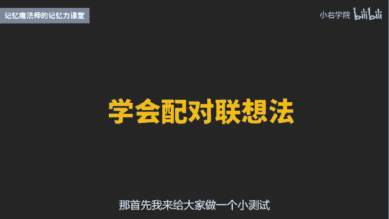
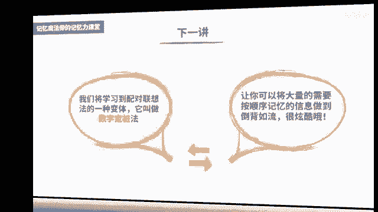

# 海马体记忆法：助你成为最强大脑 - P5：05 、【配对联想】秒记知识竞赛题的绝招 - 清晖Amy - BV152tfe9Ev3

你好，我是记忆魔法师袁文魁，欢迎来到我的超强记忆力课程，让我们一起拥有超强记忆，创造学习奇迹，上一讲我分享了形象记忆法。

具体的分享了新象力两大训练，抽象转倾向的五大法则，谐音增减，倒字拆盒相关和综合，那这些呢我们在今天的课程里，还将继续的去练习它，今天我们将学到一种新的方法，叫做配对联想法。

那首先呢我来给大家做一个小测试。

等会儿呢我会练出五组词语，每组呢有两个毫无相关的词语组成，比如说坦克橘子，那你听完一遍以后呢，当我说出这两个词语中的其中一个，你要说出另外一个是什么，好脑细胞准备开始，第一组火车天空，第二组吉他柳树。

第三组铅笔石头，第四组咖啡秦始皇，第五组手机纪念碑好，现在已经结束，请问一下柳树对应的是什么，铅笔对应的又是什么，咖啡对应的是什么，纪念碑对应的是什么，天空对应的是什么，刚才呢，你在脑海中。

是否能够把对应的这个词语回忆起来呢，如果呢你只是死记硬背的话呢，啊即使你现在能够回忆起来，可能过一会儿很快就容易遗忘，有一些人呢在听到这些交替出现的这样，一些词语的时候啊。

会不自觉的将这两个词语啊联想起来，构建出一个有意义的画面，这就是所谓的联想，比如说咖啡和秦始皇，很容易就想到了，秦始皇正在喝咖啡的这样一个画面，通过联想呢将两个毫无关联的东西进行配对。

由其中一个想到另外一个，这种方法就叫配对联想法，在我们学习和工作之中，能够用到配置联想法的场景很多，比如说作家对应的作品，国家对应的首都，省份对应的简称，古人啊，对应的别称，领导对应的职务。

朋友对应的电话号码，人名的对应的面孔，英语单词对应的汉语意思等等，所以呢当我们学会了配对联想法以后，我们就可以了，用方法将两个信息建立更紧密的联系，从此就不会再乱点鸳鸯谱，经常张冠李戴了。

接下来呢我们就一起来体验一下，我依然会练出五组词语。

但是呢我会告诉你该如何去配对联想，看看呢你是否可以比刚才记得更多，保持的时间更久好，第一组呢是毛巾和注射器，想象一下把毛巾呢揉成一团啊，像一个屁股一样，然后用注射器一针呢扎进了毛巾里面。

然后往里面去注射一个红色的液体，第二组呢是飞机马桶，想象一下一个遥控飞机啊，在家里面飞，突然失控了，飞进了马桶里，砰的一声爆炸了，马桶里的尿液就四处飞溅，臭味熏天，第三组棒棒糖足球，想象一下。

你把棒棒糖的棍子插进了足球的气孔里面，然后气孔里面喷出来很强烈的气流，砰的一声，把棒棒糖就射飞了出去，第四组粉笔钢琴，想象一下钢琴的琴键上面立着很多支的粉笔，粉笔呢此起彼伏地按下的琴键。

弹奏出动听的歌曲，第五组是婴儿鲤鱼，想象一下，一个婴儿呢骑在一只金色的大鲤鱼身上，婴儿哇哇大哭，发出号令，鲤鱼呢就腾空而起，跃过了龙门，好了，这五组已经念完了，挑战要开始了，我会给你两秒钟时间来思考。

当你听到了之后，马上在心中想到具体的图像，或者用嘴巴说出来对应的这个词语是什么，请问一下足球对应的是什么，好棒棒糖注射器对应的是什么毛巾，飞机对应的是什么，马桶粉笔对应的是什么钢琴，鲤鱼对应的是什么。

婴儿好的，如果你能够比上次做的更好的话呢，这些都是配对联想法的功劳，那配置你想要怎样才可以更好呢，我为大家分享几个关键的法则，第一个要有具体的形象，脑海中呈现出星象，这是关键中的关键。

联想的不是我们语文里面的造句啊，不是用左脑来记住我所说的这样一些句子，而是用右脑去呈现出描述的画面，这样我们就可以自然地去记住它，二是要相对独特，在婴儿和鲤鱼进行配对的时候，为什么婴儿要哇哇大哭。

发出号令，这是因为这是婴儿的特点，为什么鲤鱼要跃过龙门，因为这是我们知道的一个典故，另外粉笔在弹钢琴，这种拟人化的夸张的技巧，也可以让人感觉耳目一新，非常的独特，三呢是要彼此接触，并且有动态。

如果只是想象毛巾旁边有一个注射器，飞机上卫生间里面有个马桶，这些呢是比较容易遗忘的，通过动作来呈现出效果会更好，如果只是想象毛巾旁边有一个注射器，飞机上面呢有马桶，这些都比较容易忘记。

通过动作来呈现的话，效果会更好，那呈现动态的方式，一个是主动出击法，就是用它本身的这样一些特征来发生动作，比如说注射器就是用来扎针注射，另外也可以借用其他的类似的物品，他的动作叫做令显神通法。

比如说粉笔啊，像手指头在弹钢琴好，第四个就是要融入多种感官，不仅可以看到，还可以借助听觉，嗅觉触觉，味觉等多种感官，包括加入到自身的情感，好像飞机和马桶这个砰的一声啊，这个就是听觉，那尿液臭味熏天。

这个是我们的嗅觉，经历了这些以后啊，你感觉很恶心，那这些呢是我们的感觉，这些都可以让我们的印象更加的深刻，好了，接下来我们就要学以致用，而且难度也要升级了，现在呢我想象你带着你的全家去东南亚旅游。

要把一带一路上的东盟十国全由个变，那他是哪四个国家呢，是老挝，马来西亚，新加坡，菲律宾，越南，泰国，柬埔寨，印度尼西亚，文莱，缅甸，你走马观花，旅行结束之后，家里人呢却老是张冠李戴。

把老挝玩的勤俭说成了缅甸的，把马来西亚的首都说成是新加坡的，这要是回去和朋友们炫耀，岂不是会闹笑话呀，别急，我们用配对联想法来一起记住吧，那国家的名字呢如果比较熟悉的话呢，可以挑取里面的关键字词。

或者想到这个国家代表性的建筑或者人物等等，比如说我刚去过柬埔寨，那里面代表性的建筑就是吴哥窟，那如果不太熟悉的话就可以了，使用抽象转形象的法则，携子猜观众，我挑取五个来分享一下，你可以结合文稿来听一听。

尝试把它记下来，老挝的首都是万象，老挝呢可以谐音为老窝哈，想象成老鹰的窝里面呢居然住着有1万头大象，这外将奔腾起来，把窝啊都给踏平了，柬埔寨的首都呢是金边，柬埔寨可以谐音为简朴的寨子。

想象一下一个简朴的寨子居然都镶着金边，那真是太简朴了，这是真简朴还是假简朴呀，菲律宾的首都是马尼拉，菲律宾很容易想到菲佣啊，玛尼拉呢谐音为骂你了，想象一下你欺负了一个菲佣哈，然后菲佣呢骂你了。

缅甸的首都是内比都，缅甸呢谐音为缅甸，可以想到了兰州拉面的这样一个店子，灭队里面有一个史努比啊，然后在嘟的嘴巴嘟嘟嘟啊这样一个喇叭声音啊，所以是内比都缅甸印度尼下的首都是雅加达，印度尼西亚的简称。

印尼想到了印章的时候，这样一个印尼，那雅加达呢雅我会想到了智慧女神雅典娜，加呢啊，加减乘除这个加哈答呢是想到马达雷达哈好，所以我在这地方想到的是智慧女神雅典娜，给印尼加上了一个马达好，然后嘟嘟嘟嘟啊。

印章的时候呢效率就快了很多，雅加达的可以了，由雅想到了智慧女神雅典娜，加是曾嘉的嘉达呢，想到了马达，我就可以把它一起想到了智慧女神雅典娜呢，给印尼加上了一个马达，它就可以自动来印章，啊哒哒哒哒。

速度非常快，好了，我的讲解完毕了，现在呢想象一下你回国了，其他的亲戚问起一些问题，请你自信的告诉他们答案吧，菲律宾的首都在哪儿，雅加达是哪个国家的，缅甸的首都又是哪儿，如果你都能对答如流的话。

那么恭喜你，你已经通过配对联想法来记忆成对的信息，以后出国旅行的时候，再也不会张冠李戴闹出笑话了，好了你都能够对答如流吗，那答案分别是马尼拉，印度尼西亚，还有类比都如果你都能答上来的话，恭喜你。

已经学会如何通过配对联想法，来记忆成对的信息，那以后出国旅行就再也不会张冠李戴，闹出笑话了，如果你还不太熟练的话呢，我们可以再回听一遍，或者看看文稿，刚才呢我们已经行了万里路，跑遍了东盟十国。

那接下来我们就来读万卷书，要读就读经典，我们就读读中国的十大名著吧，但是问题又来了，这些名著的作者老是记不住，老是把张三的作品说成李四的，如果考试的时候呢答不上来，还可以把卷子藏起来。

但在公众场合犯了一些常识的错误，这就比较丢面子了啊，比如说有一个非常知名的歌星，他听到一首满江红，问别人这个词是谁写的，对方回答说是岳飞，那这个歌星非常兴奋的问，那我可以请岳飞帮我写歌吗。

好这样尴尬无比的瞬间，你也不想要拥有吧，我们就一起来积累一些文化常识吧，关键时刻还可以秀秀我们的文化底蕴好，那这十大名著是哪些作品，作者又分别是谁呢，好他们分别是红楼梦，作者是曹雪芹。

水浒传的作者是施耐庵，三国演义的作者是罗贯中，西游记的作者吴承恩，镜花原作者李汝珍，儒林外史的作者吴敬梓，封神演义的作者许仲林，聊斋志异的作者蒲松龄，东周列国志的作者冯梦龙。

那有些作品大家可能非常熟悉哈，比如说前面的四大名著，还有呢聊斋志异的作者蒲松龄，我就以五部，大家相对来说比较陌生的来举例说明一下，镜花园的作者是李汝珍，那李汝珍呢我会想到李时珍哈。

这个乳啊是三点水加一个铝，所以我想到女扮男装，想象一下，李时珍女扮男装，来到了一个呢装满了镜子的这个花园里面，来打扮自己啊，所以是镜花园，儒林外史的作者是吴静子，好儒林呢可以想到了很多古代的儒生哈。

在树林里面他们呢想要打扮自己，但是呢无禁止就是没有镜子啊，好好另外一种想法呢，可以想到儒生呢在树林里面想写字哈，然后无禁止，可以想到吾想到吴京晋呢，想到很尊敬的样子，就是在鞠躬。

然后子呢想到一张写字的纸啊，想到了吴京很尊敬的鞠躬献上了一张纸，封神演义的作者是许仲林，那许仲林呢，我想到了我小时候看的一个电视剧哈，叫新白娘子传奇里面的许仙的儿子叫许仕林，那他正好呢是高中的状元。

所以想到的是许仲林，据说他是天上的文曲星下凡哈，所以他也就是神啊，就想到了封神演义，李都想到了李逵哈，宝翔到宝贝家里，想到受到嘉奖，想到李逵强大的宝贝呢受到了嘉奖，下一个东周列国志，作者是冯梦龙。

我想到了相声演员冯巩，梦见自己呢骑着一条龙，在朝向东方去周游列国啊，然后每天还要写下旅游的日志，东周列国志，好了，听完刚才的讲解，再结合文稿复习一遍，接下来我们就一起来挑战一下吧，封神演义的作者是谁。

镜花园的作者是谁，好大家呢可以通过文稿来核对一下答案，那听完我的讲解，你能把这些记住吗，可能对于作家作品哈还会有一点点难度哈，因为名字你不熟悉，作家的作品，你可能也不太熟悉，好，你可能没有看过哈。

新白娘子传奇，或者也没有听说过冯巩，那我的联想呢不一定适合所有的人，我的知识储备和你的可能是完全不一样的，所以呢你完全可以了，结合你自己熟悉的人事物啊来进行联想，营养是非常私人化的啊。

那我的示范呢只是帮助你去更好的理解，这样一种方法该怎么去运用，最后我来总结一下配对联想法，国家和首都也好，作家和作品也好，都涉及到抽象词汇之间的联想，提前将抽象词汇通过鞋子拆，观众来转化成具体的形象。

再通过故事或者场景将它们之间进行配对，联想在联想的时候呢要注意有形象，相对独特，要有动态，可以的，通过主动出击也可以了，练显神通，并且呢要融入不同的感官，这样呢我们联想的时候印象会更加的深刻。

那学完这种方法以后呢，也希望你能够大量去使用这样一种方法，你的记忆力会在练习过程中变得越来越强大。

今天的作业请尝试用配对联想法，及以下五个国家的首都，并且将你的想法在评论里分享出来，一葡萄牙首都里斯本，二波兰的首都华沙，三埃及首都是开罗，四刚果金的首都金沙萨，五加拿大的首都渥太华。

今天的课程就到这里了，请在文稿里查看今天的练习，并且把你的想法在评论区里留言，和同学们一起切磋交流吧，也欢迎你把课程分享给你的朋友们，和他们一起拥有记忆魔法，成为最强大脑，为大佬赋能，让生命绽放。

我是记忆魔法师袁文魁。