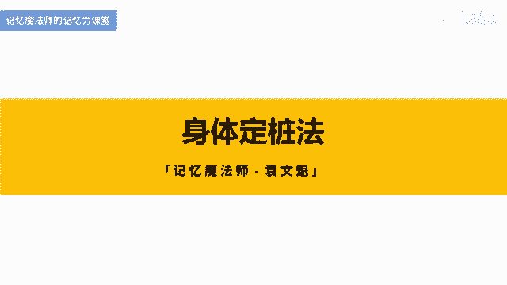
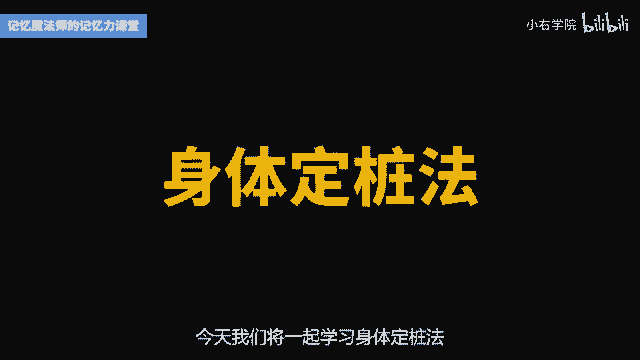
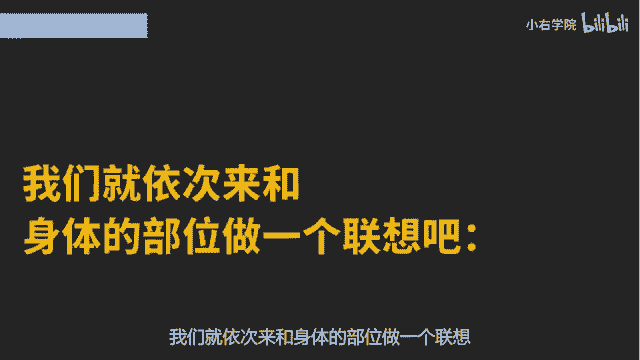
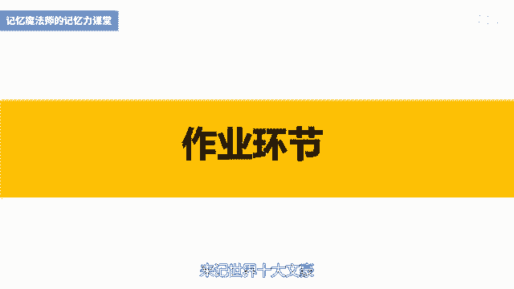

# 海马体记忆法：助你成为最强大脑 - P7：07 、【身体定桩】 用身体部位记系列信息 - 清晖Amy - BV152tfe9Ev3

你好，我是记忆魔法师袁文魁，欢迎来到我的超强记忆力课程，让我们一起拥有超强记忆，创造学习奇迹。

上一讲我分享了数字定桩法，运用形象的数字编码作为桩子挑战，记忆了36计结婚周年的命名等信息，今天我们将一起学习身体定桩法。

只要是熟悉的，有顺序的，有特征的一系列形象，都可以作为庄子，我们人类的身体部位，当然符合这些特征，将要记忆的信息，分别和我们的身体的部位来进行联想，就是身体定桩法，那我们的身体定妆它随身携带，简单有效。

可以用来记忆12点以内的信息，特别是需要按照顺序来记忆的，比如说12星座，12生肖，十大元帅，八项规定等等，对于一些选项比较多的多选题，以及呢问答题也是非常好用的，现在呢请你跟我一起来挑战，我只说一遍。

请你在身体上面从上到下找到12个部位，当我说到某一个部位的时候呢，你就把注意力放在这个部位上，或者用手摸一下它，那感觉呢就像全身扫描一样，这12个部位依次是头发，眼睛鼻子嘴巴脖子胸部。

腹部屁股膝盖小腿脚面脚底好，身体扫描完毕，现在呢请自己尝试回忆一遍，如果你刚才用心在听，你一定可以全部都想起来，因为我们非常的熟悉，而且是按照顺序来呈现的，那你也可以呢倒背如流，从脚底收到我们的头发。

接下来这些身体的部位，就相当于是一个一个的储物柜，我们要把记忆的信息，依次存放在每一个柜子里面，用联想作为锁，将它们锁起来保存，我们先用这些部位来挑战，记住24个字，这24个字呢在大街小巷都可以看到。

几年前我在一家餐厅吃饭，听到收银员在聊天，说，今天呢巡视组又来检查了，我又没有背出来，被抓去学习了半天，我妹妹呢是小学的体育老师，她有一段时间呢每天进校门都必须要背诵过关，那到底是哪24个字这么重要呢。

这24个字由12个词汇组成，爱国敬业，诚信友善，核心价值观是2013年底提出来的，这12个词语的话，大家都比较熟悉，相对而言呢比较抽象，但是呢如果要按照顺序来把它背出来的话，是比较容易遗忘的。

我们就依次来和身体的部位做一个联想吧。

首先呢想象我们的头发，它对应的是富强由富强，我想到了非常富有的啊，光头强前任光头强呢他很有钱，用金子啊，买了一个安全帽，然后戴在了我的头发上面，眼睛对应的是明主，那明主谐音为明珠，想象我眼睛呢闪闪发亮。

冒着金光，就像一颗明珠一样，鼻子对应着文明，那文明的文我想到了用鼻子哈去纹的这个纹，那也也可以想到了这个名哈，可以想到了喝茶的这个茶啊，有叫名茶，所以想象一下用鼻子在闻茗茶的香味。

接下来嘴巴呢它对应的是和谐，和谐呢谐影响到了河蟹，河里的螃蟹，小鸭嘴里面叼着一只大河蟹哈，正在呢吸河蟹的蟹黄，脖子对应的是自由自由，想到了美国的自由女神像，自由女神像呢手拿着火炬伸向你的脖子。

把你的脖子给烫伤了，胸部对应的是平等，影响到了我们男性哈，那胸部呢是平的，而且两边是对称的，没有高低之分，所以非常的平等，好了，我们先来复习一下，前面的六个头发对应的是什么，富强眼睛对应的是什么。

文明嘴巴对应的是什么呀，和谐脖子对应的是什么，自由胸部呢平等，OK我们继续来挑战，好接下来呢是腹部，腹部对应的是公正，那我有宰相，肚里能撑船，就想到了在腹部里面有一个包公哈，铁面无私拍下了惊堂木。

正在公正执法，接下来屁股对应的是法制，有法字，很容易想到了法官，想象在法庭里面，你私自离开座位，破坏了法庭的严肃性，那法官都拿着锤子啊，锤到你的屁股上面，这样治理好痛呀，膝盖对应着爱国爱国。

就想到了国旗，你膝盖落地就跪在了地上，向国旗叩拜，表现你特别的爱国，小腿对应的敬业，想象自己呢是站岗的保安，小腿呢贴着一张敬业符，站到小腿抽筋了，还一动不动，非常的敬业，脚面对应着诚信诚啊。

我想到了李嘉诚，想象一下你的脚面上面溅上了很多篱笆，那李嘉诚呢拿着一封信来帮你的，把它给擦干净了，然后呢，你承诺要还他一沓信，你说到做到，你也非常的诚信，脚底对应着友善，友善可以谐音为友善。

就是有一条鳝鱼，想象脚底下踩到了一条鳝鱼，你滑倒在地，那朋友们呢非常的善良哈，把你扶了起来，好我已经讲完了，我们一起来复习一下，后面的六个腹部对应的是什么，好对公正屁股对应的是什么。

法治膝盖对应的是什么，爱国小腿对应的是什么，敬业脚面对应的是什么诚信，那脚底对应的是什么，友善好的非常好，那么现在呢请你暂停一下，在脑海中再复习两遍，然后尝试一下脱口而出吧，以后呢参加知识竞赛。

政治考试，或者呢是党校学习，你都可以把这24个字的，平时聊天要是不经意间聊起来，你能够脱口而出，也是很有面子的，你再分享一下怎么用身体定妆法来记住，他们，就会给你大大的点赞，不信你试试看。

我在分享另外一个案例，我在10年前呢有一段故事，我当时刚刚参加完记忆培训班，经常呢跑到宿舍楼顶上去练习，休息时就安静地眺望远方，有一天我耳边传来了大声读书的声音，人际关系的核心是人，人际关系的核心是人。

人际关系的核心是人，他像复读机一样的独特，过了十几分钟，他还是反复练到的人际关系，我就听不下去了，禁不住就走了过去，我问同学，你每道题都要背这么多遍吗，都快20分钟了，他回答说是呀，我是学理科的。

这文科的知识不好背呀，每道题都要读20分钟，我继续问，那你背完明天还记得吗，他说不记得，我当时呢就请他把复习资料给我看看，是大学生思想道德修养与法律基础，那道题目只有六个知识点。

我现场教他在身体上找了六个部位，2分钟就让他记住了，他禁不住了惊叹记忆法的神奇，这道题呢我简单分享一下，讲的是人际关系的特点，一共有六个点，分别是人际关系的核心是人，人际关系是一个多层次的复杂结构。

人际关系是客观的，是由社会交往形成的，人际交往是一个纵横交错的网状结构，人际关系的本质体现在与人的思想品格相联系，人际关系在人际交往中还要不断发展与变化好，这六个点的话呢，相对来说还是有一点点抽象啊。

面对这样相对长的简答题，我们要学会了找到每一点里面的关键词，比如第一点呢是核心，我们可以想到了一个核桃雕刻的爱心和头发，来联想的时候，可以想到这个爱心的话呢，就憋在我们的头发上面来做发饰，第二点。

人际关系是一个多层次的复杂结构，关键词是结构和眼睛进行联想的话，可以在眼前浮现出一个眼睛的结构解剖图，我们在学习生物的时候，可能会看到第三点，人际关系是客观的，是由社会交往形成的，那关键词呢有客观。

社会交往，客观呢我们可以想到了古代客栈里面的客观，想象一下呢，用鼻子去闻我们异性客观身上的味道，那如果好闻的话呢，我们才握手和他进行交往好了，这道题呢我们就讲这么多以后呢，面对简答题要使用定桩法。

就可以使用这种方式，先在理解的基础上提炼关键词，再把关键词转化成具体的形象，依次和身体的部位来进行联想，最后根据记住的形象多次复习巩固之后，来尝试还原出原文的内容，这个呢就是身体精装法，简单呢却好用。

你可能会觉得身体部位太少，我刚才举的是每个人的标准配置，特殊人物还可以用他们的挂饰，服饰，武器等作为庄子，比如西游记里面的唐僧，他头上的帽子，身上的袈裟，手握的禅杖，化缘的波坐骑都可以衍生作为庄子。

有些题目我们还可以根据内容想到相关的人物，比如甲午战争，由甲强来铠甲勇士，可以用铠甲勇士的身体部位来定装记忆，另外呢我们还可以呢用不同的动物来定妆，比如国民喜爱的小龙虾。

可以分为了触须熬足行足甲壳腹部尾节等部位，记住一些小的知识点就够用了，比如说记住稻盛和夫的六项精进，这本书里面的六项精进要谦虚，不要骄傲，由这个谦虚的虚哈，很容易就想到了触须积善行思利。

他这个行的话呢和我们行主比较好联想，在依次进行联想之后呢，我们就可以比较牢固的进行记忆了，好了，我来总结一下身体定妆法，要点呢是按照顺序在身体上找到一些不同的，有突出特征的部位。

然后把要记忆的信息依次和这些部位进行联想，如果信息比较复杂，可以在理解之后提炼关键词，再转化成形象，那今天呢，我们一起挑战了24个字的，并且分享了在记忆简答题上的运用。

请你将其运用在你的学业或者工作上吧，那如果你觉得身体定桩法还比较少的话，我们下一讲将会分享到神奇的记忆宫殿，也就是地点定桩法，这个可是无穷无尽可以去寻找的哦，今天的作业请大家用身体定桩法来记。

世界十大文豪。

一贺马，二但丁，三歌德，四拜伦，五莎士比亚六雨果七泰戈尔八，托尔斯泰九高尔基十鲁迅，今天的课程就到这里了，请在文稿里查看今天的练习，并且把你的想法在评论区里留言，和同学们一起切磋交流吧。

也欢迎你把课程分享给你的朋友们，和他们一起拥有记忆魔法，成为最强大脑，为大佬赋能，让生命绽放，我是记忆魔法师袁文魁。

