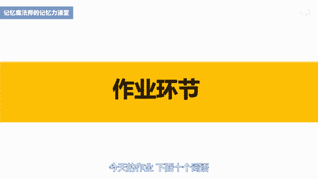

# 海马体记忆法：助你成为最强大脑 - P10：10 、【图像锁链】像锁链一样串记并列图像 - 清晖Amy - BV152tfe9Ev3

你好，我是记忆魔法师袁文魁，欢迎来到我的超强记忆力课程，让我们一起拥有超强记忆，创造学习奇迹，上一讲我们学习了俗语定桩法，它和我们之前学习到的数字定桩法，身体定桩法，还有地点定桩法，都是定妆法。

大家族的成员可以帮助我们，将大量的信息按照顺序来记忆，那今天呢我们将继续学到一种方法，叫做图像锁链法，他可以不借助外界的装置，就可以将信息按照顺序来记住，你小时候一定玩过成语接龙的游戏，比如亡羊补牢。

牢不可破，破釜沉舟，舟中敌国，国泰民安安居乐业，那成语接龙呢要求下一个成语的开头，是上一个成语的结尾，这样呢就像一条锁链一样，把这些成语连在一起，我接触过一个四岁的小孩子。

可以将上百个成语哗啦啦按照顺序背出来，那可见呢锁链是可以促进记忆的，而图像锁链法它原理和这个很相似，就是呢把记忆的信息转换成一个一个的图像，然后将这些图像如锁链一样串起来。

那连的方式呢一般通过彼此接触或者发生动作，比如打压敲等等，那将A和B连在一起，B和C连在一起，C和D连在一起，以此类推，那如果两两之间呢连接的比较紧密，就可以顺藤摸瓜的全部想起来，图像锁链法简单易用。

我教四岁的小朋友，他们都可以将20多个东西组成的锁链，牢牢记住，成年人也可以用来记忆多选题，简答题等，有很多要点的知识，我们先来体验一下，我会爆出十个词语，你先尝试死记硬背，看看能够记住几个脑细胞。

准备开始，飞机大树，猪八戒，投影仪，和尚坦克油漆酒瓶气球汽油好，结束了，你现在能够按顺序回忆起来，几个呢，告诉你大部分人呢只能想出五个左右，而且不一定是按照顺序的。

接下来我们通过图像锁链法来将它们链接起来，请仔细听好，并在脑海中想象出画面，飞机起飞时撞到了大树的树干，大树倒下来，压住了猪八戒，猪八戒拿起了钉耙，砸向了投影仪，投影仪射出强光，照向和尚的眼睛。

和尚用棒子撬起了坦克，坦克射出了炮弹，打中了油漆，油漆飞溅到酒瓶的上面，酒瓶的瓶盖射了出来，射破了气球，气球砰的爆炸了，点燃了汽油桶，火光漫天，现在请再次回忆一下，是否可以更好的回忆起来呢。

相信你只要用心听了，一定可以的，之前这些词汇就像一颗颗珍珠，你要一把抓住，可能容易漏掉，现在呢相当于是用线串成的项链，更容易一把抓住，图像锁链法的使用要求，一是必须要有具体的图像。

如果没有先使用鞋子开关重转换成具体图像，二是图像之间两两进行连接，A和B连接完之后，A就可以收工了，接下来B和C连接完了之后，B就可以收工了，以此类推，三是在连接时彼此接触，并且通过动作连接效果更好。

一般都是前一个对后一个发生动作，发生动作时最好是前一个比较有特征的动作，比如猪八戒用钉耙去砸和尚，用棍子来撬坦克，射出炮弹，当然呢有些东西要发出动作不容易，我们也可以通过静态的空间关系来连接。

比如房屋棉花眼镜手表鲜花这五个词语，可以想象在房屋外面种了一株棉花，棉花桑戴着一副眼镜，眼镜，中间挂着一块手表，手表的手，手表的表链里夹着一束鲜花，你如果能在脑海中依次呈现出来，也是可以记住的。

所以呢平时在进行图像锁链时，静态的空间关系和动态的动作连接，可以结合在一起来使用好，马上呢来看看实际的案例，先看一道地理常识题，那目前呢世界上面积最大的十个国家，依次是俄罗斯，加拿大，中国美国巴西。

澳大利亚，印度，阿根廷，哈萨克斯坦苏丹，这道题目的最佳记忆法呢，是后面要讲到的字头歌诀法，在这里呢我只是把它作为一个案例哈，来示范一下图像锁链法，按照图像锁链法的步骤。

第一步要将信息分别转化为具体的形象，俄罗斯可以由关键词第一个字，鹅想到谐音鸡鸭鹅的鹅，加拿大呢由他的国旗想到了枫叶，那中国啊，因为是龙的传人，所以想到龙，美国呢联想到了自由女神像巴西，想到了球王贝利。

澳大利亚，想到了悉尼歌剧院，印度通过拆盒的方式想到印则刻度的温度计，阿根廷由中间这个字根啊，就想到了树根，哈萨克斯坦中间的萨克斯号是比较有形象的，苏丹可以谐音响到了苏丹，就是我们必读书目的这样一个苏丹。

那第二步将这些按照顺序两两连接，好听好，鹅用力的扇动着翅膀，扇起了地上的枫叶，枫叶呢飘落到龙的眼睛上面，龙飞腾起来，用嘴巴吐出了火，点着了自由女神像的火炬，自由女神呢用火炬烧着了球王贝利的球衣。

那贝利呢一脚把球踢到了悉尼歌剧院，在歌剧院里面，伸出一根印着刻度的巨型的温度计，温度计插进了一棵百年老树的根里面，再量体温，树根上坐着一个音乐家在吹萨克斯，萨克斯吹出来了，很多的苏丹在漫天飞舞。

好第三步呢，我们就要尝试着回忆并且完善你的锁链，那有时候第一次想啊，并不一定能够很完美，我们还可以呢对局部的这个连接进行调整，然后在脑海中回想整条锁链两到三遍，再试着呢去回忆原来的内容。

那现在呢请你尝试回忆一下，如果有一些漏掉了，请你再回听一次，或者看看文稿，印象会更加深刻，我们想要熟练掌握图像锁链法，需要多进行一些基础训练，先从具体形象的东西开始，如果家里有小朋友的识图卡片。

可以呢随机抽出五张，尝试用图像锁链法进行记忆，记忆完后打乱顺序，尝试呢按顺序把它摆出来，那这个游戏呢大人和小孩一起玩效果更好，如果五张很轻松，就慢慢的增加张数，六岁的小朋友啊，一次记15张啊。

也是没有问题的，那幼儿和小学生一般在连接时，喜欢都用同样的动作，比如鱼杏仁核桃牛奶四张卡片，他会说鱼把杏仁给吃了，杏仁把核桃给吃了，核桃把牛奶给吃了，或者说鱼打了杏仁，杏仁打了核桃，核桃打了牛奶。

还有一种呢就是变声版，A变成了BB，变成了cc，变成了D那最后呢到底是谁变成了谁啊，一回忆都是蒙的，所以成年朋友要引导孩子，在连接时用某个东西的突出特征，比如鱼可以用尾巴甩到杏仁，或者呢由于会吐泡泡。

想到了鱼吐出了杏仁，基础训练做的多了，自然在实战时更加厉害，我们就再来看一个实战的案例吧，我对于探索自我比较感兴趣，接触过很多与性格有关的学科，比如DISC性格色彩学，MBTI职业性格测试。

还有九型人格，那九型人格呢，近十几年来风行欧美学术界和工商界，它是一种精妙的性格分析工具，帮助我们活出自己的天赋，同时学会与不同的人融洽相处，那科普我就不多讲了，先用图像锁链法来记住。

这九型人格到底是哪九个类型，那在不同的书籍里面呢，也有不同的翻译方法，那我选择的版本如下，第一型完美型，第二型助人型，第三型成就型，第四行自我行，第五行理智型，第六型疑惑型，第七型活跃型，第八型领袖型。

先尝试着把它们翻译成形象吧，完美，但很容易想到了舞蹈家金星，想到他举起两只手的食指说，完美助人，联想到了助人为乐的雷锋成就，联想到奥斯卡的终身荣誉奖，这样一个奖杯，自我可以联想到你自己理智谐音呢。

想到一种水果叫做荔枝疑惑，想到一个大大的问号，活跃可以想到了一条活的鲤鱼啊，平和可以倒过来，想到和平，联想到了一只和平鸽，接下来我们尝试串起锁链，想象金星举着食指说完美，然后呢用食指戳了一下雷锋的后背。

雷锋此时正在用抹布擦一个奖杯，奖杯从桌上掉下来，砸到了你自己，你自己啊，当时正在专注的吃荔枝，荔枝里的果肉喷出来，撞到了问号，下面那个点问号的弯钩的部位呢，勾住了一只跃龙门的活鲤鱼，好了，你只听了一遍。

尝试回忆一下吧，看看是否可以把九型人格按顺序背出来呢，记住这是第一步，如果你好奇你是哪一行，可以去找本九型人格的书看看哦，只有深入认识你自己，才能发挥出你的大脑潜能，好了我来总结一下今天的课程。

我们通过挑战世界面积最大的，十个国家和九型人格，熟悉了图像锁链法的步骤，一是要将信息分别转换成具体的图像，二是将这些图像通过静态的空间位置，或动态的动作进行连接，将它们串成一条彼此相连的锁链。

三是尝试回忆并且完善你的锁链，你get到这个新技能了吗，赶紧用起来吧，下一讲我们将学到情境故事法，今天的作业。

下面呢十个词语，请尝试用图像锁链法来进行记忆，和尚饮料，猪仙女坦克，书包水杯，孙悟空电脑奖杯，今天的课程就到这里了，请在文稿里查看今天的练习，并且把你的想法在评论区里留言，和同学们一起切磋交流吧。

也欢迎你把课程分享给你的朋友们，和他们一起拥有记忆魔法，成为最强大脑，为大佬赋能，让生命绽放，我是记忆魔法师袁文魁。

