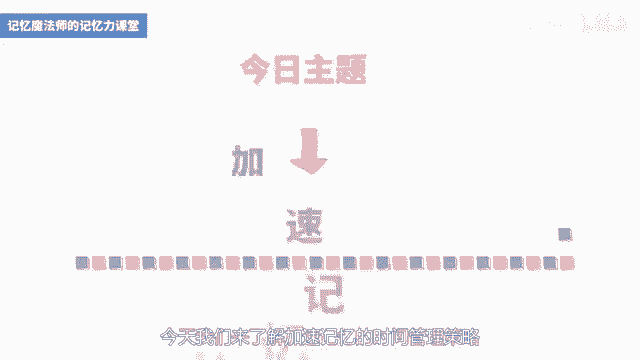
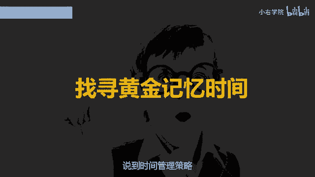
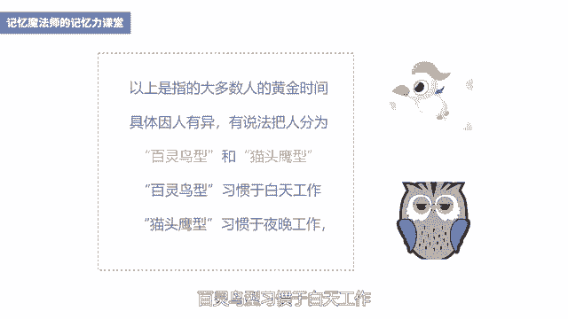
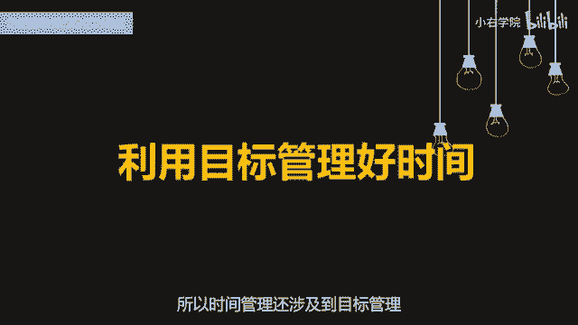
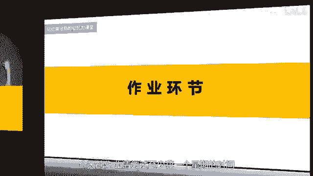

# 海马体记忆法：助你成为最强大脑 - P14：15 、 【时间】科学分配时间，提升记忆效率 - 清晖Amy - BV152tfe9Ev3

你好，我是记忆魔法师袁文魁，欢迎来到我的超强记忆力课程，让我们一起拥有超强记忆，创造学习奇迹，上一讲我分享了，让大脑进入最佳状态的三大法宝，分别是腹式呼吸，还有积极的自我暗示。

今天呢我们来了解加速记忆的时间管理策略。

学会科学分配时间，提升记忆速度，说到时间管理策略。

首先呢要来看黄金记忆时间这个问题，经常会有人问我老师什么时间寄东西效率最高，我的答案是因人而异，没有一个固定的时间点，在你精力最旺盛且注意力最集中的时候最好，那不过呢心理学家呢也通过统计研究发现。

有一些时间点更适合记忆，可以呢作为一个参考的依据，第一个时间点呢是早上起来以后，六点到七点，大脑呢经过了一夜的休息，正是呢电量最充足的时候，而且早晨呢干扰比较少，更容易专注静心。

适合记忆一些相对较难的东西，以及呢复习前一天所学的知识，我在背诵论语这本书时，就是每天早上五六点钟起床，室友们呢都还没起来，我就打着手电筒背，效率特别高，第二个时间点呢是上午八点到十点。

大脑的神经兴奋性提高，身体的激素分泌旺盛，精力比较充沛，逻辑思考认知能力和信息处理能力较强，那也是攻克记忆难题的好时机，第三个时间点呢是晚上的六点到八点，这个时间适合用来回顾和复习当天学过的东西。

如果是在晚饭之后消化食物，会导致大脑供氧不足而昏昏沉沉，所以呢我一般习惯于在饭后放松半小时，然后再小睡15分钟左右，补充精力之后再去记忆，效率会更高，第四个时间点呢是在税前，每个人的睡觉时间不同。

这个时间呢也因人而异，但是也要注意，如果你熬夜去记忆，疲惫不堪，睡眼惺松，效果也不会很理想，睡前更适合加深记忆的印象，对一些难以记忆的东西加以复习，科学家研究发现，睡着两个小时以后。

记住的东西呢遗忘的速度就会下降，所以我在高三时会习惯的在睡前去回顾，白天背诵的东西，刚才这些呢都是指大多数人的黄金时间，但确实呢要因人而异，以前呢很流行一种说法，把人分为百灵鸟型和猫头鹰型的人。

百灵鸟型习惯于白天工作。

猫头鹰型习惯于夜晚工作，比如很多大学教授或者作家，就喜欢夜深人静时写作，或者凌晨三四点起来写作，习惯了这种生活规律的人，记忆的黄金时间又完全不一样了，所以想要找到自己的记忆黄金时间，可以学习柳比歇夫。

他是前苏联昆虫学家，他写了一本书叫做奇特的一生，他56年如一日记住他的时间都去哪儿了，还用时间统计法来对自己做实验和探索，那我们也可以记录一下，你每天在什么时间段要去背诵，在背诵的时候的状态怎么样。

悲伤的效果怎么样，连续记录两周左右的时间，你就可以大致的摸到自己的规律了，以后在记忆的时候，把最难记的，最重要的内容放在你最佳的黄金时间点去挑战，在不是黄金点的时候呢。

就可以做一些抄写整理等一些不费脑的事情，找到了黄金记忆时间，还要看怎么样利用好时间，而这个呢与我们记忆的目标有关，所以呢时间管理还涉及到目标管理。

专家曾经做过一个测试，让两个即将参加中考的学生同时记忆一个材料，一个呢被告知仅仅是在做一个试验，另一个呢则被告知有可能是中考的题目，结果第二个学生的记忆成绩，远远好过了第一个学生。

当我们记忆的目标比较明确时，我们的大脑就会处于高度活动状态，接受外来的信息，相对主动，大脑皮层会留下更清晰更深刻的印象，目标管理在企业里谈的比较多的是smart法则，我在高中时呢便用它来用于学习和记忆。

S代表的具体只在考核的时候呢，要切中特定的指标，不能够太笼统，随便记点啥吧，就不如记英语单词，具体M代表着可以度量，也就是说指标是数量化或者行为化的，比如要记30个英语单词，就是可度量的。

A代表着可实现避免的，设立过高或者过低的目标，你想要在一个小时要记住1000个英语单词，作为初学者了就不太现实哈，所以目标要够一够，摸得着，R代表的相关性，指标呢是与本职工作是相关联的。

比如说学生考试要背单词是必须的，我以前呢有一个陈年学生，一听到了我讲课要讲英语单词，他就申请出去抽烟，他说我连26个字母都忘掉了，平时工作也不需要英语，这就是缺少相关性。

T代表着实现就是需要一个截止时间，比如30个单词，你需要多长时间记完，是30分钟还是50分钟，我一般习惯在记忆时设定时间节点，然后用手机倒计时，挑战在闹钟响起前完成，当我们有时间限制时，一是不会拖延。

二是会激发大脑的潜能，让我们的效率更高。

我在大学挑战背单词，也会把那smart法则用出来，那首先呢目标很具体，可量化，有实现，就是要在一周时间内，我要挑战记住6000个单词的六级单词书，那这个目标对我来说有点难度。

但是呢我觉得我是有可能挑战成功的，那为什么要挑战呢，以前我是讨厌背单词的，但是呢我学习了记忆法，所以呢我要挑战用它来训练自己的记忆法，那与我当下的学习是相关的，那我当时还和别人打赌啊。

没有完成就请他吃大餐，以激励我达成这个目标，那为了完成这个目标啊，还要进行目标分割，以及每天的时间安排，我基本上每天呢六点钟就起床了，晚上11点才睡觉，每天的有效记忆的时间在十小时左右。

我会了十个单词为一组，以组为单位进行记忆和复习，那每天呢要记多少组新单词，复习多少组，已经背过的单词，在什么时间点复习，什么时间点记忆，我都会详细的制定计划，并且呢及时的调整，如果没有这个目标的统筹。

今天心情好就寄，明天心情不好就玩，那是永远不可能完成这个挑战的，我后来呢还用这种方式啊，挑战记忆完易经五天呢，背完了孙子兵法，还有能安排世界脑力锦标赛的十个项目的训练，达成了世界级大师的目标。

那管理好我们的目标，才能管理好我们的时间，达成所愿，在时间管理里，最后一个问题呢是涉及到记忆活动的时间分配，第一个时间分配是集中时间记忆，还是分散时间记忆，心理学家曾做过一个测试。

将历史和经济的材料做实验，让被试者读2~4页，共读五次，读法呢分为两种，一种呢是一天读完五次，一种呢是每天读一次，共读五天，那一天读完五次呢，在一个月后回忆，结果呢能回忆起11。49%，那每天读一次。

分五天来读，能够回忆起了30。59%，可见的把教堂的学习任务进行时间切割，对于常识记忆的效果会更好，我们把这个策略呢称为少吃多餐策略，不要奢望的临时抱佛脚，一天搞定功夫呢，还是在平时的多次积累。

第二个时间分配，是花更多时间阅读，还是尝试回忆，科学家曾经做过一个试验，让三个同等条件的学生在同等时间内，即刚刚学过的一段内容，第一个同学呢把全部时间都用来阅读，第二个同学呢用一半时间阅读。

一半的时间背诵，第三个同学呢用1/5的时间阅读，4/5的时间背诵，结果第一个同学记住了1/3，第二个同学记住了1/2，第三个同学呢记住了2/3，有些学生在早自习背课文时，一篇课文朗读了20多遍。

但是呢真让他去背很多还是背不下来，我一般在读第二遍时就开始边朗读边回忆，我会了，眼睛看着前面尝试回忆，回忆不出来就飘一眼内容，第二遍时也是朗读为主，回忆为辅，接下来第三遍也许呢能回忆出大部分的内容。

这时把一些容易忘记的细节标出来，让我们的焦点放在这上面，被关注的信息更容易被回忆出来，那最后呢再复习两三遍，我们也许就可以百分百把内容复述出来，第三个时间分配，是不同记忆活动之间的时间统筹。

长时间的高强度记忆是非常耗费脑力的，我一般50分钟左右就会休息，可以吃个水果，补充一些水分和糖分，另外呢可以深呼吸小睡一会儿，或者呢做一些运动，让大脑重新恢复活力，这样劳逸结合效果更佳。

另外不同的记忆项目也要切换，比如背了50分钟英语单词，我会在休息后尝试背诵数学公式或定理，然后再背诵语文文章等不同的内容呢，可以刺激大脑的不同部位，让我们保持在相对兴奋的状态，不会产生倦怠感。

当然呢这种切换不是记几分钟英语，马上呢就切换成近几分钟文章，切换太过于频繁，也不太好，我一般呢在一个项目上会记30到，50分钟左右，这三种时间分配策略，虽然不是很炫酷的记忆方法。

但是呢却是非常有效的记忆策略，在我备战高考时发挥了突出的作用，而且呢上手很容易，只需要你在学习里多用几次就变成了习惯，让你的效率开始提升，好了，我来总结一下今天的内容，关于加速记忆的时间管理策略。

我讲了记忆的黄金时间，目标管理，时间分配三个方面，高效记忆的四个时间段，分别是早上六点到七点，上午八点到九点，晚上呢六点到八点以及睡觉之前，但是呢这个时间点因人而异。

可以呢尝试通过记录来找到自己的黄金时间，目标管理，我分享了smart法则在记忆里的运用，时间分配，我分享了如何分配记忆任务，如何把控朗读和记忆的时间，以及如何协调不同记忆任务之间的时间。

请你尝试用于记忆里面吧，下一讲我们将分享高效复习的策略，今天的作业请尝试呢。

至少花一个星期的时间来尝试，记录一下自己呢每天的黄金记忆时间，然后呢方便你以后安排你的记忆任务，今天的课程就到这里了，请在文稿里查看今天的练习，并且把你的想法在评论区里留言，和同学们一起切磋交流吧。

也欢迎你把课程分享给你的朋友们，和他们一起拥有记忆魔法，成为最强大脑，为大佬赋能，让生命绽放，我是记忆魔法师袁文魁。

