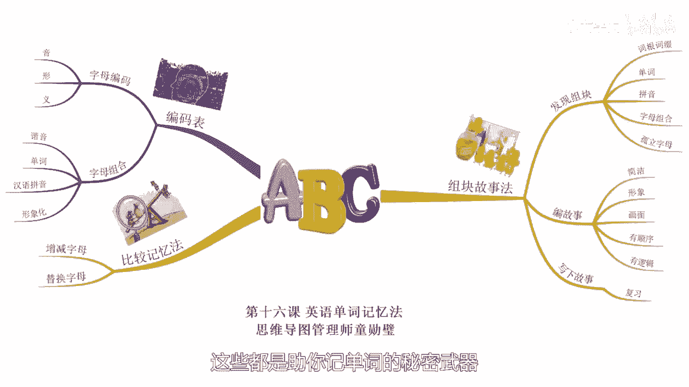

# 海马体记忆法：助你成为最强大脑 - P16：17 、【单词】想牢记海量单词，记忆法来助力 - 清晖Amy - BV152tfe9Ev3

你好，我是记忆魔法师袁文魁，欢迎来到我的超强记忆力课程，让我们一起拥有超强记忆，创造学习奇迹，前面三节课程我们学到大脑状态调整策略，时间管理策略和克服遗忘的科学复习策略。

从策略层面对大脑的记忆进行了衍生拓展，接下来几节课我们来看看记忆法的运用。

我一直喜欢说一句话，学习记忆法使用最为王，今天这节课呢先拿大家很多人的痛点来开刀，就是英语单词的记忆，无论是中高考还是大学四六级以及以后的考研，托福GRE1都绕不开一件事情，背单词，背单词难倒英雄。

汉武大理有位老师啊，要考博两年都栽在了英语上，那写作的时候，这个单词不会，那个单词不会到处都是，开着天窗，听力的时候呢听不懂，阅读的时候看不懂，只能呢靠瞎蒙，但没考上啊，就干脆想要放弃。

后来呢看到我的记忆魔法师这本书，讲如何记忆单词，他才信心大增，并且呢找回了记忆单词的乐趣啊，最终一发不可收拾，考上了武汉大学的博士，而我自己呢也曾经非常痛恨背单词，但是呢因为记忆法我又爱上了背单词。

如果你现在呢还没有成为单词记忆的达人，也许记忆法会是你的救命稻草，记单词难在哪里呢，意思单词很多，翻开单词书就头很大，此恨绵绵无绝期啊，二是非常枯燥，比起听段子来说，就像是嚼蜡一般。

三是单词和义词之间不太容易建立联系，记了又忘，忘了又记心塞，事实容易混淆，一个字母之差就会让人晕头转向，那最难的是大部分人消灭单词的武器，只有死记硬背，多一点，就是音标，还有词根词缀等等。

但是呢单此大军过于强大，要想奇袭，还得不按常理出牌，不择手段记住单词，新东方的创始人俞敏洪老师说，词汇量在两三千以下时，单词都是从学习中得到的，不需要考虑词汇记忆法的问题，那GRE1要背2万个单词。

就必须要有方法，他就是用各种记忆的方法用的非常的熟练，就曾经的背下过8万词汇，今天呢我就举例来分享两种单词记忆法，分别是组块故事法和比较记忆法，这些都和我们前面学到的方法息息相关，首先来看主快故事法。

所谓的组块就是我们非常熟悉的单词，字母组合，词根词缀等，那我们通过观察发现它们，然后呢，将这些主块以单词的意思一起串成一个故事，先来看两个例子，比如犹豫这个单词啊，H e s i t a t e。

那可以看到里面呢有熟悉的组块，HE是他SIT是坐ATE是吃的过去式，我们可以串成一个故事，他坐下来犹豫到底要不要吃，那可能呢他正在节食好，下一个单词呢是capacity啊，是容量CAPACITY。

那在电梯里面一般会看到这个单词里面的组块，有CAP是帽子的意思，A啊就是一个CITY就是city城市的意思，我们可以想象一个画面啊，一个非常大的帽子啊，他可以大到的把一个城市都给盖上。

那这容量可是真大呀，我们在记忆的时候呢，主块越少就越容易记忆，有联系的故事啊，也更容易记忆，所以的话呢通过这样的方式来记单词，既简单又有趣，但可能你会说，并不是所有单词都能够完全拆成这样的组块呀。

对比如呢单词SINGE，这个意思呢是烤焦里面有我们熟悉的单词啊，SING就是唱歌的，唱歌的里面有我们熟悉的单词啊，sing啊，也是唱歌SING，但还多出来一个E，那这个E的话呢我们也要变成形象哈。

才好去编故事，所以呢有E我想到了拼音啊，鹅于是呢就可以编成这样一个故事啊，一个唱歌的人把一只鹅放在烧烤台上烤焦了，对于26个字母，我们可以来将它们编成形象的编码，通过音形义等方式。

比如A联想到了相关的单词，apple苹果，B由拼音的读音想到了写字的笔，C由形状想到了弯弯的月亮，S由形状想到了一条蛇，那我在文稿里提供了一套字母编码表供你参考，熟悉以后呢，你就可以马上用起来。

比如说我们要记住一个单词啊，spark s p a r k火花，这个单词那可以变成组块S啊，我们想到蛇PARK是公元，想象了一条蛇在公园里面前行速度太快了，在地上呢擦出了火花，那有了这套字母编码表。

你可能会安心一些，但是呢如果单词有六个字母组成，如果呢没有熟悉的单词，是不是要把六个编码都编成一个故事呢，这样是不是太麻烦了，当然咯考虑到了主块最早化，那我们一般除了寻找熟悉的单词，还可以借鉴拼音。

比如吉他这个单词啊，GUITAR前面的三个字母，GUI想到价格非常贵的这个贵，或者想到了跪在地上的这个贵，还比如单词啊，纠纷它是TANGLE可以想到的，前面是TANG，后面是LE。

想到拼音就想到烫了服务员端咖啡的时候呢，把你给烫了啊，然后你们之间就产生了纠纷，那除了拼音，还有呢经常会出现的字母组合，比如前缀和后缀，它们有些呢是有具体的形象，有些呢还比较抽象。

所以呢我们也可以把比较抽象的变成编码，我也有一套呢常用的字母组合编码表，在文稿里供你去参考，那更多的编码呢还需要你在实践中去补充它好，我分享其中的一些编码，AB可以想到了阿爸哈拼音，想到你的爸爸的形象。

那AP呢可以想到了阿婆啊，想到你的奶奶的形象啊，a AD想到a AD钙奶，AL想到了阿里拳王阿里AR想到了矮人啊，七个小矮人这个形象，AU想到了AUSTRALIA，澳大利亚。

想到了犀利歌剧院的这样一个形象，BR想到了brain，大佬好了，其他的大家可以来看看文稿，那这些字母组合的编码产生的方式啊，一是用谐音，比如说TION和SION，都是表示名词的后缀，可以分别谐音。

定义成神神仙的神和神大神的神来区分，二是联想到相关的单词或者形象，比如说GL可以联想到了glass玻璃，AD可以联想到AD钙奶，三是利用汉语拼音，有些本身就是完整的拼音，比如see u chu。

另一种呢是拼音的声母组合，比如说pr可以全拼为辅人，FR可以全名为芙蓉四，是形象化，比如OO像眼镜，OLO呢像奥特曼，那这种呢相对会少一些，好我来举两个字母组合编码运用的例子。

生产制造这个单词呢是PRODUCE，那可以拆分成组块，PRO呢它的编码是我们读音哈，读成pro pro，可以谐音呢变成东坡肉哈，作为编码，那DU可以呢想到拼音堵车的堵C1，它的拼音呢是厕所的厕，好。

现在想象一个故事哈，在饭店里面生产出来的东坡肉，然后呢堵住了厕所里面的冲水马桶，又比如COMPARE，比喻这个单词coo m的编码呢是computer电脑，PARE由拼音想到了怕热，那比喻这个可以了。

谐音联想成呢是比目鱼，想象一下你的电脑怕热，他投进了鱼缸里面去降降温，比目鱼都游过来去争抢电脑，好，这两个单词都记住了吗，这里呢我们小结一下使用组块故事法的步骤，第一个呢是要观察发现里面的组块。

尽量让单词呢拆分成最少的组块，可以按照词根词缀拼音和单词字母组合，孤立字母啊这样的优先顺序来进行拆分，那有些人能够用词根词缀来逻辑联想的，就不需要刻意使用编码。

比如com p o s e很容易想到com是前缀共同的，poo se e的词根呢是摆放，那共同摆放就是在构成新的布局，第二步，将拆分的组块和单词的意思一起编成一个故事，故事要求简洁形象。

在脑海中要浮现出画面，并且尽量按照组块的顺序来编，注意呢故事的前后逻辑要合理，故事呢尽量选择一定的场景，比如10spark火花就可以讲到了你熟悉的公园，那犹豫这个单词呢就可以想到在一个餐厅里面。

第三步把故事写下来，以备复习时使用，同时呢请尝试回忆故事，并且呢拼写出单词，同时呢说出单词的意思，那当我们多次复习之后呢，单词就可以脱口而出，那这个故事啊就可以过河拆桥，就可以把它丢掉了。

好那再来看看比较记忆法，我们在记忆新单词时，可以看看呢和哪些熟悉的单词比较接近，是增减的字母还是替换的字母，就比较容易记住了，那如果再刻意联想一下，印象就会更加深刻，先来看看增减字母的例子。

比如FUND专款，就可以联想到FOUND创办这个单词，也就是find过去式，减少了O这个字母的编码呢是鸡蛋，想象一个故事啊，一个大富翁呢拿出了一个专款啊，然后创办了一个鸡蛋基金，专门用来买鸡蛋。

好比如S1A2是凋谢这个单词，那我呢先认识的是search se1A二，CH寻找这个单词，那少了CH这两个字母，可以联想到的字母组合编码啊，CH呢是水池，想象一下，我为了使花不要凋谢。

到处去寻找水池来浇水啊，终于找到了好，再看看替换字母的例子，比如说MUDDLES混浊，我想到了MIDDLE中间这个单词，那不一样的部分呢是U编码呢是水杯，我编了一个故事哈，在水杯的中间滴了一滴墨水。

就会使水杯里的水浑浊了，再比如BATTE2炮击这个单词，我会联想到了BETTER更好这个单词，那不一样的部分呢是A编码是苹果，想想有两个苹果，其中一个是烂的，一个呢是更好的用大炮来炮击那个更好的。

两个了，就一样烂了，用这样的比较方式，还可以将好几个单词放在一起来对比，比如说COAST海岸，BOAST吹牛，ROAST烘烤TOAST吐司，那这四个单词后面都是以OAST结尾的。

只有前面的一个字母不一样，比较容易混淆，我们可以呢这样来联想记忆，C形状呢就像海岸线一样，那B的形状像喇叭，可以呢拿着喇叭来吹牛，R的形状呢像烤东西的这个叉子，同时呢RO哈可以呢拼音响到肉哈。

所以想到烤肉T呢则是吐司的吐的声母，诶这样呢一联想一区分，相信呢大家会很深刻的对比来记住这四个单词，关于英语单词记忆的方法呢，其实还有很多抛砖引玉，希望引起大家的思考，去发现呢更适合你的英语单词记忆法。

当然呢任何一种方法都需要大量的实践，才能够熟练掌握，请至少用记忆法了来记住1000个单词，你就会越来越有感觉，那曾经我有学员呢通过练习啊，一个小时就可以记住100多个生词哦，好了我来总结一下今天的内容。

主要是分享了两种英语单词的记忆法，包括组块故事法和比较记忆法，同时呢，我分享了我的字母编码和字母组合编码表，这些都是助理记忆单词的秘密武器。

行动起来去记吧，愿你爱上记单词，通过学好英语迈向国际舞台，今天的作业请尝试用记忆法来记下面五个单词，第一个单词突然的ABRUPT，第二个单词缺乏的SCARCE，第三个单词栋梁PILLAR。

第四个单词喜剧COMEDY，第五个单词外壳CRUST，今天的课程就到这里了，请在文稿里查看今天的练习，并且把你的想法在评论区里留言，和同学们一起切磋交流吧，也欢迎你把课程分享给你的朋友们。

和他们一起拥有记忆魔法，成为最强大脑，为大脑赋能，让生命绽放，我是记忆魔法师袁文魁。