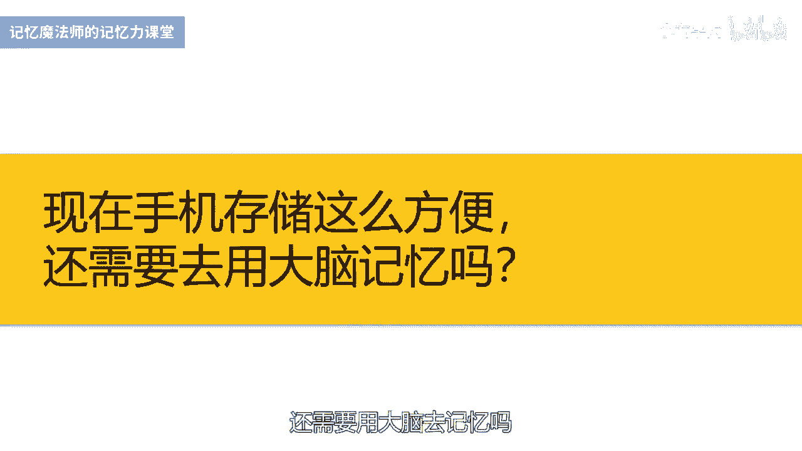
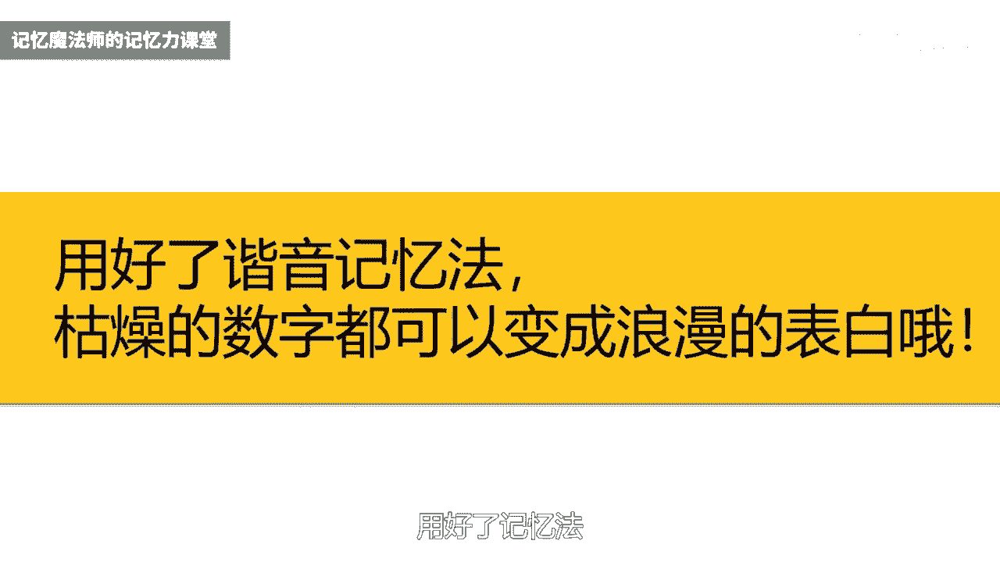
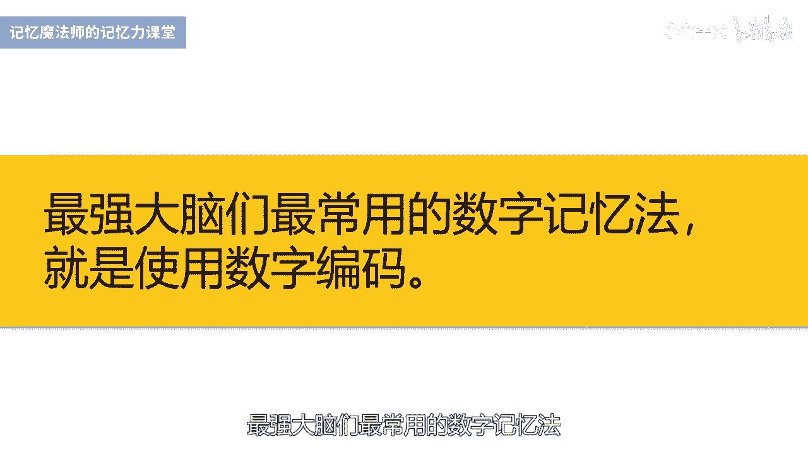
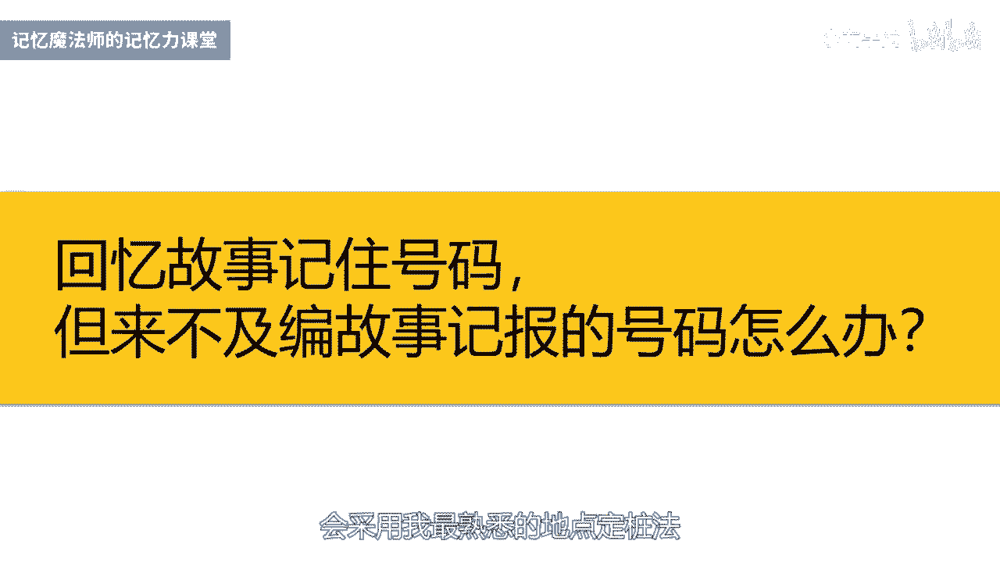
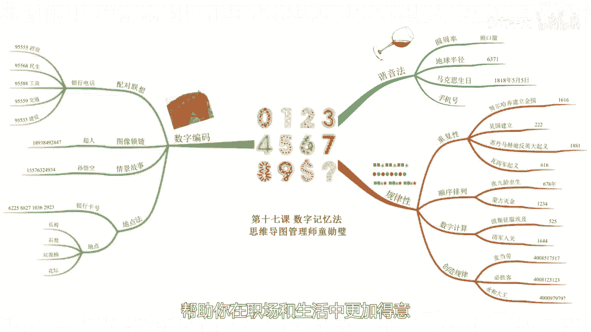

# 海马体记忆法：助你成为最强大脑 - P17：18 、【数字】无规律各种号码，这样轻松秒记 - 清晖Amy - BV152tfe9Ev3

你好，我是记忆魔法师袁文魁，欢迎来到我的超强记忆力课程，让我们一起拥有超强记忆，创造学习奇迹，上一讲我们学习到英语单词的记忆，今天呢我们来看一个困扰很多人的记忆难题，就是数字信息的记忆。

我前不久啊出国参加摄影活动，在飞机上有乘客呢就把座位号给记错了，非得说我的位置是他的，他说我怎么会记错，一看机票才发觉尴尬了，他是26排，我才是27排，那在摄影采风期间呢。

我们每天晚上都要去老师的房间里面分享作品，那有的学员呢去过了几次，还会在群里面问诶，请问是534还是543呀，我忘记了，可见啊，日常生活中短短的两三位数字都会难倒英雄汉，更别提呢去记六位数的密码。

11位数的手机号码，18位数的身份证号了，不过呢拥有的记忆法，这些啊都是小菜一碟了，但是有人会问，现在手机储存这么方便，还需要用大脑去记忆吗。

武汉的楚天都市报曾经有一篇报道，一名男子啊赴约会的时候手机没电了，想打公用电话呢，却发现不记得女友的号码，回去以后啊，充好电再打的时候就被甩了，因为谈了一年的恋爱，居然没有记住号码，这肯定不是真爱。

终身大事被耽误了还算是小，如果了关键时刻手机丢失了或者了没有电了，又处于危险的地方的时候，想要求助，连一个号码都想不起来，是不是可能会丢掉性命呢，所以一些重要的号码还是需要时刻牢记。

关键时刻可能会救你一命，数字记忆的方法呢，大家熟悉的有两种，一种呢是谐音法，很多人可能都听过背圆周率的段子，一位教书先生喜欢到山上找庙里的和尚喝酒，在走之前呢，留给学生的作业啊都是一样的，背诵圆周率。

有一位聪明的学生啊，编了一段谐音顺口溜，三颠一寺一壶酒，3。14159，乐而苦塞，526535，把酒吃，897932932，杀不死，38462646264啊，就把它给记住了。

我来分享三个呢谐音法实际运用的例子，比如地球的半径是6371千米，可以谐音成牛上起义，想象呢期待刘上起义的人，连起来有地球半径那么长好，再比如啊马克思出生于1818年5月5日。

想象的马克思出生时一耙一耙的，呜呜呜的在地上哭着，那手机号码也可以这样来记哈，我曾经用过一个号码，13971125917，谐音成医生就取一，要爱我就一起，那这个号码用来求婚再好不过了，后来结婚后呢。

我换了新号，尾数呢是老婆的生日，前面的选择的是1365，代表的是一年365天，那中间的数字啊，我就用谐音选择了983，谐音为旧磅，上一年365天就傍上了，我老婆代表一生一世在一起，这个号码够浪漫吧。

用好了记忆法。

枯燥的数字啊也可以让生活变得更有乐趣哦，第二种方式呢是规律法，就是设法找到数字排列的规律来进行记忆，在即历史年代时，有些年代呢数字是重复的，比如22年吴国建立，1616年努尔哈赤建立金国。

还有一些数字呢是对称的，比如说1881年苏丹马赫迪反英大起义，616年瓦岗军起义，还有一些呢是按照顺序来排列的，比如678年，唐代诗人张九龄出生，1234年，蒙古灭金，另外数字计算呢也可以用起来。

比如公元前525年，波斯征服了埃及，五的平方是25，1644，清军入关，16呢等于4×4，这样发现规律了，记忆就容易很多了，创造规律，让别人更容易记住，也是很多商家选择号码要考虑的。

比如麦当劳的号码4008517517，谐音呢，我要吃，那重复了两次，517517就非常有规律，必胜客呢也是4008开头，它采用的是按顺序排列的，123123，这个就更容易记住了。

永和大王的400097979797呢，重复了三次，也减少了记忆的难度，除了谐音和规律法之外，最强大佬们最常用的数字记忆法。

就是使用数字编码来辅助记忆，我在文稿里再次提供了编码供大家参考，当仅仅只出现了两位数字时，只需要将数字编码以对应信息配对联想即可，当出现较多的数字要记忆时，可以通过图像锁链法。

情境故事法或者地点定桩法来进行记忆，先来看一个简单的应用，我们很多人都有不同银行的银行卡，有时候在记客服电话时会混淆，一般呢银行都是955开头，剩下的两位数字是不同的。

我们就可以呢将数字编码与银行的名称来配对，联想，我举五个银行为例，你尝试着听一遍，看是否可以记住，招商银行呢是9555555的代码呢是火车，想象一位商人呢乘坐着火车去外地招商引资。

民生银行呢是9556868的代码是喇叭，那民生呢可以想到人民和花生，想到了人民群众啊，拿着喇叭在吹，那吹出了一颗一颗的花生，工商银行的是9558888的代码，是爸爸想象了大头儿子。

小头爸爸里面的爸爸在上班的时候受伤了，所以呢是工伤，9559是交通银行，五九的代码是吴工，想象有一只巨大的蜈蚣，让人们都骑在它的背上面，把它当成是交通工具，95533是建设银行的。

三三的代码是三三的红星，想象一下满天都是星星，建筑工人们还在披星戴月的建设大厦，好了，我们来回忆一下啊，工商银行的电话号码是多少，好对9588，招商银行的电话号码是95555啊。

对交通银行电话号码是9559啊，吴工建设银行的电话号码是9533哈，闪闪的新西下还在建设好，95568是哪个银行的，六八是喇叭，好对，是民生银行哈，人民吹出了很多的花生，好了接下来难度就要升级了。

我们要记11位数字的手机号码，那下面这些举例啊，都是虚拟的号码，我们采取的方法呢是第一位，一不用记后面的十个数字呢，可以变成五个编码，然后编成故事来记忆，先来看看超人的手机号码，18938492847。

那八九的编码是八交，三八呢是妇女，四九是狮狗，二八是恶霸，四七是司机，好我们以超人为主角来编一个图像锁链哈，想象了超人呢撞到了一个芭蕉树上面，那芭蕉树倒下来，砸到了妇女的头上，妇女呢一脚踢飞了一只狮狗。

狮狗咬到了恶霸的屁股，恶霸的一拳打晕了司机，我们在脑海中呈现出这个画面，那一环一环的来回顾每一个图像，然后尝试呢回想这个号码好，我们首先呢超人创造的是芭蕉树，芭蕉树呢是八九，芭蕉树砸到的妇女啊。

妇女是三八好，然后踢飞了四狗呢是四九好，四狗咬到了恶霸，恶霸是二八，恶霸的打晕的司机啊，司机是四七，那所以呢手机号码是189，38492847好，那我们再来举一个情境故事法的例子。

假设呢大闹天空的孙悟空的手机号码是幺五，576324934，那编码呢分别是五五火车七六汽油桶，3232494狗，343条丝巾，好变成一个故事啊，孙悟空呢乘坐着火车撞到了一个汽油桶上，顿时浓烟四起。

火光漫天，悟空呢手拿着扇儿想要去扑灭大火，火势呢却越来越大，此时跑来一只狮狗，甩出身上的水来救火，火灭之时，狮狗也满身都是烧伤，那悟空呢用三条丝巾给它进行包扎，好的回想一下细节哈。

看看呢是否可以把这个号码呢把它写下来，它是15576324934，那一般情况下在接电话的时候，听到别人报手机号码，我来不及编故事的时候呢，会采用我最熟悉的地点定桩法。

一般大家报手机号码都是分段的，有些人习惯呢344，比如15576324934，它会报成15576324934，那此时的我用三个地点就可以了，第一个地点呢记住了五五，接下来分别记住7632和4934。

有些人的习惯呢是443，比如13971125917，那分别拆成编码是一三，医生九七旧旗一一梯子，252胡九一，求一七镰刀，这三个地点呢也够了，那地理定算法呢，一般呢是用来记更大量的数字的。

比如说记银行卡号，有的时候啊丢了银行卡，不记得卡号，口头挂失挺麻烦的，而且你的卡掉在地上，别人捡到了，你都不敢确认是你的，因为你号码报不出来呀，我就以招商银行的20位卡号为例。

6225882710362923，假设我们使用的是公园里面的四个地点，来进行记忆，分别是长椅，石凳，垃圾桶花坛，第一组6225代码是牛二和二胡，地点是长椅，好想象在长椅上面坐着一头牛耳。

现在呢用两个蹄子啊拉二胡，那很多人都在围观鼓掌，第二组8827，那代码是爸爸和耳机，地点呢是石凳，想象一下爸爸在石凳上戴着耳机，但是耳机没有声音，所以爸爸的愤怒的把耳机啊在石凳上摔碎了。

第三组1036代码是棒球棍和三怒，地点呢是垃圾桶，乡下呢棒球小子啊，拿着棒球棍把山路的鹿角打断了，掉进了垃圾桶里面，第四组2923代码呢是恶求和和尚，地点呢是花坛，香香在花坛的上面呢。

恶囚啊用自己的脚镣砸向了和尚，和尚呢用铁头功给顶住了，通过这四个电影上的四组画面，你来尝试回忆一下长椅石凳，垃圾桶花坛，每个地点分别是什么数字呢，好的啊，可以来尝试着跟着我一起来核对一下啊。

看是不是长椅上面是6225，时桌上面是8827，垃圾桶上面是1036，花坛上面是2923，而如果你能够将这么长串的号码都记住的话，你要想像记忆大师一样啊，几分钟记住几百个数字就非常容易了。

其实他们呢只是掌握了更多的地点，并且呢经过了专业的训练，达到了极致而已，好了我来总结一下今天的内容，针对数字信息的记忆，我分享了常用的两种方法，即谐音法和规律法，也重点分享了数字编码来记忆数字的方法。

综合运用了配对联想法，图像锁链法，情境故事法和地点定桩法，里面举了历史年代手机号码，银行卡号等作为例子，只要你掌握了这些技巧，一切数字都可以轻松搞定，帮助你在职场和生活中更加得意。

银行卡里面的数字蹭蹭往上涨，今天的作业谨记以下名人的生日，孔子呢生日是9月28日，李白的生日是2月28日，冰心的生日是10月5日，今天的课程就到这里了，请在文稿里查看今天的练习。

并且把你的想法在评论区里留言，和同学们一起切磋交流吧，也欢迎你把课程分享给你的朋友们，和他们一起拥有记忆魔法，成为最强大脑，为大佬赋能，让生命绽放，我是记忆魔法师袁文魁。

