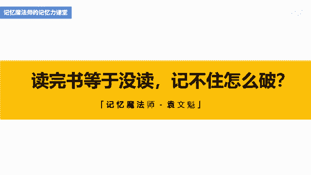
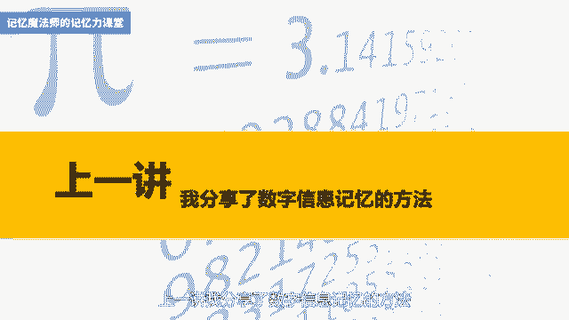
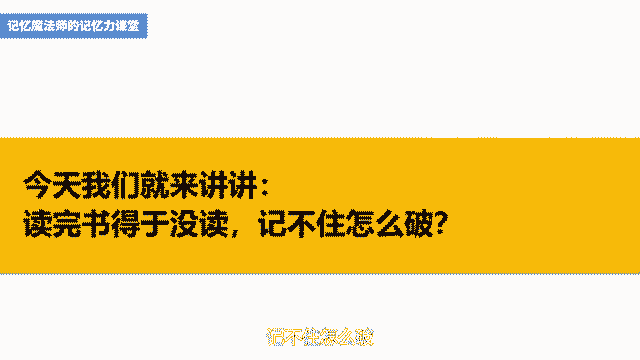
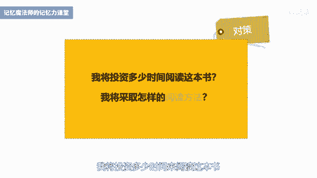
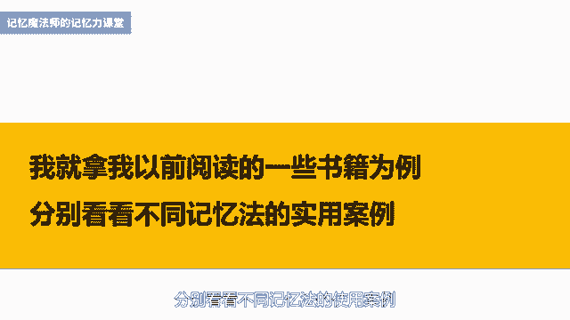
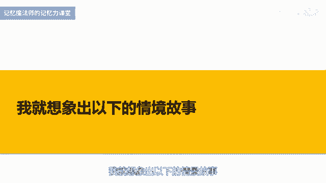
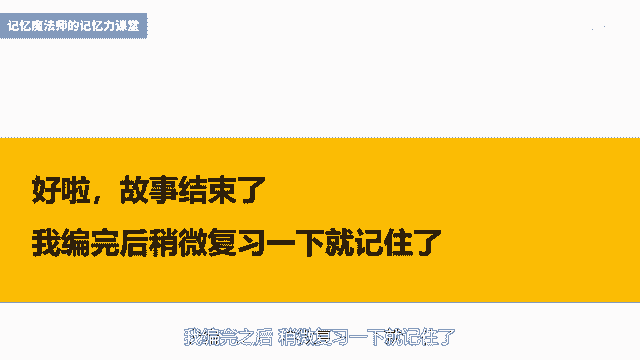
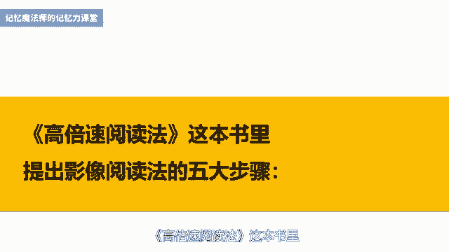
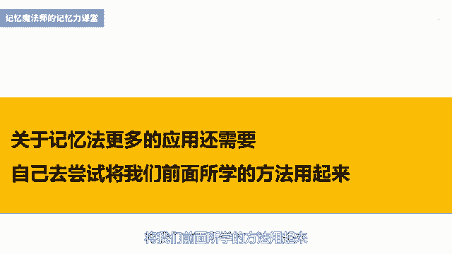

# 海马体记忆法：助你成为最强大脑 - P18：19 、 【阅读】读完书等于没读，记不住怎么办 - 清晖Amy - BV152tfe9Ev3

你好，我是记忆魔法师袁文魁，欢迎来到我的超强记忆力课程，让我们一起拥有超强记忆，创造学习奇迹。

上一讲我分享了数字信息记忆的方法。

这一讲呢我来讲讲，很多学习者都困扰的一个问题，看了一本书，过了几天都不记得书里讲了啥，甚至呢再过一段时间连书名都不记得了，我有个朋友啊，很瞧不起大学室友，每天打游戏，让他好好多读点书，那室友决定听他的。

就问他，那你读了那么多书，可不可以推荐我几本，结果啊，这位朋友能够想出来书名的居然只有一两本，更别提内容了，真是尴尬呀，今天呢我们就来讲讲，读完书等于没读。

记不住怎么破，首先呢我们要知道读书一定要全部记住，这本身就是一个误区，这种思维呢还停留在小时候背诵全文的阴影里，有很多人呐把读书当成是一件很严肃的事情，他们呢陷入一个魔咒，有一种奢望。

只读一次就能把书里的内容印刻在脑海中，世界记忆冠军呢也不可能，看完一遍书以后就过目不忘，能够把所有的内容细节全部记住，这个太恐怖了，是一个不太可能实现的目标，那至少呢目前全球所有记忆大师。

我没有发现一个人可以做到，即使是一篇几百字的文章，要再看一遍，完全记住也是不太可能的，我很喜欢日本作家印南敦史的观点，读书的真正意义并不在于复制百分之百的原文，而在于邂逅1%的收获。

没有记住大部分的内容，从另一个角度来看，也就是记住的内容都是对自己有益的精华，总有些内容会留在记忆的某个角落，至少这一部分对自己来说是有用的，读书的收获正在于此，所以啊放掉对于读书一定要全部记住的执着。

是我想要分享的第一个观念，第二点就是大部分人读书是没有带着目的的，拿到书就开始逐字逐句的阅读，如果你觉得所有都是重点，就相当于没有重点，所以啊我们要带着问题来阅读，当你的问题越具体的时候。

你就越知道你想要的是什么，那这个时候呢你的记忆的效果就会更好，我在做英语和语文的阅读理解题时，会习惯的把题目啊全部都提前看完，然后再去阅读原文时，就会快速阅读，并且提取里面跟题目有关的讯息。

带着问题来阅读，我的阅读效率会更高一些，每次在阅读之前啊，大家可以看看封面封底目录序言，并且呢翻阅整本书，看看里面的彩图和大标题，那对于整本书有一个概览，我称之为多维鸟瞰阅读法，然后呢。

你可以提出五个问题，一主题，这本书的主题是什么，这个主题是我感兴趣的吗，我对它有多少了解，二观点，作者的核心观点是什么，作者有资格就此来写书吗，三关系，这本书和我有什么关系，我为什么要读这本书。

是问起围绕这本书，我发现了哪些关键词，将获取哪些信息，解决哪些问题，五对策，我将投资多少时间来阅读这本书。

我将采取怎样的方式来阅读这本书，当我们在阅读前已经经过这样的思考，就会更有针对性来阅读，那些不太符合我们目标的内容，大脑就会自动忽略，不仅节省时间，而且与问题有关的就会记得很深刻。

第三啊是需要对书籍的内容进行加工整理，可以看完一章就尝试回忆一下内容，再通过做笔记或思维导图等形式来强化，我平时呢做读书笔记，会把精彩的部分一个字一个字敲到电脑上，虽然呢拍照转换成文字的工具啊。

比较强大，但是呢自己动手印象会更深刻，那如果在做笔记的时候，还加入了自己的一些理解的话，这个效果会更好，比如写一句自己的心得感想，联系你的生活经验，想想这个知识以后怎么样去运用等等。

第四个呢是通过输出来倒逼输入，这是这几年很流行的一句话，就是通过向外去输出内容，包括写作，讲课交谈等各种方式来输出来，倒逼你去阅读，如果你想要跟别人分享一个主题，那么你在阅读这方面书籍的时候。

你就会更加集中注意力，你的注意力集中的地方，你记忆的效果当然也会更好一些，第五个呢就是尝试使用记忆法，对于很多涉及到比较抽象庞杂无序的信息，只是通过上面这些还是不行的，还需要结合各种记忆法来记忆。

我就拿我以前阅读的一些书籍为例，分别看看不同记忆法的使用案例。

一形象记忆法，针对书籍里面比较零散的要点，比如提到的某些重要的人名，地名，专有术语等，或者某些比较抽象的知识要点，可以通过形象转化来记忆，也可以结合绘图记忆法，比如如何高效阅读这本书里面呢。

这一页的内容里面的信息，压缩这个关键词我觉得比较有价值，想要重点去突出一下，所以画了一个压缩包的形象模型纠错，我画了一个正方体代表模型上面打了一个叉，代表错误，然后呢画了一个向上的箭头。

代表纠正以项目为基础的学习，我就画了一个项链上面的眼睛，代表项目，二配对联想法，我在读到sport团队引导这本书的时候，绘制了一张思维导图，左上角动机价值观，这个部分。

后面就涉及到了四组信息需要的配对联想，蓝色对应的是培养型和利他，我就画了一个蓝色的立德的吉他，立在了一个培养皿里面，红色对应的是指挥型，自信画了一个红色的一封信，拿着指挥棒在指挥。

绿色呢对应的是字字型和分析，想到了一个绿色的人，它身上长着痣，拿着一个显微镜在分析，那最后一个呢HUB对应的是聚合型和弹性，HUB哈想到了胡巴的拼音，它通过了一个弹簧跳到了一个盒子里面，代表着聚合。

三情境故事法，我很喜欢一本书叫做生命的重建，里面有一章讲到活出生命富足状态的八大秘诀，一期望过上富裕生活，二清理负面和杂乱的思想，三爱上账单，四为他人的成功富足感到高兴，五视觉化想象财富的大海。

六张开臂膀接受财富，七财富如流水流出才能流进，八接受别人的赞扬，我就想象出以下的情境故事。

想象到你自己拿着望远镜在望着富人的家庭，这就是你期望过上了富裕生活，看完你放下望远镜，把你脑海中杂乱的思想写下来，都扔进了垃圾桶里面，这个时候你发现垃圾桶里居然有一张账单，你以前很讨厌账单。

现在呢你对着他吻了一下，非常爱他，然后你走出门，对着你的妇人，邻居微笑对他说，真为你的成功富足感到高兴，妇人带着你一起来到大海边，大海里面有很多很多的钱，你看着这些钱，然后张开双臂去迎接他们。

这些钱就像流水一样流进你的身体里面，然后从你的身体里面流出来，也流到了你的亲戚朋友那里，他们都给你竖起大拇指来点赞好了，故事结束了，我编完之后稍微复习一下。

就记住了，你呢试试看吧，四定桩联想法，对于超过八个信息的，我一般会使用定桩联想法，比如高倍数阅读法，这本书讲到主题阅读法，操作步骤有十个，一设定目的，二列书单，三影像翻阅，四同主题思维导图。

五找出相关内容，六用自己的语言归纳，七发现相同点和不同点，八总结论点，九形成自己的意见，十确立自己的观点并写报告，我当时是使用的地点，定桩法用的是文稿里这张图片，房间上的十个地点，第一个是左上角的花瓶。

第二个地点是玩具小熊，第三个是床头的电话，第四个是枕头，第五个是瓶中的插花，第六个是柜子上面的书，第七个是书桌的桌面，第八个是桌下的抽屉，第九个是红色的椅子，第十个是圆形的桌子。

第一个地点华平要记的是设定目的，可以想象到你手拿着石头把花瓶作为目的地，要投进到花瓶里，第二个地点，玩具小熊要记得是列书单，想象玩具小熊嘴巴里含着一张书单，第三个地点是电话，要记得是影像翻阅。

想象要打电话了，打开电话本，快速翻阅里面的电话号码，像影像一样进入到你的大脑里，第四个地点是枕头，要记的是同主题思维导图，可以想象呢，在两个枕头上面各画着一张思维导图，而中心图呢都是猪蹄。

好我就举这几个为例吧，你可以尝试着继续往后挑战五字头歌诀法，我在读学习力这本书时，作者呢主要讲了，帮助我们精于骑士的四种心智技能，也就是耳律模型ANEW那A呢代表的是理想，N是代表着中立客观的自我评价。

一是永无止境的好奇心，W愿意从X开始，那我挑取了每一个里面的关键字，理想挑取了理中立客观的自我评价，挑选了评永无止境的好奇心，挑选了奇，愿意从X开始，挑选了叉，就变成了礼平其差，谐音为礼平其差啊。

这个礼呢就是礼我的礼，可以理解为呢你给的差评啊，真的是出奇的差，高倍速阅读法，这本书里提到了影像阅读的五大步骤。

第一个呢是准备，第二个是预习，第三个是影像翻阅，第四个是复习，第五个是激活，我挑取的字头是准预翻覆积，谐音为准余范覆饥，想象一个准备要当鱼贩子的人，他在秀身上大块大块的腹肌好了，关于记忆法呢。

我就举例到这里，更多的运用还需要你自己去尝试，将我们前面所学的方法用起来。

我来总结一下今天的内容，我分享了让我们读书记住的五种方法，一是不要期待要完全记住，二是带着目的和问题来读书，三是读书后要加工整理，四是通过输出倒逼输入，五就是使用记忆法。

我以不同的记忆方法分别举例做了说明，当你下次再阅读书籍时，请尝试训练一下吧。

今天的作业请呢挑选任意一本你喜欢的书籍，用上面的方式来挑战阅读，并且呢分享其中一个，你使用记忆法来记忆的案例，今天的课程就到这里了，请在文稿里查看今天的练习，并且把你的想法在评论区里留言。

和同学们一起切磋交流吧，也欢迎你把课程分享给你的朋友们，和他们一起拥有记忆魔法，成为最强大脑，为大佬赋能，让生命绽放，我是记忆魔法师袁文魁。

